Progetto Network Data Analysis (MD2SL)
================
Mirko Verardo
21 luglio 2025

L’idea del progetto è quella di applicare gli **Stochastic Block Model
(SBM)** per fare **clustering** all’interno dell’anagrafica articoli di
un’azienda specializzata in ambito ecommerce.  
Il progetto consiste quindi nel costruire 2 diversi grafi, fare
clustering applicando gli SBM e confrontare i risultati così ottenuti
con quelli di un algoritmo più “tradizionale” di **Greedy Clustering
(GC)**.

``` r
# libreria per manipolazione dati
library(tidyverse)
# libreria per manipolazione plot
library(ggplot2)
library(extrafont)
# librerie per manipolazione grafi
library(igraph)
library(ggraph)
library(tidygraph)
library(sbm)

# imposto la directory di lavoro
setwd("C:/Users/mirko/Desktop/md2sl/network_data_analysis/esame")

# pulizia
rm(list = ls())
```

# Lettura dataset

Il dataset utilizzato per questa analisi è quindi reale e contiene i
seguenti file:

- **articoli.csv**: dati *untidy* sull’anagrafica articoli, contenente
  migliaia di articoli eterogenei per la casa (principalmente
  elettrodomestici ed arredamento)
- **attributi_str.csv**: dati *tidy* sull’anagrafica articoli,
  contenente feature categoriche sugli articoli
- **attributi_num.csv**: dati *tidy* sull’anagrafica articoli,
  contenente feature numeriche sugli articoli
- **ordini_articoli.csv**: elenco degli articoli venduti, raggruppati
  per ordini di vendita

``` r
# leggo il dataset articoli
articoli = read.csv("csv/articoli.csv", header = T, quote = "\"", row.names = NULL)
articoli_attr_str = read.csv("csv/attributi_str.csv", header = T, quote = "\"", row.names = NULL)
articoli_attr_num = read.csv("csv/attributi_num.csv", header = T, quote = "\"", row.names = NULL)

# leggo il dataset ordini
ordini_articoli = read.csv("csv/ordini_articoli.csv", header = T, quote = "\"", row.names = NULL)

# sistemo il dataset articoli
articoli = articoli %>%
  mutate(
    categoria_merce = as.factor(categoria_merce),
    marchio = as.factor(marchio)
  )

# sistemo il dataset ordini
ordini_articoli = ordini_articoli %>% 
  mutate(
    data = as.Date(data),
    multi_articolo = as.logical(as.integer(multi_articolo))
  )

nrow(articoli)
```

    ## [1] 12244

``` r
nrow(articoli_attr_str)
```

    ## [1] 53248

``` r
nrow(articoli_attr_num)
```

    ## [1] 36709

``` r
nrow(ordini_articoli)
```

    ## [1] 36438

# Clustering

## Articoli **spesso acquistati assieme**

### Creazione del grafo

L’idea è quella di costruire un **grafo indiretto pesato** in cui:

- ciascun nodo rappresenta un articolo
- esiste un arco tra 2 diversi nodi **se e solo se** i 2 corrispondenti
  articoli sono stati venduti assieme almeno una volta
- il peso di ciascun arco rappresenta il numero distinto di ordini in
  cui i 2 articoli sono stati venduti assieme

Nel dataset, quindi, vengono considerati solo gli ordini costituiti da
più articoli diversi.  
Inoltre, il dataset è stato filtrato considerando solo gli ordini degli
**ultimi 3 mesi**. Questo purtroppo per evitare grafi di grandi
dimensioni e tempi computazionali di conseguenza molto lunghi.  
Inoltre, sul grafo così costruito sono state eseguite le seguenti
operazioni preliminari:

- individuazione delle **componenti connesse (cc)**

- filtraggio delle componenti minori in modo da lavorare su un **unico
  grafo connesso**

- calcolo delle seguenti misure di centralità per ciascun nodo $i$:

  - **degree**: un nodo è centrale se è **connesso** a molti altri
    - $Ç_{i}^{d} = \sum_{j \neq i}^{|V|}y_{ij}$
    - $Ç_{i}^{d} = \frac{\sum_{j \neq i}^{|V|}y_{ij}}{|V| - 1}$
      (normalized)
  - **closeness**: un nodo è centrale se è **vicino** a molti altri
    - $Ç_{i}^{c} = \frac{|V| - 1}{\sum_{j \neq i}^{|V|}d_{ij}}$
      (normalized)
    - $d_{ij}$: lunghezza del percorso geodesico tra i nodi $i$ e $j$
  - **betweenness**: un nodo è centrale se si trova **in mezzo** a molti
    altri
    - $Ç_{i}^{b} = \frac{1}{Ç_{max}^{b}} \sum_{j > i}^{|V|}\sum_{k > j}^{|V|}\frac{n_{jk}^{i}}{g_{jk}}$
      (normalized)
    - $n_{jk}^{i}$: numero di percorsi geodesici tra i nodi $j$ e $k$,
      passanti per il nodo $i$
    - $g_{jk}$: numero di percorsi geodesici tra i nodi $j$ e $k$
    - $Ç_{max}^{b} = \frac{(|V| - 1)(|V| - 2)}{2}$

- **NB**: nel calcolo delle misure di centralità, $y_{ij}$ non indica il
  peso ma la presenza o meno dell’arco (1 o 0) tra il nodo $i$ ed il
  nodo $j$

``` r
# restringo il dataset
ordini_articoli = ordini_articoli %>%
  filter(multi_articolo) %>%
  select(-multi_articolo) %>% 
  filter(data >= "2025-03-01")

# normalizzo il dataset
ordini = ordini_articoli %>% distinct(data, ordine)
ordini_articoli = ordini_articoli %>% select(-data)

# conteggio
nrow(ordini)
```

    ## [1] 496

``` r
nrow(ordini_articoli)
```

    ## [1] 1434

``` r
# ricavo gli archi
edges = ordini_articoli %>%
  inner_join(ordini_articoli, by = "ordine", relationship = "many-to-many") %>%
  filter(articolo.x < articolo.y) %>%
  count(articolo.x, articolo.y) %>%
  rename(weight = n)

# ricavo i nodi
nodes = articoli %>% 
  filter(articolo %in% union(edges$articolo.x, edges$articolo.y))

# creo il grafo (pesato)
g = graph_from_data_frame(edges, directed = F, vertices = nodes)

# funzione che, dato un grafo costituito da più cc, restituisce un grafo con 1 sola cc (la maggiore)
keep_largest_cc = function (my_g) {
  # individuo le componenti connesse (cc)
  cc = components(my_g)
  cc_size = table(cc$csize)
  print(cc_size)
  
  # se esiste 1 sola cc, allora ok
  if (cc$no == 1)
    return (my_g)
  
  # trovo la cc maggiore
  largest_cc_id = which.max(cc$csize)
  
  # identifico i nodi che appartengono alla cc maggiore
  nodes_to_keep = which(cc$membership == largest_cc_id)
  
  # tengo solo quei nodi
  my_g = induced_subgraph(my_g, nodes_to_keep)
  
  # check
  cc = components(my_g)
  cc_size = table(cc$csize)
  print(cc_size)
  
  return(my_g)
}

g = keep_largest_cc(g)
```

    ## 
    ##   2   3   4   5   6   7   8   9  10  11  13  18  26 413 
    ## 141  35  17   7   1   6   3   3   1   1   1   1   1   1 
    ## 
    ## 413 
    ##   1

``` r
# funzione che aggiunge ai nodi di un grafo alcune misure di centralità
add_centrality_measures = function (my_g, speedup = F) {
  # degree centrality (un nodo è centrale se è connesso a molti altri)
  values = degree(my_g)
  my_g = set_vertex_attr(my_g, name = "degree", value = values)
  
  values = degree(my_g, normalized = T)
  my_g = set_vertex_attr(my_g, name = "degree_norm", value = values)
  
  # versione breve (per grafi di grandi dimensioni)
  if (speedup)
    return(my_g)
  
  # closeness centrality (un nodo è centrale se è vicino a molti altri)
  values = closeness(my_g, normalized = T, weights = NA)
  my_g = set_vertex_attr(my_g, name = "closeness", value = values)
  
  # betweenness centrality (un nodo è centrale se si trova in mezzo a molti altri)
  values = betweenness(my_g, normalized = T, weights = NA)
  my_g = set_vertex_attr(my_g, name = "betweenness", value = values)
  
  return(my_g)
}

g = add_centrality_measures(g)
```

### Visualizzazione del grafo

``` r
# funzione che, dato in input un grafo, lo visualizza in vari modi (uso ggraph, più opzioni)
network_plot = function (file, title, my_g) {
  #lyt = "fr"
  lyt = "stress"
  
  # ottimizzo i tempi
  my_file = paste("degree", file, sep = "_")
  my_file = paste("ggraph", my_file, sep = "/")
  if (file.exists(my_file)) {
    p = readRDS(my_file)
  } else {
    t = paste(title, "(degree)")
    p = ggraph(my_g, layout = lyt) +
      geom_edge_link(aes(alpha = weight)) +
      geom_node_point(aes(color = degree_norm)) +
      theme_graph(base_family = "Arial") +
      ggtitle(t)
    #saveRDS(p, file = my_file)
  }
  print(p)
  
  V = V(my_g)
  c = V$closeness
  if (!is.null(c)) {
    # ottimizzo i tempi
    my_file = paste("closeness", file, sep = "_")
    my_file = paste("ggraph", my_file, sep = "/")
    if (file.exists(my_file)) {
      p = readRDS(my_file)
    } else {
      t = paste(title, "(closeness)")
      p = ggraph(my_g, layout = lyt) +
        geom_edge_link(aes(alpha = weight)) +
        geom_node_point(aes(color = closeness)) +
        theme_graph(base_family = "Arial") +
        ggtitle(t)
      #saveRDS(p, file = my_file)
    }
    print(p)
  }
  
  c = V$betweenness
  if (!is.null(c)) {
    # ottimizzo i tempi
    my_file = paste("betweenness", file, sep = "_")
    my_file = paste("ggraph", my_file, sep = "/")
    if (file.exists(my_file)) {
      p = readRDS(my_file)
    } else {
      t = paste(title, "(betweenness)")
      p = ggraph(my_g, layout = lyt) +
        geom_edge_link(aes(alpha = weight)) +
        geom_node_point(aes(color = betweenness)) +
        theme_graph(base_family = "Arial") +
        ggtitle(t)
      #saveRDS(p, file = my_file)
    }
    print(p)
  }
}

network_plot("ggraph_co_ordini.rds", "Network Graph Co-Ordini", g)
```

    ## Warning in grid.Call(C_stringMetric, as.graphicsAnnot(x$label)): famiglia di
    ## caratteri non trovata nel database dei caratteri di Windows
    ## Warning in grid.Call(C_stringMetric, as.graphicsAnnot(x$label)): famiglia di
    ## caratteri non trovata nel database dei caratteri di Windows

    ## Warning in grid.Call(C_textBounds, as.graphicsAnnot(x$label), x$x, x$y, :
    ## famiglia di caratteri non trovata nel database dei caratteri di Windows
    ## Warning in grid.Call(C_textBounds, as.graphicsAnnot(x$label), x$x, x$y, :
    ## famiglia di caratteri non trovata nel database dei caratteri di Windows
    ## Warning in grid.Call(C_textBounds, as.graphicsAnnot(x$label), x$x, x$y, :
    ## famiglia di caratteri non trovata nel database dei caratteri di Windows

    ## Warning in grid.Call(C_stringMetric, as.graphicsAnnot(x$label)): famiglia di
    ## caratteri non trovata nel database dei caratteri di Windows

    ## Warning in grid.Call(C_textBounds, as.graphicsAnnot(x$label), x$x, x$y, :
    ## famiglia di caratteri non trovata nel database dei caratteri di Windows

    ## Warning in grid.Call.graphics(C_text, as.graphicsAnnot(x$label), x$x, x$y, :
    ## famiglia di caratteri non trovata nel database dei caratteri di Windows
    ## Warning in grid.Call.graphics(C_text, as.graphicsAnnot(x$label), x$x, x$y, :
    ## famiglia di caratteri non trovata nel database dei caratteri di Windows
    ## Warning in grid.Call.graphics(C_text, as.graphicsAnnot(x$label), x$x, x$y, :
    ## famiglia di caratteri non trovata nel database dei caratteri di Windows
    ## Warning in grid.Call.graphics(C_text, as.graphicsAnnot(x$label), x$x, x$y, :
    ## famiglia di caratteri non trovata nel database dei caratteri di Windows
    ## Warning in grid.Call.graphics(C_text, as.graphicsAnnot(x$label), x$x, x$y, :
    ## famiglia di caratteri non trovata nel database dei caratteri di Windows

<!-- -->

    ## Warning in grid.Call(C_textBounds, as.graphicsAnnot(x$label), x$x, x$y, :
    ## famiglia di caratteri non trovata nel database dei caratteri di Windows

    ## Warning in grid.Call(C_textBounds, as.graphicsAnnot(x$label), x$x, x$y, :
    ## famiglia di caratteri non trovata nel database dei caratteri di Windows
    ## Warning in grid.Call(C_textBounds, as.graphicsAnnot(x$label), x$x, x$y, :
    ## famiglia di caratteri non trovata nel database dei caratteri di Windows
    ## Warning in grid.Call(C_textBounds, as.graphicsAnnot(x$label), x$x, x$y, :
    ## famiglia di caratteri non trovata nel database dei caratteri di Windows
    ## Warning in grid.Call(C_textBounds, as.graphicsAnnot(x$label), x$x, x$y, :
    ## famiglia di caratteri non trovata nel database dei caratteri di Windows

    ## Warning in grid.Call.graphics(C_text, as.graphicsAnnot(x$label), x$x, x$y, :
    ## famiglia di caratteri non trovata nel database dei caratteri di Windows
    ## Warning in grid.Call.graphics(C_text, as.graphicsAnnot(x$label), x$x, x$y, :
    ## famiglia di caratteri non trovata nel database dei caratteri di Windows
    ## Warning in grid.Call.graphics(C_text, as.graphicsAnnot(x$label), x$x, x$y, :
    ## famiglia di caratteri non trovata nel database dei caratteri di Windows
    ## Warning in grid.Call.graphics(C_text, as.graphicsAnnot(x$label), x$x, x$y, :
    ## famiglia di caratteri non trovata nel database dei caratteri di Windows
    ## Warning in grid.Call.graphics(C_text, as.graphicsAnnot(x$label), x$x, x$y, :
    ## famiglia di caratteri non trovata nel database dei caratteri di Windows

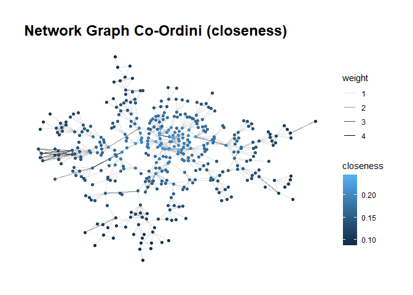<!-- -->

    ## Warning in grid.Call(C_textBounds, as.graphicsAnnot(x$label), x$x, x$y, :
    ## famiglia di caratteri non trovata nel database dei caratteri di Windows

    ## Warning in grid.Call(C_textBounds, as.graphicsAnnot(x$label), x$x, x$y, :
    ## famiglia di caratteri non trovata nel database dei caratteri di Windows
    ## Warning in grid.Call(C_textBounds, as.graphicsAnnot(x$label), x$x, x$y, :
    ## famiglia di caratteri non trovata nel database dei caratteri di Windows
    ## Warning in grid.Call(C_textBounds, as.graphicsAnnot(x$label), x$x, x$y, :
    ## famiglia di caratteri non trovata nel database dei caratteri di Windows
    ## Warning in grid.Call(C_textBounds, as.graphicsAnnot(x$label), x$x, x$y, :
    ## famiglia di caratteri non trovata nel database dei caratteri di Windows

    ## Warning in grid.Call.graphics(C_text, as.graphicsAnnot(x$label), x$x, x$y, :
    ## famiglia di caratteri non trovata nel database dei caratteri di Windows
    ## Warning in grid.Call.graphics(C_text, as.graphicsAnnot(x$label), x$x, x$y, :
    ## famiglia di caratteri non trovata nel database dei caratteri di Windows
    ## Warning in grid.Call.graphics(C_text, as.graphicsAnnot(x$label), x$x, x$y, :
    ## famiglia di caratteri non trovata nel database dei caratteri di Windows
    ## Warning in grid.Call.graphics(C_text, as.graphicsAnnot(x$label), x$x, x$y, :
    ## famiglia di caratteri non trovata nel database dei caratteri di Windows
    ## Warning in grid.Call.graphics(C_text, as.graphicsAnnot(x$label), x$x, x$y, :
    ## famiglia di caratteri non trovata nel database dei caratteri di Windows

<!-- -->

#### Considerazioni

- Tutti i nodi hanno un grado molto basso (è atteso si rifletta anche
  nella densità della rete).
- Le distanze aumentano man mano che ci si allontana dalla zona
  graficamente centrale del grafo.
- Presenza di pochi hub.

``` r
# vedo i top articoli più co-ordinati (in assoluto)
df = as_data_frame(g, what = "vertices") %>%
  select(name, degree, descrizione) %>%
  rename(articolo = name) %>%
  arrange(desc(degree)) 
row.names(df) = NULL

# vedo i top articoli più co-ordinati (in coppia)
df = as_data_frame(g, what = "edges") %>% 
  arrange(desc(weight)) %>%
  mutate(from = as.integer(from), to = as.integer(to)) %>%
  inner_join(articoli %>% select(articolo, descrizione), 
             by = c("from" = "articolo")) %>%
  inner_join(articoli %>% select(articolo, descrizione), 
             by = c("to" = "articolo"))
```

### Analisi esplorativa del grafo

Sono stati calcolati i seguenti parametri descrittivi del grafo:

- **Distanza media**: lunghezza media dei cammini minimi tra ogni coppia
  di nodi
- **Diametro**: lunghezza del cammino minimo più lungo
- **Densità**: rapporto tra archi effettivi e quelli massimi possibili
  - $\rho = \frac{2 \sum_{i}^{|V|}\sum_{i < j}^{|V|}y_{ij}}{|V|(|V| - 1)}$
- **Transitività**: tendenza delle releazioni tra $i \sim h$ se presenti
  le relazioni tra $i \sim j$ e $j \sim h$
- **Assortatività**: tendenza delle relazioni tra nodi con lo stesso
  valore (**omofilia**) oppure con valori diversi (**eterofilia**) per
  un determinato attributo (per feature categoriche)
  - $\frac{Q}{Q_{max}}$
  - $Q = A - B$
  - $A$: frazione di relazioni tra nodi aventi lo stesso valore per la
    stessa feature
  - $B$: come $A$ ma considerando gli archi disposti in modo casuale
  - per quanto riguarda le feature categoriche, sono stati gestiti i
    valori *NA*
  - per quanto riguarda le feature numeriche, invece, l’assortatività
    rappresenta una sorta di misura di covarianza e viene calcolata solo
    quando non sono presenti valori *NA*
- **NB**: nel calcolo dei parametri descrittivi, $y_{ij}$ non indica il
  peso ma la presenza o meno dell’arco (1 o 0) tra il nodo $i$ ed il
  nodo $j$

``` r
# funzione che, dato in input un grafo, esegue un'analisi descrittiva della rete
network_eda = function (my_g) {
  # statistiche base
  vc = vcount(my_g)
  ec = ecount(my_g)
  print(paste("|V|:", vc))
  print(paste("|E|:", ec))
  
  # distanza media della rete (lunghezza media dei cammini minimi tra ogni coppia di nodi)
  c = mean_distance(my_g, directed = F, weights = NA)
  c = round(c, 3)
  print(paste("Distanza media:", c))
  
  # diametro della rete (lunghezza del cammino minimo più lungo)
  c = diameter(my_g, directed = F, weights = NA)
  print(paste("Diametro:", c))
  
  # densità della rete (probabilità di osservare un arco)
  c = edge_density(my_g)
  c = round(c, 3)
  print(paste("Densità:", c))
  
  # transitività
  # 1: perfetta
  # 0: nessuna
  c = transitivity(my_g, type = "undirected")
  c = round(c, 3)
  print(paste("Transitività:", c))
  
  attributes = vertex_attr_names(my_g)
  blacklist = c("name", "descrizione", "gruppo", "degree_norm", "closeness", "betweenness")
  attributes = attributes[!attributes %in% blacklist]
  for (attribute in attributes) {
    # assortativity (num)
    t = "num"
    v = vertex_attr(my_g, attribute)
    f = assortativity
    if (typeof(v) == "character") {
      # assortativity_nominal (str)
      t = "str"
      v[is.na(v)] = "unknown"
      v = as.factor(v)
      f = assortativity_nominal
    }
    
    c = "NA"
    if (sum(is.na(v)) == 0) {
      # assortatività
      #  1: perfetta omofilia
      # -1: perfetta eterofilia
      c = f(my_g, v, directed = F, normalized = T)
      c = round(c, 3)
      if (is.na(c)) {
        c = table(v)
        c = names(c)[c == max(c)]
      }
    }
    
    print(paste("Assortatività", t, attribute, ":", c))
  }
  
  # prelevo nodi e archi
  nodes = as_data_frame(my_g, what = "vertices")
  edges = as_data_frame(my_g, what = "edges")
  
  par(mfrow = c(1, 2))
  
  # vedere distribuzione grado dei nodi
  d = nodes$degree
  hist(d, right = F, xlab = "", ylab = "", main = "Degree distribution (histogram)")
  boxplot(d, xlab = "", ylab = "", main = "Degree dist. (boxplot)")
  summary(d)
  
  # distribuzione dei pesi degli archi
  w = edges$weight
  b = seq(min(w), max(w) + 1, by = 1)
  hist(w, breaks = b, xaxt = "n", right = F, 
       xlab = "", ylab = "", main = "Edge weight dist. (histogram)")
  axis(1, at = b, labels = format(b, scientific = FALSE))
  boxplot(w, xlab = "", ylab = "", main = "Edge weight dist. (boxplot)")
  summary(w)
  
  par(mfrow = c(1, 1))
}

network_eda(g)
```

    ## [1] "|V|: 413"
    ## [1] "|E|: 992"
    ## [1] "Distanza media: 6.69"
    ## [1] "Diametro: 17"
    ## [1] "Densità: 0.012"
    ## [1] "Transitività: 0.549"
    ## [1] "Assortatività str categoria_merce : -0.069"
    ## [1] "Assortatività str marchio : 0.389"
    ## [1] "Assortatività num degree : 0.063"

<!-- -->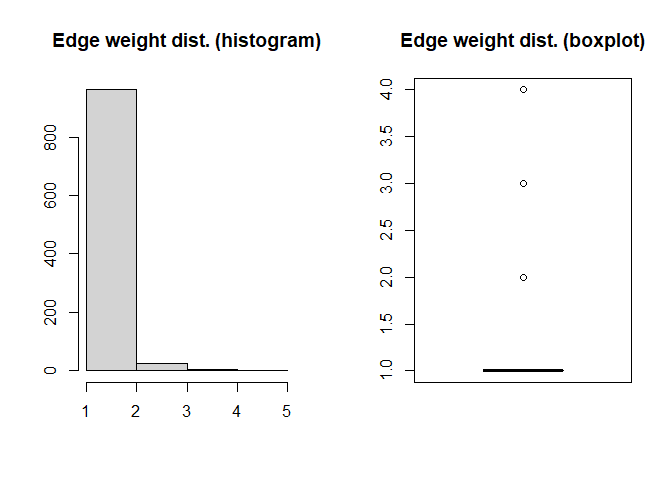<!-- -->

#### Considerazioni

- Assortatività per *categoria_merce*: praticamente nulla
- Assortatività per *marchio*: leggera **omofilia**
- Distribuzione del **peso degli archi**: la maggior parte dei pesi è
  pari a 1
- Distribuzione del **grado dei nodi**: asimmetria verso destra
  (positiva)

### Stochastic Block Model (SBM)

Dopo aver costruito ed analizzato la rete, l’idea è quella di fare
clustering sfruttando gli **Stochastic Block Model (SBM)**.  
Uno **SBM** è un modello che cattura per ciascun nodo un insieme di
variabili latenti di tipo discreto che:

- caratterizzano la probabilità di vedere un arco tra ogni coppia di
  nodi
- indicano il blocco a cui ciascun nodo appartiene

Ne consegue che l’obiettivo del clustering attraverso **SBM** non è
individuare le comunità di nodi molto connessi tra loro ma **trovare
blocchi di nodi che hanno un comportamento simile** (inteso nella
propensione a formare relazioni).

``` r
# funzione che, dato un grafo, applica e restituisce lo sbm
get_sbm = function (my_file, my_g, my_model = "poisson", lim = 15, label = "products") {
  # calcolo la matrice di adiacenza
  Y = as_adjacency_matrix(my_g, sparse = F)
  
  # rappresento graficamente la matrice di adiacenza
  p = plotMyMatrix(Y, dimLabels = list(row = label, col = label))
  print(p)
  
  # ottimizzo i tempi
  my_file = paste("sbm", my_file, sep = "/")
  if (file.exists(my_file)) {
    sbm = readRDS(my_file)
  } else {
    # stimo lo sbm
    options = list(nbCores = parallel::detectCores(), exploreMax = lim, verbosity = 0, plot = F)
    sbm = estimateSimpleSBM(Y, my_model, dimLabels = label, estimOptions = options)
    #saveRDS(sbm, file = my_file)
  }
  
  return(sbm)
}

sbm = get_sbm("sbm_co_ordini.rds", g)
```

<!-- -->

``` r
# guardo i risultati
print(sbm)
```

    ## Fit of a Simple Stochastic Block Model -- poisson variant
    ## =====================================================================
    ## Dimension = ( 413 ) - ( 9 ) blocks and no covariate(s).
    ## =====================================================================
    ## * Useful fields 
    ##   $nbNodes, $modelName, $dimLabels, $nbBlocks, $nbCovariates, $nbDyads
    ##   $blockProp, $connectParam, $covarParam, $covarList, $covarEffect 
    ##   $expectation, $indMemberships, $memberships 
    ## * R6 and S3 methods 
    ##   $rNetwork, $rMemberships, $rEdges, plot, print, coef 
    ## * Additional fields
    ##   $probMemberships, $loglik, $ICL, $storedModels, 
    ## * Additional methods 
    ##   predict, fitted, $setModel, $reorder

``` r
# probabilità a priori di un generico nodo di appartenere a ciascun blocco (alfa)
print(round(sbm$blockProp, 3))
```

    ## [1] 0.041 0.055 0.044 0.049 0.065 0.123 0.131 0.198 0.294

``` r
# risultati dei vari modelli testati
print(sbm$storedModels)
```

    ##    indexModel nbParams nbBlocks       ICL    loglik
    ## 1           1        1        1 -5413.664 -5407.988
    ## 2           2        4        2 -5127.363 -5107.325
    ## 3           3        8        3 -4954.097 -4914.020
    ## 4           4       13        4 -4836.823 -4771.031
    ## 5           5       19        5 -4764.166 -4666.984
    ## 6           6       26        6 -4727.045 -4592.798
    ## 7           7       34        7 -4704.522 -4527.533
    ## 8           8       43        8 -4689.685 -4464.279
    ## 9           9       53        9 -4688.465 -4408.967
    ## 10         10       64       10 -4702.862 -4363.596
    ## 11         11       76       11 -4731.852 -4327.141
    ## 12         12       89       12 -4770.536 -4294.706
    ## 13         13      103       13 -4815.675 -4263.049
    ## 14         14      118       14 -4880.591 -4245.494

``` r
# probabilità a posteriori per ciascun nodo di appartenere a ciascun blocco
# controllo a campione per verificare che sia "sparsa"
set.seed(42)
s = sample(1:vcount(g), 50)
print(round(sbm$probMemberships[s, ], 3))
```

    ##        [,1]  [,2]  [,3]  [,4]  [,5]  [,6]  [,7]  [,8]  [,9]
    ##  [1,] 0.000 0.000 0.000 0.000 0.000 0.000 0.000 0.000 0.998
    ##  [2,] 0.000 0.000 0.000 0.000 0.000 0.998 0.000 0.000 0.000
    ##  [3,] 0.000 0.000 0.000 0.000 0.998 0.000 0.000 0.000 0.000
    ##  [4,] 0.000 0.000 0.000 0.000 0.000 0.000 0.997 0.000 0.001
    ##  [5,] 0.000 0.998 0.000 0.000 0.000 0.000 0.000 0.000 0.000
    ##  [6,] 0.000 0.000 0.000 0.000 0.000 0.000 0.000 0.000 0.998
    ##  [7,] 0.000 0.000 0.000 0.000 0.000 0.000 0.002 0.984 0.012
    ##  [8,] 0.000 0.000 0.000 0.000 0.000 0.000 0.000 0.998 0.000
    ##  [9,] 0.000 0.000 0.000 0.000 0.000 0.000 0.000 0.000 0.998
    ## [10,] 0.000 0.000 0.998 0.000 0.000 0.000 0.000 0.000 0.000
    ## [11,] 0.000 0.998 0.000 0.000 0.000 0.000 0.000 0.000 0.000
    ## [12,] 0.000 0.000 0.000 0.000 0.000 0.998 0.000 0.000 0.000
    ## [13,] 0.000 0.000 0.000 0.000 0.000 0.000 0.000 0.000 0.998
    ## [14,] 0.000 0.000 0.000 0.000 0.000 0.000 0.000 0.000 0.998
    ## [15,] 0.000 0.000 0.000 0.000 0.998 0.000 0.000 0.000 0.000
    ## [16,] 0.000 0.000 0.000 0.000 0.000 0.000 0.000 0.998 0.000
    ## [17,] 0.000 0.000 0.000 0.000 0.000 0.000 0.998 0.000 0.000
    ## [18,] 0.000 0.000 0.000 0.998 0.000 0.000 0.000 0.000 0.000
    ## [19,] 0.000 0.998 0.000 0.000 0.000 0.000 0.000 0.000 0.000
    ## [20,] 0.000 0.000 0.000 0.000 0.000 0.000 0.000 0.000 0.998
    ## [21,] 0.000 0.000 0.000 0.998 0.000 0.000 0.000 0.000 0.000
    ## [22,] 0.000 0.000 0.000 0.000 0.998 0.000 0.000 0.000 0.000
    ## [23,] 0.000 0.000 0.000 0.000 0.000 0.998 0.000 0.000 0.000
    ## [24,] 0.000 0.000 0.000 0.000 0.000 0.000 0.000 0.998 0.000
    ## [25,] 0.000 0.000 0.000 0.000 0.000 0.000 0.000 0.998 0.000
    ## [26,] 0.000 0.000 0.000 0.000 0.000 0.000 0.998 0.000 0.000
    ## [27,] 0.000 0.000 0.000 0.000 0.000 0.998 0.000 0.000 0.000
    ## [28,] 0.000 0.000 0.000 0.000 0.000 0.000 0.000 0.998 0.000
    ## [29,] 0.998 0.000 0.000 0.000 0.000 0.000 0.000 0.000 0.000
    ## [30,] 0.000 0.000 0.000 0.000 0.000 0.000 0.000 0.000 0.998
    ## [31,] 0.000 0.000 0.000 0.000 0.000 0.998 0.000 0.000 0.000
    ## [32,] 0.000 0.000 0.000 0.000 0.000 0.000 0.000 0.998 0.000
    ## [33,] 0.000 0.998 0.000 0.000 0.000 0.000 0.000 0.000 0.000
    ## [34,] 0.000 0.000 0.000 0.000 0.000 0.000 0.000 0.998 0.000
    ## [35,] 0.000 0.000 0.000 0.998 0.000 0.000 0.000 0.000 0.000
    ## [36,] 0.000 0.000 0.000 0.000 0.000 0.000 0.000 0.000 0.998
    ## [37,] 0.000 0.000 0.000 0.000 0.000 0.000 0.001 0.000 0.997
    ## [38,] 0.000 0.000 0.000 0.000 0.998 0.000 0.000 0.000 0.000
    ## [39,] 0.000 0.000 0.000 0.000 0.000 0.986 0.000 0.003 0.009
    ## [40,] 0.000 0.000 0.000 0.998 0.000 0.000 0.000 0.000 0.000
    ## [41,] 0.000 0.000 0.000 0.000 0.000 0.997 0.000 0.000 0.001
    ## [42,] 0.000 0.000 0.000 0.000 0.000 0.000 0.003 0.974 0.021
    ## [43,] 0.000 0.000 0.000 0.000 0.000 0.000 0.001 0.000 0.997
    ## [44,] 0.000 0.000 0.000 0.000 0.000 0.000 0.003 0.974 0.021
    ## [45,] 0.000 0.000 0.000 0.000 0.000 0.998 0.000 0.000 0.000
    ## [46,] 0.000 0.000 0.000 0.000 0.000 0.000 0.998 0.000 0.000
    ## [47,] 0.000 0.000 0.000 0.000 0.000 0.000 0.000 0.998 0.000
    ## [48,] 0.000 0.000 0.000 0.000 0.998 0.000 0.000 0.000 0.000
    ## [49,] 0.000 0.000 0.000 0.000 0.000 0.000 0.000 0.000 0.998
    ## [50,] 0.998 0.000 0.000 0.000 0.000 0.000 0.000 0.000 0.000

``` r
get_final_plots = function (my_file, title, my_g, my_sbm = NULL) {
  # la modularità è pari all'assortatività (dei gruppi) NON normalizzata
  m = modularity(my_g, vertex_attr(my_g, "gruppo"), directed = F)
  m = round(m, 3)
  print(paste("Modularità:", m))
  
  #lyt = "fr"
  lyt = "stress"
  
  # ottimizzo i tempi
  my_file = paste("ggraph", my_file, sep = "/")
  if (file.exists(my_file)) {
    p = readRDS(my_file)
  } else {
    p = ggraph(my_g, layout = lyt) +
      geom_edge_link(aes(alpha = weight)) +
      geom_node_point(aes(color = gruppo)) +
      theme_graph(base_family = "Arial") +
      ggtitle(title)
    #saveRDS(p, file = my_file)
  }
  print(p)
  
  if (is.null(my_sbm))
    return (F)
  
  # matrice di adiacenza in cui i nodi sono stati ordinati in base al blocco di appartenenza
  # (ovvero, i nodi che appartengono ad uno stesso blocco sono adiacenti)
  p = plot(my_sbm, type = "data")
  print(p)
  
  # come sopra ma aggregando in base al blocco di appartenenza
  p = plot(my_sbm, type = "expected")
  print(p)
  
  # probabilità di osservare un edge tra i (nodi appartenenti ai) diversi blocchi (pigreco)
  print(round(sbm$connectParam$mean, 3))
  
  # plotto il grafo raggruppando i nodi nei rispettivi blocchi
  plot(my_sbm, type = "meso")
  
  return (T)
}

# confronto con greedy clustering
gc = cluster_fast_greedy(g)
# aggiungo tra gli attributi dei nodi il cluster di appartenenza secondo gc
g = set_vertex_attr(g, name = "gruppo", value = as.factor(membership(gc)))
tmp = get_final_plots("gc_final_ggraph_co_ordini.rds", "GC Graph Co-Ordini", g)
```

    ## [1] "Modularità: 0.85"

    ## Warning in grid.Call(C_textBounds, as.graphicsAnnot(x$label), x$x, x$y, :
    ## famiglia di caratteri non trovata nel database dei caratteri di Windows
    ## Warning in grid.Call(C_textBounds, as.graphicsAnnot(x$label), x$x, x$y, :
    ## famiglia di caratteri non trovata nel database dei caratteri di Windows
    ## Warning in grid.Call(C_textBounds, as.graphicsAnnot(x$label), x$x, x$y, :
    ## famiglia di caratteri non trovata nel database dei caratteri di Windows
    ## Warning in grid.Call(C_textBounds, as.graphicsAnnot(x$label), x$x, x$y, :
    ## famiglia di caratteri non trovata nel database dei caratteri di Windows
    ## Warning in grid.Call(C_textBounds, as.graphicsAnnot(x$label), x$x, x$y, :
    ## famiglia di caratteri non trovata nel database dei caratteri di Windows

    ## Warning in grid.Call.graphics(C_text, as.graphicsAnnot(x$label), x$x, x$y, :
    ## famiglia di caratteri non trovata nel database dei caratteri di Windows
    ## Warning in grid.Call.graphics(C_text, as.graphicsAnnot(x$label), x$x, x$y, :
    ## famiglia di caratteri non trovata nel database dei caratteri di Windows
    ## Warning in grid.Call.graphics(C_text, as.graphicsAnnot(x$label), x$x, x$y, :
    ## famiglia di caratteri non trovata nel database dei caratteri di Windows
    ## Warning in grid.Call.graphics(C_text, as.graphicsAnnot(x$label), x$x, x$y, :
    ## famiglia di caratteri non trovata nel database dei caratteri di Windows
    ## Warning in grid.Call.graphics(C_text, as.graphicsAnnot(x$label), x$x, x$y, :
    ## famiglia di caratteri non trovata nel database dei caratteri di Windows

<!-- -->

``` r
# aggiungo tra gli attributi dei nodi il cluster di appartenenza secondo sbm
g = set_vertex_attr(g, name = "gruppo", value = as.factor(sbm$memberships))
tmp = get_final_plots("final_ggraph_co_ordini.rds", "SBM Graph Co-Ordini", g, sbm)
```

    ## [1] "Modularità: 0.728"

    ## Warning in grid.Call(C_textBounds, as.graphicsAnnot(x$label), x$x, x$y, :
    ## famiglia di caratteri non trovata nel database dei caratteri di Windows

    ## Warning in grid.Call(C_textBounds, as.graphicsAnnot(x$label), x$x, x$y, :
    ## famiglia di caratteri non trovata nel database dei caratteri di Windows
    ## Warning in grid.Call(C_textBounds, as.graphicsAnnot(x$label), x$x, x$y, :
    ## famiglia di caratteri non trovata nel database dei caratteri di Windows
    ## Warning in grid.Call(C_textBounds, as.graphicsAnnot(x$label), x$x, x$y, :
    ## famiglia di caratteri non trovata nel database dei caratteri di Windows
    ## Warning in grid.Call(C_textBounds, as.graphicsAnnot(x$label), x$x, x$y, :
    ## famiglia di caratteri non trovata nel database dei caratteri di Windows

    ## Warning in grid.Call.graphics(C_text, as.graphicsAnnot(x$label), x$x, x$y, :
    ## famiglia di caratteri non trovata nel database dei caratteri di Windows
    ## Warning in grid.Call.graphics(C_text, as.graphicsAnnot(x$label), x$x, x$y, :
    ## famiglia di caratteri non trovata nel database dei caratteri di Windows
    ## Warning in grid.Call.graphics(C_text, as.graphicsAnnot(x$label), x$x, x$y, :
    ## famiglia di caratteri non trovata nel database dei caratteri di Windows
    ## Warning in grid.Call.graphics(C_text, as.graphicsAnnot(x$label), x$x, x$y, :
    ## famiglia di caratteri non trovata nel database dei caratteri di Windows
    ## Warning in grid.Call.graphics(C_text, as.graphicsAnnot(x$label), x$x, x$y, :
    ## famiglia di caratteri non trovata nel database dei caratteri di Windows

<!-- -->

    ## Warning: `aes_string()` was deprecated in ggplot2 3.0.0.
    ## ℹ Please use tidy evaluation idioms with `aes()`.
    ## ℹ See also `vignette("ggplot2-in-packages")` for more information.
    ## ℹ The deprecated feature was likely used in the sbm package.
    ##   Please report the issue at <https://github.com/GrossSBM/sbm/issues>.
    ## This warning is displayed once every 8 hours.
    ## Call `lifecycle::last_lifecycle_warnings()` to see where this warning was
    ## generated.

    ## Warning: Using `size` aesthetic for lines was deprecated in ggplot2 3.4.0.
    ## ℹ Please use `linewidth` instead.
    ## ℹ The deprecated feature was likely used in the sbm package.
    ##   Please report the issue at <https://github.com/GrossSBM/sbm/issues>.
    ## This warning is displayed once every 8 hours.
    ## Call `lifecycle::last_lifecycle_warnings()` to see where this warning was
    ## generated.

<!-- --><!-- -->

    ##        [,1]  [,2]  [,3]  [,4]  [,5]  [,6]  [,7]  [,8]  [,9]
    ##  [1,] 0.426 0.000 0.003 0.000 0.000 0.002 0.007 0.058 0.006
    ##  [2,] 0.000 0.367 0.000 0.000 0.000 0.000 0.004 0.000 0.000
    ##  [3,] 0.003 0.000 0.339 0.000 0.000 0.000 0.002 0.000 0.003
    ##  [4,] 0.000 0.000 0.000 0.318 0.000 0.000 0.001 0.000 0.000
    ##  [5,] 0.000 0.000 0.000 0.000 0.212 0.003 0.000 0.000 0.001
    ##  [6,] 0.002 0.000 0.000 0.000 0.003 0.088 0.000 0.001 0.001
    ##  [7,] 0.007 0.004 0.002 0.001 0.000 0.000 0.069 0.000 0.001
    ##  [8,] 0.058 0.000 0.000 0.000 0.000 0.001 0.000 0.032 0.000
    ##  [9,] 0.006 0.000 0.003 0.000 0.001 0.001 0.001 0.000 0.026

<!-- -->

#### Considerazioni

- GC identifica un numero maggiore di cluster rispetto a SBM.
- Alcuni cluster sono individuati da entrambi gli algoritmi.
- La modularità del clustering ottenuto tramite GC è più alta (risultato
  atteso) ma la modularità del clustering ottenuto tramite SBM è
  comunque elevata.
- In base al clustering tramite SBM, tutti i cluster tranne il 8 hanno
  la tendenza a connettersi di più con sè stessi.

``` r
get_final_stats = function (my_g) {
  # prelevo i nodi
  nodes = as_data_frame(my_g, what = "vertices")
  
  # vedo numero di articoli e grado medio dei nodi dentro ciascun gruppo
  df = nodes %>%
    select(degree, gruppo) %>%
    group_by(gruppo) %>%
    summarise(n = n(), 
              degree_mean = mean(degree),
              degree_var = var(degree),
              degree_min = min(degree),
              degree_max = max(degree)
    )
  print(df)
  
  # distribuzione del grado dei nodi in base al gruppo
  p = ggplot(nodes, aes(x = degree)) +
    geom_density(fill = "blue3", alpha = 0.5) +
    facet_wrap(~ gruppo) +
    labs(title = "Degree Distribution by Gruppo", x = "Degree", y = "Count") +
    theme_minimal()
  print(p)
  
  # prelevo i singoli gruppi
  gruppi = sort(unique(nodes$gruppo))
  
  # per ogni gruppo, svolgo l'eda sul sottografo
  for (gr in gruppi) {
    sub_nodes = V(my_g)[gruppo == gr]
    sub_g = induced_subgraph(my_g, sub_nodes)
    print(paste("Gruppo:", gr))
    network_eda(sub_g)
  }
}

get_final_stats(g)
```

    ## # A tibble: 9 × 6
    ##   gruppo     n degree_mean degree_var degree_min degree_max
    ##   <fct>  <int>       <dbl>      <dbl>      <dbl>      <dbl>
    ## 1 1         17       12.9       35.8           6         26
    ## 2 2         23        8         17.8           1         16
    ## 3 3         18        6.39      12.7           2         19
    ## 4 4         20        6.15       9.92          1         13
    ## 5 5         27        5.78       8.18          1         11
    ## 6 6         51        4.82      12.1           1         18
    ## 7 7         54        4.04       8.45          1         16
    ## 8 8         82        3.66       3.19          1          8
    ## 9 9        121        3.49       3.80          1         10

<!-- -->

    ## [1] "Gruppo: 1"
    ## [1] "|V|: 17"
    ## [1] "|E|: 59"
    ## [1] "Distanza media: 1.831"
    ## [1] "Diametro: 3"
    ## [1] "Densità: 0.434"
    ## [1] "Transitività: 0.798"
    ## [1] "Assortatività str categoria_merce : -0.114"
    ## [1] "Assortatività str marchio : 0.181"
    ## [1] "Assortatività num degree : 0.024"

<!-- --><!-- -->

    ## [1] "Gruppo: 2"
    ## [1] "|V|: 23"
    ## [1] "|E|: 90"
    ## [1] "Distanza media: 1.787"
    ## [1] "Diametro: 3"
    ## [1] "Densità: 0.356"
    ## [1] "Transitività: 0.699"
    ## [1] "Assortatività str categoria_merce : -0.078"
    ## [1] "Assortatività str marchio : barazza"
    ## [1] "Assortatività num degree : -0.082"

<!-- --><!-- -->

    ## [1] "Gruppo: 3"
    ## [1] "|V|: 18"
    ## [1] "|E|: 53"
    ## [1] "Distanza media: 1.654"
    ## [1] "Diametro: 2"
    ## [1] "Densità: 0.346"
    ## [1] "Transitività: 0.687"
    ## [1] "Assortatività str categoria_merce : -0.107"
    ## [1] "Assortatività str marchio : 0.073"
    ## [1] "Assortatività num degree : -0.21"

<!-- --><!-- -->

    ## [1] "Gruppo: 4"
    ## [1] "|V|: 20"
    ## [1] "|E|: 61"
    ## [1] "Distanza media: 1.989"
    ## [1] "Diametro: 4"
    ## [1] "Densità: 0.321"
    ## [1] "Transitività: 0.805"
    ## [1] "Assortatività str categoria_merce : -0.091"
    ## [1] "Assortatività str marchio : 0.064"
    ## [1] "Assortatività num degree : 0.174"

<!-- --><!-- -->

    ## [1] "Gruppo: 5"
    ## [1] "|V|: 27"
    ## [1] "|E|: 75"
    ## [1] "Distanza media: 1.828"
    ## [1] "Diametro: 5"
    ## [1] "Densità: 0.214"
    ## [1] "Transitività: 0.863"
    ## [1] "Assortatività str categoria_merce : -0.106"
    ## [1] "Assortatività str marchio : 0.249"
    ## [1] "Assortatività num degree : 0.266"

<!-- --><!-- -->

    ## [1] "Gruppo: 6"
    ## [1] "|V|: 51"
    ## [1] "|E|: 113"
    ## [1] "Distanza media: 3.2"
    ## [1] "Diametro: 7"
    ## [1] "Densità: 0.089"
    ## [1] "Transitività: 0.526"
    ## [1] "Assortatività str categoria_merce : -0.143"
    ## [1] "Assortatività str marchio : 0.262"
    ## [1] "Assortatività num degree : -0.096"

<!-- --><!-- -->

    ## [1] "Gruppo: 7"
    ## [1] "|V|: 54"
    ## [1] "|E|: 99"
    ## [1] "Distanza media: 3.732"
    ## [1] "Diametro: 8"
    ## [1] "Densità: 0.069"
    ## [1] "Transitività: 0.513"
    ## [1] "Assortatività str categoria_merce : -0.064"
    ## [1] "Assortatività str marchio : 0.163"
    ## [1] "Assortatività num degree : -0.274"

<!-- --><!-- -->

    ## [1] "Gruppo: 8"
    ## [1] "|V|: 82"
    ## [1] "|E|: 107"
    ## [1] "Distanza media: 2.394"
    ## [1] "Diametro: 6"
    ## [1] "Densità: 0.032"
    ## [1] "Transitività: 0.797"
    ## [1] "Assortatività str categoria_merce : -0.114"
    ## [1] "Assortatività str marchio : 0.329"
    ## [1] "Assortatività num degree : 0.296"

<!-- --><!-- -->

    ## [1] "Gruppo: 9"
    ## [1] "|V|: 121"
    ## [1] "|E|: 194"
    ## [1] "Distanza media: 5.164"
    ## [1] "Diametro: 14"
    ## [1] "Densità: 0.027"
    ## [1] "Transitività: 0.609"
    ## [1] "Assortatività str categoria_merce : -0.11"
    ## [1] "Assortatività str marchio : 0.468"
    ## [1] "Assortatività num degree : -0.213"

<!-- --><!-- -->

#### Considerazioni

- Per nessun gruppo, c’è qualche evidenza nella distribuzione del peso
  degli archi.
- I gruppi 1 e 3 si distinguono nella distribuzione del grado dei nodi.
- Gli ultimi cluster tendono ad essere meno connessi rispetto ai primi.
- Per tutti i cluster:
  - eterofilia per *categoria_merce*
  - omofilia per *marchio*

# Clustering

## Articoli **simili**

Per trovare gli articoli simili, l’idea è quella di confrontare articoli
all’interno della stessa categoria merceologica, per i seguenti motivi:

- pratica dettata dal dominio applicativo
- gli articoli all’interno della stessa categoria merceologica
  condividono lo stesso insieme di feature

Quindi, per una determinata categoria merceologica, si costruisce un
**grafo indiretto pesato** in cui:

- ciascun nodo rappresenta un articolo di quella categoria merceologica
- esiste un arco tra 2 diversi nodi **se e solo se** i 2 corrispondenti
  articoli hanno almeno 1 attributo con lo stesso valore
- il peso di ciascun arco rappresenta il numero distinto di feature per
  cui i 2 articoli presentano lo stesso valore

In questo modo, però, si ottiene un grafo estremamente connesso,
soprattutto in virtù del fatto che si stanno considerando articoli
all’interno della stessa categoria merceologica. Per rendere più
significative le connessioni, quindi, vengono tenuti solo gli archi il
cui **peso è maggiore rispetto all’80-percentile**.

``` r
# unisco tutti gli attributi str in modo tidy
articoli_attr_str = bind_rows(
  articoli_attr_str,
  # go tidy
  articoli %>%
    select(articolo, marchio) %>%
    pivot_longer(
      cols = c("marchio"),
      names_to = "attributo",
      values_to = "valore"
    )
)

build_graph = function (cat, a, aas, aan) {
  # prelevo solo gli articoli di una determinata categoria_merce
  a_cat = a %>% 
    filter(categoria_merce == cat) %>%
    select(articolo)
  
  # filtro di conseguenza gli attributi str e num
  aas = aas %>% inner_join(a_cat, by = "articolo")
  aan = aan %>% inner_join(a_cat, by = "articolo")
  
  # unisco gli attributi str e num
  aa_cat = bind_rows(
    aas,
    aan %>% mutate(valore = as.character(valore))
  )
  
  # stabilisco presenza e peso degli archi presenti tra gli articoli
  edges = aa_cat %>%
    inner_join(aa_cat, by = c("attributo", "valore"), relationship = "many-to-many") %>%
    select(articolo.x, articolo.y) %>%
    filter(articolo.x < articolo.y) %>%
    count(articolo.x, articolo.y) %>%
    rename(weight = n)
  
  # distribuzione dei pesi degli archi
  w = edges$weight
  b = seq(min(w), max(w) + 1, by = 1)
  hist(w, breaks = b, xaxt = "n", right = F, 
       xlab = "Weight", ylab = "", main = "Edge weight distribution")
  axis(1, at = b, labels = format(b, scientific = FALSE))
  
  # fondamentale: considero solo le relazioni significative
  # altrimenti risulterebbe un grafo quasi completo all'interno della stessa categoria_merce
  s = quantile(w, 0.8)
  print(paste("Soglia:", s))
  edges = edges %>% filter(weight > s)
  
  # ricavo i nodi
  nodes = union(edges$articolo.x, edges$articolo.y)
  
  # collego gli attributi ai nodi
  nodes = data.frame(articolo = nodes)
  # NB: non joino con aa_cat perchè devo mantenere il tipo del valore (per il calcolo dell'assortativity)
  nodes = nodes %>% 
    left_join(
      # go untidy
      aas %>% pivot_wider(names_from = "attributo", values_from = "valore"),
      by = "articolo"
    ) %>% 
    left_join(
      # go untidy
      aan %>% pivot_wider(names_from = "attributo", values_from = "valore"),
      by = "articolo"
    )
  # rimuovo le colonne tutte NA
  nodes = nodes[, colSums(is.na(nodes)) < nrow(nodes)]
  
  # creo il grafo
  my_g = graph_from_data_frame(edges, directed = F, vertices = nodes)
  
  # filtro il grafo tenendo solamente la cc principale
  my_g = keep_largest_cc(my_g)
  
  # aggiungo le misure di centralità sui nodi
  my_g = add_centrality_measures(my_g)
  
  return(my_g)
}

# numero di articoli per categoria_merce
df1 = articoli %>% 
  select(articolo, categoria_merce) %>% 
  count(categoria_merce) %>%
  rename(n_articoli = n)

# numero di attributi per categoria_merce
df2 = articoli %>% 
  select(articolo, categoria_merce) %>% 
  inner_join(
    bind_rows(
      articoli_attr_str %>% distinct(articolo, attributo),
      articoli_attr_num %>% distinct(articolo, attributo)
    ), 
    by = "articolo"
  ) %>%
  distinct(categoria_merce, attributo) %>% 
  count(categoria_merce) %>%
  rename(n_attributi = n)

df = df1 %>% 
  inner_join(df2, by = "categoria_merce") %>%
  filter(n_articoli > 100) %>%
  arrange(desc(n_articoli))

# pulizia
rm(df1, df2)
```

Di seguito, verranno considerati come casi di studio 2 categorie
merceologiche, una di elettrodomestici (**lavastoviglie**) e una di
arredamento (**tavoli**), per le quali verranno costruiti i rispettivi
grafi (in base alle considerazioni di cui sopra).  
Sono state scelte queste categorie perché costituite da un numero
ragionevole di articoli, ancora una volta per ottimizzare i tempi
computazionali.  
Verrà poi applicata ad entrambi i grafi la stessa pipeline adottata in
precedenza.

### Lavastoviglie

``` r
cat = "lavastoviglie"
t = paste("Network Graph", cat)
g = build_graph(cat, articoli, articoli_attr_str, articoli_attr_num)
```

<!-- -->

    ## [1] "Soglia: 5"
    ## 
    ##   2   3   4  49 274 
    ##   4   1   2   1   1 
    ## 
    ## 274 
    ##   1

``` r
file = gsub(" ", "_", paste("ggraph", cat, ".rds"))
network_plot(file, t, g)
```

    ## Warning in grid.Call(C_textBounds, as.graphicsAnnot(x$label), x$x, x$y, :
    ## famiglia di caratteri non trovata nel database dei caratteri di Windows
    ## Warning in grid.Call(C_textBounds, as.graphicsAnnot(x$label), x$x, x$y, :
    ## famiglia di caratteri non trovata nel database dei caratteri di Windows
    ## Warning in grid.Call(C_textBounds, as.graphicsAnnot(x$label), x$x, x$y, :
    ## famiglia di caratteri non trovata nel database dei caratteri di Windows
    ## Warning in grid.Call(C_textBounds, as.graphicsAnnot(x$label), x$x, x$y, :
    ## famiglia di caratteri non trovata nel database dei caratteri di Windows
    ## Warning in grid.Call(C_textBounds, as.graphicsAnnot(x$label), x$x, x$y, :
    ## famiglia di caratteri non trovata nel database dei caratteri di Windows

    ## Warning in grid.Call.graphics(C_text, as.graphicsAnnot(x$label), x$x, x$y, :
    ## famiglia di caratteri non trovata nel database dei caratteri di Windows
    ## Warning in grid.Call.graphics(C_text, as.graphicsAnnot(x$label), x$x, x$y, :
    ## famiglia di caratteri non trovata nel database dei caratteri di Windows
    ## Warning in grid.Call.graphics(C_text, as.graphicsAnnot(x$label), x$x, x$y, :
    ## famiglia di caratteri non trovata nel database dei caratteri di Windows
    ## Warning in grid.Call.graphics(C_text, as.graphicsAnnot(x$label), x$x, x$y, :
    ## famiglia di caratteri non trovata nel database dei caratteri di Windows
    ## Warning in grid.Call.graphics(C_text, as.graphicsAnnot(x$label), x$x, x$y, :
    ## famiglia di caratteri non trovata nel database dei caratteri di Windows

<!-- -->

    ## Warning in grid.Call(C_textBounds, as.graphicsAnnot(x$label), x$x, x$y, :
    ## famiglia di caratteri non trovata nel database dei caratteri di Windows

    ## Warning in grid.Call(C_textBounds, as.graphicsAnnot(x$label), x$x, x$y, :
    ## famiglia di caratteri non trovata nel database dei caratteri di Windows
    ## Warning in grid.Call(C_textBounds, as.graphicsAnnot(x$label), x$x, x$y, :
    ## famiglia di caratteri non trovata nel database dei caratteri di Windows
    ## Warning in grid.Call(C_textBounds, as.graphicsAnnot(x$label), x$x, x$y, :
    ## famiglia di caratteri non trovata nel database dei caratteri di Windows
    ## Warning in grid.Call(C_textBounds, as.graphicsAnnot(x$label), x$x, x$y, :
    ## famiglia di caratteri non trovata nel database dei caratteri di Windows

    ## Warning in grid.Call.graphics(C_text, as.graphicsAnnot(x$label), x$x, x$y, :
    ## famiglia di caratteri non trovata nel database dei caratteri di Windows
    ## Warning in grid.Call.graphics(C_text, as.graphicsAnnot(x$label), x$x, x$y, :
    ## famiglia di caratteri non trovata nel database dei caratteri di Windows
    ## Warning in grid.Call.graphics(C_text, as.graphicsAnnot(x$label), x$x, x$y, :
    ## famiglia di caratteri non trovata nel database dei caratteri di Windows
    ## Warning in grid.Call.graphics(C_text, as.graphicsAnnot(x$label), x$x, x$y, :
    ## famiglia di caratteri non trovata nel database dei caratteri di Windows
    ## Warning in grid.Call.graphics(C_text, as.graphicsAnnot(x$label), x$x, x$y, :
    ## famiglia di caratteri non trovata nel database dei caratteri di Windows

<!-- -->

    ## Warning in grid.Call(C_textBounds, as.graphicsAnnot(x$label), x$x, x$y, :
    ## famiglia di caratteri non trovata nel database dei caratteri di Windows

    ## Warning in grid.Call(C_textBounds, as.graphicsAnnot(x$label), x$x, x$y, :
    ## famiglia di caratteri non trovata nel database dei caratteri di Windows
    ## Warning in grid.Call(C_textBounds, as.graphicsAnnot(x$label), x$x, x$y, :
    ## famiglia di caratteri non trovata nel database dei caratteri di Windows
    ## Warning in grid.Call(C_textBounds, as.graphicsAnnot(x$label), x$x, x$y, :
    ## famiglia di caratteri non trovata nel database dei caratteri di Windows
    ## Warning in grid.Call(C_textBounds, as.graphicsAnnot(x$label), x$x, x$y, :
    ## famiglia di caratteri non trovata nel database dei caratteri di Windows

    ## Warning in grid.Call.graphics(C_text, as.graphicsAnnot(x$label), x$x, x$y, :
    ## famiglia di caratteri non trovata nel database dei caratteri di Windows
    ## Warning in grid.Call.graphics(C_text, as.graphicsAnnot(x$label), x$x, x$y, :
    ## famiglia di caratteri non trovata nel database dei caratteri di Windows
    ## Warning in grid.Call.graphics(C_text, as.graphicsAnnot(x$label), x$x, x$y, :
    ## famiglia di caratteri non trovata nel database dei caratteri di Windows
    ## Warning in grid.Call.graphics(C_text, as.graphicsAnnot(x$label), x$x, x$y, :
    ## famiglia di caratteri non trovata nel database dei caratteri di Windows
    ## Warning in grid.Call.graphics(C_text, as.graphicsAnnot(x$label), x$x, x$y, :
    ## famiglia di caratteri non trovata nel database dei caratteri di Windows

<!-- -->

``` r
network_eda(g)
```

    ## [1] "|V|: 274"
    ## [1] "|E|: 5038"
    ## [1] "Distanza media: 2.667"
    ## [1] "Diametro: 9"
    ## [1] "Densità: 0.135"
    ## [1] "Transitività: 0.592"
    ## [1] "Assortatività str classe energetica : 0.394"
    ## [1] "Assortatività str connettività : 0.411"
    ## [1] "Assortatività str misura incasso : 0.376"
    ## [1] "Assortatività str tipologia incasso : 0.327"
    ## [1] "Assortatività str finitura : 0.232"
    ## [1] "Assortatività str marchio : 0.253"
    ## [1] "Assortatività num altezza : NA"
    ## [1] "Assortatività num coperti : 0.578"
    ## [1] "Assortatività num larghezza : 60"
    ## [1] "Assortatività num assorbimento : NA"
    ## [1] "Assortatività num degree : 0.416"

<!-- --><!-- -->

#### Considerazioni

- Grafo molto connesso per costruzione (è atteso che la densità sia
  maggiore rispetto alla rete dei co-ordini).
- I nodi sono più vicini tra loro rispetto alla rete dei co-ordini
  (tranne quelli più estremi).
- Presenza di 1 solo hub.
- Tendenza all’omofilia su tutte le feature (per costruzione).

``` r
file = gsub(" ", "_", paste("sbm", cat, ".rds"))
sbm = get_sbm(file, g)
```

<!-- -->

``` r
gc = cluster_fast_greedy(g)

g = set_vertex_attr(g, name = "gruppo", value = as.factor(membership(gc)))
file = gsub(" ", "_", paste("gc_final_ggraph", cat, ".rds"))
t = paste("GC Graph", cat)
tmp = get_final_plots(file, t, g)
```

    ## [1] "Modularità: 0.311"

    ## Warning in grid.Call(C_textBounds, as.graphicsAnnot(x$label), x$x, x$y, :
    ## famiglia di caratteri non trovata nel database dei caratteri di Windows
    ## Warning in grid.Call(C_textBounds, as.graphicsAnnot(x$label), x$x, x$y, :
    ## famiglia di caratteri non trovata nel database dei caratteri di Windows
    ## Warning in grid.Call(C_textBounds, as.graphicsAnnot(x$label), x$x, x$y, :
    ## famiglia di caratteri non trovata nel database dei caratteri di Windows
    ## Warning in grid.Call(C_textBounds, as.graphicsAnnot(x$label), x$x, x$y, :
    ## famiglia di caratteri non trovata nel database dei caratteri di Windows
    ## Warning in grid.Call(C_textBounds, as.graphicsAnnot(x$label), x$x, x$y, :
    ## famiglia di caratteri non trovata nel database dei caratteri di Windows

    ## Warning in grid.Call.graphics(C_text, as.graphicsAnnot(x$label), x$x, x$y, :
    ## famiglia di caratteri non trovata nel database dei caratteri di Windows
    ## Warning in grid.Call.graphics(C_text, as.graphicsAnnot(x$label), x$x, x$y, :
    ## famiglia di caratteri non trovata nel database dei caratteri di Windows
    ## Warning in grid.Call.graphics(C_text, as.graphicsAnnot(x$label), x$x, x$y, :
    ## famiglia di caratteri non trovata nel database dei caratteri di Windows
    ## Warning in grid.Call.graphics(C_text, as.graphicsAnnot(x$label), x$x, x$y, :
    ## famiglia di caratteri non trovata nel database dei caratteri di Windows
    ## Warning in grid.Call.graphics(C_text, as.graphicsAnnot(x$label), x$x, x$y, :
    ## famiglia di caratteri non trovata nel database dei caratteri di Windows

<!-- -->

``` r
g = set_vertex_attr(g, name = "gruppo", value = as.factor(sbm$memberships))
file = gsub(" ", "_", paste("final_ggraph", cat, ".rds"))
t = paste("SBM Graph", cat)
tmp = get_final_plots(file, t, g, sbm)
```

    ## [1] "Modularità: 0.178"

    ## Warning in grid.Call(C_textBounds, as.graphicsAnnot(x$label), x$x, x$y, :
    ## famiglia di caratteri non trovata nel database dei caratteri di Windows

    ## Warning in grid.Call(C_textBounds, as.graphicsAnnot(x$label), x$x, x$y, :
    ## famiglia di caratteri non trovata nel database dei caratteri di Windows
    ## Warning in grid.Call(C_textBounds, as.graphicsAnnot(x$label), x$x, x$y, :
    ## famiglia di caratteri non trovata nel database dei caratteri di Windows
    ## Warning in grid.Call(C_textBounds, as.graphicsAnnot(x$label), x$x, x$y, :
    ## famiglia di caratteri non trovata nel database dei caratteri di Windows
    ## Warning in grid.Call(C_textBounds, as.graphicsAnnot(x$label), x$x, x$y, :
    ## famiglia di caratteri non trovata nel database dei caratteri di Windows

    ## Warning in grid.Call.graphics(C_text, as.graphicsAnnot(x$label), x$x, x$y, :
    ## famiglia di caratteri non trovata nel database dei caratteri di Windows
    ## Warning in grid.Call.graphics(C_text, as.graphicsAnnot(x$label), x$x, x$y, :
    ## famiglia di caratteri non trovata nel database dei caratteri di Windows
    ## Warning in grid.Call.graphics(C_text, as.graphicsAnnot(x$label), x$x, x$y, :
    ## famiglia di caratteri non trovata nel database dei caratteri di Windows
    ## Warning in grid.Call.graphics(C_text, as.graphicsAnnot(x$label), x$x, x$y, :
    ## famiglia di caratteri non trovata nel database dei caratteri di Windows
    ## Warning in grid.Call.graphics(C_text, as.graphicsAnnot(x$label), x$x, x$y, :
    ## famiglia di caratteri non trovata nel database dei caratteri di Windows

<!-- --><!-- --><!-- -->

    ##        [,1]  [,2]  [,3]  [,4]  [,5]  [,6]  [,7]  [,8]  [,9] [,10] [,11] [,12]
    ##  [1,] 0.990 0.943 0.915 0.886 0.595 0.651 0.451 0.129 0.002 0.002 0.006 0.002
    ##  [2,] 0.943 0.952 0.791 0.344 0.432 0.619 0.003 0.159 0.165 0.419 0.001 0.002
    ##  [3,] 0.915 0.791 0.896 0.393 0.262 0.004 0.424 0.309 0.002 0.002 0.001 0.002
    ##  [4,] 0.886 0.344 0.393 0.846 0.077 0.751 0.570 0.013 0.021 0.130 0.070 0.160
    ##  [5,] 0.595 0.432 0.262 0.077 0.807 0.045 0.003 0.248 0.388 0.002 0.396 0.002
    ##  [6,] 0.651 0.619 0.004 0.751 0.045 0.804 0.287 0.025 0.125 0.418 0.036 0.002
    ##  [7,] 0.451 0.003 0.424 0.570 0.003 0.287 0.578 0.013 0.004 0.097 0.003 0.156
    ##  [8,] 0.129 0.159 0.309 0.013 0.248 0.025 0.013 0.608 0.064 0.031 0.032 0.001
    ##  [9,] 0.002 0.165 0.002 0.021 0.388 0.125 0.004 0.064 0.510 0.003 0.102 0.001
    ## [10,] 0.002 0.419 0.002 0.130 0.002 0.418 0.097 0.031 0.003 0.414 0.001 0.144
    ## [11,] 0.006 0.001 0.001 0.070 0.396 0.036 0.003 0.032 0.102 0.001 0.517 0.005
    ## [12,] 0.002 0.002 0.002 0.160 0.002 0.002 0.156 0.001 0.001 0.144 0.005 0.705
    ## [13,] 0.090 0.002 0.293 0.008 0.002 0.002 0.011 0.011 0.001 0.004 0.001 0.001
    ## [14,] 0.001 0.005 0.001 0.009 0.005 0.044 0.028 0.006 0.020 0.012 0.014 0.001
    ##       [,13] [,14]
    ##  [1,] 0.090 0.001
    ##  [2,] 0.002 0.005
    ##  [3,] 0.293 0.001
    ##  [4,] 0.008 0.009
    ##  [5,] 0.002 0.005
    ##  [6,] 0.002 0.044
    ##  [7,] 0.011 0.028
    ##  [8,] 0.011 0.006
    ##  [9,] 0.001 0.020
    ## [10,] 0.004 0.012
    ## [11,] 0.001 0.014
    ## [12,] 0.001 0.001
    ## [13,] 0.382 0.009
    ## [14,] 0.009 0.052

<!-- -->

``` r
get_final_stats(g)
```

    ## # A tibble: 14 × 6
    ##    gruppo     n degree_mean degree_var degree_min degree_max
    ##    <fct>  <int>       <dbl>      <dbl>      <dbl>      <dbl>
    ##  1 1         15       87.9        66.6         73         95
    ##  2 2         19       79.6       161.          51        101
    ##  3 3         27       74.6       162.          47         86
    ##  4 4          9       62.1        63.9         51         71
    ##  5 5         12       57.9       335.          26         89
    ##  6 6          8       53.5        83.4         43         70
    ##  7 7         16       41          59.7         24         49
    ##  8 8         11       26.3        81.6          9         43
    ##  9 9         23       25.0        73.6          7         38
    ## 10 10        18       24.9       117.           9         39
    ## 11 11        29       23.8        98.4          6         43
    ## 12 12        18       18.8        52.4          8         28
    ## 13 13        18       16.7        46.7          7         26
    ## 14 14        51        4.94       13.4          1         15

<!-- -->

    ## [1] "Gruppo: 1"
    ## [1] "|V|: 15"
    ## [1] "|E|: 105"
    ## [1] "Distanza media: 1"
    ## [1] "Diametro: 1"
    ## [1] "Densità: 1"
    ## [1] "Transitività: 1"
    ## [1] "Assortatività str classe energetica : -0.071"
    ## [1] "Assortatività str connettività : -0.071"
    ## [1] "Assortatività str misura incasso : 60 x 82"
    ## [1] "Assortatività str tipologia incasso : integrata totale"
    ## [1] "Assortatività str finitura : unknown"
    ## [1] "Assortatività str marchio : -0.071"
    ## [1] "Assortatività num altezza : 82"
    ## [1] "Assortatività num coperti : 14"
    ## [1] "Assortatività num larghezza : 60"
    ## [1] "Assortatività num assorbimento : 1"
    ## [1] "Assortatività num degree : -0.071"

<!-- --><!-- -->

    ## [1] "Gruppo: 2"
    ## [1] "|V|: 19"
    ## [1] "|E|: 164"
    ## [1] "Distanza media: 1.041"
    ## [1] "Diametro: 2"
    ## [1] "Densità: 0.959"
    ## [1] "Transitività: 0.961"
    ## [1] "Assortatività str classe energetica : -0.015"
    ## [1] "Assortatività str connettività : -0.018"
    ## [1] "Assortatività str misura incasso : 60 x 82"
    ## [1] "Assortatività str tipologia incasso : integrata totale"
    ## [1] "Assortatività str finitura : unknown"
    ## [1] "Assortatività str marchio : -0.03"
    ## [1] "Assortatività num altezza : 82"
    ## [1] "Assortatività num coperti : 14"
    ## [1] "Assortatività num larghezza : 60"
    ## [1] "Assortatività num assorbimento : NA"
    ## [1] "Assortatività num degree : -0.06"

<!-- --><!-- -->

    ## [1] "Gruppo: 3"
    ## [1] "|V|: 27"
    ## [1] "|E|: 316"
    ## [1] "Distanza media: 1.1"
    ## [1] "Diametro: 2"
    ## [1] "Densità: 0.9"
    ## [1] "Transitività: 0.912"
    ## [1] "Assortatività str classe energetica : 0.068"
    ## [1] "Assortatività str connettività : home connect"
    ## [1] "Assortatività str misura incasso : -0.029"
    ## [1] "Assortatività str tipologia incasso : 0.028"
    ## [1] "Assortatività str finitura : 0.045"
    ## [1] "Assortatività str marchio : 0.061"
    ## [1] "Assortatività num altezza : 82"
    ## [1] "Assortatività num coperti : 14"
    ## [1] "Assortatività num larghezza : 60"
    ## [1] "Assortatività num assorbimento : NA"
    ## [1] "Assortatività num degree : -0.011"

<!-- -->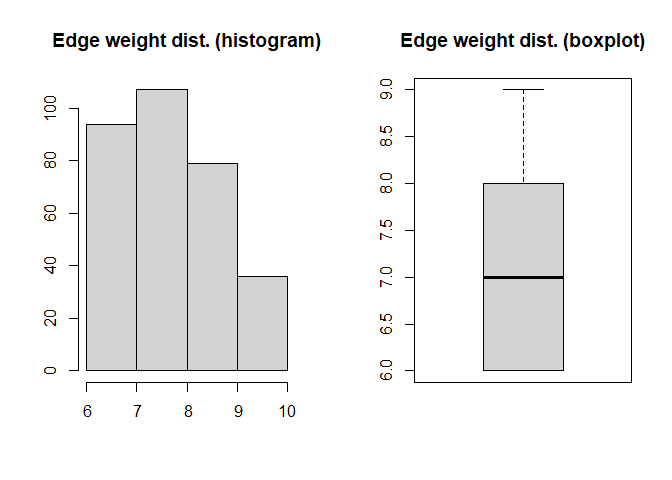<!-- -->

    ## [1] "Gruppo: 4"
    ## [1] "|V|: 9"
    ## [1] "|E|: 31"
    ## [1] "Distanza media: 1.139"
    ## [1] "Diametro: 2"
    ## [1] "Densità: 0.861"
    ## [1] "Transitività: 0.922"
    ## [1] "Assortatività str classe energetica : -0.131"
    ## [1] "Assortatività str connettività : 0.016"
    ## [1] "Assortatività str misura incasso : 60 x 82"
    ## [1] "Assortatività str tipologia incasso : integrata totale"
    ## [1] "Assortatività str finitura : unknown"
    ## [1] "Assortatività str marchio : -0.13"
    ## [1] "Assortatività num altezza : 82"
    ## [1] "Assortatività num coperti : 14"
    ## [1] "Assortatività num larghezza : 60"
    ## [1] "Assortatività num assorbimento : -0.051"
    ## [1] "Assortatività num degree : -0.229"

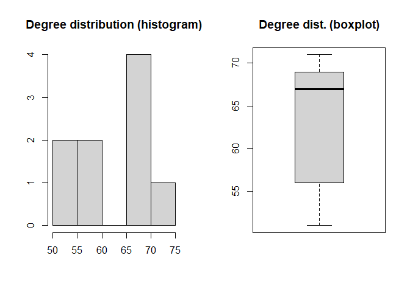<!-- --><!-- -->

    ## [1] "Gruppo: 5"
    ## [1] "|V|: 12"
    ## [1] "|E|: 54"
    ## [1] "Distanza media: 1.182"
    ## [1] "Diametro: 2"
    ## [1] "Densità: 0.818"
    ## [1] "Transitività: 0.862"
    ## [1] "Assortatività str classe energetica : -0.06"
    ## [1] "Assortatività str connettività : 0.084"
    ## [1] "Assortatività str misura incasso : 60 x 82"
    ## [1] "Assortatività str tipologia incasso : integrata totale"
    ## [1] "Assortatività str finitura : unknown"
    ## [1] "Assortatività str marchio : -0.006"
    ## [1] "Assortatività num altezza : 82"
    ## [1] "Assortatività num coperti : 0.061"
    ## [1] "Assortatività num larghezza : 60"
    ## [1] "Assortatività num assorbimento : 0.053"
    ## [1] "Assortatività num degree : -0.152"

<!-- -->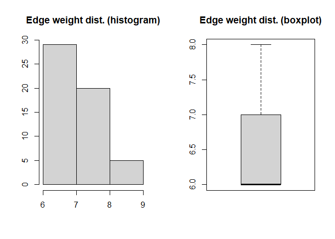<!-- -->

    ## [1] "Gruppo: 6"
    ## [1] "|V|: 8"
    ## [1] "|E|: 23"
    ## [1] "Distanza media: 1.179"
    ## [1] "Diametro: 2"
    ## [1] "Densità: 0.821"
    ## [1] "Transitività: 0.784"
    ## [1] "Assortatività str classe energetica : 0.042"
    ## [1] "Assortatività str connettività : 0.043"
    ## [1] "Assortatività str misura incasso : 60 x 82"
    ## [1] "Assortatività str tipologia incasso : integrata totale"
    ## [1] "Assortatività str finitura : unknown"
    ## [1] "Assortatività str marchio : -0.127"
    ## [1] "Assortatività num altezza : 82"
    ## [1] "Assortatività num coperti : 14"
    ## [1] "Assortatività num larghezza : 60"
    ## [1] "Assortatività num assorbimento : 0.043"
    ## [1] "Assortatività num degree : -0.146"

<!-- --><!-- -->

    ## [1] "Gruppo: 7"
    ## [1] "|V|: 16"
    ## [1] "|E|: 70"
    ## [1] "Distanza media: 1.517"
    ## [1] "Diametro: 3"
    ## [1] "Densità: 0.583"
    ## [1] "Transitività: 0.755"
    ## [1] "Assortatività str classe energetica : 0.484"
    ## [1] "Assortatività str connettività : 0.049"
    ## [1] "Assortatività str misura incasso : 60 x 82"
    ## [1] "Assortatività str tipologia incasso : -0.022"
    ## [1] "Assortatività str finitura : -0.012"
    ## [1] "Assortatività str marchio : 0.008"
    ## [1] "Assortatività num altezza : 82"
    ## [1] "Assortatività num coperti : 14"
    ## [1] "Assortatività num larghezza : 60"
    ## [1] "Assortatività num assorbimento : 0.423"
    ## [1] "Assortatività num degree : 0.092"

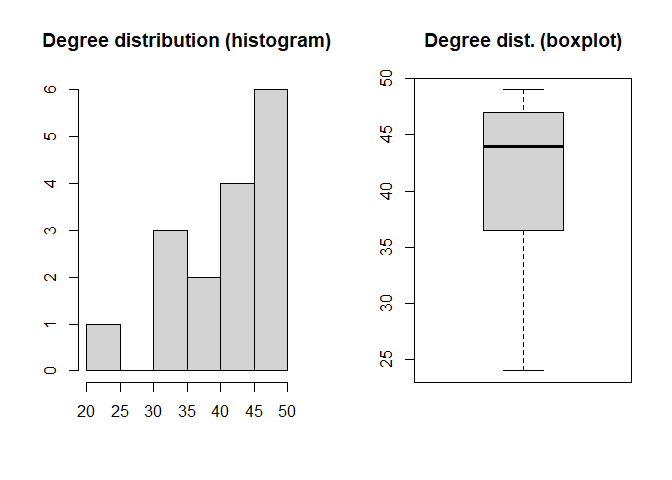<!-- -->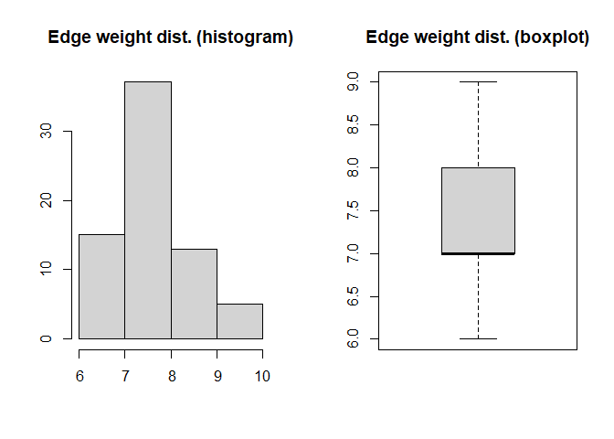<!-- -->

    ## [1] "Gruppo: 8"
    ## [1] "|V|: 11"
    ## [1] "|E|: 34"
    ## [1] "Distanza media: 1.244"
    ## [1] "Diametro: 2"
    ## [1] "Densità: 0.618"
    ## [1] "Transitività: 0.869"
    ## [1] "Assortatività str classe energetica : -0.082"
    ## [1] "Assortatività str connettività : 0.204"
    ## [1] "Assortatività str misura incasso : 60 x 82"
    ## [1] "Assortatività str tipologia incasso : integrata parziale"
    ## [1] "Assortatività str finitura : -0.065"
    ## [1] "Assortatività str marchio : 0.078"
    ## [1] "Assortatività num altezza : 82"
    ## [1] "Assortatività num coperti : -0.086"
    ## [1] "Assortatività num larghezza : 60"
    ## [1] "Assortatività num assorbimento : NA"
    ## [1] "Assortatività num degree : -0.213"

<!-- --><!-- -->

    ## [1] "Gruppo: 9"
    ## [1] "|V|: 23"
    ## [1] "|E|: 130"
    ## [1] "Distanza media: 1.553"
    ## [1] "Diametro: 3"
    ## [1] "Densità: 0.514"
    ## [1] "Transitività: 0.711"
    ## [1] "Assortatività str classe energetica : 0.585"
    ## [1] "Assortatività str connettività : -0.02"
    ## [1] "Assortatività str misura incasso : 60 x 82"
    ## [1] "Assortatività str tipologia incasso : -0.02"
    ## [1] "Assortatività str finitura : 0.015"
    ## [1] "Assortatività str marchio : 0.103"
    ## [1] "Assortatività num altezza : -0.024"
    ## [1] "Assortatività num coperti : -0.008"
    ## [1] "Assortatività num larghezza : 60"
    ## [1] "Assortatività num assorbimento : 0.078"
    ## [1] "Assortatività num degree : 0.125"

<!-- -->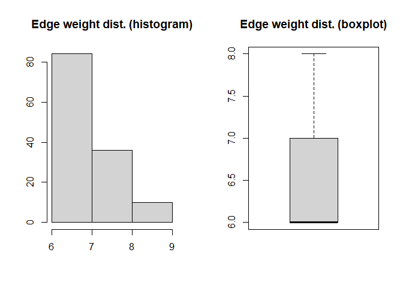<!-- -->

    ## [1] "Gruppo: 10"
    ## [1] "|V|: 18"
    ## [1] "|E|: 64"
    ## [1] "Distanza media: 1.804"
    ## [1] "Diametro: 4"
    ## [1] "Densità: 0.418"
    ## [1] "Transitività: 0.656"
    ## [1] "Assortatività str classe energetica : 0.583"
    ## [1] "Assortatività str connettività : unknown"
    ## [1] "Assortatività str misura incasso : 0.286"
    ## [1] "Assortatività str tipologia incasso : integrata totale"
    ## [1] "Assortatività str finitura : -0.067"
    ## [1] "Assortatività str marchio : 0.133"
    ## [1] "Assortatività num altezza : -0.024"
    ## [1] "Assortatività num coperti : 14"
    ## [1] "Assortatività num larghezza : 60"
    ## [1] "Assortatività num assorbimento : NA"
    ## [1] "Assortatività num degree : -0.109"

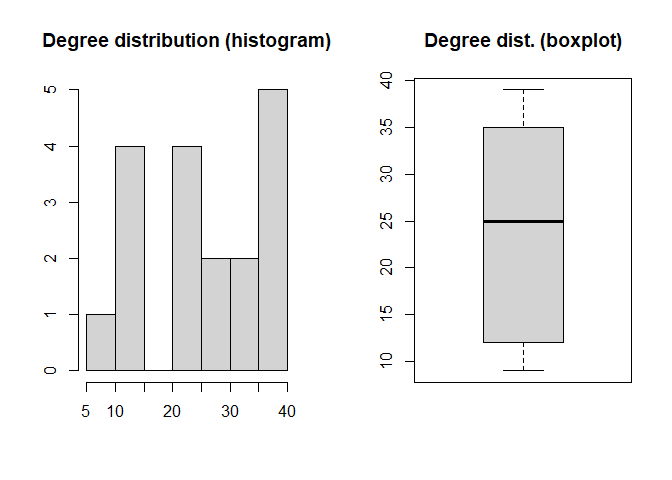<!-- --><!-- -->

    ## [1] "Gruppo: 11"
    ## [1] "|V|: 29"
    ## [1] "|E|: 211"
    ## [1] "Distanza media: 1.527"
    ## [1] "Diametro: 3"
    ## [1] "Densità: 0.52"
    ## [1] "Transitività: 0.728"
    ## [1] "Assortatività str classe energetica : 0.298"
    ## [1] "Assortatività str connettività : 0.049"
    ## [1] "Assortatività str misura incasso : -0.019"
    ## [1] "Assortatività str tipologia incasso : -0.022"
    ## [1] "Assortatività str finitura : -0.022"
    ## [1] "Assortatività str marchio : 0.071"
    ## [1] "Assortatività num altezza : -0.01"
    ## [1] "Assortatività num coperti : 0.057"
    ## [1] "Assortatività num larghezza : 60"
    ## [1] "Assortatività num assorbimento : NA"
    ## [1] "Assortatività num degree : -0.139"

<!-- --><!-- -->

    ## [1] "Gruppo: 12"
    ## [1] "|V|: 18"
    ## [1] "|E|: 109"
    ## [1] "Distanza media: 1.199"
    ## [1] "Diametro: 2"
    ## [1] "Densità: 0.712"
    ## [1] "Transitività: 0.87"
    ## [1] "Assortatività str classe energetica : e"
    ## [1] "Assortatività str connettività : unknown"
    ## [1] "Assortatività str misura incasso : 0.066"
    ## [1] "Assortatività str tipologia incasso : -0.038"
    ## [1] "Assortatività str finitura : -0.094"
    ## [1] "Assortatività str marchio : -0.034"
    ## [1] "Assortatività num altezza : 82"
    ## [1] "Assortatività num coperti : 14"
    ## [1] "Assortatività num larghezza : 60"
    ## [1] "Assortatività num assorbimento : NA"
    ## [1] "Assortatività num degree : -0.052"

<!-- --><!-- -->

    ## [1] "Gruppo: 13"
    ## [1] "|V|: 18"
    ## [1] "|E|: 59"
    ## [1] "Distanza media: 1.485"
    ## [1] "Diametro: 3"
    ## [1] "Densità: 0.386"
    ## [1] "Transitività: 0.786"
    ## [1] "Assortatività str classe energetica : 0.227"
    ## [1] "Assortatività str connettività : 0.561"
    ## [1] "Assortatività str misura incasso : 0.718"
    ## [1] "Assortatività str tipologia incasso : 0.561"
    ## [1] "Assortatività str finitura : 0.456"
    ## [1] "Assortatività str marchio : 0.335"
    ## [1] "Assortatività num altezza : 0.905"
    ## [1] "Assortatività num coperti : 0.699"
    ## [1] "Assortatività num larghezza : 60"
    ## [1] "Assortatività num assorbimento : -0.012"
    ## [1] "Assortatività num degree : 0.041"

<!-- -->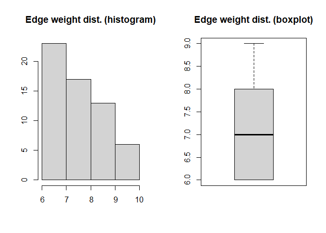<!-- -->

    ## [1] "Gruppo: 14"
    ## [1] "|V|: 51"
    ## [1] "|E|: 67"
    ## [1] "Distanza media: 2.143"
    ## [1] "Diametro: 5"
    ## [1] "Densità: 0.053"
    ## [1] "Transitività: 0.628"
    ## [1] "Assortatività str classe energetica : 0.663"
    ## [1] "Assortatività str connettività : 0.352"
    ## [1] "Assortatività str misura incasso : 0.727"
    ## [1] "Assortatività str tipologia incasso : 0.972"
    ## [1] "Assortatività str finitura : 0.665"
    ## [1] "Assortatività str marchio : 0.416"
    ## [1] "Assortatività num altezza : NA"
    ## [1] "Assortatività num coperti : 0.927"
    ## [1] "Assortatività num larghezza : 60"
    ## [1] "Assortatività num assorbimento : NA"
    ## [1] "Assortatività num degree : 0.499"

<!-- --><!-- -->

#### Considerazioni

- GC rileva meno della metà dei cluster rispetto a SBM.
- La modularità del clustering ottenuto tramite GC è più alta rispetto a
  quella del clustering ottenuto tramite SBM (risultato atteso) ma è
  comunque piuttosto bassa.
- In base al clustering tramite **SBM**:
  - i primi 3 cluster hanno la tendenza a connettersi di più tra loro.
  - i cluster non hanno la tendenza a connettersi solo con sè stessi.
  - il cluster 14 si distingue nella distribuzione del grado dei nodi.
  - il cluster 1 è completamente connesso.
  - alcuni cluster sono costituiti da articoli con feature molto
    specifiche.
  - tendenza all’omofilia su tutte le feature (per costruzione).

### Tavoli

``` r
cat = "tavoli"
t = paste("Network Graph", cat)
g = build_graph(cat, articoli, articoli_attr_str, articoli_attr_num)
```

<!-- -->

    ## [1] "Soglia: 6"
    ## 
    ##   2   3 132 
    ##   2   2   1 
    ## 
    ## 132 
    ##   1

``` r
file = gsub(" ", "_", paste("ggraph", cat, ".rds"))
network_plot(file, t, g)
```

    ## Warning in grid.Call(C_textBounds, as.graphicsAnnot(x$label), x$x, x$y, :
    ## famiglia di caratteri non trovata nel database dei caratteri di Windows
    ## Warning in grid.Call(C_textBounds, as.graphicsAnnot(x$label), x$x, x$y, :
    ## famiglia di caratteri non trovata nel database dei caratteri di Windows
    ## Warning in grid.Call(C_textBounds, as.graphicsAnnot(x$label), x$x, x$y, :
    ## famiglia di caratteri non trovata nel database dei caratteri di Windows
    ## Warning in grid.Call(C_textBounds, as.graphicsAnnot(x$label), x$x, x$y, :
    ## famiglia di caratteri non trovata nel database dei caratteri di Windows
    ## Warning in grid.Call(C_textBounds, as.graphicsAnnot(x$label), x$x, x$y, :
    ## famiglia di caratteri non trovata nel database dei caratteri di Windows

    ## Warning in grid.Call.graphics(C_text, as.graphicsAnnot(x$label), x$x, x$y, :
    ## famiglia di caratteri non trovata nel database dei caratteri di Windows
    ## Warning in grid.Call.graphics(C_text, as.graphicsAnnot(x$label), x$x, x$y, :
    ## famiglia di caratteri non trovata nel database dei caratteri di Windows
    ## Warning in grid.Call.graphics(C_text, as.graphicsAnnot(x$label), x$x, x$y, :
    ## famiglia di caratteri non trovata nel database dei caratteri di Windows
    ## Warning in grid.Call.graphics(C_text, as.graphicsAnnot(x$label), x$x, x$y, :
    ## famiglia di caratteri non trovata nel database dei caratteri di Windows
    ## Warning in grid.Call.graphics(C_text, as.graphicsAnnot(x$label), x$x, x$y, :
    ## famiglia di caratteri non trovata nel database dei caratteri di Windows

<!-- -->

    ## Warning in grid.Call(C_textBounds, as.graphicsAnnot(x$label), x$x, x$y, :
    ## famiglia di caratteri non trovata nel database dei caratteri di Windows

    ## Warning in grid.Call(C_textBounds, as.graphicsAnnot(x$label), x$x, x$y, :
    ## famiglia di caratteri non trovata nel database dei caratteri di Windows
    ## Warning in grid.Call(C_textBounds, as.graphicsAnnot(x$label), x$x, x$y, :
    ## famiglia di caratteri non trovata nel database dei caratteri di Windows
    ## Warning in grid.Call(C_textBounds, as.graphicsAnnot(x$label), x$x, x$y, :
    ## famiglia di caratteri non trovata nel database dei caratteri di Windows
    ## Warning in grid.Call(C_textBounds, as.graphicsAnnot(x$label), x$x, x$y, :
    ## famiglia di caratteri non trovata nel database dei caratteri di Windows

    ## Warning in grid.Call.graphics(C_text, as.graphicsAnnot(x$label), x$x, x$y, :
    ## famiglia di caratteri non trovata nel database dei caratteri di Windows
    ## Warning in grid.Call.graphics(C_text, as.graphicsAnnot(x$label), x$x, x$y, :
    ## famiglia di caratteri non trovata nel database dei caratteri di Windows
    ## Warning in grid.Call.graphics(C_text, as.graphicsAnnot(x$label), x$x, x$y, :
    ## famiglia di caratteri non trovata nel database dei caratteri di Windows
    ## Warning in grid.Call.graphics(C_text, as.graphicsAnnot(x$label), x$x, x$y, :
    ## famiglia di caratteri non trovata nel database dei caratteri di Windows
    ## Warning in grid.Call.graphics(C_text, as.graphicsAnnot(x$label), x$x, x$y, :
    ## famiglia di caratteri non trovata nel database dei caratteri di Windows

<!-- -->

    ## Warning in grid.Call(C_textBounds, as.graphicsAnnot(x$label), x$x, x$y, :
    ## famiglia di caratteri non trovata nel database dei caratteri di Windows

    ## Warning in grid.Call(C_textBounds, as.graphicsAnnot(x$label), x$x, x$y, :
    ## famiglia di caratteri non trovata nel database dei caratteri di Windows
    ## Warning in grid.Call(C_textBounds, as.graphicsAnnot(x$label), x$x, x$y, :
    ## famiglia di caratteri non trovata nel database dei caratteri di Windows
    ## Warning in grid.Call(C_textBounds, as.graphicsAnnot(x$label), x$x, x$y, :
    ## famiglia di caratteri non trovata nel database dei caratteri di Windows
    ## Warning in grid.Call(C_textBounds, as.graphicsAnnot(x$label), x$x, x$y, :
    ## famiglia di caratteri non trovata nel database dei caratteri di Windows

    ## Warning in grid.Call.graphics(C_text, as.graphicsAnnot(x$label), x$x, x$y, :
    ## famiglia di caratteri non trovata nel database dei caratteri di Windows
    ## Warning in grid.Call.graphics(C_text, as.graphicsAnnot(x$label), x$x, x$y, :
    ## famiglia di caratteri non trovata nel database dei caratteri di Windows
    ## Warning in grid.Call.graphics(C_text, as.graphicsAnnot(x$label), x$x, x$y, :
    ## famiglia di caratteri non trovata nel database dei caratteri di Windows
    ## Warning in grid.Call.graphics(C_text, as.graphicsAnnot(x$label), x$x, x$y, :
    ## famiglia di caratteri non trovata nel database dei caratteri di Windows
    ## Warning in grid.Call.graphics(C_text, as.graphicsAnnot(x$label), x$x, x$y, :
    ## famiglia di caratteri non trovata nel database dei caratteri di Windows

<!-- -->

``` r
network_eda(g)
```

    ## [1] "|V|: 132"
    ## [1] "|E|: 1219"
    ## [1] "Distanza media: 2.536"
    ## [1] "Diametro: 7"
    ## [1] "Densità: 0.141"
    ## [1] "Transitività: 0.538"
    ## [1] "Assortatività str categoria : 0.423"
    ## [1] "Assortatività str destinazione d'uso : -0.002"
    ## [1] "Assortatività str piano : 0.397"
    ## [1] "Assortatività str stile : 0.152"
    ## [1] "Assortatività str struttura : 0.38"
    ## [1] "Assortatività str tipologia : 0.436"
    ## [1] "Assortatività str marchio : 0.276"
    ## [1] "Assortatività num altezza : NA"
    ## [1] "Assortatività num estensione massima : NA"
    ## [1] "Assortatività num lunghezza : NA"
    ## [1] "Assortatività num profondità : NA"
    ## [1] "Assortatività num diametro : NA"
    ## [1] "Assortatività num degree : 0.185"

<!-- --><!-- -->

#### Considerazioni

- Grafo molto connesso per costruzione (è atteso che la densità sia
  maggiore rispetto alla rete dei co-ordini).
- I nodi sono più vicini tra loro rispetto alla rete dei co-ordini
  (tranne quelli più estremi).
- Tendenza all’omofilia su tutte le feature (per costruzione).

``` r
file = gsub(" ", "_", paste("sbm", cat, ".rds"))
sbm = get_sbm(file, g)
```

<!-- -->

``` r
gc = cluster_fast_greedy(g)

g = set_vertex_attr(g, name = "gruppo", value = as.factor(membership(gc)))
file = gsub(" ", "_", paste("gc_final_ggraph", cat, ".rds"))
t = paste("GC Graph", cat)
tmp = get_final_plots(file, t, g)
```

    ## [1] "Modularità: 0.344"

    ## Warning in grid.Call(C_textBounds, as.graphicsAnnot(x$label), x$x, x$y, :
    ## famiglia di caratteri non trovata nel database dei caratteri di Windows
    ## Warning in grid.Call(C_textBounds, as.graphicsAnnot(x$label), x$x, x$y, :
    ## famiglia di caratteri non trovata nel database dei caratteri di Windows
    ## Warning in grid.Call(C_textBounds, as.graphicsAnnot(x$label), x$x, x$y, :
    ## famiglia di caratteri non trovata nel database dei caratteri di Windows
    ## Warning in grid.Call(C_textBounds, as.graphicsAnnot(x$label), x$x, x$y, :
    ## famiglia di caratteri non trovata nel database dei caratteri di Windows
    ## Warning in grid.Call(C_textBounds, as.graphicsAnnot(x$label), x$x, x$y, :
    ## famiglia di caratteri non trovata nel database dei caratteri di Windows

    ## Warning in grid.Call.graphics(C_text, as.graphicsAnnot(x$label), x$x, x$y, :
    ## famiglia di caratteri non trovata nel database dei caratteri di Windows
    ## Warning in grid.Call.graphics(C_text, as.graphicsAnnot(x$label), x$x, x$y, :
    ## famiglia di caratteri non trovata nel database dei caratteri di Windows
    ## Warning in grid.Call.graphics(C_text, as.graphicsAnnot(x$label), x$x, x$y, :
    ## famiglia di caratteri non trovata nel database dei caratteri di Windows
    ## Warning in grid.Call.graphics(C_text, as.graphicsAnnot(x$label), x$x, x$y, :
    ## famiglia di caratteri non trovata nel database dei caratteri di Windows
    ## Warning in grid.Call.graphics(C_text, as.graphicsAnnot(x$label), x$x, x$y, :
    ## famiglia di caratteri non trovata nel database dei caratteri di Windows

<!-- -->

``` r
g = set_vertex_attr(g, name = "gruppo", value = as.factor(sbm$memberships))
file = gsub(" ", "_", paste("final_ggraph", cat, ".rds"))
t = paste("SBM Graph", cat)
tmp = get_final_plots(file, t, g, sbm)
```

    ## [1] "Modularità: 0.228"

    ## Warning in grid.Call(C_textBounds, as.graphicsAnnot(x$label), x$x, x$y, :
    ## famiglia di caratteri non trovata nel database dei caratteri di Windows

    ## Warning in grid.Call(C_textBounds, as.graphicsAnnot(x$label), x$x, x$y, :
    ## famiglia di caratteri non trovata nel database dei caratteri di Windows
    ## Warning in grid.Call(C_textBounds, as.graphicsAnnot(x$label), x$x, x$y, :
    ## famiglia di caratteri non trovata nel database dei caratteri di Windows
    ## Warning in grid.Call(C_textBounds, as.graphicsAnnot(x$label), x$x, x$y, :
    ## famiglia di caratteri non trovata nel database dei caratteri di Windows
    ## Warning in grid.Call(C_textBounds, as.graphicsAnnot(x$label), x$x, x$y, :
    ## famiglia di caratteri non trovata nel database dei caratteri di Windows

    ## Warning in grid.Call.graphics(C_text, as.graphicsAnnot(x$label), x$x, x$y, :
    ## famiglia di caratteri non trovata nel database dei caratteri di Windows
    ## Warning in grid.Call.graphics(C_text, as.graphicsAnnot(x$label), x$x, x$y, :
    ## famiglia di caratteri non trovata nel database dei caratteri di Windows
    ## Warning in grid.Call.graphics(C_text, as.graphicsAnnot(x$label), x$x, x$y, :
    ## famiglia di caratteri non trovata nel database dei caratteri di Windows
    ## Warning in grid.Call.graphics(C_text, as.graphicsAnnot(x$label), x$x, x$y, :
    ## famiglia di caratteri non trovata nel database dei caratteri di Windows
    ## Warning in grid.Call.graphics(C_text, as.graphicsAnnot(x$label), x$x, x$y, :
    ## famiglia di caratteri non trovata nel database dei caratteri di Windows

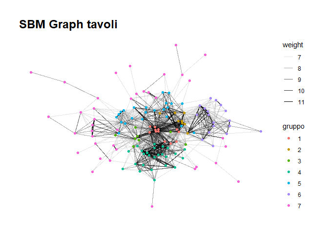<!-- --><!-- --><!-- -->

    ##       [,1]  [,2]  [,3]  [,4]  [,5]  [,6]  [,7]
    ## [1,] 0.989 0.823 0.583 0.498 0.450 0.067 0.012
    ## [2,] 0.823 0.736 0.230 0.003 0.308 0.405 0.014
    ## [3,] 0.583 0.230 0.205 0.250 0.160 0.002 0.075
    ## [4,] 0.498 0.003 0.250 0.587 0.003 0.004 0.008
    ## [5,] 0.450 0.308 0.160 0.003 0.350 0.008 0.056
    ## [6,] 0.067 0.405 0.002 0.004 0.008 0.609 0.002
    ## [7,] 0.012 0.014 0.075 0.008 0.056 0.002 0.051

<!-- -->

``` r
get_final_stats(g)
```

    ## # A tibble: 7 × 6
    ##   gruppo     n degree_mean degree_var degree_min degree_max
    ##   <fct>  <int>       <dbl>      <dbl>      <dbl>      <dbl>
    ## 1 1         12       46.9       66.8          33         55
    ## 2 2          8       32.1       17.8          27         36
    ## 3 3          8       23.4       55.4          13         35
    ## 4 4         25       22.4       82.3           7         36
    ## 5 5         23       19.3       28.8          11         33
    ## 6 6         18       14.8       46.5           3         24
    ## 7 7         38        4.24       9.00          1          9

<!-- -->

    ## [1] "Gruppo: 1"
    ## [1] "|V|: 12"
    ## [1] "|E|: 66"
    ## [1] "Distanza media: 1"
    ## [1] "Diametro: 1"
    ## [1] "Densità: 1"
    ## [1] "Transitività: 1"
    ## [1] "Assortatività str categoria : tavolo allungabile"
    ## [1] "Assortatività str destinazione d'uso : per interno"
    ## [1] "Assortatività str piano : -0.091"
    ## [1] "Assortatività str stile : moderno"
    ## [1] "Assortatività str struttura : metallo laccato"
    ## [1] "Assortatività str tipologia : rettangolare"
    ## [1] "Assortatività str marchio : -0.091"
    ## [1] "Assortatività num altezza : 76"
    ## [1] "Assortatività num estensione massima : -0.091"
    ## [1] "Assortatività num lunghezza : -0.091"
    ## [1] "Assortatività num profondità : 90"
    ## [1] "Assortatività num diametro : NA"
    ## [1] "Assortatività num degree : -0.091"

<!-- --><!-- -->

    ## [1] "Gruppo: 2"
    ## [1] "|V|: 8"
    ## [1] "|E|: 21"
    ## [1] "Distanza media: 1.25"
    ## [1] "Diametro: 2"
    ## [1] "Densità: 0.75"
    ## [1] "Transitività: 0.812"
    ## [1] "Assortatività str categoria : tavolo allungabile"
    ## [1] "Assortatività str destinazione d'uso : per interno"
    ## [1] "Assortatività str piano : -0.035"
    ## [1] "Assortatività str stile : moderno"
    ## [1] "Assortatività str struttura : -0.053"
    ## [1] "Assortatività str tipologia : rettangolare"
    ## [1] "Assortatività str marchio : -0.077"
    ## [1] "Assortatività num altezza : 0.143"
    ## [1] "Assortatività num estensione massima : -0.093"
    ## [1] "Assortatività num lunghezza : -0.135"
    ## [1] "Assortatività num profondità : 90"
    ## [1] "Assortatività num diametro : NA"
    ## [1] "Assortatività num degree : -0.134"

<!-- -->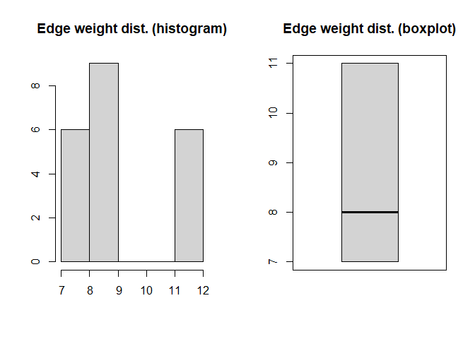<!-- -->

    ## [1] "Gruppo: 3"
    ## [1] "|V|: 8"
    ## [1] "|E|: 6"
    ## [1] "Distanza media: 1.25"
    ## [1] "Diametro: 2"
    ## [1] "Densità: 0.214"
    ## [1] "Transitività: 0.6"
    ## [1] "Assortatività str categoria : tavolo allungabile"
    ## [1] "Assortatività str destinazione d'uso : per interno"
    ## [1] "Assortatività str piano : 0.04"
    ## [1] "Assortatività str stile : moderno"
    ## [1] "Assortatività str struttura : 1"
    ## [1] "Assortatività str tipologia : 0.25"
    ## [1] "Assortatività str marchio : 0.676"
    ## [1] "Assortatività num altezza : 1"
    ## [1] "Assortatività num estensione massima : 0.176"
    ## [1] "Assortatività num lunghezza : 0.279"
    ## [1] "Assortatività num profondità : 0.657"
    ## [1] "Assortatività num diametro : NA"
    ## [1] "Assortatività num degree : 0.122"

<!-- --><!-- -->

    ## [1] "Gruppo: 4"
    ## [1] "|V|: 25"
    ## [1] "|E|: 176"
    ## [1] "Distanza media: 1.433"
    ## [1] "Diametro: 3"
    ## [1] "Densità: 0.587"
    ## [1] "Transitività: 0.753"
    ## [1] "Assortatività str categoria : -0.009"
    ## [1] "Assortatività str destinazione d'uso : per interno"
    ## [1] "Assortatività str piano : 0.038"
    ## [1] "Assortatività str stile : moderno"
    ## [1] "Assortatività str struttura : metallo laccato"
    ## [1] "Assortatività str tipologia : rettangolare"
    ## [1] "Assortatività str marchio : 0.075"
    ## [1] "Assortatività num altezza : 0.092"
    ## [1] "Assortatività num estensione massima : NA"
    ## [1] "Assortatività num lunghezza : 0.016"
    ## [1] "Assortatività num profondità : 0.032"
    ## [1] "Assortatività num diametro : NA"
    ## [1] "Assortatività num degree : -0.175"

<!-- --><!-- -->

    ## [1] "Gruppo: 5"
    ## [1] "|V|: 23"
    ## [1] "|E|: 89"
    ## [1] "Distanza media: 1.802"
    ## [1] "Diametro: 3"
    ## [1] "Densità: 0.352"
    ## [1] "Transitività: 0.638"
    ## [1] "Assortatività str categoria : 0.516"
    ## [1] "Assortatività str destinazione d'uso : per interno"
    ## [1] "Assortatività str piano : 0.348"
    ## [1] "Assortatività str stile : -0.035"
    ## [1] "Assortatività str struttura : 0.29"
    ## [1] "Assortatività str tipologia : 0.342"
    ## [1] "Assortatività str marchio : 0.213"
    ## [1] "Assortatività num altezza : -0.014"
    ## [1] "Assortatività num estensione massima : NA"
    ## [1] "Assortatività num lunghezza : NA"
    ## [1] "Assortatività num profondità : -0.023"
    ## [1] "Assortatività num diametro : NA"
    ## [1] "Assortatività num degree : -0.172"

<!-- --><!-- -->

    ## [1] "Gruppo: 6"
    ## [1] "|V|: 18"
    ## [1] "|E|: 94"
    ## [1] "Distanza media: 1.425"
    ## [1] "Diametro: 3"
    ## [1] "Densità: 0.614"
    ## [1] "Transitività: 0.798"
    ## [1] "Assortatività str categoria : -0.037"
    ## [1] "Assortatività str destinazione d'uso : per interno"
    ## [1] "Assortatività str piano : -0.016"
    ## [1] "Assortatività str stile : moderno"
    ## [1] "Assortatività str struttura : 0.06"
    ## [1] "Assortatività str tipologia : 0.126"
    ## [1] "Assortatività str marchio : 0.057"
    ## [1] "Assortatività num altezza : NA"
    ## [1] "Assortatività num estensione massima : NA"
    ## [1] "Assortatività num lunghezza : 0.132"
    ## [1] "Assortatività num profondità : 90"
    ## [1] "Assortatività num diametro : NA"
    ## [1] "Assortatività num degree : -0.125"

<!-- -->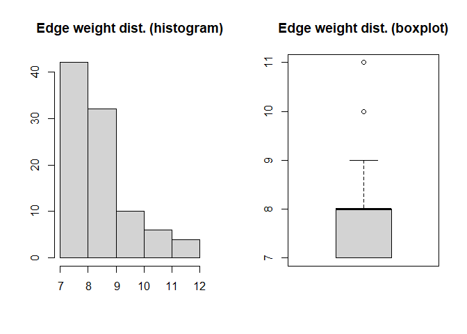<!-- -->

    ## [1] "Gruppo: 7"
    ## [1] "|V|: 38"
    ## [1] "|E|: 36"
    ## [1] "Distanza media: 2.727"
    ## [1] "Diametro: 7"
    ## [1] "Densità: 0.051"
    ## [1] "Transitività: 0.68"
    ## [1] "Assortatività str categoria : 0.875"
    ## [1] "Assortatività str destinazione d'uso : -0.029"
    ## [1] "Assortatività str piano : 0.689"
    ## [1] "Assortatività str stile : 0.644"
    ## [1] "Assortatività str struttura : 0.497"
    ## [1] "Assortatività str tipologia : 0.61"
    ## [1] "Assortatività str marchio : 0.591"
    ## [1] "Assortatività num altezza : NA"
    ## [1] "Assortatività num estensione massima : NA"
    ## [1] "Assortatività num lunghezza : NA"
    ## [1] "Assortatività num profondità : NA"
    ## [1] "Assortatività num diametro : NA"
    ## [1] "Assortatività num degree : 0.503"

<!-- --><!-- -->

#### Considerazioni

- GC rileva solo 2 cluster in meno rispetto a SBM.
- Alcuni cluster sono individuati da entrambi gli algoritmi.
- La modularità del clustering ottenuto tramite GC è più alta rispetto a
  quella del clustering ottenuto tramite SBM (risultato atteso) ma è
  comunque piuttosto bassa.
- In base al clustering tramite **SBM**:
  - i cluster non hanno la tendenza a connettersi solo con sè stessi.
  - i cluster 1 e 7 si distinguono nella distribuzione del grado dei
    nodi.
  - il cluster 1 è completamente connesso.
  - i primi 3 cluster sono costituiti da pochi articoli con feature
    molto specifiche.
  - tendenza all’omofilia su tutte le feature (per costruzione).
