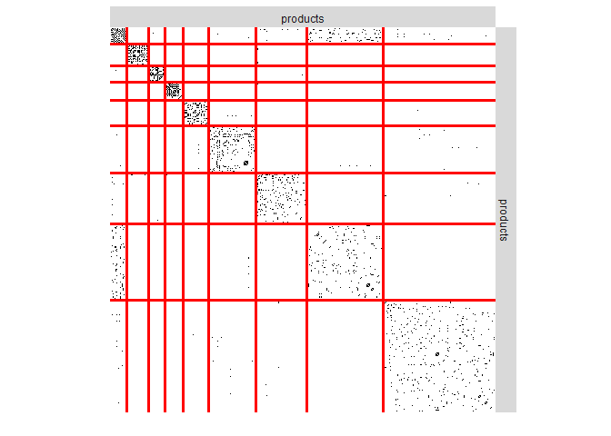
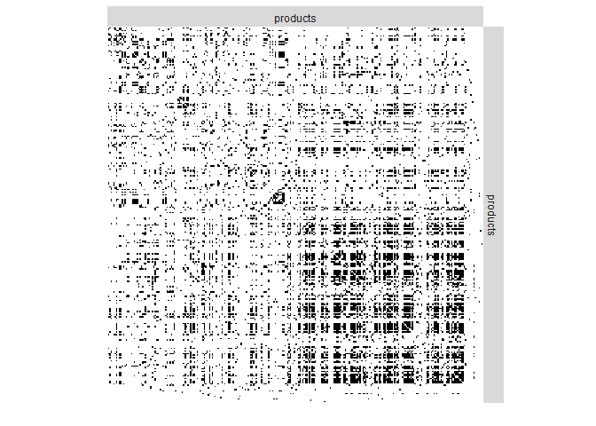
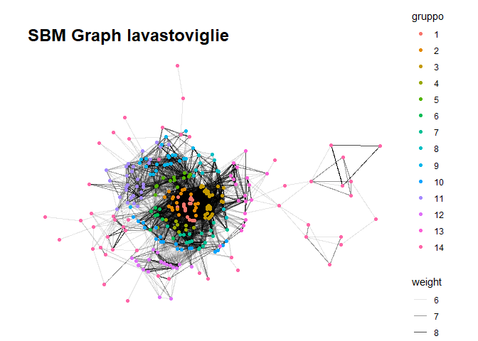
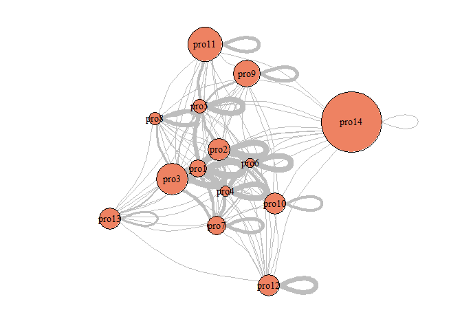
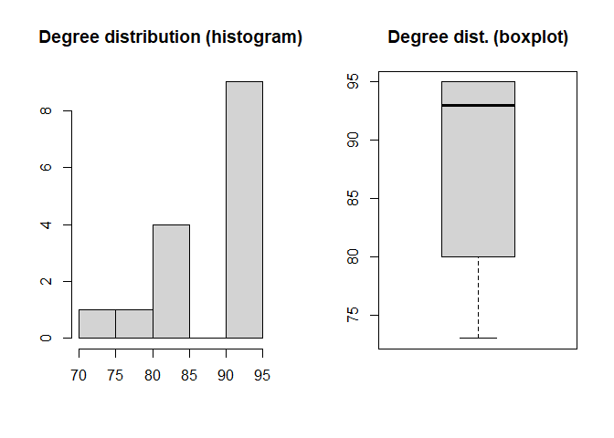
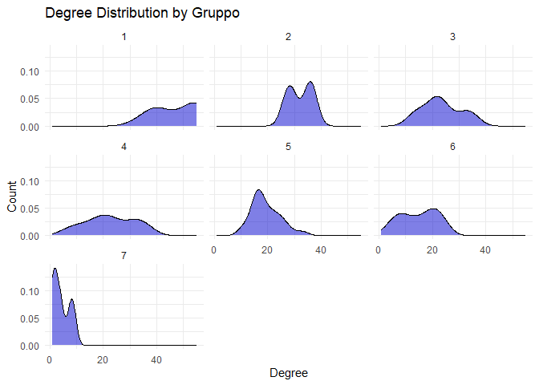
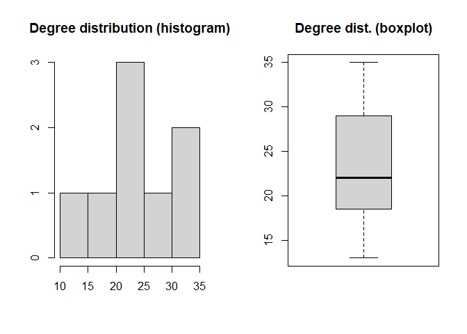
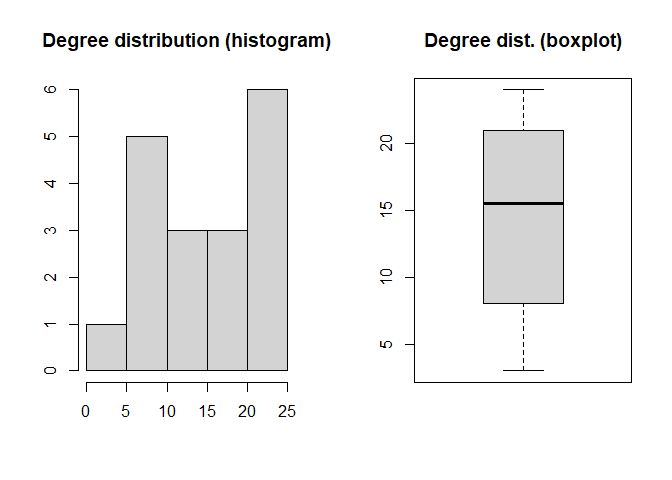

Progetto Network Data Analysis (MD2SL)
================
Mirko Verardo
21 luglio 2025

L’idea del progetto è quella di applicare gli **Stochastic Block Model
(SBM)** per fare **clustering** all’interno dell’anagrafica articoli di
un’azienda specializzata in ambito ecommerce.  
Il progetto consiste quindi nel costruire 2 diversi grafi, fare
clustering applicando gli SBM e confrontare i risultati così ottenuti
con quelli di un algoritmo più “tradizionale” di **Greedy Clustering
(GC)**.

``` r
# libreria per manipolazione dati
library(tidyverse)
# libreria per manipolazione plot
library(ggplot2)
library(extrafont)
# librerie per manipolazione grafi
library(igraph)
library(ggraph)
library(tidygraph)
library(sbm)

# imposto la directory di lavoro
setwd("C:/Users/mirko/Desktop/md2sl/network_data_analysis/esame")

# pulizia
rm(list = ls())
```

# Lettura dataset

Il dataset utilizzato per questa analisi è quindi reale e contiene i
seguenti file:

- **articoli.csv**: dati *untidy* sull’anagrafica articoli, contenente
  migliaia di articoli eterogenei per la casa (principalmente
  elettrodomestici ed arredamento)
- **attributi_str.csv**: dati *tidy* sull’anagrafica articoli,
  contenente feature categoriche sugli articoli
- **attributi_num.csv**: dati *tidy* sull’anagrafica articoli,
  contenente feature numeriche sugli articoli
- **ordini_articoli.csv**: elenco degli articoli venduti, raggruppati
  per ordini di vendita

``` r
# leggo il dataset articoli
articoli = read.csv("csv/articoli.csv", header = T, quote = "\"", row.names = NULL)
articoli_attr_str = read.csv("csv/attributi_str.csv", header = T, quote = "\"", row.names = NULL)
articoli_attr_num = read.csv("csv/attributi_num.csv", header = T, quote = "\"", row.names = NULL)

# leggo il dataset ordini
ordini_articoli = read.csv("csv/ordini_articoli.csv", header = T, quote = "\"", row.names = NULL)

# sistemo il dataset articoli
articoli = articoli %>%
  mutate(
    categoria_merce = as.factor(categoria_merce),
    marchio = as.factor(marchio)
  )

# sistemo il dataset ordini
ordini_articoli = ordini_articoli %>% 
  mutate(
    data = as.Date(data),
    multi_articolo = as.logical(as.integer(multi_articolo))
  )

nrow(articoli)
```

    ## [1] 12244

``` r
nrow(articoli_attr_str)
```

    ## [1] 53248

``` r
nrow(articoli_attr_num)
```

    ## [1] 36709

``` r
nrow(ordini_articoli)
```

    ## [1] 36438

# Clustering

## Articoli **spesso acquistati assieme**

### Creazione del grafo

L’idea è quella di costruire un **grafo indiretto pesato** in cui:

- ciascun nodo rappresenta un articolo
- esiste un arco tra 2 diversi nodi **se e solo se** i 2 corrispondenti
  articoli sono stati venduti assieme almeno una volta
- il peso di ciascun arco rappresenta il numero distinto di ordini in
  cui i 2 articoli sono stati venduti assieme

Nel dataset, quindi, vengono considerati solo gli ordini costituiti da
più articoli diversi.  
Inoltre, il dataset è stato filtrato considerando solo gli ordini degli
**ultimi 3 mesi**. Questo purtroppo per evitare grafi di grandi
dimensioni e tempi computazionali di conseguenza molto lunghi.  
Inoltre, sul grafo così costruito sono state eseguite le seguenti
operazioni preliminari:

- individuazione delle **componenti connesse (cc)**

- filtraggio delle componenti minori in modo da lavorare su un **unico
  grafo connesso**

- calcolo delle seguenti misure di centralità per ciascun nodo $i$:

  - **degree**: un nodo è centrale se è **connesso** a molti altri
    - $Ç_{i}^{d} = \sum_{j \neq i}^{|V|}y_{ij}$
    - $Ç_{i}^{d} = \frac{\sum_{j \neq i}^{|V|}y_{ij}}{|V| - 1}$
      (normalized)
  - **closeness**: un nodo è centrale se è **vicino** a molti altri
    - $Ç_{i}^{c} = \frac{|V| - 1}{\sum_{j \neq i}^{|V|}d_{ij}}$
      (normalized)
    - $d_{ij}$: lunghezza del percorso geodesico tra i nodi $i$ e $j$
  - **betweenness**: un nodo è centrale se si trova **in mezzo** a molti
    altri
    - $Ç_{i}^{b} = \frac{1}{Ç_{max}^{b}} \sum_{j > i}^{|V|}\sum_{k > j}^{|V|}\frac{n_{jk}^{i}}{g_{jk}}$
      (normalized)
    - $n_{jk}^{i}$: numero di percorsi geodesici tra i nodi $j$ e $k$,
      passanti per il nodo $i$
    - $g_{jk}$: numero di percorsi geodesici tra i nodi $j$ e $k$
    - $Ç_{max}^{b} = \frac{(|V| - 1)(|V| - 2)}{2}$

- **NB**: nel calcolo delle misure di centralità, $y_{ij}$ non indica il
  peso ma la presenza o meno dell’arco (1 o 0) tra il nodo $i$ ed il
  nodo $j$

``` r
# restringo il dataset
ordini_articoli = ordini_articoli %>%
  filter(multi_articolo) %>%
  select(-multi_articolo) %>% 
  filter(data >= "2025-03-01")

# normalizzo il dataset
ordini = ordini_articoli %>% distinct(data, ordine)
ordini_articoli = ordini_articoli %>% select(-data)

# conteggio
nrow(ordini)
```

    ## [1] 496

``` r
nrow(ordini_articoli)
```

    ## [1] 1434

``` r
# ricavo gli archi
edges = ordini_articoli %>%
  inner_join(ordini_articoli, by = "ordine", relationship = "many-to-many") %>%
  filter(articolo.x < articolo.y) %>%
  count(articolo.x, articolo.y) %>%
  rename(weight = n)

# ricavo i nodi
nodes = articoli %>% 
  filter(articolo %in% union(edges$articolo.x, edges$articolo.y))

# creo il grafo (pesato)
g = graph_from_data_frame(edges, directed = F, vertices = nodes)

# funzione che, dato un grafo costituito da più cc, restituisce un grafo con 1 sola cc (la maggiore)
keep_largest_cc = function (my_g) {
  # individuo le componenti connesse (cc)
  cc = components(my_g)
  cc_size = table(cc$csize)
  print(cc_size)
  
  # se esiste 1 sola cc, allora ok
  if (cc$no == 1)
    return (my_g)
  
  # trovo la cc maggiore
  largest_cc_id = which.max(cc$csize)
  
  # identifico i nodi che appartengono alla cc maggiore
  nodes_to_keep = which(cc$membership == largest_cc_id)
  
  # tengo solo quei nodi
  my_g = induced_subgraph(my_g, nodes_to_keep)
  
  # check
  cc = components(my_g)
  cc_size = table(cc$csize)
  print(cc_size)
  
  return(my_g)
}

g = keep_largest_cc(g)
```

    ## 
    ##   2   3   4   5   6   7   8   9  10  11  13  18  26 413 
    ## 141  35  17   7   1   6   3   3   1   1   1   1   1   1 
    ## 
    ## 413 
    ##   1

``` r
# funzione che aggiunge ai nodi di un grafo alcune misure di centralità
add_centrality_measures = function (my_g, speedup = F) {
  # degree centrality (un nodo è centrale se è connesso a molti altri)
  values = degree(my_g)
  my_g = set_vertex_attr(my_g, name = "degree", value = values)
  
  values = degree(my_g, normalized = T)
  my_g = set_vertex_attr(my_g, name = "degree_norm", value = values)
  
  # versione breve (per grafi di grandi dimensioni)
  if (speedup)
    return(my_g)
  
  # closeness centrality (un nodo è centrale se è vicino a molti altri)
  values = closeness(my_g, normalized = T, weights = NA)
  my_g = set_vertex_attr(my_g, name = "closeness", value = values)
  
  # betweenness centrality (un nodo è centrale se si trova in mezzo a molti altri)
  values = betweenness(my_g, normalized = T, weights = NA)
  my_g = set_vertex_attr(my_g, name = "betweenness", value = values)
  
  return(my_g)
}

g = add_centrality_measures(g)
```

### Visualizzazione del grafo

``` r
# funzione che, dato in input un grafo, lo visualizza in vari modi (uso ggraph, più opzioni)
network_plot = function (file, title, my_g) {
  #lyt = "fr"
  lyt = "stress"
  
  # ottimizzo i tempi
  my_file = paste("degree", file, sep = "_")
  my_file = paste("ggraph", my_file, sep = "/")
  if (file.exists(my_file)) {
    p = readRDS(my_file)
  } else {
    t = paste(title, "(degree)")
    p = ggraph(my_g, layout = lyt) +
      geom_edge_link(aes(alpha = weight)) +
      geom_node_point(aes(color = degree_norm)) +
      theme_graph(base_family = "Arial") +
      ggtitle(t)
    saveRDS(p, file = my_file)
  }
  print(p)
  
  V = V(my_g)
  c = V$closeness
  if (!is.null(c)) {
    # ottimizzo i tempi
    my_file = paste("closeness", file, sep = "_")
    my_file = paste("ggraph", my_file, sep = "/")
    if (file.exists(my_file)) {
      p = readRDS(my_file)
    } else {
      t = paste(title, "(closeness)")
      p = ggraph(my_g, layout = lyt) +
        geom_edge_link(aes(alpha = weight)) +
        geom_node_point(aes(color = closeness)) +
        theme_graph(base_family = "Arial") +
        ggtitle(t)
      saveRDS(p, file = my_file)
    }
    print(p)
  }
  
  c = V$betweenness
  if (!is.null(c)) {
    # ottimizzo i tempi
    my_file = paste("betweenness", file, sep = "_")
    my_file = paste("ggraph", my_file, sep = "/")
    if (file.exists(my_file)) {
      p = readRDS(my_file)
    } else {
      t = paste(title, "(betweenness)")
      p = ggraph(my_g, layout = lyt) +
        geom_edge_link(aes(alpha = weight)) +
        geom_node_point(aes(color = betweenness)) +
        theme_graph(base_family = "Arial") +
        ggtitle(t)
      saveRDS(p, file = my_file)
    }
    print(p)
  }
}

network_plot("ggraph_co_ordini.rds", "Network Graph Co-Ordini", g)
```

    ## $data
    ## # A tibble: 413 × 13
    ##        x     y circular name   categoria_merce        marchio descrizione degree
    ##    <dbl> <dbl> <lgl>    <chr>  <chr>                  <chr>   <chr>        <dbl>
    ##  1  5.39  6.51 FALSE    549679 erogatori e depurator… franke  miscelator…      3
    ##  2  1.53 10.2  FALSE    561918 lavelli                franke  lavello 1 …      1
    ##  3  3.02 11.9  FALSE    564630 frigoriferi            samsung frigorifer…      3
    ##  4  3.35 11.8  FALSE    564631 frigoriferi            samsung congelator…      3
    ##  5 10.5  11.1  FALSE    105454 lavelli                franke  lavello 1 …      8
    ##  6  4.88 18.1  FALSE    559039 lavelli                foster  lavello 1 …      5
    ##  7  7.80 16.1  FALSE    554882 lavastoviglie          electr… lavastovig…      4
    ##  8  5.81 17.0  FALSE    550634 forni incasso          electr… forno elet…      5
    ##  9  5.12  9.44 FALSE    8393   gocciolatoi e rollmat  franke  rollmat 47…      8
    ## 10  4.64  6.49 FALSE    517955 pulizia lavelli        franke  detergente…      3
    ## # ℹ 403 more rows
    ## # ℹ 5 more variables: degree_norm <dbl>, closeness <dbl>, betweenness <dbl>,
    ## #   .ggraph.orig_index <int>, .ggraph.index <int>
    ## 
    ## $layers
    ## $layers[[1]]
    ## mapping: edge_alpha = ~weight, x = ~x, y = ~y, xend = ~xend, yend = ~yend, group = ~edge.id 
    ## geom_edge_path: arrow = NULL, lineend = butt, linejoin = round, linemitre = 1, interpolate = FALSE, label_colour = black, label_alpha = 1, label_parse = FALSE, check_overlap = FALSE, angle_calc = rot, force_flip = TRUE, label_dodge = NULL, label_push = NULL, na.rm = FALSE
    ## stat_edge_link: n = 100, na.rm = FALSE
    ## position_identity 
    ## 
    ## $layers[[2]]
    ## mapping: colour = ~degree_norm, x = ~x, y = ~y 
    ## geom_point: na.rm = FALSE
    ## stat_filter: na.rm = FALSE
    ## position_identity 
    ## 
    ## 
    ## $scales
    ## <ggproto object: Class ScalesList, gg>
    ##     add: function
    ##     add_defaults: function
    ##     add_missing: function
    ##     backtransform_df: function
    ##     clone: function
    ##     find: function
    ##     get_scales: function
    ##     has_scale: function
    ##     input: function
    ##     map_df: function
    ##     n: function
    ##     non_position_scales: function
    ##     scales: list
    ##     set_palettes: function
    ##     train_df: function
    ##     transform_df: function
    ##     super:  <ggproto object: Class ScalesList, gg>
    ## 
    ## $guides
    ## <Guides[0] ggproto object>
    ## 
    ## <empty>
    ## 
    ## $mapping
    ## named list()
    ## attr(,"class")
    ## [1] "uneval"
    ## 
    ## $theme
    ## $line
    ## $colour
    ## [1] "black"
    ## 
    ## $linewidth
    ## [1] 0.5
    ## 
    ## $linetype
    ## [1] 1
    ## 
    ## $lineend
    ## [1] "butt"
    ## 
    ## $arrow
    ## [1] FALSE
    ## 
    ## $inherit.blank
    ## [1] TRUE
    ## 
    ## attr(,"class")
    ## [1] "element_line" "element"     
    ## 
    ## $rect
    ## $fill
    ## [1] "white"
    ## 
    ## $colour
    ## [1] "black"
    ## 
    ## $linewidth
    ## [1] 0.5
    ## 
    ## $linetype
    ## [1] 1
    ## 
    ## $inherit.blank
    ## [1] TRUE
    ## 
    ## attr(,"class")
    ## [1] "element_rect" "element"     
    ## 
    ## $text
    ## $family
    ## [1] "Arial"
    ## 
    ## $face
    ## [1] "plain"
    ## 
    ## $colour
    ## [1] "black"
    ## 
    ## $size
    ## [1] 11
    ## 
    ## $hjust
    ## [1] 0.5
    ## 
    ## $vjust
    ## [1] 0.5
    ## 
    ## $angle
    ## [1] 0
    ## 
    ## $lineheight
    ## [1] 0.9
    ## 
    ## $margin
    ## [1] 0points 0points 0points 0points
    ## 
    ## $debug
    ## [1] FALSE
    ## 
    ## $inherit.blank
    ## [1] FALSE
    ## 
    ## attr(,"class")
    ## [1] "element_text" "element"     
    ## 
    ## $title
    ## NULL
    ## 
    ## $aspect.ratio
    ## NULL
    ## 
    ## $axis.title
    ## list()
    ## attr(,"class")
    ## [1] "element_blank" "element"      
    ## 
    ## $axis.title.x
    ## $family
    ## NULL
    ## 
    ## $face
    ## NULL
    ## 
    ## $colour
    ## NULL
    ## 
    ## $size
    ## NULL
    ## 
    ## $hjust
    ## NULL
    ## 
    ## $vjust
    ## [1] 1
    ## 
    ## $angle
    ## NULL
    ## 
    ## $lineheight
    ## NULL
    ## 
    ## $margin
    ## [1] 2.75points 0points    0points    0points   
    ## 
    ## $debug
    ## NULL
    ## 
    ## $inherit.blank
    ## [1] TRUE
    ## 
    ## attr(,"class")
    ## [1] "element_text" "element"     
    ## 
    ## $axis.title.x.top
    ## $family
    ## NULL
    ## 
    ## $face
    ## NULL
    ## 
    ## $colour
    ## NULL
    ## 
    ## $size
    ## NULL
    ## 
    ## $hjust
    ## NULL
    ## 
    ## $vjust
    ## [1] 0
    ## 
    ## $angle
    ## NULL
    ## 
    ## $lineheight
    ## NULL
    ## 
    ## $margin
    ## [1] 0points    0points    2.75points 0points   
    ## 
    ## $debug
    ## NULL
    ## 
    ## $inherit.blank
    ## [1] TRUE
    ## 
    ## attr(,"class")
    ## [1] "element_text" "element"     
    ## 
    ## $axis.title.x.bottom
    ## NULL
    ## 
    ## $axis.title.y
    ## $family
    ## NULL
    ## 
    ## $face
    ## NULL
    ## 
    ## $colour
    ## NULL
    ## 
    ## $size
    ## NULL
    ## 
    ## $hjust
    ## NULL
    ## 
    ## $vjust
    ## [1] 1
    ## 
    ## $angle
    ## [1] 90
    ## 
    ## $lineheight
    ## NULL
    ## 
    ## $margin
    ## [1] 0points    2.75points 0points    0points   
    ## 
    ## $debug
    ## NULL
    ## 
    ## $inherit.blank
    ## [1] TRUE
    ## 
    ## attr(,"class")
    ## [1] "element_text" "element"     
    ## 
    ## $axis.title.y.left
    ## NULL
    ## 
    ## $axis.title.y.right
    ## $family
    ## NULL
    ## 
    ## $face
    ## NULL
    ## 
    ## $colour
    ## NULL
    ## 
    ## $size
    ## NULL
    ## 
    ## $hjust
    ## NULL
    ## 
    ## $vjust
    ## [1] 1
    ## 
    ## $angle
    ## [1] -90
    ## 
    ## $lineheight
    ## NULL
    ## 
    ## $margin
    ## [1] 0points    0points    0points    2.75points
    ## 
    ## $debug
    ## NULL
    ## 
    ## $inherit.blank
    ## [1] TRUE
    ## 
    ## attr(,"class")
    ## [1] "element_text" "element"     
    ## 
    ## $axis.text
    ## list()
    ## attr(,"class")
    ## [1] "element_blank" "element"      
    ## 
    ## $axis.text.x
    ## $family
    ## NULL
    ## 
    ## $face
    ## NULL
    ## 
    ## $colour
    ## NULL
    ## 
    ## $size
    ## NULL
    ## 
    ## $hjust
    ## NULL
    ## 
    ## $vjust
    ## [1] 1
    ## 
    ## $angle
    ## NULL
    ## 
    ## $lineheight
    ## NULL
    ## 
    ## $margin
    ## [1] 2.2points 0points   0points   0points  
    ## 
    ## $debug
    ## NULL
    ## 
    ## $inherit.blank
    ## [1] TRUE
    ## 
    ## attr(,"class")
    ## [1] "element_text" "element"     
    ## 
    ## $axis.text.x.top
    ## $family
    ## NULL
    ## 
    ## $face
    ## NULL
    ## 
    ## $colour
    ## NULL
    ## 
    ## $size
    ## NULL
    ## 
    ## $hjust
    ## NULL
    ## 
    ## $vjust
    ## [1] 0
    ## 
    ## $angle
    ## NULL
    ## 
    ## $lineheight
    ## NULL
    ## 
    ## $margin
    ## [1] 0points   0points   2.2points 0points  
    ## 
    ## $debug
    ## NULL
    ## 
    ## $inherit.blank
    ## [1] TRUE
    ## 
    ## attr(,"class")
    ## [1] "element_text" "element"     
    ## 
    ## $axis.text.x.bottom
    ## NULL
    ## 
    ## $axis.text.y
    ## $family
    ## NULL
    ## 
    ## $face
    ## NULL
    ## 
    ## $colour
    ## NULL
    ## 
    ## $size
    ## NULL
    ## 
    ## $hjust
    ## [1] 1
    ## 
    ## $vjust
    ## NULL
    ## 
    ## $angle
    ## NULL
    ## 
    ## $lineheight
    ## NULL
    ## 
    ## $margin
    ## [1] 0points   2.2points 0points   0points  
    ## 
    ## $debug
    ## NULL
    ## 
    ## $inherit.blank
    ## [1] TRUE
    ## 
    ## attr(,"class")
    ## [1] "element_text" "element"     
    ## 
    ## $axis.text.y.left
    ## NULL
    ## 
    ## $axis.text.y.right
    ## $family
    ## NULL
    ## 
    ## $face
    ## NULL
    ## 
    ## $colour
    ## NULL
    ## 
    ## $size
    ## NULL
    ## 
    ## $hjust
    ## [1] 0
    ## 
    ## $vjust
    ## NULL
    ## 
    ## $angle
    ## NULL
    ## 
    ## $lineheight
    ## NULL
    ## 
    ## $margin
    ## [1] 0points   0points   0points   2.2points
    ## 
    ## $debug
    ## NULL
    ## 
    ## $inherit.blank
    ## [1] TRUE
    ## 
    ## attr(,"class")
    ## [1] "element_text" "element"     
    ## 
    ## $axis.text.theta
    ## NULL
    ## 
    ## $axis.text.r
    ## $family
    ## NULL
    ## 
    ## $face
    ## NULL
    ## 
    ## $colour
    ## NULL
    ## 
    ## $size
    ## NULL
    ## 
    ## $hjust
    ## [1] 0.5
    ## 
    ## $vjust
    ## NULL
    ## 
    ## $angle
    ## NULL
    ## 
    ## $lineheight
    ## NULL
    ## 
    ## $margin
    ## [1] 0points   2.2points 0points   2.2points
    ## 
    ## $debug
    ## NULL
    ## 
    ## $inherit.blank
    ## [1] TRUE
    ## 
    ## attr(,"class")
    ## [1] "element_text" "element"     
    ## 
    ## $axis.ticks
    ## list()
    ## attr(,"class")
    ## [1] "element_blank" "element"      
    ## 
    ## $axis.ticks.x
    ## NULL
    ## 
    ## $axis.ticks.x.top
    ## NULL
    ## 
    ## $axis.ticks.x.bottom
    ## NULL
    ## 
    ## $axis.ticks.y
    ## NULL
    ## 
    ## $axis.ticks.y.left
    ## NULL
    ## 
    ## $axis.ticks.y.right
    ## NULL
    ## 
    ## $axis.ticks.theta
    ## NULL
    ## 
    ## $axis.ticks.r
    ## NULL
    ## 
    ## $axis.minor.ticks.x.top
    ## NULL
    ## 
    ## $axis.minor.ticks.x.bottom
    ## NULL
    ## 
    ## $axis.minor.ticks.y.left
    ## NULL
    ## 
    ## $axis.minor.ticks.y.right
    ## NULL
    ## 
    ## $axis.minor.ticks.theta
    ## NULL
    ## 
    ## $axis.minor.ticks.r
    ## NULL
    ## 
    ## $axis.ticks.length
    ## [1] 2.75points
    ## 
    ## $axis.ticks.length.x
    ## NULL
    ## 
    ## $axis.ticks.length.x.top
    ## NULL
    ## 
    ## $axis.ticks.length.x.bottom
    ## NULL
    ## 
    ## $axis.ticks.length.y
    ## NULL
    ## 
    ## $axis.ticks.length.y.left
    ## NULL
    ## 
    ## $axis.ticks.length.y.right
    ## NULL
    ## 
    ## $axis.ticks.length.theta
    ## NULL
    ## 
    ## $axis.ticks.length.r
    ## NULL
    ## 
    ## $axis.minor.ticks.length
    ## [1] 0.75 *
    ## 
    ## $axis.minor.ticks.length.x
    ## NULL
    ## 
    ## $axis.minor.ticks.length.x.top
    ## NULL
    ## 
    ## $axis.minor.ticks.length.x.bottom
    ## NULL
    ## 
    ## $axis.minor.ticks.length.y
    ## NULL
    ## 
    ## $axis.minor.ticks.length.y.left
    ## NULL
    ## 
    ## $axis.minor.ticks.length.y.right
    ## NULL
    ## 
    ## $axis.minor.ticks.length.theta
    ## NULL
    ## 
    ## $axis.minor.ticks.length.r
    ## NULL
    ## 
    ## $axis.line
    ## list()
    ## attr(,"class")
    ## [1] "element_blank" "element"      
    ## 
    ## $axis.line.x
    ## NULL
    ## 
    ## $axis.line.x.top
    ## NULL
    ## 
    ## $axis.line.x.bottom
    ## NULL
    ## 
    ## $axis.line.y
    ## NULL
    ## 
    ## $axis.line.y.left
    ## NULL
    ## 
    ## $axis.line.y.right
    ## NULL
    ## 
    ## $axis.line.theta
    ## NULL
    ## 
    ## $axis.line.r
    ## NULL
    ## 
    ## $legend.background
    ## list()
    ## attr(,"class")
    ## [1] "element_blank" "element"      
    ## 
    ## $legend.margin
    ## [1] 5.5points 5.5points 5.5points 5.5points
    ## 
    ## $legend.spacing
    ## [1] 11points
    ## 
    ## $legend.spacing.x
    ## NULL
    ## 
    ## $legend.spacing.y
    ## NULL
    ## 
    ## $legend.key
    ## list()
    ## attr(,"class")
    ## [1] "element_blank" "element"      
    ## 
    ## $legend.key.size
    ## [1] 1.2lines
    ## 
    ## $legend.key.height
    ## NULL
    ## 
    ## $legend.key.width
    ## NULL
    ## 
    ## $legend.key.spacing
    ## [1] 5.5points
    ## 
    ## $legend.key.spacing.x
    ## NULL
    ## 
    ## $legend.key.spacing.y
    ## NULL
    ## 
    ## $legend.frame
    ## NULL
    ## 
    ## $legend.ticks
    ## NULL
    ## 
    ## $legend.ticks.length
    ## [1] 0.2 *
    ## 
    ## $legend.axis.line
    ## NULL
    ## 
    ## $legend.text
    ## $family
    ## NULL
    ## 
    ## $face
    ## NULL
    ## 
    ## $colour
    ## NULL
    ## 
    ## $size
    ## [1] 0.8 *
    ## 
    ## $hjust
    ## NULL
    ## 
    ## $vjust
    ## NULL
    ## 
    ## $angle
    ## NULL
    ## 
    ## $lineheight
    ## NULL
    ## 
    ## $margin
    ## NULL
    ## 
    ## $debug
    ## NULL
    ## 
    ## $inherit.blank
    ## [1] TRUE
    ## 
    ## attr(,"class")
    ## [1] "element_text" "element"     
    ## 
    ## $legend.text.position
    ## NULL
    ## 
    ## $legend.title
    ## $family
    ## NULL
    ## 
    ## $face
    ## NULL
    ## 
    ## $colour
    ## NULL
    ## 
    ## $size
    ## NULL
    ## 
    ## $hjust
    ## [1] 0
    ## 
    ## $vjust
    ## NULL
    ## 
    ## $angle
    ## NULL
    ## 
    ## $lineheight
    ## NULL
    ## 
    ## $margin
    ## NULL
    ## 
    ## $debug
    ## NULL
    ## 
    ## $inherit.blank
    ## [1] TRUE
    ## 
    ## attr(,"class")
    ## [1] "element_text" "element"     
    ## 
    ## $legend.title.position
    ## NULL
    ## 
    ## $legend.position
    ## [1] "right"
    ## 
    ## $legend.position.inside
    ## NULL
    ## 
    ## $legend.direction
    ## NULL
    ## 
    ## $legend.byrow
    ## NULL
    ## 
    ## $legend.justification
    ## [1] "center"
    ## 
    ## $legend.justification.top
    ## NULL
    ## 
    ## $legend.justification.bottom
    ## NULL
    ## 
    ## $legend.justification.left
    ## NULL
    ## 
    ## $legend.justification.right
    ## NULL
    ## 
    ## $legend.justification.inside
    ## NULL
    ## 
    ## $legend.location
    ## NULL
    ## 
    ## $legend.box
    ## NULL
    ## 
    ## $legend.box.just
    ## NULL
    ## 
    ## $legend.box.margin
    ## [1] 0cm 0cm 0cm 0cm
    ## 
    ## $legend.box.background
    ## list()
    ## attr(,"class")
    ## [1] "element_blank" "element"      
    ## 
    ## $legend.box.spacing
    ## [1] 11points
    ## 
    ## $panel.background
    ## list()
    ## attr(,"class")
    ## [1] "element_blank" "element"      
    ## 
    ## $panel.border
    ## list()
    ## attr(,"class")
    ## [1] "element_blank" "element"      
    ## 
    ## $panel.spacing
    ## [1] 5.5points
    ## 
    ## $panel.spacing.x
    ## NULL
    ## 
    ## $panel.spacing.y
    ## NULL
    ## 
    ## $panel.grid
    ## list()
    ## attr(,"class")
    ## [1] "element_blank" "element"      
    ## 
    ## $panel.grid.major
    ## NULL
    ## 
    ## $panel.grid.minor
    ## $colour
    ## NULL
    ## 
    ## $linewidth
    ## [1] 0.5 *
    ## 
    ## $linetype
    ## NULL
    ## 
    ## $lineend
    ## NULL
    ## 
    ## $arrow
    ## [1] FALSE
    ## 
    ## $inherit.blank
    ## [1] TRUE
    ## 
    ## attr(,"class")
    ## [1] "element_line" "element"     
    ## 
    ## $panel.grid.major.x
    ## NULL
    ## 
    ## $panel.grid.major.y
    ## NULL
    ## 
    ## $panel.grid.minor.x
    ## NULL
    ## 
    ## $panel.grid.minor.y
    ## NULL
    ## 
    ## $panel.ontop
    ## [1] FALSE
    ## 
    ## $plot.background
    ## $fill
    ## [1] "white"
    ## 
    ## $colour
    ## [1] NA
    ## 
    ## $linewidth
    ## NULL
    ## 
    ## $linetype
    ## NULL
    ## 
    ## $inherit.blank
    ## [1] FALSE
    ## 
    ## attr(,"class")
    ## [1] "element_rect" "element"     
    ## 
    ## $plot.title
    ## $family
    ## [1] "Arial"
    ## 
    ## $face
    ## [1] "bold"
    ## 
    ## $colour
    ## [1] "black"
    ## 
    ## $size
    ## [1] 18
    ## 
    ## $hjust
    ## [1] 0
    ## 
    ## $vjust
    ## [1] 1
    ## 
    ## $angle
    ## NULL
    ## 
    ## $lineheight
    ## NULL
    ## 
    ## $margin
    ## [1] 0points  0points  10points 0points 
    ## 
    ## $debug
    ## NULL
    ## 
    ## $inherit.blank
    ## [1] FALSE
    ## 
    ## attr(,"class")
    ## [1] "element_text" "element"     
    ## 
    ## $plot.title.position
    ## [1] "panel"
    ## 
    ## $plot.subtitle
    ## $family
    ## [1] "Arial"
    ## 
    ## $face
    ## [1] "plain"
    ## 
    ## $colour
    ## [1] "black"
    ## 
    ## $size
    ## [1] 12
    ## 
    ## $hjust
    ## [1] 0
    ## 
    ## $vjust
    ## [1] 1
    ## 
    ## $angle
    ## NULL
    ## 
    ## $lineheight
    ## NULL
    ## 
    ## $margin
    ## [1] 0points  0points  15points 0points 
    ## 
    ## $debug
    ## NULL
    ## 
    ## $inherit.blank
    ## [1] FALSE
    ## 
    ## attr(,"class")
    ## [1] "element_text" "element"     
    ## 
    ## $plot.caption
    ## $family
    ## [1] "Arial"
    ## 
    ## $face
    ## [1] "italic"
    ## 
    ## $colour
    ## [1] "black"
    ## 
    ## $size
    ## [1] 9
    ## 
    ## $hjust
    ## [1] 1
    ## 
    ## $vjust
    ## [1] 1
    ## 
    ## $angle
    ## NULL
    ## 
    ## $lineheight
    ## NULL
    ## 
    ## $margin
    ## [1] 10points 0points  0points  0points 
    ## 
    ## $debug
    ## NULL
    ## 
    ## $inherit.blank
    ## [1] FALSE
    ## 
    ## attr(,"class")
    ## [1] "element_text" "element"     
    ## 
    ## $plot.caption.position
    ## [1] "panel"
    ## 
    ## $plot.tag
    ## $family
    ## NULL
    ## 
    ## $face
    ## NULL
    ## 
    ## $colour
    ## NULL
    ## 
    ## $size
    ## [1] 1.2 *
    ## 
    ## $hjust
    ## [1] 0.5
    ## 
    ## $vjust
    ## [1] 0.5
    ## 
    ## $angle
    ## NULL
    ## 
    ## $lineheight
    ## NULL
    ## 
    ## $margin
    ## NULL
    ## 
    ## $debug
    ## NULL
    ## 
    ## $inherit.blank
    ## [1] TRUE
    ## 
    ## attr(,"class")
    ## [1] "element_text" "element"     
    ## 
    ## $plot.tag.position
    ## [1] "topleft"
    ## 
    ## $plot.tag.location
    ## NULL
    ## 
    ## $plot.margin
    ## [1] 30points 30points 30points 30points
    ## 
    ## $strip.background
    ## list()
    ## attr(,"class")
    ## [1] "element_blank" "element"      
    ## 
    ## $strip.background.x
    ## NULL
    ## 
    ## $strip.background.y
    ## NULL
    ## 
    ## $strip.clip
    ## [1] "inherit"
    ## 
    ## $strip.placement
    ## [1] "inside"
    ## 
    ## $strip.text
    ## $family
    ## [1] "Arial"
    ## 
    ## $face
    ## [1] "bold"
    ## 
    ## $colour
    ## [1] "black"
    ## 
    ## $size
    ## [1] 10
    ## 
    ## $hjust
    ## NULL
    ## 
    ## $vjust
    ## NULL
    ## 
    ## $angle
    ## NULL
    ## 
    ## $lineheight
    ## NULL
    ## 
    ## $margin
    ## [1] 4.4points 4.4points 4.4points 4.4points
    ## 
    ## $debug
    ## NULL
    ## 
    ## $inherit.blank
    ## [1] FALSE
    ## 
    ## attr(,"class")
    ## [1] "element_text" "element"     
    ## 
    ## $strip.text.x
    ## NULL
    ## 
    ## $strip.text.x.bottom
    ## NULL
    ## 
    ## $strip.text.x.top
    ## NULL
    ## 
    ## $strip.text.y
    ## $family
    ## NULL
    ## 
    ## $face
    ## NULL
    ## 
    ## $colour
    ## NULL
    ## 
    ## $size
    ## NULL
    ## 
    ## $hjust
    ## NULL
    ## 
    ## $vjust
    ## NULL
    ## 
    ## $angle
    ## [1] -90
    ## 
    ## $lineheight
    ## NULL
    ## 
    ## $margin
    ## NULL
    ## 
    ## $debug
    ## NULL
    ## 
    ## $inherit.blank
    ## [1] TRUE
    ## 
    ## attr(,"class")
    ## [1] "element_text" "element"     
    ## 
    ## $strip.text.y.left
    ## $family
    ## NULL
    ## 
    ## $face
    ## NULL
    ## 
    ## $colour
    ## NULL
    ## 
    ## $size
    ## NULL
    ## 
    ## $hjust
    ## NULL
    ## 
    ## $vjust
    ## NULL
    ## 
    ## $angle
    ## [1] 90
    ## 
    ## $lineheight
    ## NULL
    ## 
    ## $margin
    ## NULL
    ## 
    ## $debug
    ## NULL
    ## 
    ## $inherit.blank
    ## [1] TRUE
    ## 
    ## attr(,"class")
    ## [1] "element_text" "element"     
    ## 
    ## $strip.text.y.right
    ## NULL
    ## 
    ## $strip.switch.pad.grid
    ## [1] 2.75points
    ## 
    ## $strip.switch.pad.wrap
    ## [1] 2.75points
    ## 
    ## attr(,"class")
    ## [1] "theme" "gg"   
    ## attr(,"complete")
    ## [1] TRUE
    ## attr(,"validate")
    ## [1] TRUE
    ## 
    ## $coordinates
    ## <ggproto object: Class CoordCartesian, Coord, gg>
    ##     aspect: function
    ##     backtransform_range: function
    ##     clip: on
    ##     default: TRUE
    ##     distance: function
    ##     draw_panel: function
    ##     expand: TRUE
    ##     is_free: function
    ##     is_linear: function
    ##     labels: function
    ##     limits: list
    ##     modify_scales: function
    ##     range: function
    ##     render_axis_h: function
    ##     render_axis_v: function
    ##     render_bg: function
    ##     render_fg: function
    ##     reverse: none
    ##     setup_data: function
    ##     setup_layout: function
    ##     setup_panel_guides: function
    ##     setup_panel_params: function
    ##     setup_params: function
    ##     train_panel_guides: function
    ##     transform: function
    ##     super:  <ggproto object: Class CoordCartesian, Coord, gg>
    ## 
    ## $facet
    ## <ggproto object: Class FacetNull, Facet, gg>
    ##     attach_axes: function
    ##     attach_strips: function
    ##     compute_layout: function
    ##     draw_back: function
    ##     draw_front: function
    ##     draw_labels: function
    ##     draw_panel_content: function
    ##     draw_panels: function
    ##     finish_data: function
    ##     format_strip_labels: function
    ##     init_gtable: function
    ##     init_scales: function
    ##     map_data: function
    ##     params: list
    ##     set_panel_size: function
    ##     setup_data: function
    ##     setup_panel_params: function
    ##     setup_params: function
    ##     shrink: TRUE
    ##     train_scales: function
    ##     vars: function
    ##     super:  <ggproto object: Class FacetNull, Facet, gg>
    ## 
    ## $plot_env
    ## <environment: 0x0000017573137e00>
    ## 
    ## $layout
    ## <ggproto object: Class Layout, gg>
    ##     coord: NULL
    ##     coord_params: list
    ##     facet: NULL
    ##     facet_params: list
    ##     finish_data: function
    ##     get_scales: function
    ##     layout: NULL
    ##     map_position: function
    ##     panel_params: NULL
    ##     panel_scales_x: NULL
    ##     panel_scales_y: NULL
    ##     render: function
    ##     render_labels: function
    ##     reset_scales: function
    ##     resolve_label: function
    ##     setup: function
    ##     setup_panel_guides: function
    ##     setup_panel_params: function
    ##     train_position: function
    ##     super:  <ggproto object: Class Layout, gg>
    ## 
    ## $labels
    ## $labels$title
    ## [1] "Network Graph Co-Ordini (degree)"
    ## 
    ## $labels$edge_alpha
    ## [1] "weight"
    ## 
    ## $labels$x
    ## [1] "x"
    ## 
    ## $labels$y
    ## [1] "y"
    ## 
    ## $labels$xend
    ## [1] "xend"
    ## 
    ## $labels$yend
    ## [1] "yend"
    ## 
    ## $labels$group
    ## [1] "edge.id"
    ## 
    ## $labels$colour
    ## [1] "degree_norm"
    ## 
    ## $labels$filter
    ## [1] "filter"
    ## attr(,"fallback")
    ## [1] TRUE
    ## 
    ## 
    ## attr(,"class")
    ## [1] "ggraph" "gg"     "ggplot"
    ## $data
    ## # A tibble: 413 × 13
    ##        x     y circular name   categoria_merce        marchio descrizione degree
    ##    <dbl> <dbl> <lgl>    <chr>  <chr>                  <chr>   <chr>        <dbl>
    ##  1  5.39  6.51 FALSE    549679 erogatori e depurator… franke  miscelator…      3
    ##  2  1.53 10.2  FALSE    561918 lavelli                franke  lavello 1 …      1
    ##  3  3.02 11.9  FALSE    564630 frigoriferi            samsung frigorifer…      3
    ##  4  3.35 11.8  FALSE    564631 frigoriferi            samsung congelator…      3
    ##  5 10.5  11.1  FALSE    105454 lavelli                franke  lavello 1 …      8
    ##  6  4.88 18.1  FALSE    559039 lavelli                foster  lavello 1 …      5
    ##  7  7.80 16.1  FALSE    554882 lavastoviglie          electr… lavastovig…      4
    ##  8  5.81 17.0  FALSE    550634 forni incasso          electr… forno elet…      5
    ##  9  5.12  9.44 FALSE    8393   gocciolatoi e rollmat  franke  rollmat 47…      8
    ## 10  4.64  6.49 FALSE    517955 pulizia lavelli        franke  detergente…      3
    ## # ℹ 403 more rows
    ## # ℹ 5 more variables: degree_norm <dbl>, closeness <dbl>, betweenness <dbl>,
    ## #   .ggraph.orig_index <int>, .ggraph.index <int>
    ## 
    ## $layers
    ## $layers[[1]]
    ## mapping: edge_alpha = ~weight, x = ~x, y = ~y, xend = ~xend, yend = ~yend, group = ~edge.id 
    ## geom_edge_path: arrow = NULL, lineend = butt, linejoin = round, linemitre = 1, interpolate = FALSE, label_colour = black, label_alpha = 1, label_parse = FALSE, check_overlap = FALSE, angle_calc = rot, force_flip = TRUE, label_dodge = NULL, label_push = NULL, na.rm = FALSE
    ## stat_edge_link: n = 100, na.rm = FALSE
    ## position_identity 
    ## 
    ## $layers[[2]]
    ## mapping: colour = ~closeness, x = ~x, y = ~y 
    ## geom_point: na.rm = FALSE
    ## stat_filter: na.rm = FALSE
    ## position_identity 
    ## 
    ## 
    ## $scales
    ## <ggproto object: Class ScalesList, gg>
    ##     add: function
    ##     add_defaults: function
    ##     add_missing: function
    ##     backtransform_df: function
    ##     clone: function
    ##     find: function
    ##     get_scales: function
    ##     has_scale: function
    ##     input: function
    ##     map_df: function
    ##     n: function
    ##     non_position_scales: function
    ##     scales: list
    ##     set_palettes: function
    ##     train_df: function
    ##     transform_df: function
    ##     super:  <ggproto object: Class ScalesList, gg>
    ## 
    ## $guides
    ## <Guides[0] ggproto object>
    ## 
    ## <empty>
    ## 
    ## $mapping
    ## named list()
    ## attr(,"class")
    ## [1] "uneval"
    ## 
    ## $theme
    ## $line
    ## $colour
    ## [1] "black"
    ## 
    ## $linewidth
    ## [1] 0.5
    ## 
    ## $linetype
    ## [1] 1
    ## 
    ## $lineend
    ## [1] "butt"
    ## 
    ## $arrow
    ## [1] FALSE
    ## 
    ## $inherit.blank
    ## [1] TRUE
    ## 
    ## attr(,"class")
    ## [1] "element_line" "element"     
    ## 
    ## $rect
    ## $fill
    ## [1] "white"
    ## 
    ## $colour
    ## [1] "black"
    ## 
    ## $linewidth
    ## [1] 0.5
    ## 
    ## $linetype
    ## [1] 1
    ## 
    ## $inherit.blank
    ## [1] TRUE
    ## 
    ## attr(,"class")
    ## [1] "element_rect" "element"     
    ## 
    ## $text
    ## $family
    ## [1] "Arial"
    ## 
    ## $face
    ## [1] "plain"
    ## 
    ## $colour
    ## [1] "black"
    ## 
    ## $size
    ## [1] 11
    ## 
    ## $hjust
    ## [1] 0.5
    ## 
    ## $vjust
    ## [1] 0.5
    ## 
    ## $angle
    ## [1] 0
    ## 
    ## $lineheight
    ## [1] 0.9
    ## 
    ## $margin
    ## [1] 0points 0points 0points 0points
    ## 
    ## $debug
    ## [1] FALSE
    ## 
    ## $inherit.blank
    ## [1] FALSE
    ## 
    ## attr(,"class")
    ## [1] "element_text" "element"     
    ## 
    ## $title
    ## NULL
    ## 
    ## $aspect.ratio
    ## NULL
    ## 
    ## $axis.title
    ## list()
    ## attr(,"class")
    ## [1] "element_blank" "element"      
    ## 
    ## $axis.title.x
    ## $family
    ## NULL
    ## 
    ## $face
    ## NULL
    ## 
    ## $colour
    ## NULL
    ## 
    ## $size
    ## NULL
    ## 
    ## $hjust
    ## NULL
    ## 
    ## $vjust
    ## [1] 1
    ## 
    ## $angle
    ## NULL
    ## 
    ## $lineheight
    ## NULL
    ## 
    ## $margin
    ## [1] 2.75points 0points    0points    0points   
    ## 
    ## $debug
    ## NULL
    ## 
    ## $inherit.blank
    ## [1] TRUE
    ## 
    ## attr(,"class")
    ## [1] "element_text" "element"     
    ## 
    ## $axis.title.x.top
    ## $family
    ## NULL
    ## 
    ## $face
    ## NULL
    ## 
    ## $colour
    ## NULL
    ## 
    ## $size
    ## NULL
    ## 
    ## $hjust
    ## NULL
    ## 
    ## $vjust
    ## [1] 0
    ## 
    ## $angle
    ## NULL
    ## 
    ## $lineheight
    ## NULL
    ## 
    ## $margin
    ## [1] 0points    0points    2.75points 0points   
    ## 
    ## $debug
    ## NULL
    ## 
    ## $inherit.blank
    ## [1] TRUE
    ## 
    ## attr(,"class")
    ## [1] "element_text" "element"     
    ## 
    ## $axis.title.x.bottom
    ## NULL
    ## 
    ## $axis.title.y
    ## $family
    ## NULL
    ## 
    ## $face
    ## NULL
    ## 
    ## $colour
    ## NULL
    ## 
    ## $size
    ## NULL
    ## 
    ## $hjust
    ## NULL
    ## 
    ## $vjust
    ## [1] 1
    ## 
    ## $angle
    ## [1] 90
    ## 
    ## $lineheight
    ## NULL
    ## 
    ## $margin
    ## [1] 0points    2.75points 0points    0points   
    ## 
    ## $debug
    ## NULL
    ## 
    ## $inherit.blank
    ## [1] TRUE
    ## 
    ## attr(,"class")
    ## [1] "element_text" "element"     
    ## 
    ## $axis.title.y.left
    ## NULL
    ## 
    ## $axis.title.y.right
    ## $family
    ## NULL
    ## 
    ## $face
    ## NULL
    ## 
    ## $colour
    ## NULL
    ## 
    ## $size
    ## NULL
    ## 
    ## $hjust
    ## NULL
    ## 
    ## $vjust
    ## [1] 1
    ## 
    ## $angle
    ## [1] -90
    ## 
    ## $lineheight
    ## NULL
    ## 
    ## $margin
    ## [1] 0points    0points    0points    2.75points
    ## 
    ## $debug
    ## NULL
    ## 
    ## $inherit.blank
    ## [1] TRUE
    ## 
    ## attr(,"class")
    ## [1] "element_text" "element"     
    ## 
    ## $axis.text
    ## list()
    ## attr(,"class")
    ## [1] "element_blank" "element"      
    ## 
    ## $axis.text.x
    ## $family
    ## NULL
    ## 
    ## $face
    ## NULL
    ## 
    ## $colour
    ## NULL
    ## 
    ## $size
    ## NULL
    ## 
    ## $hjust
    ## NULL
    ## 
    ## $vjust
    ## [1] 1
    ## 
    ## $angle
    ## NULL
    ## 
    ## $lineheight
    ## NULL
    ## 
    ## $margin
    ## [1] 2.2points 0points   0points   0points  
    ## 
    ## $debug
    ## NULL
    ## 
    ## $inherit.blank
    ## [1] TRUE
    ## 
    ## attr(,"class")
    ## [1] "element_text" "element"     
    ## 
    ## $axis.text.x.top
    ## $family
    ## NULL
    ## 
    ## $face
    ## NULL
    ## 
    ## $colour
    ## NULL
    ## 
    ## $size
    ## NULL
    ## 
    ## $hjust
    ## NULL
    ## 
    ## $vjust
    ## [1] 0
    ## 
    ## $angle
    ## NULL
    ## 
    ## $lineheight
    ## NULL
    ## 
    ## $margin
    ## [1] 0points   0points   2.2points 0points  
    ## 
    ## $debug
    ## NULL
    ## 
    ## $inherit.blank
    ## [1] TRUE
    ## 
    ## attr(,"class")
    ## [1] "element_text" "element"     
    ## 
    ## $axis.text.x.bottom
    ## NULL
    ## 
    ## $axis.text.y
    ## $family
    ## NULL
    ## 
    ## $face
    ## NULL
    ## 
    ## $colour
    ## NULL
    ## 
    ## $size
    ## NULL
    ## 
    ## $hjust
    ## [1] 1
    ## 
    ## $vjust
    ## NULL
    ## 
    ## $angle
    ## NULL
    ## 
    ## $lineheight
    ## NULL
    ## 
    ## $margin
    ## [1] 0points   2.2points 0points   0points  
    ## 
    ## $debug
    ## NULL
    ## 
    ## $inherit.blank
    ## [1] TRUE
    ## 
    ## attr(,"class")
    ## [1] "element_text" "element"     
    ## 
    ## $axis.text.y.left
    ## NULL
    ## 
    ## $axis.text.y.right
    ## $family
    ## NULL
    ## 
    ## $face
    ## NULL
    ## 
    ## $colour
    ## NULL
    ## 
    ## $size
    ## NULL
    ## 
    ## $hjust
    ## [1] 0
    ## 
    ## $vjust
    ## NULL
    ## 
    ## $angle
    ## NULL
    ## 
    ## $lineheight
    ## NULL
    ## 
    ## $margin
    ## [1] 0points   0points   0points   2.2points
    ## 
    ## $debug
    ## NULL
    ## 
    ## $inherit.blank
    ## [1] TRUE
    ## 
    ## attr(,"class")
    ## [1] "element_text" "element"     
    ## 
    ## $axis.text.theta
    ## NULL
    ## 
    ## $axis.text.r
    ## $family
    ## NULL
    ## 
    ## $face
    ## NULL
    ## 
    ## $colour
    ## NULL
    ## 
    ## $size
    ## NULL
    ## 
    ## $hjust
    ## [1] 0.5
    ## 
    ## $vjust
    ## NULL
    ## 
    ## $angle
    ## NULL
    ## 
    ## $lineheight
    ## NULL
    ## 
    ## $margin
    ## [1] 0points   2.2points 0points   2.2points
    ## 
    ## $debug
    ## NULL
    ## 
    ## $inherit.blank
    ## [1] TRUE
    ## 
    ## attr(,"class")
    ## [1] "element_text" "element"     
    ## 
    ## $axis.ticks
    ## list()
    ## attr(,"class")
    ## [1] "element_blank" "element"      
    ## 
    ## $axis.ticks.x
    ## NULL
    ## 
    ## $axis.ticks.x.top
    ## NULL
    ## 
    ## $axis.ticks.x.bottom
    ## NULL
    ## 
    ## $axis.ticks.y
    ## NULL
    ## 
    ## $axis.ticks.y.left
    ## NULL
    ## 
    ## $axis.ticks.y.right
    ## NULL
    ## 
    ## $axis.ticks.theta
    ## NULL
    ## 
    ## $axis.ticks.r
    ## NULL
    ## 
    ## $axis.minor.ticks.x.top
    ## NULL
    ## 
    ## $axis.minor.ticks.x.bottom
    ## NULL
    ## 
    ## $axis.minor.ticks.y.left
    ## NULL
    ## 
    ## $axis.minor.ticks.y.right
    ## NULL
    ## 
    ## $axis.minor.ticks.theta
    ## NULL
    ## 
    ## $axis.minor.ticks.r
    ## NULL
    ## 
    ## $axis.ticks.length
    ## [1] 2.75points
    ## 
    ## $axis.ticks.length.x
    ## NULL
    ## 
    ## $axis.ticks.length.x.top
    ## NULL
    ## 
    ## $axis.ticks.length.x.bottom
    ## NULL
    ## 
    ## $axis.ticks.length.y
    ## NULL
    ## 
    ## $axis.ticks.length.y.left
    ## NULL
    ## 
    ## $axis.ticks.length.y.right
    ## NULL
    ## 
    ## $axis.ticks.length.theta
    ## NULL
    ## 
    ## $axis.ticks.length.r
    ## NULL
    ## 
    ## $axis.minor.ticks.length
    ## [1] 0.75 *
    ## 
    ## $axis.minor.ticks.length.x
    ## NULL
    ## 
    ## $axis.minor.ticks.length.x.top
    ## NULL
    ## 
    ## $axis.minor.ticks.length.x.bottom
    ## NULL
    ## 
    ## $axis.minor.ticks.length.y
    ## NULL
    ## 
    ## $axis.minor.ticks.length.y.left
    ## NULL
    ## 
    ## $axis.minor.ticks.length.y.right
    ## NULL
    ## 
    ## $axis.minor.ticks.length.theta
    ## NULL
    ## 
    ## $axis.minor.ticks.length.r
    ## NULL
    ## 
    ## $axis.line
    ## list()
    ## attr(,"class")
    ## [1] "element_blank" "element"      
    ## 
    ## $axis.line.x
    ## NULL
    ## 
    ## $axis.line.x.top
    ## NULL
    ## 
    ## $axis.line.x.bottom
    ## NULL
    ## 
    ## $axis.line.y
    ## NULL
    ## 
    ## $axis.line.y.left
    ## NULL
    ## 
    ## $axis.line.y.right
    ## NULL
    ## 
    ## $axis.line.theta
    ## NULL
    ## 
    ## $axis.line.r
    ## NULL
    ## 
    ## $legend.background
    ## list()
    ## attr(,"class")
    ## [1] "element_blank" "element"      
    ## 
    ## $legend.margin
    ## [1] 5.5points 5.5points 5.5points 5.5points
    ## 
    ## $legend.spacing
    ## [1] 11points
    ## 
    ## $legend.spacing.x
    ## NULL
    ## 
    ## $legend.spacing.y
    ## NULL
    ## 
    ## $legend.key
    ## list()
    ## attr(,"class")
    ## [1] "element_blank" "element"      
    ## 
    ## $legend.key.size
    ## [1] 1.2lines
    ## 
    ## $legend.key.height
    ## NULL
    ## 
    ## $legend.key.width
    ## NULL
    ## 
    ## $legend.key.spacing
    ## [1] 5.5points
    ## 
    ## $legend.key.spacing.x
    ## NULL
    ## 
    ## $legend.key.spacing.y
    ## NULL
    ## 
    ## $legend.frame
    ## NULL
    ## 
    ## $legend.ticks
    ## NULL
    ## 
    ## $legend.ticks.length
    ## [1] 0.2 *
    ## 
    ## $legend.axis.line
    ## NULL
    ## 
    ## $legend.text
    ## $family
    ## NULL
    ## 
    ## $face
    ## NULL
    ## 
    ## $colour
    ## NULL
    ## 
    ## $size
    ## [1] 0.8 *
    ## 
    ## $hjust
    ## NULL
    ## 
    ## $vjust
    ## NULL
    ## 
    ## $angle
    ## NULL
    ## 
    ## $lineheight
    ## NULL
    ## 
    ## $margin
    ## NULL
    ## 
    ## $debug
    ## NULL
    ## 
    ## $inherit.blank
    ## [1] TRUE
    ## 
    ## attr(,"class")
    ## [1] "element_text" "element"     
    ## 
    ## $legend.text.position
    ## NULL
    ## 
    ## $legend.title
    ## $family
    ## NULL
    ## 
    ## $face
    ## NULL
    ## 
    ## $colour
    ## NULL
    ## 
    ## $size
    ## NULL
    ## 
    ## $hjust
    ## [1] 0
    ## 
    ## $vjust
    ## NULL
    ## 
    ## $angle
    ## NULL
    ## 
    ## $lineheight
    ## NULL
    ## 
    ## $margin
    ## NULL
    ## 
    ## $debug
    ## NULL
    ## 
    ## $inherit.blank
    ## [1] TRUE
    ## 
    ## attr(,"class")
    ## [1] "element_text" "element"     
    ## 
    ## $legend.title.position
    ## NULL
    ## 
    ## $legend.position
    ## [1] "right"
    ## 
    ## $legend.position.inside
    ## NULL
    ## 
    ## $legend.direction
    ## NULL
    ## 
    ## $legend.byrow
    ## NULL
    ## 
    ## $legend.justification
    ## [1] "center"
    ## 
    ## $legend.justification.top
    ## NULL
    ## 
    ## $legend.justification.bottom
    ## NULL
    ## 
    ## $legend.justification.left
    ## NULL
    ## 
    ## $legend.justification.right
    ## NULL
    ## 
    ## $legend.justification.inside
    ## NULL
    ## 
    ## $legend.location
    ## NULL
    ## 
    ## $legend.box
    ## NULL
    ## 
    ## $legend.box.just
    ## NULL
    ## 
    ## $legend.box.margin
    ## [1] 0cm 0cm 0cm 0cm
    ## 
    ## $legend.box.background
    ## list()
    ## attr(,"class")
    ## [1] "element_blank" "element"      
    ## 
    ## $legend.box.spacing
    ## [1] 11points
    ## 
    ## $panel.background
    ## list()
    ## attr(,"class")
    ## [1] "element_blank" "element"      
    ## 
    ## $panel.border
    ## list()
    ## attr(,"class")
    ## [1] "element_blank" "element"      
    ## 
    ## $panel.spacing
    ## [1] 5.5points
    ## 
    ## $panel.spacing.x
    ## NULL
    ## 
    ## $panel.spacing.y
    ## NULL
    ## 
    ## $panel.grid
    ## list()
    ## attr(,"class")
    ## [1] "element_blank" "element"      
    ## 
    ## $panel.grid.major
    ## NULL
    ## 
    ## $panel.grid.minor
    ## $colour
    ## NULL
    ## 
    ## $linewidth
    ## [1] 0.5 *
    ## 
    ## $linetype
    ## NULL
    ## 
    ## $lineend
    ## NULL
    ## 
    ## $arrow
    ## [1] FALSE
    ## 
    ## $inherit.blank
    ## [1] TRUE
    ## 
    ## attr(,"class")
    ## [1] "element_line" "element"     
    ## 
    ## $panel.grid.major.x
    ## NULL
    ## 
    ## $panel.grid.major.y
    ## NULL
    ## 
    ## $panel.grid.minor.x
    ## NULL
    ## 
    ## $panel.grid.minor.y
    ## NULL
    ## 
    ## $panel.ontop
    ## [1] FALSE
    ## 
    ## $plot.background
    ## $fill
    ## [1] "white"
    ## 
    ## $colour
    ## [1] NA
    ## 
    ## $linewidth
    ## NULL
    ## 
    ## $linetype
    ## NULL
    ## 
    ## $inherit.blank
    ## [1] FALSE
    ## 
    ## attr(,"class")
    ## [1] "element_rect" "element"     
    ## 
    ## $plot.title
    ## $family
    ## [1] "Arial"
    ## 
    ## $face
    ## [1] "bold"
    ## 
    ## $colour
    ## [1] "black"
    ## 
    ## $size
    ## [1] 18
    ## 
    ## $hjust
    ## [1] 0
    ## 
    ## $vjust
    ## [1] 1
    ## 
    ## $angle
    ## NULL
    ## 
    ## $lineheight
    ## NULL
    ## 
    ## $margin
    ## [1] 0points  0points  10points 0points 
    ## 
    ## $debug
    ## NULL
    ## 
    ## $inherit.blank
    ## [1] FALSE
    ## 
    ## attr(,"class")
    ## [1] "element_text" "element"     
    ## 
    ## $plot.title.position
    ## [1] "panel"
    ## 
    ## $plot.subtitle
    ## $family
    ## [1] "Arial"
    ## 
    ## $face
    ## [1] "plain"
    ## 
    ## $colour
    ## [1] "black"
    ## 
    ## $size
    ## [1] 12
    ## 
    ## $hjust
    ## [1] 0
    ## 
    ## $vjust
    ## [1] 1
    ## 
    ## $angle
    ## NULL
    ## 
    ## $lineheight
    ## NULL
    ## 
    ## $margin
    ## [1] 0points  0points  15points 0points 
    ## 
    ## $debug
    ## NULL
    ## 
    ## $inherit.blank
    ## [1] FALSE
    ## 
    ## attr(,"class")
    ## [1] "element_text" "element"     
    ## 
    ## $plot.caption
    ## $family
    ## [1] "Arial"
    ## 
    ## $face
    ## [1] "italic"
    ## 
    ## $colour
    ## [1] "black"
    ## 
    ## $size
    ## [1] 9
    ## 
    ## $hjust
    ## [1] 1
    ## 
    ## $vjust
    ## [1] 1
    ## 
    ## $angle
    ## NULL
    ## 
    ## $lineheight
    ## NULL
    ## 
    ## $margin
    ## [1] 10points 0points  0points  0points 
    ## 
    ## $debug
    ## NULL
    ## 
    ## $inherit.blank
    ## [1] FALSE
    ## 
    ## attr(,"class")
    ## [1] "element_text" "element"     
    ## 
    ## $plot.caption.position
    ## [1] "panel"
    ## 
    ## $plot.tag
    ## $family
    ## NULL
    ## 
    ## $face
    ## NULL
    ## 
    ## $colour
    ## NULL
    ## 
    ## $size
    ## [1] 1.2 *
    ## 
    ## $hjust
    ## [1] 0.5
    ## 
    ## $vjust
    ## [1] 0.5
    ## 
    ## $angle
    ## NULL
    ## 
    ## $lineheight
    ## NULL
    ## 
    ## $margin
    ## NULL
    ## 
    ## $debug
    ## NULL
    ## 
    ## $inherit.blank
    ## [1] TRUE
    ## 
    ## attr(,"class")
    ## [1] "element_text" "element"     
    ## 
    ## $plot.tag.position
    ## [1] "topleft"
    ## 
    ## $plot.tag.location
    ## NULL
    ## 
    ## $plot.margin
    ## [1] 30points 30points 30points 30points
    ## 
    ## $strip.background
    ## list()
    ## attr(,"class")
    ## [1] "element_blank" "element"      
    ## 
    ## $strip.background.x
    ## NULL
    ## 
    ## $strip.background.y
    ## NULL
    ## 
    ## $strip.clip
    ## [1] "inherit"
    ## 
    ## $strip.placement
    ## [1] "inside"
    ## 
    ## $strip.text
    ## $family
    ## [1] "Arial"
    ## 
    ## $face
    ## [1] "bold"
    ## 
    ## $colour
    ## [1] "black"
    ## 
    ## $size
    ## [1] 10
    ## 
    ## $hjust
    ## NULL
    ## 
    ## $vjust
    ## NULL
    ## 
    ## $angle
    ## NULL
    ## 
    ## $lineheight
    ## NULL
    ## 
    ## $margin
    ## [1] 4.4points 4.4points 4.4points 4.4points
    ## 
    ## $debug
    ## NULL
    ## 
    ## $inherit.blank
    ## [1] FALSE
    ## 
    ## attr(,"class")
    ## [1] "element_text" "element"     
    ## 
    ## $strip.text.x
    ## NULL
    ## 
    ## $strip.text.x.bottom
    ## NULL
    ## 
    ## $strip.text.x.top
    ## NULL
    ## 
    ## $strip.text.y
    ## $family
    ## NULL
    ## 
    ## $face
    ## NULL
    ## 
    ## $colour
    ## NULL
    ## 
    ## $size
    ## NULL
    ## 
    ## $hjust
    ## NULL
    ## 
    ## $vjust
    ## NULL
    ## 
    ## $angle
    ## [1] -90
    ## 
    ## $lineheight
    ## NULL
    ## 
    ## $margin
    ## NULL
    ## 
    ## $debug
    ## NULL
    ## 
    ## $inherit.blank
    ## [1] TRUE
    ## 
    ## attr(,"class")
    ## [1] "element_text" "element"     
    ## 
    ## $strip.text.y.left
    ## $family
    ## NULL
    ## 
    ## $face
    ## NULL
    ## 
    ## $colour
    ## NULL
    ## 
    ## $size
    ## NULL
    ## 
    ## $hjust
    ## NULL
    ## 
    ## $vjust
    ## NULL
    ## 
    ## $angle
    ## [1] 90
    ## 
    ## $lineheight
    ## NULL
    ## 
    ## $margin
    ## NULL
    ## 
    ## $debug
    ## NULL
    ## 
    ## $inherit.blank
    ## [1] TRUE
    ## 
    ## attr(,"class")
    ## [1] "element_text" "element"     
    ## 
    ## $strip.text.y.right
    ## NULL
    ## 
    ## $strip.switch.pad.grid
    ## [1] 2.75points
    ## 
    ## $strip.switch.pad.wrap
    ## [1] 2.75points
    ## 
    ## attr(,"class")
    ## [1] "theme" "gg"   
    ## attr(,"complete")
    ## [1] TRUE
    ## attr(,"validate")
    ## [1] TRUE
    ## 
    ## $coordinates
    ## <ggproto object: Class CoordCartesian, Coord, gg>
    ##     aspect: function
    ##     backtransform_range: function
    ##     clip: on
    ##     default: TRUE
    ##     distance: function
    ##     draw_panel: function
    ##     expand: TRUE
    ##     is_free: function
    ##     is_linear: function
    ##     labels: function
    ##     limits: list
    ##     modify_scales: function
    ##     range: function
    ##     render_axis_h: function
    ##     render_axis_v: function
    ##     render_bg: function
    ##     render_fg: function
    ##     reverse: none
    ##     setup_data: function
    ##     setup_layout: function
    ##     setup_panel_guides: function
    ##     setup_panel_params: function
    ##     setup_params: function
    ##     train_panel_guides: function
    ##     transform: function
    ##     super:  <ggproto object: Class CoordCartesian, Coord, gg>
    ## 
    ## $facet
    ## <ggproto object: Class FacetNull, Facet, gg>
    ##     attach_axes: function
    ##     attach_strips: function
    ##     compute_layout: function
    ##     draw_back: function
    ##     draw_front: function
    ##     draw_labels: function
    ##     draw_panel_content: function
    ##     draw_panels: function
    ##     finish_data: function
    ##     format_strip_labels: function
    ##     init_gtable: function
    ##     init_scales: function
    ##     map_data: function
    ##     params: list
    ##     set_panel_size: function
    ##     setup_data: function
    ##     setup_panel_params: function
    ##     setup_params: function
    ##     shrink: TRUE
    ##     train_scales: function
    ##     vars: function
    ##     super:  <ggproto object: Class FacetNull, Facet, gg>
    ## 
    ## $plot_env
    ## <environment: 0x000001757512ecb8>
    ## 
    ## $layout
    ## <ggproto object: Class Layout, gg>
    ##     coord: NULL
    ##     coord_params: list
    ##     facet: NULL
    ##     facet_params: list
    ##     finish_data: function
    ##     get_scales: function
    ##     layout: NULL
    ##     map_position: function
    ##     panel_params: NULL
    ##     panel_scales_x: NULL
    ##     panel_scales_y: NULL
    ##     render: function
    ##     render_labels: function
    ##     reset_scales: function
    ##     resolve_label: function
    ##     setup: function
    ##     setup_panel_guides: function
    ##     setup_panel_params: function
    ##     train_position: function
    ##     super:  <ggproto object: Class Layout, gg>
    ## 
    ## $labels
    ## $labels$title
    ## [1] "Network Graph Co-Ordini (closeness)"
    ## 
    ## $labels$edge_alpha
    ## [1] "weight"
    ## 
    ## $labels$x
    ## [1] "x"
    ## 
    ## $labels$y
    ## [1] "y"
    ## 
    ## $labels$xend
    ## [1] "xend"
    ## 
    ## $labels$yend
    ## [1] "yend"
    ## 
    ## $labels$group
    ## [1] "edge.id"
    ## 
    ## $labels$colour
    ## [1] "closeness"
    ## 
    ## $labels$filter
    ## [1] "filter"
    ## attr(,"fallback")
    ## [1] TRUE
    ## 
    ## 
    ## attr(,"class")
    ## [1] "ggraph" "gg"     "ggplot"
    ## $data
    ## # A tibble: 413 × 13
    ##        x     y circular name   categoria_merce        marchio descrizione degree
    ##    <dbl> <dbl> <lgl>    <chr>  <chr>                  <chr>   <chr>        <dbl>
    ##  1  5.39  6.51 FALSE    549679 erogatori e depurator… franke  miscelator…      3
    ##  2  1.53 10.2  FALSE    561918 lavelli                franke  lavello 1 …      1
    ##  3  3.02 11.9  FALSE    564630 frigoriferi            samsung frigorifer…      3
    ##  4  3.35 11.8  FALSE    564631 frigoriferi            samsung congelator…      3
    ##  5 10.5  11.1  FALSE    105454 lavelli                franke  lavello 1 …      8
    ##  6  4.88 18.1  FALSE    559039 lavelli                foster  lavello 1 …      5
    ##  7  7.80 16.1  FALSE    554882 lavastoviglie          electr… lavastovig…      4
    ##  8  5.81 17.0  FALSE    550634 forni incasso          electr… forno elet…      5
    ##  9  5.12  9.44 FALSE    8393   gocciolatoi e rollmat  franke  rollmat 47…      8
    ## 10  4.64  6.49 FALSE    517955 pulizia lavelli        franke  detergente…      3
    ## # ℹ 403 more rows
    ## # ℹ 5 more variables: degree_norm <dbl>, closeness <dbl>, betweenness <dbl>,
    ## #   .ggraph.orig_index <int>, .ggraph.index <int>
    ## 
    ## $layers
    ## $layers[[1]]
    ## mapping: edge_alpha = ~weight, x = ~x, y = ~y, xend = ~xend, yend = ~yend, group = ~edge.id 
    ## geom_edge_path: arrow = NULL, lineend = butt, linejoin = round, linemitre = 1, interpolate = FALSE, label_colour = black, label_alpha = 1, label_parse = FALSE, check_overlap = FALSE, angle_calc = rot, force_flip = TRUE, label_dodge = NULL, label_push = NULL, na.rm = FALSE
    ## stat_edge_link: n = 100, na.rm = FALSE
    ## position_identity 
    ## 
    ## $layers[[2]]
    ## mapping: colour = ~betweenness, x = ~x, y = ~y 
    ## geom_point: na.rm = FALSE
    ## stat_filter: na.rm = FALSE
    ## position_identity 
    ## 
    ## 
    ## $scales
    ## <ggproto object: Class ScalesList, gg>
    ##     add: function
    ##     add_defaults: function
    ##     add_missing: function
    ##     backtransform_df: function
    ##     clone: function
    ##     find: function
    ##     get_scales: function
    ##     has_scale: function
    ##     input: function
    ##     map_df: function
    ##     n: function
    ##     non_position_scales: function
    ##     scales: list
    ##     set_palettes: function
    ##     train_df: function
    ##     transform_df: function
    ##     super:  <ggproto object: Class ScalesList, gg>
    ## 
    ## $guides
    ## <Guides[0] ggproto object>
    ## 
    ## <empty>
    ## 
    ## $mapping
    ## named list()
    ## attr(,"class")
    ## [1] "uneval"
    ## 
    ## $theme
    ## $line
    ## $colour
    ## [1] "black"
    ## 
    ## $linewidth
    ## [1] 0.5
    ## 
    ## $linetype
    ## [1] 1
    ## 
    ## $lineend
    ## [1] "butt"
    ## 
    ## $arrow
    ## [1] FALSE
    ## 
    ## $inherit.blank
    ## [1] TRUE
    ## 
    ## attr(,"class")
    ## [1] "element_line" "element"     
    ## 
    ## $rect
    ## $fill
    ## [1] "white"
    ## 
    ## $colour
    ## [1] "black"
    ## 
    ## $linewidth
    ## [1] 0.5
    ## 
    ## $linetype
    ## [1] 1
    ## 
    ## $inherit.blank
    ## [1] TRUE
    ## 
    ## attr(,"class")
    ## [1] "element_rect" "element"     
    ## 
    ## $text
    ## $family
    ## [1] "Arial"
    ## 
    ## $face
    ## [1] "plain"
    ## 
    ## $colour
    ## [1] "black"
    ## 
    ## $size
    ## [1] 11
    ## 
    ## $hjust
    ## [1] 0.5
    ## 
    ## $vjust
    ## [1] 0.5
    ## 
    ## $angle
    ## [1] 0
    ## 
    ## $lineheight
    ## [1] 0.9
    ## 
    ## $margin
    ## [1] 0points 0points 0points 0points
    ## 
    ## $debug
    ## [1] FALSE
    ## 
    ## $inherit.blank
    ## [1] FALSE
    ## 
    ## attr(,"class")
    ## [1] "element_text" "element"     
    ## 
    ## $title
    ## NULL
    ## 
    ## $aspect.ratio
    ## NULL
    ## 
    ## $axis.title
    ## list()
    ## attr(,"class")
    ## [1] "element_blank" "element"      
    ## 
    ## $axis.title.x
    ## $family
    ## NULL
    ## 
    ## $face
    ## NULL
    ## 
    ## $colour
    ## NULL
    ## 
    ## $size
    ## NULL
    ## 
    ## $hjust
    ## NULL
    ## 
    ## $vjust
    ## [1] 1
    ## 
    ## $angle
    ## NULL
    ## 
    ## $lineheight
    ## NULL
    ## 
    ## $margin
    ## [1] 2.75points 0points    0points    0points   
    ## 
    ## $debug
    ## NULL
    ## 
    ## $inherit.blank
    ## [1] TRUE
    ## 
    ## attr(,"class")
    ## [1] "element_text" "element"     
    ## 
    ## $axis.title.x.top
    ## $family
    ## NULL
    ## 
    ## $face
    ## NULL
    ## 
    ## $colour
    ## NULL
    ## 
    ## $size
    ## NULL
    ## 
    ## $hjust
    ## NULL
    ## 
    ## $vjust
    ## [1] 0
    ## 
    ## $angle
    ## NULL
    ## 
    ## $lineheight
    ## NULL
    ## 
    ## $margin
    ## [1] 0points    0points    2.75points 0points   
    ## 
    ## $debug
    ## NULL
    ## 
    ## $inherit.blank
    ## [1] TRUE
    ## 
    ## attr(,"class")
    ## [1] "element_text" "element"     
    ## 
    ## $axis.title.x.bottom
    ## NULL
    ## 
    ## $axis.title.y
    ## $family
    ## NULL
    ## 
    ## $face
    ## NULL
    ## 
    ## $colour
    ## NULL
    ## 
    ## $size
    ## NULL
    ## 
    ## $hjust
    ## NULL
    ## 
    ## $vjust
    ## [1] 1
    ## 
    ## $angle
    ## [1] 90
    ## 
    ## $lineheight
    ## NULL
    ## 
    ## $margin
    ## [1] 0points    2.75points 0points    0points   
    ## 
    ## $debug
    ## NULL
    ## 
    ## $inherit.blank
    ## [1] TRUE
    ## 
    ## attr(,"class")
    ## [1] "element_text" "element"     
    ## 
    ## $axis.title.y.left
    ## NULL
    ## 
    ## $axis.title.y.right
    ## $family
    ## NULL
    ## 
    ## $face
    ## NULL
    ## 
    ## $colour
    ## NULL
    ## 
    ## $size
    ## NULL
    ## 
    ## $hjust
    ## NULL
    ## 
    ## $vjust
    ## [1] 1
    ## 
    ## $angle
    ## [1] -90
    ## 
    ## $lineheight
    ## NULL
    ## 
    ## $margin
    ## [1] 0points    0points    0points    2.75points
    ## 
    ## $debug
    ## NULL
    ## 
    ## $inherit.blank
    ## [1] TRUE
    ## 
    ## attr(,"class")
    ## [1] "element_text" "element"     
    ## 
    ## $axis.text
    ## list()
    ## attr(,"class")
    ## [1] "element_blank" "element"      
    ## 
    ## $axis.text.x
    ## $family
    ## NULL
    ## 
    ## $face
    ## NULL
    ## 
    ## $colour
    ## NULL
    ## 
    ## $size
    ## NULL
    ## 
    ## $hjust
    ## NULL
    ## 
    ## $vjust
    ## [1] 1
    ## 
    ## $angle
    ## NULL
    ## 
    ## $lineheight
    ## NULL
    ## 
    ## $margin
    ## [1] 2.2points 0points   0points   0points  
    ## 
    ## $debug
    ## NULL
    ## 
    ## $inherit.blank
    ## [1] TRUE
    ## 
    ## attr(,"class")
    ## [1] "element_text" "element"     
    ## 
    ## $axis.text.x.top
    ## $family
    ## NULL
    ## 
    ## $face
    ## NULL
    ## 
    ## $colour
    ## NULL
    ## 
    ## $size
    ## NULL
    ## 
    ## $hjust
    ## NULL
    ## 
    ## $vjust
    ## [1] 0
    ## 
    ## $angle
    ## NULL
    ## 
    ## $lineheight
    ## NULL
    ## 
    ## $margin
    ## [1] 0points   0points   2.2points 0points  
    ## 
    ## $debug
    ## NULL
    ## 
    ## $inherit.blank
    ## [1] TRUE
    ## 
    ## attr(,"class")
    ## [1] "element_text" "element"     
    ## 
    ## $axis.text.x.bottom
    ## NULL
    ## 
    ## $axis.text.y
    ## $family
    ## NULL
    ## 
    ## $face
    ## NULL
    ## 
    ## $colour
    ## NULL
    ## 
    ## $size
    ## NULL
    ## 
    ## $hjust
    ## [1] 1
    ## 
    ## $vjust
    ## NULL
    ## 
    ## $angle
    ## NULL
    ## 
    ## $lineheight
    ## NULL
    ## 
    ## $margin
    ## [1] 0points   2.2points 0points   0points  
    ## 
    ## $debug
    ## NULL
    ## 
    ## $inherit.blank
    ## [1] TRUE
    ## 
    ## attr(,"class")
    ## [1] "element_text" "element"     
    ## 
    ## $axis.text.y.left
    ## NULL
    ## 
    ## $axis.text.y.right
    ## $family
    ## NULL
    ## 
    ## $face
    ## NULL
    ## 
    ## $colour
    ## NULL
    ## 
    ## $size
    ## NULL
    ## 
    ## $hjust
    ## [1] 0
    ## 
    ## $vjust
    ## NULL
    ## 
    ## $angle
    ## NULL
    ## 
    ## $lineheight
    ## NULL
    ## 
    ## $margin
    ## [1] 0points   0points   0points   2.2points
    ## 
    ## $debug
    ## NULL
    ## 
    ## $inherit.blank
    ## [1] TRUE
    ## 
    ## attr(,"class")
    ## [1] "element_text" "element"     
    ## 
    ## $axis.text.theta
    ## NULL
    ## 
    ## $axis.text.r
    ## $family
    ## NULL
    ## 
    ## $face
    ## NULL
    ## 
    ## $colour
    ## NULL
    ## 
    ## $size
    ## NULL
    ## 
    ## $hjust
    ## [1] 0.5
    ## 
    ## $vjust
    ## NULL
    ## 
    ## $angle
    ## NULL
    ## 
    ## $lineheight
    ## NULL
    ## 
    ## $margin
    ## [1] 0points   2.2points 0points   2.2points
    ## 
    ## $debug
    ## NULL
    ## 
    ## $inherit.blank
    ## [1] TRUE
    ## 
    ## attr(,"class")
    ## [1] "element_text" "element"     
    ## 
    ## $axis.ticks
    ## list()
    ## attr(,"class")
    ## [1] "element_blank" "element"      
    ## 
    ## $axis.ticks.x
    ## NULL
    ## 
    ## $axis.ticks.x.top
    ## NULL
    ## 
    ## $axis.ticks.x.bottom
    ## NULL
    ## 
    ## $axis.ticks.y
    ## NULL
    ## 
    ## $axis.ticks.y.left
    ## NULL
    ## 
    ## $axis.ticks.y.right
    ## NULL
    ## 
    ## $axis.ticks.theta
    ## NULL
    ## 
    ## $axis.ticks.r
    ## NULL
    ## 
    ## $axis.minor.ticks.x.top
    ## NULL
    ## 
    ## $axis.minor.ticks.x.bottom
    ## NULL
    ## 
    ## $axis.minor.ticks.y.left
    ## NULL
    ## 
    ## $axis.minor.ticks.y.right
    ## NULL
    ## 
    ## $axis.minor.ticks.theta
    ## NULL
    ## 
    ## $axis.minor.ticks.r
    ## NULL
    ## 
    ## $axis.ticks.length
    ## [1] 2.75points
    ## 
    ## $axis.ticks.length.x
    ## NULL
    ## 
    ## $axis.ticks.length.x.top
    ## NULL
    ## 
    ## $axis.ticks.length.x.bottom
    ## NULL
    ## 
    ## $axis.ticks.length.y
    ## NULL
    ## 
    ## $axis.ticks.length.y.left
    ## NULL
    ## 
    ## $axis.ticks.length.y.right
    ## NULL
    ## 
    ## $axis.ticks.length.theta
    ## NULL
    ## 
    ## $axis.ticks.length.r
    ## NULL
    ## 
    ## $axis.minor.ticks.length
    ## [1] 0.75 *
    ## 
    ## $axis.minor.ticks.length.x
    ## NULL
    ## 
    ## $axis.minor.ticks.length.x.top
    ## NULL
    ## 
    ## $axis.minor.ticks.length.x.bottom
    ## NULL
    ## 
    ## $axis.minor.ticks.length.y
    ## NULL
    ## 
    ## $axis.minor.ticks.length.y.left
    ## NULL
    ## 
    ## $axis.minor.ticks.length.y.right
    ## NULL
    ## 
    ## $axis.minor.ticks.length.theta
    ## NULL
    ## 
    ## $axis.minor.ticks.length.r
    ## NULL
    ## 
    ## $axis.line
    ## list()
    ## attr(,"class")
    ## [1] "element_blank" "element"      
    ## 
    ## $axis.line.x
    ## NULL
    ## 
    ## $axis.line.x.top
    ## NULL
    ## 
    ## $axis.line.x.bottom
    ## NULL
    ## 
    ## $axis.line.y
    ## NULL
    ## 
    ## $axis.line.y.left
    ## NULL
    ## 
    ## $axis.line.y.right
    ## NULL
    ## 
    ## $axis.line.theta
    ## NULL
    ## 
    ## $axis.line.r
    ## NULL
    ## 
    ## $legend.background
    ## list()
    ## attr(,"class")
    ## [1] "element_blank" "element"      
    ## 
    ## $legend.margin
    ## [1] 5.5points 5.5points 5.5points 5.5points
    ## 
    ## $legend.spacing
    ## [1] 11points
    ## 
    ## $legend.spacing.x
    ## NULL
    ## 
    ## $legend.spacing.y
    ## NULL
    ## 
    ## $legend.key
    ## list()
    ## attr(,"class")
    ## [1] "element_blank" "element"      
    ## 
    ## $legend.key.size
    ## [1] 1.2lines
    ## 
    ## $legend.key.height
    ## NULL
    ## 
    ## $legend.key.width
    ## NULL
    ## 
    ## $legend.key.spacing
    ## [1] 5.5points
    ## 
    ## $legend.key.spacing.x
    ## NULL
    ## 
    ## $legend.key.spacing.y
    ## NULL
    ## 
    ## $legend.frame
    ## NULL
    ## 
    ## $legend.ticks
    ## NULL
    ## 
    ## $legend.ticks.length
    ## [1] 0.2 *
    ## 
    ## $legend.axis.line
    ## NULL
    ## 
    ## $legend.text
    ## $family
    ## NULL
    ## 
    ## $face
    ## NULL
    ## 
    ## $colour
    ## NULL
    ## 
    ## $size
    ## [1] 0.8 *
    ## 
    ## $hjust
    ## NULL
    ## 
    ## $vjust
    ## NULL
    ## 
    ## $angle
    ## NULL
    ## 
    ## $lineheight
    ## NULL
    ## 
    ## $margin
    ## NULL
    ## 
    ## $debug
    ## NULL
    ## 
    ## $inherit.blank
    ## [1] TRUE
    ## 
    ## attr(,"class")
    ## [1] "element_text" "element"     
    ## 
    ## $legend.text.position
    ## NULL
    ## 
    ## $legend.title
    ## $family
    ## NULL
    ## 
    ## $face
    ## NULL
    ## 
    ## $colour
    ## NULL
    ## 
    ## $size
    ## NULL
    ## 
    ## $hjust
    ## [1] 0
    ## 
    ## $vjust
    ## NULL
    ## 
    ## $angle
    ## NULL
    ## 
    ## $lineheight
    ## NULL
    ## 
    ## $margin
    ## NULL
    ## 
    ## $debug
    ## NULL
    ## 
    ## $inherit.blank
    ## [1] TRUE
    ## 
    ## attr(,"class")
    ## [1] "element_text" "element"     
    ## 
    ## $legend.title.position
    ## NULL
    ## 
    ## $legend.position
    ## [1] "right"
    ## 
    ## $legend.position.inside
    ## NULL
    ## 
    ## $legend.direction
    ## NULL
    ## 
    ## $legend.byrow
    ## NULL
    ## 
    ## $legend.justification
    ## [1] "center"
    ## 
    ## $legend.justification.top
    ## NULL
    ## 
    ## $legend.justification.bottom
    ## NULL
    ## 
    ## $legend.justification.left
    ## NULL
    ## 
    ## $legend.justification.right
    ## NULL
    ## 
    ## $legend.justification.inside
    ## NULL
    ## 
    ## $legend.location
    ## NULL
    ## 
    ## $legend.box
    ## NULL
    ## 
    ## $legend.box.just
    ## NULL
    ## 
    ## $legend.box.margin
    ## [1] 0cm 0cm 0cm 0cm
    ## 
    ## $legend.box.background
    ## list()
    ## attr(,"class")
    ## [1] "element_blank" "element"      
    ## 
    ## $legend.box.spacing
    ## [1] 11points
    ## 
    ## $panel.background
    ## list()
    ## attr(,"class")
    ## [1] "element_blank" "element"      
    ## 
    ## $panel.border
    ## list()
    ## attr(,"class")
    ## [1] "element_blank" "element"      
    ## 
    ## $panel.spacing
    ## [1] 5.5points
    ## 
    ## $panel.spacing.x
    ## NULL
    ## 
    ## $panel.spacing.y
    ## NULL
    ## 
    ## $panel.grid
    ## list()
    ## attr(,"class")
    ## [1] "element_blank" "element"      
    ## 
    ## $panel.grid.major
    ## NULL
    ## 
    ## $panel.grid.minor
    ## $colour
    ## NULL
    ## 
    ## $linewidth
    ## [1] 0.5 *
    ## 
    ## $linetype
    ## NULL
    ## 
    ## $lineend
    ## NULL
    ## 
    ## $arrow
    ## [1] FALSE
    ## 
    ## $inherit.blank
    ## [1] TRUE
    ## 
    ## attr(,"class")
    ## [1] "element_line" "element"     
    ## 
    ## $panel.grid.major.x
    ## NULL
    ## 
    ## $panel.grid.major.y
    ## NULL
    ## 
    ## $panel.grid.minor.x
    ## NULL
    ## 
    ## $panel.grid.minor.y
    ## NULL
    ## 
    ## $panel.ontop
    ## [1] FALSE
    ## 
    ## $plot.background
    ## $fill
    ## [1] "white"
    ## 
    ## $colour
    ## [1] NA
    ## 
    ## $linewidth
    ## NULL
    ## 
    ## $linetype
    ## NULL
    ## 
    ## $inherit.blank
    ## [1] FALSE
    ## 
    ## attr(,"class")
    ## [1] "element_rect" "element"     
    ## 
    ## $plot.title
    ## $family
    ## [1] "Arial"
    ## 
    ## $face
    ## [1] "bold"
    ## 
    ## $colour
    ## [1] "black"
    ## 
    ## $size
    ## [1] 18
    ## 
    ## $hjust
    ## [1] 0
    ## 
    ## $vjust
    ## [1] 1
    ## 
    ## $angle
    ## NULL
    ## 
    ## $lineheight
    ## NULL
    ## 
    ## $margin
    ## [1] 0points  0points  10points 0points 
    ## 
    ## $debug
    ## NULL
    ## 
    ## $inherit.blank
    ## [1] FALSE
    ## 
    ## attr(,"class")
    ## [1] "element_text" "element"     
    ## 
    ## $plot.title.position
    ## [1] "panel"
    ## 
    ## $plot.subtitle
    ## $family
    ## [1] "Arial"
    ## 
    ## $face
    ## [1] "plain"
    ## 
    ## $colour
    ## [1] "black"
    ## 
    ## $size
    ## [1] 12
    ## 
    ## $hjust
    ## [1] 0
    ## 
    ## $vjust
    ## [1] 1
    ## 
    ## $angle
    ## NULL
    ## 
    ## $lineheight
    ## NULL
    ## 
    ## $margin
    ## [1] 0points  0points  15points 0points 
    ## 
    ## $debug
    ## NULL
    ## 
    ## $inherit.blank
    ## [1] FALSE
    ## 
    ## attr(,"class")
    ## [1] "element_text" "element"     
    ## 
    ## $plot.caption
    ## $family
    ## [1] "Arial"
    ## 
    ## $face
    ## [1] "italic"
    ## 
    ## $colour
    ## [1] "black"
    ## 
    ## $size
    ## [1] 9
    ## 
    ## $hjust
    ## [1] 1
    ## 
    ## $vjust
    ## [1] 1
    ## 
    ## $angle
    ## NULL
    ## 
    ## $lineheight
    ## NULL
    ## 
    ## $margin
    ## [1] 10points 0points  0points  0points 
    ## 
    ## $debug
    ## NULL
    ## 
    ## $inherit.blank
    ## [1] FALSE
    ## 
    ## attr(,"class")
    ## [1] "element_text" "element"     
    ## 
    ## $plot.caption.position
    ## [1] "panel"
    ## 
    ## $plot.tag
    ## $family
    ## NULL
    ## 
    ## $face
    ## NULL
    ## 
    ## $colour
    ## NULL
    ## 
    ## $size
    ## [1] 1.2 *
    ## 
    ## $hjust
    ## [1] 0.5
    ## 
    ## $vjust
    ## [1] 0.5
    ## 
    ## $angle
    ## NULL
    ## 
    ## $lineheight
    ## NULL
    ## 
    ## $margin
    ## NULL
    ## 
    ## $debug
    ## NULL
    ## 
    ## $inherit.blank
    ## [1] TRUE
    ## 
    ## attr(,"class")
    ## [1] "element_text" "element"     
    ## 
    ## $plot.tag.position
    ## [1] "topleft"
    ## 
    ## $plot.tag.location
    ## NULL
    ## 
    ## $plot.margin
    ## [1] 30points 30points 30points 30points
    ## 
    ## $strip.background
    ## list()
    ## attr(,"class")
    ## [1] "element_blank" "element"      
    ## 
    ## $strip.background.x
    ## NULL
    ## 
    ## $strip.background.y
    ## NULL
    ## 
    ## $strip.clip
    ## [1] "inherit"
    ## 
    ## $strip.placement
    ## [1] "inside"
    ## 
    ## $strip.text
    ## $family
    ## [1] "Arial"
    ## 
    ## $face
    ## [1] "bold"
    ## 
    ## $colour
    ## [1] "black"
    ## 
    ## $size
    ## [1] 10
    ## 
    ## $hjust
    ## NULL
    ## 
    ## $vjust
    ## NULL
    ## 
    ## $angle
    ## NULL
    ## 
    ## $lineheight
    ## NULL
    ## 
    ## $margin
    ## [1] 4.4points 4.4points 4.4points 4.4points
    ## 
    ## $debug
    ## NULL
    ## 
    ## $inherit.blank
    ## [1] FALSE
    ## 
    ## attr(,"class")
    ## [1] "element_text" "element"     
    ## 
    ## $strip.text.x
    ## NULL
    ## 
    ## $strip.text.x.bottom
    ## NULL
    ## 
    ## $strip.text.x.top
    ## NULL
    ## 
    ## $strip.text.y
    ## $family
    ## NULL
    ## 
    ## $face
    ## NULL
    ## 
    ## $colour
    ## NULL
    ## 
    ## $size
    ## NULL
    ## 
    ## $hjust
    ## NULL
    ## 
    ## $vjust
    ## NULL
    ## 
    ## $angle
    ## [1] -90
    ## 
    ## $lineheight
    ## NULL
    ## 
    ## $margin
    ## NULL
    ## 
    ## $debug
    ## NULL
    ## 
    ## $inherit.blank
    ## [1] TRUE
    ## 
    ## attr(,"class")
    ## [1] "element_text" "element"     
    ## 
    ## $strip.text.y.left
    ## $family
    ## NULL
    ## 
    ## $face
    ## NULL
    ## 
    ## $colour
    ## NULL
    ## 
    ## $size
    ## NULL
    ## 
    ## $hjust
    ## NULL
    ## 
    ## $vjust
    ## NULL
    ## 
    ## $angle
    ## [1] 90
    ## 
    ## $lineheight
    ## NULL
    ## 
    ## $margin
    ## NULL
    ## 
    ## $debug
    ## NULL
    ## 
    ## $inherit.blank
    ## [1] TRUE
    ## 
    ## attr(,"class")
    ## [1] "element_text" "element"     
    ## 
    ## $strip.text.y.right
    ## NULL
    ## 
    ## $strip.switch.pad.grid
    ## [1] 2.75points
    ## 
    ## $strip.switch.pad.wrap
    ## [1] 2.75points
    ## 
    ## attr(,"class")
    ## [1] "theme" "gg"   
    ## attr(,"complete")
    ## [1] TRUE
    ## attr(,"validate")
    ## [1] TRUE
    ## 
    ## $coordinates
    ## <ggproto object: Class CoordCartesian, Coord, gg>
    ##     aspect: function
    ##     backtransform_range: function
    ##     clip: on
    ##     default: TRUE
    ##     distance: function
    ##     draw_panel: function
    ##     expand: TRUE
    ##     is_free: function
    ##     is_linear: function
    ##     labels: function
    ##     limits: list
    ##     modify_scales: function
    ##     range: function
    ##     render_axis_h: function
    ##     render_axis_v: function
    ##     render_bg: function
    ##     render_fg: function
    ##     reverse: none
    ##     setup_data: function
    ##     setup_layout: function
    ##     setup_panel_guides: function
    ##     setup_panel_params: function
    ##     setup_params: function
    ##     train_panel_guides: function
    ##     transform: function
    ##     super:  <ggproto object: Class CoordCartesian, Coord, gg>
    ## 
    ## $facet
    ## <ggproto object: Class FacetNull, Facet, gg>
    ##     attach_axes: function
    ##     attach_strips: function
    ##     compute_layout: function
    ##     draw_back: function
    ##     draw_front: function
    ##     draw_labels: function
    ##     draw_panel_content: function
    ##     draw_panels: function
    ##     finish_data: function
    ##     format_strip_labels: function
    ##     init_gtable: function
    ##     init_scales: function
    ##     map_data: function
    ##     params: list
    ##     set_panel_size: function
    ##     setup_data: function
    ##     setup_panel_params: function
    ##     setup_params: function
    ##     shrink: TRUE
    ##     train_scales: function
    ##     vars: function
    ##     super:  <ggproto object: Class FacetNull, Facet, gg>
    ## 
    ## $plot_env
    ## <environment: 0x0000017577ac3770>
    ## 
    ## $layout
    ## <ggproto object: Class Layout, gg>
    ##     coord: NULL
    ##     coord_params: list
    ##     facet: NULL
    ##     facet_params: list
    ##     finish_data: function
    ##     get_scales: function
    ##     layout: NULL
    ##     map_position: function
    ##     panel_params: NULL
    ##     panel_scales_x: NULL
    ##     panel_scales_y: NULL
    ##     render: function
    ##     render_labels: function
    ##     reset_scales: function
    ##     resolve_label: function
    ##     setup: function
    ##     setup_panel_guides: function
    ##     setup_panel_params: function
    ##     train_position: function
    ##     super:  <ggproto object: Class Layout, gg>
    ## 
    ## $labels
    ## $labels$title
    ## [1] "Network Graph Co-Ordini (betweenness)"
    ## 
    ## $labels$edge_alpha
    ## [1] "weight"
    ## 
    ## $labels$x
    ## [1] "x"
    ## 
    ## $labels$y
    ## [1] "y"
    ## 
    ## $labels$xend
    ## [1] "xend"
    ## 
    ## $labels$yend
    ## [1] "yend"
    ## 
    ## $labels$group
    ## [1] "edge.id"
    ## 
    ## $labels$colour
    ## [1] "betweenness"
    ## 
    ## $labels$filter
    ## [1] "filter"
    ## attr(,"fallback")
    ## [1] TRUE
    ## 
    ## 
    ## attr(,"class")
    ## [1] "ggraph" "gg"     "ggplot"

#### Considerazioni

- Tutti i nodi hanno un grado molto basso (è atteso si rifletta anche
  nella densità della rete).
- Le distanze aumentano man mano che ci si allontana dalla zona
  graficamente centrale del grafo.
- Presenza di pochi hub.

``` r
# vedo i top articoli più co-ordinati (in assoluto)
df = as_data_frame(g, what = "vertices") %>%
  select(name, degree, descrizione) %>%
  rename(articolo = name) %>%
  arrange(desc(degree)) 
row.names(df) = NULL
df
```

    ##     articolo degree
    ## 1     105455     26
    ## 2     515603     20
    ## 3     540371     20
    ## 4     570310     19
    ## 5     538140     18
    ## 6     508885     18
    ## 7     500747     17
    ## 8     555087     16
    ## 9     554948     16
    ## 10    501705     16
    ## 11    501767     16
    ## 12    563292     15
    ## 13    571725     15
    ## 14    553389     14
    ## 15    525170     14
    ## 16      1110     13
    ## 17    561994     13
    ## 18      1096     12
    ## 19    569794     12
    ## 20    550405     11
    ## 21    539151     11
    ## 22    501751     11
    ## 23    571843     11
    ## 24    511316     11
    ## 25    574631     11
    ## 26    501990     10
    ## 27    547686     10
    ## 28    124864     10
    ## 29    562356     10
    ## 30    566890     10
    ## 31    572153     10
    ## 32    571398     10
    ## 33    124916      9
    ## 34    543260      9
    ## 35    118639      9
    ## 36    557259      9
    ## 37     39493      9
    ## 38    501702      9
    ## 39    122342      9
    ## 40    123699      9
    ## 41    539479      9
    ## 42    570424      9
    ## 43    569021      9
    ## 44    546092      9
    ## 45    105454      8
    ## 46      8393      8
    ## 47     39253      8
    ## 48    566339      8
    ## 49    549742      8
    ## 50    501758      8
    ## 51    501773      8
    ## 52    535168      8
    ## 53    543517      8
    ## 54    532515      8
    ## 55    123651      8
    ## 56    526660      8
    ## 57     75132      8
    ## 58    560458      8
    ## 59    570045      8
    ## 60    563176      8
    ## 61    565778      8
    ## 62    569684      8
    ## 63    503087      8
    ## 64    570182      8
    ## 65    532241      7
    ## 66    124913      7
    ## 67     62452      7
    ## 68    551886      7
    ## 69      8237      7
    ## 70    507265      7
    ## 71    504828      7
    ## 72    528571      7
    ## 73    548390      7
    ## 74     43004      7
    ## 75    551765      7
    ## 76    549597      7
    ## 77    550678      7
    ## 78    505671      7
    ## 79    501761      7
    ## 80    522090      7
    ## 81    114121      7
    ## 82    510917      7
    ## 83    112791      7
    ## 84    535185      7
    ## 85    530574      7
    ## 86    527969      7
    ## 87    569109      7
    ## 88    564103      7
    ## 89    575861      7
    ## 90    570261      7
    ## 91    571954      7
    ## 92    529600      7
    ## 93    544538      6
    ## 94     19026      6
    ## 95    543286      6
    ## 96    538624      6
    ## 97    544452      6
    ## 98    506026      6
    ## 99    547052      6
    ## 100   501560      6
    ## 101   563020      6
    ## 102   543381      6
    ## 103   529752      6
    ## 104   555957      6
    ## 105   555651      6
    ## 106   551125      6
    ## 107   114245      6
    ## 108   549444      6
    ## 109   525107      6
    ## 110    33477      6
    ## 111   537585      6
    ## 112   506843      6
    ## 113   501704      6
    ## 114   567933      6
    ## 115   572528      6
    ## 116   576152      6
    ## 117   538093      6
    ## 118   573120      6
    ## 119   541987      6
    ## 120   559039      5
    ## 121   550634      5
    ## 122   549662      5
    ## 123   540011      5
    ## 124   530050      5
    ## 125   505406      5
    ## 126   506914      5
    ## 127    81204      5
    ## 128   549761      5
    ## 129   529765      5
    ## 130   105457      5
    ## 131   561937      5
    ## 132   124863      5
    ## 133    19217      5
    ## 134   560685      5
    ## 135   530010      5
    ## 136    94734      5
    ## 137   543258      5
    ## 138   562753      5
    ## 139   561672      5
    ## 140   557764      5
    ## 141   545261      5
    ## 142   560748      5
    ## 143   125302      5
    ## 144   565131      5
    ## 145   507551      5
    ## 146   521423      5
    ## 147   549541      5
    ## 148   561604      5
    ## 149   501765      5
    ## 150   568978      5
    ## 151   551342      5
    ## 152   546945      5
    ## 153   571613      5
    ## 154   570349      5
    ## 155   559055      5
    ## 156   571379      5
    ## 157   568252      5
    ## 158   518033      5
    ## 159   543265      5
    ## 160   572361      5
    ## 161   570258      5
    ## 162   573153      5
    ## 163   555324      5
    ## 164   571020      5
    ## 165   571896      5
    ## 166   556180      5
    ## 167   569932      5
    ## 168    37697      5
    ## 169    38883      5
    ## 170   501295      5
    ## 171   572430      5
    ## 172   541558      5
    ## 173   546355      5
    ## 174   557356      5
    ## 175   563593      5
    ## 176   573634      5
    ## 177   573184      5
    ## 178   569762      5
    ## 179   557018      5
    ## 180   574545      5
    ## 181   575041      5
    ## 182   575695      5
    ## 183   574248      5
    ## 184   577305      5
    ## 185   574600      5
    ## 186   570609      5
    ## 187   554882      4
    ## 188    63904      4
    ## 189     7888      4
    ## 190    97405      4
    ## 191   125906      4
    ## 192    19025      4
    ## 193   541505      4
    ## 194   561916      4
    ## 195   556479      4
    ## 196   537158      4
    ## 197   567917      4
    ## 198   526380      4
    ## 199   121993      4
    ## 200   555666      4
    ## 201   551906      4
    ## 202    38636      4
    ## 203   566841      4
    ## 204   546091      4
    ## 205   560687      4
    ## 206    33418      4
    ## 207    33422      4
    ## 208   569128      4
    ## 209   551605      4
    ## 210   537892      4
    ## 211   529979      4
    ## 212   568385      4
    ## 213   562433      4
    ## 214   549301      4
    ## 215   570092      4
    ## 216   572257      4
    ## 217   553227      4
    ## 218   543453      4
    ## 219   527847      4
    ## 220   541777      4
    ## 221   121816      4
    ## 222   532653      4
    ## 223   554516      4
    ## 224   570413      4
    ## 225   561442      4
    ## 226   529611      4
    ## 227   505576      4
    ## 228   549971      4
    ## 229   554712      4
    ## 230   548158      4
    ## 231   554197      4
    ## 232   525174      4
    ## 233   550580      4
    ## 234   570532      4
    ## 235    63959      4
    ## 236   526286      4
    ## 237   578191      4
    ## 238   530143      4
    ## 239   574253      4
    ## 240   518037      4
    ## 241   109042      4
    ## 242   560466      4
    ## 243   549679      3
    ## 244   564630      3
    ## 245   564631      3
    ## 246   517955      3
    ## 247     8868      3
    ## 248   529722      3
    ## 249   561639      3
    ## 250   515560      3
    ## 251   543316      3
    ## 252   549747      3
    ## 253   502849      3
    ## 254   535773      3
    ## 255   535862      3
    ## 256   562271      3
    ## 257    19024      3
    ## 258   555383      3
    ## 259   551976      3
    ## 260   559739      3
    ## 261   531241      3
    ## 262   527832      3
    ## 263   124908      3
    ## 264   561292      3
    ## 265   109006      3
    ## 266   569839      3
    ## 267   571835      3
    ## 268   552078      3
    ## 269   505459      3
    ## 270   560077      3
    ## 271    96984      3
    ## 272   549491      3
    ## 273   530292      3
    ## 274   516403      3
    ## 275   537151      3
    ## 276    64801      3
    ## 277   554204      3
    ## 278   571911      3
    ## 279   572255      3
    ## 280   572664      3
    ## 281   549768      3
    ## 282   572453      3
    ## 283   574682      3
    ## 284   575165      3
    ## 285   572082      3
    ## 286   575240      3
    ## 287   550021      3
    ## 288   572760      3
    ## 289   509811      3
    ## 290   528333      3
    ## 291   513164      3
    ## 292   571039      3
    ## 293   571833      3
    ## 294    42926      3
    ## 295   532513      3
    ## 296   506925      3
    ## 297   575606      3
    ## 298   509422      3
    ## 299   559397      3
    ## 300   510888      3
    ## 301   548350      3
    ## 302   559654      3
    ## 303   561542      2
    ## 304   549750      2
    ## 305   565441      2
    ## 306   114243      2
    ## 307   530091      2
    ## 308   105453      2
    ## 309   116661      2
    ## 310   520760      2
    ## 311   529974      2
    ## 312    63971      2
    ## 313   126783      2
    ## 314     7598      2
    ## 315    64758      2
    ## 316   514653      2
    ## 317    94699      2
    ## 318   537980      2
    ## 319   561414      2
    ## 320   561942      2
    ## 321   114238      2
    ## 322   567371      2
    ## 323   569793      2
    ## 324   558964      2
    ## 325   555587      2
    ## 326   551385      2
    ## 327   529569      2
    ## 328   555837      2
    ## 329   571176      2
    ## 330    43805      2
    ## 331   114305      2
    ## 332   573608      2
    ## 333   572085      2
    ## 334    19350      2
    ## 335   573681      2
    ## 336   572233      2
    ## 337   574142      2
    ## 338    63965      2
    ## 339   571384      2
    ## 340   509835      2
    ## 341   575111      2
    ## 342   522070      2
    ## 343   546930      2
    ## 344   572203      2
    ## 345   574783      2
    ## 346   507757      2
    ## 347   545513      2
    ## 348   577620      2
    ## 349   572060      2
    ## 350   532459      2
    ## 351   556105      2
    ## 352   552008      2
    ## 353   124962      2
    ## 354   501965      2
    ## 355   551094      2
    ## 356   571477      2
    ## 357   552815      2
    ## 358   563025      2
    ## 359   577382      2
    ## 360   571096      2
    ## 361   578729      2
    ## 362   549926      2
    ## 363   570770      2
    ## 364    19315      2
    ## 365   561918      1
    ## 366   547687      1
    ## 367   549864      1
    ## 368   508987      1
    ## 369   530695      1
    ## 370   529715      1
    ## 371   537989      1
    ## 372   549922      1
    ## 373   555794      1
    ## 374   124903      1
    ## 375     8108      1
    ## 376   529245      1
    ## 377    43689      1
    ## 378    19029      1
    ## 379    97258      1
    ## 380   124917      1
    ## 381    19329      1
    ## 382   510893      1
    ## 383   500724      1
    ## 384   561855      1
    ## 385   104212      1
    ## 386    16164      1
    ## 387   506624      1
    ## 388   125312      1
    ## 389    43007      1
    ## 390   543404      1
    ## 391   524991      1
    ## 392   560770      1
    ## 393      946      1
    ## 394   122343      1
    ## 395   107429      1
    ## 396   545940      1
    ## 397   565603      1
    ## 398   508718      1
    ## 399   526661      1
    ## 400   572088      1
    ## 401   549890      1
    ## 402   510024      1
    ## 403   572695      1
    ## 404    67102      1
    ## 405   532587      1
    ## 406   563262      1
    ## 407   574850      1
    ## 408   570717      1
    ## 409      412      1
    ## 410   113557      1
    ## 411   575083      1
    ## 412   572150      1
    ## 413   106141      1
    ##                                                                                                                          descrizione
    ## 1                                        lavello 1 vasca semifilo/filotop/sottotop 73 x 45 - inox satinato franke bxx 210/110-68 box
    ## 2                                                            miscelatore cucina con doccetta - inox satinato franke atlas neo doccia
    ## 3                                                            piano cottura a induzione cm 60 - vetroceramica nero bosch pug611aa5e 2
    ## 4                                           lavastoviglie integrata totale cm. 60 - 14 coperti - cerniere sliding bosch smh6ycx02e 6
    ## 5                                                      piano cottura a induzione cm 59 - vetroceramica nero electrolux cil63443 flex
    ## 6                                                        lavello incasso 57 x 50 - granitek - nero elleci quadra 105 quadra standard
    ## 7                                                               forno microonde da incasso cm 60 h 38 - nero bosch bfl524mb0 serie 6
    ## 8                                                                                   prodotto specifico per la pulizia vieffehome kit
    ## 9                                                                              miscelatore cucina con doccetta - cromo franke sirius
    ## 10                                                                                             portabottiglie inox/nero barazza 1cpb
    ## 11                                                                                                     scolapiatti inox barazza 1csp
    ## 12                                                       piano cottura a induzione cm. 60 - vetroceramica nero electrolux eib60424ck
    ## 13                                  lavastoviglie integrata totale cm. 60 - 14 coperti electrolux ees68605l serie 600 satelliteclean
    ## 14                                               forno elettrico pirolitico multifunzione cm.60 - inox electrolux eof4p46x serie 600
    ## 15                                                 forno microonde da incasso cm 60 - inox antimpronta electrolux mo326gxe serie 600
    ## 16                                                                                        vaschetta forata acciaio inox barazza 1vbf
    ## 17                                                 lavastoviglie integrata totale cm. 60 - 14 coperti electrolux ees68510l serie 600
    ## 18                                                                                    tagliere multiuso inox e hpl nero barazza 1tbf
    ## 19                                                                                            portabottiglie inox/nero barazza 1cpbn
    ## 20                                cantina vino da incasso sottotop cm. 60 h 82 - 52 bottiglie - nero electrolux ewus052b5b serie 500
    ## 21                                                               miscelatore cucina con doccetta - granitek - nero elleci trail plus
    ## 22                                                                                                   portacoltelli nero barazza 1cpc
    ## 23                                                                             vaschetta forata in acciaio inox - nero barazza 1cvsn
    ## 24                                                       lavastoviglie ad incasso cm.60, 13 coperti - cerniere sliding beko din35321
    ## 25                                                                         cappa a parete cm. 55 - vetro nero elica just dry bl/a/55
    ## 26                                                                   forno microonde incasso 23 lt - inox antimpronta aeg msb2547d-m
    ## 27                                                        kit filtrante per installazione sotto zoccolo (min h6 cm) elica kit0167756
    ## 28                                                                     miscelatore cucina con doccetta - cromo franke fox pro doccia
    ## 29                                                       lavastoviglie integrata totale cm. 60 - 13 coperti candy ci 3e53l0w rapido'
    ## 30                                      frigorifero con congelatore da incasso cm. 70 h 189 - lt. 376 electrolux knr7te75s serie 700
    ## 31                            frigorifero con congelatore da incasso cm. 55 h. 178 - lt. 248 electrolux knt6me18s serie 600 twintech
    ## 32                                                         forno elettrico multifunzione cm 60 - nero electrolux eoh2h044k serie 300
    ## 33                                                          lavello 1 vasca sottotop 50 x 40 - inox satinato franke mrx 110-50 maris
    ## 34                                                                   miscelatore cucina con doccetta - black matt franke lina doccia
    ## 35                                                                    miscelatore cucina con doccetta - nero barazza 1rubun2d unique
    ## 36     piano cottura induzione con cappa integrata cm. 83 - vetroceramica nero - versione aspirante elica nikolatesla fit xl bl/a/83
    ## 37                                                 lavello inox - cm. 50x40 - 1 vasca sottotop raggio 15 barazza 1x5040s quadra r.15
    ## 38                                                                                    canale incasso e filo da 90 inox barazza 1ci90
    ## 39                                                                               vaschetta forata 16 x 43 - inox franke 112.0394.981
    ## 40                                                                   lavello incasso inox - cm. 86 x 51 - 1 vasca barazza 1llb91 lab
    ## 41                                                             miscelatore cucina con canna alta e doccetta - black matt elleci wave
    ## 42                                                 lavastoviglie integrata totale cm. 60 - 14 coperti hotpoint ariston h2i hud526 as
    ## 43                                           frigorifero con congelatore da incasso cm. 55 h. 177 - lt. 257 electrolux ent6ne18s 600
    ## 44                                                                                         kit salterello smart - nero barazza 1spsn
    ## 45                                       lavello 1 vasca semifilo/filotop/sottotop 54 x 45 - inox satinato franke bxx 210/110-50 box
    ## 46                                                                                        rollmat 47 x 42 - inox franke 112.0030.882
    ## 47                                                                           filtro ai carboni attivi - 2 pz faber fll8 long lasting
    ## 48                                                       lavastoviglie integrata totale cm. 60 - 14 coperti bosch smv2hvx02e serie 2
    ## 49                                                                lavello 1 vasca sopratop 78 x 50 - nero franke mrg 610-73 tl maris
    ## 50                                                                                 portataglieri con taglieri inox/nero barazza 1cpt
    ## 51                                                                                                vaschetta forata inox barazza 1cvs
    ## 52                                                 frigorifero con congelatore da incasso cm. 54 h. 177 - lt. 273 whirlpool art66102
    ## 53                                                     piano cottura a induzione cm 60 - vetroceramica bianco de longhi pib62 design
    ## 54                                                                miscelatore cucina con doccetta - nero opaco blanco linus-s modern
    ## 55                                                                                       copripilettone in acciaio inox barazza 1cpi
    ## 56                                                   frigorifero con congelatore da incasso cm. 54 h. 178 - 262 lt. beko bcha275k4sn
    ## 57                                                                              cappa incasso cm. 60 - inox elica hidden 2.0 ix/a/60
    ## 58                                                                              forno elettrico cm. 60 - inox de longhi fm6xl family
    ## 59                                                    forno elettrico multifunzione cm 59 - inox antimpronta electrolux koigh04x 300
    ## 60                                                                                 forno elettrico cm. 60 - inox whirlpool omr58hu1x
    ## 61                                            lavasciuga cm. 60 - lavaggio 9 kg - asciugatura 5 kg - bianco bosch wna144v0it serie 4
    ## 62                                                                 lavastoviglie integrata totale cm. 60 - 15 coperti beko bdin36535
    ## 63                                                                       miscelatore cucina monocomando - inox blanco 1523122 lanora
    ## 64                                                                                forno elettrico cm. 60 - inox/nero beko bbie12100x
    ## 65        piano cottura induzione con cappa integrata cm. 72 - vetroceramica nero - versione aspirante elica nikolatesla fit bl/a/70
    ## 66                                                      lavello 2 vasche sottotop 83 x 40 - inox satinato franke mrx 120 40-40 maris
    ## 67                                                                                        kit filtrante bk - nero faber 112.0252.442
    ## 68                                                                     forno elettrico cm. 60 - nero electrolux kohhh00bk3 serie 300
    ## 69                                        lavello 1 vasca incasso 97 x 50 con gocciolatoio reversibile - nero franke mrg 611-l maris
    ## 70                                                                             forno da incasso cm 60 - nero bosch hba534eb0 serie 4
    ## 71                                                                      lavello 2 vasche incasso 86 x 50 - inox franke rrx 620 radar
    ## 72                                                                               filtro carbone long life - 2 pezzi elica cfc0162221
    ## 73                                                                 forno microonde da incasso cm. 60 h. 39 - nero beko bmgb 25333 bg
    ## 74                                                                        dissipatore ecologico insinkerator art. 1972056 modello 56
    ## 75                                                        forno microonde da incasso cm. 60 h. 46 - nero samsung nq5b5713gbk serie 5
    ## 76                                                             cappa incasso cm. 52 - grigio electrolux lfg235s serie 300 led lights
    ## 77                                                                       forno elettrico cm. 60 - nero electrolux kocbh39x serie 700
    ## 78                                                                                      filtri ai carboni attivi franke 112.0564.564
    ## 79                                                                                   ripiano scolabicchieri grande inox barazza 1crg
    ## 80                                                   lavastoviglie integrata totale cm 60 - 13 coperti electrolux ees47311l reallife
    ## 81                                                                            griglia black - cm 39,2 x 44,8 foster 8100 600 griglie
    ## 82                                                              miscelatore cucina monocomando - granitek - nero elleci trail modern
    ## 83                                                                          piano cottura a gas cm 60 - inox bosch pch6a5b90 serie 6
    ## 84                                                        lavastoviglie integrata totale cm. 60 - 14 coperti whirlpool wio 3t126 pfe
    ## 85                                           cappa a parete cm. 80 - vetro nero opaco faber glam light zero drip plus bk m a80 dream
    ## 86                                                           piano cottura a induzione cm. 58 - vetroceramica nero beko hii 64200 mt
    ## 87                                                  frigorifero con congelatore ad incasso cm. 54 h. 178 - lt. 271 beko bcsa285k4sn1
    ## 88                                                                                            sifone 2 vie 40 mm franke 112.0624.484
    ## 89                                             frigorifero con congelatore da incasso - cm. 69 h. 194 - lt. 370 beko bcne400e40sn lh
    ## 90                                                               forno elettrico termoventilato cm. 60 - inox/nero beko bbima13300xs
    ## 91                           frigorifero con congelatore da incasso cm. 54 h. 178 - lt. 248 electrolux ent6me18sx serie 600 twintech
    ## 92                                                        piano cottura a induzione cm. 90 - cristallo nero faber fch 95 bk kl dream
    ## 93                                               frigorifero con congelatore da incasso cm. 56 h. 194 - lt. 280 whirlpool whc20t593p
    ## 94                                                     vaschetta bianca - cm 41 x 27 foster 8153 100 vaschette e cestelli per vasche
    ## 95                                                                  miscelatore cucina con doccetta - black matt franke urban doccia
    ## 96                                         lavello ad angolo 2 vasche + gocciolatoio cm. 83x83 - granitek - nero elleci unico corner
    ## 97                                                frigorifero con congelatore da incasso cm. 54 h. 194 - lt. 280 whirlpool whc20t352
    ## 98                                                                                             miscelatore cucina - cromo franke fox
    ## 99                                                                      forno microonde da incasso cm. 48 - nero samsung mg23a7318ck
    ## 100                                                                                 canale incasso e filo da 120 inox barazza 1ci120
    ## 101                                                     lavatrice da incasso cm. 60 - capacità 7 kg - bianco candy cbw 27d1e-s smart
    ## 102                                              frigorifero con congelatore da incasso cm. 54 h. 177 - lt. 250 whirlpool whc18t574p
    ## 103                                                                       miscelatore cucina con doccetta - nero franke urban doccia
    ## 104                                                        dissipatore per rifiuti alimentari 1/2 hp in acciaio inox blanco fwd lite
    ## 105                                                       forno combinato microonde ad incasso cm. 60 - nero siemens hm778gmb1 iq700
    ## 106                                                                        piano a cottura a gas cm. 58 - inox whirlpool tgml 660 ix
    ## 107                                                    piano cottura a induzione cm 70 - vetroceramica nero siemens ex775lec1e iq700
    ## 108                                                                                 lavello 1 vasca cm. 50 x 40 - inox jollynox 1w50
    ## 109                                                forno microonde da incasso cm 60 - inox antimpronta electrolux mo318gxe serie 600
    ## 110                                                       tagliere twin in hdpe - cm. 32 x 43 foster 8644 101 taglieri in hdpe e kit
    ## 111                                                         piano cottura a induzione cm 59 - vetroceramica nero whirlpool wsq2160ne
    ## 112                                                                    forno elettrico da incasso cm. 60 - inox whirlpool akz96230ix
    ## 113                                                                                   canale inserimento da 180 inox barazza 1cia180
    ## 114                                                           frigorifero da incasso cm. 71 h. 194 - lt. 381 bosch kbn96add0 serie 6
    ## 115                                frigorifero con congelatore da incasso cm. 69 h. 194 - lt. 389 samsung brb38g705dwwef f1rst 75 ai
    ## 116                                                   kit sovrapposizione lavatrice-asciugatrice - bianco samsung skk-udw ai control
    ## 117                                                                 lavatrice cm. 60 - capacità 9 kg - bianco samsung ww90t534dtw/s3
    ## 118                                                               lavatrice cm. 60 - capacità 7 kg - bianco whirlpool ffb 7469 sv it
    ## 119                                                             asciugatrice cm. 60 - capacità 9 kg. - bianco samsung dv90t5240tw/s3
    ## 120                                  lavello 1 vasca incasso 116 x 50 con gocciolatoio sinistro - inox spazzolato foster 3216051 evo
    ## 121                                                                    forno elettrico cm. 59 - inox electrolux kohhh00bx3 serie 300
    ## 122                                       lavello 1 vasca sottotop 75 x 43 cm - black matt (ex 135.0665.725) franke mrg 110-72 maris
    ## 123                                               frigorifero con congelatore da incasso cm. 54 h. 193 - lt. 298 samsung brb30705dww
    ## 124                                               lavello 2 vasche semifilo/filotop 82 x 51 - inox satinato franke bxx 220-50-27 box
    ## 125                                                                 cantina vino incasso cm. 60 - inox 18 bottiglie electrolux kbw5x
    ## 126                                                                 forno microonde incasso cm 60 - nero whirlpool amw730nb absolute
    ## 127                                                                               forno incasso cm. 90 - inox smeg sf9390x1 classica
    ## 128                                                      lavello 1 vasca sopratop 59 x 50 cm - black matt franke mrg 610-54 tl maris
    ## 129                                                              miscelatore cucina con doccetta - black steel franke eos neo doccia
    ## 130                                  lavello 2 vasche semifilo/filotop/sottotop 74 x 45 - inox satinato franke bxx 220/120 34-34 box
    ## 131                                                             lavello 1 vasca sottotop 55 x 43 cm - bianco franke mrg 110-52 maris
    ## 132                                                          miscelatore cucina con doccetta - inox satinato franke pescara l doccia
    ## 133                                             lavello incasso standard cm. 79 - acciaio spazzolato 1 vasca foster 1579 660 tornado
    ## 134                                      lavastoviglie integrata totale cm. 60 - 15 coperti electrolux kegb9405w serie 700 glasscare
    ## 135                 miscelatore cucina con doccetta e filtro acqua integrato - cromo/gun metal franke vital con miscelatore semi-pro
    ## 136                                                                           sistema di filtrazione acqua franke franke clear water
    ## 137                                                                        miscelatore cucina con doccetta - nero franke lina doccia
    ## 138                                           frigorifero con congelatore ad incasso cm. 56 h. 177 - lt. 260 bosch kin86add0 serie 6
    ## 139                                                                           cappa sottopensile cm. 52 - nero franke fbi 525 bk box
    ## 140                                                        cappa ad incasso cm. 120 - inox/vetro bianco faber in-nova zero drip a120
    ## 141                                                           cantina vini cm. 56 - 36 bottiglie - nero hotpoint ariston ha6 wc71101
    ## 142                                             frigorifero con congelatore da incasso cm. 69 h 194 - lt. 394 whirlpool wh sp70 t121
    ## 143                                                     forno incasso cm. 60 - antracite hotpoint ariston fit 804 h an ha tradizione
    ## 144                                            frigorifero con congelatore da incasso cm. 71 h 194 - lt. 383 siemens kb96nvfe0 iq300
    ## 145                                                                            forno da incasso cm 60 - nero bosch hbg633nb1 serie 8
    ## 146                                                                 forno microonde cm 60 - inox/nero electrolux lmsd253tm serie 600
    ## 147                                                   forno elettrico cm 60 - inox/nero electrolux eof3h00bx serie 600 surround cook
    ## 148                                                                                   miscelatore cucina - cromo franke lina l smart
    ## 149                                                                                 ripiano scolabicchieri piccolo inox barazza 1crp
    ## 150                                              forno elettrico combinato a vapore cm. 60 h. 60 - nero/inox siemens hr776g1b1 iq700
    ## 151                                                                            piano cottura a gas - cm.60 - vetro nero candy cvw6bb
    ## 152                                                               forno microonde da incasso cm. 49 - vetro nero samsung ms23a7318ak
    ## 153                                                      frigorifero con congelatore da incasso cm. 60 h 83 - lt. 111 candy cm4se68w
    ## 154                                                        asciugatrice cm.60 - capacità 10 kg - bianco candy csoe c10dg-s smart pro
    ## 155                                                             lavello 1 vasca sottotop 39 x 38 - inox spazzolato foster 3136850 35
    ## 156                                    frigorifero con congelatore da incasso - cm. 54 h. 177 - lt. 246 - bianco hisense rib312f4awe
    ## 157                                                                                      cappa a parete cm. 60 - nero beko hca63420b
    ## 158                                                       piano cottura a induzione cm. 80 - vetroceramica nero electrolux eis82449c
    ## 159                                                                          piano a cottura a gas cm. 55 - inox whirlpool tgml661ix
    ## 160                                                      lavastoviglie integrata totale cm. 60 - 13 coperti candy ci 3e7l0w2 rapido'
    ## 161                           piano cottura induzione cm. 71 con cappa integrata da 500 m3/h - vetroceramica nero bosch pvq711h26e 6
    ## 162                                                        cappa ad incasso cm. 75 - inox/vetro bianco faber in-nova zero drip a75/2
    ## 163                                                                                 dispenser sapone cucina - nero opaco blanco lato
    ## 164                                                         piano cottura a induzione cm. 82 - vetroceramica nero bosch pxv875dv1e 8
    ## 165                            frigorifero con congelatore a libera installazione cm. 60 h. 180 - lt. 301 - grigio beko b5rcna345hg1
    ## 166                                                                         doppio forno elettrico cm. 60 - nero samsung nv7b45251ak
    ## 167                                                      lavastoviglie integrata totale cm. 60 - 13 coperti bosch smv25ex02e serie 2
    ## 168                                                         lavello incasso 116 x 50 inox - gocciolatoio sinistro elleci sky 500 sky
    ## 169                                                                    miscelatore cucina con doccetta - cromo elleci venere classic
    ## 170                                                                           piano cottura a gas cm. 60 - inox electrolux kgs6424bx
    ## 171       frigorifero con congelatore a libera installazione - cm. 60 h. 189 - lt. 339 - optic inox antimpronta whirlpool w5 822e ox
    ## 172                                                                        forno elettrico cm. 61 - inox candy fct686x wifi timeless
    ## 173                                       lavasciuga da incasso cm. 60 - lavaggio 8 kg - asciugatura 5 kg - bianco beko hitv8736b0ht
    ## 174                                                                        forno microonde da incasso cm. 60 - inox candy mig440vntx
    ## 175                                                    piano cottura a induzione cm. 59 - vetroceramica nero candy ci642mcbb moderna
    ## 176                                             frigorifero con congelatore ad incasso cm. 54 h. 178 - lt. 263 candy cbl3518e fresco
    ## 177                                                       cappa ad incasso cm. 70 - nero opaco faber inka lux premium bk matt a70 kl
    ## 178                                                                     lavatrice cm. 60 - capacità 9 kg - bianco candy css129tw4-11
    ## 179                                           asciugatrice a pompa di calore cm.60 - capacità 9 kg - bianco bosch wqg24109it serie 6
    ## 180                                                                 forno elettrico pirolitico cm. 59 - nero bosch hbg578bb3 serie 6
    ## 181                                                            lavastoviglie integrata totale cm. 60 - 14 coperti bosch smv4evx11e 4
    ## 182                                      lavastoviglie integrata totale cm. 60 - 13 coperti aeg fse64610z serie 6000 satelliteclean®
    ## 183                                                       forno a microonde da incasso cm. 60 h. 38 - nero candy ca20fmw7nb wave 600
    ## 184                                                                               forno elettrico cm 60 - nero candy fidcn602it idea
    ## 185                                                            piano cottura a induzione cm. 59 - vetroceramica nero beko hii64401qt
    ## 186                                                 frigorifero con congelatore da incasso cm. 54 h. 194 - lt. 290 bosch kin965se0 2
    ## 187                                lavastoviglie integrata totale cm. 60 - 14 coperti electrolux lsv48400l serie 600 satelliteclean®
    ## 188                                                             miscelatore cucina sottofinestra - cromo franke neptune style window
    ## 189                             lavello 2 vasche incasso 116 x 50 con gocciolatoio destro - inox satinato franke llx 621 logica line
    ## 190                  piano cottura induzione con cappa aspirante integrata cm. 80 - vetroceramica nero elica nikolatesla one bl/a/83
    ## 191                                                piano cottura a gas cm. 75 - inox griglie ghisa electrolux kgs7536sx slim profile
    ## 192                                                    vaschetta bianca - cm 36 x 30 foster 8152 100 vaschette e cestelli per vasche
    ## 193                                        piano cottura a induzione cm 78 - vetroceramica nero electrolux lil83443 serie 600 bridge
    ## 194                                                                 miscelatore cucina con doccetta - cromo franke lina doccia smart
    ## 195                                                               forno combinato a vapore cm. 60 - nero samsung nv7b4040vbk serie 4
    ## 196                                                        piano cottura a induzione cm. 80 - vetroceramica nero electrolux eil83443
    ## 197                                                      lavastoviglie integrata totale cm. 60 - 14 coperti bosch smv6ycx02e serie 6
    ## 198                                                           miscelatore cucina con doccetta - nero assoluto schock aquatown doccia
    ## 199                                                                     miscelatore cucina monocomando - cromo nobili cu92813cr cuci
    ## 200                                                              forno a vapore pirolitico cm. 60 - nero samsung nv7b5770wbk serie 5
    ## 201                                                    piano cottura a induzione cm.91 - vetroceramica nero siemens ex975lvv1e iq700
    ## 202                                                                                             filtro lunga durata elica cfc0140426
    ## 203                                                                lavastoviglie integrata totale cm. 60 - 13 coperti beko bdin25320
    ## 204                                                                 griglia d'appoggio scorrevole 48x26,5 cm - hpl nero barazza 1gqn
    ## 205                                                          lavastoviglie integrata totale cm. 60 - 13 coperti electrolux esl5315lo
    ## 206                                                                    vaschetta forata inox - cm 22 x 38 foster 8151 000 scolapasta
    ## 207                kit grattugie con vaschetta anello - supporto e vaschetta raccogli vivande foster 8159 101 taglieri in hdpe e kit
    ## 208                                          frigorifero con congelatore da incasso cm. 55 h. 177 - lt. 269 electrolux knd5fe18s 500
    ## 209                                                                          piano cottura a gas cm. 60 - inox electrolux kgs64562sx
    ## 210                                                                  cover piletta materica ø 125 mm - black elleci akcp1286 element
    ## 211                                                                             cappa parete cm. 90 - vetro nero elica shy-s bl/a/90
    ## 212                                                      lavastoviglie integrata totale cm. 60 - 14 coperti siemens sn95ex07ce iq500
    ## 213                                       lavastoviglie incasso cm 60 - 14 coperti - cerniere sliding samsung dw60bg830i00et sliding
    ## 214                                                                   lavello 1 vasca cm. 86 x 51 - inox mat barazza 1llbm91 lab mat
    ## 215                                                                        forno elettrico pirolitico cm 59 - nero bosch hba172bb0 2
    ## 216                                                       miscelatore cucina con doccetta - inox satinato franke smart glenda doccia
    ## 217                                                             forno elettrico catalitico cm. 60 - inox samsung nv7b4540vbs serie 4
    ## 218                                                                        forno elettrico cm 60 - inox hotpoint ariston fi4851hixha
    ## 219                                                        forno microonde da incasso cm 59 h 39 - inox hotpoint ariston mf20g ix ha
    ## 220                                               frigorifero con congelatore da incasso cm. 54 h. 177 - lt. 264 samsung brb26705dww
    ## 221                                                                  miscelatore cucina con doccetta - cromo nobili lv00300/3cr live
    ## 222                                                            lavello 1 vasca sopratop/filotop 54 x 50 - inox blanco solis 500-if/a
    ## 223                                                             piano cottura a induzione cm 60 - vetroceramica nero beko hii64210mt
    ## 224                                                lavastoviglie slim integrata totale cm. 45 - 9 coperti hotpoint ariston hi9e 2b19
    ## 225                                                             lavello 1 vasca sopratop 56 x 50 cm - bianco franke ubg 610-50 urban
    ## 226                                                                             forno elettrico cm 60 - inox bosch hbf011br0 serie 2
    ## 227                                         lavastoviglie incasso cm. 60 - 13 coperti - scomparsa totale samsung dw60m5050bb/en 5500
    ## 228                                                                  forno microonde da incasso cm. 60 h. 39 - inox beko bmgb25332bg
    ## 229                                                               forno combinato a vapore cm. 60 - nero samsung nv7b4140vbb serie 4
    ## 230                                                       piano cottura a induzione cm 59 - vetroceramica nero whirlpool ws q4860 ne
    ## 231                                                                forno elettrico pirolitico cm. 60 - inox electrolux kodfp46tx 600
    ## 232                                               piano cottura a induzione cm. 77 - vetroceramica nero hotpoint ariston hs 3377c bf
    ## 233                                                                               forno elettrico cm. 60 - inox/nero beko bbim12300x
    ## 234                                                         piano cottura a induzione cm. 78 - vetroceramica nero beko hii 85780 uft
    ## 235                                     lavello 1 vasca incasso 97 x 50 con gocciolatoio reversibile - nero franke bfg 611-97 boston
    ## 236                        lavello 1 vasca sopratop/sottotop 86 x 50 con gocciolatoio reversibile - nero assoluto schock lithos d100
    ## 237                                                   piano cottura a induzione cm. 60 - vetroceramica nero siemens eu611beb6e iq100
    ## 238                                                                          cappa incasso cm. 70 - light grey franke fbi 705 gr box
    ## 239       piano cottura ad induzione serie 600 multiplebridge 80cm - vetroceramica nero electrolux eiv84550 serie 600 multiplebridge
    ## 240                                                                    piano cottura a gas cm. 60 - vetro nero electrolux egm6343yak
    ## 241                                                  lavello sottotop - cm. 102 - acciaio spazzolato 2 vasche foster 1016 850 milano
    ## 242                       frigorifero con congelatore a libera installazione - cm. 60 h 203 - lt. 363 - inox bosch kgn392lcf serie 4
    ## 243          miscelatore cucina acqua filtrata - cromo/nero (filtro depurazione non incluso) franke neptune clear franke clear water
    ## 244                                                          frigorifero da incasso - cm. 54 h. 178 - lt. 289 samsung brr29703eww/ef
    ## 245                                                          congelatore da incasso - cm. 54 h. 178 - lt. 540 samsung brz22700eww/ef
    ## 246                                                                     detergente pulizia lavelli in fragranite franke 112.0530.238
    ## 247         miscelatore cucina acqua filtrata - inox satinato (filtro depurazione non incluso) franke atlas clear franke clear water
    ## 248                                                                                          miscelatore cucina - cromo franke urban
    ## 249                                                             miscelatore cucina con doccetta - cromo franke active j doccia maris
    ## 250                                             piano cottura 5 fuochi a gas cm 88 - inox satinato franke fhma 905 4g dcl xs c maris
    ## 251                                                                      miscelatore cucina - black matt franke urban canna girevole
    ## 252                                       lavello 1 vasca sottotop 65 x 43 cm - black matt (ex 135.0665.803) franke mrg 110-62 maris
    ## 253                                                                        lavello sottotop 54 x 44 inox blanco 1521841 etagon 500-u
    ## 254                                                     piano cottura a gas cm. 60 - vetro bianco franke fhns 604 4g wh c new square
    ## 255                                                                                           miscelatore cucina - cromo franke pola
    ## 256                                            piano cottura a induzione cm. 60 - vetroceramica nero electrolux kib60424ck serie 300
    ## 257                                                            tagliere in hdpe - cm. 27 x 43 foster 8657 001 taglieri in hdpe e kit
    ## 258                                                                         cappa parete cm. 90 - vetro nero elica stripe bl/a/90/lx
    ## 259                                                                forno elettrico cm. 60 - inox/nero electrolux eoh2h00bx serie 300
    ## 260                                                     asciugatrice cm. 60 - capacità 9 kg. - nero samsung dv90bb7445gb bespoke ai™
    ## 261                                                                             forno elettrico cm 60 - nero bosch hbf011ba0 serie 2
    ## 262                                                                 miscelatore cucina con doccetta - cromato foster 8522000 ks plus
    ## 263                                                 lavello 1 vasca semifilo/filotop 74 x 44 - inox satinato franke mrx 210-70 maris
    ## 264                                                               forno a microonde da incasso cm. 60 h 39 - inox whirlpool mbna900x
    ## 265                                             lavello incasso filotop - cm. 85 - acciaio spazzolato 1 vasca foster 1024 050 milano
    ## 266                                             piano cottura a induzione domino cm. 30 - vetroceramica nero smeg si2321d universale
    ## 267                                                               ripiano scolabicchieri grande in acciaio inox - nero barazza 1crgn
    ## 268                                                                          forno elettrico cm. 60 - vetro nero samsung nv7b6685bak
    ## 269                                                            cappa ad incasso cm. 90 - inox antimpronta electrolux efp129x compass
    ## 270                                                                                forno elettrico cm. 60 - nero whirlpool omk58hu1b
    ## 271                                                  lavello sottotop cm. 53 x 46 silgranit - antracite 1 vasca blanco subline 500-u
    ## 272                                lavastoviglie integrata totale cm. 60 - 13 coperti electrolux ees47320l serie 600 satellite clean
    ## 273                                                                cappa a parete cm. 90 - cristallo nero franke fvt 905 bk a vertis
    ## 274                                                        piano cottura a induzione cm. 80 - vetroceramica nero samsung nz84f7nc6ab
    ## 275                                                        piano cottura a induzione cm. 60 - vetroceramica nero electrolux eil63443
    ## 276                                                            piano cottura gas cm 59 - acciaio spazzolato foster 7066 052 veronika
    ## 277                                                         frullatore a immersione 1000w - bianco/inox braun mq7035iwh multiquick 7
    ## 278                                                      lavatrice cm. 60 - capacità 11 kg - nero samsung ww11db7b94gbu3 bespoke ai™
    ## 279                                                                           miscelatore cucina - inox satinato franke smart glenda
    ## 280                                           frigorifero con congelatore da incasso cm. 54 h. 194 - lt. 306 whirlpool art 9812 sf e
    ## 281                                                             lavello 1 vasca sopratop 59 x 50 - bianco franke mrg 610-54 tl maris
    ## 282                                                          miscelatore cucina con doccetta - black matt franke lina l doccia smart
    ## 283                piano cottura induzione con cappa integrata cm. 60 - vetro nero elica nikolatesla alpha b bl/a/60 suit collection
    ## 284                                                   forno elettrico multifunzione cm 60 - bianco electrolux eof5f50bv surroundcook
    ## 285                             lavello 1 vasca incasso 86 x 50 cm con gocciolatoio reversibile - black matt franke ubg 611-86 urban
    ## 286                                                                       cappa a parete filtrante cm. 90 - nero silverline 3481 eco
    ## 287                                        frigorifero con congelatore da incasso cm. 75 h. 193 - lt. 370 - bianco beko bcne400e40sn
    ## 288                                                                 piano a cottura a gas cm. 59 - vetro nero whirlpool atto 627/nb1
    ## 289                                       lavello sottotop 54 x 44 - keratek plus - black elleci quadra 105 sottotop quadra sottotop
    ## 290          lavasciuga slim cm. 60 - profondità cm. 55 - lavaggio 8 kg - asciugatura 5 kg - bianco haier hwd80b14979 i-pro series 7
    ## 291                                                 miscelatore cucina acqua filtrata – super steel grohe 31326dc2 blue professional
    ## 292                                                     lavello 1 vasca sottotop 78 x 47 - inox spazzolato foster 1257850 quadra evo
    ## 293                                                                         portataglieri con taglieri in fenix - nero barazza 1cptn
    ## 294                                                                     lavello sottotop cm. 38 x 44 inox blanco andano 340-u andano
    ## 295                                                                              miscelatore cucina - nero opaco blanco linus modern
    ## 296                                                          lavastoviglie da incasso cm. 45 - 10 coperti whirlpool wsio 3t223 pce x
    ## 297                      frigorifero con congelatore monoporta da incasso cm. 54 h. 122 - lt. 174 aeg nsf5o12es serie 5000 optispace
    ## 298                                   lavello incasso 78 x 50 - granitek - antracite - gocciolatoio reversibile elleci easy 310 easy
    ## 299                                                      lavello 1 vasca sottotop 79 x 47 - oro foster 1034859 milanello workstation
    ## 300                                                       miscelatore cucina monocomando - granitek - antracite elleci senna classic
    ## 301                                                               piano a cottura a gas cm. 59 - inox hotpoint ariston pph 60g df/ix
    ## 302                                                                                forno elettrico cm. 60 - inox whirlpool omk38hu0x
    ## 303                                                                               dispenser sapone cucina - black matt franke active
    ## 304                                                      lavello 1 vasca sopratop 78 x 50 cm - black matt franke mrg 610-73 tl maris
    ## 305                                                    piano cottura a induzione cm. 77 - vetroceramica nero whirlpool wf s7977 cpne
    ## 306                                                    piano cottura a induzione cm 80 - vetroceramica nero siemens ex875lvc1e iq700
    ## 307                                               cappa parete cm. 85 - rame - estensione camino inclusa elica sweet copper/a/85+cam
    ## 308                                      lavello 1 vasca semifilo/filotop/sottotop 49 x 45 - inox satinato franke bxx 210/110-45 box
    ## 309                                                                    forno microonde cm 60 h 45 - inox whirlpool amw 9607/ix urban
    ## 310                                                                       forno elettrico cm 60 - inox electrolux koihh00x serie 300
    ## 311                                              frigorifero con congelatore da incasso cm. 54 h. 194 - lt. 306 whirlpool art9811sf2
    ## 312                                  lavello 1 vasca e 1/2 incasso 97 x 50 con gocciolatoio reversibile - nero franke bfg 651 boston
    ## 313                                                    piano cottura a induzione cm 80 - vetroceramica nero bosch pxv875dc1e serie 8
    ## 314                                             lavello 1 vasca semifilo/filotop 78 x 51 - inox satinato franke ppx 210-78 tl planar
    ## 315                                                        miscelatore cucina monocomando con doccetta - cromo foster 8483 001 gamma
    ## 316                                                                          materasso a molle biconiche bonnell dem materassi pashà
    ## 317                                     lavello 1 vasca incasso 86 x 50 con gocciolatoio reversibile - nero franke bfg 611-86 boston
    ## 318                                                              rollmat 33 x 50 per lavello - silicone nero elleci ars023bk element
    ## 319                                                         lavello 1 vasca sopratop 78 x 50 cm - black matt franke ubg 610-72 urban
    ## 320                                                             lavello 1 vasca sottotop 65 x 43 cm - sahara franke mrg 110-62 maris
    ## 321                                                    piano cottura a induzione cm 80 - vetroceramica nero siemens ex801lyc1e iq700
    ## 322                                                                   piano cottura a induzione cm. 80 - vetro nero beko hii88810nti
    ## 323                                                                   canale incasso/filotop con base da 90 cm - nero barazza 1ci90n
    ## 324                                                           lavello 1 vasca filotop 77 x 52 - inox spazzolato foster 3366050 s4001
    ## 325                                           lavello 1 vasca incasso 100 x 50 con gocciolatoio reversibile - nero blanco zia xl 6 s
    ## 326                                                                           piano cottura a gas cm. 60 - inox electrolux egs6426sx
    ## 327                                                                                   cappa parete cm. 90 - nero elica missy bl/a/90
    ## 328                                                               forno compatto a vapore cm. 60 h 45 - nero siemens cs736g1b1 iq700
    ## 329                           frigorifero con congelatore da incasso cm. 55 h 158 - lt. 249 electrolux kts5le16s serie 500 coldsense
    ## 330                                                                 lavello 2 vasche cm. 79 x 50 - inox spazzolato smeg sp792-2 alba
    ## 331                                                                      piano a cottura a gas cm. 75 - inox siemens ec7a5sb90 iq500
    ## 332                                                       frigorifero con congelatore da incasso cm. 54 h. 145 - lt. 220 smeg d8140e
    ## 333                                                         lavello 2 vasche incasso 86 x 50 cm - black matt franke ubg 620-86 urban
    ## 334                                                     lavello sottotop - cm 75 - acciaio spazzolato 1 vasca foster 2157 850 ke r15
    ## 335                                           lavastoviglie a libera installazione cm. 60 - 15 coperti - nero candy cf 5c6f0b rapidò
    ## 336                                                               congelatore da incasso cm. 54 h. 177 - lt. 209 whirlpool afb 18402
    ## 337                                                               frigorifero da incasso cm. 54 h. 177 - lt. 314 whirlpool arg 18082
    ## 338                                                                    lavello 2 vasche incasso 86 x 50 - nero franke bfg 620 boston
    ## 339                                                        piano cottura a induzione cm 84 - vetroceramica nero foster 7374300 s1000
    ## 340                                                 lavello incasso 79 x 50 - keratek plus - black elleci quadra 130 quadra standard
    ## 341                                                            lavastoviglie integrata totale cm. 60 - 14 coperti bosch smv8ecx01e 8
    ## 342                                                      cappa isola cm 40 - acciaio nero - motore 800 m3/h falmec mira black design
    ## 343                                                        piano cottura a induzione cm. 60 - vetroceramica nero samsung nz64r3747bk
    ## 344                                                        lavastoviglie integrata totale cm. 45 - 9 coperti whirlpool wi9e 2b19 c b
    ## 345             piano cottura a induzione con cappa integrata cm. 83 - vetro nero elica nikolatesla prime s+ bl/a/83 suit collection
    ## 346                                                         kit piletta automatica 2 vie elleci asp23002 element pop-up push control
    ## 347                                                                  guanciale con struttura sagomata astolfi 1963 comfort cervicale
    ## 348                                                            piano cottura a gas cm. 75 - nero candy cvg74wtb moderna gas on glass
    ## 349                                                                           comando saltarello push - satinato franke 112.0705.730
    ## 350                                                              piano cottura a induzione cm 70 - vetroceramica nero aeg ike74441ib
    ## 351                                                     forno elettrico multifunzione cm. 60 - nero beko bbim17400bds beyond bpro500
    ## 352                                                                        cappa telescopica ad incasso cm.60 - inox candy cbt625/2x
    ## 353                                                                lavello 1 vasca sottotop 52 x 42 - nero franke kng 110-52 kubus 2
    ## 354                                                    piano cottura a induzione cm 60 - vetroceramica nero bosch pxe601dc1e serie 8
    ## 355                                                                          forno elettrico cm. 60 - vetro nero samsung nv7b44205ak
    ## 356                                                                                    vaschetta forata 22 x 38 - oro foster 8151009
    ## 357                                                    piano cottura a induzione cm.59 - vetroceramica nero bosch puc611bb5e serie 4
    ## 358                                                 piano cottura a induzione cm. 77 - vetroceramica nero candy cies55mctt/1 comfort
    ## 359                                                               forno elettrico cm. 60 - nero candy ca6n3t1htb bake 600 full black
    ## 360                                                             canale attrezzato sottotop 114 x 17 - inox spazzolato foster 3026880
    ## 361                                                                                  lavello in acciaio inox ke - r15 foster 2157840
    ## 362                                                            cappa sottopensile cm. 52 - inox satinato franke fbfp xs a52 box plus
    ## 363                                frigorifero con congelatore side by side cm. 91 h. 178 - lt. 627 - grafite samsung rh68dg853db1ef
    ## 364                                 lavello incasso - cm. 79 - acciaio spazzolato 1 vasca sx - gocciolatoio dx foster 1179 062 s1000
    ## 365                                                               lavello 1 vasca sottotop 55 x 43 cm - nero franke mrg 110-52 maris
    ## 366                                                          kit installazione filtrante fuori zoccolo ( min h6 cm) elica kit0167757
    ## 367                                                      lavello 1 vasca sopratop 76 x 51 cm - black matt franke mrg 610-72 tl maris
    ## 368                                                      lavello incasso 79 x 50 - granitek - nero elleci quadra 130 quadra standard
    ## 369               lavello 2 vasche semifilo/filotop 86 x 51 - inox satinato - vano accessorio destro franke bwx 220-54-27 box center
    ## 370                                                                                miscelatore cucina - inox satinato franke eos neo
    ## 371                                                                            piletta pop-up - black matt elleci asp13002bk element
    ## 372                                                         lavello 1 vasca sopratop 76 x 44 cm - black matt franke mrg 610-72 maris
    ## 373                                         kit filtrante uscita posteriore per piani cottura aspiranti nicolatesla elica kit0180522
    ## 374                                               lavello 1 vasca semifilo/filotop 73 x 51 - inox satinato franke mrx 210-70tl maris
    ## 375                               lavello 1 vasca incasso 100 x 50 con gocciolatoio sinistro - inox satinato franke gax 611 galassia
    ## 376         lavello 2 vasche incasso/filotop 116 x 50 con gocciolatoio reversibile - nero (ex 114.0582.243) franke ubg 621-116 urban
    ## 377                                                                           forno elettrico cm. 60 - avena smeg sf800avo coloniale
    ## 378                                                                griglia portapiatti inox - cm 25 x 45 foster 8100 111 scolapiatti
    ## 379                                                                               cappa parete cm. 85 - rame elica sweet copper/f/85
    ## 380                                                         lavello 1 vasca sottotop 40 x 40 - inox satinato franke mrx 110-40 maris
    ## 381                                                    lavello sottotop - cm. 85 - acciaio spazzolato 1 vasca foster 1218 850 quadra
    ## 382                                                      miscelatore cucina con doccetta - granitek - nero elleci stream plus modern
    ## 383                                              lavastoviglie incasso cm. 55 h 44 - 6 coperti integrata totale electrolux esl2500ro
    ## 384                               lavello 1 vasca e 1/2 incasso 100 x 50 cm con gocciolatoio reversibile - nero franke ubg 651 urban
    ## 385                                                                 piano cottura barbecue cm. 30 - inox smeg design pgf30b classica
    ## 386                                                      forno a gas da 60 cm multifunzione inox antimpronta electrolux f13gx quadro
    ## 387                                                    piano cottura a gas cm. 90 - sabbia electrolux kgs9536rs pro-slim profile 2.0
    ## 388                                                        piano cottura a gas cm 60 - antracite hotpoint ariston pcn 640 t (an)r/ha
    ## 389                                                                                      tappo salvaposate insinkerator art. 1975075
    ## 390                                                                 miscelatore cucina con doccetta - cromo/nero franke orbit doccia
    ## 391                               cappa incasso cm 120 - acciaio inox - motore 800 m3/h falmec virgola no-drop touch 120 inox design
    ## 392                                             frigorifero con congelatore da incasso cm. 69 h 194 - lt. 394 whirlpool wh sp70 t122
    ## 393                          lavello incasso inox cm. 86 x 50 - 1 vasca dx bordo ribassato gocciolatoio sx barazza 1is9060/1s select
    ## 394                                                                              vaschetta forata 17 x 41 - inox franke 112.0057.850
    ## 395                           lavello semifilo 1 vasca + gocciolatoio dx cm. 116x50 - inox spazzolato apell lnpg1161irbc linear plus
    ## 396                                                            piano cottura teppanyaki cm. 37 - inox barazza thalas incasso outdoor
    ## 397                                      frigorifero con congelatore da incasso cm. 69 h 194 - lt. 394 hotpoint ariston ha sp70 t111
    ## 398                                                               lavello incasso 79 x 50 - granitek - nero elleci master 350 master
    ## 399                                                  frigorifero con congelatore da incasso cm. 54 h. 178 - 254 lt. beko bcna275e4sn
    ## 400                          lavello 2 vasche incasso 116 x 50 cm con gocciolatoio reversibile - black matt franke ubg 621-116 urban
    ## 401                                                                  lavello 1 vasca sopratop 56 x 44 - nero franke mrg 610-52 maris
    ## 402                                                           lavello incasso/sottotop 76 x 46 - keratek plus - black elleci zen 130
    ## 403                 frigorifero con congelatore side by side cm. 91 h. 178 - lt. 655 - antracite samsung rs62dg5003b1ef air space ai
    ## 404                                                                       cappa a parete cm. 90 - nero opaco faber veil bk a90 dream
    ## 405                                                                                     miscelatore cucina - nero blanco mida modern
    ## 406           frigorifero con congelatore a libera installazione cm. 60 h. 185 - lt. 344 - metal inox samsung rb34c775cs9/ef ecoflex
    ## 407                                                   forno multifunzione pirolitico cm. 60 - nero elica virtus multi 60 tft pyro bl
    ## 408        frigorifero con congelatore a libera installazione cm. 60 h. 203 - lt. 390 - vetro nero samsung rb38c7b5e22/ef bespoke ai
    ## 409                                         lavello 1 vasca incasso 79 x 50 con gocciolatoio destro - inox jollynox 1llf80/1d3k life
    ## 410 sedia girevole con alzata a gas - struttura in alluminio e seduta in polipropilene | tessuto | ecopelle | cuoio connubia academy
    ## 411                                           cappa parete cm. 85 - bronze - estensione camino inclusa elica sweet bronze/a/85 + cam
    ## 412                          frigorifero con congelatore da incasso cm. 70 h. 189 - lt. 376 electrolux knr7te75t serie 700 greenzone
    ## 413                                                                         piano cottura incasso cm. 75 - inox indesit thp 752 ix/i

``` r
# vedo i top articoli più co-ordinati (in coppia)
df = as_data_frame(g, what = "edges") %>% 
  arrange(desc(weight)) %>%
  mutate(from = as.integer(from), to = as.integer(to)) %>%
  inner_join(articoli %>% select(articolo, descrizione), 
             by = c("from" = "articolo")) %>%
  inner_join(articoli %>% select(articolo, descrizione), 
             by = c("to" = "articolo"))
df
```

    ##       from     to weight
    ## 1   501705 501767      4
    ## 2   547686 557259      3
    ## 3   105455 122342      3
    ## 4   501705 501773      3
    ## 5   501773 501767      3
    ## 6   549662 543260      2
    ## 7   555087  97405      2
    ## 8   555794 557259      2
    ## 9   125312 125302      2
    ## 10  563292 508885      2
    ## 11  543286 561414      2
    ## 12    1110   1096      2
    ## 13  551886 560687      2
    ## 14  501560 501705      2
    ## 15  501761 501705      2
    ## 16  501705 501758      2
    ## 17  501560 501773      2
    ## 18  501761 501773      2
    ## 19  501758 501773      2
    ## 20  501560 501767      2
    ## 21  501761 501767      2
    ## 22  501758 501767      2
    ## 23  553389 540371      2
    ## 24  114121 109006      2
    ## 25  507265 500747      2
    ## 26  570310 567933      2
    ## 27  553389 571725      2
    ## 28  559739 571911      2
    ## 29  572233 574142      2
    ## 30  526660 570182      2
    ## 31  561916 548350      2
    ## 32  564630 564631      1
    ## 33  549679 517955      1
    ## 34    8393 549662      1
    ## 35  549662 561542      1
    ## 36  559039  19026      1
    ## 37  561918 543260      1
    ## 38  561542 543260      1
    ## 39  540011 530050      1
    ## 40  555087   1110      1
    ## 41  540011 505406      1
    ## 42  530050 505406      1
    ## 43  544538 532241      1
    ## 44  555087 532241      1
    ## 45  501990  81204      1
    ## 46  543286 549864      1
    ## 47  549679 549761      1
    ## 48  517955 549761      1
    ## 49  543286 549761      1
    ## 50  124916 515603      1
    ## 51  501990 515603      1
    ## 52   81204 515603      1
    ## 53  549662 529765      1
    ## 54  515603 547052      1
    ## 55  543286 549750      1
    ## 56  543260 549750      1
    ## 57  555087 547686      1
    ## 58  501990 547686      1
    ## 59  532241 547686      1
    ## 60  554882 538140      1
    ## 61  124916 538140      1
    ## 62  515603 538140      1
    ## 63  549662 565441      1
    ## 64  543260 565441      1
    ## 65  555087 530091      1
    ## 66  550405 561937      1
    ## 67  515603 105453      1
    ## 68  543260 549922      1
    ## 69  515603 124903      1
    ## 70  530695 124864      1
    ## 71    8393  39253      1
    ## 72  105454 124863      1
    ## 73  555087  43689      1
    ## 74  561639 515560      1
    ## 75  538624 563020      1
    ## 76  550405 116661      1
    ## 77   19025  19217      1
    ## 78   19029  19217      1
    ## 79    8868 124917      1
    ## 80  124864  19329      1
    ## 81  506026 543381      1
    ## 82  125906 529752      1
    ## 83  543260 549747      1
    ## 84  124863 124913      1
    ## 85  561639 124913      1
    ## 86  515560 124913      1
    ## 87    8393  62452      1
    ## 88   39253  62452      1
    ## 89  540011 530010      1
    ## 90  530050 530010      1
    ## 91  505406 530010      1
    ## 92  105454 561916      1
    ## 93  563020 561916      1
    ## 94  538624 539151      1
    ## 95  508987 539151      1
    ## 96  563020 539151      1
    ## 97  541505 556479      1
    ## 98  538140 555957      1
    ## 99    1110 118639      1
    ## 100 538140 500724      1
    ## 101 538140 555651      1
    ## 102 555957 555651      1
    ## 103  19025 537158      1
    ## 104  19217 537158      1
    ## 105 529752 561855      1
    ## 106 549679  94734      1
    ## 107 517955  94734      1
    ## 108   8868  94734      1
    ## 109 549761  94734      1
    ## 110 529245 543258      1
    ## 111  97405 507265      1
    ## 112 539151  63971      1
    ## 113 506026 504828      1
    ## 114 543381 504828      1
    ## 115 529722 535773      1
    ## 116 105454 535862      1
    ## 117 540011 557259      1
    ## 118 530050 557259      1
    ## 119 505406 557259      1
    ## 120 547687 557259      1
    ## 121 530010 557259      1
    ## 122 105454 562271      1
    ## 123 535862 562271      1
    ## 124 567917 126783      1
    ## 125 124916 553389      1
    ## 126 544452 553389      1
    ## 127 515603 553389      1
    ## 128 538140 553389      1
    ## 129   7888 551125      1
    ## 130 551886 551125      1
    ## 131 555087 114245      1
    ## 132   8237 528571      1
    ## 133 544452 554948      1
    ## 134 105457 554948      1
    ## 135   8108 554948      1
    ## 136 504828 554948      1
    ## 137 553389 554948      1
    ## 138 529715  39493      1
    ## 139   8237 548390      1
    ## 140 528571 548390      1
    ## 141 555087 104212      1
    ## 142 515603   7598      1
    ## 143   1110 501702      1
    ## 144 118639 501702      1
    ## 145 501990  43004      1
    ## 146  19024  43004      1
    ## 147 555087 506624      1
    ## 148 543316 561672      1
    ## 149 560685 557764      1
    ## 150 564630 551765      1
    ## 151 564631 551765      1
    ## 152 544538 551765      1
    ## 153 532241 551765      1
    ## 154 554882 105455      1
    ## 155  63904 105455      1
    ## 156 515603 105455      1
    ## 157 547052 105455      1
    ## 158 538140 105455      1
    ## 159 124864 105455      1
    ## 160 507265 105455      1
    ## 161 554948 105455      1
    ## 162 124916 549597      1
    ## 163 515603 549597      1
    ## 164 538140 549597      1
    ## 165 553389 549597      1
    ## 166 501990 555383      1
    ## 167  43004 555383      1
    ## 168   7888 121993      1
    ## 169 551125 121993      1
    ## 170 544538 555666      1
    ## 171 532241 555666      1
    ## 172 551765 555666      1
    ## 173  19026  64758      1
    ## 174 544452 549444      1
    ## 175 553389 549444      1
    ## 176 554948 549444      1
    ## 177 105455 551976      1
    ## 178 507265 566339      1
    ## 179 105455 566339      1
    ## 180 547686 559739      1
    ## 181 544452 525107      1
    ## 182 553389 525107      1
    ## 183 554948 525107      1
    ## 184 549444 525107      1
    ## 185  63904 551906      1
    ## 186 105455 551906      1
    ## 187 515603 122342      1
    ## 188 547052 122342      1
    ## 189 124864 122342      1
    ## 190 507265 122342      1
    ## 191 566339 122342      1
    ## 192  19026 527832      1
    ## 193 550405 550678      1
    ## 194 116661 550678      1
    ## 195 560685 550678      1
    ## 196 557764 550678      1
    ## 197 501990 545261      1
    ## 198  81204 545261      1
    ## 199 515603 545261      1
    ## 200 105457 560748      1
    ## 201 554948 560748      1
    ## 202 559039 505671      1
    ## 203 543316 505671      1
    ## 204 561672 505671      1
    ## 205 555087 514653      1
    ## 206 555087  38636      1
    ## 207 530091  38636      1
    ## 208  97258  38636      1
    ## 209 526380 125302      1
    ## 210 520760 563292      1
    ## 211 105455 563292      1
    ## 212 551976 563292      1
    ## 213  43004  43007      1
    ## 214 124864 124908      1
    ## 215 114245 565131      1
    ## 216 501560 501761      1
    ## 217   8868  94699      1
    ## 218  94734  94699      1
    ## 219  63971 543404      1
    ## 220 539151 508885      1
    ## 221 510893 508885      1
    ## 222 562356 508885      1
    ## 223 506914 507551      1
    ## 224 125906 522090      1
    ## 225 529752 522090      1
    ## 226 105455 522090      1
    ## 227 551976 522090      1
    ## 228 563292 522090      1
    ## 229   8393 549742      1
    ## 230  39253 549742      1
    ## 231  62452 549742      1
    ## 232 543258 549742      1
    ## 233 538624 537980      1
    ## 234 560685 521423      1
    ## 235 557764 521423      1
    ## 236 550678 521423      1
    ## 237 555087   1096      1
    ## 238 118639   1096      1
    ## 239 501702   1096      1
    ## 240 555087 546091      1
    ## 241   1110 546091      1
    ## 242   1096 546091      1
    ## 243 529765 561942      1
    ## 244 551125 560687      1
    ## 245   1110 501705      1
    ## 246 118639 501705      1
    ## 247 501702 501705      1
    ## 248   1096 501705      1
    ## 249 501560 501758      1
    ## 250 501761 501758      1
    ## 251   1110 123699      1
    ## 252 118639 123699      1
    ## 253 501702 123699      1
    ## 254   1096 123699      1
    ## 255 501705 123699      1
    ## 256 529722 549541      1
    ## 257 535773 549541      1
    ## 258   1110    946      1
    ## 259 538624 535168      1
    ## 260 563020 535168      1
    ## 261 551886 535168      1
    ## 262 539151 535168      1
    ## 263  33418  33422      1
    ## 264  33418  33477      1
    ## 265  33422  33477      1
    ## 266  19026 114121      1
    ## 267 527832 114121      1
    ## 268  33418 114121      1
    ## 269  33422 114121      1
    ## 270  33477 114121      1
    ## 271 114245 561994      1
    ## 272  39493 561994      1
    ## 273 565131 561994      1
    ## 274 550405 561604      1
    ## 275 561937 561604      1
    ## 276 506026 537585      1
    ## 277 543381 537585      1
    ## 278 504828 537585      1
    ## 279 501761 501751      1
    ## 280 501705 501751      1
    ## 281 501758 501751      1
    ## 282 501773 501751      1
    ## 283 501560 501765      1
    ## 284 501705 501765      1
    ## 285 501758 501765      1
    ## 286 501773 501765      1
    ## 287   1110 501767      1
    ## 288 118639 501767      1
    ## 289 501702 501767      1
    ## 290   1096 501767      1
    ## 291 123699 501767      1
    ## 292 501751 501767      1
    ## 293 501765 501767      1
    ## 294 114245 568978      1
    ## 295 565131 568978      1
    ## 296 561994 568978      1
    ## 297 554882 569128      1
    ## 298 538140 569128      1
    ## 299 105455 569128      1
    ## 300 563292 510917      1
    ## 301 508885 510917      1
    ## 302 562356 551342      1
    ## 303 508885 551342      1
    ## 304 549761 546945      1
    ## 305 541505 546945      1
    ## 306 556479 546945      1
    ## 307 124916 122343      1
    ## 308 506026 506843      1
    ## 309 543381 506843      1
    ## 310 504828 506843      1
    ## 311 537585 506843      1
    ## 312 124864 107429      1
    ## 313 105454 551605      1
    ## 314 124863 551605      1
    ## 315 529974 114238      1
    ## 316   8393 539479      1
    ## 317  39253 539479      1
    ## 318  62452 539479      1
    ## 319 549742 539479      1
    ## 320 537892 539479      1
    ## 321 544452 540371      1
    ## 322 538140 540371      1
    ## 323 555957 540371      1
    ## 324 555651 540371      1
    ## 325 554948 540371      1
    ## 326 549444 540371      1
    ## 327 525107 540371      1
    ## 328 531241 540371      1
    ## 329 501751 569793      1
    ## 330  19026 558964      1
    ## 331  64758 558964      1
    ## 332 550405 570424      1
    ## 333 561916 570424      1
    ## 334 529979 570424      1
    ## 335  39493 543517      1
    ## 336 561994 543517      1
    ## 337 544538 568385      1
    ## 338 532241 568385      1
    ## 339 551765 568385      1
    ## 340 555666 568385      1
    ## 341 124913 561292      1
    ## 342 544538 570310      1
    ## 343 550405 570310      1
    ## 344 506914 570310      1
    ## 345 506026 570310      1
    ## 346 561937 570310      1
    ## 347 543381 570310      1
    ## 348 504828 570310      1
    ## 349 507551 570310      1
    ## 350 561604 570310      1
    ## 351 537585 570310      1
    ## 352 506843 570310      1
    ## 353 559039 569021      1
    ## 354 501990 569021      1
    ## 355  81204 569021      1
    ## 356 515603 569021      1
    ## 357 545261 569021      1
    ## 358 505671 569021      1
    ## 359  63904 562433      1
    ## 360 105455 562433      1
    ## 361 551906 562433      1
    ## 362  19026 109006      1
    ## 363 527832 109006      1
    ## 364 124916 545940      1
    ## 365 501761 501704      1
    ## 366 501705 501704      1
    ## 367 501758 501704      1
    ## 368 501773 501704      1
    ## 369 501751 501704      1
    ## 370 501767 501704      1
    ## 371   1110 569794      1
    ## 372 118639 569794      1
    ## 373 501702 569794      1
    ## 374   1096 569794      1
    ## 375 501705 569794      1
    ## 376 123699 569794      1
    ## 377 501751 569794      1
    ## 378 501767 569794      1
    ## 379 560685 566890      1
    ## 380 541505 566890      1
    ## 381 556479 566890      1
    ## 382 557764 566890      1
    ## 383 550678 566890      1
    ## 384 521423 566890      1
    ## 385 524991 566890      1
    ## 386 546945 566890      1
    ## 387 562356 571613      1
    ## 388 508885 571613      1
    ## 389 551342 571613      1
    ## 390 549541 551385      1
    ## 391 540371 570349      1
    ## 392 501751 571835      1
    ## 393 569794 571835      1
    ## 394   1110 571843      1
    ## 395 118639 571843      1
    ## 396 501702 571843      1
    ## 397   1096 571843      1
    ## 398 501705 571843      1
    ## 399 123699 571843      1
    ## 400 501751 571843      1
    ## 401 501767 571843      1
    ## 402 569793 571843      1
    ## 403 569794 571843      1
    ## 404 507265 112791      1
    ## 405  16164 112791      1
    ## 406 105455 112791      1
    ## 407 566339 112791      1
    ## 408 122342 112791      1
    ## 409 555087 549301      1
    ## 410   1110 549301      1
    ## 411   1096 549301      1
    ## 412 546091 549301      1
    ## 413 543286 529569      1
    ## 414 561414 529569      1
    ## 415 550405 559055      1
    ## 416 561937 559055      1
    ## 417 561604 559055      1
    ## 418 570310 559055      1
    ## 419 564630 552078      1
    ## 420 564631 552078      1
    ## 421 551765 552078      1
    ## 422 502849 532515      1
    ## 423 114245 532515      1
    ## 424 565131 532515      1
    ## 425 561994 532515      1
    ## 426 568978 532515      1
    ## 427 550634 525170      1
    ## 428 124916 525170      1
    ## 429 515603 525170      1
    ## 430 538140 525170      1
    ## 431 553389 525170      1
    ## 432 549597 525170      1
    ## 433 549541 525170      1
    ## 434 551385 525170      1
    ## 435 567917 555837      1
    ## 436 126783 555837      1
    ## 437 510917 508718      1
    ## 438  39493 123651      1
    ## 439 561994 123651      1
    ## 440 543517 123651      1
    ## 441 561639 505459      1
    ## 442 515560 505459      1
    ## 443 124913 505459      1
    ## 444 114243 570092      1
    ## 445 567917 570092      1
    ## 446 554882 572257      1
    ## 447 538140 572257      1
    ## 448 105455 572257      1
    ## 449 569128 572257      1
    ## 450 566339 571176      1
    ## 451  63904 553227      1
    ## 452 105455 553227      1
    ## 453 551906 553227      1
    ## 454 562433 553227      1
    ## 455 105457 535185      1
    ## 456 529974 535185      1
    ## 457 554948 535185      1
    ## 458 560748 535185      1
    ## 459 114238 535185      1
    ## 460 501990  96984      1
    ## 461  43004  96984      1
    ## 462 555383  96984      1
    ## 463 539151 526660      1
    ## 464 508885 526660      1
    ## 465  97405 500747      1
    ## 466 114243 500747      1
    ## 467 562753 500747      1
    ## 468 105455 500747      1
    ## 469 566339 500747      1
    ## 470 122342 500747      1
    ## 471 112791 500747      1
    ## 472 526661 500747      1
    ## 473 570092 500747      1
    ## 474   8393 530574      1
    ## 475  39253 530574      1
    ## 476  62452 530574      1
    ## 477 549742 530574      1
    ## 478 539479 530574      1
    ## 479 543286 572088      1
    ## 480 550405 543453      1
    ## 481 570424 543453      1
    ## 482 540371 571379      1
    ## 483 570349 571379      1
    ## 484 562356 568252      1
    ## 485 508885 568252      1
    ## 486 551342 568252      1
    ## 487 571613 568252      1
    ## 488 506914 567933      1
    ## 489 507551 567933      1
    ## 490 550405 527847      1
    ## 491 570424 527847      1
    ## 492 543453 527847      1
    ## 493 529752 549890      1
    ## 494  39493  75132      1
    ## 495 561994  75132      1
    ## 496 543517  75132      1
    ## 497 123651  75132      1
    ## 498 124916 571725      1
    ## 499 544452 571725      1
    ## 500 515603 571725      1
    ## 501 538140 571725      1
    ## 502 554948 571725      1
    ## 503 549597 571725      1
    ## 504 549444 571725      1
    ## 505 525107 571725      1
    ## 506 540371 571725      1
    ## 507 565603 571725      1
    ## 508 525170 571725      1
    ## 509 105454 549491      1
    ## 510 535862 549491      1
    ## 511 562271 549491      1
    ## 512 105454 541777      1
    ## 513 124863 541777      1
    ## 514 551605 541777      1
    ## 515 124864 530292      1
    ## 516 124908 530292      1
    ## 517 547052 516403      1
    ## 518   8237 527969      1
    ## 519 528571 527969      1
    ## 520 548390 527969      1
    ## 521   8237 569109      1
    ## 522 528571 569109      1
    ## 523 548390 569109      1
    ## 524 527969 569109      1
    ## 525 560077 537151      1
    ## 526 554948  64801      1
    ## 527 105455  64801      1
    ## 528  39493 560458      1
    ## 529 561994 560458      1
    ## 530 543517 560458      1
    ## 531 123651 560458      1
    ## 532  75132 560458      1
    ## 533   8237 511316      1
    ## 534 528571 511316      1
    ## 535 548390 511316      1
    ## 536 526660 511316      1
    ## 537 527969 511316      1
    ## 538 569109 511316      1
    ## 539 560685 518033      1
    ## 540 557764 518033      1
    ## 541 550678 518033      1
    ## 542 521423 518033      1
    ## 543 566890 518033      1
    ## 544 124864 554204      1
    ## 545 124908 554204      1
    ## 546 530292 554204      1
    ## 547  19025 121816      1
    ## 548  19217 121816      1
    ## 549 537158 121816      1
    ## 550 105457 543265      1
    ## 551 554948 543265      1
    ## 552 560748 543265      1
    ## 553 535185 543265      1
    ## 554 520760  43805      1
    ## 555 563292  43805      1
    ## 556 125906 570045      1
    ## 557  19025 570045      1
    ## 558  19217 570045      1
    ## 559 529752 570045      1
    ## 560 537158 570045      1
    ## 561 522090 570045      1
    ## 562 121816 570045      1
    ## 563 105457 563176      1
    ## 564 124913 563176      1
    ## 565 554948 563176      1
    ## 566 560748 563176      1
    ## 567 561292 563176      1
    ## 568 535185 563176      1
    ## 569 543265 563176      1
    ## 570   8393 564103      1
    ## 571  39253 564103      1
    ## 572  62452 564103      1
    ## 573 549742 564103      1
    ## 574 539479 564103      1
    ## 575 530574 564103      1
    ## 576 547686 571911      1
    ## 577 567917 114305      1
    ## 578 570092 114305      1
    ## 579  39493 565778      1
    ## 580 561994 565778      1
    ## 581 543517 565778      1
    ## 582 123651 565778      1
    ## 583  75132 565778      1
    ## 584 560458 565778      1
    ## 585 566841 532653      1
    ## 586 124913 572255      1
    ## 587 561292 572255      1
    ## 588 563176 572255      1
    ## 589 539151 569684      1
    ## 590 508885 569684      1
    ## 591 560077 569684      1
    ## 592 526660 569684      1
    ## 593 537151 569684      1
    ## 594 543258 510024      1
    ## 595 563292 573608      1
    ## 596 543260 572085      1
    ## 597 507265 572528      1
    ## 598 105455 572528      1
    ## 599 566339 572528      1
    ## 600 122342 572528      1
    ## 601 112791 572528      1
    ## 602 500747 572528      1
    ## 603 540371 572361      1
    ## 604 570349 572361      1
    ## 605 571379 572361      1
    ## 606 562753 570258      1
    ## 607 500747 570258      1
    ## 608 105455 572664      1
    ## 609 529722 549768      1
    ## 610 535773 549768      1
    ## 611 549541 549768      1
    ## 612 547686 572453      1
    ## 613 549747 572453      1
    ## 614 555587 572453      1
    ## 615 506914 573153      1
    ## 616 507551 573153      1
    ## 617 570310 573153      1
    ## 618 567933 573153      1
    ## 619 549747 572695      1
    ## 620 571725  19350      1
    ## 621 543260 573681      1
    ## 622 572085 573681      1
    ## 623 114245 555324      1
    ## 624 565131 555324      1
    ## 625 561994 555324      1
    ## 626 568978 555324      1
    ## 627 532515 555324      1
    ## 628 526660 554516      1
    ## 629 511316 554516      1
    ## 630 500747 572233      1
    ## 631 500747 574142      1
    ## 632 551886 570413      1
    ## 633 535168 570413      1
    ## 634 551886 561442      1
    ## 635 535168 561442      1
    ## 636 570413 561442      1
    ## 637 506914 571020      1
    ## 638 507551 571020      1
    ## 639 570310 571020      1
    ## 640 567933 571020      1
    ## 641 573153 571020      1
    ## 642  39253  67102      1
    ## 643 547686 574682      1
    ## 644 559739 574682      1
    ## 645 571911 574682      1
    ## 646 555587 532587      1
    ## 647 543258  63965      1
    ## 648 563292 571896      1
    ## 649 508885 571896      1
    ## 650 510917 571896      1
    ## 651 529979 575165      1
    ## 652 570424 575165      1
    ## 653   8237 574631      1
    ## 654 528571 574631      1
    ## 655 526380 574631      1
    ## 656 548390 574631      1
    ## 657 125302 574631      1
    ## 658 527969 574631      1
    ## 659 569109 574631      1
    ## 660 511316 574631      1
    ## 661 543316 572082      1
    ## 662 561672 572082      1
    ## 663 505671 572082      1
    ## 664 553389 563262      1
    ## 665   7888 529611      1
    ## 666 551125 529611      1
    ## 667 121993 529611      1
    ## 668 541505 505576      1
    ## 669 556479 505576      1
    ## 670 546945 505576      1
    ## 671 566890 505576      1
    ## 672 526660 549971      1
    ## 673 511316 549971      1
    ## 674 554516 549971      1
    ## 675 515603 571384      1
    ## 676 105453 571384      1
    ## 677 547052 554712      1
    ## 678 529979 554712      1
    ## 679 516403 554712      1
    ## 680 540011 556180      1
    ## 681 530050 556180      1
    ## 682 505406 556180      1
    ## 683 530010 556180      1
    ## 684 557259 556180      1
    ## 685 538624 548158      1
    ## 686 563020 548158      1
    ## 687 539151 548158      1
    ## 688 535168 548158      1
    ## 689 537892 509835      1
    ## 690 539479 509835      1
    ## 691 563292 569932      1
    ## 692 508885 569932      1
    ## 693 510917 569932      1
    ## 694 571896 569932      1
    ## 695 105454 554197      1
    ## 696 124863 554197      1
    ## 697 551605 554197      1
    ## 698 541777 554197      1
    ## 699 124864 575111      1
    ## 700 537892 522070      1
    ## 701 532241 574850      1
    ## 702 510917 570717      1
    ## 703 563292 575240      1
    ## 704 508885 575240      1
    ## 705 560077 550021      1
    ## 706 537151 550021      1
    ## 707 569684 550021      1
    ## 708 563292    412      1
    ## 709 551886 546930      1
    ## 710 560687 546930      1
    ## 711 538140 576152      1
    ## 712 555957 576152      1
    ## 713 555651 576152      1
    ## 714 540371 576152      1
    ## 715 105455 572760      1
    ## 716 572664 572760      1
    ## 717 550405 525174      1
    ## 718 570424 525174      1
    ## 719 543453 525174      1
    ## 720 527847 525174      1
    ## 721 550634  37697      1
    ## 722 525170  37697      1
    ## 723 550634  38883      1
    ## 724 525170  38883      1
    ## 725  37697  38883      1
    ## 726 550634 501295      1
    ## 727 525170 501295      1
    ## 728  37697 501295      1
    ## 729  38883 501295      1
    ## 730 550634 572430      1
    ## 731 525170 572430      1
    ## 732  37697 572430      1
    ## 733  38883 572430      1
    ## 734 501295 572430      1
    ## 735 563292 572203      1
    ## 736 573608 572203      1
    ## 737 501990 574783      1
    ## 738 547686 574783      1
    ## 739  39493 503087      1
    ## 740 561994 503087      1
    ## 741 543517 503087      1
    ## 742 123651 503087      1
    ## 743  75132 503087      1
    ## 744 560458 503087      1
    ## 745 565778 503087      1
    ## 746  39493 572153      1
    ## 747 561994 572153      1
    ## 748 543517 572153      1
    ## 749 123651 572153      1
    ## 750  75132 572153      1
    ## 751 560458 572153      1
    ## 752 565778 572153      1
    ## 753 503087 572153      1
    ## 754 538624 507757      1
    ## 755 537980 507757      1
    ## 756  97405 575861      1
    ## 757 566841 575861      1
    ## 758 567371 575861      1
    ## 759 532653 575861      1
    ## 760   8237 570261      1
    ## 761 528571 570261      1
    ## 762 548390 570261      1
    ## 763 527969 570261      1
    ## 764 569109 570261      1
    ## 765 511316 570261      1
    ## 766 574631 570261      1
    ## 767 562356 541558      1
    ## 768 562356 546355      1
    ## 769 541558 546355      1
    ## 770 562356 557356      1
    ## 771 541558 557356      1
    ## 772 546355 557356      1
    ## 773 562356 563593      1
    ## 774 541558 563593      1
    ## 775 546355 563593      1
    ## 776 557356 563593      1
    ## 777 562356 573634      1
    ## 778 541558 573634      1
    ## 779 546355 573634      1
    ## 780 557356 573634      1
    ## 781 563593 573634      1
    ## 782 555087 545513      1
    ## 783 514653 545513      1
    ## 784 537989 509811      1
    ## 785 537892 509811      1
    ## 786 522070 509811      1
    ## 787 124916 571954      1
    ## 788 515603 571954      1
    ## 789 538140 571954      1
    ## 790 553389 571954      1
    ## 791 549597 571954      1
    ## 792 525170 571954      1
    ## 793 571725 571954      1
    ## 794 566841 550580      1
    ## 795 532653 550580      1
    ## 796 575861 550580      1
    ## 797 566841 570532      1
    ## 798 532653 570532      1
    ## 799 575861 570532      1
    ## 800 550580 570532      1
    ## 801 563292 571398      1
    ## 802 508885 571398      1
    ## 803 510917 571398      1
    ## 804 540371 571398      1
    ## 805 570349 571398      1
    ## 806 571379 571398      1
    ## 807 572361 571398      1
    ## 808 571896 571398      1
    ## 809 569932 571398      1
    ## 810 543258 577620      1
    ## 811  63965 577620      1
    ## 812 529765 573184      1
    ## 813 547052 573184      1
    ## 814 516403 573184      1
    ## 815 554712 573184      1
    ## 816 540371 569762      1
    ## 817 570349 569762      1
    ## 818 571379 569762      1
    ## 819 572361 569762      1
    ## 820 571398 569762      1
    ## 821 562753 557018      1
    ## 822 500747 557018      1
    ## 823 570258 557018      1
    ## 824 562753 574545      1
    ## 825 500747 574545      1
    ## 826 570258 574545      1
    ## 827 557018 574545      1
    ## 828 562753 575041      1
    ## 829 500747 575041      1
    ## 830 570258 575041      1
    ## 831 557018 575041      1
    ## 832 574545 575041      1
    ## 833 515603 572060      1
    ## 834   7598 572060      1
    ## 835 554948 528333      1
    ## 836 105455 528333      1
    ## 837  64801 528333      1
    ## 838  19024 513164      1
    ## 839  43004 513164      1
    ## 840  19024 571039      1
    ## 841  43004 571039      1
    ## 842 513164 571039      1
    ## 843 529765 532459      1
    ## 844 561942 532459      1
    ## 845 501751 571833      1
    ## 846 569794 571833      1
    ## 847 571835 571833      1
    ## 848 567371 556105      1
    ## 849 575861 556105      1
    ## 850 502849  42926      1
    ## 851 532515  42926      1
    ## 852 502849 532513      1
    ## 853 532515 532513      1
    ## 854  42926 532513      1
    ## 855 501990 575695      1
    ## 856  81204 575695      1
    ## 857 515603 575695      1
    ## 858 545261 575695      1
    ## 859 569021 575695      1
    ## 860   1110 546092      1
    ## 861 118639 546092      1
    ## 862 501702 546092      1
    ## 863   1096 546092      1
    ## 864 501705 546092      1
    ## 865 123699 546092      1
    ## 866 501767 546092      1
    ## 867 569794 546092      1
    ## 868 571843 546092      1
    ## 869 531241 552008      1
    ## 870 540371 552008      1
    ## 871 569839 506925      1
    ## 872 566339 574248      1
    ## 873 569839 574248      1
    ## 874 571176 574248      1
    ## 875 506925 574248      1
    ## 876 569839 575606      1
    ## 877 506925 575606      1
    ## 878 574248 575606      1
    ## 879 555087 113557      1
    ## 880 562356 577305      1
    ## 881 508885 577305      1
    ## 882 551342 577305      1
    ## 883 571613 577305      1
    ## 884 568252 577305      1
    ## 885 529765 124962      1
    ## 886 573184 124962      1
    ## 887 125906  63959      1
    ## 888 529752  63959      1
    ## 889 522090  63959      1
    ## 890 570045  63959      1
    ## 891 529979 509422      1
    ## 892 570424 509422      1
    ## 893 575165 509422      1
    ## 894 570310 501965      1
    ## 895 567933 501965      1
    ## 896  38636 575083      1
    ## 897 572153 551094      1
    ## 898 526380 526286      1
    ## 899 125302 526286      1
    ## 900 574631 526286      1
    ## 901 526380 578191      1
    ## 902 125302 578191      1
    ## 903 574631 578191      1
    ## 904 526286 578191      1
    ## 905 560770 559397      1
    ## 906  33477 559397      1
    ## 907  33477 571477      1
    ## 908 559397 571477      1
    ## 909 538140 538093      1
    ## 910 555957 538093      1
    ## 911 555651 538093      1
    ## 912 540371 538093      1
    ## 913 576152 538093      1
    ## 914 572153 552815      1
    ## 915 551094 552815      1
    ## 916 563292 510888      1
    ## 917 508885 510888      1
    ## 918 575240 510888      1
    ## 919 539151 570182      1
    ## 920 508885 570182      1
    ## 921 511316 570182      1
    ## 922 569684 570182      1
    ## 923 554516 570182      1
    ## 924 549971 570182      1
    ## 925 506026 573120      1
    ## 926 543381 573120      1
    ## 927 504828 573120      1
    ## 928 537585 573120      1
    ## 929 506843 573120      1
    ## 930 570310 573120      1
    ## 931 563020 548350      1
    ## 932 570424 548350      1
    ## 933 539151 574600      1
    ## 934 508885 574600      1
    ## 935 526660 574600      1
    ## 936 569684 574600      1
    ## 937 570182 574600      1
    ## 938 561672 563025      1
    ## 939 561672 577382      1
    ## 940 563025 577382      1
    ## 941 571725 571096      1
    ## 942  19350 571096      1
    ## 943 550405 570609      1
    ## 944 561937 570609      1
    ## 945 561604 570609      1
    ## 946 570310 570609      1
    ## 947 559055 570609      1
    ## 948   8393 529600      1
    ## 949  39253 529600      1
    ## 950  62452 529600      1
    ## 951 549742 529600      1
    ## 952 539479 529600      1
    ## 953 530574 529600      1
    ## 954 564103 529600      1
    ## 955 544538 578729      1
    ## 956 570310 578729      1
    ## 957 124864 549926      1
    ## 958 575111 549926      1
    ## 959 105455 559654      1
    ## 960 572664 559654      1
    ## 961 572760 559654      1
    ## 962 547686 570770      1
    ## 963 557259 570770      1
    ## 964 559039 530143      1
    ## 965 505671 530143      1
    ## 966 569021 530143      1
    ## 967 559039 574253      1
    ## 968 505671 574253      1
    ## 969 569021 574253      1
    ## 970 530143 574253      1
    ## 971 551886 518037      1
    ## 972 535168 518037      1
    ## 973 570413 518037      1
    ## 974 561442 518037      1
    ## 975 560687 572150      1
    ## 976 538140 541987      1
    ## 977 555957 541987      1
    ## 978 555651 541987      1
    ## 979 540371 541987      1
    ## 980 576152 541987      1
    ## 981 538093 541987      1
    ## 982  33418 109042      1
    ## 983  33422 109042      1
    ## 984  33477 109042      1
    ## 985 114121 109042      1
    ## 986   7888 560466      1
    ## 987 551125 560466      1
    ## 988 121993 560466      1
    ## 989 529611 560466      1
    ## 990 553389  19315      1
    ## 991 540371  19315      1
    ## 992 531241 106141      1
    ##                                                                                                                     descrizione.x
    ## 1                                                                                           portabottiglie inox/nero barazza 1cpb
    ## 2                                                      kit filtrante per installazione sotto zoccolo (min h6 cm) elica kit0167756
    ## 3                                     lavello 1 vasca semifilo/filotop/sottotop 73 x 45 - inox satinato franke bxx 210/110-68 box
    ## 4                                                                                           portabottiglie inox/nero barazza 1cpb
    ## 5                                                                                              vaschetta forata inox barazza 1cvs
    ## 6                                      lavello 1 vasca sottotop 75 x 43 cm - black matt (ex 135.0665.725) franke mrg 110-72 maris
    ## 7                                                                                prodotto specifico per la pulizia vieffehome kit
    ## 8                                        kit filtrante uscita posteriore per piani cottura aspiranti nicolatesla elica kit0180522
    ## 9                                                       piano cottura a gas cm 60 - antracite hotpoint ariston pcn 640 t (an)r/ha
    ## 10                                                    piano cottura a induzione cm. 60 - vetroceramica nero electrolux eib60424ck
    ## 11                                                               miscelatore cucina con doccetta - black matt franke urban doccia
    ## 12                                                                                     vaschetta forata acciaio inox barazza 1vbf
    ## 13                                                                  forno elettrico cm. 60 - nero electrolux kohhh00bk3 serie 300
    ## 14                                                                               canale incasso e filo da 120 inox barazza 1ci120
    ## 15                                                                                ripiano scolabicchieri grande inox barazza 1crg
    ## 16                                                                                          portabottiglie inox/nero barazza 1cpb
    ## 17                                                                               canale incasso e filo da 120 inox barazza 1ci120
    ## 18                                                                                ripiano scolabicchieri grande inox barazza 1crg
    ## 19                                                                              portataglieri con taglieri inox/nero barazza 1cpt
    ## 20                                                                               canale incasso e filo da 120 inox barazza 1ci120
    ## 21                                                                                ripiano scolabicchieri grande inox barazza 1crg
    ## 22                                                                              portataglieri con taglieri inox/nero barazza 1cpt
    ## 23                                            forno elettrico pirolitico multifunzione cm.60 - inox electrolux eof4p46x serie 600
    ## 24                                                                         griglia black - cm 39,2 x 44,8 foster 8100 600 griglie
    ## 25                                                                          forno da incasso cm 60 - nero bosch hba534eb0 serie 4
    ## 26                                       lavastoviglie integrata totale cm. 60 - 14 coperti - cerniere sliding bosch smh6ycx02e 6
    ## 27                                            forno elettrico pirolitico multifunzione cm.60 - inox electrolux eof4p46x serie 600
    ## 28                                                   asciugatrice cm. 60 - capacità 9 kg. - nero samsung dv90bb7445gb bespoke ai™
    ## 29                                                             congelatore da incasso cm. 54 h. 177 - lt. 209 whirlpool afb 18402
    ## 30                                                frigorifero con congelatore da incasso cm. 54 h. 178 - 262 lt. beko bcha275k4sn
    ## 31                                                               miscelatore cucina con doccetta - cromo franke lina doccia smart
    ## 32                                                        frigorifero da incasso - cm. 54 h. 178 - lt. 289 samsung brr29703eww/ef
    ## 33        miscelatore cucina acqua filtrata - cromo/nero (filtro depurazione non incluso) franke neptune clear franke clear water
    ## 34                                                                                     rollmat 47 x 42 - inox franke 112.0030.882
    ## 35                                     lavello 1 vasca sottotop 75 x 43 cm - black matt (ex 135.0665.725) franke mrg 110-72 maris
    ## 36                                lavello 1 vasca incasso 116 x 50 con gocciolatoio sinistro - inox spazzolato foster 3216051 evo
    ## 37                                                             lavello 1 vasca sottotop 55 x 43 cm - nero franke mrg 110-52 maris
    ## 38                                                                             dispenser sapone cucina - black matt franke active
    ## 39                                             frigorifero con congelatore da incasso cm. 54 h. 193 - lt. 298 samsung brb30705dww
    ## 40                                                                               prodotto specifico per la pulizia vieffehome kit
    ## 41                                             frigorifero con congelatore da incasso cm. 54 h. 193 - lt. 298 samsung brb30705dww
    ## 42                                             lavello 2 vasche semifilo/filotop 82 x 51 - inox satinato franke bxx 220-50-27 box
    ## 43                                            frigorifero con congelatore da incasso cm. 56 h. 194 - lt. 280 whirlpool whc20t593p
    ## 44                                                                               prodotto specifico per la pulizia vieffehome kit
    ## 45                                                                forno microonde incasso 23 lt - inox antimpronta aeg msb2547d-m
    ## 46                                                               miscelatore cucina con doccetta - black matt franke urban doccia
    ## 47        miscelatore cucina acqua filtrata - cromo/nero (filtro depurazione non incluso) franke neptune clear franke clear water
    ## 48                                                                   detergente pulizia lavelli in fragranite franke 112.0530.238
    ## 49                                                               miscelatore cucina con doccetta - black matt franke urban doccia
    ## 50                                                       lavello 1 vasca sottotop 50 x 40 - inox satinato franke mrx 110-50 maris
    ## 51                                                                forno microonde incasso 23 lt - inox antimpronta aeg msb2547d-m
    ## 52                                                                             forno incasso cm. 90 - inox smeg sf9390x1 classica
    ## 53                                     lavello 1 vasca sottotop 75 x 43 cm - black matt (ex 135.0665.725) franke mrg 110-72 maris
    ## 54                                                        miscelatore cucina con doccetta - inox satinato franke atlas neo doccia
    ## 55                                                               miscelatore cucina con doccetta - black matt franke urban doccia
    ## 56                                                                miscelatore cucina con doccetta - black matt franke lina doccia
    ## 57                                                                               prodotto specifico per la pulizia vieffehome kit
    ## 58                                                                forno microonde incasso 23 lt - inox antimpronta aeg msb2547d-m
    ## 59     piano cottura induzione con cappa integrata cm. 72 - vetroceramica nero - versione aspirante elica nikolatesla fit bl/a/70
    ## 60                              lavastoviglie integrata totale cm. 60 - 14 coperti electrolux lsv48400l serie 600 satelliteclean®
    ## 61                                                       lavello 1 vasca sottotop 50 x 40 - inox satinato franke mrx 110-50 maris
    ## 62                                                        miscelatore cucina con doccetta - inox satinato franke atlas neo doccia
    ## 63                                     lavello 1 vasca sottotop 75 x 43 cm - black matt (ex 135.0665.725) franke mrg 110-72 maris
    ## 64                                                                miscelatore cucina con doccetta - black matt franke lina doccia
    ## 65                                                                               prodotto specifico per la pulizia vieffehome kit
    ## 66                             cantina vino da incasso sottotop cm. 60 h 82 - 52 bottiglie - nero electrolux ewus052b5b serie 500
    ## 67                                                        miscelatore cucina con doccetta - inox satinato franke atlas neo doccia
    ## 68                                                                miscelatore cucina con doccetta - black matt franke lina doccia
    ## 69                                                        miscelatore cucina con doccetta - inox satinato franke atlas neo doccia
    ## 70             lavello 2 vasche semifilo/filotop 86 x 51 - inox satinato - vano accessorio destro franke bwx 220-54-27 box center
    ## 71                                                                                     rollmat 47 x 42 - inox franke 112.0030.882
    ## 72                                    lavello 1 vasca semifilo/filotop/sottotop 54 x 45 - inox satinato franke bxx 210/110-50 box
    ## 73                                                                               prodotto specifico per la pulizia vieffehome kit
    ## 74                                                           miscelatore cucina con doccetta - cromo franke active j doccia maris
    ## 75                                      lavello ad angolo 2 vasche + gocciolatoio cm. 83x83 - granitek - nero elleci unico corner
    ## 76                             cantina vino da incasso sottotop cm. 60 h 82 - 52 bottiglie - nero electrolux ewus052b5b serie 500
    ## 77                                                  vaschetta bianca - cm 36 x 30 foster 8152 100 vaschette e cestelli per vasche
    ## 78                                                              griglia portapiatti inox - cm 25 x 45 foster 8100 111 scolapiatti
    ## 79       miscelatore cucina acqua filtrata - inox satinato (filtro depurazione non incluso) franke atlas clear franke clear water
    ## 80                                                                  miscelatore cucina con doccetta - cromo franke fox pro doccia
    ## 81                                                                                          miscelatore cucina - cromo franke fox
    ## 82                                              piano cottura a gas cm. 75 - inox griglie ghisa electrolux kgs7536sx slim profile
    ## 83                                                                miscelatore cucina con doccetta - black matt franke lina doccia
    ## 84                                                        miscelatore cucina con doccetta - inox satinato franke pescara l doccia
    ## 85                                                           miscelatore cucina con doccetta - cromo franke active j doccia maris
    ## 86                                           piano cottura 5 fuochi a gas cm 88 - inox satinato franke fhma 905 4g dcl xs c maris
    ## 87                                                                                     rollmat 47 x 42 - inox franke 112.0030.882
    ## 88                                                                        filtro ai carboni attivi - 2 pz faber fll8 long lasting
    ## 89                                             frigorifero con congelatore da incasso cm. 54 h. 193 - lt. 298 samsung brb30705dww
    ## 90                                             lavello 2 vasche semifilo/filotop 82 x 51 - inox satinato franke bxx 220-50-27 box
    ## 91                                                               cantina vino incasso cm. 60 - inox 18 bottiglie electrolux kbw5x
    ## 92                                    lavello 1 vasca semifilo/filotop/sottotop 54 x 45 - inox satinato franke bxx 210/110-50 box
    ## 93                                                   lavatrice da incasso cm. 60 - capacità 7 kg - bianco candy cbw 27d1e-s smart
    ## 94                                      lavello ad angolo 2 vasche + gocciolatoio cm. 83x83 - granitek - nero elleci unico corner
    ## 95                                                    lavello incasso 79 x 50 - granitek - nero elleci quadra 130 quadra standard
    ## 96                                                   lavatrice da incasso cm. 60 - capacità 7 kg - bianco candy cbw 27d1e-s smart
    ## 97                                      piano cottura a induzione cm 78 - vetroceramica nero electrolux lil83443 serie 600 bridge
    ## 98                                                  piano cottura a induzione cm 59 - vetroceramica nero electrolux cil63443 flex
    ## 99                                                                                     vaschetta forata acciaio inox barazza 1vbf
    ## 100                                                 piano cottura a induzione cm 59 - vetroceramica nero electrolux cil63443 flex
    ## 101                                                 piano cottura a induzione cm 59 - vetroceramica nero electrolux cil63443 flex
    ## 102                                                     dissipatore per rifiuti alimentari 1/2 hp in acciaio inox blanco fwd lite
    ## 103                                                 vaschetta bianca - cm 36 x 30 foster 8152 100 vaschette e cestelli per vasche
    ## 104                                          lavello incasso standard cm. 79 - acciaio spazzolato 1 vasca foster 1579 660 tornado
    ## 105                                                                    miscelatore cucina con doccetta - nero franke urban doccia
    ## 106       miscelatore cucina acqua filtrata - cromo/nero (filtro depurazione non incluso) franke neptune clear franke clear water
    ## 107                                                                  detergente pulizia lavelli in fragranite franke 112.0530.238
    ## 108      miscelatore cucina acqua filtrata - inox satinato (filtro depurazione non incluso) franke atlas clear franke clear water
    ## 109                                                   lavello 1 vasca sopratop 59 x 50 cm - black matt franke mrg 610-54 tl maris
    ## 110      lavello 2 vasche incasso/filotop 116 x 50 con gocciolatoio reversibile - nero (ex 114.0582.243) franke ubg 621-116 urban
    ## 111               piano cottura induzione con cappa aspirante integrata cm. 80 - vetroceramica nero elica nikolatesla one bl/a/83
    ## 112                                                           miscelatore cucina con doccetta - granitek - nero elleci trail plus
    ## 113                                                                                         miscelatore cucina - cromo franke fox
    ## 114                                           frigorifero con congelatore da incasso cm. 54 h. 177 - lt. 250 whirlpool whc18t574p
    ## 115                                                                                       miscelatore cucina - cromo franke urban
    ## 116                                   lavello 1 vasca semifilo/filotop/sottotop 54 x 45 - inox satinato franke bxx 210/110-50 box
    ## 117                                            frigorifero con congelatore da incasso cm. 54 h. 193 - lt. 298 samsung brb30705dww
    ## 118                                            lavello 2 vasche semifilo/filotop 82 x 51 - inox satinato franke bxx 220-50-27 box
    ## 119                                                              cantina vino incasso cm. 60 - inox 18 bottiglie electrolux kbw5x
    ## 120                                                       kit installazione filtrante fuori zoccolo ( min h6 cm) elica kit0167757
    ## 121              miscelatore cucina con doccetta e filtro acqua integrato - cromo/gun metal franke vital con miscelatore semi-pro
    ## 122                                   lavello 1 vasca semifilo/filotop/sottotop 54 x 45 - inox satinato franke bxx 210/110-50 box
    ## 123                                                                                        miscelatore cucina - cromo franke pola
    ## 124                                                   lavastoviglie integrata totale cm. 60 - 14 coperti bosch smv6ycx02e serie 6
    ## 125                                                      lavello 1 vasca sottotop 50 x 40 - inox satinato franke mrx 110-50 maris
    ## 126                                            frigorifero con congelatore da incasso cm. 54 h. 194 - lt. 280 whirlpool whc20t352
    ## 127                                                       miscelatore cucina con doccetta - inox satinato franke atlas neo doccia
    ## 128                                                 piano cottura a induzione cm 59 - vetroceramica nero electrolux cil63443 flex
    ## 129                          lavello 2 vasche incasso 116 x 50 con gocciolatoio destro - inox satinato franke llx 621 logica line
    ## 130                                                                 forno elettrico cm. 60 - nero electrolux kohhh00bk3 serie 300
    ## 131                                                                              prodotto specifico per la pulizia vieffehome kit
    ## 132                                    lavello 1 vasca incasso 97 x 50 con gocciolatoio reversibile - nero franke mrg 611-l maris
    ## 133                                            frigorifero con congelatore da incasso cm. 54 h. 194 - lt. 280 whirlpool whc20t352
    ## 134                               lavello 2 vasche semifilo/filotop/sottotop 74 x 45 - inox satinato franke bxx 220/120 34-34 box
    ## 135                            lavello 1 vasca incasso 100 x 50 con gocciolatoio sinistro - inox satinato franke gax 611 galassia
    ## 136                                                                  lavello 2 vasche incasso 86 x 50 - inox franke rrx 620 radar
    ## 137                                           forno elettrico pirolitico multifunzione cm.60 - inox electrolux eof4p46x serie 600
    ## 138                                                                             miscelatore cucina - inox satinato franke eos neo
    ## 139                                    lavello 1 vasca incasso 97 x 50 con gocciolatoio reversibile - nero franke mrg 611-l maris
    ## 140                                                                           filtro carbone long life - 2 pezzi elica cfc0162221
    ## 141                                                                              prodotto specifico per la pulizia vieffehome kit
    ## 142                                                       miscelatore cucina con doccetta - inox satinato franke atlas neo doccia
    ## 143                                                                                    vaschetta forata acciaio inox barazza 1vbf
    ## 144                                                                miscelatore cucina con doccetta - nero barazza 1rubun2d unique
    ## 145                                                               forno microonde incasso 23 lt - inox antimpronta aeg msb2547d-m
    ## 146                                                         tagliere in hdpe - cm. 27 x 43 foster 8657 001 taglieri in hdpe e kit
    ## 147                                                                              prodotto specifico per la pulizia vieffehome kit
    ## 148                                                                   miscelatore cucina - black matt franke urban canna girevole
    ## 149                                   lavastoviglie integrata totale cm. 60 - 15 coperti electrolux kegb9405w serie 700 glasscare
    ## 150                                                       frigorifero da incasso - cm. 54 h. 178 - lt. 289 samsung brr29703eww/ef
    ## 151                                                       congelatore da incasso - cm. 54 h. 178 - lt. 540 samsung brz22700eww/ef
    ## 152                                           frigorifero con congelatore da incasso cm. 56 h. 194 - lt. 280 whirlpool whc20t593p
    ## 153    piano cottura induzione con cappa integrata cm. 72 - vetroceramica nero - versione aspirante elica nikolatesla fit bl/a/70
    ## 154                             lavastoviglie integrata totale cm. 60 - 14 coperti electrolux lsv48400l serie 600 satelliteclean®
    ## 155                                                          miscelatore cucina sottofinestra - cromo franke neptune style window
    ## 156                                                       miscelatore cucina con doccetta - inox satinato franke atlas neo doccia
    ## 157                                                                  forno microonde da incasso cm. 48 - nero samsung mg23a7318ck
    ## 158                                                 piano cottura a induzione cm 59 - vetroceramica nero electrolux cil63443 flex
    ## 159                                                                 miscelatore cucina con doccetta - cromo franke fox pro doccia
    ## 160                                                                         forno da incasso cm 60 - nero bosch hba534eb0 serie 4
    ## 161                                                                         miscelatore cucina con doccetta - cromo franke sirius
    ## 162                                                      lavello 1 vasca sottotop 50 x 40 - inox satinato franke mrx 110-50 maris
    ## 163                                                       miscelatore cucina con doccetta - inox satinato franke atlas neo doccia
    ## 164                                                 piano cottura a induzione cm 59 - vetroceramica nero electrolux cil63443 flex
    ## 165                                           forno elettrico pirolitico multifunzione cm.60 - inox electrolux eof4p46x serie 600
    ## 166                                                               forno microonde incasso 23 lt - inox antimpronta aeg msb2547d-m
    ## 167                                                                    dissipatore ecologico insinkerator art. 1972056 modello 56
    ## 168                          lavello 2 vasche incasso 116 x 50 con gocciolatoio destro - inox satinato franke llx 621 logica line
    ## 169                                                                     piano a cottura a gas cm. 58 - inox whirlpool tgml 660 ix
    ## 170                                           frigorifero con congelatore da incasso cm. 56 h. 194 - lt. 280 whirlpool whc20t593p
    ## 171    piano cottura induzione con cappa integrata cm. 72 - vetroceramica nero - versione aspirante elica nikolatesla fit bl/a/70
    ## 172                                                    forno microonde da incasso cm. 60 h. 46 - nero samsung nq5b5713gbk serie 5
    ## 173                                                 vaschetta bianca - cm 41 x 27 foster 8153 100 vaschette e cestelli per vasche
    ## 174                                            frigorifero con congelatore da incasso cm. 54 h. 194 - lt. 280 whirlpool whc20t352
    ## 175                                           forno elettrico pirolitico multifunzione cm.60 - inox electrolux eof4p46x serie 600
    ## 176                                                                         miscelatore cucina con doccetta - cromo franke sirius
    ## 177                                   lavello 1 vasca semifilo/filotop/sottotop 73 x 45 - inox satinato franke bxx 210/110-68 box
    ## 178                                                                         forno da incasso cm 60 - nero bosch hba534eb0 serie 4
    ## 179                                   lavello 1 vasca semifilo/filotop/sottotop 73 x 45 - inox satinato franke bxx 210/110-68 box
    ## 180                                                    kit filtrante per installazione sotto zoccolo (min h6 cm) elica kit0167756
    ## 181                                            frigorifero con congelatore da incasso cm. 54 h. 194 - lt. 280 whirlpool whc20t352
    ## 182                                           forno elettrico pirolitico multifunzione cm.60 - inox electrolux eof4p46x serie 600
    ## 183                                                                         miscelatore cucina con doccetta - cromo franke sirius
    ## 184                                                                              lavello 1 vasca cm. 50 x 40 - inox jollynox 1w50
    ## 185                                                          miscelatore cucina sottofinestra - cromo franke neptune style window
    ## 186                                   lavello 1 vasca semifilo/filotop/sottotop 73 x 45 - inox satinato franke bxx 210/110-68 box
    ## 187                                                       miscelatore cucina con doccetta - inox satinato franke atlas neo doccia
    ## 188                                                                  forno microonde da incasso cm. 48 - nero samsung mg23a7318ck
    ## 189                                                                 miscelatore cucina con doccetta - cromo franke fox pro doccia
    ## 190                                                                         forno da incasso cm 60 - nero bosch hba534eb0 serie 4
    ## 191                                                   lavastoviglie integrata totale cm. 60 - 14 coperti bosch smv2hvx02e serie 2
    ## 192                                                 vaschetta bianca - cm 41 x 27 foster 8153 100 vaschette e cestelli per vasche
    ## 193                            cantina vino da incasso sottotop cm. 60 h 82 - 52 bottiglie - nero electrolux ewus052b5b serie 500
    ## 194                                                                 forno microonde cm 60 h 45 - inox whirlpool amw 9607/ix urban
    ## 195                                   lavastoviglie integrata totale cm. 60 - 15 coperti electrolux kegb9405w serie 700 glasscare
    ## 196                                                     cappa ad incasso cm. 120 - inox/vetro bianco faber in-nova zero drip a120
    ## 197                                                               forno microonde incasso 23 lt - inox antimpronta aeg msb2547d-m
    ## 198                                                                            forno incasso cm. 90 - inox smeg sf9390x1 classica
    ## 199                                                       miscelatore cucina con doccetta - inox satinato franke atlas neo doccia
    ## 200                               lavello 2 vasche semifilo/filotop/sottotop 74 x 45 - inox satinato franke bxx 220/120 34-34 box
    ## 201                                                                         miscelatore cucina con doccetta - cromo franke sirius
    ## 202                               lavello 1 vasca incasso 116 x 50 con gocciolatoio sinistro - inox spazzolato foster 3216051 evo
    ## 203                                                                   miscelatore cucina - black matt franke urban canna girevole
    ## 204                                                                        cappa sottopensile cm. 52 - nero franke fbi 525 bk box
    ## 205                                                                              prodotto specifico per la pulizia vieffehome kit
    ## 206                                                                              prodotto specifico per la pulizia vieffehome kit
    ## 207                                            cappa parete cm. 85 - rame - estensione camino inclusa elica sweet copper/a/85+cam
    ## 208                                                                            cappa parete cm. 85 - rame elica sweet copper/f/85
    ## 209                                                        miscelatore cucina con doccetta - nero assoluto schock aquatown doccia
    ## 210                                                                    forno elettrico cm 60 - inox electrolux koihh00x serie 300
    ## 211                                   lavello 1 vasca semifilo/filotop/sottotop 73 x 45 - inox satinato franke bxx 210/110-68 box
    ## 212                                                             forno elettrico cm. 60 - inox/nero electrolux eoh2h00bx serie 300
    ## 213                                                                    dissipatore ecologico insinkerator art. 1972056 modello 56
    ## 214                                                                 miscelatore cucina con doccetta - cromo franke fox pro doccia
    ## 215                                                 piano cottura a induzione cm 70 - vetroceramica nero siemens ex775lec1e iq700
    ## 216                                                                              canale incasso e filo da 120 inox barazza 1ci120
    ## 217      miscelatore cucina acqua filtrata - inox satinato (filtro depurazione non incluso) franke atlas clear franke clear water
    ## 218                                                                        sistema di filtrazione acqua franke franke clear water
    ## 219                               lavello 1 vasca e 1/2 incasso 97 x 50 con gocciolatoio reversibile - nero franke bfg 651 boston
    ## 220                                                           miscelatore cucina con doccetta - granitek - nero elleci trail plus
    ## 221                                                   miscelatore cucina con doccetta - granitek - nero elleci stream plus modern
    ## 222                                                   lavastoviglie integrata totale cm. 60 - 13 coperti candy ci 3e53l0w rapido'
    ## 223                                                              forno microonde incasso cm 60 - nero whirlpool amw730nb absolute
    ## 224                                             piano cottura a gas cm. 75 - inox griglie ghisa electrolux kgs7536sx slim profile
    ## 225                                                                    miscelatore cucina con doccetta - nero franke urban doccia
    ## 226                                   lavello 1 vasca semifilo/filotop/sottotop 73 x 45 - inox satinato franke bxx 210/110-68 box
    ## 227                                                             forno elettrico cm. 60 - inox/nero electrolux eoh2h00bx serie 300
    ## 228                                                   piano cottura a induzione cm. 60 - vetroceramica nero electrolux eib60424ck
    ## 229                                                                                    rollmat 47 x 42 - inox franke 112.0030.882
    ## 230                                                                       filtro ai carboni attivi - 2 pz faber fll8 long lasting
    ## 231                                                                                    kit filtrante bk - nero faber 112.0252.442
    ## 232                                                                     miscelatore cucina con doccetta - nero franke lina doccia
    ## 233                                     lavello ad angolo 2 vasche + gocciolatoio cm. 83x83 - granitek - nero elleci unico corner
    ## 234                                   lavastoviglie integrata totale cm. 60 - 15 coperti electrolux kegb9405w serie 700 glasscare
    ## 235                                                     cappa ad incasso cm. 120 - inox/vetro bianco faber in-nova zero drip a120
    ## 236                                                                   forno elettrico cm. 60 - nero electrolux kocbh39x serie 700
    ## 237                                                                              prodotto specifico per la pulizia vieffehome kit
    ## 238                                                                miscelatore cucina con doccetta - nero barazza 1rubun2d unique
    ## 239                                                                                canale incasso e filo da 90 inox barazza 1ci90
    ## 240                                                                              prodotto specifico per la pulizia vieffehome kit
    ## 241                                                                                    vaschetta forata acciaio inox barazza 1vbf
    ## 242                                                                                tagliere multiuso inox e hpl nero barazza 1tbf
    ## 243                                                           miscelatore cucina con doccetta - black steel franke eos neo doccia
    ## 244                                                                     piano a cottura a gas cm. 58 - inox whirlpool tgml 660 ix
    ## 245                                                                                    vaschetta forata acciaio inox barazza 1vbf
    ## 246                                                                miscelatore cucina con doccetta - nero barazza 1rubun2d unique
    ## 247                                                                                canale incasso e filo da 90 inox barazza 1ci90
    ## 248                                                                                tagliere multiuso inox e hpl nero barazza 1tbf
    ## 249                                                                              canale incasso e filo da 120 inox barazza 1ci120
    ## 250                                                                               ripiano scolabicchieri grande inox barazza 1crg
    ## 251                                                                                    vaschetta forata acciaio inox barazza 1vbf
    ## 252                                                                miscelatore cucina con doccetta - nero barazza 1rubun2d unique
    ## 253                                                                                canale incasso e filo da 90 inox barazza 1ci90
    ## 254                                                                                tagliere multiuso inox e hpl nero barazza 1tbf
    ## 255                                                                                         portabottiglie inox/nero barazza 1cpb
    ## 256                                                                                       miscelatore cucina - cromo franke urban
    ## 257                                                  piano cottura a gas cm. 60 - vetro bianco franke fhns 604 4g wh c new square
    ## 258                                                                                    vaschetta forata acciaio inox barazza 1vbf
    ## 259                                     lavello ad angolo 2 vasche + gocciolatoio cm. 83x83 - granitek - nero elleci unico corner
    ## 260                                                  lavatrice da incasso cm. 60 - capacità 7 kg - bianco candy cbw 27d1e-s smart
    ## 261                                                                 forno elettrico cm. 60 - nero electrolux kohhh00bk3 serie 300
    ## 262                                                           miscelatore cucina con doccetta - granitek - nero elleci trail plus
    ## 263                                                                 vaschetta forata inox - cm 22 x 38 foster 8151 000 scolapasta
    ## 264                                                                 vaschetta forata inox - cm 22 x 38 foster 8151 000 scolapasta
    ## 265             kit grattugie con vaschetta anello - supporto e vaschetta raccogli vivande foster 8159 101 taglieri in hdpe e kit
    ## 266                                                 vaschetta bianca - cm 41 x 27 foster 8153 100 vaschette e cestelli per vasche
    ## 267                                                              miscelatore cucina con doccetta - cromato foster 8522000 ks plus
    ## 268                                                                 vaschetta forata inox - cm 22 x 38 foster 8151 000 scolapasta
    ## 269             kit grattugie con vaschetta anello - supporto e vaschetta raccogli vivande foster 8159 101 taglieri in hdpe e kit
    ## 270                                                    tagliere twin in hdpe - cm. 32 x 43 foster 8644 101 taglieri in hdpe e kit
    ## 271                                                 piano cottura a induzione cm 70 - vetroceramica nero siemens ex775lec1e iq700
    ## 272                                             lavello inox - cm. 50x40 - 1 vasca sottotop raggio 15 barazza 1x5040s quadra r.15
    ## 273                                         frigorifero con congelatore da incasso cm. 71 h 194 - lt. 383 siemens kb96nvfe0 iq300
    ## 274                            cantina vino da incasso sottotop cm. 60 h 82 - 52 bottiglie - nero electrolux ewus052b5b serie 500
    ## 275                                                          lavello 1 vasca sottotop 55 x 43 cm - bianco franke mrg 110-52 maris
    ## 276                                                                                         miscelatore cucina - cromo franke fox
    ## 277                                           frigorifero con congelatore da incasso cm. 54 h. 177 - lt. 250 whirlpool whc18t574p
    ## 278                                                                  lavello 2 vasche incasso 86 x 50 - inox franke rrx 620 radar
    ## 279                                                                               ripiano scolabicchieri grande inox barazza 1crg
    ## 280                                                                                         portabottiglie inox/nero barazza 1cpb
    ## 281                                                                             portataglieri con taglieri inox/nero barazza 1cpt
    ## 282                                                                                            vaschetta forata inox barazza 1cvs
    ## 283                                                                              canale incasso e filo da 120 inox barazza 1ci120
    ## 284                                                                                         portabottiglie inox/nero barazza 1cpb
    ## 285                                                                             portataglieri con taglieri inox/nero barazza 1cpt
    ## 286                                                                                            vaschetta forata inox barazza 1cvs
    ## 287                                                                                    vaschetta forata acciaio inox barazza 1vbf
    ## 288                                                                miscelatore cucina con doccetta - nero barazza 1rubun2d unique
    ## 289                                                                                canale incasso e filo da 90 inox barazza 1ci90
    ## 290                                                                                tagliere multiuso inox e hpl nero barazza 1tbf
    ## 291                                                               lavello incasso inox - cm. 86 x 51 - 1 vasca barazza 1llb91 lab
    ## 292                                                                                               portacoltelli nero barazza 1cpc
    ## 293                                                                              ripiano scolabicchieri piccolo inox barazza 1crp
    ## 294                                                 piano cottura a induzione cm 70 - vetroceramica nero siemens ex775lec1e iq700
    ## 295                                         frigorifero con congelatore da incasso cm. 71 h 194 - lt. 383 siemens kb96nvfe0 iq300
    ## 296                                             lavastoviglie integrata totale cm. 60 - 14 coperti electrolux ees68510l serie 600
    ## 297                             lavastoviglie integrata totale cm. 60 - 14 coperti electrolux lsv48400l serie 600 satelliteclean®
    ## 298                                                 piano cottura a induzione cm 59 - vetroceramica nero electrolux cil63443 flex
    ## 299                                   lavello 1 vasca semifilo/filotop/sottotop 73 x 45 - inox satinato franke bxx 210/110-68 box
    ## 300                                                   piano cottura a induzione cm. 60 - vetroceramica nero electrolux eib60424ck
    ## 301                                                   lavello incasso 57 x 50 - granitek - nero elleci quadra 105 quadra standard
    ## 302                                                   lavastoviglie integrata totale cm. 60 - 13 coperti candy ci 3e53l0w rapido'
    ## 303                                                   lavello incasso 57 x 50 - granitek - nero elleci quadra 105 quadra standard
    ## 304                                                   lavello 1 vasca sopratop 59 x 50 cm - black matt franke mrg 610-54 tl maris
    ## 305                                     piano cottura a induzione cm 78 - vetroceramica nero electrolux lil83443 serie 600 bridge
    ## 306                                                            forno combinato a vapore cm. 60 - nero samsung nv7b4040vbk serie 4
    ## 307                                                      lavello 1 vasca sottotop 50 x 40 - inox satinato franke mrx 110-50 maris
    ## 308                                                                                         miscelatore cucina - cromo franke fox
    ## 309                                           frigorifero con congelatore da incasso cm. 54 h. 177 - lt. 250 whirlpool whc18t574p
    ## 310                                                                  lavello 2 vasche incasso 86 x 50 - inox franke rrx 620 radar
    ## 311                                                      piano cottura a induzione cm 59 - vetroceramica nero whirlpool wsq2160ne
    ## 312                                                                 miscelatore cucina con doccetta - cromo franke fox pro doccia
    ## 313                                   lavello 1 vasca semifilo/filotop/sottotop 54 x 45 - inox satinato franke bxx 210/110-50 box
    ## 314                                                       miscelatore cucina con doccetta - inox satinato franke pescara l doccia
    ## 315                                           frigorifero con congelatore da incasso cm. 54 h. 194 - lt. 306 whirlpool art9811sf2
    ## 316                                                                                    rollmat 47 x 42 - inox franke 112.0030.882
    ## 317                                                                       filtro ai carboni attivi - 2 pz faber fll8 long lasting
    ## 318                                                                                    kit filtrante bk - nero faber 112.0252.442
    ## 319                                                            lavello 1 vasca sopratop 78 x 50 - nero franke mrg 610-73 tl maris
    ## 320                                                               cover piletta materica ø 125 mm - black elleci akcp1286 element
    ## 321                                            frigorifero con congelatore da incasso cm. 54 h. 194 - lt. 280 whirlpool whc20t352
    ## 322                                                 piano cottura a induzione cm 59 - vetroceramica nero electrolux cil63443 flex
    ## 323                                                     dissipatore per rifiuti alimentari 1/2 hp in acciaio inox blanco fwd lite
    ## 324                                                    forno combinato microonde ad incasso cm. 60 - nero siemens hm778gmb1 iq700
    ## 325                                                                         miscelatore cucina con doccetta - cromo franke sirius
    ## 326                                                                              lavello 1 vasca cm. 50 x 40 - inox jollynox 1w50
    ## 327                                             forno microonde da incasso cm 60 - inox antimpronta electrolux mo318gxe serie 600
    ## 328                                                                          forno elettrico cm 60 - nero bosch hbf011ba0 serie 2
    ## 329                                                                                               portacoltelli nero barazza 1cpc
    ## 330                                                 vaschetta bianca - cm 41 x 27 foster 8153 100 vaschette e cestelli per vasche
    ## 331                                                     miscelatore cucina monocomando con doccetta - cromo foster 8483 001 gamma
    ## 332                            cantina vino da incasso sottotop cm. 60 h 82 - 52 bottiglie - nero electrolux ewus052b5b serie 500
    ## 333                                                              miscelatore cucina con doccetta - cromo franke lina doccia smart
    ## 334                                                                          cappa parete cm. 90 - vetro nero elica shy-s bl/a/90
    ## 335                                             lavello inox - cm. 50x40 - 1 vasca sottotop raggio 15 barazza 1x5040s quadra r.15
    ## 336                                             lavastoviglie integrata totale cm. 60 - 14 coperti electrolux ees68510l serie 600
    ## 337                                           frigorifero con congelatore da incasso cm. 56 h. 194 - lt. 280 whirlpool whc20t593p
    ## 338    piano cottura induzione con cappa integrata cm. 72 - vetroceramica nero - versione aspirante elica nikolatesla fit bl/a/70
    ## 339                                                    forno microonde da incasso cm. 60 h. 46 - nero samsung nq5b5713gbk serie 5
    ## 340                                                           forno a vapore pirolitico cm. 60 - nero samsung nv7b5770wbk serie 5
    ## 341                                                  lavello 2 vasche sottotop 83 x 40 - inox satinato franke mrx 120 40-40 maris
    ## 342                                           frigorifero con congelatore da incasso cm. 56 h. 194 - lt. 280 whirlpool whc20t593p
    ## 343                            cantina vino da incasso sottotop cm. 60 h 82 - 52 bottiglie - nero electrolux ewus052b5b serie 500
    ## 344                                                              forno microonde incasso cm 60 - nero whirlpool amw730nb absolute
    ## 345                                                                                         miscelatore cucina - cromo franke fox
    ## 346                                                          lavello 1 vasca sottotop 55 x 43 cm - bianco franke mrg 110-52 maris
    ## 347                                           frigorifero con congelatore da incasso cm. 54 h. 177 - lt. 250 whirlpool whc18t574p
    ## 348                                                                  lavello 2 vasche incasso 86 x 50 - inox franke rrx 620 radar
    ## 349                                                                         forno da incasso cm 60 - nero bosch hbg633nb1 serie 8
    ## 350                                                                                miscelatore cucina - cromo franke lina l smart
    ## 351                                                      piano cottura a induzione cm 59 - vetroceramica nero whirlpool wsq2160ne
    ## 352                                                                 forno elettrico da incasso cm. 60 - inox whirlpool akz96230ix
    ## 353                               lavello 1 vasca incasso 116 x 50 con gocciolatoio sinistro - inox spazzolato foster 3216051 evo
    ## 354                                                               forno microonde incasso 23 lt - inox antimpronta aeg msb2547d-m
    ## 355                                                                            forno incasso cm. 90 - inox smeg sf9390x1 classica
    ## 356                                                       miscelatore cucina con doccetta - inox satinato franke atlas neo doccia
    ## 357                                                        cantina vini cm. 56 - 36 bottiglie - nero hotpoint ariston ha6 wc71101
    ## 358                                                                                  filtri ai carboni attivi franke 112.0564.564
    ## 359                                                          miscelatore cucina sottofinestra - cromo franke neptune style window
    ## 360                                   lavello 1 vasca semifilo/filotop/sottotop 73 x 45 - inox satinato franke bxx 210/110-68 box
    ## 361                                                 piano cottura a induzione cm.91 - vetroceramica nero siemens ex975lvv1e iq700
    ## 362                                                 vaschetta bianca - cm 41 x 27 foster 8153 100 vaschette e cestelli per vasche
    ## 363                                                              miscelatore cucina con doccetta - cromato foster 8522000 ks plus
    ## 364                                                      lavello 1 vasca sottotop 50 x 40 - inox satinato franke mrx 110-50 maris
    ## 365                                                                               ripiano scolabicchieri grande inox barazza 1crg
    ## 366                                                                                         portabottiglie inox/nero barazza 1cpb
    ## 367                                                                             portataglieri con taglieri inox/nero barazza 1cpt
    ## 368                                                                                            vaschetta forata inox barazza 1cvs
    ## 369                                                                                               portacoltelli nero barazza 1cpc
    ## 370                                                                                                 scolapiatti inox barazza 1csp
    ## 371                                                                                    vaschetta forata acciaio inox barazza 1vbf
    ## 372                                                                miscelatore cucina con doccetta - nero barazza 1rubun2d unique
    ## 373                                                                                canale incasso e filo da 90 inox barazza 1ci90
    ## 374                                                                                tagliere multiuso inox e hpl nero barazza 1tbf
    ## 375                                                                                         portabottiglie inox/nero barazza 1cpb
    ## 376                                                               lavello incasso inox - cm. 86 x 51 - 1 vasca barazza 1llb91 lab
    ## 377                                                                                               portacoltelli nero barazza 1cpc
    ## 378                                                                                                 scolapiatti inox barazza 1csp
    ## 379                                   lavastoviglie integrata totale cm. 60 - 15 coperti electrolux kegb9405w serie 700 glasscare
    ## 380                                     piano cottura a induzione cm 78 - vetroceramica nero electrolux lil83443 serie 600 bridge
    ## 381                                                            forno combinato a vapore cm. 60 - nero samsung nv7b4040vbk serie 4
    ## 382                                                     cappa ad incasso cm. 120 - inox/vetro bianco faber in-nova zero drip a120
    ## 383                                                                   forno elettrico cm. 60 - nero electrolux kocbh39x serie 700
    ## 384                                                              forno microonde cm 60 - inox/nero electrolux lmsd253tm serie 600
    ## 385                            cappa incasso cm 120 - acciaio inox - motore 800 m3/h falmec virgola no-drop touch 120 inox design
    ## 386                                                            forno microonde da incasso cm. 49 - vetro nero samsung ms23a7318ak
    ## 387                                                   lavastoviglie integrata totale cm. 60 - 13 coperti candy ci 3e53l0w rapido'
    ## 388                                                   lavello incasso 57 x 50 - granitek - nero elleci quadra 105 quadra standard
    ## 389                                                                         piano cottura a gas - cm.60 - vetro nero candy cvw6bb
    ## 390                                                forno elettrico cm 60 - inox/nero electrolux eof3h00bx serie 600 surround cook
    ## 391                                                       piano cottura a induzione cm 60 - vetroceramica nero bosch pug611aa5e 2
    ## 392                                                                                               portacoltelli nero barazza 1cpc
    ## 393                                                                                        portabottiglie inox/nero barazza 1cpbn
    ## 394                                                                                    vaschetta forata acciaio inox barazza 1vbf
    ## 395                                                                miscelatore cucina con doccetta - nero barazza 1rubun2d unique
    ## 396                                                                                canale incasso e filo da 90 inox barazza 1ci90
    ## 397                                                                                tagliere multiuso inox e hpl nero barazza 1tbf
    ## 398                                                                                         portabottiglie inox/nero barazza 1cpb
    ## 399                                                               lavello incasso inox - cm. 86 x 51 - 1 vasca barazza 1llb91 lab
    ## 400                                                                                               portacoltelli nero barazza 1cpc
    ## 401                                                                                                 scolapiatti inox barazza 1csp
    ## 402                                                                canale incasso/filotop con base da 90 cm - nero barazza 1ci90n
    ## 403                                                                                        portabottiglie inox/nero barazza 1cpbn
    ## 404                                                                         forno da incasso cm 60 - nero bosch hba534eb0 serie 4
    ## 405                                                   forno a gas da 60 cm multifunzione inox antimpronta electrolux f13gx quadro
    ## 406                                   lavello 1 vasca semifilo/filotop/sottotop 73 x 45 - inox satinato franke bxx 210/110-68 box
    ## 407                                                   lavastoviglie integrata totale cm. 60 - 14 coperti bosch smv2hvx02e serie 2
    ## 408                                                                           vaschetta forata 16 x 43 - inox franke 112.0394.981
    ## 409                                                                              prodotto specifico per la pulizia vieffehome kit
    ## 410                                                                                    vaschetta forata acciaio inox barazza 1vbf
    ## 411                                                                                tagliere multiuso inox e hpl nero barazza 1tbf
    ## 412                                                              griglia d'appoggio scorrevole 48x26,5 cm - hpl nero barazza 1gqn
    ## 413                                                              miscelatore cucina con doccetta - black matt franke urban doccia
    ## 414                                                      lavello 1 vasca sopratop 78 x 50 cm - black matt franke ubg 610-72 urban
    ## 415                            cantina vino da incasso sottotop cm. 60 h 82 - 52 bottiglie - nero electrolux ewus052b5b serie 500
    ## 416                                                          lavello 1 vasca sottotop 55 x 43 cm - bianco franke mrg 110-52 maris
    ## 417                                                                                miscelatore cucina - cromo franke lina l smart
    ## 418                                      lavastoviglie integrata totale cm. 60 - 14 coperti - cerniere sliding bosch smh6ycx02e 6
    ## 419                                                       frigorifero da incasso - cm. 54 h. 178 - lt. 289 samsung brr29703eww/ef
    ## 420                                                       congelatore da incasso - cm. 54 h. 178 - lt. 540 samsung brz22700eww/ef
    ## 421                                                    forno microonde da incasso cm. 60 h. 46 - nero samsung nq5b5713gbk serie 5
    ## 422                                                                     lavello sottotop 54 x 44 inox blanco 1521841 etagon 500-u
    ## 423                                                 piano cottura a induzione cm 70 - vetroceramica nero siemens ex775lec1e iq700
    ## 424                                         frigorifero con congelatore da incasso cm. 71 h 194 - lt. 383 siemens kb96nvfe0 iq300
    ## 425                                             lavastoviglie integrata totale cm. 60 - 14 coperti electrolux ees68510l serie 600
    ## 426                                           forno elettrico combinato a vapore cm. 60 h. 60 - nero/inox siemens hr776g1b1 iq700
    ## 427                                                                 forno elettrico cm. 59 - inox electrolux kohhh00bx3 serie 300
    ## 428                                                      lavello 1 vasca sottotop 50 x 40 - inox satinato franke mrx 110-50 maris
    ## 429                                                       miscelatore cucina con doccetta - inox satinato franke atlas neo doccia
    ## 430                                                 piano cottura a induzione cm 59 - vetroceramica nero electrolux cil63443 flex
    ## 431                                           forno elettrico pirolitico multifunzione cm.60 - inox electrolux eof4p46x serie 600
    ## 432                                                         cappa incasso cm. 52 - grigio electrolux lfg235s serie 300 led lights
    ## 433                                                forno elettrico cm 60 - inox/nero electrolux eof3h00bx serie 600 surround cook
    ## 434                                                                        piano cottura a gas cm. 60 - inox electrolux egs6426sx
    ## 435                                                   lavastoviglie integrata totale cm. 60 - 14 coperti bosch smv6ycx02e serie 6
    ## 436                                                 piano cottura a induzione cm 80 - vetroceramica nero bosch pxv875dc1e serie 8
    ## 437                                                          miscelatore cucina monocomando - granitek - nero elleci trail modern
    ## 438                                             lavello inox - cm. 50x40 - 1 vasca sottotop raggio 15 barazza 1x5040s quadra r.15
    ## 439                                             lavastoviglie integrata totale cm. 60 - 14 coperti electrolux ees68510l serie 600
    ## 440                                                 piano cottura a induzione cm 60 - vetroceramica bianco de longhi pib62 design
    ## 441                                                          miscelatore cucina con doccetta - cromo franke active j doccia maris
    ## 442                                          piano cottura 5 fuochi a gas cm 88 - inox satinato franke fhma 905 4g dcl xs c maris
    ## 443                                                  lavello 2 vasche sottotop 83 x 40 - inox satinato franke mrx 120 40-40 maris
    ## 444                                                 piano cottura a induzione cm 80 - vetroceramica nero siemens ex875lvc1e iq700
    ## 445                                                   lavastoviglie integrata totale cm. 60 - 14 coperti bosch smv6ycx02e serie 6
    ## 446                             lavastoviglie integrata totale cm. 60 - 14 coperti electrolux lsv48400l serie 600 satelliteclean®
    ## 447                                                 piano cottura a induzione cm 59 - vetroceramica nero electrolux cil63443 flex
    ## 448                                   lavello 1 vasca semifilo/filotop/sottotop 73 x 45 - inox satinato franke bxx 210/110-68 box
    ## 449                                       frigorifero con congelatore da incasso cm. 55 h. 177 - lt. 269 electrolux knd5fe18s 500
    ## 450                                                   lavastoviglie integrata totale cm. 60 - 14 coperti bosch smv2hvx02e serie 2
    ## 451                                                          miscelatore cucina sottofinestra - cromo franke neptune style window
    ## 452                                   lavello 1 vasca semifilo/filotop/sottotop 73 x 45 - inox satinato franke bxx 210/110-68 box
    ## 453                                                 piano cottura a induzione cm.91 - vetroceramica nero siemens ex975lvv1e iq700
    ## 454                                    lavastoviglie incasso cm 60 - 14 coperti - cerniere sliding samsung dw60bg830i00et sliding
    ## 455                               lavello 2 vasche semifilo/filotop/sottotop 74 x 45 - inox satinato franke bxx 220/120 34-34 box
    ## 456                                           frigorifero con congelatore da incasso cm. 54 h. 194 - lt. 306 whirlpool art9811sf2
    ## 457                                                                         miscelatore cucina con doccetta - cromo franke sirius
    ## 458                                          frigorifero con congelatore da incasso cm. 69 h 194 - lt. 394 whirlpool wh sp70 t121
    ## 459                                                 piano cottura a induzione cm 80 - vetroceramica nero siemens ex801lyc1e iq700
    ## 460                                                               forno microonde incasso 23 lt - inox antimpronta aeg msb2547d-m
    ## 461                                                                    dissipatore ecologico insinkerator art. 1972056 modello 56
    ## 462                                                                      cappa parete cm. 90 - vetro nero elica stripe bl/a/90/lx
    ## 463                                                           miscelatore cucina con doccetta - granitek - nero elleci trail plus
    ## 464                                                   lavello incasso 57 x 50 - granitek - nero elleci quadra 105 quadra standard
    ## 465               piano cottura induzione con cappa aspirante integrata cm. 80 - vetroceramica nero elica nikolatesla one bl/a/83
    ## 466                                                 piano cottura a induzione cm 80 - vetroceramica nero siemens ex875lvc1e iq700
    ## 467                                        frigorifero con congelatore ad incasso cm. 56 h. 177 - lt. 260 bosch kin86add0 serie 6
    ## 468                                   lavello 1 vasca semifilo/filotop/sottotop 73 x 45 - inox satinato franke bxx 210/110-68 box
    ## 469                                                   lavastoviglie integrata totale cm. 60 - 14 coperti bosch smv2hvx02e serie 2
    ## 470                                                                           vaschetta forata 16 x 43 - inox franke 112.0394.981
    ## 471                                                                      piano cottura a gas cm 60 - inox bosch pch6a5b90 serie 6
    ## 472                                               frigorifero con congelatore da incasso cm. 54 h. 178 - 254 lt. beko bcna275e4sn
    ## 473                                                                     forno elettrico pirolitico cm 59 - nero bosch hba172bb0 2
    ## 474                                                                                    rollmat 47 x 42 - inox franke 112.0030.882
    ## 475                                                                       filtro ai carboni attivi - 2 pz faber fll8 long lasting
    ## 476                                                                                    kit filtrante bk - nero faber 112.0252.442
    ## 477                                                            lavello 1 vasca sopratop 78 x 50 - nero franke mrg 610-73 tl maris
    ## 478                                                         miscelatore cucina con canna alta e doccetta - black matt elleci wave
    ## 479                                                              miscelatore cucina con doccetta - black matt franke urban doccia
    ## 480                            cantina vino da incasso sottotop cm. 60 h 82 - 52 bottiglie - nero electrolux ewus052b5b serie 500
    ## 481                                             lavastoviglie integrata totale cm. 60 - 14 coperti hotpoint ariston h2i hud526 as
    ## 482                                                       piano cottura a induzione cm 60 - vetroceramica nero bosch pug611aa5e 2
    ## 483                                                     asciugatrice cm.60 - capacità 10 kg - bianco candy csoe c10dg-s smart pro
    ## 484                                                   lavastoviglie integrata totale cm. 60 - 13 coperti candy ci 3e53l0w rapido'
    ## 485                                                   lavello incasso 57 x 50 - granitek - nero elleci quadra 105 quadra standard
    ## 486                                                                         piano cottura a gas - cm.60 - vetro nero candy cvw6bb
    ## 487                                                   frigorifero con congelatore da incasso cm. 60 h 83 - lt. 111 candy cm4se68w
    ## 488                                                              forno microonde incasso cm 60 - nero whirlpool amw730nb absolute
    ## 489                                                                         forno da incasso cm 60 - nero bosch hbg633nb1 serie 8
    ## 490                            cantina vino da incasso sottotop cm. 60 h 82 - 52 bottiglie - nero electrolux ewus052b5b serie 500
    ## 491                                             lavastoviglie integrata totale cm. 60 - 14 coperti hotpoint ariston h2i hud526 as
    ## 492                                                                     forno elettrico cm 60 - inox hotpoint ariston fi4851hixha
    ## 493                                                                    miscelatore cucina con doccetta - nero franke urban doccia
    ## 494                                             lavello inox - cm. 50x40 - 1 vasca sottotop raggio 15 barazza 1x5040s quadra r.15
    ## 495                                             lavastoviglie integrata totale cm. 60 - 14 coperti electrolux ees68510l serie 600
    ## 496                                                 piano cottura a induzione cm 60 - vetroceramica bianco de longhi pib62 design
    ## 497                                                                                   copripilettone in acciaio inox barazza 1cpi
    ## 498                                                      lavello 1 vasca sottotop 50 x 40 - inox satinato franke mrx 110-50 maris
    ## 499                                            frigorifero con congelatore da incasso cm. 54 h. 194 - lt. 280 whirlpool whc20t352
    ## 500                                                       miscelatore cucina con doccetta - inox satinato franke atlas neo doccia
    ## 501                                                 piano cottura a induzione cm 59 - vetroceramica nero electrolux cil63443 flex
    ## 502                                                                         miscelatore cucina con doccetta - cromo franke sirius
    ## 503                                                         cappa incasso cm. 52 - grigio electrolux lfg235s serie 300 led lights
    ## 504                                                                              lavello 1 vasca cm. 50 x 40 - inox jollynox 1w50
    ## 505                                             forno microonde da incasso cm 60 - inox antimpronta electrolux mo318gxe serie 600
    ## 506                                                       piano cottura a induzione cm 60 - vetroceramica nero bosch pug611aa5e 2
    ## 507                                   frigorifero con congelatore da incasso cm. 69 h 194 - lt. 394 hotpoint ariston ha sp70 t111
    ## 508                                             forno microonde da incasso cm 60 - inox antimpronta electrolux mo326gxe serie 600
    ## 509                                   lavello 1 vasca semifilo/filotop/sottotop 54 x 45 - inox satinato franke bxx 210/110-50 box
    ## 510                                                                                        miscelatore cucina - cromo franke pola
    ## 511                                         piano cottura a induzione cm. 60 - vetroceramica nero electrolux kib60424ck serie 300
    ## 512                                   lavello 1 vasca semifilo/filotop/sottotop 54 x 45 - inox satinato franke bxx 210/110-50 box
    ## 513                                                       miscelatore cucina con doccetta - inox satinato franke pescara l doccia
    ## 514                                                                       piano cottura a gas cm. 60 - inox electrolux kgs64562sx
    ## 515                                                                 miscelatore cucina con doccetta - cromo franke fox pro doccia
    ## 516                                              lavello 1 vasca semifilo/filotop 74 x 44 - inox satinato franke mrx 210-70 maris
    ## 517                                                                  forno microonde da incasso cm. 48 - nero samsung mg23a7318ck
    ## 518                                    lavello 1 vasca incasso 97 x 50 con gocciolatoio reversibile - nero franke mrg 611-l maris
    ## 519                                                                           filtro carbone long life - 2 pezzi elica cfc0162221
    ## 520                                                             forno microonde da incasso cm. 60 h. 39 - nero beko bmgb 25333 bg
    ## 521                                    lavello 1 vasca incasso 97 x 50 con gocciolatoio reversibile - nero franke mrg 611-l maris
    ## 522                                                                           filtro carbone long life - 2 pezzi elica cfc0162221
    ## 523                                                             forno microonde da incasso cm. 60 h. 39 - nero beko bmgb 25333 bg
    ## 524                                                       piano cottura a induzione cm. 58 - vetroceramica nero beko hii 64200 mt
    ## 525                                                                             forno elettrico cm. 60 - nero whirlpool omk58hu1b
    ## 526                                                                         miscelatore cucina con doccetta - cromo franke sirius
    ## 527                                   lavello 1 vasca semifilo/filotop/sottotop 73 x 45 - inox satinato franke bxx 210/110-68 box
    ## 528                                             lavello inox - cm. 50x40 - 1 vasca sottotop raggio 15 barazza 1x5040s quadra r.15
    ## 529                                             lavastoviglie integrata totale cm. 60 - 14 coperti electrolux ees68510l serie 600
    ## 530                                                 piano cottura a induzione cm 60 - vetroceramica bianco de longhi pib62 design
    ## 531                                                                                   copripilettone in acciaio inox barazza 1cpi
    ## 532                                                                          cappa incasso cm. 60 - inox elica hidden 2.0 ix/a/60
    ## 533                                    lavello 1 vasca incasso 97 x 50 con gocciolatoio reversibile - nero franke mrg 611-l maris
    ## 534                                                                           filtro carbone long life - 2 pezzi elica cfc0162221
    ## 535                                                             forno microonde da incasso cm. 60 h. 39 - nero beko bmgb 25333 bg
    ## 536                                               frigorifero con congelatore da incasso cm. 54 h. 178 - 262 lt. beko bcha275k4sn
    ## 537                                                       piano cottura a induzione cm. 58 - vetroceramica nero beko hii 64200 mt
    ## 538                                              frigorifero con congelatore ad incasso cm. 54 h. 178 - lt. 271 beko bcsa285k4sn1
    ## 539                                   lavastoviglie integrata totale cm. 60 - 15 coperti electrolux kegb9405w serie 700 glasscare
    ## 540                                                     cappa ad incasso cm. 120 - inox/vetro bianco faber in-nova zero drip a120
    ## 541                                                                   forno elettrico cm. 60 - nero electrolux kocbh39x serie 700
    ## 542                                                              forno microonde cm 60 - inox/nero electrolux lmsd253tm serie 600
    ## 543                                  frigorifero con congelatore da incasso cm. 70 h 189 - lt. 376 electrolux knr7te75s serie 700
    ## 544                                                                 miscelatore cucina con doccetta - cromo franke fox pro doccia
    ## 545                                              lavello 1 vasca semifilo/filotop 74 x 44 - inox satinato franke mrx 210-70 maris
    ## 546                                                             cappa a parete cm. 90 - cristallo nero franke fvt 905 bk a vertis
    ## 547                                                 vaschetta bianca - cm 36 x 30 foster 8152 100 vaschette e cestelli per vasche
    ## 548                                          lavello incasso standard cm. 79 - acciaio spazzolato 1 vasca foster 1579 660 tornado
    ## 549                                                     piano cottura a induzione cm. 80 - vetroceramica nero electrolux eil83443
    ## 550                               lavello 2 vasche semifilo/filotop/sottotop 74 x 45 - inox satinato franke bxx 220/120 34-34 box
    ## 551                                                                         miscelatore cucina con doccetta - cromo franke sirius
    ## 552                                          frigorifero con congelatore da incasso cm. 69 h 194 - lt. 394 whirlpool wh sp70 t121
    ## 553                                                    lavastoviglie integrata totale cm. 60 - 14 coperti whirlpool wio 3t126 pfe
    ## 554                                                                    forno elettrico cm 60 - inox electrolux koihh00x serie 300
    ## 555                                                   piano cottura a induzione cm. 60 - vetroceramica nero electrolux eib60424ck
    ## 556                                             piano cottura a gas cm. 75 - inox griglie ghisa electrolux kgs7536sx slim profile
    ## 557                                                 vaschetta bianca - cm 36 x 30 foster 8152 100 vaschette e cestelli per vasche
    ## 558                                          lavello incasso standard cm. 79 - acciaio spazzolato 1 vasca foster 1579 660 tornado
    ## 559                                                                    miscelatore cucina con doccetta - nero franke urban doccia
    ## 560                                                     piano cottura a induzione cm. 80 - vetroceramica nero electrolux eil83443
    ## 561                                               lavastoviglie integrata totale cm 60 - 13 coperti electrolux ees47311l reallife
    ## 562                                                               miscelatore cucina con doccetta - cromo nobili lv00300/3cr live
    ## 563                               lavello 2 vasche semifilo/filotop/sottotop 74 x 45 - inox satinato franke bxx 220/120 34-34 box
    ## 564                                                  lavello 2 vasche sottotop 83 x 40 - inox satinato franke mrx 120 40-40 maris
    ## 565                                                                         miscelatore cucina con doccetta - cromo franke sirius
    ## 566                                          frigorifero con congelatore da incasso cm. 69 h 194 - lt. 394 whirlpool wh sp70 t121
    ## 567                                                            forno a microonde da incasso cm. 60 h 39 - inox whirlpool mbna900x
    ## 568                                                    lavastoviglie integrata totale cm. 60 - 14 coperti whirlpool wio 3t126 pfe
    ## 569                                                                       piano a cottura a gas cm. 55 - inox whirlpool tgml661ix
    ## 570                                                                                    rollmat 47 x 42 - inox franke 112.0030.882
    ## 571                                                                       filtro ai carboni attivi - 2 pz faber fll8 long lasting
    ## 572                                                                                    kit filtrante bk - nero faber 112.0252.442
    ## 573                                                            lavello 1 vasca sopratop 78 x 50 - nero franke mrg 610-73 tl maris
    ## 574                                                         miscelatore cucina con canna alta e doccetta - black matt elleci wave
    ## 575                                       cappa a parete cm. 80 - vetro nero opaco faber glam light zero drip plus bk m a80 dream
    ## 576                                                    kit filtrante per installazione sotto zoccolo (min h6 cm) elica kit0167756
    ## 577                                                   lavastoviglie integrata totale cm. 60 - 14 coperti bosch smv6ycx02e serie 6
    ## 578                                                                     forno elettrico pirolitico cm 59 - nero bosch hba172bb0 2
    ## 579                                             lavello inox - cm. 50x40 - 1 vasca sottotop raggio 15 barazza 1x5040s quadra r.15
    ## 580                                             lavastoviglie integrata totale cm. 60 - 14 coperti electrolux ees68510l serie 600
    ## 581                                                 piano cottura a induzione cm 60 - vetroceramica bianco de longhi pib62 design
    ## 582                                                                                   copripilettone in acciaio inox barazza 1cpi
    ## 583                                                                          cappa incasso cm. 60 - inox elica hidden 2.0 ix/a/60
    ## 584                                                                          forno elettrico cm. 60 - inox de longhi fm6xl family
    ## 585                                                             lavastoviglie integrata totale cm. 60 - 13 coperti beko bdin25320
    ## 586                                                  lavello 2 vasche sottotop 83 x 40 - inox satinato franke mrx 120 40-40 maris
    ## 587                                                            forno a microonde da incasso cm. 60 h 39 - inox whirlpool mbna900x
    ## 588                                                                             forno elettrico cm. 60 - inox whirlpool omr58hu1x
    ## 589                                                           miscelatore cucina con doccetta - granitek - nero elleci trail plus
    ## 590                                                   lavello incasso 57 x 50 - granitek - nero elleci quadra 105 quadra standard
    ## 591                                                                             forno elettrico cm. 60 - nero whirlpool omk58hu1b
    ## 592                                               frigorifero con congelatore da incasso cm. 54 h. 178 - 262 lt. beko bcha275k4sn
    ## 593                                                     piano cottura a induzione cm. 60 - vetroceramica nero electrolux eil63443
    ## 594                                                                     miscelatore cucina con doccetta - nero franke lina doccia
    ## 595                                                   piano cottura a induzione cm. 60 - vetroceramica nero electrolux eib60424ck
    ## 596                                                               miscelatore cucina con doccetta - black matt franke lina doccia
    ## 597                                                                         forno da incasso cm 60 - nero bosch hba534eb0 serie 4
    ## 598                                   lavello 1 vasca semifilo/filotop/sottotop 73 x 45 - inox satinato franke bxx 210/110-68 box
    ## 599                                                   lavastoviglie integrata totale cm. 60 - 14 coperti bosch smv2hvx02e serie 2
    ## 600                                                                           vaschetta forata 16 x 43 - inox franke 112.0394.981
    ## 601                                                                      piano cottura a gas cm 60 - inox bosch pch6a5b90 serie 6
    ## 602                                                          forno microonde da incasso cm 60 h 38 - nero bosch bfl524mb0 serie 6
    ## 603                                                       piano cottura a induzione cm 60 - vetroceramica nero bosch pug611aa5e 2
    ## 604                                                     asciugatrice cm.60 - capacità 10 kg - bianco candy csoe c10dg-s smart pro
    ## 605                                 frigorifero con congelatore da incasso - cm. 54 h. 177 - lt. 246 - bianco hisense rib312f4awe
    ## 606                                        frigorifero con congelatore ad incasso cm. 56 h. 177 - lt. 260 bosch kin86add0 serie 6
    ## 607                                                          forno microonde da incasso cm 60 h 38 - nero bosch bfl524mb0 serie 6
    ## 608                                   lavello 1 vasca semifilo/filotop/sottotop 73 x 45 - inox satinato franke bxx 210/110-68 box
    ## 609                                                                                       miscelatore cucina - cromo franke urban
    ## 610                                                  piano cottura a gas cm. 60 - vetro bianco franke fhns 604 4g wh c new square
    ## 611                                                forno elettrico cm 60 - inox/nero electrolux eof3h00bx serie 600 surround cook
    ## 612                                                    kit filtrante per installazione sotto zoccolo (min h6 cm) elica kit0167756
    ## 613                                    lavello 1 vasca sottotop 65 x 43 cm - black matt (ex 135.0665.803) franke mrg 110-62 maris
    ## 614                                        lavello 1 vasca incasso 100 x 50 con gocciolatoio reversibile - nero blanco zia xl 6 s
    ## 615                                                              forno microonde incasso cm 60 - nero whirlpool amw730nb absolute
    ## 616                                                                         forno da incasso cm 60 - nero bosch hbg633nb1 serie 8
    ## 617                                      lavastoviglie integrata totale cm. 60 - 14 coperti - cerniere sliding bosch smh6ycx02e 6
    ## 618                                                        frigorifero da incasso cm. 71 h. 194 - lt. 381 bosch kbn96add0 serie 6
    ## 619                                    lavello 1 vasca sottotop 65 x 43 cm - black matt (ex 135.0665.803) franke mrg 110-62 maris
    ## 620                              lavastoviglie integrata totale cm. 60 - 14 coperti electrolux ees68605l serie 600 satelliteclean
    ## 621                                                               miscelatore cucina con doccetta - black matt franke lina doccia
    ## 622                                                      lavello 2 vasche incasso 86 x 50 cm - black matt franke ubg 620-86 urban
    ## 623                                                 piano cottura a induzione cm 70 - vetroceramica nero siemens ex775lec1e iq700
    ## 624                                         frigorifero con congelatore da incasso cm. 71 h 194 - lt. 383 siemens kb96nvfe0 iq300
    ## 625                                             lavastoviglie integrata totale cm. 60 - 14 coperti electrolux ees68510l serie 600
    ## 626                                           forno elettrico combinato a vapore cm. 60 h. 60 - nero/inox siemens hr776g1b1 iq700
    ## 627                                                            miscelatore cucina con doccetta - nero opaco blanco linus-s modern
    ## 628                                               frigorifero con congelatore da incasso cm. 54 h. 178 - 262 lt. beko bcha275k4sn
    ## 629                                                   lavastoviglie ad incasso cm.60, 13 coperti - cerniere sliding beko din35321
    ## 630                                                          forno microonde da incasso cm 60 h 38 - nero bosch bfl524mb0 serie 6
    ## 631                                                          forno microonde da incasso cm 60 h 38 - nero bosch bfl524mb0 serie 6
    ## 632                                                                 forno elettrico cm. 60 - nero electrolux kohhh00bk3 serie 300
    ## 633                                             frigorifero con congelatore da incasso cm. 54 h. 177 - lt. 273 whirlpool art66102
    ## 634                                                                 forno elettrico cm. 60 - nero electrolux kohhh00bk3 serie 300
    ## 635                                             frigorifero con congelatore da incasso cm. 54 h. 177 - lt. 273 whirlpool art66102
    ## 636                                             lavastoviglie slim integrata totale cm. 45 - 9 coperti hotpoint ariston hi9e 2b19
    ## 637                                                              forno microonde incasso cm 60 - nero whirlpool amw730nb absolute
    ## 638                                                                         forno da incasso cm 60 - nero bosch hbg633nb1 serie 8
    ## 639                                      lavastoviglie integrata totale cm. 60 - 14 coperti - cerniere sliding bosch smh6ycx02e 6
    ## 640                                                        frigorifero da incasso cm. 71 h. 194 - lt. 381 bosch kbn96add0 serie 6
    ## 641                                                     cappa ad incasso cm. 75 - inox/vetro bianco faber in-nova zero drip a75/2
    ## 642                                                                       filtro ai carboni attivi - 2 pz faber fll8 long lasting
    ## 643                                                    kit filtrante per installazione sotto zoccolo (min h6 cm) elica kit0167756
    ## 644                                                  asciugatrice cm. 60 - capacità 9 kg. - nero samsung dv90bb7445gb bespoke ai™
    ## 645                                                   lavatrice cm. 60 - capacità 11 kg - nero samsung ww11db7b94gbu3 bespoke ai™
    ## 646                                        lavello 1 vasca incasso 100 x 50 con gocciolatoio reversibile - nero blanco zia xl 6 s
    ## 647                                                                     miscelatore cucina con doccetta - nero franke lina doccia
    ## 648                                                   piano cottura a induzione cm. 60 - vetroceramica nero electrolux eib60424ck
    ## 649                                                   lavello incasso 57 x 50 - granitek - nero elleci quadra 105 quadra standard
    ## 650                                                          miscelatore cucina monocomando - granitek - nero elleci trail modern
    ## 651                                                                          cappa parete cm. 90 - vetro nero elica shy-s bl/a/90
    ## 652                                             lavastoviglie integrata totale cm. 60 - 14 coperti hotpoint ariston h2i hud526 as
    ## 653                                    lavello 1 vasca incasso 97 x 50 con gocciolatoio reversibile - nero franke mrg 611-l maris
    ## 654                                                                           filtro carbone long life - 2 pezzi elica cfc0162221
    ## 655                                                        miscelatore cucina con doccetta - nero assoluto schock aquatown doccia
    ## 656                                                             forno microonde da incasso cm. 60 h. 39 - nero beko bmgb 25333 bg
    ## 657                                                  forno incasso cm. 60 - antracite hotpoint ariston fit 804 h an ha tradizione
    ## 658                                                       piano cottura a induzione cm. 58 - vetroceramica nero beko hii 64200 mt
    ## 659                                              frigorifero con congelatore ad incasso cm. 54 h. 178 - lt. 271 beko bcsa285k4sn1
    ## 660                                                   lavastoviglie ad incasso cm.60, 13 coperti - cerniere sliding beko din35321
    ## 661                                                                   miscelatore cucina - black matt franke urban canna girevole
    ## 662                                                                        cappa sottopensile cm. 52 - nero franke fbi 525 bk box
    ## 663                                                                                  filtri ai carboni attivi franke 112.0564.564
    ## 664                                           forno elettrico pirolitico multifunzione cm.60 - inox electrolux eof4p46x serie 600
    ## 665                          lavello 2 vasche incasso 116 x 50 con gocciolatoio destro - inox satinato franke llx 621 logica line
    ## 666                                                                     piano a cottura a gas cm. 58 - inox whirlpool tgml 660 ix
    ## 667                                                                  miscelatore cucina monocomando - cromo nobili cu92813cr cuci
    ## 668                                     piano cottura a induzione cm 78 - vetroceramica nero electrolux lil83443 serie 600 bridge
    ## 669                                                            forno combinato a vapore cm. 60 - nero samsung nv7b4040vbk serie 4
    ## 670                                                            forno microonde da incasso cm. 49 - vetro nero samsung ms23a7318ak
    ## 671                                  frigorifero con congelatore da incasso cm. 70 h 189 - lt. 376 electrolux knr7te75s serie 700
    ## 672                                               frigorifero con congelatore da incasso cm. 54 h. 178 - 262 lt. beko bcha275k4sn
    ## 673                                                   lavastoviglie ad incasso cm.60, 13 coperti - cerniere sliding beko din35321
    ## 674                                                          piano cottura a induzione cm 60 - vetroceramica nero beko hii64210mt
    ## 675                                                       miscelatore cucina con doccetta - inox satinato franke atlas neo doccia
    ## 676                                   lavello 1 vasca semifilo/filotop/sottotop 49 x 45 - inox satinato franke bxx 210/110-45 box
    ## 677                                                                  forno microonde da incasso cm. 48 - nero samsung mg23a7318ck
    ## 678                                                                          cappa parete cm. 90 - vetro nero elica shy-s bl/a/90
    ## 679                                                     piano cottura a induzione cm. 80 - vetroceramica nero samsung nz84f7nc6ab
    ## 680                                            frigorifero con congelatore da incasso cm. 54 h. 193 - lt. 298 samsung brb30705dww
    ## 681                                            lavello 2 vasche semifilo/filotop 82 x 51 - inox satinato franke bxx 220-50-27 box
    ## 682                                                              cantina vino incasso cm. 60 - inox 18 bottiglie electrolux kbw5x
    ## 683              miscelatore cucina con doccetta e filtro acqua integrato - cromo/gun metal franke vital con miscelatore semi-pro
    ## 684 piano cottura induzione con cappa integrata cm. 83 - vetroceramica nero - versione aspirante elica nikolatesla fit xl bl/a/83
    ## 685                                     lavello ad angolo 2 vasche + gocciolatoio cm. 83x83 - granitek - nero elleci unico corner
    ## 686                                                  lavatrice da incasso cm. 60 - capacità 7 kg - bianco candy cbw 27d1e-s smart
    ## 687                                                           miscelatore cucina con doccetta - granitek - nero elleci trail plus
    ## 688                                             frigorifero con congelatore da incasso cm. 54 h. 177 - lt. 273 whirlpool art66102
    ## 689                                                               cover piletta materica ø 125 mm - black elleci akcp1286 element
    ## 690                                                         miscelatore cucina con canna alta e doccetta - black matt elleci wave
    ## 691                                                   piano cottura a induzione cm. 60 - vetroceramica nero electrolux eib60424ck
    ## 692                                                   lavello incasso 57 x 50 - granitek - nero elleci quadra 105 quadra standard
    ## 693                                                          miscelatore cucina monocomando - granitek - nero elleci trail modern
    ## 694                         frigorifero con congelatore a libera installazione cm. 60 h. 180 - lt. 301 - grigio beko b5rcna345hg1
    ## 695                                   lavello 1 vasca semifilo/filotop/sottotop 54 x 45 - inox satinato franke bxx 210/110-50 box
    ## 696                                                       miscelatore cucina con doccetta - inox satinato franke pescara l doccia
    ## 697                                                                       piano cottura a gas cm. 60 - inox electrolux kgs64562sx
    ## 698                                            frigorifero con congelatore da incasso cm. 54 h. 177 - lt. 264 samsung brb26705dww
    ## 699                                                                 miscelatore cucina con doccetta - cromo franke fox pro doccia
    ## 700                                                               cover piletta materica ø 125 mm - black elleci akcp1286 element
    ## 701    piano cottura induzione con cappa integrata cm. 72 - vetroceramica nero - versione aspirante elica nikolatesla fit bl/a/70
    ## 702                                                          miscelatore cucina monocomando - granitek - nero elleci trail modern
    ## 703                                                   piano cottura a induzione cm. 60 - vetroceramica nero electrolux eib60424ck
    ## 704                                                   lavello incasso 57 x 50 - granitek - nero elleci quadra 105 quadra standard
    ## 705                                                                             forno elettrico cm. 60 - nero whirlpool omk58hu1b
    ## 706                                                     piano cottura a induzione cm. 60 - vetroceramica nero electrolux eil63443
    ## 707                                                             lavastoviglie integrata totale cm. 60 - 15 coperti beko bdin36535
    ## 708                                                   piano cottura a induzione cm. 60 - vetroceramica nero electrolux eib60424ck
    ## 709                                                                 forno elettrico cm. 60 - nero electrolux kohhh00bk3 serie 300
    ## 710                                                       lavastoviglie integrata totale cm. 60 - 13 coperti electrolux esl5315lo
    ## 711                                                 piano cottura a induzione cm 59 - vetroceramica nero electrolux cil63443 flex
    ## 712                                                     dissipatore per rifiuti alimentari 1/2 hp in acciaio inox blanco fwd lite
    ## 713                                                    forno combinato microonde ad incasso cm. 60 - nero siemens hm778gmb1 iq700
    ## 714                                                       piano cottura a induzione cm 60 - vetroceramica nero bosch pug611aa5e 2
    ## 715                                   lavello 1 vasca semifilo/filotop/sottotop 73 x 45 - inox satinato franke bxx 210/110-68 box
    ## 716                                        frigorifero con congelatore da incasso cm. 54 h. 194 - lt. 306 whirlpool art 9812 sf e
    ## 717                            cantina vino da incasso sottotop cm. 60 h 82 - 52 bottiglie - nero electrolux ewus052b5b serie 500
    ## 718                                             lavastoviglie integrata totale cm. 60 - 14 coperti hotpoint ariston h2i hud526 as
    ## 719                                                                     forno elettrico cm 60 - inox hotpoint ariston fi4851hixha
    ## 720                                                     forno microonde da incasso cm 59 h 39 - inox hotpoint ariston mf20g ix ha
    ## 721                                                                 forno elettrico cm. 59 - inox electrolux kohhh00bx3 serie 300
    ## 722                                             forno microonde da incasso cm 60 - inox antimpronta electrolux mo326gxe serie 600
    ## 723                                                                 forno elettrico cm. 59 - inox electrolux kohhh00bx3 serie 300
    ## 724                                             forno microonde da incasso cm 60 - inox antimpronta electrolux mo326gxe serie 600
    ## 725                                                      lavello incasso 116 x 50 inox - gocciolatoio sinistro elleci sky 500 sky
    ## 726                                                                 forno elettrico cm. 59 - inox electrolux kohhh00bx3 serie 300
    ## 727                                             forno microonde da incasso cm 60 - inox antimpronta electrolux mo326gxe serie 600
    ## 728                                                      lavello incasso 116 x 50 inox - gocciolatoio sinistro elleci sky 500 sky
    ## 729                                                                 miscelatore cucina con doccetta - cromo elleci venere classic
    ## 730                                                                 forno elettrico cm. 59 - inox electrolux kohhh00bx3 serie 300
    ## 731                                             forno microonde da incasso cm 60 - inox antimpronta electrolux mo326gxe serie 600
    ## 732                                                      lavello incasso 116 x 50 inox - gocciolatoio sinistro elleci sky 500 sky
    ## 733                                                                 miscelatore cucina con doccetta - cromo elleci venere classic
    ## 734                                                                        piano cottura a gas cm. 60 - inox electrolux kgs6424bx
    ## 735                                                   piano cottura a induzione cm. 60 - vetroceramica nero electrolux eib60424ck
    ## 736                                                    frigorifero con congelatore da incasso cm. 54 h. 145 - lt. 220 smeg d8140e
    ## 737                                                               forno microonde incasso 23 lt - inox antimpronta aeg msb2547d-m
    ## 738                                                    kit filtrante per installazione sotto zoccolo (min h6 cm) elica kit0167756
    ## 739                                             lavello inox - cm. 50x40 - 1 vasca sottotop raggio 15 barazza 1x5040s quadra r.15
    ## 740                                             lavastoviglie integrata totale cm. 60 - 14 coperti electrolux ees68510l serie 600
    ## 741                                                 piano cottura a induzione cm 60 - vetroceramica bianco de longhi pib62 design
    ## 742                                                                                   copripilettone in acciaio inox barazza 1cpi
    ## 743                                                                          cappa incasso cm. 60 - inox elica hidden 2.0 ix/a/60
    ## 744                                                                          forno elettrico cm. 60 - inox de longhi fm6xl family
    ## 745                                        lavasciuga cm. 60 - lavaggio 9 kg - asciugatura 5 kg - bianco bosch wna144v0it serie 4
    ## 746                                             lavello inox - cm. 50x40 - 1 vasca sottotop raggio 15 barazza 1x5040s quadra r.15
    ## 747                                             lavastoviglie integrata totale cm. 60 - 14 coperti electrolux ees68510l serie 600
    ## 748                                                 piano cottura a induzione cm 60 - vetroceramica bianco de longhi pib62 design
    ## 749                                                                                   copripilettone in acciaio inox barazza 1cpi
    ## 750                                                                          cappa incasso cm. 60 - inox elica hidden 2.0 ix/a/60
    ## 751                                                                          forno elettrico cm. 60 - inox de longhi fm6xl family
    ## 752                                        lavasciuga cm. 60 - lavaggio 9 kg - asciugatura 5 kg - bianco bosch wna144v0it serie 4
    ## 753                                                                   miscelatore cucina monocomando - inox blanco 1523122 lanora
    ## 754                                     lavello ad angolo 2 vasche + gocciolatoio cm. 83x83 - granitek - nero elleci unico corner
    ## 755                                                           rollmat 33 x 50 per lavello - silicone nero elleci ars023bk element
    ## 756               piano cottura induzione con cappa aspirante integrata cm. 80 - vetroceramica nero elica nikolatesla one bl/a/83
    ## 757                                                             lavastoviglie integrata totale cm. 60 - 13 coperti beko bdin25320
    ## 758                                                                piano cottura a induzione cm. 80 - vetro nero beko hii88810nti
    ## 759                                                         lavello 1 vasca sopratop/filotop 54 x 50 - inox blanco solis 500-if/a
    ## 760                                    lavello 1 vasca incasso 97 x 50 con gocciolatoio reversibile - nero franke mrg 611-l maris
    ## 761                                                                           filtro carbone long life - 2 pezzi elica cfc0162221
    ## 762                                                             forno microonde da incasso cm. 60 h. 39 - nero beko bmgb 25333 bg
    ## 763                                                       piano cottura a induzione cm. 58 - vetroceramica nero beko hii 64200 mt
    ## 764                                              frigorifero con congelatore ad incasso cm. 54 h. 178 - lt. 271 beko bcsa285k4sn1
    ## 765                                                   lavastoviglie ad incasso cm.60, 13 coperti - cerniere sliding beko din35321
    ## 766                                                                     cappa a parete cm. 55 - vetro nero elica just dry bl/a/55
    ## 767                                                   lavastoviglie integrata totale cm. 60 - 13 coperti candy ci 3e53l0w rapido'
    ## 768                                                   lavastoviglie integrata totale cm. 60 - 13 coperti candy ci 3e53l0w rapido'
    ## 769                                                                     forno elettrico cm. 61 - inox candy fct686x wifi timeless
    ## 770                                                   lavastoviglie integrata totale cm. 60 - 13 coperti candy ci 3e53l0w rapido'
    ## 771                                                                     forno elettrico cm. 61 - inox candy fct686x wifi timeless
    ## 772                                    lavasciuga da incasso cm. 60 - lavaggio 8 kg - asciugatura 5 kg - bianco beko hitv8736b0ht
    ## 773                                                   lavastoviglie integrata totale cm. 60 - 13 coperti candy ci 3e53l0w rapido'
    ## 774                                                                     forno elettrico cm. 61 - inox candy fct686x wifi timeless
    ## 775                                    lavasciuga da incasso cm. 60 - lavaggio 8 kg - asciugatura 5 kg - bianco beko hitv8736b0ht
    ## 776                                                                     forno microonde da incasso cm. 60 - inox candy mig440vntx
    ## 777                                                   lavastoviglie integrata totale cm. 60 - 13 coperti candy ci 3e53l0w rapido'
    ## 778                                                                     forno elettrico cm. 61 - inox candy fct686x wifi timeless
    ## 779                                    lavasciuga da incasso cm. 60 - lavaggio 8 kg - asciugatura 5 kg - bianco beko hitv8736b0ht
    ## 780                                                                     forno microonde da incasso cm. 60 - inox candy mig440vntx
    ## 781                                                 piano cottura a induzione cm. 59 - vetroceramica nero candy ci642mcbb moderna
    ## 782                                                                              prodotto specifico per la pulizia vieffehome kit
    ## 783                                                                       materasso a molle biconiche bonnell dem materassi pashà
    ## 784                                                                         piletta pop-up - black matt elleci asp13002bk element
    ## 785                                                               cover piletta materica ø 125 mm - black elleci akcp1286 element
    ## 786                                                   cappa isola cm 40 - acciaio nero - motore 800 m3/h falmec mira black design
    ## 787                                                      lavello 1 vasca sottotop 50 x 40 - inox satinato franke mrx 110-50 maris
    ## 788                                                       miscelatore cucina con doccetta - inox satinato franke atlas neo doccia
    ## 789                                                 piano cottura a induzione cm 59 - vetroceramica nero electrolux cil63443 flex
    ## 790                                           forno elettrico pirolitico multifunzione cm.60 - inox electrolux eof4p46x serie 600
    ## 791                                                         cappa incasso cm. 52 - grigio electrolux lfg235s serie 300 led lights
    ## 792                                             forno microonde da incasso cm 60 - inox antimpronta electrolux mo326gxe serie 600
    ## 793                              lavastoviglie integrata totale cm. 60 - 14 coperti electrolux ees68605l serie 600 satelliteclean
    ## 794                                                             lavastoviglie integrata totale cm. 60 - 13 coperti beko bdin25320
    ## 795                                                         lavello 1 vasca sopratop/filotop 54 x 50 - inox blanco solis 500-if/a
    ## 796                                         frigorifero con congelatore da incasso - cm. 69 h. 194 - lt. 370 beko bcne400e40sn lh
    ## 797                                                             lavastoviglie integrata totale cm. 60 - 13 coperti beko bdin25320
    ## 798                                                         lavello 1 vasca sopratop/filotop 54 x 50 - inox blanco solis 500-if/a
    ## 799                                         frigorifero con congelatore da incasso - cm. 69 h. 194 - lt. 370 beko bcne400e40sn lh
    ## 800                                                                            forno elettrico cm. 60 - inox/nero beko bbim12300x
    ## 801                                                   piano cottura a induzione cm. 60 - vetroceramica nero electrolux eib60424ck
    ## 802                                                   lavello incasso 57 x 50 - granitek - nero elleci quadra 105 quadra standard
    ## 803                                                          miscelatore cucina monocomando - granitek - nero elleci trail modern
    ## 804                                                       piano cottura a induzione cm 60 - vetroceramica nero bosch pug611aa5e 2
    ## 805                                                     asciugatrice cm.60 - capacità 10 kg - bianco candy csoe c10dg-s smart pro
    ## 806                                 frigorifero con congelatore da incasso - cm. 54 h. 177 - lt. 246 - bianco hisense rib312f4awe
    ## 807                                                   lavastoviglie integrata totale cm. 60 - 13 coperti candy ci 3e7l0w2 rapido'
    ## 808                         frigorifero con congelatore a libera installazione cm. 60 h. 180 - lt. 301 - grigio beko b5rcna345hg1
    ## 809                                                   lavastoviglie integrata totale cm. 60 - 13 coperti bosch smv25ex02e serie 2
    ## 810                                                                     miscelatore cucina con doccetta - nero franke lina doccia
    ## 811                                                                 lavello 2 vasche incasso 86 x 50 - nero franke bfg 620 boston
    ## 812                                                           miscelatore cucina con doccetta - black steel franke eos neo doccia
    ## 813                                                                  forno microonde da incasso cm. 48 - nero samsung mg23a7318ck
    ## 814                                                     piano cottura a induzione cm. 80 - vetroceramica nero samsung nz84f7nc6ab
    ## 815                                                            forno combinato a vapore cm. 60 - nero samsung nv7b4140vbb serie 4
    ## 816                                                       piano cottura a induzione cm 60 - vetroceramica nero bosch pug611aa5e 2
    ## 817                                                     asciugatrice cm.60 - capacità 10 kg - bianco candy csoe c10dg-s smart pro
    ## 818                                 frigorifero con congelatore da incasso - cm. 54 h. 177 - lt. 246 - bianco hisense rib312f4awe
    ## 819                                                   lavastoviglie integrata totale cm. 60 - 13 coperti candy ci 3e7l0w2 rapido'
    ## 820                                                     forno elettrico multifunzione cm 60 - nero electrolux eoh2h044k serie 300
    ## 821                                        frigorifero con congelatore ad incasso cm. 56 h. 177 - lt. 260 bosch kin86add0 serie 6
    ## 822                                                          forno microonde da incasso cm 60 h 38 - nero bosch bfl524mb0 serie 6
    ## 823                        piano cottura induzione cm. 71 con cappa integrata da 500 m3/h - vetroceramica nero bosch pvq711h26e 6
    ## 824                                        frigorifero con congelatore ad incasso cm. 56 h. 177 - lt. 260 bosch kin86add0 serie 6
    ## 825                                                          forno microonde da incasso cm 60 h 38 - nero bosch bfl524mb0 serie 6
    ## 826                        piano cottura induzione cm. 71 con cappa integrata da 500 m3/h - vetroceramica nero bosch pvq711h26e 6
    ## 827                                        asciugatrice a pompa di calore cm.60 - capacità 9 kg - bianco bosch wqg24109it serie 6
    ## 828                                        frigorifero con congelatore ad incasso cm. 56 h. 177 - lt. 260 bosch kin86add0 serie 6
    ## 829                                                          forno microonde da incasso cm 60 h 38 - nero bosch bfl524mb0 serie 6
    ## 830                        piano cottura induzione cm. 71 con cappa integrata da 500 m3/h - vetroceramica nero bosch pvq711h26e 6
    ## 831                                        asciugatrice a pompa di calore cm.60 - capacità 9 kg - bianco bosch wqg24109it serie 6
    ## 832                                                              forno elettrico pirolitico cm. 59 - nero bosch hbg578bb3 serie 6
    ## 833                                                       miscelatore cucina con doccetta - inox satinato franke atlas neo doccia
    ## 834                                          lavello 1 vasca semifilo/filotop 78 x 51 - inox satinato franke ppx 210-78 tl planar
    ## 835                                                                         miscelatore cucina con doccetta - cromo franke sirius
    ## 836                                   lavello 1 vasca semifilo/filotop/sottotop 73 x 45 - inox satinato franke bxx 210/110-68 box
    ## 837                                                         piano cottura gas cm 59 - acciaio spazzolato foster 7066 052 veronika
    ## 838                                                         tagliere in hdpe - cm. 27 x 43 foster 8657 001 taglieri in hdpe e kit
    ## 839                                                                    dissipatore ecologico insinkerator art. 1972056 modello 56
    ## 840                                                         tagliere in hdpe - cm. 27 x 43 foster 8657 001 taglieri in hdpe e kit
    ## 841                                                                    dissipatore ecologico insinkerator art. 1972056 modello 56
    ## 842                                              miscelatore cucina acqua filtrata – super steel grohe 31326dc2 blue professional
    ## 843                                                           miscelatore cucina con doccetta - black steel franke eos neo doccia
    ## 844                                                          lavello 1 vasca sottotop 65 x 43 cm - sahara franke mrg 110-62 maris
    ## 845                                                                                               portacoltelli nero barazza 1cpc
    ## 846                                                                                        portabottiglie inox/nero barazza 1cpbn
    ## 847                                                            ripiano scolabicchieri grande in acciaio inox - nero barazza 1crgn
    ## 848                                                                piano cottura a induzione cm. 80 - vetro nero beko hii88810nti
    ## 849                                         frigorifero con congelatore da incasso - cm. 69 h. 194 - lt. 370 beko bcne400e40sn lh
    ## 850                                                                     lavello sottotop 54 x 44 inox blanco 1521841 etagon 500-u
    ## 851                                                            miscelatore cucina con doccetta - nero opaco blanco linus-s modern
    ## 852                                                                     lavello sottotop 54 x 44 inox blanco 1521841 etagon 500-u
    ## 853                                                            miscelatore cucina con doccetta - nero opaco blanco linus-s modern
    ## 854                                                                  lavello sottotop cm. 38 x 44 inox blanco andano 340-u andano
    ## 855                                                               forno microonde incasso 23 lt - inox antimpronta aeg msb2547d-m
    ## 856                                                                            forno incasso cm. 90 - inox smeg sf9390x1 classica
    ## 857                                                       miscelatore cucina con doccetta - inox satinato franke atlas neo doccia
    ## 858                                                        cantina vini cm. 56 - 36 bottiglie - nero hotpoint ariston ha6 wc71101
    ## 859                                       frigorifero con congelatore da incasso cm. 55 h. 177 - lt. 257 electrolux ent6ne18s 600
    ## 860                                                                                    vaschetta forata acciaio inox barazza 1vbf
    ## 861                                                                miscelatore cucina con doccetta - nero barazza 1rubun2d unique
    ## 862                                                                                canale incasso e filo da 90 inox barazza 1ci90
    ## 863                                                                                tagliere multiuso inox e hpl nero barazza 1tbf
    ## 864                                                                                         portabottiglie inox/nero barazza 1cpb
    ## 865                                                               lavello incasso inox - cm. 86 x 51 - 1 vasca barazza 1llb91 lab
    ## 866                                                                                                 scolapiatti inox barazza 1csp
    ## 867                                                                                        portabottiglie inox/nero barazza 1cpbn
    ## 868                                                                         vaschetta forata in acciaio inox - nero barazza 1cvsn
    ## 869                                                                          forno elettrico cm 60 - nero bosch hbf011ba0 serie 2
    ## 870                                                       piano cottura a induzione cm 60 - vetroceramica nero bosch pug611aa5e 2
    ## 871                                          piano cottura a induzione domino cm. 30 - vetroceramica nero smeg si2321d universale
    ## 872                                                   lavastoviglie integrata totale cm. 60 - 14 coperti bosch smv2hvx02e serie 2
    ## 873                                          piano cottura a induzione domino cm. 30 - vetroceramica nero smeg si2321d universale
    ## 874                        frigorifero con congelatore da incasso cm. 55 h 158 - lt. 249 electrolux kts5le16s serie 500 coldsense
    ## 875                                                       lavastoviglie da incasso cm. 45 - 10 coperti whirlpool wsio 3t223 pce x
    ## 876                                          piano cottura a induzione domino cm. 30 - vetroceramica nero smeg si2321d universale
    ## 877                                                       lavastoviglie da incasso cm. 45 - 10 coperti whirlpool wsio 3t223 pce x
    ## 878                                                    forno a microonde da incasso cm. 60 h. 38 - nero candy ca20fmw7nb wave 600
    ## 879                                                                              prodotto specifico per la pulizia vieffehome kit
    ## 880                                                   lavastoviglie integrata totale cm. 60 - 13 coperti candy ci 3e53l0w rapido'
    ## 881                                                   lavello incasso 57 x 50 - granitek - nero elleci quadra 105 quadra standard
    ## 882                                                                         piano cottura a gas - cm.60 - vetro nero candy cvw6bb
    ## 883                                                   frigorifero con congelatore da incasso cm. 60 h 83 - lt. 111 candy cm4se68w
    ## 884                                                                                   cappa a parete cm. 60 - nero beko hca63420b
    ## 885                                                           miscelatore cucina con doccetta - black steel franke eos neo doccia
    ## 886                                                    cappa ad incasso cm. 70 - nero opaco faber inka lux premium bk matt a70 kl
    ## 887                                             piano cottura a gas cm. 75 - inox griglie ghisa electrolux kgs7536sx slim profile
    ## 888                                                                    miscelatore cucina con doccetta - nero franke urban doccia
    ## 889                                               lavastoviglie integrata totale cm 60 - 13 coperti electrolux ees47311l reallife
    ## 890                                                forno elettrico multifunzione cm 59 - inox antimpronta electrolux koigh04x 300
    ## 891                                                                          cappa parete cm. 90 - vetro nero elica shy-s bl/a/90
    ## 892                                             lavastoviglie integrata totale cm. 60 - 14 coperti hotpoint ariston h2i hud526 as
    ## 893                                                forno elettrico multifunzione cm 60 - bianco electrolux eof5f50bv surroundcook
    ## 894                                      lavastoviglie integrata totale cm. 60 - 14 coperti - cerniere sliding bosch smh6ycx02e 6
    ## 895                                                        frigorifero da incasso cm. 71 h. 194 - lt. 381 bosch kbn96add0 serie 6
    ## 896                                                                                          filtro lunga durata elica cfc0140426
    ## 897                        frigorifero con congelatore da incasso cm. 55 h. 178 - lt. 248 electrolux knt6me18s serie 600 twintech
    ## 898                                                        miscelatore cucina con doccetta - nero assoluto schock aquatown doccia
    ## 899                                                  forno incasso cm. 60 - antracite hotpoint ariston fit 804 h an ha tradizione
    ## 900                                                                     cappa a parete cm. 55 - vetro nero elica just dry bl/a/55
    ## 901                                                        miscelatore cucina con doccetta - nero assoluto schock aquatown doccia
    ## 902                                                  forno incasso cm. 60 - antracite hotpoint ariston fit 804 h an ha tradizione
    ## 903                                                                     cappa a parete cm. 55 - vetro nero elica just dry bl/a/55
    ## 904                     lavello 1 vasca sopratop/sottotop 86 x 50 con gocciolatoio reversibile - nero assoluto schock lithos d100
    ## 905                                          frigorifero con congelatore da incasso cm. 69 h 194 - lt. 394 whirlpool wh sp70 t122
    ## 906                                                    tagliere twin in hdpe - cm. 32 x 43 foster 8644 101 taglieri in hdpe e kit
    ## 907                                                    tagliere twin in hdpe - cm. 32 x 43 foster 8644 101 taglieri in hdpe e kit
    ## 908                                                   lavello 1 vasca sottotop 79 x 47 - oro foster 1034859 milanello workstation
    ## 909                                                 piano cottura a induzione cm 59 - vetroceramica nero electrolux cil63443 flex
    ## 910                                                     dissipatore per rifiuti alimentari 1/2 hp in acciaio inox blanco fwd lite
    ## 911                                                    forno combinato microonde ad incasso cm. 60 - nero siemens hm778gmb1 iq700
    ## 912                                                       piano cottura a induzione cm 60 - vetroceramica nero bosch pug611aa5e 2
    ## 913                                                kit sovrapposizione lavatrice-asciugatrice - bianco samsung skk-udw ai control
    ## 914                        frigorifero con congelatore da incasso cm. 55 h. 178 - lt. 248 electrolux knt6me18s serie 600 twintech
    ## 915                                                                       forno elettrico cm. 60 - vetro nero samsung nv7b44205ak
    ## 916                                                   piano cottura a induzione cm. 60 - vetroceramica nero electrolux eib60424ck
    ## 917                                                   lavello incasso 57 x 50 - granitek - nero elleci quadra 105 quadra standard
    ## 918                                                                    cappa a parete filtrante cm. 90 - nero silverline 3481 eco
    ## 919                                                           miscelatore cucina con doccetta - granitek - nero elleci trail plus
    ## 920                                                   lavello incasso 57 x 50 - granitek - nero elleci quadra 105 quadra standard
    ## 921                                                   lavastoviglie ad incasso cm.60, 13 coperti - cerniere sliding beko din35321
    ## 922                                                             lavastoviglie integrata totale cm. 60 - 15 coperti beko bdin36535
    ## 923                                                          piano cottura a induzione cm 60 - vetroceramica nero beko hii64210mt
    ## 924                                                               forno microonde da incasso cm. 60 h. 39 - inox beko bmgb25332bg
    ## 925                                                                                         miscelatore cucina - cromo franke fox
    ## 926                                           frigorifero con congelatore da incasso cm. 54 h. 177 - lt. 250 whirlpool whc18t574p
    ## 927                                                                  lavello 2 vasche incasso 86 x 50 - inox franke rrx 620 radar
    ## 928                                                      piano cottura a induzione cm 59 - vetroceramica nero whirlpool wsq2160ne
    ## 929                                                                 forno elettrico da incasso cm. 60 - inox whirlpool akz96230ix
    ## 930                                      lavastoviglie integrata totale cm. 60 - 14 coperti - cerniere sliding bosch smh6ycx02e 6
    ## 931                                                  lavatrice da incasso cm. 60 - capacità 7 kg - bianco candy cbw 27d1e-s smart
    ## 932                                             lavastoviglie integrata totale cm. 60 - 14 coperti hotpoint ariston h2i hud526 as
    ## 933                                                           miscelatore cucina con doccetta - granitek - nero elleci trail plus
    ## 934                                                   lavello incasso 57 x 50 - granitek - nero elleci quadra 105 quadra standard
    ## 935                                               frigorifero con congelatore da incasso cm. 54 h. 178 - 262 lt. beko bcha275k4sn
    ## 936                                                             lavastoviglie integrata totale cm. 60 - 15 coperti beko bdin36535
    ## 937                                                                            forno elettrico cm. 60 - inox/nero beko bbie12100x
    ## 938                                                                        cappa sottopensile cm. 52 - nero franke fbi 525 bk box
    ## 939                                                                        cappa sottopensile cm. 52 - nero franke fbi 525 bk box
    ## 940                                              piano cottura a induzione cm. 77 - vetroceramica nero candy cies55mctt/1 comfort
    ## 941                              lavastoviglie integrata totale cm. 60 - 14 coperti electrolux ees68605l serie 600 satelliteclean
    ## 942                                                  lavello sottotop - cm 75 - acciaio spazzolato 1 vasca foster 2157 850 ke r15
    ## 943                            cantina vino da incasso sottotop cm. 60 h 82 - 52 bottiglie - nero electrolux ewus052b5b serie 500
    ## 944                                                          lavello 1 vasca sottotop 55 x 43 cm - bianco franke mrg 110-52 maris
    ## 945                                                                                miscelatore cucina - cromo franke lina l smart
    ## 946                                      lavastoviglie integrata totale cm. 60 - 14 coperti - cerniere sliding bosch smh6ycx02e 6
    ## 947                                                          lavello 1 vasca sottotop 39 x 38 - inox spazzolato foster 3136850 35
    ## 948                                                                                    rollmat 47 x 42 - inox franke 112.0030.882
    ## 949                                                                       filtro ai carboni attivi - 2 pz faber fll8 long lasting
    ## 950                                                                                    kit filtrante bk - nero faber 112.0252.442
    ## 951                                                            lavello 1 vasca sopratop 78 x 50 - nero franke mrg 610-73 tl maris
    ## 952                                                         miscelatore cucina con canna alta e doccetta - black matt elleci wave
    ## 953                                       cappa a parete cm. 80 - vetro nero opaco faber glam light zero drip plus bk m a80 dream
    ## 954                                                                                        sifone 2 vie 40 mm franke 112.0624.484
    ## 955                                           frigorifero con congelatore da incasso cm. 56 h. 194 - lt. 280 whirlpool whc20t593p
    ## 956                                      lavastoviglie integrata totale cm. 60 - 14 coperti - cerniere sliding bosch smh6ycx02e 6
    ## 957                                                                 miscelatore cucina con doccetta - cromo franke fox pro doccia
    ## 958                                                         lavastoviglie integrata totale cm. 60 - 14 coperti bosch smv8ecx01e 8
    ## 959                                   lavello 1 vasca semifilo/filotop/sottotop 73 x 45 - inox satinato franke bxx 210/110-68 box
    ## 960                                        frigorifero con congelatore da incasso cm. 54 h. 194 - lt. 306 whirlpool art 9812 sf e
    ## 961                                                              piano a cottura a gas cm. 59 - vetro nero whirlpool atto 627/nb1
    ## 962                                                    kit filtrante per installazione sotto zoccolo (min h6 cm) elica kit0167756
    ## 963 piano cottura induzione con cappa integrata cm. 83 - vetroceramica nero - versione aspirante elica nikolatesla fit xl bl/a/83
    ## 964                               lavello 1 vasca incasso 116 x 50 con gocciolatoio sinistro - inox spazzolato foster 3216051 evo
    ## 965                                                                                  filtri ai carboni attivi franke 112.0564.564
    ## 966                                       frigorifero con congelatore da incasso cm. 55 h. 177 - lt. 257 electrolux ent6ne18s 600
    ## 967                               lavello 1 vasca incasso 116 x 50 con gocciolatoio sinistro - inox spazzolato foster 3216051 evo
    ## 968                                                                                  filtri ai carboni attivi franke 112.0564.564
    ## 969                                       frigorifero con congelatore da incasso cm. 55 h. 177 - lt. 257 electrolux ent6ne18s 600
    ## 970                                                                       cappa incasso cm. 70 - light grey franke fbi 705 gr box
    ## 971                                                                 forno elettrico cm. 60 - nero electrolux kohhh00bk3 serie 300
    ## 972                                             frigorifero con congelatore da incasso cm. 54 h. 177 - lt. 273 whirlpool art66102
    ## 973                                             lavastoviglie slim integrata totale cm. 45 - 9 coperti hotpoint ariston hi9e 2b19
    ## 974                                                          lavello 1 vasca sopratop 56 x 50 cm - bianco franke ubg 610-50 urban
    ## 975                                                       lavastoviglie integrata totale cm. 60 - 13 coperti electrolux esl5315lo
    ## 976                                                 piano cottura a induzione cm 59 - vetroceramica nero electrolux cil63443 flex
    ## 977                                                     dissipatore per rifiuti alimentari 1/2 hp in acciaio inox blanco fwd lite
    ## 978                                                    forno combinato microonde ad incasso cm. 60 - nero siemens hm778gmb1 iq700
    ## 979                                                       piano cottura a induzione cm 60 - vetroceramica nero bosch pug611aa5e 2
    ## 980                                                kit sovrapposizione lavatrice-asciugatrice - bianco samsung skk-udw ai control
    ## 981                                                              lavatrice cm. 60 - capacità 9 kg - bianco samsung ww90t534dtw/s3
    ## 982                                                                 vaschetta forata inox - cm 22 x 38 foster 8151 000 scolapasta
    ## 983             kit grattugie con vaschetta anello - supporto e vaschetta raccogli vivande foster 8159 101 taglieri in hdpe e kit
    ## 984                                                    tagliere twin in hdpe - cm. 32 x 43 foster 8644 101 taglieri in hdpe e kit
    ## 985                                                                        griglia black - cm 39,2 x 44,8 foster 8100 600 griglie
    ## 986                          lavello 2 vasche incasso 116 x 50 con gocciolatoio destro - inox satinato franke llx 621 logica line
    ## 987                                                                     piano a cottura a gas cm. 58 - inox whirlpool tgml 660 ix
    ## 988                                                                  miscelatore cucina monocomando - cromo nobili cu92813cr cuci
    ## 989                                                                          forno elettrico cm 60 - inox bosch hbf011br0 serie 2
    ## 990                                           forno elettrico pirolitico multifunzione cm.60 - inox electrolux eof4p46x serie 600
    ## 991                                                       piano cottura a induzione cm 60 - vetroceramica nero bosch pug611aa5e 2
    ## 992                                                                          forno elettrico cm 60 - nero bosch hbf011ba0 serie 2
    ##                                                                                                                        descrizione.y
    ## 1                                                                                                      scolapiatti inox barazza 1csp
    ## 2      piano cottura induzione con cappa integrata cm. 83 - vetroceramica nero - versione aspirante elica nikolatesla fit xl bl/a/83
    ## 3                                                                                vaschetta forata 16 x 43 - inox franke 112.0394.981
    ## 4                                                                                                 vaschetta forata inox barazza 1cvs
    ## 5                                                                                                      scolapiatti inox barazza 1csp
    ## 6                                                                    miscelatore cucina con doccetta - black matt franke lina doccia
    ## 7                    piano cottura induzione con cappa aspirante integrata cm. 80 - vetroceramica nero elica nikolatesla one bl/a/83
    ## 8      piano cottura induzione con cappa integrata cm. 83 - vetroceramica nero - versione aspirante elica nikolatesla fit xl bl/a/83
    ## 9                                                       forno incasso cm. 60 - antracite hotpoint ariston fit 804 h an ha tradizione
    ## 10                                                       lavello incasso 57 x 50 - granitek - nero elleci quadra 105 quadra standard
    ## 11                                                          lavello 1 vasca sopratop 78 x 50 cm - black matt franke ubg 610-72 urban
    ## 12                                                                                    tagliere multiuso inox e hpl nero barazza 1tbf
    ## 13                                                           lavastoviglie integrata totale cm. 60 - 13 coperti electrolux esl5315lo
    ## 14                                                                                             portabottiglie inox/nero barazza 1cpb
    ## 15                                                                                             portabottiglie inox/nero barazza 1cpb
    ## 16                                                                                 portataglieri con taglieri inox/nero barazza 1cpt
    ## 17                                                                                                vaschetta forata inox barazza 1cvs
    ## 18                                                                                                vaschetta forata inox barazza 1cvs
    ## 19                                                                                                vaschetta forata inox barazza 1cvs
    ## 20                                                                                                     scolapiatti inox barazza 1csp
    ## 21                                                                                                     scolapiatti inox barazza 1csp
    ## 22                                                                                                     scolapiatti inox barazza 1csp
    ## 23                                                           piano cottura a induzione cm 60 - vetroceramica nero bosch pug611aa5e 2
    ## 24                                              lavello incasso filotop - cm. 85 - acciaio spazzolato 1 vasca foster 1024 050 milano
    ## 25                                                              forno microonde da incasso cm 60 h 38 - nero bosch bfl524mb0 serie 6
    ## 26                                                            frigorifero da incasso cm. 71 h. 194 - lt. 381 bosch kbn96add0 serie 6
    ## 27                                  lavastoviglie integrata totale cm. 60 - 14 coperti electrolux ees68605l serie 600 satelliteclean
    ## 28                                                       lavatrice cm. 60 - capacità 11 kg - nero samsung ww11db7b94gbu3 bespoke ai™
    ## 29                                                                frigorifero da incasso cm. 54 h. 177 - lt. 314 whirlpool arg 18082
    ## 30                                                                                forno elettrico cm. 60 - inox/nero beko bbie12100x
    ## 31                                                                piano a cottura a gas cm. 59 - inox hotpoint ariston pph 60g df/ix
    ## 32                                                           congelatore da incasso - cm. 54 h. 178 - lt. 540 samsung brz22700eww/ef
    ## 33                                                                      detergente pulizia lavelli in fragranite franke 112.0530.238
    ## 34                                        lavello 1 vasca sottotop 75 x 43 cm - black matt (ex 135.0665.725) franke mrg 110-72 maris
    ## 35                                                                                dispenser sapone cucina - black matt franke active
    ## 36                                                     vaschetta bianca - cm 41 x 27 foster 8153 100 vaschette e cestelli per vasche
    ## 37                                                                   miscelatore cucina con doccetta - black matt franke lina doccia
    ## 38                                                                   miscelatore cucina con doccetta - black matt franke lina doccia
    ## 39                                                lavello 2 vasche semifilo/filotop 82 x 51 - inox satinato franke bxx 220-50-27 box
    ## 40                                                                                        vaschetta forata acciaio inox barazza 1vbf
    ## 41                                                                  cantina vino incasso cm. 60 - inox 18 bottiglie electrolux kbw5x
    ## 42                                                                  cantina vino incasso cm. 60 - inox 18 bottiglie electrolux kbw5x
    ## 43        piano cottura induzione con cappa integrata cm. 72 - vetroceramica nero - versione aspirante elica nikolatesla fit bl/a/70
    ## 44        piano cottura induzione con cappa integrata cm. 72 - vetroceramica nero - versione aspirante elica nikolatesla fit bl/a/70
    ## 45                                                                                forno incasso cm. 90 - inox smeg sf9390x1 classica
    ## 46                                                       lavello 1 vasca sopratop 76 x 51 cm - black matt franke mrg 610-72 tl maris
    ## 47                                                       lavello 1 vasca sopratop 59 x 50 cm - black matt franke mrg 610-54 tl maris
    ## 48                                                       lavello 1 vasca sopratop 59 x 50 cm - black matt franke mrg 610-54 tl maris
    ## 49                                                       lavello 1 vasca sopratop 59 x 50 cm - black matt franke mrg 610-54 tl maris
    ## 50                                                           miscelatore cucina con doccetta - inox satinato franke atlas neo doccia
    ## 51                                                           miscelatore cucina con doccetta - inox satinato franke atlas neo doccia
    ## 52                                                           miscelatore cucina con doccetta - inox satinato franke atlas neo doccia
    ## 53                                                               miscelatore cucina con doccetta - black steel franke eos neo doccia
    ## 54                                                                      forno microonde da incasso cm. 48 - nero samsung mg23a7318ck
    ## 55                                                       lavello 1 vasca sopratop 78 x 50 cm - black matt franke mrg 610-73 tl maris
    ## 56                                                       lavello 1 vasca sopratop 78 x 50 cm - black matt franke mrg 610-73 tl maris
    ## 57                                                        kit filtrante per installazione sotto zoccolo (min h6 cm) elica kit0167756
    ## 58                                                        kit filtrante per installazione sotto zoccolo (min h6 cm) elica kit0167756
    ## 59                                                        kit filtrante per installazione sotto zoccolo (min h6 cm) elica kit0167756
    ## 60                                                     piano cottura a induzione cm 59 - vetroceramica nero electrolux cil63443 flex
    ## 61                                                     piano cottura a induzione cm 59 - vetroceramica nero electrolux cil63443 flex
    ## 62                                                     piano cottura a induzione cm 59 - vetroceramica nero electrolux cil63443 flex
    ## 63                                                     piano cottura a induzione cm. 77 - vetroceramica nero whirlpool wf s7977 cpne
    ## 64                                                     piano cottura a induzione cm. 77 - vetroceramica nero whirlpool wf s7977 cpne
    ## 65                                                cappa parete cm. 85 - rame - estensione camino inclusa elica sweet copper/a/85+cam
    ## 66                                                              lavello 1 vasca sottotop 55 x 43 cm - bianco franke mrg 110-52 maris
    ## 67                                       lavello 1 vasca semifilo/filotop/sottotop 49 x 45 - inox satinato franke bxx 210/110-45 box
    ## 68                                                          lavello 1 vasca sopratop 76 x 44 cm - black matt franke mrg 610-72 maris
    ## 69                                                lavello 1 vasca semifilo/filotop 73 x 51 - inox satinato franke mrx 210-70tl maris
    ## 70                                                                     miscelatore cucina con doccetta - cromo franke fox pro doccia
    ## 71                                                                           filtro ai carboni attivi - 2 pz faber fll8 long lasting
    ## 72                                                           miscelatore cucina con doccetta - inox satinato franke pescara l doccia
    ## 73                                                                            forno elettrico cm. 60 - avena smeg sf800avo coloniale
    ## 74                                              piano cottura 5 fuochi a gas cm 88 - inox satinato franke fhma 905 4g dcl xs c maris
    ## 75                                                      lavatrice da incasso cm. 60 - capacità 7 kg - bianco candy cbw 27d1e-s smart
    ## 76                                                                     forno microonde cm 60 h 45 - inox whirlpool amw 9607/ix urban
    ## 77                                              lavello incasso standard cm. 79 - acciaio spazzolato 1 vasca foster 1579 660 tornado
    ## 78                                              lavello incasso standard cm. 79 - acciaio spazzolato 1 vasca foster 1579 660 tornado
    ## 79                                                          lavello 1 vasca sottotop 40 x 40 - inox satinato franke mrx 110-40 maris
    ## 80                                                     lavello sottotop - cm. 85 - acciaio spazzolato 1 vasca foster 1218 850 quadra
    ## 81                                               frigorifero con congelatore da incasso cm. 54 h. 177 - lt. 250 whirlpool whc18t574p
    ## 82                                                                        miscelatore cucina con doccetta - nero franke urban doccia
    ## 83                                        lavello 1 vasca sottotop 65 x 43 cm - black matt (ex 135.0665.803) franke mrg 110-62 maris
    ## 84                                                      lavello 2 vasche sottotop 83 x 40 - inox satinato franke mrx 120 40-40 maris
    ## 85                                                      lavello 2 vasche sottotop 83 x 40 - inox satinato franke mrx 120 40-40 maris
    ## 86                                                      lavello 2 vasche sottotop 83 x 40 - inox satinato franke mrx 120 40-40 maris
    ## 87                                                                                        kit filtrante bk - nero faber 112.0252.442
    ## 88                                                                                        kit filtrante bk - nero faber 112.0252.442
    ## 89                  miscelatore cucina con doccetta e filtro acqua integrato - cromo/gun metal franke vital con miscelatore semi-pro
    ## 90                  miscelatore cucina con doccetta e filtro acqua integrato - cromo/gun metal franke vital con miscelatore semi-pro
    ## 91                  miscelatore cucina con doccetta e filtro acqua integrato - cromo/gun metal franke vital con miscelatore semi-pro
    ## 92                                                                  miscelatore cucina con doccetta - cromo franke lina doccia smart
    ## 93                                                                  miscelatore cucina con doccetta - cromo franke lina doccia smart
    ## 94                                                               miscelatore cucina con doccetta - granitek - nero elleci trail plus
    ## 95                                                               miscelatore cucina con doccetta - granitek - nero elleci trail plus
    ## 96                                                               miscelatore cucina con doccetta - granitek - nero elleci trail plus
    ## 97                                                                forno combinato a vapore cm. 60 - nero samsung nv7b4040vbk serie 4
    ## 98                                                         dissipatore per rifiuti alimentari 1/2 hp in acciaio inox blanco fwd lite
    ## 99                                                                    miscelatore cucina con doccetta - nero barazza 1rubun2d unique
    ## 100                                              lavastoviglie incasso cm. 55 h 44 - 6 coperti integrata totale electrolux esl2500ro
    ## 101                                                       forno combinato microonde ad incasso cm. 60 - nero siemens hm778gmb1 iq700
    ## 102                                                       forno combinato microonde ad incasso cm. 60 - nero siemens hm778gmb1 iq700
    ## 103                                                        piano cottura a induzione cm. 80 - vetroceramica nero electrolux eil83443
    ## 104                                                        piano cottura a induzione cm. 80 - vetroceramica nero electrolux eil83443
    ## 105                               lavello 1 vasca e 1/2 incasso 100 x 50 cm con gocciolatoio reversibile - nero franke ubg 651 urban
    ## 106                                                                           sistema di filtrazione acqua franke franke clear water
    ## 107                                                                           sistema di filtrazione acqua franke franke clear water
    ## 108                                                                           sistema di filtrazione acqua franke franke clear water
    ## 109                                                                           sistema di filtrazione acqua franke franke clear water
    ## 110                                                                        miscelatore cucina con doccetta - nero franke lina doccia
    ## 111                                                                            forno da incasso cm 60 - nero bosch hba534eb0 serie 4
    ## 112                                  lavello 1 vasca e 1/2 incasso 97 x 50 con gocciolatoio reversibile - nero franke bfg 651 boston
    ## 113                                                                     lavello 2 vasche incasso 86 x 50 - inox franke rrx 620 radar
    ## 114                                                                     lavello 2 vasche incasso 86 x 50 - inox franke rrx 620 radar
    ## 115                                                     piano cottura a gas cm. 60 - vetro bianco franke fhns 604 4g wh c new square
    ## 116                                                                                           miscelatore cucina - cromo franke pola
    ## 117    piano cottura induzione con cappa integrata cm. 83 - vetroceramica nero - versione aspirante elica nikolatesla fit xl bl/a/83
    ## 118    piano cottura induzione con cappa integrata cm. 83 - vetroceramica nero - versione aspirante elica nikolatesla fit xl bl/a/83
    ## 119    piano cottura induzione con cappa integrata cm. 83 - vetroceramica nero - versione aspirante elica nikolatesla fit xl bl/a/83
    ## 120    piano cottura induzione con cappa integrata cm. 83 - vetroceramica nero - versione aspirante elica nikolatesla fit xl bl/a/83
    ## 121    piano cottura induzione con cappa integrata cm. 83 - vetroceramica nero - versione aspirante elica nikolatesla fit xl bl/a/83
    ## 122                                            piano cottura a induzione cm. 60 - vetroceramica nero electrolux kib60424ck serie 300
    ## 123                                            piano cottura a induzione cm. 60 - vetroceramica nero electrolux kib60424ck serie 300
    ## 124                                                    piano cottura a induzione cm 80 - vetroceramica nero bosch pxv875dc1e serie 8
    ## 125                                              forno elettrico pirolitico multifunzione cm.60 - inox electrolux eof4p46x serie 600
    ## 126                                              forno elettrico pirolitico multifunzione cm.60 - inox electrolux eof4p46x serie 600
    ## 127                                              forno elettrico pirolitico multifunzione cm.60 - inox electrolux eof4p46x serie 600
    ## 128                                              forno elettrico pirolitico multifunzione cm.60 - inox electrolux eof4p46x serie 600
    ## 129                                                                        piano a cottura a gas cm. 58 - inox whirlpool tgml 660 ix
    ## 130                                                                        piano a cottura a gas cm. 58 - inox whirlpool tgml 660 ix
    ## 131                                                    piano cottura a induzione cm 70 - vetroceramica nero siemens ex775lec1e iq700
    ## 132                                                                              filtro carbone long life - 2 pezzi elica cfc0162221
    ## 133                                                                            miscelatore cucina con doccetta - cromo franke sirius
    ## 134                                                                            miscelatore cucina con doccetta - cromo franke sirius
    ## 135                                                                            miscelatore cucina con doccetta - cromo franke sirius
    ## 136                                                                            miscelatore cucina con doccetta - cromo franke sirius
    ## 137                                                                            miscelatore cucina con doccetta - cromo franke sirius
    ## 138                                                lavello inox - cm. 50x40 - 1 vasca sottotop raggio 15 barazza 1x5040s quadra r.15
    ## 139                                                                forno microonde da incasso cm. 60 h. 39 - nero beko bmgb 25333 bg
    ## 140                                                                forno microonde da incasso cm. 60 h. 39 - nero beko bmgb 25333 bg
    ## 141                                                                 piano cottura barbecue cm. 30 - inox smeg design pgf30b classica
    ## 142                                             lavello 1 vasca semifilo/filotop 78 x 51 - inox satinato franke ppx 210-78 tl planar
    ## 143                                                                                   canale incasso e filo da 90 inox barazza 1ci90
    ## 144                                                                                   canale incasso e filo da 90 inox barazza 1ci90
    ## 145                                                                       dissipatore ecologico insinkerator art. 1972056 modello 56
    ## 146                                                                       dissipatore ecologico insinkerator art. 1972056 modello 56
    ## 147                                                    piano cottura a gas cm. 90 - sabbia electrolux kgs9536rs pro-slim profile 2.0
    ## 148                                                                           cappa sottopensile cm. 52 - nero franke fbi 525 bk box
    ## 149                                                        cappa ad incasso cm. 120 - inox/vetro bianco faber in-nova zero drip a120
    ## 150                                                       forno microonde da incasso cm. 60 h. 46 - nero samsung nq5b5713gbk serie 5
    ## 151                                                       forno microonde da incasso cm. 60 h. 46 - nero samsung nq5b5713gbk serie 5
    ## 152                                                       forno microonde da incasso cm. 60 h. 46 - nero samsung nq5b5713gbk serie 5
    ## 153                                                       forno microonde da incasso cm. 60 h. 46 - nero samsung nq5b5713gbk serie 5
    ## 154                                      lavello 1 vasca semifilo/filotop/sottotop 73 x 45 - inox satinato franke bxx 210/110-68 box
    ## 155                                      lavello 1 vasca semifilo/filotop/sottotop 73 x 45 - inox satinato franke bxx 210/110-68 box
    ## 156                                      lavello 1 vasca semifilo/filotop/sottotop 73 x 45 - inox satinato franke bxx 210/110-68 box
    ## 157                                      lavello 1 vasca semifilo/filotop/sottotop 73 x 45 - inox satinato franke bxx 210/110-68 box
    ## 158                                      lavello 1 vasca semifilo/filotop/sottotop 73 x 45 - inox satinato franke bxx 210/110-68 box
    ## 159                                      lavello 1 vasca semifilo/filotop/sottotop 73 x 45 - inox satinato franke bxx 210/110-68 box
    ## 160                                      lavello 1 vasca semifilo/filotop/sottotop 73 x 45 - inox satinato franke bxx 210/110-68 box
    ## 161                                      lavello 1 vasca semifilo/filotop/sottotop 73 x 45 - inox satinato franke bxx 210/110-68 box
    ## 162                                                            cappa incasso cm. 52 - grigio electrolux lfg235s serie 300 led lights
    ## 163                                                            cappa incasso cm. 52 - grigio electrolux lfg235s serie 300 led lights
    ## 164                                                            cappa incasso cm. 52 - grigio electrolux lfg235s serie 300 led lights
    ## 165                                                            cappa incasso cm. 52 - grigio electrolux lfg235s serie 300 led lights
    ## 166                                                                         cappa parete cm. 90 - vetro nero elica stripe bl/a/90/lx
    ## 167                                                                         cappa parete cm. 90 - vetro nero elica stripe bl/a/90/lx
    ## 168                                                                     miscelatore cucina monocomando - cromo nobili cu92813cr cuci
    ## 169                                                                     miscelatore cucina monocomando - cromo nobili cu92813cr cuci
    ## 170                                                              forno a vapore pirolitico cm. 60 - nero samsung nv7b5770wbk serie 5
    ## 171                                                              forno a vapore pirolitico cm. 60 - nero samsung nv7b5770wbk serie 5
    ## 172                                                              forno a vapore pirolitico cm. 60 - nero samsung nv7b5770wbk serie 5
    ## 173                                                        miscelatore cucina monocomando con doccetta - cromo foster 8483 001 gamma
    ## 174                                                                                 lavello 1 vasca cm. 50 x 40 - inox jollynox 1w50
    ## 175                                                                                 lavello 1 vasca cm. 50 x 40 - inox jollynox 1w50
    ## 176                                                                                 lavello 1 vasca cm. 50 x 40 - inox jollynox 1w50
    ## 177                                                                forno elettrico cm. 60 - inox/nero electrolux eoh2h00bx serie 300
    ## 178                                                      lavastoviglie integrata totale cm. 60 - 14 coperti bosch smv2hvx02e serie 2
    ## 179                                                      lavastoviglie integrata totale cm. 60 - 14 coperti bosch smv2hvx02e serie 2
    ## 180                                                     asciugatrice cm. 60 - capacità 9 kg. - nero samsung dv90bb7445gb bespoke ai™
    ## 181                                                forno microonde da incasso cm 60 - inox antimpronta electrolux mo318gxe serie 600
    ## 182                                                forno microonde da incasso cm 60 - inox antimpronta electrolux mo318gxe serie 600
    ## 183                                                forno microonde da incasso cm 60 - inox antimpronta electrolux mo318gxe serie 600
    ## 184                                                forno microonde da incasso cm 60 - inox antimpronta electrolux mo318gxe serie 600
    ## 185                                                    piano cottura a induzione cm.91 - vetroceramica nero siemens ex975lvv1e iq700
    ## 186                                                    piano cottura a induzione cm.91 - vetroceramica nero siemens ex975lvv1e iq700
    ## 187                                                                              vaschetta forata 16 x 43 - inox franke 112.0394.981
    ## 188                                                                              vaschetta forata 16 x 43 - inox franke 112.0394.981
    ## 189                                                                              vaschetta forata 16 x 43 - inox franke 112.0394.981
    ## 190                                                                              vaschetta forata 16 x 43 - inox franke 112.0394.981
    ## 191                                                                              vaschetta forata 16 x 43 - inox franke 112.0394.981
    ## 192                                                                 miscelatore cucina con doccetta - cromato foster 8522000 ks plus
    ## 193                                                                      forno elettrico cm. 60 - nero electrolux kocbh39x serie 700
    ## 194                                                                      forno elettrico cm. 60 - nero electrolux kocbh39x serie 700
    ## 195                                                                      forno elettrico cm. 60 - nero electrolux kocbh39x serie 700
    ## 196                                                                      forno elettrico cm. 60 - nero electrolux kocbh39x serie 700
    ## 197                                                           cantina vini cm. 56 - 36 bottiglie - nero hotpoint ariston ha6 wc71101
    ## 198                                                           cantina vini cm. 56 - 36 bottiglie - nero hotpoint ariston ha6 wc71101
    ## 199                                                           cantina vini cm. 56 - 36 bottiglie - nero hotpoint ariston ha6 wc71101
    ## 200                                             frigorifero con congelatore da incasso cm. 69 h 194 - lt. 394 whirlpool wh sp70 t121
    ## 201                                             frigorifero con congelatore da incasso cm. 69 h 194 - lt. 394 whirlpool wh sp70 t121
    ## 202                                                                                     filtri ai carboni attivi franke 112.0564.564
    ## 203                                                                                     filtri ai carboni attivi franke 112.0564.564
    ## 204                                                                                     filtri ai carboni attivi franke 112.0564.564
    ## 205                                                                          materasso a molle biconiche bonnell dem materassi pashà
    ## 206                                                                                             filtro lunga durata elica cfc0140426
    ## 207                                                                                             filtro lunga durata elica cfc0140426
    ## 208                                                                                             filtro lunga durata elica cfc0140426
    ## 209                                                     forno incasso cm. 60 - antracite hotpoint ariston fit 804 h an ha tradizione
    ## 210                                                      piano cottura a induzione cm. 60 - vetroceramica nero electrolux eib60424ck
    ## 211                                                      piano cottura a induzione cm. 60 - vetroceramica nero electrolux eib60424ck
    ## 212                                                      piano cottura a induzione cm. 60 - vetroceramica nero electrolux eib60424ck
    ## 213                                                                                      tappo salvaposate insinkerator art. 1975075
    ## 214                                                 lavello 1 vasca semifilo/filotop 74 x 44 - inox satinato franke mrx 210-70 maris
    ## 215                                            frigorifero con congelatore da incasso cm. 71 h 194 - lt. 383 siemens kb96nvfe0 iq300
    ## 216                                                                                  ripiano scolabicchieri grande inox barazza 1crg
    ## 217                                     lavello 1 vasca incasso 86 x 50 con gocciolatoio reversibile - nero franke bfg 611-86 boston
    ## 218                                     lavello 1 vasca incasso 86 x 50 con gocciolatoio reversibile - nero franke bfg 611-86 boston
    ## 219                                                                 miscelatore cucina con doccetta - cromo/nero franke orbit doccia
    ## 220                                                      lavello incasso 57 x 50 - granitek - nero elleci quadra 105 quadra standard
    ## 221                                                      lavello incasso 57 x 50 - granitek - nero elleci quadra 105 quadra standard
    ## 222                                                      lavello incasso 57 x 50 - granitek - nero elleci quadra 105 quadra standard
    ## 223                                                                            forno da incasso cm 60 - nero bosch hbg633nb1 serie 8
    ## 224                                                  lavastoviglie integrata totale cm 60 - 13 coperti electrolux ees47311l reallife
    ## 225                                                  lavastoviglie integrata totale cm 60 - 13 coperti electrolux ees47311l reallife
    ## 226                                                  lavastoviglie integrata totale cm 60 - 13 coperti electrolux ees47311l reallife
    ## 227                                                  lavastoviglie integrata totale cm 60 - 13 coperti electrolux ees47311l reallife
    ## 228                                                  lavastoviglie integrata totale cm 60 - 13 coperti electrolux ees47311l reallife
    ## 229                                                               lavello 1 vasca sopratop 78 x 50 - nero franke mrg 610-73 tl maris
    ## 230                                                               lavello 1 vasca sopratop 78 x 50 - nero franke mrg 610-73 tl maris
    ## 231                                                               lavello 1 vasca sopratop 78 x 50 - nero franke mrg 610-73 tl maris
    ## 232                                                               lavello 1 vasca sopratop 78 x 50 - nero franke mrg 610-73 tl maris
    ## 233                                                              rollmat 33 x 50 per lavello - silicone nero elleci ars023bk element
    ## 234                                                                 forno microonde cm 60 - inox/nero electrolux lmsd253tm serie 600
    ## 235                                                                 forno microonde cm 60 - inox/nero electrolux lmsd253tm serie 600
    ## 236                                                                 forno microonde cm 60 - inox/nero electrolux lmsd253tm serie 600
    ## 237                                                                                   tagliere multiuso inox e hpl nero barazza 1tbf
    ## 238                                                                                   tagliere multiuso inox e hpl nero barazza 1tbf
    ## 239                                                                                   tagliere multiuso inox e hpl nero barazza 1tbf
    ## 240                                                                 griglia d'appoggio scorrevole 48x26,5 cm - hpl nero barazza 1gqn
    ## 241                                                                 griglia d'appoggio scorrevole 48x26,5 cm - hpl nero barazza 1gqn
    ## 242                                                                 griglia d'appoggio scorrevole 48x26,5 cm - hpl nero barazza 1gqn
    ## 243                                                             lavello 1 vasca sottotop 65 x 43 cm - sahara franke mrg 110-62 maris
    ## 244                                                          lavastoviglie integrata totale cm. 60 - 13 coperti electrolux esl5315lo
    ## 245                                                                                            portabottiglie inox/nero barazza 1cpb
    ## 246                                                                                            portabottiglie inox/nero barazza 1cpb
    ## 247                                                                                            portabottiglie inox/nero barazza 1cpb
    ## 248                                                                                            portabottiglie inox/nero barazza 1cpb
    ## 249                                                                                portataglieri con taglieri inox/nero barazza 1cpt
    ## 250                                                                                portataglieri con taglieri inox/nero barazza 1cpt
    ## 251                                                                  lavello incasso inox - cm. 86 x 51 - 1 vasca barazza 1llb91 lab
    ## 252                                                                  lavello incasso inox - cm. 86 x 51 - 1 vasca barazza 1llb91 lab
    ## 253                                                                  lavello incasso inox - cm. 86 x 51 - 1 vasca barazza 1llb91 lab
    ## 254                                                                  lavello incasso inox - cm. 86 x 51 - 1 vasca barazza 1llb91 lab
    ## 255                                                                  lavello incasso inox - cm. 86 x 51 - 1 vasca barazza 1llb91 lab
    ## 256                                                   forno elettrico cm 60 - inox/nero electrolux eof3h00bx serie 600 surround cook
    ## 257                                                   forno elettrico cm 60 - inox/nero electrolux eof3h00bx serie 600 surround cook
    ## 258                          lavello incasso inox cm. 86 x 50 - 1 vasca dx bordo ribassato gocciolatoio sx barazza 1is9060/1s select
    ## 259                                                frigorifero con congelatore da incasso cm. 54 h. 177 - lt. 273 whirlpool art66102
    ## 260                                                frigorifero con congelatore da incasso cm. 54 h. 177 - lt. 273 whirlpool art66102
    ## 261                                                frigorifero con congelatore da incasso cm. 54 h. 177 - lt. 273 whirlpool art66102
    ## 262                                                frigorifero con congelatore da incasso cm. 54 h. 177 - lt. 273 whirlpool art66102
    ## 263                kit grattugie con vaschetta anello - supporto e vaschetta raccogli vivande foster 8159 101 taglieri in hdpe e kit
    ## 264                                                       tagliere twin in hdpe - cm. 32 x 43 foster 8644 101 taglieri in hdpe e kit
    ## 265                                                       tagliere twin in hdpe - cm. 32 x 43 foster 8644 101 taglieri in hdpe e kit
    ## 266                                                                           griglia black - cm 39,2 x 44,8 foster 8100 600 griglie
    ## 267                                                                           griglia black - cm 39,2 x 44,8 foster 8100 600 griglie
    ## 268                                                                           griglia black - cm 39,2 x 44,8 foster 8100 600 griglie
    ## 269                                                                           griglia black - cm 39,2 x 44,8 foster 8100 600 griglie
    ## 270                                                                           griglia black - cm 39,2 x 44,8 foster 8100 600 griglie
    ## 271                                                lavastoviglie integrata totale cm. 60 - 14 coperti electrolux ees68510l serie 600
    ## 272                                                lavastoviglie integrata totale cm. 60 - 14 coperti electrolux ees68510l serie 600
    ## 273                                                lavastoviglie integrata totale cm. 60 - 14 coperti electrolux ees68510l serie 600
    ## 274                                                                                   miscelatore cucina - cromo franke lina l smart
    ## 275                                                                                   miscelatore cucina - cromo franke lina l smart
    ## 276                                                         piano cottura a induzione cm 59 - vetroceramica nero whirlpool wsq2160ne
    ## 277                                                         piano cottura a induzione cm 59 - vetroceramica nero whirlpool wsq2160ne
    ## 278                                                         piano cottura a induzione cm 59 - vetroceramica nero whirlpool wsq2160ne
    ## 279                                                                                                  portacoltelli nero barazza 1cpc
    ## 280                                                                                                  portacoltelli nero barazza 1cpc
    ## 281                                                                                                  portacoltelli nero barazza 1cpc
    ## 282                                                                                                  portacoltelli nero barazza 1cpc
    ## 283                                                                                 ripiano scolabicchieri piccolo inox barazza 1crp
    ## 284                                                                                 ripiano scolabicchieri piccolo inox barazza 1crp
    ## 285                                                                                 ripiano scolabicchieri piccolo inox barazza 1crp
    ## 286                                                                                 ripiano scolabicchieri piccolo inox barazza 1crp
    ## 287                                                                                                    scolapiatti inox barazza 1csp
    ## 288                                                                                                    scolapiatti inox barazza 1csp
    ## 289                                                                                                    scolapiatti inox barazza 1csp
    ## 290                                                                                                    scolapiatti inox barazza 1csp
    ## 291                                                                                                    scolapiatti inox barazza 1csp
    ## 292                                                                                                    scolapiatti inox barazza 1csp
    ## 293                                                                                                    scolapiatti inox barazza 1csp
    ## 294                                              forno elettrico combinato a vapore cm. 60 h. 60 - nero/inox siemens hr776g1b1 iq700
    ## 295                                              forno elettrico combinato a vapore cm. 60 h. 60 - nero/inox siemens hr776g1b1 iq700
    ## 296                                              forno elettrico combinato a vapore cm. 60 h. 60 - nero/inox siemens hr776g1b1 iq700
    ## 297                                          frigorifero con congelatore da incasso cm. 55 h. 177 - lt. 269 electrolux knd5fe18s 500
    ## 298                                          frigorifero con congelatore da incasso cm. 55 h. 177 - lt. 269 electrolux knd5fe18s 500
    ## 299                                          frigorifero con congelatore da incasso cm. 55 h. 177 - lt. 269 electrolux knd5fe18s 500
    ## 300                                                             miscelatore cucina monocomando - granitek - nero elleci trail modern
    ## 301                                                             miscelatore cucina monocomando - granitek - nero elleci trail modern
    ## 302                                                                            piano cottura a gas - cm.60 - vetro nero candy cvw6bb
    ## 303                                                                            piano cottura a gas - cm.60 - vetro nero candy cvw6bb
    ## 304                                                               forno microonde da incasso cm. 49 - vetro nero samsung ms23a7318ak
    ## 305                                                               forno microonde da incasso cm. 49 - vetro nero samsung ms23a7318ak
    ## 306                                                               forno microonde da incasso cm. 49 - vetro nero samsung ms23a7318ak
    ## 307                                                                              vaschetta forata 17 x 41 - inox franke 112.0057.850
    ## 308                                                                    forno elettrico da incasso cm. 60 - inox whirlpool akz96230ix
    ## 309                                                                    forno elettrico da incasso cm. 60 - inox whirlpool akz96230ix
    ## 310                                                                    forno elettrico da incasso cm. 60 - inox whirlpool akz96230ix
    ## 311                                                                    forno elettrico da incasso cm. 60 - inox whirlpool akz96230ix
    ## 312                           lavello semifilo 1 vasca + gocciolatoio dx cm. 116x50 - inox spazzolato apell lnpg1161irbc linear plus
    ## 313                                                                          piano cottura a gas cm. 60 - inox electrolux kgs64562sx
    ## 314                                                                          piano cottura a gas cm. 60 - inox electrolux kgs64562sx
    ## 315                                                    piano cottura a induzione cm 80 - vetroceramica nero siemens ex801lyc1e iq700
    ## 316                                                            miscelatore cucina con canna alta e doccetta - black matt elleci wave
    ## 317                                                            miscelatore cucina con canna alta e doccetta - black matt elleci wave
    ## 318                                                            miscelatore cucina con canna alta e doccetta - black matt elleci wave
    ## 319                                                            miscelatore cucina con canna alta e doccetta - black matt elleci wave
    ## 320                                                            miscelatore cucina con canna alta e doccetta - black matt elleci wave
    ## 321                                                          piano cottura a induzione cm 60 - vetroceramica nero bosch pug611aa5e 2
    ## 322                                                          piano cottura a induzione cm 60 - vetroceramica nero bosch pug611aa5e 2
    ## 323                                                          piano cottura a induzione cm 60 - vetroceramica nero bosch pug611aa5e 2
    ## 324                                                          piano cottura a induzione cm 60 - vetroceramica nero bosch pug611aa5e 2
    ## 325                                                          piano cottura a induzione cm 60 - vetroceramica nero bosch pug611aa5e 2
    ## 326                                                          piano cottura a induzione cm 60 - vetroceramica nero bosch pug611aa5e 2
    ## 327                                                          piano cottura a induzione cm 60 - vetroceramica nero bosch pug611aa5e 2
    ## 328                                                          piano cottura a induzione cm 60 - vetroceramica nero bosch pug611aa5e 2
    ## 329                                                                   canale incasso/filotop con base da 90 cm - nero barazza 1ci90n
    ## 330                                                           lavello 1 vasca filotop 77 x 52 - inox spazzolato foster 3366050 s4001
    ## 331                                                           lavello 1 vasca filotop 77 x 52 - inox spazzolato foster 3366050 s4001
    ## 332                                                lavastoviglie integrata totale cm. 60 - 14 coperti hotpoint ariston h2i hud526 as
    ## 333                                                lavastoviglie integrata totale cm. 60 - 14 coperti hotpoint ariston h2i hud526 as
    ## 334                                                lavastoviglie integrata totale cm. 60 - 14 coperti hotpoint ariston h2i hud526 as
    ## 335                                                    piano cottura a induzione cm 60 - vetroceramica bianco de longhi pib62 design
    ## 336                                                    piano cottura a induzione cm 60 - vetroceramica bianco de longhi pib62 design
    ## 337                                                      lavastoviglie integrata totale cm. 60 - 14 coperti siemens sn95ex07ce iq500
    ## 338                                                      lavastoviglie integrata totale cm. 60 - 14 coperti siemens sn95ex07ce iq500
    ## 339                                                      lavastoviglie integrata totale cm. 60 - 14 coperti siemens sn95ex07ce iq500
    ## 340                                                      lavastoviglie integrata totale cm. 60 - 14 coperti siemens sn95ex07ce iq500
    ## 341                                                               forno a microonde da incasso cm. 60 h 39 - inox whirlpool mbna900x
    ## 342                                         lavastoviglie integrata totale cm. 60 - 14 coperti - cerniere sliding bosch smh6ycx02e 6
    ## 343                                         lavastoviglie integrata totale cm. 60 - 14 coperti - cerniere sliding bosch smh6ycx02e 6
    ## 344                                         lavastoviglie integrata totale cm. 60 - 14 coperti - cerniere sliding bosch smh6ycx02e 6
    ## 345                                         lavastoviglie integrata totale cm. 60 - 14 coperti - cerniere sliding bosch smh6ycx02e 6
    ## 346                                         lavastoviglie integrata totale cm. 60 - 14 coperti - cerniere sliding bosch smh6ycx02e 6
    ## 347                                         lavastoviglie integrata totale cm. 60 - 14 coperti - cerniere sliding bosch smh6ycx02e 6
    ## 348                                         lavastoviglie integrata totale cm. 60 - 14 coperti - cerniere sliding bosch smh6ycx02e 6
    ## 349                                         lavastoviglie integrata totale cm. 60 - 14 coperti - cerniere sliding bosch smh6ycx02e 6
    ## 350                                         lavastoviglie integrata totale cm. 60 - 14 coperti - cerniere sliding bosch smh6ycx02e 6
    ## 351                                         lavastoviglie integrata totale cm. 60 - 14 coperti - cerniere sliding bosch smh6ycx02e 6
    ## 352                                         lavastoviglie integrata totale cm. 60 - 14 coperti - cerniere sliding bosch smh6ycx02e 6
    ## 353                                          frigorifero con congelatore da incasso cm. 55 h. 177 - lt. 257 electrolux ent6ne18s 600
    ## 354                                          frigorifero con congelatore da incasso cm. 55 h. 177 - lt. 257 electrolux ent6ne18s 600
    ## 355                                          frigorifero con congelatore da incasso cm. 55 h. 177 - lt. 257 electrolux ent6ne18s 600
    ## 356                                          frigorifero con congelatore da incasso cm. 55 h. 177 - lt. 257 electrolux ent6ne18s 600
    ## 357                                          frigorifero con congelatore da incasso cm. 55 h. 177 - lt. 257 electrolux ent6ne18s 600
    ## 358                                          frigorifero con congelatore da incasso cm. 55 h. 177 - lt. 257 electrolux ent6ne18s 600
    ## 359                                       lavastoviglie incasso cm 60 - 14 coperti - cerniere sliding samsung dw60bg830i00et sliding
    ## 360                                       lavastoviglie incasso cm 60 - 14 coperti - cerniere sliding samsung dw60bg830i00et sliding
    ## 361                                       lavastoviglie incasso cm 60 - 14 coperti - cerniere sliding samsung dw60bg830i00et sliding
    ## 362                                             lavello incasso filotop - cm. 85 - acciaio spazzolato 1 vasca foster 1024 050 milano
    ## 363                                             lavello incasso filotop - cm. 85 - acciaio spazzolato 1 vasca foster 1024 050 milano
    ## 364                                                            piano cottura teppanyaki cm. 37 - inox barazza thalas incasso outdoor
    ## 365                                                                                   canale inserimento da 180 inox barazza 1cia180
    ## 366                                                                                   canale inserimento da 180 inox barazza 1cia180
    ## 367                                                                                   canale inserimento da 180 inox barazza 1cia180
    ## 368                                                                                   canale inserimento da 180 inox barazza 1cia180
    ## 369                                                                                   canale inserimento da 180 inox barazza 1cia180
    ## 370                                                                                   canale inserimento da 180 inox barazza 1cia180
    ## 371                                                                                           portabottiglie inox/nero barazza 1cpbn
    ## 372                                                                                           portabottiglie inox/nero barazza 1cpbn
    ## 373                                                                                           portabottiglie inox/nero barazza 1cpbn
    ## 374                                                                                           portabottiglie inox/nero barazza 1cpbn
    ## 375                                                                                           portabottiglie inox/nero barazza 1cpbn
    ## 376                                                                                           portabottiglie inox/nero barazza 1cpbn
    ## 377                                                                                           portabottiglie inox/nero barazza 1cpbn
    ## 378                                                                                           portabottiglie inox/nero barazza 1cpbn
    ## 379                                     frigorifero con congelatore da incasso cm. 70 h 189 - lt. 376 electrolux knr7te75s serie 700
    ## 380                                     frigorifero con congelatore da incasso cm. 70 h 189 - lt. 376 electrolux knr7te75s serie 700
    ## 381                                     frigorifero con congelatore da incasso cm. 70 h 189 - lt. 376 electrolux knr7te75s serie 700
    ## 382                                     frigorifero con congelatore da incasso cm. 70 h 189 - lt. 376 electrolux knr7te75s serie 700
    ## 383                                     frigorifero con congelatore da incasso cm. 70 h 189 - lt. 376 electrolux knr7te75s serie 700
    ## 384                                     frigorifero con congelatore da incasso cm. 70 h 189 - lt. 376 electrolux knr7te75s serie 700
    ## 385                                     frigorifero con congelatore da incasso cm. 70 h 189 - lt. 376 electrolux knr7te75s serie 700
    ## 386                                     frigorifero con congelatore da incasso cm. 70 h 189 - lt. 376 electrolux knr7te75s serie 700
    ## 387                                                      frigorifero con congelatore da incasso cm. 60 h 83 - lt. 111 candy cm4se68w
    ## 388                                                      frigorifero con congelatore da incasso cm. 60 h 83 - lt. 111 candy cm4se68w
    ## 389                                                      frigorifero con congelatore da incasso cm. 60 h 83 - lt. 111 candy cm4se68w
    ## 390                                                                           piano cottura a gas cm. 60 - inox electrolux egs6426sx
    ## 391                                                        asciugatrice cm.60 - capacità 10 kg - bianco candy csoe c10dg-s smart pro
    ## 392                                                               ripiano scolabicchieri grande in acciaio inox - nero barazza 1crgn
    ## 393                                                               ripiano scolabicchieri grande in acciaio inox - nero barazza 1crgn
    ## 394                                                                            vaschetta forata in acciaio inox - nero barazza 1cvsn
    ## 395                                                                            vaschetta forata in acciaio inox - nero barazza 1cvsn
    ## 396                                                                            vaschetta forata in acciaio inox - nero barazza 1cvsn
    ## 397                                                                            vaschetta forata in acciaio inox - nero barazza 1cvsn
    ## 398                                                                            vaschetta forata in acciaio inox - nero barazza 1cvsn
    ## 399                                                                            vaschetta forata in acciaio inox - nero barazza 1cvsn
    ## 400                                                                            vaschetta forata in acciaio inox - nero barazza 1cvsn
    ## 401                                                                            vaschetta forata in acciaio inox - nero barazza 1cvsn
    ## 402                                                                            vaschetta forata in acciaio inox - nero barazza 1cvsn
    ## 403                                                                            vaschetta forata in acciaio inox - nero barazza 1cvsn
    ## 404                                                                         piano cottura a gas cm 60 - inox bosch pch6a5b90 serie 6
    ## 405                                                                         piano cottura a gas cm 60 - inox bosch pch6a5b90 serie 6
    ## 406                                                                         piano cottura a gas cm 60 - inox bosch pch6a5b90 serie 6
    ## 407                                                                         piano cottura a gas cm 60 - inox bosch pch6a5b90 serie 6
    ## 408                                                                         piano cottura a gas cm 60 - inox bosch pch6a5b90 serie 6
    ## 409                                                                   lavello 1 vasca cm. 86 x 51 - inox mat barazza 1llbm91 lab mat
    ## 410                                                                   lavello 1 vasca cm. 86 x 51 - inox mat barazza 1llbm91 lab mat
    ## 411                                                                   lavello 1 vasca cm. 86 x 51 - inox mat barazza 1llbm91 lab mat
    ## 412                                                                   lavello 1 vasca cm. 86 x 51 - inox mat barazza 1llbm91 lab mat
    ## 413                                                                                   cappa parete cm. 90 - nero elica missy bl/a/90
    ## 414                                                                                   cappa parete cm. 90 - nero elica missy bl/a/90
    ## 415                                                             lavello 1 vasca sottotop 39 x 38 - inox spazzolato foster 3136850 35
    ## 416                                                             lavello 1 vasca sottotop 39 x 38 - inox spazzolato foster 3136850 35
    ## 417                                                             lavello 1 vasca sottotop 39 x 38 - inox spazzolato foster 3136850 35
    ## 418                                                             lavello 1 vasca sottotop 39 x 38 - inox spazzolato foster 3136850 35
    ## 419                                                                          forno elettrico cm. 60 - vetro nero samsung nv7b6685bak
    ## 420                                                                          forno elettrico cm. 60 - vetro nero samsung nv7b6685bak
    ## 421                                                                          forno elettrico cm. 60 - vetro nero samsung nv7b6685bak
    ## 422                                                               miscelatore cucina con doccetta - nero opaco blanco linus-s modern
    ## 423                                                               miscelatore cucina con doccetta - nero opaco blanco linus-s modern
    ## 424                                                               miscelatore cucina con doccetta - nero opaco blanco linus-s modern
    ## 425                                                               miscelatore cucina con doccetta - nero opaco blanco linus-s modern
    ## 426                                                               miscelatore cucina con doccetta - nero opaco blanco linus-s modern
    ## 427                                                forno microonde da incasso cm 60 - inox antimpronta electrolux mo326gxe serie 600
    ## 428                                                forno microonde da incasso cm 60 - inox antimpronta electrolux mo326gxe serie 600
    ## 429                                                forno microonde da incasso cm 60 - inox antimpronta electrolux mo326gxe serie 600
    ## 430                                                forno microonde da incasso cm 60 - inox antimpronta electrolux mo326gxe serie 600
    ## 431                                                forno microonde da incasso cm 60 - inox antimpronta electrolux mo326gxe serie 600
    ## 432                                                forno microonde da incasso cm 60 - inox antimpronta electrolux mo326gxe serie 600
    ## 433                                                forno microonde da incasso cm 60 - inox antimpronta electrolux mo326gxe serie 600
    ## 434                                                forno microonde da incasso cm 60 - inox antimpronta electrolux mo326gxe serie 600
    ## 435                                                               forno compatto a vapore cm. 60 h 45 - nero siemens cs736g1b1 iq700
    ## 436                                                               forno compatto a vapore cm. 60 h 45 - nero siemens cs736g1b1 iq700
    ## 437                                                               lavello incasso 79 x 50 - granitek - nero elleci master 350 master
    ## 438                                                                                      copripilettone in acciaio inox barazza 1cpi
    ## 439                                                                                      copripilettone in acciaio inox barazza 1cpi
    ## 440                                                                                      copripilettone in acciaio inox barazza 1cpi
    ## 441                                                            cappa ad incasso cm. 90 - inox antimpronta electrolux efp129x compass
    ## 442                                                            cappa ad incasso cm. 90 - inox antimpronta electrolux efp129x compass
    ## 443                                                            cappa ad incasso cm. 90 - inox antimpronta electrolux efp129x compass
    ## 444                                                                        forno elettrico pirolitico cm 59 - nero bosch hba172bb0 2
    ## 445                                                                        forno elettrico pirolitico cm 59 - nero bosch hba172bb0 2
    ## 446                                                       miscelatore cucina con doccetta - inox satinato franke smart glenda doccia
    ## 447                                                       miscelatore cucina con doccetta - inox satinato franke smart glenda doccia
    ## 448                                                       miscelatore cucina con doccetta - inox satinato franke smart glenda doccia
    ## 449                                                       miscelatore cucina con doccetta - inox satinato franke smart glenda doccia
    ## 450                           frigorifero con congelatore da incasso cm. 55 h 158 - lt. 249 electrolux kts5le16s serie 500 coldsense
    ## 451                                                             forno elettrico catalitico cm. 60 - inox samsung nv7b4540vbs serie 4
    ## 452                                                             forno elettrico catalitico cm. 60 - inox samsung nv7b4540vbs serie 4
    ## 453                                                             forno elettrico catalitico cm. 60 - inox samsung nv7b4540vbs serie 4
    ## 454                                                             forno elettrico catalitico cm. 60 - inox samsung nv7b4540vbs serie 4
    ## 455                                                       lavastoviglie integrata totale cm. 60 - 14 coperti whirlpool wio 3t126 pfe
    ## 456                                                       lavastoviglie integrata totale cm. 60 - 14 coperti whirlpool wio 3t126 pfe
    ## 457                                                       lavastoviglie integrata totale cm. 60 - 14 coperti whirlpool wio 3t126 pfe
    ## 458                                                       lavastoviglie integrata totale cm. 60 - 14 coperti whirlpool wio 3t126 pfe
    ## 459                                                       lavastoviglie integrata totale cm. 60 - 14 coperti whirlpool wio 3t126 pfe
    ## 460                                                  lavello sottotop cm. 53 x 46 silgranit - antracite 1 vasca blanco subline 500-u
    ## 461                                                  lavello sottotop cm. 53 x 46 silgranit - antracite 1 vasca blanco subline 500-u
    ## 462                                                  lavello sottotop cm. 53 x 46 silgranit - antracite 1 vasca blanco subline 500-u
    ## 463                                                  frigorifero con congelatore da incasso cm. 54 h. 178 - 262 lt. beko bcha275k4sn
    ## 464                                                  frigorifero con congelatore da incasso cm. 54 h. 178 - 262 lt. beko bcha275k4sn
    ## 465                                                             forno microonde da incasso cm 60 h 38 - nero bosch bfl524mb0 serie 6
    ## 466                                                             forno microonde da incasso cm 60 h 38 - nero bosch bfl524mb0 serie 6
    ## 467                                                             forno microonde da incasso cm 60 h 38 - nero bosch bfl524mb0 serie 6
    ## 468                                                             forno microonde da incasso cm 60 h 38 - nero bosch bfl524mb0 serie 6
    ## 469                                                             forno microonde da incasso cm 60 h 38 - nero bosch bfl524mb0 serie 6
    ## 470                                                             forno microonde da incasso cm 60 h 38 - nero bosch bfl524mb0 serie 6
    ## 471                                                             forno microonde da incasso cm 60 h 38 - nero bosch bfl524mb0 serie 6
    ## 472                                                             forno microonde da incasso cm 60 h 38 - nero bosch bfl524mb0 serie 6
    ## 473                                                             forno microonde da incasso cm 60 h 38 - nero bosch bfl524mb0 serie 6
    ## 474                                          cappa a parete cm. 80 - vetro nero opaco faber glam light zero drip plus bk m a80 dream
    ## 475                                          cappa a parete cm. 80 - vetro nero opaco faber glam light zero drip plus bk m a80 dream
    ## 476                                          cappa a parete cm. 80 - vetro nero opaco faber glam light zero drip plus bk m a80 dream
    ## 477                                          cappa a parete cm. 80 - vetro nero opaco faber glam light zero drip plus bk m a80 dream
    ## 478                                          cappa a parete cm. 80 - vetro nero opaco faber glam light zero drip plus bk m a80 dream
    ## 479                          lavello 2 vasche incasso 116 x 50 cm con gocciolatoio reversibile - black matt franke ubg 621-116 urban
    ## 480                                                                        forno elettrico cm 60 - inox hotpoint ariston fi4851hixha
    ## 481                                                                        forno elettrico cm 60 - inox hotpoint ariston fi4851hixha
    ## 482                                    frigorifero con congelatore da incasso - cm. 54 h. 177 - lt. 246 - bianco hisense rib312f4awe
    ## 483                                    frigorifero con congelatore da incasso - cm. 54 h. 177 - lt. 246 - bianco hisense rib312f4awe
    ## 484                                                                                      cappa a parete cm. 60 - nero beko hca63420b
    ## 485                                                                                      cappa a parete cm. 60 - nero beko hca63420b
    ## 486                                                                                      cappa a parete cm. 60 - nero beko hca63420b
    ## 487                                                                                      cappa a parete cm. 60 - nero beko hca63420b
    ## 488                                                           frigorifero da incasso cm. 71 h. 194 - lt. 381 bosch kbn96add0 serie 6
    ## 489                                                           frigorifero da incasso cm. 71 h. 194 - lt. 381 bosch kbn96add0 serie 6
    ## 490                                                        forno microonde da incasso cm 59 h 39 - inox hotpoint ariston mf20g ix ha
    ## 491                                                        forno microonde da incasso cm 59 h 39 - inox hotpoint ariston mf20g ix ha
    ## 492                                                        forno microonde da incasso cm 59 h 39 - inox hotpoint ariston mf20g ix ha
    ## 493                                                                  lavello 1 vasca sopratop 56 x 44 - nero franke mrg 610-52 maris
    ## 494                                                                             cappa incasso cm. 60 - inox elica hidden 2.0 ix/a/60
    ## 495                                                                             cappa incasso cm. 60 - inox elica hidden 2.0 ix/a/60
    ## 496                                                                             cappa incasso cm. 60 - inox elica hidden 2.0 ix/a/60
    ## 497                                                                             cappa incasso cm. 60 - inox elica hidden 2.0 ix/a/60
    ## 498                                 lavastoviglie integrata totale cm. 60 - 14 coperti electrolux ees68605l serie 600 satelliteclean
    ## 499                                 lavastoviglie integrata totale cm. 60 - 14 coperti electrolux ees68605l serie 600 satelliteclean
    ## 500                                 lavastoviglie integrata totale cm. 60 - 14 coperti electrolux ees68605l serie 600 satelliteclean
    ## 501                                 lavastoviglie integrata totale cm. 60 - 14 coperti electrolux ees68605l serie 600 satelliteclean
    ## 502                                 lavastoviglie integrata totale cm. 60 - 14 coperti electrolux ees68605l serie 600 satelliteclean
    ## 503                                 lavastoviglie integrata totale cm. 60 - 14 coperti electrolux ees68605l serie 600 satelliteclean
    ## 504                                 lavastoviglie integrata totale cm. 60 - 14 coperti electrolux ees68605l serie 600 satelliteclean
    ## 505                                 lavastoviglie integrata totale cm. 60 - 14 coperti electrolux ees68605l serie 600 satelliteclean
    ## 506                                 lavastoviglie integrata totale cm. 60 - 14 coperti electrolux ees68605l serie 600 satelliteclean
    ## 507                                 lavastoviglie integrata totale cm. 60 - 14 coperti electrolux ees68605l serie 600 satelliteclean
    ## 508                                 lavastoviglie integrata totale cm. 60 - 14 coperti electrolux ees68605l serie 600 satelliteclean
    ## 509                                lavastoviglie integrata totale cm. 60 - 13 coperti electrolux ees47320l serie 600 satellite clean
    ## 510                                lavastoviglie integrata totale cm. 60 - 13 coperti electrolux ees47320l serie 600 satellite clean
    ## 511                                lavastoviglie integrata totale cm. 60 - 13 coperti electrolux ees47320l serie 600 satellite clean
    ## 512                                               frigorifero con congelatore da incasso cm. 54 h. 177 - lt. 264 samsung brb26705dww
    ## 513                                               frigorifero con congelatore da incasso cm. 54 h. 177 - lt. 264 samsung brb26705dww
    ## 514                                               frigorifero con congelatore da incasso cm. 54 h. 177 - lt. 264 samsung brb26705dww
    ## 515                                                                cappa a parete cm. 90 - cristallo nero franke fvt 905 bk a vertis
    ## 516                                                                cappa a parete cm. 90 - cristallo nero franke fvt 905 bk a vertis
    ## 517                                                        piano cottura a induzione cm. 80 - vetroceramica nero samsung nz84f7nc6ab
    ## 518                                                          piano cottura a induzione cm. 58 - vetroceramica nero beko hii 64200 mt
    ## 519                                                          piano cottura a induzione cm. 58 - vetroceramica nero beko hii 64200 mt
    ## 520                                                          piano cottura a induzione cm. 58 - vetroceramica nero beko hii 64200 mt
    ## 521                                                 frigorifero con congelatore ad incasso cm. 54 h. 178 - lt. 271 beko bcsa285k4sn1
    ## 522                                                 frigorifero con congelatore ad incasso cm. 54 h. 178 - lt. 271 beko bcsa285k4sn1
    ## 523                                                 frigorifero con congelatore ad incasso cm. 54 h. 178 - lt. 271 beko bcsa285k4sn1
    ## 524                                                 frigorifero con congelatore ad incasso cm. 54 h. 178 - lt. 271 beko bcsa285k4sn1
    ## 525                                                        piano cottura a induzione cm. 60 - vetroceramica nero electrolux eil63443
    ## 526                                                            piano cottura gas cm 59 - acciaio spazzolato foster 7066 052 veronika
    ## 527                                                            piano cottura gas cm 59 - acciaio spazzolato foster 7066 052 veronika
    ## 528                                                                             forno elettrico cm. 60 - inox de longhi fm6xl family
    ## 529                                                                             forno elettrico cm. 60 - inox de longhi fm6xl family
    ## 530                                                                             forno elettrico cm. 60 - inox de longhi fm6xl family
    ## 531                                                                             forno elettrico cm. 60 - inox de longhi fm6xl family
    ## 532                                                                             forno elettrico cm. 60 - inox de longhi fm6xl family
    ## 533                                                      lavastoviglie ad incasso cm.60, 13 coperti - cerniere sliding beko din35321
    ## 534                                                      lavastoviglie ad incasso cm.60, 13 coperti - cerniere sliding beko din35321
    ## 535                                                      lavastoviglie ad incasso cm.60, 13 coperti - cerniere sliding beko din35321
    ## 536                                                      lavastoviglie ad incasso cm.60, 13 coperti - cerniere sliding beko din35321
    ## 537                                                      lavastoviglie ad incasso cm.60, 13 coperti - cerniere sliding beko din35321
    ## 538                                                      lavastoviglie ad incasso cm.60, 13 coperti - cerniere sliding beko din35321
    ## 539                                                       piano cottura a induzione cm. 80 - vetroceramica nero electrolux eis82449c
    ## 540                                                       piano cottura a induzione cm. 80 - vetroceramica nero electrolux eis82449c
    ## 541                                                       piano cottura a induzione cm. 80 - vetroceramica nero electrolux eis82449c
    ## 542                                                       piano cottura a induzione cm. 80 - vetroceramica nero electrolux eis82449c
    ## 543                                                       piano cottura a induzione cm. 80 - vetroceramica nero electrolux eis82449c
    ## 544                                                         frullatore a immersione 1000w - bianco/inox braun mq7035iwh multiquick 7
    ## 545                                                         frullatore a immersione 1000w - bianco/inox braun mq7035iwh multiquick 7
    ## 546                                                         frullatore a immersione 1000w - bianco/inox braun mq7035iwh multiquick 7
    ## 547                                                                  miscelatore cucina con doccetta - cromo nobili lv00300/3cr live
    ## 548                                                                  miscelatore cucina con doccetta - cromo nobili lv00300/3cr live
    ## 549                                                                  miscelatore cucina con doccetta - cromo nobili lv00300/3cr live
    ## 550                                                                          piano a cottura a gas cm. 55 - inox whirlpool tgml661ix
    ## 551                                                                          piano a cottura a gas cm. 55 - inox whirlpool tgml661ix
    ## 552                                                                          piano a cottura a gas cm. 55 - inox whirlpool tgml661ix
    ## 553                                                                          piano a cottura a gas cm. 55 - inox whirlpool tgml661ix
    ## 554                                                                 lavello 2 vasche cm. 79 x 50 - inox spazzolato smeg sp792-2 alba
    ## 555                                                                 lavello 2 vasche cm. 79 x 50 - inox spazzolato smeg sp792-2 alba
    ## 556                                                   forno elettrico multifunzione cm 59 - inox antimpronta electrolux koigh04x 300
    ## 557                                                   forno elettrico multifunzione cm 59 - inox antimpronta electrolux koigh04x 300
    ## 558                                                   forno elettrico multifunzione cm 59 - inox antimpronta electrolux koigh04x 300
    ## 559                                                   forno elettrico multifunzione cm 59 - inox antimpronta electrolux koigh04x 300
    ## 560                                                   forno elettrico multifunzione cm 59 - inox antimpronta electrolux koigh04x 300
    ## 561                                                   forno elettrico multifunzione cm 59 - inox antimpronta electrolux koigh04x 300
    ## 562                                                   forno elettrico multifunzione cm 59 - inox antimpronta electrolux koigh04x 300
    ## 563                                                                                forno elettrico cm. 60 - inox whirlpool omr58hu1x
    ## 564                                                                                forno elettrico cm. 60 - inox whirlpool omr58hu1x
    ## 565                                                                                forno elettrico cm. 60 - inox whirlpool omr58hu1x
    ## 566                                                                                forno elettrico cm. 60 - inox whirlpool omr58hu1x
    ## 567                                                                                forno elettrico cm. 60 - inox whirlpool omr58hu1x
    ## 568                                                                                forno elettrico cm. 60 - inox whirlpool omr58hu1x
    ## 569                                                                                forno elettrico cm. 60 - inox whirlpool omr58hu1x
    ## 570                                                                                           sifone 2 vie 40 mm franke 112.0624.484
    ## 571                                                                                           sifone 2 vie 40 mm franke 112.0624.484
    ## 572                                                                                           sifone 2 vie 40 mm franke 112.0624.484
    ## 573                                                                                           sifone 2 vie 40 mm franke 112.0624.484
    ## 574                                                                                           sifone 2 vie 40 mm franke 112.0624.484
    ## 575                                                                                           sifone 2 vie 40 mm franke 112.0624.484
    ## 576                                                      lavatrice cm. 60 - capacità 11 kg - nero samsung ww11db7b94gbu3 bespoke ai™
    ## 577                                                                      piano a cottura a gas cm. 75 - inox siemens ec7a5sb90 iq500
    ## 578                                                                      piano a cottura a gas cm. 75 - inox siemens ec7a5sb90 iq500
    ## 579                                           lavasciuga cm. 60 - lavaggio 9 kg - asciugatura 5 kg - bianco bosch wna144v0it serie 4
    ## 580                                           lavasciuga cm. 60 - lavaggio 9 kg - asciugatura 5 kg - bianco bosch wna144v0it serie 4
    ## 581                                           lavasciuga cm. 60 - lavaggio 9 kg - asciugatura 5 kg - bianco bosch wna144v0it serie 4
    ## 582                                           lavasciuga cm. 60 - lavaggio 9 kg - asciugatura 5 kg - bianco bosch wna144v0it serie 4
    ## 583                                           lavasciuga cm. 60 - lavaggio 9 kg - asciugatura 5 kg - bianco bosch wna144v0it serie 4
    ## 584                                           lavasciuga cm. 60 - lavaggio 9 kg - asciugatura 5 kg - bianco bosch wna144v0it serie 4
    ## 585                                                            lavello 1 vasca sopratop/filotop 54 x 50 - inox blanco solis 500-if/a
    ## 586                                                                           miscelatore cucina - inox satinato franke smart glenda
    ## 587                                                                           miscelatore cucina - inox satinato franke smart glenda
    ## 588                                                                           miscelatore cucina - inox satinato franke smart glenda
    ## 589                                                                lavastoviglie integrata totale cm. 60 - 15 coperti beko bdin36535
    ## 590                                                                lavastoviglie integrata totale cm. 60 - 15 coperti beko bdin36535
    ## 591                                                                lavastoviglie integrata totale cm. 60 - 15 coperti beko bdin36535
    ## 592                                                                lavastoviglie integrata totale cm. 60 - 15 coperti beko bdin36535
    ## 593                                                                lavastoviglie integrata totale cm. 60 - 15 coperti beko bdin36535
    ## 594                                                           lavello incasso/sottotop 76 x 46 - keratek plus - black elleci zen 130
    ## 595                                                       frigorifero con congelatore da incasso cm. 54 h. 145 - lt. 220 smeg d8140e
    ## 596                                                         lavello 2 vasche incasso 86 x 50 cm - black matt franke ubg 620-86 urban
    ## 597                                frigorifero con congelatore da incasso cm. 69 h. 194 - lt. 389 samsung brb38g705dwwef f1rst 75 ai
    ## 598                                frigorifero con congelatore da incasso cm. 69 h. 194 - lt. 389 samsung brb38g705dwwef f1rst 75 ai
    ## 599                                frigorifero con congelatore da incasso cm. 69 h. 194 - lt. 389 samsung brb38g705dwwef f1rst 75 ai
    ## 600                                frigorifero con congelatore da incasso cm. 69 h. 194 - lt. 389 samsung brb38g705dwwef f1rst 75 ai
    ## 601                                frigorifero con congelatore da incasso cm. 69 h. 194 - lt. 389 samsung brb38g705dwwef f1rst 75 ai
    ## 602                                frigorifero con congelatore da incasso cm. 69 h. 194 - lt. 389 samsung brb38g705dwwef f1rst 75 ai
    ## 603                                                      lavastoviglie integrata totale cm. 60 - 13 coperti candy ci 3e7l0w2 rapido'
    ## 604                                                      lavastoviglie integrata totale cm. 60 - 13 coperti candy ci 3e7l0w2 rapido'
    ## 605                                                      lavastoviglie integrata totale cm. 60 - 13 coperti candy ci 3e7l0w2 rapido'
    ## 606                           piano cottura induzione cm. 71 con cappa integrata da 500 m3/h - vetroceramica nero bosch pvq711h26e 6
    ## 607                           piano cottura induzione cm. 71 con cappa integrata da 500 m3/h - vetroceramica nero bosch pvq711h26e 6
    ## 608                                           frigorifero con congelatore da incasso cm. 54 h. 194 - lt. 306 whirlpool art 9812 sf e
    ## 609                                                             lavello 1 vasca sopratop 59 x 50 - bianco franke mrg 610-54 tl maris
    ## 610                                                             lavello 1 vasca sopratop 59 x 50 - bianco franke mrg 610-54 tl maris
    ## 611                                                             lavello 1 vasca sopratop 59 x 50 - bianco franke mrg 610-54 tl maris
    ## 612                                                          miscelatore cucina con doccetta - black matt franke lina l doccia smart
    ## 613                                                          miscelatore cucina con doccetta - black matt franke lina l doccia smart
    ## 614                                                          miscelatore cucina con doccetta - black matt franke lina l doccia smart
    ## 615                                                        cappa ad incasso cm. 75 - inox/vetro bianco faber in-nova zero drip a75/2
    ## 616                                                        cappa ad incasso cm. 75 - inox/vetro bianco faber in-nova zero drip a75/2
    ## 617                                                        cappa ad incasso cm. 75 - inox/vetro bianco faber in-nova zero drip a75/2
    ## 618                                                        cappa ad incasso cm. 75 - inox/vetro bianco faber in-nova zero drip a75/2
    ## 619                 frigorifero con congelatore side by side cm. 91 h. 178 - lt. 655 - antracite samsung rs62dg5003b1ef air space ai
    ## 620                                                     lavello sottotop - cm 75 - acciaio spazzolato 1 vasca foster 2157 850 ke r15
    ## 621                                           lavastoviglie a libera installazione cm. 60 - 15 coperti - nero candy cf 5c6f0b rapidò
    ## 622                                           lavastoviglie a libera installazione cm. 60 - 15 coperti - nero candy cf 5c6f0b rapidò
    ## 623                                                                                 dispenser sapone cucina - nero opaco blanco lato
    ## 624                                                                                 dispenser sapone cucina - nero opaco blanco lato
    ## 625                                                                                 dispenser sapone cucina - nero opaco blanco lato
    ## 626                                                                                 dispenser sapone cucina - nero opaco blanco lato
    ## 627                                                                                 dispenser sapone cucina - nero opaco blanco lato
    ## 628                                                             piano cottura a induzione cm 60 - vetroceramica nero beko hii64210mt
    ## 629                                                             piano cottura a induzione cm 60 - vetroceramica nero beko hii64210mt
    ## 630                                                               congelatore da incasso cm. 54 h. 177 - lt. 209 whirlpool afb 18402
    ## 631                                                               frigorifero da incasso cm. 54 h. 177 - lt. 314 whirlpool arg 18082
    ## 632                                                lavastoviglie slim integrata totale cm. 45 - 9 coperti hotpoint ariston hi9e 2b19
    ## 633                                                lavastoviglie slim integrata totale cm. 45 - 9 coperti hotpoint ariston hi9e 2b19
    ## 634                                                             lavello 1 vasca sopratop 56 x 50 cm - bianco franke ubg 610-50 urban
    ## 635                                                             lavello 1 vasca sopratop 56 x 50 cm - bianco franke ubg 610-50 urban
    ## 636                                                             lavello 1 vasca sopratop 56 x 50 cm - bianco franke ubg 610-50 urban
    ## 637                                                         piano cottura a induzione cm. 82 - vetroceramica nero bosch pxv875dv1e 8
    ## 638                                                         piano cottura a induzione cm. 82 - vetroceramica nero bosch pxv875dv1e 8
    ## 639                                                         piano cottura a induzione cm. 82 - vetroceramica nero bosch pxv875dv1e 8
    ## 640                                                         piano cottura a induzione cm. 82 - vetroceramica nero bosch pxv875dv1e 8
    ## 641                                                         piano cottura a induzione cm. 82 - vetroceramica nero bosch pxv875dv1e 8
    ## 642                                                                       cappa a parete cm. 90 - nero opaco faber veil bk a90 dream
    ## 643                piano cottura induzione con cappa integrata cm. 60 - vetro nero elica nikolatesla alpha b bl/a/60 suit collection
    ## 644                piano cottura induzione con cappa integrata cm. 60 - vetro nero elica nikolatesla alpha b bl/a/60 suit collection
    ## 645                piano cottura induzione con cappa integrata cm. 60 - vetro nero elica nikolatesla alpha b bl/a/60 suit collection
    ## 646                                                                                     miscelatore cucina - nero blanco mida modern
    ## 647                                                                    lavello 2 vasche incasso 86 x 50 - nero franke bfg 620 boston
    ## 648                            frigorifero con congelatore a libera installazione cm. 60 h. 180 - lt. 301 - grigio beko b5rcna345hg1
    ## 649                            frigorifero con congelatore a libera installazione cm. 60 h. 180 - lt. 301 - grigio beko b5rcna345hg1
    ## 650                            frigorifero con congelatore a libera installazione cm. 60 h. 180 - lt. 301 - grigio beko b5rcna345hg1
    ## 651                                                   forno elettrico multifunzione cm 60 - bianco electrolux eof5f50bv surroundcook
    ## 652                                                   forno elettrico multifunzione cm 60 - bianco electrolux eof5f50bv surroundcook
    ## 653                                                                        cappa a parete cm. 55 - vetro nero elica just dry bl/a/55
    ## 654                                                                        cappa a parete cm. 55 - vetro nero elica just dry bl/a/55
    ## 655                                                                        cappa a parete cm. 55 - vetro nero elica just dry bl/a/55
    ## 656                                                                        cappa a parete cm. 55 - vetro nero elica just dry bl/a/55
    ## 657                                                                        cappa a parete cm. 55 - vetro nero elica just dry bl/a/55
    ## 658                                                                        cappa a parete cm. 55 - vetro nero elica just dry bl/a/55
    ## 659                                                                        cappa a parete cm. 55 - vetro nero elica just dry bl/a/55
    ## 660                                                                        cappa a parete cm. 55 - vetro nero elica just dry bl/a/55
    ## 661                             lavello 1 vasca incasso 86 x 50 cm con gocciolatoio reversibile - black matt franke ubg 611-86 urban
    ## 662                             lavello 1 vasca incasso 86 x 50 cm con gocciolatoio reversibile - black matt franke ubg 611-86 urban
    ## 663                             lavello 1 vasca incasso 86 x 50 cm con gocciolatoio reversibile - black matt franke ubg 611-86 urban
    ## 664           frigorifero con congelatore a libera installazione cm. 60 h. 185 - lt. 344 - metal inox samsung rb34c775cs9/ef ecoflex
    ## 665                                                                             forno elettrico cm 60 - inox bosch hbf011br0 serie 2
    ## 666                                                                             forno elettrico cm 60 - inox bosch hbf011br0 serie 2
    ## 667                                                                             forno elettrico cm 60 - inox bosch hbf011br0 serie 2
    ## 668                                         lavastoviglie incasso cm. 60 - 13 coperti - scomparsa totale samsung dw60m5050bb/en 5500
    ## 669                                         lavastoviglie incasso cm. 60 - 13 coperti - scomparsa totale samsung dw60m5050bb/en 5500
    ## 670                                         lavastoviglie incasso cm. 60 - 13 coperti - scomparsa totale samsung dw60m5050bb/en 5500
    ## 671                                         lavastoviglie incasso cm. 60 - 13 coperti - scomparsa totale samsung dw60m5050bb/en 5500
    ## 672                                                                  forno microonde da incasso cm. 60 h. 39 - inox beko bmgb25332bg
    ## 673                                                                  forno microonde da incasso cm. 60 h. 39 - inox beko bmgb25332bg
    ## 674                                                                  forno microonde da incasso cm. 60 h. 39 - inox beko bmgb25332bg
    ## 675                                                        piano cottura a induzione cm 84 - vetroceramica nero foster 7374300 s1000
    ## 676                                                        piano cottura a induzione cm 84 - vetroceramica nero foster 7374300 s1000
    ## 677                                                               forno combinato a vapore cm. 60 - nero samsung nv7b4140vbb serie 4
    ## 678                                                               forno combinato a vapore cm. 60 - nero samsung nv7b4140vbb serie 4
    ## 679                                                               forno combinato a vapore cm. 60 - nero samsung nv7b4140vbb serie 4
    ## 680                                                                         doppio forno elettrico cm. 60 - nero samsung nv7b45251ak
    ## 681                                                                         doppio forno elettrico cm. 60 - nero samsung nv7b45251ak
    ## 682                                                                         doppio forno elettrico cm. 60 - nero samsung nv7b45251ak
    ## 683                                                                         doppio forno elettrico cm. 60 - nero samsung nv7b45251ak
    ## 684                                                                         doppio forno elettrico cm. 60 - nero samsung nv7b45251ak
    ## 685                                                       piano cottura a induzione cm 59 - vetroceramica nero whirlpool ws q4860 ne
    ## 686                                                       piano cottura a induzione cm 59 - vetroceramica nero whirlpool ws q4860 ne
    ## 687                                                       piano cottura a induzione cm 59 - vetroceramica nero whirlpool ws q4860 ne
    ## 688                                                       piano cottura a induzione cm 59 - vetroceramica nero whirlpool ws q4860 ne
    ## 689                                                 lavello incasso 79 x 50 - keratek plus - black elleci quadra 130 quadra standard
    ## 690                                                 lavello incasso 79 x 50 - keratek plus - black elleci quadra 130 quadra standard
    ## 691                                                      lavastoviglie integrata totale cm. 60 - 13 coperti bosch smv25ex02e serie 2
    ## 692                                                      lavastoviglie integrata totale cm. 60 - 13 coperti bosch smv25ex02e serie 2
    ## 693                                                      lavastoviglie integrata totale cm. 60 - 13 coperti bosch smv25ex02e serie 2
    ## 694                                                      lavastoviglie integrata totale cm. 60 - 13 coperti bosch smv25ex02e serie 2
    ## 695                                                                forno elettrico pirolitico cm. 60 - inox electrolux kodfp46tx 600
    ## 696                                                                forno elettrico pirolitico cm. 60 - inox electrolux kodfp46tx 600
    ## 697                                                                forno elettrico pirolitico cm. 60 - inox electrolux kodfp46tx 600
    ## 698                                                                forno elettrico pirolitico cm. 60 - inox electrolux kodfp46tx 600
    ## 699                                                            lavastoviglie integrata totale cm. 60 - 14 coperti bosch smv8ecx01e 8
    ## 700                                                      cappa isola cm 40 - acciaio nero - motore 800 m3/h falmec mira black design
    ## 701                                                   forno multifunzione pirolitico cm. 60 - nero elica virtus multi 60 tft pyro bl
    ## 702        frigorifero con congelatore a libera installazione cm. 60 h. 203 - lt. 390 - vetro nero samsung rb38c7b5e22/ef bespoke ai
    ## 703                                                                       cappa a parete filtrante cm. 90 - nero silverline 3481 eco
    ## 704                                                                       cappa a parete filtrante cm. 90 - nero silverline 3481 eco
    ## 705                                        frigorifero con congelatore da incasso cm. 75 h. 193 - lt. 370 - bianco beko bcne400e40sn
    ## 706                                        frigorifero con congelatore da incasso cm. 75 h. 193 - lt. 370 - bianco beko bcne400e40sn
    ## 707                                        frigorifero con congelatore da incasso cm. 75 h. 193 - lt. 370 - bianco beko bcne400e40sn
    ## 708                                         lavello 1 vasca incasso 79 x 50 con gocciolatoio destro - inox jollynox 1llf80/1d3k life
    ## 709                                                        piano cottura a induzione cm. 60 - vetroceramica nero samsung nz64r3747bk
    ## 710                                                        piano cottura a induzione cm. 60 - vetroceramica nero samsung nz64r3747bk
    ## 711                                                   kit sovrapposizione lavatrice-asciugatrice - bianco samsung skk-udw ai control
    ## 712                                                   kit sovrapposizione lavatrice-asciugatrice - bianco samsung skk-udw ai control
    ## 713                                                   kit sovrapposizione lavatrice-asciugatrice - bianco samsung skk-udw ai control
    ## 714                                                   kit sovrapposizione lavatrice-asciugatrice - bianco samsung skk-udw ai control
    ## 715                                                                 piano a cottura a gas cm. 59 - vetro nero whirlpool atto 627/nb1
    ## 716                                                                 piano a cottura a gas cm. 59 - vetro nero whirlpool atto 627/nb1
    ## 717                                               piano cottura a induzione cm. 77 - vetroceramica nero hotpoint ariston hs 3377c bf
    ## 718                                               piano cottura a induzione cm. 77 - vetroceramica nero hotpoint ariston hs 3377c bf
    ## 719                                               piano cottura a induzione cm. 77 - vetroceramica nero hotpoint ariston hs 3377c bf
    ## 720                                               piano cottura a induzione cm. 77 - vetroceramica nero hotpoint ariston hs 3377c bf
    ## 721                                                         lavello incasso 116 x 50 inox - gocciolatoio sinistro elleci sky 500 sky
    ## 722                                                         lavello incasso 116 x 50 inox - gocciolatoio sinistro elleci sky 500 sky
    ## 723                                                                    miscelatore cucina con doccetta - cromo elleci venere classic
    ## 724                                                                    miscelatore cucina con doccetta - cromo elleci venere classic
    ## 725                                                                    miscelatore cucina con doccetta - cromo elleci venere classic
    ## 726                                                                           piano cottura a gas cm. 60 - inox electrolux kgs6424bx
    ## 727                                                                           piano cottura a gas cm. 60 - inox electrolux kgs6424bx
    ## 728                                                                           piano cottura a gas cm. 60 - inox electrolux kgs6424bx
    ## 729                                                                           piano cottura a gas cm. 60 - inox electrolux kgs6424bx
    ## 730       frigorifero con congelatore a libera installazione - cm. 60 h. 189 - lt. 339 - optic inox antimpronta whirlpool w5 822e ox
    ## 731       frigorifero con congelatore a libera installazione - cm. 60 h. 189 - lt. 339 - optic inox antimpronta whirlpool w5 822e ox
    ## 732       frigorifero con congelatore a libera installazione - cm. 60 h. 189 - lt. 339 - optic inox antimpronta whirlpool w5 822e ox
    ## 733       frigorifero con congelatore a libera installazione - cm. 60 h. 189 - lt. 339 - optic inox antimpronta whirlpool w5 822e ox
    ## 734       frigorifero con congelatore a libera installazione - cm. 60 h. 189 - lt. 339 - optic inox antimpronta whirlpool w5 822e ox
    ## 735                                                        lavastoviglie integrata totale cm. 45 - 9 coperti whirlpool wi9e 2b19 c b
    ## 736                                                        lavastoviglie integrata totale cm. 45 - 9 coperti whirlpool wi9e 2b19 c b
    ## 737             piano cottura a induzione con cappa integrata cm. 83 - vetro nero elica nikolatesla prime s+ bl/a/83 suit collection
    ## 738             piano cottura a induzione con cappa integrata cm. 83 - vetro nero elica nikolatesla prime s+ bl/a/83 suit collection
    ## 739                                                                      miscelatore cucina monocomando - inox blanco 1523122 lanora
    ## 740                                                                      miscelatore cucina monocomando - inox blanco 1523122 lanora
    ## 741                                                                      miscelatore cucina monocomando - inox blanco 1523122 lanora
    ## 742                                                                      miscelatore cucina monocomando - inox blanco 1523122 lanora
    ## 743                                                                      miscelatore cucina monocomando - inox blanco 1523122 lanora
    ## 744                                                                      miscelatore cucina monocomando - inox blanco 1523122 lanora
    ## 745                                                                      miscelatore cucina monocomando - inox blanco 1523122 lanora
    ## 746                           frigorifero con congelatore da incasso cm. 55 h. 178 - lt. 248 electrolux knt6me18s serie 600 twintech
    ## 747                           frigorifero con congelatore da incasso cm. 55 h. 178 - lt. 248 electrolux knt6me18s serie 600 twintech
    ## 748                           frigorifero con congelatore da incasso cm. 55 h. 178 - lt. 248 electrolux knt6me18s serie 600 twintech
    ## 749                           frigorifero con congelatore da incasso cm. 55 h. 178 - lt. 248 electrolux knt6me18s serie 600 twintech
    ## 750                           frigorifero con congelatore da incasso cm. 55 h. 178 - lt. 248 electrolux knt6me18s serie 600 twintech
    ## 751                           frigorifero con congelatore da incasso cm. 55 h. 178 - lt. 248 electrolux knt6me18s serie 600 twintech
    ## 752                           frigorifero con congelatore da incasso cm. 55 h. 178 - lt. 248 electrolux knt6me18s serie 600 twintech
    ## 753                           frigorifero con congelatore da incasso cm. 55 h. 178 - lt. 248 electrolux knt6me18s serie 600 twintech
    ## 754                                                         kit piletta automatica 2 vie elleci asp23002 element pop-up push control
    ## 755                                                         kit piletta automatica 2 vie elleci asp23002 element pop-up push control
    ## 756                                            frigorifero con congelatore da incasso - cm. 69 h. 194 - lt. 370 beko bcne400e40sn lh
    ## 757                                            frigorifero con congelatore da incasso - cm. 69 h. 194 - lt. 370 beko bcne400e40sn lh
    ## 758                                            frigorifero con congelatore da incasso - cm. 69 h. 194 - lt. 370 beko bcne400e40sn lh
    ## 759                                            frigorifero con congelatore da incasso - cm. 69 h. 194 - lt. 370 beko bcne400e40sn lh
    ## 760                                                              forno elettrico termoventilato cm. 60 - inox/nero beko bbima13300xs
    ## 761                                                              forno elettrico termoventilato cm. 60 - inox/nero beko bbima13300xs
    ## 762                                                              forno elettrico termoventilato cm. 60 - inox/nero beko bbima13300xs
    ## 763                                                              forno elettrico termoventilato cm. 60 - inox/nero beko bbima13300xs
    ## 764                                                              forno elettrico termoventilato cm. 60 - inox/nero beko bbima13300xs
    ## 765                                                              forno elettrico termoventilato cm. 60 - inox/nero beko bbima13300xs
    ## 766                                                              forno elettrico termoventilato cm. 60 - inox/nero beko bbima13300xs
    ## 767                                                                        forno elettrico cm. 61 - inox candy fct686x wifi timeless
    ## 768                                       lavasciuga da incasso cm. 60 - lavaggio 8 kg - asciugatura 5 kg - bianco beko hitv8736b0ht
    ## 769                                       lavasciuga da incasso cm. 60 - lavaggio 8 kg - asciugatura 5 kg - bianco beko hitv8736b0ht
    ## 770                                                                        forno microonde da incasso cm. 60 - inox candy mig440vntx
    ## 771                                                                        forno microonde da incasso cm. 60 - inox candy mig440vntx
    ## 772                                                                        forno microonde da incasso cm. 60 - inox candy mig440vntx
    ## 773                                                    piano cottura a induzione cm. 59 - vetroceramica nero candy ci642mcbb moderna
    ## 774                                                    piano cottura a induzione cm. 59 - vetroceramica nero candy ci642mcbb moderna
    ## 775                                                    piano cottura a induzione cm. 59 - vetroceramica nero candy ci642mcbb moderna
    ## 776                                                    piano cottura a induzione cm. 59 - vetroceramica nero candy ci642mcbb moderna
    ## 777                                             frigorifero con congelatore ad incasso cm. 54 h. 178 - lt. 263 candy cbl3518e fresco
    ## 778                                             frigorifero con congelatore ad incasso cm. 54 h. 178 - lt. 263 candy cbl3518e fresco
    ## 779                                             frigorifero con congelatore ad incasso cm. 54 h. 178 - lt. 263 candy cbl3518e fresco
    ## 780                                             frigorifero con congelatore ad incasso cm. 54 h. 178 - lt. 263 candy cbl3518e fresco
    ## 781                                             frigorifero con congelatore ad incasso cm. 54 h. 178 - lt. 263 candy cbl3518e fresco
    ## 782                                                                  guanciale con struttura sagomata astolfi 1963 comfort cervicale
    ## 783                                                                  guanciale con struttura sagomata astolfi 1963 comfort cervicale
    ## 784                                       lavello sottotop 54 x 44 - keratek plus - black elleci quadra 105 sottotop quadra sottotop
    ## 785                                       lavello sottotop 54 x 44 - keratek plus - black elleci quadra 105 sottotop quadra sottotop
    ## 786                                       lavello sottotop 54 x 44 - keratek plus - black elleci quadra 105 sottotop quadra sottotop
    ## 787                          frigorifero con congelatore da incasso cm. 54 h. 178 - lt. 248 electrolux ent6me18sx serie 600 twintech
    ## 788                          frigorifero con congelatore da incasso cm. 54 h. 178 - lt. 248 electrolux ent6me18sx serie 600 twintech
    ## 789                          frigorifero con congelatore da incasso cm. 54 h. 178 - lt. 248 electrolux ent6me18sx serie 600 twintech
    ## 790                          frigorifero con congelatore da incasso cm. 54 h. 178 - lt. 248 electrolux ent6me18sx serie 600 twintech
    ## 791                          frigorifero con congelatore da incasso cm. 54 h. 178 - lt. 248 electrolux ent6me18sx serie 600 twintech
    ## 792                          frigorifero con congelatore da incasso cm. 54 h. 178 - lt. 248 electrolux ent6me18sx serie 600 twintech
    ## 793                          frigorifero con congelatore da incasso cm. 54 h. 178 - lt. 248 electrolux ent6me18sx serie 600 twintech
    ## 794                                                                               forno elettrico cm. 60 - inox/nero beko bbim12300x
    ## 795                                                                               forno elettrico cm. 60 - inox/nero beko bbim12300x
    ## 796                                                                               forno elettrico cm. 60 - inox/nero beko bbim12300x
    ## 797                                                         piano cottura a induzione cm. 78 - vetroceramica nero beko hii 85780 uft
    ## 798                                                         piano cottura a induzione cm. 78 - vetroceramica nero beko hii 85780 uft
    ## 799                                                         piano cottura a induzione cm. 78 - vetroceramica nero beko hii 85780 uft
    ## 800                                                         piano cottura a induzione cm. 78 - vetroceramica nero beko hii 85780 uft
    ## 801                                                        forno elettrico multifunzione cm 60 - nero electrolux eoh2h044k serie 300
    ## 802                                                        forno elettrico multifunzione cm 60 - nero electrolux eoh2h044k serie 300
    ## 803                                                        forno elettrico multifunzione cm 60 - nero electrolux eoh2h044k serie 300
    ## 804                                                        forno elettrico multifunzione cm 60 - nero electrolux eoh2h044k serie 300
    ## 805                                                        forno elettrico multifunzione cm 60 - nero electrolux eoh2h044k serie 300
    ## 806                                                        forno elettrico multifunzione cm 60 - nero electrolux eoh2h044k serie 300
    ## 807                                                        forno elettrico multifunzione cm 60 - nero electrolux eoh2h044k serie 300
    ## 808                                                        forno elettrico multifunzione cm 60 - nero electrolux eoh2h044k serie 300
    ## 809                                                        forno elettrico multifunzione cm 60 - nero electrolux eoh2h044k serie 300
    ## 810                                                            piano cottura a gas cm. 75 - nero candy cvg74wtb moderna gas on glass
    ## 811                                                            piano cottura a gas cm. 75 - nero candy cvg74wtb moderna gas on glass
    ## 812                                                       cappa ad incasso cm. 70 - nero opaco faber inka lux premium bk matt a70 kl
    ## 813                                                       cappa ad incasso cm. 70 - nero opaco faber inka lux premium bk matt a70 kl
    ## 814                                                       cappa ad incasso cm. 70 - nero opaco faber inka lux premium bk matt a70 kl
    ## 815                                                       cappa ad incasso cm. 70 - nero opaco faber inka lux premium bk matt a70 kl
    ## 816                                                                     lavatrice cm. 60 - capacità 9 kg - bianco candy css129tw4-11
    ## 817                                                                     lavatrice cm. 60 - capacità 9 kg - bianco candy css129tw4-11
    ## 818                                                                     lavatrice cm. 60 - capacità 9 kg - bianco candy css129tw4-11
    ## 819                                                                     lavatrice cm. 60 - capacità 9 kg - bianco candy css129tw4-11
    ## 820                                                                     lavatrice cm. 60 - capacità 9 kg - bianco candy css129tw4-11
    ## 821                                           asciugatrice a pompa di calore cm.60 - capacità 9 kg - bianco bosch wqg24109it serie 6
    ## 822                                           asciugatrice a pompa di calore cm.60 - capacità 9 kg - bianco bosch wqg24109it serie 6
    ## 823                                           asciugatrice a pompa di calore cm.60 - capacità 9 kg - bianco bosch wqg24109it serie 6
    ## 824                                                                 forno elettrico pirolitico cm. 59 - nero bosch hbg578bb3 serie 6
    ## 825                                                                 forno elettrico pirolitico cm. 59 - nero bosch hbg578bb3 serie 6
    ## 826                                                                 forno elettrico pirolitico cm. 59 - nero bosch hbg578bb3 serie 6
    ## 827                                                                 forno elettrico pirolitico cm. 59 - nero bosch hbg578bb3 serie 6
    ## 828                                                            lavastoviglie integrata totale cm. 60 - 14 coperti bosch smv4evx11e 4
    ## 829                                                            lavastoviglie integrata totale cm. 60 - 14 coperti bosch smv4evx11e 4
    ## 830                                                            lavastoviglie integrata totale cm. 60 - 14 coperti bosch smv4evx11e 4
    ## 831                                                            lavastoviglie integrata totale cm. 60 - 14 coperti bosch smv4evx11e 4
    ## 832                                                            lavastoviglie integrata totale cm. 60 - 14 coperti bosch smv4evx11e 4
    ## 833                                                                           comando saltarello push - satinato franke 112.0705.730
    ## 834                                                                           comando saltarello push - satinato franke 112.0705.730
    ## 835          lavasciuga slim cm. 60 - profondità cm. 55 - lavaggio 8 kg - asciugatura 5 kg - bianco haier hwd80b14979 i-pro series 7
    ## 836          lavasciuga slim cm. 60 - profondità cm. 55 - lavaggio 8 kg - asciugatura 5 kg - bianco haier hwd80b14979 i-pro series 7
    ## 837          lavasciuga slim cm. 60 - profondità cm. 55 - lavaggio 8 kg - asciugatura 5 kg - bianco haier hwd80b14979 i-pro series 7
    ## 838                                                 miscelatore cucina acqua filtrata – super steel grohe 31326dc2 blue professional
    ## 839                                                 miscelatore cucina acqua filtrata – super steel grohe 31326dc2 blue professional
    ## 840                                                     lavello 1 vasca sottotop 78 x 47 - inox spazzolato foster 1257850 quadra evo
    ## 841                                                     lavello 1 vasca sottotop 78 x 47 - inox spazzolato foster 1257850 quadra evo
    ## 842                                                     lavello 1 vasca sottotop 78 x 47 - inox spazzolato foster 1257850 quadra evo
    ## 843                                                              piano cottura a induzione cm 70 - vetroceramica nero aeg ike74441ib
    ## 844                                                              piano cottura a induzione cm 70 - vetroceramica nero aeg ike74441ib
    ## 845                                                                         portataglieri con taglieri in fenix - nero barazza 1cptn
    ## 846                                                                         portataglieri con taglieri in fenix - nero barazza 1cptn
    ## 847                                                                         portataglieri con taglieri in fenix - nero barazza 1cptn
    ## 848                                                     forno elettrico multifunzione cm. 60 - nero beko bbim17400bds beyond bpro500
    ## 849                                                     forno elettrico multifunzione cm. 60 - nero beko bbim17400bds beyond bpro500
    ## 850                                                                     lavello sottotop cm. 38 x 44 inox blanco andano 340-u andano
    ## 851                                                                     lavello sottotop cm. 38 x 44 inox blanco andano 340-u andano
    ## 852                                                                              miscelatore cucina - nero opaco blanco linus modern
    ## 853                                                                              miscelatore cucina - nero opaco blanco linus modern
    ## 854                                                                              miscelatore cucina - nero opaco blanco linus modern
    ## 855                                      lavastoviglie integrata totale cm. 60 - 13 coperti aeg fse64610z serie 6000 satelliteclean®
    ## 856                                      lavastoviglie integrata totale cm. 60 - 13 coperti aeg fse64610z serie 6000 satelliteclean®
    ## 857                                      lavastoviglie integrata totale cm. 60 - 13 coperti aeg fse64610z serie 6000 satelliteclean®
    ## 858                                      lavastoviglie integrata totale cm. 60 - 13 coperti aeg fse64610z serie 6000 satelliteclean®
    ## 859                                      lavastoviglie integrata totale cm. 60 - 13 coperti aeg fse64610z serie 6000 satelliteclean®
    ## 860                                                                                        kit salterello smart - nero barazza 1spsn
    ## 861                                                                                        kit salterello smart - nero barazza 1spsn
    ## 862                                                                                        kit salterello smart - nero barazza 1spsn
    ## 863                                                                                        kit salterello smart - nero barazza 1spsn
    ## 864                                                                                        kit salterello smart - nero barazza 1spsn
    ## 865                                                                                        kit salterello smart - nero barazza 1spsn
    ## 866                                                                                        kit salterello smart - nero barazza 1spsn
    ## 867                                                                                        kit salterello smart - nero barazza 1spsn
    ## 868                                                                                        kit salterello smart - nero barazza 1spsn
    ## 869                                                                        cappa telescopica ad incasso cm.60 - inox candy cbt625/2x
    ## 870                                                                        cappa telescopica ad incasso cm.60 - inox candy cbt625/2x
    ## 871                                                          lavastoviglie da incasso cm. 45 - 10 coperti whirlpool wsio 3t223 pce x
    ## 872                                                       forno a microonde da incasso cm. 60 h. 38 - nero candy ca20fmw7nb wave 600
    ## 873                                                       forno a microonde da incasso cm. 60 h. 38 - nero candy ca20fmw7nb wave 600
    ## 874                                                       forno a microonde da incasso cm. 60 h. 38 - nero candy ca20fmw7nb wave 600
    ## 875                                                       forno a microonde da incasso cm. 60 h. 38 - nero candy ca20fmw7nb wave 600
    ## 876                      frigorifero con congelatore monoporta da incasso cm. 54 h. 122 - lt. 174 aeg nsf5o12es serie 5000 optispace
    ## 877                      frigorifero con congelatore monoporta da incasso cm. 54 h. 122 - lt. 174 aeg nsf5o12es serie 5000 optispace
    ## 878                      frigorifero con congelatore monoporta da incasso cm. 54 h. 122 - lt. 174 aeg nsf5o12es serie 5000 optispace
    ## 879 sedia girevole con alzata a gas - struttura in alluminio e seduta in polipropilene | tessuto | ecopelle | cuoio connubia academy
    ## 880                                                                               forno elettrico cm 60 - nero candy fidcn602it idea
    ## 881                                                                               forno elettrico cm 60 - nero candy fidcn602it idea
    ## 882                                                                               forno elettrico cm 60 - nero candy fidcn602it idea
    ## 883                                                                               forno elettrico cm 60 - nero candy fidcn602it idea
    ## 884                                                                               forno elettrico cm 60 - nero candy fidcn602it idea
    ## 885                                                                lavello 1 vasca sottotop 52 x 42 - nero franke kng 110-52 kubus 2
    ## 886                                                                lavello 1 vasca sottotop 52 x 42 - nero franke kng 110-52 kubus 2
    ## 887                                     lavello 1 vasca incasso 97 x 50 con gocciolatoio reversibile - nero franke bfg 611-97 boston
    ## 888                                     lavello 1 vasca incasso 97 x 50 con gocciolatoio reversibile - nero franke bfg 611-97 boston
    ## 889                                     lavello 1 vasca incasso 97 x 50 con gocciolatoio reversibile - nero franke bfg 611-97 boston
    ## 890                                     lavello 1 vasca incasso 97 x 50 con gocciolatoio reversibile - nero franke bfg 611-97 boston
    ## 891                                   lavello incasso 78 x 50 - granitek - antracite - gocciolatoio reversibile elleci easy 310 easy
    ## 892                                   lavello incasso 78 x 50 - granitek - antracite - gocciolatoio reversibile elleci easy 310 easy
    ## 893                                   lavello incasso 78 x 50 - granitek - antracite - gocciolatoio reversibile elleci easy 310 easy
    ## 894                                                    piano cottura a induzione cm 60 - vetroceramica nero bosch pxe601dc1e serie 8
    ## 895                                                    piano cottura a induzione cm 60 - vetroceramica nero bosch pxe601dc1e serie 8
    ## 896                                           cappa parete cm. 85 - bronze - estensione camino inclusa elica sweet bronze/a/85 + cam
    ## 897                                                                          forno elettrico cm. 60 - vetro nero samsung nv7b44205ak
    ## 898                        lavello 1 vasca sopratop/sottotop 86 x 50 con gocciolatoio reversibile - nero assoluto schock lithos d100
    ## 899                        lavello 1 vasca sopratop/sottotop 86 x 50 con gocciolatoio reversibile - nero assoluto schock lithos d100
    ## 900                        lavello 1 vasca sopratop/sottotop 86 x 50 con gocciolatoio reversibile - nero assoluto schock lithos d100
    ## 901                                                   piano cottura a induzione cm. 60 - vetroceramica nero siemens eu611beb6e iq100
    ## 902                                                   piano cottura a induzione cm. 60 - vetroceramica nero siemens eu611beb6e iq100
    ## 903                                                   piano cottura a induzione cm. 60 - vetroceramica nero siemens eu611beb6e iq100
    ## 904                                                   piano cottura a induzione cm. 60 - vetroceramica nero siemens eu611beb6e iq100
    ## 905                                                      lavello 1 vasca sottotop 79 x 47 - oro foster 1034859 milanello workstation
    ## 906                                                      lavello 1 vasca sottotop 79 x 47 - oro foster 1034859 milanello workstation
    ## 907                                                                                    vaschetta forata 22 x 38 - oro foster 8151009
    ## 908                                                                                    vaschetta forata 22 x 38 - oro foster 8151009
    ## 909                                                                 lavatrice cm. 60 - capacità 9 kg - bianco samsung ww90t534dtw/s3
    ## 910                                                                 lavatrice cm. 60 - capacità 9 kg - bianco samsung ww90t534dtw/s3
    ## 911                                                                 lavatrice cm. 60 - capacità 9 kg - bianco samsung ww90t534dtw/s3
    ## 912                                                                 lavatrice cm. 60 - capacità 9 kg - bianco samsung ww90t534dtw/s3
    ## 913                                                                 lavatrice cm. 60 - capacità 9 kg - bianco samsung ww90t534dtw/s3
    ## 914                                                    piano cottura a induzione cm.59 - vetroceramica nero bosch puc611bb5e serie 4
    ## 915                                                    piano cottura a induzione cm.59 - vetroceramica nero bosch puc611bb5e serie 4
    ## 916                                                       miscelatore cucina monocomando - granitek - antracite elleci senna classic
    ## 917                                                       miscelatore cucina monocomando - granitek - antracite elleci senna classic
    ## 918                                                       miscelatore cucina monocomando - granitek - antracite elleci senna classic
    ## 919                                                                               forno elettrico cm. 60 - inox/nero beko bbie12100x
    ## 920                                                                               forno elettrico cm. 60 - inox/nero beko bbie12100x
    ## 921                                                                               forno elettrico cm. 60 - inox/nero beko bbie12100x
    ## 922                                                                               forno elettrico cm. 60 - inox/nero beko bbie12100x
    ## 923                                                                               forno elettrico cm. 60 - inox/nero beko bbie12100x
    ## 924                                                                               forno elettrico cm. 60 - inox/nero beko bbie12100x
    ## 925                                                               lavatrice cm. 60 - capacità 7 kg - bianco whirlpool ffb 7469 sv it
    ## 926                                                               lavatrice cm. 60 - capacità 7 kg - bianco whirlpool ffb 7469 sv it
    ## 927                                                               lavatrice cm. 60 - capacità 7 kg - bianco whirlpool ffb 7469 sv it
    ## 928                                                               lavatrice cm. 60 - capacità 7 kg - bianco whirlpool ffb 7469 sv it
    ## 929                                                               lavatrice cm. 60 - capacità 7 kg - bianco whirlpool ffb 7469 sv it
    ## 930                                                               lavatrice cm. 60 - capacità 7 kg - bianco whirlpool ffb 7469 sv it
    ## 931                                                               piano a cottura a gas cm. 59 - inox hotpoint ariston pph 60g df/ix
    ## 932                                                               piano a cottura a gas cm. 59 - inox hotpoint ariston pph 60g df/ix
    ## 933                                                            piano cottura a induzione cm. 59 - vetroceramica nero beko hii64401qt
    ## 934                                                            piano cottura a induzione cm. 59 - vetroceramica nero beko hii64401qt
    ## 935                                                            piano cottura a induzione cm. 59 - vetroceramica nero beko hii64401qt
    ## 936                                                            piano cottura a induzione cm. 59 - vetroceramica nero beko hii64401qt
    ## 937                                                            piano cottura a induzione cm. 59 - vetroceramica nero beko hii64401qt
    ## 938                                                 piano cottura a induzione cm. 77 - vetroceramica nero candy cies55mctt/1 comfort
    ## 939                                                               forno elettrico cm. 60 - nero candy ca6n3t1htb bake 600 full black
    ## 940                                                               forno elettrico cm. 60 - nero candy ca6n3t1htb bake 600 full black
    ## 941                                                             canale attrezzato sottotop 114 x 17 - inox spazzolato foster 3026880
    ## 942                                                             canale attrezzato sottotop 114 x 17 - inox spazzolato foster 3026880
    ## 943                                                 frigorifero con congelatore da incasso cm. 54 h. 194 - lt. 290 bosch kin965se0 2
    ## 944                                                 frigorifero con congelatore da incasso cm. 54 h. 194 - lt. 290 bosch kin965se0 2
    ## 945                                                 frigorifero con congelatore da incasso cm. 54 h. 194 - lt. 290 bosch kin965se0 2
    ## 946                                                 frigorifero con congelatore da incasso cm. 54 h. 194 - lt. 290 bosch kin965se0 2
    ## 947                                                 frigorifero con congelatore da incasso cm. 54 h. 194 - lt. 290 bosch kin965se0 2
    ## 948                                                       piano cottura a induzione cm. 90 - cristallo nero faber fch 95 bk kl dream
    ## 949                                                       piano cottura a induzione cm. 90 - cristallo nero faber fch 95 bk kl dream
    ## 950                                                       piano cottura a induzione cm. 90 - cristallo nero faber fch 95 bk kl dream
    ## 951                                                       piano cottura a induzione cm. 90 - cristallo nero faber fch 95 bk kl dream
    ## 952                                                       piano cottura a induzione cm. 90 - cristallo nero faber fch 95 bk kl dream
    ## 953                                                       piano cottura a induzione cm. 90 - cristallo nero faber fch 95 bk kl dream
    ## 954                                                       piano cottura a induzione cm. 90 - cristallo nero faber fch 95 bk kl dream
    ## 955                                                                                  lavello in acciaio inox ke - r15 foster 2157840
    ## 956                                                                                  lavello in acciaio inox ke - r15 foster 2157840
    ## 957                                                            cappa sottopensile cm. 52 - inox satinato franke fbfp xs a52 box plus
    ## 958                                                            cappa sottopensile cm. 52 - inox satinato franke fbfp xs a52 box plus
    ## 959                                                                                forno elettrico cm. 60 - inox whirlpool omk38hu0x
    ## 960                                                                                forno elettrico cm. 60 - inox whirlpool omk38hu0x
    ## 961                                                                                forno elettrico cm. 60 - inox whirlpool omk38hu0x
    ## 962                                frigorifero con congelatore side by side cm. 91 h. 178 - lt. 627 - grafite samsung rh68dg853db1ef
    ## 963                                frigorifero con congelatore side by side cm. 91 h. 178 - lt. 627 - grafite samsung rh68dg853db1ef
    ## 964                                                                          cappa incasso cm. 70 - light grey franke fbi 705 gr box
    ## 965                                                                          cappa incasso cm. 70 - light grey franke fbi 705 gr box
    ## 966                                                                          cappa incasso cm. 70 - light grey franke fbi 705 gr box
    ## 967       piano cottura ad induzione serie 600 multiplebridge 80cm - vetroceramica nero electrolux eiv84550 serie 600 multiplebridge
    ## 968       piano cottura ad induzione serie 600 multiplebridge 80cm - vetroceramica nero electrolux eiv84550 serie 600 multiplebridge
    ## 969       piano cottura ad induzione serie 600 multiplebridge 80cm - vetroceramica nero electrolux eiv84550 serie 600 multiplebridge
    ## 970       piano cottura ad induzione serie 600 multiplebridge 80cm - vetroceramica nero electrolux eiv84550 serie 600 multiplebridge
    ## 971                                                                    piano cottura a gas cm. 60 - vetro nero electrolux egm6343yak
    ## 972                                                                    piano cottura a gas cm. 60 - vetro nero electrolux egm6343yak
    ## 973                                                                    piano cottura a gas cm. 60 - vetro nero electrolux egm6343yak
    ## 974                                                                    piano cottura a gas cm. 60 - vetro nero electrolux egm6343yak
    ## 975                          frigorifero con congelatore da incasso cm. 70 h. 189 - lt. 376 electrolux knr7te75t serie 700 greenzone
    ## 976                                                             asciugatrice cm. 60 - capacità 9 kg. - bianco samsung dv90t5240tw/s3
    ## 977                                                             asciugatrice cm. 60 - capacità 9 kg. - bianco samsung dv90t5240tw/s3
    ## 978                                                             asciugatrice cm. 60 - capacità 9 kg. - bianco samsung dv90t5240tw/s3
    ## 979                                                             asciugatrice cm. 60 - capacità 9 kg. - bianco samsung dv90t5240tw/s3
    ## 980                                                             asciugatrice cm. 60 - capacità 9 kg. - bianco samsung dv90t5240tw/s3
    ## 981                                                             asciugatrice cm. 60 - capacità 9 kg. - bianco samsung dv90t5240tw/s3
    ## 982                                                  lavello sottotop - cm. 102 - acciaio spazzolato 2 vasche foster 1016 850 milano
    ## 983                                                  lavello sottotop - cm. 102 - acciaio spazzolato 2 vasche foster 1016 850 milano
    ## 984                                                  lavello sottotop - cm. 102 - acciaio spazzolato 2 vasche foster 1016 850 milano
    ## 985                                                  lavello sottotop - cm. 102 - acciaio spazzolato 2 vasche foster 1016 850 milano
    ## 986                       frigorifero con congelatore a libera installazione - cm. 60 h 203 - lt. 363 - inox bosch kgn392lcf serie 4
    ## 987                       frigorifero con congelatore a libera installazione - cm. 60 h 203 - lt. 363 - inox bosch kgn392lcf serie 4
    ## 988                       frigorifero con congelatore a libera installazione - cm. 60 h 203 - lt. 363 - inox bosch kgn392lcf serie 4
    ## 989                       frigorifero con congelatore a libera installazione - cm. 60 h 203 - lt. 363 - inox bosch kgn392lcf serie 4
    ## 990                                 lavello incasso - cm. 79 - acciaio spazzolato 1 vasca sx - gocciolatoio dx foster 1179 062 s1000
    ## 991                                 lavello incasso - cm. 79 - acciaio spazzolato 1 vasca sx - gocciolatoio dx foster 1179 062 s1000
    ## 992                                                                         piano cottura incasso cm. 75 - inox indesit thp 752 ix/i

### Analisi esplorativa del grafo

Sono stati calcolati i seguenti parametri descrittivi del grafo:

- **Distanza media**: lunghezza media dei cammini minimi tra ogni coppia
  di nodi
- **Diametro**: lunghezza del cammino minimo più lungo
- **Densità**: rapporto tra archi effettivi e quelli massimi possibili
  - $\rho = \frac{2 \sum_{i}^{|V|}\sum_{i < j}^{|V|}y_{ij}}{|V|(|V| - 1)}$
- **Transitività**: tendenza delle releazioni tra $i \sim h$ se presenti
  le relazioni tra $i \sim j$ e $j \sim h$
- **Assortatività**: tendenza delle relazioni tra nodi con lo stesso
  valore (**omofilia**) oppure con valori diversi (**eterofilia**) per
  un determinato attributo (per feature categoriche)
  - $\frac{Q}{Q_{max}}$
  - $Q = A - B$
  - $A$: frazione di relazioni tra nodi aventi lo stesso valore per la
    stessa feature
  - $B$: come $A$ ma considerando gli archi disposti in modo casuale
  - per quanto riguarda le feature categoriche, sono stati gestiti i
    valori *NA*
  - per quanto riguarda le feature numeriche, invece, l’assortatività
    rappresenta una sorta di misura di covarianza e viene calcolata solo
    quando non sono presenti valori *NA*
- **NB**: nel calcolo dei parametri descrittivi, $y_{ij}$ non indica il
  peso ma la presenza o meno dell’arco (1 o 0) tra il nodo $i$ ed il
  nodo $j$

``` r
# funzione che, dato in input un grafo, esegue un'analisi descrittiva della rete
network_eda = function (my_g) {
  # statistiche base
  vc = vcount(my_g)
  ec = ecount(my_g)
  print(paste("|V|:", vc))
  print(paste("|E|:", ec))
  
  # distanza media della rete (lunghezza media dei cammini minimi tra ogni coppia di nodi)
  c = mean_distance(my_g, directed = F, weights = NA)
  c = round(c, 3)
  print(paste("Distanza media:", c))
  
  # diametro della rete (lunghezza del cammino minimo più lungo)
  c = diameter(my_g, directed = F, weights = NA)
  print(paste("Diametro:", c))
  
  # densità della rete (probabilità di osservare un arco)
  c = edge_density(my_g)
  c = round(c, 3)
  print(paste("Densità:", c))
  
  # transitività
  # 1: perfetta
  # 0: nessuna
  c = transitivity(my_g, type = "undirected")
  c = round(c, 3)
  print(paste("Transitività:", c))
  
  attributes = vertex_attr_names(my_g)
  blacklist = c("name", "descrizione", "gruppo", "degree_norm", "closeness", "betweenness")
  attributes = attributes[!attributes %in% blacklist]
  for (attribute in attributes) {
    # assortativity (num)
    t = "num"
    v = vertex_attr(my_g, attribute)
    f = assortativity
    if (typeof(v) == "character") {
      # assortativity_nominal (str)
      t = "str"
      v[is.na(v)] = "unknown"
      v = as.factor(v)
      f = assortativity_nominal
    }
    
    c = "NA"
    if (sum(is.na(v)) == 0) {
      # assortatività
      #  1: perfetta omofilia
      # -1: perfetta eterofilia
      c = f(my_g, v, directed = F, normalized = T)
      c = round(c, 3)
      if (is.na(c)) {
        c = table(v)
        c = names(c)[c == max(c)]
      }
    }
    
    print(paste("Assortatività", t, attribute, ":", c))
  }
  
  # prelevo nodi e archi
  nodes = as_data_frame(my_g, what = "vertices")
  edges = as_data_frame(my_g, what = "edges")
  
  par(mfrow = c(1, 2))
  
  # vedere distribuzione grado dei nodi
  d = nodes$degree
  hist(d, right = F, xlab = "", ylab = "", main = "Degree distribution (histogram)")
  boxplot(d, xlab = "", ylab = "", main = "Degree dist. (boxplot)")
  summary(d)
  
  # distribuzione dei pesi degli archi
  w = edges$weight
  b = seq(min(w), max(w) + 1, by = 1)
  hist(w, breaks = b, xaxt = "n", right = F, 
       xlab = "", ylab = "", main = "Edge weight dist. (histogram)")
  axis(1, at = b, labels = format(b, scientific = FALSE))
  boxplot(w, xlab = "", ylab = "", main = "Edge weight dist. (boxplot)")
  summary(w)
  
  par(mfrow = c(1, 1))
}

network_eda(g)
```

    ## [1] "|V|: 413"
    ## [1] "|E|: 992"
    ## [1] "Distanza media: 6.69"
    ## [1] "Diametro: 17"
    ## [1] "Densità: 0.012"
    ## [1] "Transitività: 0.549"
    ## [1] "Assortatività str categoria_merce : -0.069"
    ## [1] "Assortatività str marchio : 0.389"
    ## [1] "Assortatività num degree : 0.063"

<!-- --><!-- -->

#### Considerazioni

- Assortatività per *categoria_merce*: praticamente nulla
- Assortatività per *marchio*: leggera **omofilia**
- Distribuzione del **peso degli archi**: la maggior parte dei pesi è
  pari a 1
- Distribuzione del **grado dei nodi**: asimmetria verso destra
  (positiva)

### Stochastic Block Model (SBM)

Dopo aver costruito ed analizzato la rete, l’idea è quella di fare
clustering sfruttando gli **Stochastic Block Model (SBM)**.  
Uno **SBM** è un modello che cattura per ciascun nodo un insieme di
variabili latenti di tipo discreto che:

- caratterizzano la probabilità di vedere un arco tra ogni coppia di
  nodi
- indicano il blocco a cui ciascun nodo appartiene

Ne consegue che l’obiettivo del clustering attraverso **SBM** non è
individuare le comunità di nodi molto connessi tra loro ma **trovare
blocchi di nodi che hanno un comportamento simile** (inteso nella
propensione a formare relazioni).

``` r
# funzione che, dato un grafo, applica e restituisce lo sbm
get_sbm = function (my_file, my_g, my_model = "poisson", lim = 15, label = "products") {
  # calcolo la matrice di adiacenza
  Y = as_adjacency_matrix(my_g, sparse = F)
  
  # rappresento graficamente la matrice di adiacenza
  p = plotMyMatrix(Y, dimLabels = list(row = label, col = label))
  print(p)
  
  # ottimizzo i tempi
  my_file = paste("sbm", my_file, sep = "/")
  if (file.exists(my_file)) {
    sbm = readRDS(my_file)
  } else {
    # stimo lo sbm
    options = list(nbCores = parallel::detectCores(), exploreMax = lim, verbosity = 0, plot = F)
    sbm = estimateSimpleSBM(Y, my_model, dimLabels = label, estimOptions = options)
    saveRDS(sbm, file = my_file)
  }
  
  return(sbm)
}

sbm = get_sbm("sbm_co_ordini.rds", g)
```

<!-- -->

``` r
# guardo i risultati
print(sbm)
```

    ## Fit of a Simple Stochastic Block Model -- poisson variant
    ## =====================================================================
    ## Dimension = ( 413 ) - ( 9 ) blocks and no covariate(s).
    ## =====================================================================
    ## * Useful fields 
    ##   $nbNodes, $modelName, $dimLabels, $nbBlocks, $nbCovariates, $nbDyads
    ##   $blockProp, $connectParam, $covarParam, $covarList, $covarEffect 
    ##   $expectation, $indMemberships, $memberships 
    ## * R6 and S3 methods 
    ##   $rNetwork, $rMemberships, $rEdges, plot, print, coef 
    ## * Additional fields
    ##   $probMemberships, $loglik, $ICL, $storedModels, 
    ## * Additional methods 
    ##   predict, fitted, $setModel, $reorder

``` r
# probabilità a priori di un generico nodo di appartenere a ciascun blocco (alfa)
print(round(sbm$blockProp, 3))
```

    ## [1] 0.041 0.055 0.044 0.049 0.065 0.123 0.131 0.198 0.294

``` r
# risultati dei vari modelli testati
print(sbm$storedModels)
```

    ##    indexModel nbParams nbBlocks       ICL    loglik
    ## 1           1        1        1 -5413.664 -5407.988
    ## 2           2        4        2 -5127.363 -5107.325
    ## 3           3        8        3 -4954.097 -4914.020
    ## 4           4       13        4 -4836.823 -4771.031
    ## 5           5       19        5 -4764.166 -4666.984
    ## 6           6       26        6 -4727.045 -4592.798
    ## 7           7       34        7 -4704.522 -4527.533
    ## 8           8       43        8 -4689.685 -4464.279
    ## 9           9       53        9 -4688.465 -4408.967
    ## 10         10       64       10 -4702.862 -4363.596
    ## 11         11       76       11 -4731.852 -4327.141
    ## 12         12       89       12 -4770.536 -4294.706
    ## 13         13      103       13 -4815.675 -4263.049
    ## 14         14      118       14 -4880.591 -4245.494

``` r
# probabilità a posteriori per ciascun nodo di appartenere a ciascun blocco
# controllo a campione per verificare che sia "sparsa"
set.seed(42)
s = sample(1:vcount(g), 50)
print(round(sbm$probMemberships[s, ], 3))
```

    ##        [,1]  [,2]  [,3]  [,4]  [,5]  [,6]  [,7]  [,8]  [,9]
    ##  [1,] 0.000 0.000 0.000 0.000 0.000 0.000 0.000 0.000 0.998
    ##  [2,] 0.000 0.000 0.000 0.000 0.000 0.998 0.000 0.000 0.000
    ##  [3,] 0.000 0.000 0.000 0.000 0.998 0.000 0.000 0.000 0.000
    ##  [4,] 0.000 0.000 0.000 0.000 0.000 0.000 0.997 0.000 0.001
    ##  [5,] 0.000 0.998 0.000 0.000 0.000 0.000 0.000 0.000 0.000
    ##  [6,] 0.000 0.000 0.000 0.000 0.000 0.000 0.000 0.000 0.998
    ##  [7,] 0.000 0.000 0.000 0.000 0.000 0.000 0.002 0.984 0.012
    ##  [8,] 0.000 0.000 0.000 0.000 0.000 0.000 0.000 0.998 0.000
    ##  [9,] 0.000 0.000 0.000 0.000 0.000 0.000 0.000 0.000 0.998
    ## [10,] 0.000 0.000 0.998 0.000 0.000 0.000 0.000 0.000 0.000
    ## [11,] 0.000 0.998 0.000 0.000 0.000 0.000 0.000 0.000 0.000
    ## [12,] 0.000 0.000 0.000 0.000 0.000 0.998 0.000 0.000 0.000
    ## [13,] 0.000 0.000 0.000 0.000 0.000 0.000 0.000 0.000 0.998
    ## [14,] 0.000 0.000 0.000 0.000 0.000 0.000 0.000 0.000 0.998
    ## [15,] 0.000 0.000 0.000 0.000 0.998 0.000 0.000 0.000 0.000
    ## [16,] 0.000 0.000 0.000 0.000 0.000 0.000 0.000 0.998 0.000
    ## [17,] 0.000 0.000 0.000 0.000 0.000 0.000 0.998 0.000 0.000
    ## [18,] 0.000 0.000 0.000 0.998 0.000 0.000 0.000 0.000 0.000
    ## [19,] 0.000 0.998 0.000 0.000 0.000 0.000 0.000 0.000 0.000
    ## [20,] 0.000 0.000 0.000 0.000 0.000 0.000 0.000 0.000 0.998
    ## [21,] 0.000 0.000 0.000 0.998 0.000 0.000 0.000 0.000 0.000
    ## [22,] 0.000 0.000 0.000 0.000 0.998 0.000 0.000 0.000 0.000
    ## [23,] 0.000 0.000 0.000 0.000 0.000 0.998 0.000 0.000 0.000
    ## [24,] 0.000 0.000 0.000 0.000 0.000 0.000 0.000 0.998 0.000
    ## [25,] 0.000 0.000 0.000 0.000 0.000 0.000 0.000 0.998 0.000
    ## [26,] 0.000 0.000 0.000 0.000 0.000 0.000 0.998 0.000 0.000
    ## [27,] 0.000 0.000 0.000 0.000 0.000 0.998 0.000 0.000 0.000
    ## [28,] 0.000 0.000 0.000 0.000 0.000 0.000 0.000 0.998 0.000
    ## [29,] 0.998 0.000 0.000 0.000 0.000 0.000 0.000 0.000 0.000
    ## [30,] 0.000 0.000 0.000 0.000 0.000 0.000 0.000 0.000 0.998
    ## [31,] 0.000 0.000 0.000 0.000 0.000 0.998 0.000 0.000 0.000
    ## [32,] 0.000 0.000 0.000 0.000 0.000 0.000 0.000 0.998 0.000
    ## [33,] 0.000 0.998 0.000 0.000 0.000 0.000 0.000 0.000 0.000
    ## [34,] 0.000 0.000 0.000 0.000 0.000 0.000 0.000 0.998 0.000
    ## [35,] 0.000 0.000 0.000 0.998 0.000 0.000 0.000 0.000 0.000
    ## [36,] 0.000 0.000 0.000 0.000 0.000 0.000 0.000 0.000 0.998
    ## [37,] 0.000 0.000 0.000 0.000 0.000 0.000 0.001 0.000 0.997
    ## [38,] 0.000 0.000 0.000 0.000 0.998 0.000 0.000 0.000 0.000
    ## [39,] 0.000 0.000 0.000 0.000 0.000 0.986 0.000 0.003 0.009
    ## [40,] 0.000 0.000 0.000 0.998 0.000 0.000 0.000 0.000 0.000
    ## [41,] 0.000 0.000 0.000 0.000 0.000 0.997 0.000 0.000 0.001
    ## [42,] 0.000 0.000 0.000 0.000 0.000 0.000 0.003 0.974 0.021
    ## [43,] 0.000 0.000 0.000 0.000 0.000 0.000 0.001 0.000 0.997
    ## [44,] 0.000 0.000 0.000 0.000 0.000 0.000 0.003 0.974 0.021
    ## [45,] 0.000 0.000 0.000 0.000 0.000 0.998 0.000 0.000 0.000
    ## [46,] 0.000 0.000 0.000 0.000 0.000 0.000 0.998 0.000 0.000
    ## [47,] 0.000 0.000 0.000 0.000 0.000 0.000 0.000 0.998 0.000
    ## [48,] 0.000 0.000 0.000 0.000 0.998 0.000 0.000 0.000 0.000
    ## [49,] 0.000 0.000 0.000 0.000 0.000 0.000 0.000 0.000 0.998
    ## [50,] 0.998 0.000 0.000 0.000 0.000 0.000 0.000 0.000 0.000

``` r
get_final_plots = function (my_file, title, my_g, my_sbm = NULL) {
  # la modularità è pari all'assortatività (dei gruppi) NON normalizzata
  m = modularity(my_g, vertex_attr(my_g, "gruppo"), directed = F)
  m = round(m, 3)
  print(paste("Modularità:", m))
  
  #lyt = "fr"
  lyt = "stress"
  
  # ottimizzo i tempi
  my_file = paste("ggraph", my_file, sep = "/")
  if (file.exists(my_file)) {
    p = readRDS(my_file)
  } else {
    p = ggraph(my_g, layout = lyt) +
      geom_edge_link(aes(alpha = weight)) +
      geom_node_point(aes(color = gruppo)) +
      theme_graph(base_family = "Arial") +
      ggtitle(title)
    saveRDS(p, file = my_file)
  }
  print(p)
  
  if (is.null(my_sbm))
    return (F)
  
  # matrice di adiacenza in cui i nodi sono stati ordinati in base al blocco di appartenenza
  # (ovvero, i nodi che appartengono ad uno stesso blocco sono adiacenti)
  p = plot(my_sbm, type = "data")
  print(p)
  
  # come sopra ma aggregando in base al blocco di appartenenza
  p = plot(my_sbm, type = "expected")
  print(p)
  
  # probabilità di osservare un edge tra i (nodi appartenenti ai) diversi blocchi (pigreco)
  print(round(sbm$connectParam$mean, 3))
  
  # plotto il grafo raggruppando i nodi nei rispettivi blocchi
  plot(my_sbm, type = "meso")
  
  return (T)
}

# confronto con greedy clustering
gc = cluster_fast_greedy(g)
# aggiungo tra gli attributi dei nodi il cluster di appartenenza secondo gc
g = set_vertex_attr(g, name = "gruppo", value = as.factor(membership(gc)))
tmp = get_final_plots("gc_final_ggraph_co_ordini.rds", "GC Graph Co-Ordini", g)
```

    ## [1] "Modularità: 0.85"
    ## $data
    ## # A tibble: 413 × 14
    ##        x     y circular name   categoria_merce        marchio descrizione degree
    ##    <dbl> <dbl> <lgl>    <chr>  <chr>                  <chr>   <chr>        <dbl>
    ##  1  5.39  6.51 FALSE    549679 erogatori e depurator… franke  miscelator…      3
    ##  2  1.53 10.2  FALSE    561918 lavelli                franke  lavello 1 …      1
    ##  3  3.02 11.9  FALSE    564630 frigoriferi            samsung frigorifer…      3
    ##  4  3.35 11.8  FALSE    564631 frigoriferi            samsung congelator…      3
    ##  5 10.5  11.1  FALSE    105454 lavelli                franke  lavello 1 …      8
    ##  6  4.88 18.1  FALSE    559039 lavelli                foster  lavello 1 …      5
    ##  7  7.80 16.1  FALSE    554882 lavastoviglie          electr… lavastovig…      4
    ##  8  5.81 17.0  FALSE    550634 forni incasso          electr… forno elet…      5
    ##  9  5.12  9.44 FALSE    8393   gocciolatoi e rollmat  franke  rollmat 47…      8
    ## 10  4.64  6.49 FALSE    517955 pulizia lavelli        franke  detergente…      3
    ## # ℹ 403 more rows
    ## # ℹ 6 more variables: degree_norm <dbl>, closeness <dbl>, betweenness <dbl>,
    ## #   gruppo <fct>, .ggraph.orig_index <int>, .ggraph.index <int>
    ## 
    ## $layers
    ## $layers[[1]]
    ## mapping: edge_alpha = ~weight, x = ~x, y = ~y, xend = ~xend, yend = ~yend, group = ~edge.id 
    ## geom_edge_path: arrow = NULL, lineend = butt, linejoin = round, linemitre = 1, interpolate = FALSE, label_colour = black, label_alpha = 1, label_parse = FALSE, check_overlap = FALSE, angle_calc = rot, force_flip = TRUE, label_dodge = NULL, label_push = NULL, na.rm = FALSE
    ## stat_edge_link: n = 100, na.rm = FALSE
    ## position_identity 
    ## 
    ## $layers[[2]]
    ## mapping: colour = ~gruppo, x = ~x, y = ~y 
    ## geom_point: na.rm = FALSE
    ## stat_filter: na.rm = FALSE
    ## position_identity 
    ## 
    ## 
    ## $scales
    ## <ggproto object: Class ScalesList, gg>
    ##     add: function
    ##     add_defaults: function
    ##     add_missing: function
    ##     backtransform_df: function
    ##     clone: function
    ##     find: function
    ##     get_scales: function
    ##     has_scale: function
    ##     input: function
    ##     map_df: function
    ##     n: function
    ##     non_position_scales: function
    ##     scales: list
    ##     set_palettes: function
    ##     train_df: function
    ##     transform_df: function
    ##     super:  <ggproto object: Class ScalesList, gg>
    ## 
    ## $guides
    ## <Guides[0] ggproto object>
    ## 
    ## <empty>
    ## 
    ## $mapping
    ## named list()
    ## attr(,"class")
    ## [1] "uneval"
    ## 
    ## $theme
    ## $line
    ## $colour
    ## [1] "black"
    ## 
    ## $linewidth
    ## [1] 0.5
    ## 
    ## $linetype
    ## [1] 1
    ## 
    ## $lineend
    ## [1] "butt"
    ## 
    ## $arrow
    ## [1] FALSE
    ## 
    ## $inherit.blank
    ## [1] TRUE
    ## 
    ## attr(,"class")
    ## [1] "element_line" "element"     
    ## 
    ## $rect
    ## $fill
    ## [1] "white"
    ## 
    ## $colour
    ## [1] "black"
    ## 
    ## $linewidth
    ## [1] 0.5
    ## 
    ## $linetype
    ## [1] 1
    ## 
    ## $inherit.blank
    ## [1] TRUE
    ## 
    ## attr(,"class")
    ## [1] "element_rect" "element"     
    ## 
    ## $text
    ## $family
    ## [1] "Arial"
    ## 
    ## $face
    ## [1] "plain"
    ## 
    ## $colour
    ## [1] "black"
    ## 
    ## $size
    ## [1] 11
    ## 
    ## $hjust
    ## [1] 0.5
    ## 
    ## $vjust
    ## [1] 0.5
    ## 
    ## $angle
    ## [1] 0
    ## 
    ## $lineheight
    ## [1] 0.9
    ## 
    ## $margin
    ## [1] 0points 0points 0points 0points
    ## 
    ## $debug
    ## [1] FALSE
    ## 
    ## $inherit.blank
    ## [1] FALSE
    ## 
    ## attr(,"class")
    ## [1] "element_text" "element"     
    ## 
    ## $title
    ## NULL
    ## 
    ## $aspect.ratio
    ## NULL
    ## 
    ## $axis.title
    ## list()
    ## attr(,"class")
    ## [1] "element_blank" "element"      
    ## 
    ## $axis.title.x
    ## $family
    ## NULL
    ## 
    ## $face
    ## NULL
    ## 
    ## $colour
    ## NULL
    ## 
    ## $size
    ## NULL
    ## 
    ## $hjust
    ## NULL
    ## 
    ## $vjust
    ## [1] 1
    ## 
    ## $angle
    ## NULL
    ## 
    ## $lineheight
    ## NULL
    ## 
    ## $margin
    ## [1] 2.75points 0points    0points    0points   
    ## 
    ## $debug
    ## NULL
    ## 
    ## $inherit.blank
    ## [1] TRUE
    ## 
    ## attr(,"class")
    ## [1] "element_text" "element"     
    ## 
    ## $axis.title.x.top
    ## $family
    ## NULL
    ## 
    ## $face
    ## NULL
    ## 
    ## $colour
    ## NULL
    ## 
    ## $size
    ## NULL
    ## 
    ## $hjust
    ## NULL
    ## 
    ## $vjust
    ## [1] 0
    ## 
    ## $angle
    ## NULL
    ## 
    ## $lineheight
    ## NULL
    ## 
    ## $margin
    ## [1] 0points    0points    2.75points 0points   
    ## 
    ## $debug
    ## NULL
    ## 
    ## $inherit.blank
    ## [1] TRUE
    ## 
    ## attr(,"class")
    ## [1] "element_text" "element"     
    ## 
    ## $axis.title.x.bottom
    ## NULL
    ## 
    ## $axis.title.y
    ## $family
    ## NULL
    ## 
    ## $face
    ## NULL
    ## 
    ## $colour
    ## NULL
    ## 
    ## $size
    ## NULL
    ## 
    ## $hjust
    ## NULL
    ## 
    ## $vjust
    ## [1] 1
    ## 
    ## $angle
    ## [1] 90
    ## 
    ## $lineheight
    ## NULL
    ## 
    ## $margin
    ## [1] 0points    2.75points 0points    0points   
    ## 
    ## $debug
    ## NULL
    ## 
    ## $inherit.blank
    ## [1] TRUE
    ## 
    ## attr(,"class")
    ## [1] "element_text" "element"     
    ## 
    ## $axis.title.y.left
    ## NULL
    ## 
    ## $axis.title.y.right
    ## $family
    ## NULL
    ## 
    ## $face
    ## NULL
    ## 
    ## $colour
    ## NULL
    ## 
    ## $size
    ## NULL
    ## 
    ## $hjust
    ## NULL
    ## 
    ## $vjust
    ## [1] 1
    ## 
    ## $angle
    ## [1] -90
    ## 
    ## $lineheight
    ## NULL
    ## 
    ## $margin
    ## [1] 0points    0points    0points    2.75points
    ## 
    ## $debug
    ## NULL
    ## 
    ## $inherit.blank
    ## [1] TRUE
    ## 
    ## attr(,"class")
    ## [1] "element_text" "element"     
    ## 
    ## $axis.text
    ## list()
    ## attr(,"class")
    ## [1] "element_blank" "element"      
    ## 
    ## $axis.text.x
    ## $family
    ## NULL
    ## 
    ## $face
    ## NULL
    ## 
    ## $colour
    ## NULL
    ## 
    ## $size
    ## NULL
    ## 
    ## $hjust
    ## NULL
    ## 
    ## $vjust
    ## [1] 1
    ## 
    ## $angle
    ## NULL
    ## 
    ## $lineheight
    ## NULL
    ## 
    ## $margin
    ## [1] 2.2points 0points   0points   0points  
    ## 
    ## $debug
    ## NULL
    ## 
    ## $inherit.blank
    ## [1] TRUE
    ## 
    ## attr(,"class")
    ## [1] "element_text" "element"     
    ## 
    ## $axis.text.x.top
    ## $family
    ## NULL
    ## 
    ## $face
    ## NULL
    ## 
    ## $colour
    ## NULL
    ## 
    ## $size
    ## NULL
    ## 
    ## $hjust
    ## NULL
    ## 
    ## $vjust
    ## [1] 0
    ## 
    ## $angle
    ## NULL
    ## 
    ## $lineheight
    ## NULL
    ## 
    ## $margin
    ## [1] 0points   0points   2.2points 0points  
    ## 
    ## $debug
    ## NULL
    ## 
    ## $inherit.blank
    ## [1] TRUE
    ## 
    ## attr(,"class")
    ## [1] "element_text" "element"     
    ## 
    ## $axis.text.x.bottom
    ## NULL
    ## 
    ## $axis.text.y
    ## $family
    ## NULL
    ## 
    ## $face
    ## NULL
    ## 
    ## $colour
    ## NULL
    ## 
    ## $size
    ## NULL
    ## 
    ## $hjust
    ## [1] 1
    ## 
    ## $vjust
    ## NULL
    ## 
    ## $angle
    ## NULL
    ## 
    ## $lineheight
    ## NULL
    ## 
    ## $margin
    ## [1] 0points   2.2points 0points   0points  
    ## 
    ## $debug
    ## NULL
    ## 
    ## $inherit.blank
    ## [1] TRUE
    ## 
    ## attr(,"class")
    ## [1] "element_text" "element"     
    ## 
    ## $axis.text.y.left
    ## NULL
    ## 
    ## $axis.text.y.right
    ## $family
    ## NULL
    ## 
    ## $face
    ## NULL
    ## 
    ## $colour
    ## NULL
    ## 
    ## $size
    ## NULL
    ## 
    ## $hjust
    ## [1] 0
    ## 
    ## $vjust
    ## NULL
    ## 
    ## $angle
    ## NULL
    ## 
    ## $lineheight
    ## NULL
    ## 
    ## $margin
    ## [1] 0points   0points   0points   2.2points
    ## 
    ## $debug
    ## NULL
    ## 
    ## $inherit.blank
    ## [1] TRUE
    ## 
    ## attr(,"class")
    ## [1] "element_text" "element"     
    ## 
    ## $axis.text.theta
    ## NULL
    ## 
    ## $axis.text.r
    ## $family
    ## NULL
    ## 
    ## $face
    ## NULL
    ## 
    ## $colour
    ## NULL
    ## 
    ## $size
    ## NULL
    ## 
    ## $hjust
    ## [1] 0.5
    ## 
    ## $vjust
    ## NULL
    ## 
    ## $angle
    ## NULL
    ## 
    ## $lineheight
    ## NULL
    ## 
    ## $margin
    ## [1] 0points   2.2points 0points   2.2points
    ## 
    ## $debug
    ## NULL
    ## 
    ## $inherit.blank
    ## [1] TRUE
    ## 
    ## attr(,"class")
    ## [1] "element_text" "element"     
    ## 
    ## $axis.ticks
    ## list()
    ## attr(,"class")
    ## [1] "element_blank" "element"      
    ## 
    ## $axis.ticks.x
    ## NULL
    ## 
    ## $axis.ticks.x.top
    ## NULL
    ## 
    ## $axis.ticks.x.bottom
    ## NULL
    ## 
    ## $axis.ticks.y
    ## NULL
    ## 
    ## $axis.ticks.y.left
    ## NULL
    ## 
    ## $axis.ticks.y.right
    ## NULL
    ## 
    ## $axis.ticks.theta
    ## NULL
    ## 
    ## $axis.ticks.r
    ## NULL
    ## 
    ## $axis.minor.ticks.x.top
    ## NULL
    ## 
    ## $axis.minor.ticks.x.bottom
    ## NULL
    ## 
    ## $axis.minor.ticks.y.left
    ## NULL
    ## 
    ## $axis.minor.ticks.y.right
    ## NULL
    ## 
    ## $axis.minor.ticks.theta
    ## NULL
    ## 
    ## $axis.minor.ticks.r
    ## NULL
    ## 
    ## $axis.ticks.length
    ## [1] 2.75points
    ## 
    ## $axis.ticks.length.x
    ## NULL
    ## 
    ## $axis.ticks.length.x.top
    ## NULL
    ## 
    ## $axis.ticks.length.x.bottom
    ## NULL
    ## 
    ## $axis.ticks.length.y
    ## NULL
    ## 
    ## $axis.ticks.length.y.left
    ## NULL
    ## 
    ## $axis.ticks.length.y.right
    ## NULL
    ## 
    ## $axis.ticks.length.theta
    ## NULL
    ## 
    ## $axis.ticks.length.r
    ## NULL
    ## 
    ## $axis.minor.ticks.length
    ## [1] 0.75 *
    ## 
    ## $axis.minor.ticks.length.x
    ## NULL
    ## 
    ## $axis.minor.ticks.length.x.top
    ## NULL
    ## 
    ## $axis.minor.ticks.length.x.bottom
    ## NULL
    ## 
    ## $axis.minor.ticks.length.y
    ## NULL
    ## 
    ## $axis.minor.ticks.length.y.left
    ## NULL
    ## 
    ## $axis.minor.ticks.length.y.right
    ## NULL
    ## 
    ## $axis.minor.ticks.length.theta
    ## NULL
    ## 
    ## $axis.minor.ticks.length.r
    ## NULL
    ## 
    ## $axis.line
    ## list()
    ## attr(,"class")
    ## [1] "element_blank" "element"      
    ## 
    ## $axis.line.x
    ## NULL
    ## 
    ## $axis.line.x.top
    ## NULL
    ## 
    ## $axis.line.x.bottom
    ## NULL
    ## 
    ## $axis.line.y
    ## NULL
    ## 
    ## $axis.line.y.left
    ## NULL
    ## 
    ## $axis.line.y.right
    ## NULL
    ## 
    ## $axis.line.theta
    ## NULL
    ## 
    ## $axis.line.r
    ## NULL
    ## 
    ## $legend.background
    ## list()
    ## attr(,"class")
    ## [1] "element_blank" "element"      
    ## 
    ## $legend.margin
    ## [1] 5.5points 5.5points 5.5points 5.5points
    ## 
    ## $legend.spacing
    ## [1] 11points
    ## 
    ## $legend.spacing.x
    ## NULL
    ## 
    ## $legend.spacing.y
    ## NULL
    ## 
    ## $legend.key
    ## list()
    ## attr(,"class")
    ## [1] "element_blank" "element"      
    ## 
    ## $legend.key.size
    ## [1] 1.2lines
    ## 
    ## $legend.key.height
    ## NULL
    ## 
    ## $legend.key.width
    ## NULL
    ## 
    ## $legend.key.spacing
    ## [1] 5.5points
    ## 
    ## $legend.key.spacing.x
    ## NULL
    ## 
    ## $legend.key.spacing.y
    ## NULL
    ## 
    ## $legend.frame
    ## NULL
    ## 
    ## $legend.ticks
    ## NULL
    ## 
    ## $legend.ticks.length
    ## [1] 0.2 *
    ## 
    ## $legend.axis.line
    ## NULL
    ## 
    ## $legend.text
    ## $family
    ## NULL
    ## 
    ## $face
    ## NULL
    ## 
    ## $colour
    ## NULL
    ## 
    ## $size
    ## [1] 0.8 *
    ## 
    ## $hjust
    ## NULL
    ## 
    ## $vjust
    ## NULL
    ## 
    ## $angle
    ## NULL
    ## 
    ## $lineheight
    ## NULL
    ## 
    ## $margin
    ## NULL
    ## 
    ## $debug
    ## NULL
    ## 
    ## $inherit.blank
    ## [1] TRUE
    ## 
    ## attr(,"class")
    ## [1] "element_text" "element"     
    ## 
    ## $legend.text.position
    ## NULL
    ## 
    ## $legend.title
    ## $family
    ## NULL
    ## 
    ## $face
    ## NULL
    ## 
    ## $colour
    ## NULL
    ## 
    ## $size
    ## NULL
    ## 
    ## $hjust
    ## [1] 0
    ## 
    ## $vjust
    ## NULL
    ## 
    ## $angle
    ## NULL
    ## 
    ## $lineheight
    ## NULL
    ## 
    ## $margin
    ## NULL
    ## 
    ## $debug
    ## NULL
    ## 
    ## $inherit.blank
    ## [1] TRUE
    ## 
    ## attr(,"class")
    ## [1] "element_text" "element"     
    ## 
    ## $legend.title.position
    ## NULL
    ## 
    ## $legend.position
    ## [1] "right"
    ## 
    ## $legend.position.inside
    ## NULL
    ## 
    ## $legend.direction
    ## NULL
    ## 
    ## $legend.byrow
    ## NULL
    ## 
    ## $legend.justification
    ## [1] "center"
    ## 
    ## $legend.justification.top
    ## NULL
    ## 
    ## $legend.justification.bottom
    ## NULL
    ## 
    ## $legend.justification.left
    ## NULL
    ## 
    ## $legend.justification.right
    ## NULL
    ## 
    ## $legend.justification.inside
    ## NULL
    ## 
    ## $legend.location
    ## NULL
    ## 
    ## $legend.box
    ## NULL
    ## 
    ## $legend.box.just
    ## NULL
    ## 
    ## $legend.box.margin
    ## [1] 0cm 0cm 0cm 0cm
    ## 
    ## $legend.box.background
    ## list()
    ## attr(,"class")
    ## [1] "element_blank" "element"      
    ## 
    ## $legend.box.spacing
    ## [1] 11points
    ## 
    ## $panel.background
    ## list()
    ## attr(,"class")
    ## [1] "element_blank" "element"      
    ## 
    ## $panel.border
    ## list()
    ## attr(,"class")
    ## [1] "element_blank" "element"      
    ## 
    ## $panel.spacing
    ## [1] 5.5points
    ## 
    ## $panel.spacing.x
    ## NULL
    ## 
    ## $panel.spacing.y
    ## NULL
    ## 
    ## $panel.grid
    ## list()
    ## attr(,"class")
    ## [1] "element_blank" "element"      
    ## 
    ## $panel.grid.major
    ## NULL
    ## 
    ## $panel.grid.minor
    ## $colour
    ## NULL
    ## 
    ## $linewidth
    ## [1] 0.5 *
    ## 
    ## $linetype
    ## NULL
    ## 
    ## $lineend
    ## NULL
    ## 
    ## $arrow
    ## [1] FALSE
    ## 
    ## $inherit.blank
    ## [1] TRUE
    ## 
    ## attr(,"class")
    ## [1] "element_line" "element"     
    ## 
    ## $panel.grid.major.x
    ## NULL
    ## 
    ## $panel.grid.major.y
    ## NULL
    ## 
    ## $panel.grid.minor.x
    ## NULL
    ## 
    ## $panel.grid.minor.y
    ## NULL
    ## 
    ## $panel.ontop
    ## [1] FALSE
    ## 
    ## $plot.background
    ## $fill
    ## [1] "white"
    ## 
    ## $colour
    ## [1] NA
    ## 
    ## $linewidth
    ## NULL
    ## 
    ## $linetype
    ## NULL
    ## 
    ## $inherit.blank
    ## [1] FALSE
    ## 
    ## attr(,"class")
    ## [1] "element_rect" "element"     
    ## 
    ## $plot.title
    ## $family
    ## [1] "Arial"
    ## 
    ## $face
    ## [1] "bold"
    ## 
    ## $colour
    ## [1] "black"
    ## 
    ## $size
    ## [1] 18
    ## 
    ## $hjust
    ## [1] 0
    ## 
    ## $vjust
    ## [1] 1
    ## 
    ## $angle
    ## NULL
    ## 
    ## $lineheight
    ## NULL
    ## 
    ## $margin
    ## [1] 0points  0points  10points 0points 
    ## 
    ## $debug
    ## NULL
    ## 
    ## $inherit.blank
    ## [1] FALSE
    ## 
    ## attr(,"class")
    ## [1] "element_text" "element"     
    ## 
    ## $plot.title.position
    ## [1] "panel"
    ## 
    ## $plot.subtitle
    ## $family
    ## [1] "Arial"
    ## 
    ## $face
    ## [1] "plain"
    ## 
    ## $colour
    ## [1] "black"
    ## 
    ## $size
    ## [1] 12
    ## 
    ## $hjust
    ## [1] 0
    ## 
    ## $vjust
    ## [1] 1
    ## 
    ## $angle
    ## NULL
    ## 
    ## $lineheight
    ## NULL
    ## 
    ## $margin
    ## [1] 0points  0points  15points 0points 
    ## 
    ## $debug
    ## NULL
    ## 
    ## $inherit.blank
    ## [1] FALSE
    ## 
    ## attr(,"class")
    ## [1] "element_text" "element"     
    ## 
    ## $plot.caption
    ## $family
    ## [1] "Arial"
    ## 
    ## $face
    ## [1] "italic"
    ## 
    ## $colour
    ## [1] "black"
    ## 
    ## $size
    ## [1] 9
    ## 
    ## $hjust
    ## [1] 1
    ## 
    ## $vjust
    ## [1] 1
    ## 
    ## $angle
    ## NULL
    ## 
    ## $lineheight
    ## NULL
    ## 
    ## $margin
    ## [1] 10points 0points  0points  0points 
    ## 
    ## $debug
    ## NULL
    ## 
    ## $inherit.blank
    ## [1] FALSE
    ## 
    ## attr(,"class")
    ## [1] "element_text" "element"     
    ## 
    ## $plot.caption.position
    ## [1] "panel"
    ## 
    ## $plot.tag
    ## $family
    ## NULL
    ## 
    ## $face
    ## NULL
    ## 
    ## $colour
    ## NULL
    ## 
    ## $size
    ## [1] 1.2 *
    ## 
    ## $hjust
    ## [1] 0.5
    ## 
    ## $vjust
    ## [1] 0.5
    ## 
    ## $angle
    ## NULL
    ## 
    ## $lineheight
    ## NULL
    ## 
    ## $margin
    ## NULL
    ## 
    ## $debug
    ## NULL
    ## 
    ## $inherit.blank
    ## [1] TRUE
    ## 
    ## attr(,"class")
    ## [1] "element_text" "element"     
    ## 
    ## $plot.tag.position
    ## [1] "topleft"
    ## 
    ## $plot.tag.location
    ## NULL
    ## 
    ## $plot.margin
    ## [1] 30points 30points 30points 30points
    ## 
    ## $strip.background
    ## list()
    ## attr(,"class")
    ## [1] "element_blank" "element"      
    ## 
    ## $strip.background.x
    ## NULL
    ## 
    ## $strip.background.y
    ## NULL
    ## 
    ## $strip.clip
    ## [1] "inherit"
    ## 
    ## $strip.placement
    ## [1] "inside"
    ## 
    ## $strip.text
    ## $family
    ## [1] "Arial"
    ## 
    ## $face
    ## [1] "bold"
    ## 
    ## $colour
    ## [1] "black"
    ## 
    ## $size
    ## [1] 10
    ## 
    ## $hjust
    ## NULL
    ## 
    ## $vjust
    ## NULL
    ## 
    ## $angle
    ## NULL
    ## 
    ## $lineheight
    ## NULL
    ## 
    ## $margin
    ## [1] 4.4points 4.4points 4.4points 4.4points
    ## 
    ## $debug
    ## NULL
    ## 
    ## $inherit.blank
    ## [1] FALSE
    ## 
    ## attr(,"class")
    ## [1] "element_text" "element"     
    ## 
    ## $strip.text.x
    ## NULL
    ## 
    ## $strip.text.x.bottom
    ## NULL
    ## 
    ## $strip.text.x.top
    ## NULL
    ## 
    ## $strip.text.y
    ## $family
    ## NULL
    ## 
    ## $face
    ## NULL
    ## 
    ## $colour
    ## NULL
    ## 
    ## $size
    ## NULL
    ## 
    ## $hjust
    ## NULL
    ## 
    ## $vjust
    ## NULL
    ## 
    ## $angle
    ## [1] -90
    ## 
    ## $lineheight
    ## NULL
    ## 
    ## $margin
    ## NULL
    ## 
    ## $debug
    ## NULL
    ## 
    ## $inherit.blank
    ## [1] TRUE
    ## 
    ## attr(,"class")
    ## [1] "element_text" "element"     
    ## 
    ## $strip.text.y.left
    ## $family
    ## NULL
    ## 
    ## $face
    ## NULL
    ## 
    ## $colour
    ## NULL
    ## 
    ## $size
    ## NULL
    ## 
    ## $hjust
    ## NULL
    ## 
    ## $vjust
    ## NULL
    ## 
    ## $angle
    ## [1] 90
    ## 
    ## $lineheight
    ## NULL
    ## 
    ## $margin
    ## NULL
    ## 
    ## $debug
    ## NULL
    ## 
    ## $inherit.blank
    ## [1] TRUE
    ## 
    ## attr(,"class")
    ## [1] "element_text" "element"     
    ## 
    ## $strip.text.y.right
    ## NULL
    ## 
    ## $strip.switch.pad.grid
    ## [1] 2.75points
    ## 
    ## $strip.switch.pad.wrap
    ## [1] 2.75points
    ## 
    ## attr(,"class")
    ## [1] "theme" "gg"   
    ## attr(,"complete")
    ## [1] TRUE
    ## attr(,"validate")
    ## [1] TRUE
    ## 
    ## $coordinates
    ## <ggproto object: Class CoordCartesian, Coord, gg>
    ##     aspect: function
    ##     backtransform_range: function
    ##     clip: on
    ##     default: TRUE
    ##     distance: function
    ##     draw_panel: function
    ##     expand: TRUE
    ##     is_free: function
    ##     is_linear: function
    ##     labels: function
    ##     limits: list
    ##     modify_scales: function
    ##     range: function
    ##     render_axis_h: function
    ##     render_axis_v: function
    ##     render_bg: function
    ##     render_fg: function
    ##     reverse: none
    ##     setup_data: function
    ##     setup_layout: function
    ##     setup_panel_guides: function
    ##     setup_panel_params: function
    ##     setup_params: function
    ##     train_panel_guides: function
    ##     transform: function
    ##     super:  <ggproto object: Class CoordCartesian, Coord, gg>
    ## 
    ## $facet
    ## <ggproto object: Class FacetNull, Facet, gg>
    ##     attach_axes: function
    ##     attach_strips: function
    ##     compute_layout: function
    ##     draw_back: function
    ##     draw_front: function
    ##     draw_labels: function
    ##     draw_panel_content: function
    ##     draw_panels: function
    ##     finish_data: function
    ##     format_strip_labels: function
    ##     init_gtable: function
    ##     init_scales: function
    ##     map_data: function
    ##     params: list
    ##     set_panel_size: function
    ##     setup_data: function
    ##     setup_panel_params: function
    ##     setup_params: function
    ##     shrink: TRUE
    ##     train_scales: function
    ##     vars: function
    ##     super:  <ggproto object: Class FacetNull, Facet, gg>
    ## 
    ## $plot_env
    ## <environment: 0x0000017569266af0>
    ## 
    ## $layout
    ## <ggproto object: Class Layout, gg>
    ##     coord: NULL
    ##     coord_params: list
    ##     facet: NULL
    ##     facet_params: list
    ##     finish_data: function
    ##     get_scales: function
    ##     layout: NULL
    ##     map_position: function
    ##     panel_params: NULL
    ##     panel_scales_x: NULL
    ##     panel_scales_y: NULL
    ##     render: function
    ##     render_labels: function
    ##     reset_scales: function
    ##     resolve_label: function
    ##     setup: function
    ##     setup_panel_guides: function
    ##     setup_panel_params: function
    ##     train_position: function
    ##     super:  <ggproto object: Class Layout, gg>
    ## 
    ## $labels
    ## $labels$title
    ## [1] "GC Graph Co-Ordini"
    ## 
    ## $labels$edge_alpha
    ## [1] "weight"
    ## 
    ## $labels$x
    ## [1] "x"
    ## 
    ## $labels$y
    ## [1] "y"
    ## 
    ## $labels$xend
    ## [1] "xend"
    ## 
    ## $labels$yend
    ## [1] "yend"
    ## 
    ## $labels$group
    ## [1] "edge.id"
    ## 
    ## $labels$colour
    ## [1] "gruppo"
    ## 
    ## $labels$filter
    ## [1] "filter"
    ## attr(,"fallback")
    ## [1] TRUE
    ## 
    ## 
    ## attr(,"class")
    ## [1] "ggraph" "gg"     "ggplot"

``` r
# aggiungo tra gli attributi dei nodi il cluster di appartenenza secondo sbm
g = set_vertex_attr(g, name = "gruppo", value = as.factor(sbm$memberships))
tmp = get_final_plots("final_ggraph_co_ordini.rds", "SBM Graph Co-Ordini", g, sbm)
```

    ## [1] "Modularità: 0.728"
    ## $data
    ## # A tibble: 413 × 14
    ##        x     y circular name   categoria_merce        marchio descrizione degree
    ##    <dbl> <dbl> <lgl>    <chr>  <chr>                  <chr>   <chr>        <dbl>
    ##  1  5.39  6.51 FALSE    549679 erogatori e depurator… franke  miscelator…      3
    ##  2  1.53 10.2  FALSE    561918 lavelli                franke  lavello 1 …      1
    ##  3  3.02 11.9  FALSE    564630 frigoriferi            samsung frigorifer…      3
    ##  4  3.35 11.8  FALSE    564631 frigoriferi            samsung congelator…      3
    ##  5 10.5  11.1  FALSE    105454 lavelli                franke  lavello 1 …      8
    ##  6  4.88 18.1  FALSE    559039 lavelli                foster  lavello 1 …      5
    ##  7  7.80 16.1  FALSE    554882 lavastoviglie          electr… lavastovig…      4
    ##  8  5.81 17.0  FALSE    550634 forni incasso          electr… forno elet…      5
    ##  9  5.12  9.44 FALSE    8393   gocciolatoi e rollmat  franke  rollmat 47…      8
    ## 10  4.64  6.49 FALSE    517955 pulizia lavelli        franke  detergente…      3
    ## # ℹ 403 more rows
    ## # ℹ 6 more variables: degree_norm <dbl>, closeness <dbl>, betweenness <dbl>,
    ## #   gruppo <fct>, .ggraph.orig_index <int>, .ggraph.index <int>
    ## 
    ## $layers
    ## $layers[[1]]
    ## mapping: edge_alpha = ~weight, x = ~x, y = ~y, xend = ~xend, yend = ~yend, group = ~edge.id 
    ## geom_edge_path: arrow = NULL, lineend = butt, linejoin = round, linemitre = 1, interpolate = FALSE, label_colour = black, label_alpha = 1, label_parse = FALSE, check_overlap = FALSE, angle_calc = rot, force_flip = TRUE, label_dodge = NULL, label_push = NULL, na.rm = FALSE
    ## stat_edge_link: n = 100, na.rm = FALSE
    ## position_identity 
    ## 
    ## $layers[[2]]
    ## mapping: colour = ~gruppo, x = ~x, y = ~y 
    ## geom_point: na.rm = FALSE
    ## stat_filter: na.rm = FALSE
    ## position_identity 
    ## 
    ## 
    ## $scales
    ## <ggproto object: Class ScalesList, gg>
    ##     add: function
    ##     add_defaults: function
    ##     add_missing: function
    ##     backtransform_df: function
    ##     clone: function
    ##     find: function
    ##     get_scales: function
    ##     has_scale: function
    ##     input: function
    ##     map_df: function
    ##     n: function
    ##     non_position_scales: function
    ##     scales: list
    ##     set_palettes: function
    ##     train_df: function
    ##     transform_df: function
    ##     super:  <ggproto object: Class ScalesList, gg>
    ## 
    ## $guides
    ## <Guides[0] ggproto object>
    ## 
    ## <empty>
    ## 
    ## $mapping
    ## named list()
    ## attr(,"class")
    ## [1] "uneval"
    ## 
    ## $theme
    ## $line
    ## $colour
    ## [1] "black"
    ## 
    ## $linewidth
    ## [1] 0.5
    ## 
    ## $linetype
    ## [1] 1
    ## 
    ## $lineend
    ## [1] "butt"
    ## 
    ## $arrow
    ## [1] FALSE
    ## 
    ## $inherit.blank
    ## [1] TRUE
    ## 
    ## attr(,"class")
    ## [1] "element_line" "element"     
    ## 
    ## $rect
    ## $fill
    ## [1] "white"
    ## 
    ## $colour
    ## [1] "black"
    ## 
    ## $linewidth
    ## [1] 0.5
    ## 
    ## $linetype
    ## [1] 1
    ## 
    ## $inherit.blank
    ## [1] TRUE
    ## 
    ## attr(,"class")
    ## [1] "element_rect" "element"     
    ## 
    ## $text
    ## $family
    ## [1] "Arial"
    ## 
    ## $face
    ## [1] "plain"
    ## 
    ## $colour
    ## [1] "black"
    ## 
    ## $size
    ## [1] 11
    ## 
    ## $hjust
    ## [1] 0.5
    ## 
    ## $vjust
    ## [1] 0.5
    ## 
    ## $angle
    ## [1] 0
    ## 
    ## $lineheight
    ## [1] 0.9
    ## 
    ## $margin
    ## [1] 0points 0points 0points 0points
    ## 
    ## $debug
    ## [1] FALSE
    ## 
    ## $inherit.blank
    ## [1] FALSE
    ## 
    ## attr(,"class")
    ## [1] "element_text" "element"     
    ## 
    ## $title
    ## NULL
    ## 
    ## $aspect.ratio
    ## NULL
    ## 
    ## $axis.title
    ## list()
    ## attr(,"class")
    ## [1] "element_blank" "element"      
    ## 
    ## $axis.title.x
    ## $family
    ## NULL
    ## 
    ## $face
    ## NULL
    ## 
    ## $colour
    ## NULL
    ## 
    ## $size
    ## NULL
    ## 
    ## $hjust
    ## NULL
    ## 
    ## $vjust
    ## [1] 1
    ## 
    ## $angle
    ## NULL
    ## 
    ## $lineheight
    ## NULL
    ## 
    ## $margin
    ## [1] 2.75points 0points    0points    0points   
    ## 
    ## $debug
    ## NULL
    ## 
    ## $inherit.blank
    ## [1] TRUE
    ## 
    ## attr(,"class")
    ## [1] "element_text" "element"     
    ## 
    ## $axis.title.x.top
    ## $family
    ## NULL
    ## 
    ## $face
    ## NULL
    ## 
    ## $colour
    ## NULL
    ## 
    ## $size
    ## NULL
    ## 
    ## $hjust
    ## NULL
    ## 
    ## $vjust
    ## [1] 0
    ## 
    ## $angle
    ## NULL
    ## 
    ## $lineheight
    ## NULL
    ## 
    ## $margin
    ## [1] 0points    0points    2.75points 0points   
    ## 
    ## $debug
    ## NULL
    ## 
    ## $inherit.blank
    ## [1] TRUE
    ## 
    ## attr(,"class")
    ## [1] "element_text" "element"     
    ## 
    ## $axis.title.x.bottom
    ## NULL
    ## 
    ## $axis.title.y
    ## $family
    ## NULL
    ## 
    ## $face
    ## NULL
    ## 
    ## $colour
    ## NULL
    ## 
    ## $size
    ## NULL
    ## 
    ## $hjust
    ## NULL
    ## 
    ## $vjust
    ## [1] 1
    ## 
    ## $angle
    ## [1] 90
    ## 
    ## $lineheight
    ## NULL
    ## 
    ## $margin
    ## [1] 0points    2.75points 0points    0points   
    ## 
    ## $debug
    ## NULL
    ## 
    ## $inherit.blank
    ## [1] TRUE
    ## 
    ## attr(,"class")
    ## [1] "element_text" "element"     
    ## 
    ## $axis.title.y.left
    ## NULL
    ## 
    ## $axis.title.y.right
    ## $family
    ## NULL
    ## 
    ## $face
    ## NULL
    ## 
    ## $colour
    ## NULL
    ## 
    ## $size
    ## NULL
    ## 
    ## $hjust
    ## NULL
    ## 
    ## $vjust
    ## [1] 1
    ## 
    ## $angle
    ## [1] -90
    ## 
    ## $lineheight
    ## NULL
    ## 
    ## $margin
    ## [1] 0points    0points    0points    2.75points
    ## 
    ## $debug
    ## NULL
    ## 
    ## $inherit.blank
    ## [1] TRUE
    ## 
    ## attr(,"class")
    ## [1] "element_text" "element"     
    ## 
    ## $axis.text
    ## list()
    ## attr(,"class")
    ## [1] "element_blank" "element"      
    ## 
    ## $axis.text.x
    ## $family
    ## NULL
    ## 
    ## $face
    ## NULL
    ## 
    ## $colour
    ## NULL
    ## 
    ## $size
    ## NULL
    ## 
    ## $hjust
    ## NULL
    ## 
    ## $vjust
    ## [1] 1
    ## 
    ## $angle
    ## NULL
    ## 
    ## $lineheight
    ## NULL
    ## 
    ## $margin
    ## [1] 2.2points 0points   0points   0points  
    ## 
    ## $debug
    ## NULL
    ## 
    ## $inherit.blank
    ## [1] TRUE
    ## 
    ## attr(,"class")
    ## [1] "element_text" "element"     
    ## 
    ## $axis.text.x.top
    ## $family
    ## NULL
    ## 
    ## $face
    ## NULL
    ## 
    ## $colour
    ## NULL
    ## 
    ## $size
    ## NULL
    ## 
    ## $hjust
    ## NULL
    ## 
    ## $vjust
    ## [1] 0
    ## 
    ## $angle
    ## NULL
    ## 
    ## $lineheight
    ## NULL
    ## 
    ## $margin
    ## [1] 0points   0points   2.2points 0points  
    ## 
    ## $debug
    ## NULL
    ## 
    ## $inherit.blank
    ## [1] TRUE
    ## 
    ## attr(,"class")
    ## [1] "element_text" "element"     
    ## 
    ## $axis.text.x.bottom
    ## NULL
    ## 
    ## $axis.text.y
    ## $family
    ## NULL
    ## 
    ## $face
    ## NULL
    ## 
    ## $colour
    ## NULL
    ## 
    ## $size
    ## NULL
    ## 
    ## $hjust
    ## [1] 1
    ## 
    ## $vjust
    ## NULL
    ## 
    ## $angle
    ## NULL
    ## 
    ## $lineheight
    ## NULL
    ## 
    ## $margin
    ## [1] 0points   2.2points 0points   0points  
    ## 
    ## $debug
    ## NULL
    ## 
    ## $inherit.blank
    ## [1] TRUE
    ## 
    ## attr(,"class")
    ## [1] "element_text" "element"     
    ## 
    ## $axis.text.y.left
    ## NULL
    ## 
    ## $axis.text.y.right
    ## $family
    ## NULL
    ## 
    ## $face
    ## NULL
    ## 
    ## $colour
    ## NULL
    ## 
    ## $size
    ## NULL
    ## 
    ## $hjust
    ## [1] 0
    ## 
    ## $vjust
    ## NULL
    ## 
    ## $angle
    ## NULL
    ## 
    ## $lineheight
    ## NULL
    ## 
    ## $margin
    ## [1] 0points   0points   0points   2.2points
    ## 
    ## $debug
    ## NULL
    ## 
    ## $inherit.blank
    ## [1] TRUE
    ## 
    ## attr(,"class")
    ## [1] "element_text" "element"     
    ## 
    ## $axis.text.theta
    ## NULL
    ## 
    ## $axis.text.r
    ## $family
    ## NULL
    ## 
    ## $face
    ## NULL
    ## 
    ## $colour
    ## NULL
    ## 
    ## $size
    ## NULL
    ## 
    ## $hjust
    ## [1] 0.5
    ## 
    ## $vjust
    ## NULL
    ## 
    ## $angle
    ## NULL
    ## 
    ## $lineheight
    ## NULL
    ## 
    ## $margin
    ## [1] 0points   2.2points 0points   2.2points
    ## 
    ## $debug
    ## NULL
    ## 
    ## $inherit.blank
    ## [1] TRUE
    ## 
    ## attr(,"class")
    ## [1] "element_text" "element"     
    ## 
    ## $axis.ticks
    ## list()
    ## attr(,"class")
    ## [1] "element_blank" "element"      
    ## 
    ## $axis.ticks.x
    ## NULL
    ## 
    ## $axis.ticks.x.top
    ## NULL
    ## 
    ## $axis.ticks.x.bottom
    ## NULL
    ## 
    ## $axis.ticks.y
    ## NULL
    ## 
    ## $axis.ticks.y.left
    ## NULL
    ## 
    ## $axis.ticks.y.right
    ## NULL
    ## 
    ## $axis.ticks.theta
    ## NULL
    ## 
    ## $axis.ticks.r
    ## NULL
    ## 
    ## $axis.minor.ticks.x.top
    ## NULL
    ## 
    ## $axis.minor.ticks.x.bottom
    ## NULL
    ## 
    ## $axis.minor.ticks.y.left
    ## NULL
    ## 
    ## $axis.minor.ticks.y.right
    ## NULL
    ## 
    ## $axis.minor.ticks.theta
    ## NULL
    ## 
    ## $axis.minor.ticks.r
    ## NULL
    ## 
    ## $axis.ticks.length
    ## [1] 2.75points
    ## 
    ## $axis.ticks.length.x
    ## NULL
    ## 
    ## $axis.ticks.length.x.top
    ## NULL
    ## 
    ## $axis.ticks.length.x.bottom
    ## NULL
    ## 
    ## $axis.ticks.length.y
    ## NULL
    ## 
    ## $axis.ticks.length.y.left
    ## NULL
    ## 
    ## $axis.ticks.length.y.right
    ## NULL
    ## 
    ## $axis.ticks.length.theta
    ## NULL
    ## 
    ## $axis.ticks.length.r
    ## NULL
    ## 
    ## $axis.minor.ticks.length
    ## [1] 0.75 *
    ## 
    ## $axis.minor.ticks.length.x
    ## NULL
    ## 
    ## $axis.minor.ticks.length.x.top
    ## NULL
    ## 
    ## $axis.minor.ticks.length.x.bottom
    ## NULL
    ## 
    ## $axis.minor.ticks.length.y
    ## NULL
    ## 
    ## $axis.minor.ticks.length.y.left
    ## NULL
    ## 
    ## $axis.minor.ticks.length.y.right
    ## NULL
    ## 
    ## $axis.minor.ticks.length.theta
    ## NULL
    ## 
    ## $axis.minor.ticks.length.r
    ## NULL
    ## 
    ## $axis.line
    ## list()
    ## attr(,"class")
    ## [1] "element_blank" "element"      
    ## 
    ## $axis.line.x
    ## NULL
    ## 
    ## $axis.line.x.top
    ## NULL
    ## 
    ## $axis.line.x.bottom
    ## NULL
    ## 
    ## $axis.line.y
    ## NULL
    ## 
    ## $axis.line.y.left
    ## NULL
    ## 
    ## $axis.line.y.right
    ## NULL
    ## 
    ## $axis.line.theta
    ## NULL
    ## 
    ## $axis.line.r
    ## NULL
    ## 
    ## $legend.background
    ## list()
    ## attr(,"class")
    ## [1] "element_blank" "element"      
    ## 
    ## $legend.margin
    ## [1] 5.5points 5.5points 5.5points 5.5points
    ## 
    ## $legend.spacing
    ## [1] 11points
    ## 
    ## $legend.spacing.x
    ## NULL
    ## 
    ## $legend.spacing.y
    ## NULL
    ## 
    ## $legend.key
    ## list()
    ## attr(,"class")
    ## [1] "element_blank" "element"      
    ## 
    ## $legend.key.size
    ## [1] 1.2lines
    ## 
    ## $legend.key.height
    ## NULL
    ## 
    ## $legend.key.width
    ## NULL
    ## 
    ## $legend.key.spacing
    ## [1] 5.5points
    ## 
    ## $legend.key.spacing.x
    ## NULL
    ## 
    ## $legend.key.spacing.y
    ## NULL
    ## 
    ## $legend.frame
    ## NULL
    ## 
    ## $legend.ticks
    ## NULL
    ## 
    ## $legend.ticks.length
    ## [1] 0.2 *
    ## 
    ## $legend.axis.line
    ## NULL
    ## 
    ## $legend.text
    ## $family
    ## NULL
    ## 
    ## $face
    ## NULL
    ## 
    ## $colour
    ## NULL
    ## 
    ## $size
    ## [1] 0.8 *
    ## 
    ## $hjust
    ## NULL
    ## 
    ## $vjust
    ## NULL
    ## 
    ## $angle
    ## NULL
    ## 
    ## $lineheight
    ## NULL
    ## 
    ## $margin
    ## NULL
    ## 
    ## $debug
    ## NULL
    ## 
    ## $inherit.blank
    ## [1] TRUE
    ## 
    ## attr(,"class")
    ## [1] "element_text" "element"     
    ## 
    ## $legend.text.position
    ## NULL
    ## 
    ## $legend.title
    ## $family
    ## NULL
    ## 
    ## $face
    ## NULL
    ## 
    ## $colour
    ## NULL
    ## 
    ## $size
    ## NULL
    ## 
    ## $hjust
    ## [1] 0
    ## 
    ## $vjust
    ## NULL
    ## 
    ## $angle
    ## NULL
    ## 
    ## $lineheight
    ## NULL
    ## 
    ## $margin
    ## NULL
    ## 
    ## $debug
    ## NULL
    ## 
    ## $inherit.blank
    ## [1] TRUE
    ## 
    ## attr(,"class")
    ## [1] "element_text" "element"     
    ## 
    ## $legend.title.position
    ## NULL
    ## 
    ## $legend.position
    ## [1] "right"
    ## 
    ## $legend.position.inside
    ## NULL
    ## 
    ## $legend.direction
    ## NULL
    ## 
    ## $legend.byrow
    ## NULL
    ## 
    ## $legend.justification
    ## [1] "center"
    ## 
    ## $legend.justification.top
    ## NULL
    ## 
    ## $legend.justification.bottom
    ## NULL
    ## 
    ## $legend.justification.left
    ## NULL
    ## 
    ## $legend.justification.right
    ## NULL
    ## 
    ## $legend.justification.inside
    ## NULL
    ## 
    ## $legend.location
    ## NULL
    ## 
    ## $legend.box
    ## NULL
    ## 
    ## $legend.box.just
    ## NULL
    ## 
    ## $legend.box.margin
    ## [1] 0cm 0cm 0cm 0cm
    ## 
    ## $legend.box.background
    ## list()
    ## attr(,"class")
    ## [1] "element_blank" "element"      
    ## 
    ## $legend.box.spacing
    ## [1] 11points
    ## 
    ## $panel.background
    ## list()
    ## attr(,"class")
    ## [1] "element_blank" "element"      
    ## 
    ## $panel.border
    ## list()
    ## attr(,"class")
    ## [1] "element_blank" "element"      
    ## 
    ## $panel.spacing
    ## [1] 5.5points
    ## 
    ## $panel.spacing.x
    ## NULL
    ## 
    ## $panel.spacing.y
    ## NULL
    ## 
    ## $panel.grid
    ## list()
    ## attr(,"class")
    ## [1] "element_blank" "element"      
    ## 
    ## $panel.grid.major
    ## NULL
    ## 
    ## $panel.grid.minor
    ## $colour
    ## NULL
    ## 
    ## $linewidth
    ## [1] 0.5 *
    ## 
    ## $linetype
    ## NULL
    ## 
    ## $lineend
    ## NULL
    ## 
    ## $arrow
    ## [1] FALSE
    ## 
    ## $inherit.blank
    ## [1] TRUE
    ## 
    ## attr(,"class")
    ## [1] "element_line" "element"     
    ## 
    ## $panel.grid.major.x
    ## NULL
    ## 
    ## $panel.grid.major.y
    ## NULL
    ## 
    ## $panel.grid.minor.x
    ## NULL
    ## 
    ## $panel.grid.minor.y
    ## NULL
    ## 
    ## $panel.ontop
    ## [1] FALSE
    ## 
    ## $plot.background
    ## $fill
    ## [1] "white"
    ## 
    ## $colour
    ## [1] NA
    ## 
    ## $linewidth
    ## NULL
    ## 
    ## $linetype
    ## NULL
    ## 
    ## $inherit.blank
    ## [1] FALSE
    ## 
    ## attr(,"class")
    ## [1] "element_rect" "element"     
    ## 
    ## $plot.title
    ## $family
    ## [1] "Arial"
    ## 
    ## $face
    ## [1] "bold"
    ## 
    ## $colour
    ## [1] "black"
    ## 
    ## $size
    ## [1] 18
    ## 
    ## $hjust
    ## [1] 0
    ## 
    ## $vjust
    ## [1] 1
    ## 
    ## $angle
    ## NULL
    ## 
    ## $lineheight
    ## NULL
    ## 
    ## $margin
    ## [1] 0points  0points  10points 0points 
    ## 
    ## $debug
    ## NULL
    ## 
    ## $inherit.blank
    ## [1] FALSE
    ## 
    ## attr(,"class")
    ## [1] "element_text" "element"     
    ## 
    ## $plot.title.position
    ## [1] "panel"
    ## 
    ## $plot.subtitle
    ## $family
    ## [1] "Arial"
    ## 
    ## $face
    ## [1] "plain"
    ## 
    ## $colour
    ## [1] "black"
    ## 
    ## $size
    ## [1] 12
    ## 
    ## $hjust
    ## [1] 0
    ## 
    ## $vjust
    ## [1] 1
    ## 
    ## $angle
    ## NULL
    ## 
    ## $lineheight
    ## NULL
    ## 
    ## $margin
    ## [1] 0points  0points  15points 0points 
    ## 
    ## $debug
    ## NULL
    ## 
    ## $inherit.blank
    ## [1] FALSE
    ## 
    ## attr(,"class")
    ## [1] "element_text" "element"     
    ## 
    ## $plot.caption
    ## $family
    ## [1] "Arial"
    ## 
    ## $face
    ## [1] "italic"
    ## 
    ## $colour
    ## [1] "black"
    ## 
    ## $size
    ## [1] 9
    ## 
    ## $hjust
    ## [1] 1
    ## 
    ## $vjust
    ## [1] 1
    ## 
    ## $angle
    ## NULL
    ## 
    ## $lineheight
    ## NULL
    ## 
    ## $margin
    ## [1] 10points 0points  0points  0points 
    ## 
    ## $debug
    ## NULL
    ## 
    ## $inherit.blank
    ## [1] FALSE
    ## 
    ## attr(,"class")
    ## [1] "element_text" "element"     
    ## 
    ## $plot.caption.position
    ## [1] "panel"
    ## 
    ## $plot.tag
    ## $family
    ## NULL
    ## 
    ## $face
    ## NULL
    ## 
    ## $colour
    ## NULL
    ## 
    ## $size
    ## [1] 1.2 *
    ## 
    ## $hjust
    ## [1] 0.5
    ## 
    ## $vjust
    ## [1] 0.5
    ## 
    ## $angle
    ## NULL
    ## 
    ## $lineheight
    ## NULL
    ## 
    ## $margin
    ## NULL
    ## 
    ## $debug
    ## NULL
    ## 
    ## $inherit.blank
    ## [1] TRUE
    ## 
    ## attr(,"class")
    ## [1] "element_text" "element"     
    ## 
    ## $plot.tag.position
    ## [1] "topleft"
    ## 
    ## $plot.tag.location
    ## NULL
    ## 
    ## $plot.margin
    ## [1] 30points 30points 30points 30points
    ## 
    ## $strip.background
    ## list()
    ## attr(,"class")
    ## [1] "element_blank" "element"      
    ## 
    ## $strip.background.x
    ## NULL
    ## 
    ## $strip.background.y
    ## NULL
    ## 
    ## $strip.clip
    ## [1] "inherit"
    ## 
    ## $strip.placement
    ## [1] "inside"
    ## 
    ## $strip.text
    ## $family
    ## [1] "Arial"
    ## 
    ## $face
    ## [1] "bold"
    ## 
    ## $colour
    ## [1] "black"
    ## 
    ## $size
    ## [1] 10
    ## 
    ## $hjust
    ## NULL
    ## 
    ## $vjust
    ## NULL
    ## 
    ## $angle
    ## NULL
    ## 
    ## $lineheight
    ## NULL
    ## 
    ## $margin
    ## [1] 4.4points 4.4points 4.4points 4.4points
    ## 
    ## $debug
    ## NULL
    ## 
    ## $inherit.blank
    ## [1] FALSE
    ## 
    ## attr(,"class")
    ## [1] "element_text" "element"     
    ## 
    ## $strip.text.x
    ## NULL
    ## 
    ## $strip.text.x.bottom
    ## NULL
    ## 
    ## $strip.text.x.top
    ## NULL
    ## 
    ## $strip.text.y
    ## $family
    ## NULL
    ## 
    ## $face
    ## NULL
    ## 
    ## $colour
    ## NULL
    ## 
    ## $size
    ## NULL
    ## 
    ## $hjust
    ## NULL
    ## 
    ## $vjust
    ## NULL
    ## 
    ## $angle
    ## [1] -90
    ## 
    ## $lineheight
    ## NULL
    ## 
    ## $margin
    ## NULL
    ## 
    ## $debug
    ## NULL
    ## 
    ## $inherit.blank
    ## [1] TRUE
    ## 
    ## attr(,"class")
    ## [1] "element_text" "element"     
    ## 
    ## $strip.text.y.left
    ## $family
    ## NULL
    ## 
    ## $face
    ## NULL
    ## 
    ## $colour
    ## NULL
    ## 
    ## $size
    ## NULL
    ## 
    ## $hjust
    ## NULL
    ## 
    ## $vjust
    ## NULL
    ## 
    ## $angle
    ## [1] 90
    ## 
    ## $lineheight
    ## NULL
    ## 
    ## $margin
    ## NULL
    ## 
    ## $debug
    ## NULL
    ## 
    ## $inherit.blank
    ## [1] TRUE
    ## 
    ## attr(,"class")
    ## [1] "element_text" "element"     
    ## 
    ## $strip.text.y.right
    ## NULL
    ## 
    ## $strip.switch.pad.grid
    ## [1] 2.75points
    ## 
    ## $strip.switch.pad.wrap
    ## [1] 2.75points
    ## 
    ## attr(,"class")
    ## [1] "theme" "gg"   
    ## attr(,"complete")
    ## [1] TRUE
    ## attr(,"validate")
    ## [1] TRUE
    ## 
    ## $coordinates
    ## <ggproto object: Class CoordCartesian, Coord, gg>
    ##     aspect: function
    ##     backtransform_range: function
    ##     clip: on
    ##     default: TRUE
    ##     distance: function
    ##     draw_panel: function
    ##     expand: TRUE
    ##     is_free: function
    ##     is_linear: function
    ##     labels: function
    ##     limits: list
    ##     modify_scales: function
    ##     range: function
    ##     render_axis_h: function
    ##     render_axis_v: function
    ##     render_bg: function
    ##     render_fg: function
    ##     reverse: none
    ##     setup_data: function
    ##     setup_layout: function
    ##     setup_panel_guides: function
    ##     setup_panel_params: function
    ##     setup_params: function
    ##     train_panel_guides: function
    ##     transform: function
    ##     super:  <ggproto object: Class CoordCartesian, Coord, gg>
    ## 
    ## $facet
    ## <ggproto object: Class FacetNull, Facet, gg>
    ##     attach_axes: function
    ##     attach_strips: function
    ##     compute_layout: function
    ##     draw_back: function
    ##     draw_front: function
    ##     draw_labels: function
    ##     draw_panel_content: function
    ##     draw_panels: function
    ##     finish_data: function
    ##     format_strip_labels: function
    ##     init_gtable: function
    ##     init_scales: function
    ##     map_data: function
    ##     params: list
    ##     set_panel_size: function
    ##     setup_data: function
    ##     setup_panel_params: function
    ##     setup_params: function
    ##     shrink: TRUE
    ##     train_scales: function
    ##     vars: function
    ##     super:  <ggproto object: Class FacetNull, Facet, gg>
    ## 
    ## $plot_env
    ## <environment: 0x0000017577b64380>
    ## 
    ## $layout
    ## <ggproto object: Class Layout, gg>
    ##     coord: NULL
    ##     coord_params: list
    ##     facet: NULL
    ##     facet_params: list
    ##     finish_data: function
    ##     get_scales: function
    ##     layout: NULL
    ##     map_position: function
    ##     panel_params: NULL
    ##     panel_scales_x: NULL
    ##     panel_scales_y: NULL
    ##     render: function
    ##     render_labels: function
    ##     reset_scales: function
    ##     resolve_label: function
    ##     setup: function
    ##     setup_panel_guides: function
    ##     setup_panel_params: function
    ##     train_position: function
    ##     super:  <ggproto object: Class Layout, gg>
    ## 
    ## $labels
    ## $labels$title
    ## [1] "SBM Graph Co-Ordini"
    ## 
    ## $labels$edge_alpha
    ## [1] "weight"
    ## 
    ## $labels$x
    ## [1] "x"
    ## 
    ## $labels$y
    ## [1] "y"
    ## 
    ## $labels$xend
    ## [1] "xend"
    ## 
    ## $labels$yend
    ## [1] "yend"
    ## 
    ## $labels$group
    ## [1] "edge.id"
    ## 
    ## $labels$colour
    ## [1] "gruppo"
    ## 
    ## $labels$filter
    ## [1] "filter"
    ## attr(,"fallback")
    ## [1] TRUE
    ## 
    ## 
    ## attr(,"class")
    ## [1] "ggraph" "gg"     "ggplot"

    ## Warning: `aes_string()` was deprecated in ggplot2 3.0.0.
    ## ℹ Please use tidy evaluation idioms with `aes()`.
    ## ℹ See also `vignette("ggplot2-in-packages")` for more information.
    ## ℹ The deprecated feature was likely used in the sbm package.
    ##   Please report the issue at <https://github.com/GrossSBM/sbm/issues>.
    ## This warning is displayed once every 8 hours.
    ## Call `lifecycle::last_lifecycle_warnings()` to see where this warning was
    ## generated.

    ## Warning: Using `size` aesthetic for lines was deprecated in ggplot2 3.4.0.
    ## ℹ Please use `linewidth` instead.
    ## ℹ The deprecated feature was likely used in the sbm package.
    ##   Please report the issue at <https://github.com/GrossSBM/sbm/issues>.
    ## This warning is displayed once every 8 hours.
    ## Call `lifecycle::last_lifecycle_warnings()` to see where this warning was
    ## generated.

<!-- --><!-- -->

    ##        [,1]  [,2]  [,3]  [,4]  [,5]  [,6]  [,7]  [,8]  [,9]
    ##  [1,] 0.426 0.000 0.003 0.000 0.000 0.002 0.007 0.058 0.006
    ##  [2,] 0.000 0.367 0.000 0.000 0.000 0.000 0.004 0.000 0.000
    ##  [3,] 0.003 0.000 0.339 0.000 0.000 0.000 0.002 0.000 0.003
    ##  [4,] 0.000 0.000 0.000 0.318 0.000 0.000 0.001 0.000 0.000
    ##  [5,] 0.000 0.000 0.000 0.000 0.212 0.003 0.000 0.000 0.001
    ##  [6,] 0.002 0.000 0.000 0.000 0.003 0.088 0.000 0.001 0.001
    ##  [7,] 0.007 0.004 0.002 0.001 0.000 0.000 0.069 0.000 0.001
    ##  [8,] 0.058 0.000 0.000 0.000 0.000 0.001 0.000 0.032 0.000
    ##  [9,] 0.006 0.000 0.003 0.000 0.001 0.001 0.001 0.000 0.026

<!-- -->

#### Considerazioni

- GC identifica un numero maggiore di cluster rispetto a SBM.
- Alcuni cluster sono individuati da entrambi gli algoritmi.
- La modularità del clustering ottenuto tramite GC è più alta (risultato
  atteso) ma la modularità del clustering ottenuto tramite SBM è
  comunque elevata.
- In base al clustering tramite SBM, tutti i cluster tranne il 8 hanno
  la tendenza a connettersi di più con sè stessi.

``` r
get_final_stats = function (my_g) {
  # prelevo i nodi
  nodes = as_data_frame(my_g, what = "vertices")
  
  # vedo numero di articoli e grado medio dei nodi dentro ciascun gruppo
  df = nodes %>%
    select(degree, gruppo) %>%
    group_by(gruppo) %>%
    summarise(n = n(), 
              degree_mean = mean(degree),
              degree_var = var(degree),
              degree_min = min(degree),
              degree_max = max(degree)
    )
  print(df)
  
  # distribuzione del grado dei nodi in base al gruppo
  p = ggplot(nodes, aes(x = degree)) +
    geom_density(fill = "blue3", alpha = 0.5) +
    facet_wrap(~ gruppo) +
    labs(title = "Degree Distribution by Gruppo", x = "Degree", y = "Count") +
    theme_minimal()
  print(p)
  
  # prelevo i singoli gruppi
  gruppi = sort(unique(nodes$gruppo))
  
  # per ogni gruppo, svolgo l'eda sul sottografo
  for (gr in gruppi) {
    sub_nodes = V(my_g)[gruppo == gr]
    sub_g = induced_subgraph(my_g, sub_nodes)
    print(paste("Gruppo:", gr))
    network_eda(sub_g)
  }
}

get_final_stats(g)
```

    ## # A tibble: 9 × 6
    ##   gruppo     n degree_mean degree_var degree_min degree_max
    ##   <fct>  <int>       <dbl>      <dbl>      <dbl>      <dbl>
    ## 1 1         17       12.9       35.8           6         26
    ## 2 2         23        8         17.8           1         16
    ## 3 3         18        6.39      12.7           2         19
    ## 4 4         20        6.15       9.92          1         13
    ## 5 5         27        5.78       8.18          1         11
    ## 6 6         51        4.82      12.1           1         18
    ## 7 7         54        4.04       8.45          1         16
    ## 8 8         82        3.66       3.19          1          8
    ## 9 9        121        3.49       3.80          1         10

<!-- -->

    ## [1] "Gruppo: 1"
    ## [1] "|V|: 17"
    ## [1] "|E|: 59"
    ## [1] "Distanza media: 1.831"
    ## [1] "Diametro: 3"
    ## [1] "Densità: 0.434"
    ## [1] "Transitività: 0.798"
    ## [1] "Assortatività str categoria_merce : -0.114"
    ## [1] "Assortatività str marchio : 0.181"
    ## [1] "Assortatività num degree : 0.024"

<!-- --><!-- -->

    ## [1] "Gruppo: 2"
    ## [1] "|V|: 23"
    ## [1] "|E|: 90"
    ## [1] "Distanza media: 1.787"
    ## [1] "Diametro: 3"
    ## [1] "Densità: 0.356"
    ## [1] "Transitività: 0.699"
    ## [1] "Assortatività str categoria_merce : -0.078"
    ## [1] "Assortatività str marchio : barazza"
    ## [1] "Assortatività num degree : -0.082"

<!-- --><!-- -->

    ## [1] "Gruppo: 3"
    ## [1] "|V|: 18"
    ## [1] "|E|: 53"
    ## [1] "Distanza media: 1.654"
    ## [1] "Diametro: 2"
    ## [1] "Densità: 0.346"
    ## [1] "Transitività: 0.687"
    ## [1] "Assortatività str categoria_merce : -0.107"
    ## [1] "Assortatività str marchio : 0.073"
    ## [1] "Assortatività num degree : -0.21"

<!-- --><!-- -->

    ## [1] "Gruppo: 4"
    ## [1] "|V|: 20"
    ## [1] "|E|: 61"
    ## [1] "Distanza media: 1.989"
    ## [1] "Diametro: 4"
    ## [1] "Densità: 0.321"
    ## [1] "Transitività: 0.805"
    ## [1] "Assortatività str categoria_merce : -0.091"
    ## [1] "Assortatività str marchio : 0.064"
    ## [1] "Assortatività num degree : 0.174"

<!-- --><!-- -->

    ## [1] "Gruppo: 5"
    ## [1] "|V|: 27"
    ## [1] "|E|: 75"
    ## [1] "Distanza media: 1.828"
    ## [1] "Diametro: 5"
    ## [1] "Densità: 0.214"
    ## [1] "Transitività: 0.863"
    ## [1] "Assortatività str categoria_merce : -0.106"
    ## [1] "Assortatività str marchio : 0.249"
    ## [1] "Assortatività num degree : 0.266"

<!-- --><!-- -->

    ## [1] "Gruppo: 6"
    ## [1] "|V|: 51"
    ## [1] "|E|: 113"
    ## [1] "Distanza media: 3.2"
    ## [1] "Diametro: 7"
    ## [1] "Densità: 0.089"
    ## [1] "Transitività: 0.526"
    ## [1] "Assortatività str categoria_merce : -0.143"
    ## [1] "Assortatività str marchio : 0.262"
    ## [1] "Assortatività num degree : -0.096"

<!-- --><!-- -->

    ## [1] "Gruppo: 7"
    ## [1] "|V|: 54"
    ## [1] "|E|: 99"
    ## [1] "Distanza media: 3.732"
    ## [1] "Diametro: 8"
    ## [1] "Densità: 0.069"
    ## [1] "Transitività: 0.513"
    ## [1] "Assortatività str categoria_merce : -0.064"
    ## [1] "Assortatività str marchio : 0.163"
    ## [1] "Assortatività num degree : -0.274"

<!-- --><!-- -->

    ## [1] "Gruppo: 8"
    ## [1] "|V|: 82"
    ## [1] "|E|: 107"
    ## [1] "Distanza media: 2.394"
    ## [1] "Diametro: 6"
    ## [1] "Densità: 0.032"
    ## [1] "Transitività: 0.797"
    ## [1] "Assortatività str categoria_merce : -0.114"
    ## [1] "Assortatività str marchio : 0.329"
    ## [1] "Assortatività num degree : 0.296"

<!-- --><!-- -->

    ## [1] "Gruppo: 9"
    ## [1] "|V|: 121"
    ## [1] "|E|: 194"
    ## [1] "Distanza media: 5.164"
    ## [1] "Diametro: 14"
    ## [1] "Densità: 0.027"
    ## [1] "Transitività: 0.609"
    ## [1] "Assortatività str categoria_merce : -0.11"
    ## [1] "Assortatività str marchio : 0.468"
    ## [1] "Assortatività num degree : -0.213"

<!-- --><!-- -->

#### Considerazioni

- Per nessun gruppo, c’è qualche evidenza nella distribuzione del peso
  degli archi.
- I gruppi 1 e 3 si distinguono nella distribuzione del grado dei nodi.
- Gli ultimi cluster tendono ad essere meno connessi rispetto ai primi.
- Per tutti i cluster:
  - eterofilia per *categoria_merce*
  - omofilia per *marchio*

# Clustering

## Articoli **simili**

Per trovare gli articoli simili, l’idea è quella di confrontare articoli
all’interno della stessa categoria merceologica, per i seguenti motivi:

- pratica dettata dal dominio applicativo
- gli articoli all’interno della stessa categoria merceologica
  condividono lo stesso insieme di feature

Quindi, per una determinata categoria merceologica, si costruisce un
**grafo indiretto pesato** in cui:

- ciascun nodo rappresenta un articolo di quella categoria merceologica
- esiste un arco tra 2 diversi nodi **se e solo se** i 2 corrispondenti
  articoli hanno almeno 1 attributo con lo stesso valore
- il peso di ciascun arco rappresenta il numero distinto di feature per
  cui i 2 articoli presentano lo stesso valore

In questo modo, però, si ottiene un grafo estremamente connesso,
soprattutto in virtù del fatto che si stanno considerando articoli
all’interno della stessa categoria merceologica. Per rendere più
significative le connessioni, quindi, vengono tenuti solo gli archi il
cui **peso è maggiore rispetto all’80-percentile**.

``` r
# unisco tutti gli attributi str in modo tidy
articoli_attr_str = bind_rows(
  articoli_attr_str,
  # go tidy
  articoli %>%
    select(articolo, marchio) %>%
    pivot_longer(
      cols = c("marchio"),
      names_to = "attributo",
      values_to = "valore"
    )
)

build_graph = function (cat, a, aas, aan) {
  # prelevo solo gli articoli di una determinata categoria_merce
  a_cat = a %>% 
    filter(categoria_merce == cat) %>%
    select(articolo)
  
  # filtro di conseguenza gli attributi str e num
  aas = aas %>% inner_join(a_cat, by = "articolo")
  aan = aan %>% inner_join(a_cat, by = "articolo")
  
  # unisco gli attributi str e num
  aa_cat = bind_rows(
    aas,
    aan %>% mutate(valore = as.character(valore))
  )
  
  # stabilisco presenza e peso degli archi presenti tra gli articoli
  edges = aa_cat %>%
    inner_join(aa_cat, by = c("attributo", "valore"), relationship = "many-to-many") %>%
    select(articolo.x, articolo.y) %>%
    filter(articolo.x < articolo.y) %>%
    count(articolo.x, articolo.y) %>%
    rename(weight = n)
  
  # distribuzione dei pesi degli archi
  w = edges$weight
  b = seq(min(w), max(w) + 1, by = 1)
  hist(w, breaks = b, xaxt = "n", right = F, 
       xlab = "Weight", ylab = "", main = "Edge weight distribution")
  axis(1, at = b, labels = format(b, scientific = FALSE))
  
  # fondamentale: considero solo le relazioni significative
  # altrimenti risulterebbe un grafo quasi completo all'interno della stessa categoria_merce
  s = quantile(w, 0.8)
  print(paste("Soglia:", s))
  edges = edges %>% filter(weight > s)
  
  # ricavo i nodi
  nodes = union(edges$articolo.x, edges$articolo.y)
  
  # collego gli attributi ai nodi
  nodes = data.frame(articolo = nodes)
  # NB: non joino con aa_cat perchè devo mantenere il tipo del valore (per il calcolo dell'assortativity)
  nodes = nodes %>% 
    left_join(
      # go untidy
      aas %>% pivot_wider(names_from = "attributo", values_from = "valore"),
      by = "articolo"
    ) %>% 
    left_join(
      # go untidy
      aan %>% pivot_wider(names_from = "attributo", values_from = "valore"),
      by = "articolo"
    )
  # rimuovo le colonne tutte NA
  nodes = nodes[, colSums(is.na(nodes)) < nrow(nodes)]
  
  # creo il grafo
  my_g = graph_from_data_frame(edges, directed = F, vertices = nodes)
  
  # filtro il grafo tenendo solamente la cc principale
  my_g = keep_largest_cc(my_g)
  
  # aggiungo le misure di centralità sui nodi
  my_g = add_centrality_measures(my_g)
  
  return(my_g)
}

# numero di articoli per categoria_merce
df1 = articoli %>% 
  select(articolo, categoria_merce) %>% 
  count(categoria_merce) %>%
  rename(n_articoli = n)

# numero di attributi per categoria_merce
df2 = articoli %>% 
  select(articolo, categoria_merce) %>% 
  inner_join(
    bind_rows(
      articoli_attr_str %>% distinct(articolo, attributo),
      articoli_attr_num %>% distinct(articolo, attributo)
    ), 
    by = "articolo"
  ) %>%
  distinct(categoria_merce, attributo) %>% 
  count(categoria_merce) %>%
  rename(n_attributi = n)

df = df1 %>% 
  inner_join(df2, by = "categoria_merce") %>%
  filter(n_articoli > 100) %>%
  arrange(desc(n_articoli))
df
```

    ##       categoria_merce n_articoli n_attributi
    ## 1             lavelli       1606           9
    ## 2       piani cottura       1150          16
    ## 3        cappe cucina        996          13
    ## 4       forni incasso        917          15
    ## 5         frigoriferi        895          19
    ## 6  miscelatori cucina        732           3
    ## 7       lavastoviglie        369          10
    ## 8   cucine da accosto        331          14
    ## 9     arredo giardino        253          11
    ## 10          lavatrici        189          12
    ## 11             tavoli        177          12
    ## 12              letti        159           8
    ## 13 miscelatori lavabo        157           5
    ## 14           tavolini        134          12
    ## 15    accessori bagno        131           5
    ## 16              sedie        121           8
    ## 17       cantine vino        115          12
    ## 18     filtri carbone        114           1
    ## 19 miscelatori doccia        106           5
    ## 20         televisori        103          19

``` r
# pulizia
rm(df1, df2)
```

Di seguito, verranno considerati come casi di studio 2 categorie
merceologiche, una di elettrodomestici (**lavastoviglie**) e una di
arredamento (**tavoli**), per le quali verranno costruiti i rispettivi
grafi (in base alle considerazioni di cui sopra).  
Sono state scelte queste categorie perché costituite da un numero
ragionevole di articoli, ancora una volta per ottimizzare i tempi
computazionali.  
Verrà poi applicata ad entrambi i grafi la stessa pipeline adottata in
precedenza.

### Lavastoviglie

``` r
cat = "lavastoviglie"
t = paste("Network Graph", cat)
g = build_graph(cat, articoli, articoli_attr_str, articoli_attr_num)
```

<!-- -->

    ## [1] "Soglia: 5"
    ## 
    ##   2   3   4  49 274 
    ##   4   1   2   1   1 
    ## 
    ## 274 
    ##   1

``` r
file = gsub(" ", "_", paste("ggraph", cat, ".rds"))
network_plot(file, t, g)
```

    ## $data
    ## # A tibble: 274 × 20
    ##        x       y circular name   `classe energetica` connettività
    ##    <dbl>   <dbl> <lgl>    <chr>  <chr>               <chr>       
    ##  1 -106.   1.84  FALSE    77900  f                   <NA>        
    ##  2 -101.   2.11  FALSE    108224 f                   <NA>        
    ##  3 -102. -12.5   FALSE    111310 e                   <NA>        
    ##  4 -108.  14.1   FALSE    122291 e                   <NA>        
    ##  5 -107.   4.37  FALSE    505499 e                   <NA>        
    ##  6 -106.  -3.40  FALSE    505576 f                   <NA>        
    ##  7 -102.  -7.58  FALSE    505595 e                   <NA>        
    ##  8 -107. -13.6   FALSE    506983 e                   <NA>        
    ##  9 -102.   0.454 FALSE    508250 e                   <NA>        
    ## 10 -102.   0.700 FALSE    508678 e                   <NA>        
    ## # ℹ 264 more rows
    ## # ℹ 14 more variables: `misura incasso` <chr>, `tipologia incasso` <chr>,
    ## #   finitura <chr>, marchio <chr>, altezza <int>, coperti <int>,
    ## #   larghezza <int>, assorbimento <int>, degree <dbl>, degree_norm <dbl>,
    ## #   closeness <dbl>, betweenness <dbl>, .ggraph.orig_index <int>,
    ## #   .ggraph.index <int>
    ## 
    ## $layers
    ## $layers[[1]]
    ## mapping: edge_alpha = ~weight, x = ~x, y = ~y, xend = ~xend, yend = ~yend, group = ~edge.id 
    ## geom_edge_path: arrow = NULL, lineend = butt, linejoin = round, linemitre = 1, interpolate = FALSE, label_colour = black, label_alpha = 1, label_parse = FALSE, check_overlap = FALSE, angle_calc = rot, force_flip = TRUE, label_dodge = NULL, label_push = NULL, na.rm = FALSE
    ## stat_edge_link: n = 100, na.rm = FALSE
    ## position_identity 
    ## 
    ## $layers[[2]]
    ## mapping: colour = ~degree_norm, x = ~x, y = ~y 
    ## geom_point: na.rm = FALSE
    ## stat_filter: na.rm = FALSE
    ## position_identity 
    ## 
    ## 
    ## $scales
    ## <ggproto object: Class ScalesList, gg>
    ##     add: function
    ##     add_defaults: function
    ##     add_missing: function
    ##     backtransform_df: function
    ##     clone: function
    ##     find: function
    ##     get_scales: function
    ##     has_scale: function
    ##     input: function
    ##     map_df: function
    ##     n: function
    ##     non_position_scales: function
    ##     scales: list
    ##     set_palettes: function
    ##     train_df: function
    ##     transform_df: function
    ##     super:  <ggproto object: Class ScalesList, gg>
    ## 
    ## $guides
    ## <Guides[0] ggproto object>
    ## 
    ## <empty>
    ## 
    ## $mapping
    ## named list()
    ## attr(,"class")
    ## [1] "uneval"
    ## 
    ## $theme
    ## $line
    ## $colour
    ## [1] "black"
    ## 
    ## $linewidth
    ## [1] 0.5
    ## 
    ## $linetype
    ## [1] 1
    ## 
    ## $lineend
    ## [1] "butt"
    ## 
    ## $arrow
    ## [1] FALSE
    ## 
    ## $inherit.blank
    ## [1] TRUE
    ## 
    ## attr(,"class")
    ## [1] "element_line" "element"     
    ## 
    ## $rect
    ## $fill
    ## [1] "white"
    ## 
    ## $colour
    ## [1] "black"
    ## 
    ## $linewidth
    ## [1] 0.5
    ## 
    ## $linetype
    ## [1] 1
    ## 
    ## $inherit.blank
    ## [1] TRUE
    ## 
    ## attr(,"class")
    ## [1] "element_rect" "element"     
    ## 
    ## $text
    ## $family
    ## [1] "Arial"
    ## 
    ## $face
    ## [1] "plain"
    ## 
    ## $colour
    ## [1] "black"
    ## 
    ## $size
    ## [1] 11
    ## 
    ## $hjust
    ## [1] 0.5
    ## 
    ## $vjust
    ## [1] 0.5
    ## 
    ## $angle
    ## [1] 0
    ## 
    ## $lineheight
    ## [1] 0.9
    ## 
    ## $margin
    ## [1] 0points 0points 0points 0points
    ## 
    ## $debug
    ## [1] FALSE
    ## 
    ## $inherit.blank
    ## [1] FALSE
    ## 
    ## attr(,"class")
    ## [1] "element_text" "element"     
    ## 
    ## $title
    ## NULL
    ## 
    ## $aspect.ratio
    ## NULL
    ## 
    ## $axis.title
    ## list()
    ## attr(,"class")
    ## [1] "element_blank" "element"      
    ## 
    ## $axis.title.x
    ## $family
    ## NULL
    ## 
    ## $face
    ## NULL
    ## 
    ## $colour
    ## NULL
    ## 
    ## $size
    ## NULL
    ## 
    ## $hjust
    ## NULL
    ## 
    ## $vjust
    ## [1] 1
    ## 
    ## $angle
    ## NULL
    ## 
    ## $lineheight
    ## NULL
    ## 
    ## $margin
    ## [1] 2.75points 0points    0points    0points   
    ## 
    ## $debug
    ## NULL
    ## 
    ## $inherit.blank
    ## [1] TRUE
    ## 
    ## attr(,"class")
    ## [1] "element_text" "element"     
    ## 
    ## $axis.title.x.top
    ## $family
    ## NULL
    ## 
    ## $face
    ## NULL
    ## 
    ## $colour
    ## NULL
    ## 
    ## $size
    ## NULL
    ## 
    ## $hjust
    ## NULL
    ## 
    ## $vjust
    ## [1] 0
    ## 
    ## $angle
    ## NULL
    ## 
    ## $lineheight
    ## NULL
    ## 
    ## $margin
    ## [1] 0points    0points    2.75points 0points   
    ## 
    ## $debug
    ## NULL
    ## 
    ## $inherit.blank
    ## [1] TRUE
    ## 
    ## attr(,"class")
    ## [1] "element_text" "element"     
    ## 
    ## $axis.title.x.bottom
    ## NULL
    ## 
    ## $axis.title.y
    ## $family
    ## NULL
    ## 
    ## $face
    ## NULL
    ## 
    ## $colour
    ## NULL
    ## 
    ## $size
    ## NULL
    ## 
    ## $hjust
    ## NULL
    ## 
    ## $vjust
    ## [1] 1
    ## 
    ## $angle
    ## [1] 90
    ## 
    ## $lineheight
    ## NULL
    ## 
    ## $margin
    ## [1] 0points    2.75points 0points    0points   
    ## 
    ## $debug
    ## NULL
    ## 
    ## $inherit.blank
    ## [1] TRUE
    ## 
    ## attr(,"class")
    ## [1] "element_text" "element"     
    ## 
    ## $axis.title.y.left
    ## NULL
    ## 
    ## $axis.title.y.right
    ## $family
    ## NULL
    ## 
    ## $face
    ## NULL
    ## 
    ## $colour
    ## NULL
    ## 
    ## $size
    ## NULL
    ## 
    ## $hjust
    ## NULL
    ## 
    ## $vjust
    ## [1] 1
    ## 
    ## $angle
    ## [1] -90
    ## 
    ## $lineheight
    ## NULL
    ## 
    ## $margin
    ## [1] 0points    0points    0points    2.75points
    ## 
    ## $debug
    ## NULL
    ## 
    ## $inherit.blank
    ## [1] TRUE
    ## 
    ## attr(,"class")
    ## [1] "element_text" "element"     
    ## 
    ## $axis.text
    ## list()
    ## attr(,"class")
    ## [1] "element_blank" "element"      
    ## 
    ## $axis.text.x
    ## $family
    ## NULL
    ## 
    ## $face
    ## NULL
    ## 
    ## $colour
    ## NULL
    ## 
    ## $size
    ## NULL
    ## 
    ## $hjust
    ## NULL
    ## 
    ## $vjust
    ## [1] 1
    ## 
    ## $angle
    ## NULL
    ## 
    ## $lineheight
    ## NULL
    ## 
    ## $margin
    ## [1] 2.2points 0points   0points   0points  
    ## 
    ## $debug
    ## NULL
    ## 
    ## $inherit.blank
    ## [1] TRUE
    ## 
    ## attr(,"class")
    ## [1] "element_text" "element"     
    ## 
    ## $axis.text.x.top
    ## $family
    ## NULL
    ## 
    ## $face
    ## NULL
    ## 
    ## $colour
    ## NULL
    ## 
    ## $size
    ## NULL
    ## 
    ## $hjust
    ## NULL
    ## 
    ## $vjust
    ## [1] 0
    ## 
    ## $angle
    ## NULL
    ## 
    ## $lineheight
    ## NULL
    ## 
    ## $margin
    ## [1] 0points   0points   2.2points 0points  
    ## 
    ## $debug
    ## NULL
    ## 
    ## $inherit.blank
    ## [1] TRUE
    ## 
    ## attr(,"class")
    ## [1] "element_text" "element"     
    ## 
    ## $axis.text.x.bottom
    ## NULL
    ## 
    ## $axis.text.y
    ## $family
    ## NULL
    ## 
    ## $face
    ## NULL
    ## 
    ## $colour
    ## NULL
    ## 
    ## $size
    ## NULL
    ## 
    ## $hjust
    ## [1] 1
    ## 
    ## $vjust
    ## NULL
    ## 
    ## $angle
    ## NULL
    ## 
    ## $lineheight
    ## NULL
    ## 
    ## $margin
    ## [1] 0points   2.2points 0points   0points  
    ## 
    ## $debug
    ## NULL
    ## 
    ## $inherit.blank
    ## [1] TRUE
    ## 
    ## attr(,"class")
    ## [1] "element_text" "element"     
    ## 
    ## $axis.text.y.left
    ## NULL
    ## 
    ## $axis.text.y.right
    ## $family
    ## NULL
    ## 
    ## $face
    ## NULL
    ## 
    ## $colour
    ## NULL
    ## 
    ## $size
    ## NULL
    ## 
    ## $hjust
    ## [1] 0
    ## 
    ## $vjust
    ## NULL
    ## 
    ## $angle
    ## NULL
    ## 
    ## $lineheight
    ## NULL
    ## 
    ## $margin
    ## [1] 0points   0points   0points   2.2points
    ## 
    ## $debug
    ## NULL
    ## 
    ## $inherit.blank
    ## [1] TRUE
    ## 
    ## attr(,"class")
    ## [1] "element_text" "element"     
    ## 
    ## $axis.text.theta
    ## NULL
    ## 
    ## $axis.text.r
    ## $family
    ## NULL
    ## 
    ## $face
    ## NULL
    ## 
    ## $colour
    ## NULL
    ## 
    ## $size
    ## NULL
    ## 
    ## $hjust
    ## [1] 0.5
    ## 
    ## $vjust
    ## NULL
    ## 
    ## $angle
    ## NULL
    ## 
    ## $lineheight
    ## NULL
    ## 
    ## $margin
    ## [1] 0points   2.2points 0points   2.2points
    ## 
    ## $debug
    ## NULL
    ## 
    ## $inherit.blank
    ## [1] TRUE
    ## 
    ## attr(,"class")
    ## [1] "element_text" "element"     
    ## 
    ## $axis.ticks
    ## list()
    ## attr(,"class")
    ## [1] "element_blank" "element"      
    ## 
    ## $axis.ticks.x
    ## NULL
    ## 
    ## $axis.ticks.x.top
    ## NULL
    ## 
    ## $axis.ticks.x.bottom
    ## NULL
    ## 
    ## $axis.ticks.y
    ## NULL
    ## 
    ## $axis.ticks.y.left
    ## NULL
    ## 
    ## $axis.ticks.y.right
    ## NULL
    ## 
    ## $axis.ticks.theta
    ## NULL
    ## 
    ## $axis.ticks.r
    ## NULL
    ## 
    ## $axis.minor.ticks.x.top
    ## NULL
    ## 
    ## $axis.minor.ticks.x.bottom
    ## NULL
    ## 
    ## $axis.minor.ticks.y.left
    ## NULL
    ## 
    ## $axis.minor.ticks.y.right
    ## NULL
    ## 
    ## $axis.minor.ticks.theta
    ## NULL
    ## 
    ## $axis.minor.ticks.r
    ## NULL
    ## 
    ## $axis.ticks.length
    ## [1] 2.75points
    ## 
    ## $axis.ticks.length.x
    ## NULL
    ## 
    ## $axis.ticks.length.x.top
    ## NULL
    ## 
    ## $axis.ticks.length.x.bottom
    ## NULL
    ## 
    ## $axis.ticks.length.y
    ## NULL
    ## 
    ## $axis.ticks.length.y.left
    ## NULL
    ## 
    ## $axis.ticks.length.y.right
    ## NULL
    ## 
    ## $axis.ticks.length.theta
    ## NULL
    ## 
    ## $axis.ticks.length.r
    ## NULL
    ## 
    ## $axis.minor.ticks.length
    ## [1] 0.75 *
    ## 
    ## $axis.minor.ticks.length.x
    ## NULL
    ## 
    ## $axis.minor.ticks.length.x.top
    ## NULL
    ## 
    ## $axis.minor.ticks.length.x.bottom
    ## NULL
    ## 
    ## $axis.minor.ticks.length.y
    ## NULL
    ## 
    ## $axis.minor.ticks.length.y.left
    ## NULL
    ## 
    ## $axis.minor.ticks.length.y.right
    ## NULL
    ## 
    ## $axis.minor.ticks.length.theta
    ## NULL
    ## 
    ## $axis.minor.ticks.length.r
    ## NULL
    ## 
    ## $axis.line
    ## list()
    ## attr(,"class")
    ## [1] "element_blank" "element"      
    ## 
    ## $axis.line.x
    ## NULL
    ## 
    ## $axis.line.x.top
    ## NULL
    ## 
    ## $axis.line.x.bottom
    ## NULL
    ## 
    ## $axis.line.y
    ## NULL
    ## 
    ## $axis.line.y.left
    ## NULL
    ## 
    ## $axis.line.y.right
    ## NULL
    ## 
    ## $axis.line.theta
    ## NULL
    ## 
    ## $axis.line.r
    ## NULL
    ## 
    ## $legend.background
    ## list()
    ## attr(,"class")
    ## [1] "element_blank" "element"      
    ## 
    ## $legend.margin
    ## [1] 5.5points 5.5points 5.5points 5.5points
    ## 
    ## $legend.spacing
    ## [1] 11points
    ## 
    ## $legend.spacing.x
    ## NULL
    ## 
    ## $legend.spacing.y
    ## NULL
    ## 
    ## $legend.key
    ## list()
    ## attr(,"class")
    ## [1] "element_blank" "element"      
    ## 
    ## $legend.key.size
    ## [1] 1.2lines
    ## 
    ## $legend.key.height
    ## NULL
    ## 
    ## $legend.key.width
    ## NULL
    ## 
    ## $legend.key.spacing
    ## [1] 5.5points
    ## 
    ## $legend.key.spacing.x
    ## NULL
    ## 
    ## $legend.key.spacing.y
    ## NULL
    ## 
    ## $legend.frame
    ## NULL
    ## 
    ## $legend.ticks
    ## NULL
    ## 
    ## $legend.ticks.length
    ## [1] 0.2 *
    ## 
    ## $legend.axis.line
    ## NULL
    ## 
    ## $legend.text
    ## $family
    ## NULL
    ## 
    ## $face
    ## NULL
    ## 
    ## $colour
    ## NULL
    ## 
    ## $size
    ## [1] 0.8 *
    ## 
    ## $hjust
    ## NULL
    ## 
    ## $vjust
    ## NULL
    ## 
    ## $angle
    ## NULL
    ## 
    ## $lineheight
    ## NULL
    ## 
    ## $margin
    ## NULL
    ## 
    ## $debug
    ## NULL
    ## 
    ## $inherit.blank
    ## [1] TRUE
    ## 
    ## attr(,"class")
    ## [1] "element_text" "element"     
    ## 
    ## $legend.text.position
    ## NULL
    ## 
    ## $legend.title
    ## $family
    ## NULL
    ## 
    ## $face
    ## NULL
    ## 
    ## $colour
    ## NULL
    ## 
    ## $size
    ## NULL
    ## 
    ## $hjust
    ## [1] 0
    ## 
    ## $vjust
    ## NULL
    ## 
    ## $angle
    ## NULL
    ## 
    ## $lineheight
    ## NULL
    ## 
    ## $margin
    ## NULL
    ## 
    ## $debug
    ## NULL
    ## 
    ## $inherit.blank
    ## [1] TRUE
    ## 
    ## attr(,"class")
    ## [1] "element_text" "element"     
    ## 
    ## $legend.title.position
    ## NULL
    ## 
    ## $legend.position
    ## [1] "right"
    ## 
    ## $legend.position.inside
    ## NULL
    ## 
    ## $legend.direction
    ## NULL
    ## 
    ## $legend.byrow
    ## NULL
    ## 
    ## $legend.justification
    ## [1] "center"
    ## 
    ## $legend.justification.top
    ## NULL
    ## 
    ## $legend.justification.bottom
    ## NULL
    ## 
    ## $legend.justification.left
    ## NULL
    ## 
    ## $legend.justification.right
    ## NULL
    ## 
    ## $legend.justification.inside
    ## NULL
    ## 
    ## $legend.location
    ## NULL
    ## 
    ## $legend.box
    ## NULL
    ## 
    ## $legend.box.just
    ## NULL
    ## 
    ## $legend.box.margin
    ## [1] 0cm 0cm 0cm 0cm
    ## 
    ## $legend.box.background
    ## list()
    ## attr(,"class")
    ## [1] "element_blank" "element"      
    ## 
    ## $legend.box.spacing
    ## [1] 11points
    ## 
    ## $panel.background
    ## list()
    ## attr(,"class")
    ## [1] "element_blank" "element"      
    ## 
    ## $panel.border
    ## list()
    ## attr(,"class")
    ## [1] "element_blank" "element"      
    ## 
    ## $panel.spacing
    ## [1] 5.5points
    ## 
    ## $panel.spacing.x
    ## NULL
    ## 
    ## $panel.spacing.y
    ## NULL
    ## 
    ## $panel.grid
    ## list()
    ## attr(,"class")
    ## [1] "element_blank" "element"      
    ## 
    ## $panel.grid.major
    ## NULL
    ## 
    ## $panel.grid.minor
    ## $colour
    ## NULL
    ## 
    ## $linewidth
    ## [1] 0.5 *
    ## 
    ## $linetype
    ## NULL
    ## 
    ## $lineend
    ## NULL
    ## 
    ## $arrow
    ## [1] FALSE
    ## 
    ## $inherit.blank
    ## [1] TRUE
    ## 
    ## attr(,"class")
    ## [1] "element_line" "element"     
    ## 
    ## $panel.grid.major.x
    ## NULL
    ## 
    ## $panel.grid.major.y
    ## NULL
    ## 
    ## $panel.grid.minor.x
    ## NULL
    ## 
    ## $panel.grid.minor.y
    ## NULL
    ## 
    ## $panel.ontop
    ## [1] FALSE
    ## 
    ## $plot.background
    ## $fill
    ## [1] "white"
    ## 
    ## $colour
    ## [1] NA
    ## 
    ## $linewidth
    ## NULL
    ## 
    ## $linetype
    ## NULL
    ## 
    ## $inherit.blank
    ## [1] FALSE
    ## 
    ## attr(,"class")
    ## [1] "element_rect" "element"     
    ## 
    ## $plot.title
    ## $family
    ## [1] "Arial"
    ## 
    ## $face
    ## [1] "bold"
    ## 
    ## $colour
    ## [1] "black"
    ## 
    ## $size
    ## [1] 18
    ## 
    ## $hjust
    ## [1] 0
    ## 
    ## $vjust
    ## [1] 1
    ## 
    ## $angle
    ## NULL
    ## 
    ## $lineheight
    ## NULL
    ## 
    ## $margin
    ## [1] 0points  0points  10points 0points 
    ## 
    ## $debug
    ## NULL
    ## 
    ## $inherit.blank
    ## [1] FALSE
    ## 
    ## attr(,"class")
    ## [1] "element_text" "element"     
    ## 
    ## $plot.title.position
    ## [1] "panel"
    ## 
    ## $plot.subtitle
    ## $family
    ## [1] "Arial"
    ## 
    ## $face
    ## [1] "plain"
    ## 
    ## $colour
    ## [1] "black"
    ## 
    ## $size
    ## [1] 12
    ## 
    ## $hjust
    ## [1] 0
    ## 
    ## $vjust
    ## [1] 1
    ## 
    ## $angle
    ## NULL
    ## 
    ## $lineheight
    ## NULL
    ## 
    ## $margin
    ## [1] 0points  0points  15points 0points 
    ## 
    ## $debug
    ## NULL
    ## 
    ## $inherit.blank
    ## [1] FALSE
    ## 
    ## attr(,"class")
    ## [1] "element_text" "element"     
    ## 
    ## $plot.caption
    ## $family
    ## [1] "Arial"
    ## 
    ## $face
    ## [1] "italic"
    ## 
    ## $colour
    ## [1] "black"
    ## 
    ## $size
    ## [1] 9
    ## 
    ## $hjust
    ## [1] 1
    ## 
    ## $vjust
    ## [1] 1
    ## 
    ## $angle
    ## NULL
    ## 
    ## $lineheight
    ## NULL
    ## 
    ## $margin
    ## [1] 10points 0points  0points  0points 
    ## 
    ## $debug
    ## NULL
    ## 
    ## $inherit.blank
    ## [1] FALSE
    ## 
    ## attr(,"class")
    ## [1] "element_text" "element"     
    ## 
    ## $plot.caption.position
    ## [1] "panel"
    ## 
    ## $plot.tag
    ## $family
    ## NULL
    ## 
    ## $face
    ## NULL
    ## 
    ## $colour
    ## NULL
    ## 
    ## $size
    ## [1] 1.2 *
    ## 
    ## $hjust
    ## [1] 0.5
    ## 
    ## $vjust
    ## [1] 0.5
    ## 
    ## $angle
    ## NULL
    ## 
    ## $lineheight
    ## NULL
    ## 
    ## $margin
    ## NULL
    ## 
    ## $debug
    ## NULL
    ## 
    ## $inherit.blank
    ## [1] TRUE
    ## 
    ## attr(,"class")
    ## [1] "element_text" "element"     
    ## 
    ## $plot.tag.position
    ## [1] "topleft"
    ## 
    ## $plot.tag.location
    ## NULL
    ## 
    ## $plot.margin
    ## [1] 30points 30points 30points 30points
    ## 
    ## $strip.background
    ## list()
    ## attr(,"class")
    ## [1] "element_blank" "element"      
    ## 
    ## $strip.background.x
    ## NULL
    ## 
    ## $strip.background.y
    ## NULL
    ## 
    ## $strip.clip
    ## [1] "inherit"
    ## 
    ## $strip.placement
    ## [1] "inside"
    ## 
    ## $strip.text
    ## $family
    ## [1] "Arial"
    ## 
    ## $face
    ## [1] "bold"
    ## 
    ## $colour
    ## [1] "black"
    ## 
    ## $size
    ## [1] 10
    ## 
    ## $hjust
    ## NULL
    ## 
    ## $vjust
    ## NULL
    ## 
    ## $angle
    ## NULL
    ## 
    ## $lineheight
    ## NULL
    ## 
    ## $margin
    ## [1] 4.4points 4.4points 4.4points 4.4points
    ## 
    ## $debug
    ## NULL
    ## 
    ## $inherit.blank
    ## [1] FALSE
    ## 
    ## attr(,"class")
    ## [1] "element_text" "element"     
    ## 
    ## $strip.text.x
    ## NULL
    ## 
    ## $strip.text.x.bottom
    ## NULL
    ## 
    ## $strip.text.x.top
    ## NULL
    ## 
    ## $strip.text.y
    ## $family
    ## NULL
    ## 
    ## $face
    ## NULL
    ## 
    ## $colour
    ## NULL
    ## 
    ## $size
    ## NULL
    ## 
    ## $hjust
    ## NULL
    ## 
    ## $vjust
    ## NULL
    ## 
    ## $angle
    ## [1] -90
    ## 
    ## $lineheight
    ## NULL
    ## 
    ## $margin
    ## NULL
    ## 
    ## $debug
    ## NULL
    ## 
    ## $inherit.blank
    ## [1] TRUE
    ## 
    ## attr(,"class")
    ## [1] "element_text" "element"     
    ## 
    ## $strip.text.y.left
    ## $family
    ## NULL
    ## 
    ## $face
    ## NULL
    ## 
    ## $colour
    ## NULL
    ## 
    ## $size
    ## NULL
    ## 
    ## $hjust
    ## NULL
    ## 
    ## $vjust
    ## NULL
    ## 
    ## $angle
    ## [1] 90
    ## 
    ## $lineheight
    ## NULL
    ## 
    ## $margin
    ## NULL
    ## 
    ## $debug
    ## NULL
    ## 
    ## $inherit.blank
    ## [1] TRUE
    ## 
    ## attr(,"class")
    ## [1] "element_text" "element"     
    ## 
    ## $strip.text.y.right
    ## NULL
    ## 
    ## $strip.switch.pad.grid
    ## [1] 2.75points
    ## 
    ## $strip.switch.pad.wrap
    ## [1] 2.75points
    ## 
    ## attr(,"class")
    ## [1] "theme" "gg"   
    ## attr(,"complete")
    ## [1] TRUE
    ## attr(,"validate")
    ## [1] TRUE
    ## 
    ## $coordinates
    ## <ggproto object: Class CoordCartesian, Coord, gg>
    ##     aspect: function
    ##     backtransform_range: function
    ##     clip: on
    ##     default: TRUE
    ##     distance: function
    ##     draw_panel: function
    ##     expand: TRUE
    ##     is_free: function
    ##     is_linear: function
    ##     labels: function
    ##     limits: list
    ##     modify_scales: function
    ##     range: function
    ##     render_axis_h: function
    ##     render_axis_v: function
    ##     render_bg: function
    ##     render_fg: function
    ##     reverse: none
    ##     setup_data: function
    ##     setup_layout: function
    ##     setup_panel_guides: function
    ##     setup_panel_params: function
    ##     setup_params: function
    ##     train_panel_guides: function
    ##     transform: function
    ##     super:  <ggproto object: Class CoordCartesian, Coord, gg>
    ## 
    ## $facet
    ## <ggproto object: Class FacetNull, Facet, gg>
    ##     attach_axes: function
    ##     attach_strips: function
    ##     compute_layout: function
    ##     draw_back: function
    ##     draw_front: function
    ##     draw_labels: function
    ##     draw_panel_content: function
    ##     draw_panels: function
    ##     finish_data: function
    ##     format_strip_labels: function
    ##     init_gtable: function
    ##     init_scales: function
    ##     map_data: function
    ##     params: list
    ##     set_panel_size: function
    ##     setup_data: function
    ##     setup_panel_params: function
    ##     setup_params: function
    ##     shrink: TRUE
    ##     train_scales: function
    ##     vars: function
    ##     super:  <ggproto object: Class FacetNull, Facet, gg>
    ## 
    ## $plot_env
    ## <environment: 0x0000017569b1cb68>
    ## 
    ## $layout
    ## <ggproto object: Class Layout, gg>
    ##     coord: NULL
    ##     coord_params: list
    ##     facet: NULL
    ##     facet_params: list
    ##     finish_data: function
    ##     get_scales: function
    ##     layout: NULL
    ##     map_position: function
    ##     panel_params: NULL
    ##     panel_scales_x: NULL
    ##     panel_scales_y: NULL
    ##     render: function
    ##     render_labels: function
    ##     reset_scales: function
    ##     resolve_label: function
    ##     setup: function
    ##     setup_panel_guides: function
    ##     setup_panel_params: function
    ##     train_position: function
    ##     super:  <ggproto object: Class Layout, gg>
    ## 
    ## $labels
    ## $labels$title
    ## [1] "Network Graph lavastoviglie (degree)"
    ## 
    ## $labels$edge_alpha
    ## [1] "weight"
    ## 
    ## $labels$x
    ## [1] "x"
    ## 
    ## $labels$y
    ## [1] "y"
    ## 
    ## $labels$xend
    ## [1] "xend"
    ## 
    ## $labels$yend
    ## [1] "yend"
    ## 
    ## $labels$group
    ## [1] "edge.id"
    ## 
    ## $labels$colour
    ## [1] "degree_norm"
    ## 
    ## $labels$filter
    ## [1] "filter"
    ## attr(,"fallback")
    ## [1] TRUE
    ## 
    ## 
    ## attr(,"class")
    ## [1] "ggraph" "gg"     "ggplot"
    ## $data
    ## # A tibble: 274 × 20
    ##        x       y circular name   `classe energetica` connettività
    ##    <dbl>   <dbl> <lgl>    <chr>  <chr>               <chr>       
    ##  1 -106.   1.84  FALSE    77900  f                   <NA>        
    ##  2 -101.   2.11  FALSE    108224 f                   <NA>        
    ##  3 -102. -12.5   FALSE    111310 e                   <NA>        
    ##  4 -108.  14.1   FALSE    122291 e                   <NA>        
    ##  5 -107.   4.37  FALSE    505499 e                   <NA>        
    ##  6 -106.  -3.40  FALSE    505576 f                   <NA>        
    ##  7 -102.  -7.58  FALSE    505595 e                   <NA>        
    ##  8 -107. -13.6   FALSE    506983 e                   <NA>        
    ##  9 -102.   0.454 FALSE    508250 e                   <NA>        
    ## 10 -102.   0.700 FALSE    508678 e                   <NA>        
    ## # ℹ 264 more rows
    ## # ℹ 14 more variables: `misura incasso` <chr>, `tipologia incasso` <chr>,
    ## #   finitura <chr>, marchio <chr>, altezza <int>, coperti <int>,
    ## #   larghezza <int>, assorbimento <int>, degree <dbl>, degree_norm <dbl>,
    ## #   closeness <dbl>, betweenness <dbl>, .ggraph.orig_index <int>,
    ## #   .ggraph.index <int>
    ## 
    ## $layers
    ## $layers[[1]]
    ## mapping: edge_alpha = ~weight, x = ~x, y = ~y, xend = ~xend, yend = ~yend, group = ~edge.id 
    ## geom_edge_path: arrow = NULL, lineend = butt, linejoin = round, linemitre = 1, interpolate = FALSE, label_colour = black, label_alpha = 1, label_parse = FALSE, check_overlap = FALSE, angle_calc = rot, force_flip = TRUE, label_dodge = NULL, label_push = NULL, na.rm = FALSE
    ## stat_edge_link: n = 100, na.rm = FALSE
    ## position_identity 
    ## 
    ## $layers[[2]]
    ## mapping: colour = ~closeness, x = ~x, y = ~y 
    ## geom_point: na.rm = FALSE
    ## stat_filter: na.rm = FALSE
    ## position_identity 
    ## 
    ## 
    ## $scales
    ## <ggproto object: Class ScalesList, gg>
    ##     add: function
    ##     add_defaults: function
    ##     add_missing: function
    ##     backtransform_df: function
    ##     clone: function
    ##     find: function
    ##     get_scales: function
    ##     has_scale: function
    ##     input: function
    ##     map_df: function
    ##     n: function
    ##     non_position_scales: function
    ##     scales: list
    ##     set_palettes: function
    ##     train_df: function
    ##     transform_df: function
    ##     super:  <ggproto object: Class ScalesList, gg>
    ## 
    ## $guides
    ## <Guides[0] ggproto object>
    ## 
    ## <empty>
    ## 
    ## $mapping
    ## named list()
    ## attr(,"class")
    ## [1] "uneval"
    ## 
    ## $theme
    ## $line
    ## $colour
    ## [1] "black"
    ## 
    ## $linewidth
    ## [1] 0.5
    ## 
    ## $linetype
    ## [1] 1
    ## 
    ## $lineend
    ## [1] "butt"
    ## 
    ## $arrow
    ## [1] FALSE
    ## 
    ## $inherit.blank
    ## [1] TRUE
    ## 
    ## attr(,"class")
    ## [1] "element_line" "element"     
    ## 
    ## $rect
    ## $fill
    ## [1] "white"
    ## 
    ## $colour
    ## [1] "black"
    ## 
    ## $linewidth
    ## [1] 0.5
    ## 
    ## $linetype
    ## [1] 1
    ## 
    ## $inherit.blank
    ## [1] TRUE
    ## 
    ## attr(,"class")
    ## [1] "element_rect" "element"     
    ## 
    ## $text
    ## $family
    ## [1] "Arial"
    ## 
    ## $face
    ## [1] "plain"
    ## 
    ## $colour
    ## [1] "black"
    ## 
    ## $size
    ## [1] 11
    ## 
    ## $hjust
    ## [1] 0.5
    ## 
    ## $vjust
    ## [1] 0.5
    ## 
    ## $angle
    ## [1] 0
    ## 
    ## $lineheight
    ## [1] 0.9
    ## 
    ## $margin
    ## [1] 0points 0points 0points 0points
    ## 
    ## $debug
    ## [1] FALSE
    ## 
    ## $inherit.blank
    ## [1] FALSE
    ## 
    ## attr(,"class")
    ## [1] "element_text" "element"     
    ## 
    ## $title
    ## NULL
    ## 
    ## $aspect.ratio
    ## NULL
    ## 
    ## $axis.title
    ## list()
    ## attr(,"class")
    ## [1] "element_blank" "element"      
    ## 
    ## $axis.title.x
    ## $family
    ## NULL
    ## 
    ## $face
    ## NULL
    ## 
    ## $colour
    ## NULL
    ## 
    ## $size
    ## NULL
    ## 
    ## $hjust
    ## NULL
    ## 
    ## $vjust
    ## [1] 1
    ## 
    ## $angle
    ## NULL
    ## 
    ## $lineheight
    ## NULL
    ## 
    ## $margin
    ## [1] 2.75points 0points    0points    0points   
    ## 
    ## $debug
    ## NULL
    ## 
    ## $inherit.blank
    ## [1] TRUE
    ## 
    ## attr(,"class")
    ## [1] "element_text" "element"     
    ## 
    ## $axis.title.x.top
    ## $family
    ## NULL
    ## 
    ## $face
    ## NULL
    ## 
    ## $colour
    ## NULL
    ## 
    ## $size
    ## NULL
    ## 
    ## $hjust
    ## NULL
    ## 
    ## $vjust
    ## [1] 0
    ## 
    ## $angle
    ## NULL
    ## 
    ## $lineheight
    ## NULL
    ## 
    ## $margin
    ## [1] 0points    0points    2.75points 0points   
    ## 
    ## $debug
    ## NULL
    ## 
    ## $inherit.blank
    ## [1] TRUE
    ## 
    ## attr(,"class")
    ## [1] "element_text" "element"     
    ## 
    ## $axis.title.x.bottom
    ## NULL
    ## 
    ## $axis.title.y
    ## $family
    ## NULL
    ## 
    ## $face
    ## NULL
    ## 
    ## $colour
    ## NULL
    ## 
    ## $size
    ## NULL
    ## 
    ## $hjust
    ## NULL
    ## 
    ## $vjust
    ## [1] 1
    ## 
    ## $angle
    ## [1] 90
    ## 
    ## $lineheight
    ## NULL
    ## 
    ## $margin
    ## [1] 0points    2.75points 0points    0points   
    ## 
    ## $debug
    ## NULL
    ## 
    ## $inherit.blank
    ## [1] TRUE
    ## 
    ## attr(,"class")
    ## [1] "element_text" "element"     
    ## 
    ## $axis.title.y.left
    ## NULL
    ## 
    ## $axis.title.y.right
    ## $family
    ## NULL
    ## 
    ## $face
    ## NULL
    ## 
    ## $colour
    ## NULL
    ## 
    ## $size
    ## NULL
    ## 
    ## $hjust
    ## NULL
    ## 
    ## $vjust
    ## [1] 1
    ## 
    ## $angle
    ## [1] -90
    ## 
    ## $lineheight
    ## NULL
    ## 
    ## $margin
    ## [1] 0points    0points    0points    2.75points
    ## 
    ## $debug
    ## NULL
    ## 
    ## $inherit.blank
    ## [1] TRUE
    ## 
    ## attr(,"class")
    ## [1] "element_text" "element"     
    ## 
    ## $axis.text
    ## list()
    ## attr(,"class")
    ## [1] "element_blank" "element"      
    ## 
    ## $axis.text.x
    ## $family
    ## NULL
    ## 
    ## $face
    ## NULL
    ## 
    ## $colour
    ## NULL
    ## 
    ## $size
    ## NULL
    ## 
    ## $hjust
    ## NULL
    ## 
    ## $vjust
    ## [1] 1
    ## 
    ## $angle
    ## NULL
    ## 
    ## $lineheight
    ## NULL
    ## 
    ## $margin
    ## [1] 2.2points 0points   0points   0points  
    ## 
    ## $debug
    ## NULL
    ## 
    ## $inherit.blank
    ## [1] TRUE
    ## 
    ## attr(,"class")
    ## [1] "element_text" "element"     
    ## 
    ## $axis.text.x.top
    ## $family
    ## NULL
    ## 
    ## $face
    ## NULL
    ## 
    ## $colour
    ## NULL
    ## 
    ## $size
    ## NULL
    ## 
    ## $hjust
    ## NULL
    ## 
    ## $vjust
    ## [1] 0
    ## 
    ## $angle
    ## NULL
    ## 
    ## $lineheight
    ## NULL
    ## 
    ## $margin
    ## [1] 0points   0points   2.2points 0points  
    ## 
    ## $debug
    ## NULL
    ## 
    ## $inherit.blank
    ## [1] TRUE
    ## 
    ## attr(,"class")
    ## [1] "element_text" "element"     
    ## 
    ## $axis.text.x.bottom
    ## NULL
    ## 
    ## $axis.text.y
    ## $family
    ## NULL
    ## 
    ## $face
    ## NULL
    ## 
    ## $colour
    ## NULL
    ## 
    ## $size
    ## NULL
    ## 
    ## $hjust
    ## [1] 1
    ## 
    ## $vjust
    ## NULL
    ## 
    ## $angle
    ## NULL
    ## 
    ## $lineheight
    ## NULL
    ## 
    ## $margin
    ## [1] 0points   2.2points 0points   0points  
    ## 
    ## $debug
    ## NULL
    ## 
    ## $inherit.blank
    ## [1] TRUE
    ## 
    ## attr(,"class")
    ## [1] "element_text" "element"     
    ## 
    ## $axis.text.y.left
    ## NULL
    ## 
    ## $axis.text.y.right
    ## $family
    ## NULL
    ## 
    ## $face
    ## NULL
    ## 
    ## $colour
    ## NULL
    ## 
    ## $size
    ## NULL
    ## 
    ## $hjust
    ## [1] 0
    ## 
    ## $vjust
    ## NULL
    ## 
    ## $angle
    ## NULL
    ## 
    ## $lineheight
    ## NULL
    ## 
    ## $margin
    ## [1] 0points   0points   0points   2.2points
    ## 
    ## $debug
    ## NULL
    ## 
    ## $inherit.blank
    ## [1] TRUE
    ## 
    ## attr(,"class")
    ## [1] "element_text" "element"     
    ## 
    ## $axis.text.theta
    ## NULL
    ## 
    ## $axis.text.r
    ## $family
    ## NULL
    ## 
    ## $face
    ## NULL
    ## 
    ## $colour
    ## NULL
    ## 
    ## $size
    ## NULL
    ## 
    ## $hjust
    ## [1] 0.5
    ## 
    ## $vjust
    ## NULL
    ## 
    ## $angle
    ## NULL
    ## 
    ## $lineheight
    ## NULL
    ## 
    ## $margin
    ## [1] 0points   2.2points 0points   2.2points
    ## 
    ## $debug
    ## NULL
    ## 
    ## $inherit.blank
    ## [1] TRUE
    ## 
    ## attr(,"class")
    ## [1] "element_text" "element"     
    ## 
    ## $axis.ticks
    ## list()
    ## attr(,"class")
    ## [1] "element_blank" "element"      
    ## 
    ## $axis.ticks.x
    ## NULL
    ## 
    ## $axis.ticks.x.top
    ## NULL
    ## 
    ## $axis.ticks.x.bottom
    ## NULL
    ## 
    ## $axis.ticks.y
    ## NULL
    ## 
    ## $axis.ticks.y.left
    ## NULL
    ## 
    ## $axis.ticks.y.right
    ## NULL
    ## 
    ## $axis.ticks.theta
    ## NULL
    ## 
    ## $axis.ticks.r
    ## NULL
    ## 
    ## $axis.minor.ticks.x.top
    ## NULL
    ## 
    ## $axis.minor.ticks.x.bottom
    ## NULL
    ## 
    ## $axis.minor.ticks.y.left
    ## NULL
    ## 
    ## $axis.minor.ticks.y.right
    ## NULL
    ## 
    ## $axis.minor.ticks.theta
    ## NULL
    ## 
    ## $axis.minor.ticks.r
    ## NULL
    ## 
    ## $axis.ticks.length
    ## [1] 2.75points
    ## 
    ## $axis.ticks.length.x
    ## NULL
    ## 
    ## $axis.ticks.length.x.top
    ## NULL
    ## 
    ## $axis.ticks.length.x.bottom
    ## NULL
    ## 
    ## $axis.ticks.length.y
    ## NULL
    ## 
    ## $axis.ticks.length.y.left
    ## NULL
    ## 
    ## $axis.ticks.length.y.right
    ## NULL
    ## 
    ## $axis.ticks.length.theta
    ## NULL
    ## 
    ## $axis.ticks.length.r
    ## NULL
    ## 
    ## $axis.minor.ticks.length
    ## [1] 0.75 *
    ## 
    ## $axis.minor.ticks.length.x
    ## NULL
    ## 
    ## $axis.minor.ticks.length.x.top
    ## NULL
    ## 
    ## $axis.minor.ticks.length.x.bottom
    ## NULL
    ## 
    ## $axis.minor.ticks.length.y
    ## NULL
    ## 
    ## $axis.minor.ticks.length.y.left
    ## NULL
    ## 
    ## $axis.minor.ticks.length.y.right
    ## NULL
    ## 
    ## $axis.minor.ticks.length.theta
    ## NULL
    ## 
    ## $axis.minor.ticks.length.r
    ## NULL
    ## 
    ## $axis.line
    ## list()
    ## attr(,"class")
    ## [1] "element_blank" "element"      
    ## 
    ## $axis.line.x
    ## NULL
    ## 
    ## $axis.line.x.top
    ## NULL
    ## 
    ## $axis.line.x.bottom
    ## NULL
    ## 
    ## $axis.line.y
    ## NULL
    ## 
    ## $axis.line.y.left
    ## NULL
    ## 
    ## $axis.line.y.right
    ## NULL
    ## 
    ## $axis.line.theta
    ## NULL
    ## 
    ## $axis.line.r
    ## NULL
    ## 
    ## $legend.background
    ## list()
    ## attr(,"class")
    ## [1] "element_blank" "element"      
    ## 
    ## $legend.margin
    ## [1] 5.5points 5.5points 5.5points 5.5points
    ## 
    ## $legend.spacing
    ## [1] 11points
    ## 
    ## $legend.spacing.x
    ## NULL
    ## 
    ## $legend.spacing.y
    ## NULL
    ## 
    ## $legend.key
    ## list()
    ## attr(,"class")
    ## [1] "element_blank" "element"      
    ## 
    ## $legend.key.size
    ## [1] 1.2lines
    ## 
    ## $legend.key.height
    ## NULL
    ## 
    ## $legend.key.width
    ## NULL
    ## 
    ## $legend.key.spacing
    ## [1] 5.5points
    ## 
    ## $legend.key.spacing.x
    ## NULL
    ## 
    ## $legend.key.spacing.y
    ## NULL
    ## 
    ## $legend.frame
    ## NULL
    ## 
    ## $legend.ticks
    ## NULL
    ## 
    ## $legend.ticks.length
    ## [1] 0.2 *
    ## 
    ## $legend.axis.line
    ## NULL
    ## 
    ## $legend.text
    ## $family
    ## NULL
    ## 
    ## $face
    ## NULL
    ## 
    ## $colour
    ## NULL
    ## 
    ## $size
    ## [1] 0.8 *
    ## 
    ## $hjust
    ## NULL
    ## 
    ## $vjust
    ## NULL
    ## 
    ## $angle
    ## NULL
    ## 
    ## $lineheight
    ## NULL
    ## 
    ## $margin
    ## NULL
    ## 
    ## $debug
    ## NULL
    ## 
    ## $inherit.blank
    ## [1] TRUE
    ## 
    ## attr(,"class")
    ## [1] "element_text" "element"     
    ## 
    ## $legend.text.position
    ## NULL
    ## 
    ## $legend.title
    ## $family
    ## NULL
    ## 
    ## $face
    ## NULL
    ## 
    ## $colour
    ## NULL
    ## 
    ## $size
    ## NULL
    ## 
    ## $hjust
    ## [1] 0
    ## 
    ## $vjust
    ## NULL
    ## 
    ## $angle
    ## NULL
    ## 
    ## $lineheight
    ## NULL
    ## 
    ## $margin
    ## NULL
    ## 
    ## $debug
    ## NULL
    ## 
    ## $inherit.blank
    ## [1] TRUE
    ## 
    ## attr(,"class")
    ## [1] "element_text" "element"     
    ## 
    ## $legend.title.position
    ## NULL
    ## 
    ## $legend.position
    ## [1] "right"
    ## 
    ## $legend.position.inside
    ## NULL
    ## 
    ## $legend.direction
    ## NULL
    ## 
    ## $legend.byrow
    ## NULL
    ## 
    ## $legend.justification
    ## [1] "center"
    ## 
    ## $legend.justification.top
    ## NULL
    ## 
    ## $legend.justification.bottom
    ## NULL
    ## 
    ## $legend.justification.left
    ## NULL
    ## 
    ## $legend.justification.right
    ## NULL
    ## 
    ## $legend.justification.inside
    ## NULL
    ## 
    ## $legend.location
    ## NULL
    ## 
    ## $legend.box
    ## NULL
    ## 
    ## $legend.box.just
    ## NULL
    ## 
    ## $legend.box.margin
    ## [1] 0cm 0cm 0cm 0cm
    ## 
    ## $legend.box.background
    ## list()
    ## attr(,"class")
    ## [1] "element_blank" "element"      
    ## 
    ## $legend.box.spacing
    ## [1] 11points
    ## 
    ## $panel.background
    ## list()
    ## attr(,"class")
    ## [1] "element_blank" "element"      
    ## 
    ## $panel.border
    ## list()
    ## attr(,"class")
    ## [1] "element_blank" "element"      
    ## 
    ## $panel.spacing
    ## [1] 5.5points
    ## 
    ## $panel.spacing.x
    ## NULL
    ## 
    ## $panel.spacing.y
    ## NULL
    ## 
    ## $panel.grid
    ## list()
    ## attr(,"class")
    ## [1] "element_blank" "element"      
    ## 
    ## $panel.grid.major
    ## NULL
    ## 
    ## $panel.grid.minor
    ## $colour
    ## NULL
    ## 
    ## $linewidth
    ## [1] 0.5 *
    ## 
    ## $linetype
    ## NULL
    ## 
    ## $lineend
    ## NULL
    ## 
    ## $arrow
    ## [1] FALSE
    ## 
    ## $inherit.blank
    ## [1] TRUE
    ## 
    ## attr(,"class")
    ## [1] "element_line" "element"     
    ## 
    ## $panel.grid.major.x
    ## NULL
    ## 
    ## $panel.grid.major.y
    ## NULL
    ## 
    ## $panel.grid.minor.x
    ## NULL
    ## 
    ## $panel.grid.minor.y
    ## NULL
    ## 
    ## $panel.ontop
    ## [1] FALSE
    ## 
    ## $plot.background
    ## $fill
    ## [1] "white"
    ## 
    ## $colour
    ## [1] NA
    ## 
    ## $linewidth
    ## NULL
    ## 
    ## $linetype
    ## NULL
    ## 
    ## $inherit.blank
    ## [1] FALSE
    ## 
    ## attr(,"class")
    ## [1] "element_rect" "element"     
    ## 
    ## $plot.title
    ## $family
    ## [1] "Arial"
    ## 
    ## $face
    ## [1] "bold"
    ## 
    ## $colour
    ## [1] "black"
    ## 
    ## $size
    ## [1] 18
    ## 
    ## $hjust
    ## [1] 0
    ## 
    ## $vjust
    ## [1] 1
    ## 
    ## $angle
    ## NULL
    ## 
    ## $lineheight
    ## NULL
    ## 
    ## $margin
    ## [1] 0points  0points  10points 0points 
    ## 
    ## $debug
    ## NULL
    ## 
    ## $inherit.blank
    ## [1] FALSE
    ## 
    ## attr(,"class")
    ## [1] "element_text" "element"     
    ## 
    ## $plot.title.position
    ## [1] "panel"
    ## 
    ## $plot.subtitle
    ## $family
    ## [1] "Arial"
    ## 
    ## $face
    ## [1] "plain"
    ## 
    ## $colour
    ## [1] "black"
    ## 
    ## $size
    ## [1] 12
    ## 
    ## $hjust
    ## [1] 0
    ## 
    ## $vjust
    ## [1] 1
    ## 
    ## $angle
    ## NULL
    ## 
    ## $lineheight
    ## NULL
    ## 
    ## $margin
    ## [1] 0points  0points  15points 0points 
    ## 
    ## $debug
    ## NULL
    ## 
    ## $inherit.blank
    ## [1] FALSE
    ## 
    ## attr(,"class")
    ## [1] "element_text" "element"     
    ## 
    ## $plot.caption
    ## $family
    ## [1] "Arial"
    ## 
    ## $face
    ## [1] "italic"
    ## 
    ## $colour
    ## [1] "black"
    ## 
    ## $size
    ## [1] 9
    ## 
    ## $hjust
    ## [1] 1
    ## 
    ## $vjust
    ## [1] 1
    ## 
    ## $angle
    ## NULL
    ## 
    ## $lineheight
    ## NULL
    ## 
    ## $margin
    ## [1] 10points 0points  0points  0points 
    ## 
    ## $debug
    ## NULL
    ## 
    ## $inherit.blank
    ## [1] FALSE
    ## 
    ## attr(,"class")
    ## [1] "element_text" "element"     
    ## 
    ## $plot.caption.position
    ## [1] "panel"
    ## 
    ## $plot.tag
    ## $family
    ## NULL
    ## 
    ## $face
    ## NULL
    ## 
    ## $colour
    ## NULL
    ## 
    ## $size
    ## [1] 1.2 *
    ## 
    ## $hjust
    ## [1] 0.5
    ## 
    ## $vjust
    ## [1] 0.5
    ## 
    ## $angle
    ## NULL
    ## 
    ## $lineheight
    ## NULL
    ## 
    ## $margin
    ## NULL
    ## 
    ## $debug
    ## NULL
    ## 
    ## $inherit.blank
    ## [1] TRUE
    ## 
    ## attr(,"class")
    ## [1] "element_text" "element"     
    ## 
    ## $plot.tag.position
    ## [1] "topleft"
    ## 
    ## $plot.tag.location
    ## NULL
    ## 
    ## $plot.margin
    ## [1] 30points 30points 30points 30points
    ## 
    ## $strip.background
    ## list()
    ## attr(,"class")
    ## [1] "element_blank" "element"      
    ## 
    ## $strip.background.x
    ## NULL
    ## 
    ## $strip.background.y
    ## NULL
    ## 
    ## $strip.clip
    ## [1] "inherit"
    ## 
    ## $strip.placement
    ## [1] "inside"
    ## 
    ## $strip.text
    ## $family
    ## [1] "Arial"
    ## 
    ## $face
    ## [1] "bold"
    ## 
    ## $colour
    ## [1] "black"
    ## 
    ## $size
    ## [1] 10
    ## 
    ## $hjust
    ## NULL
    ## 
    ## $vjust
    ## NULL
    ## 
    ## $angle
    ## NULL
    ## 
    ## $lineheight
    ## NULL
    ## 
    ## $margin
    ## [1] 4.4points 4.4points 4.4points 4.4points
    ## 
    ## $debug
    ## NULL
    ## 
    ## $inherit.blank
    ## [1] FALSE
    ## 
    ## attr(,"class")
    ## [1] "element_text" "element"     
    ## 
    ## $strip.text.x
    ## NULL
    ## 
    ## $strip.text.x.bottom
    ## NULL
    ## 
    ## $strip.text.x.top
    ## NULL
    ## 
    ## $strip.text.y
    ## $family
    ## NULL
    ## 
    ## $face
    ## NULL
    ## 
    ## $colour
    ## NULL
    ## 
    ## $size
    ## NULL
    ## 
    ## $hjust
    ## NULL
    ## 
    ## $vjust
    ## NULL
    ## 
    ## $angle
    ## [1] -90
    ## 
    ## $lineheight
    ## NULL
    ## 
    ## $margin
    ## NULL
    ## 
    ## $debug
    ## NULL
    ## 
    ## $inherit.blank
    ## [1] TRUE
    ## 
    ## attr(,"class")
    ## [1] "element_text" "element"     
    ## 
    ## $strip.text.y.left
    ## $family
    ## NULL
    ## 
    ## $face
    ## NULL
    ## 
    ## $colour
    ## NULL
    ## 
    ## $size
    ## NULL
    ## 
    ## $hjust
    ## NULL
    ## 
    ## $vjust
    ## NULL
    ## 
    ## $angle
    ## [1] 90
    ## 
    ## $lineheight
    ## NULL
    ## 
    ## $margin
    ## NULL
    ## 
    ## $debug
    ## NULL
    ## 
    ## $inherit.blank
    ## [1] TRUE
    ## 
    ## attr(,"class")
    ## [1] "element_text" "element"     
    ## 
    ## $strip.text.y.right
    ## NULL
    ## 
    ## $strip.switch.pad.grid
    ## [1] 2.75points
    ## 
    ## $strip.switch.pad.wrap
    ## [1] 2.75points
    ## 
    ## attr(,"class")
    ## [1] "theme" "gg"   
    ## attr(,"complete")
    ## [1] TRUE
    ## attr(,"validate")
    ## [1] TRUE
    ## 
    ## $coordinates
    ## <ggproto object: Class CoordCartesian, Coord, gg>
    ##     aspect: function
    ##     backtransform_range: function
    ##     clip: on
    ##     default: TRUE
    ##     distance: function
    ##     draw_panel: function
    ##     expand: TRUE
    ##     is_free: function
    ##     is_linear: function
    ##     labels: function
    ##     limits: list
    ##     modify_scales: function
    ##     range: function
    ##     render_axis_h: function
    ##     render_axis_v: function
    ##     render_bg: function
    ##     render_fg: function
    ##     reverse: none
    ##     setup_data: function
    ##     setup_layout: function
    ##     setup_panel_guides: function
    ##     setup_panel_params: function
    ##     setup_params: function
    ##     train_panel_guides: function
    ##     transform: function
    ##     super:  <ggproto object: Class CoordCartesian, Coord, gg>
    ## 
    ## $facet
    ## <ggproto object: Class FacetNull, Facet, gg>
    ##     attach_axes: function
    ##     attach_strips: function
    ##     compute_layout: function
    ##     draw_back: function
    ##     draw_front: function
    ##     draw_labels: function
    ##     draw_panel_content: function
    ##     draw_panels: function
    ##     finish_data: function
    ##     format_strip_labels: function
    ##     init_gtable: function
    ##     init_scales: function
    ##     map_data: function
    ##     params: list
    ##     set_panel_size: function
    ##     setup_data: function
    ##     setup_panel_params: function
    ##     setup_params: function
    ##     shrink: TRUE
    ##     train_scales: function
    ##     vars: function
    ##     super:  <ggproto object: Class FacetNull, Facet, gg>
    ## 
    ## $plot_env
    ## <environment: 0x0000017578172b60>
    ## 
    ## $layout
    ## <ggproto object: Class Layout, gg>
    ##     coord: NULL
    ##     coord_params: list
    ##     facet: NULL
    ##     facet_params: list
    ##     finish_data: function
    ##     get_scales: function
    ##     layout: NULL
    ##     map_position: function
    ##     panel_params: NULL
    ##     panel_scales_x: NULL
    ##     panel_scales_y: NULL
    ##     render: function
    ##     render_labels: function
    ##     reset_scales: function
    ##     resolve_label: function
    ##     setup: function
    ##     setup_panel_guides: function
    ##     setup_panel_params: function
    ##     train_position: function
    ##     super:  <ggproto object: Class Layout, gg>
    ## 
    ## $labels
    ## $labels$title
    ## [1] "Network Graph lavastoviglie (closeness)"
    ## 
    ## $labels$edge_alpha
    ## [1] "weight"
    ## 
    ## $labels$x
    ## [1] "x"
    ## 
    ## $labels$y
    ## [1] "y"
    ## 
    ## $labels$xend
    ## [1] "xend"
    ## 
    ## $labels$yend
    ## [1] "yend"
    ## 
    ## $labels$group
    ## [1] "edge.id"
    ## 
    ## $labels$colour
    ## [1] "closeness"
    ## 
    ## $labels$filter
    ## [1] "filter"
    ## attr(,"fallback")
    ## [1] TRUE
    ## 
    ## 
    ## attr(,"class")
    ## [1] "ggraph" "gg"     "ggplot"
    ## $data
    ## # A tibble: 274 × 20
    ##        x       y circular name   `classe energetica` connettività
    ##    <dbl>   <dbl> <lgl>    <chr>  <chr>               <chr>       
    ##  1 -106.   1.84  FALSE    77900  f                   <NA>        
    ##  2 -101.   2.11  FALSE    108224 f                   <NA>        
    ##  3 -102. -12.5   FALSE    111310 e                   <NA>        
    ##  4 -108.  14.1   FALSE    122291 e                   <NA>        
    ##  5 -107.   4.37  FALSE    505499 e                   <NA>        
    ##  6 -106.  -3.40  FALSE    505576 f                   <NA>        
    ##  7 -102.  -7.58  FALSE    505595 e                   <NA>        
    ##  8 -107. -13.6   FALSE    506983 e                   <NA>        
    ##  9 -102.   0.454 FALSE    508250 e                   <NA>        
    ## 10 -102.   0.700 FALSE    508678 e                   <NA>        
    ## # ℹ 264 more rows
    ## # ℹ 14 more variables: `misura incasso` <chr>, `tipologia incasso` <chr>,
    ## #   finitura <chr>, marchio <chr>, altezza <int>, coperti <int>,
    ## #   larghezza <int>, assorbimento <int>, degree <dbl>, degree_norm <dbl>,
    ## #   closeness <dbl>, betweenness <dbl>, .ggraph.orig_index <int>,
    ## #   .ggraph.index <int>
    ## 
    ## $layers
    ## $layers[[1]]
    ## mapping: edge_alpha = ~weight, x = ~x, y = ~y, xend = ~xend, yend = ~yend, group = ~edge.id 
    ## geom_edge_path: arrow = NULL, lineend = butt, linejoin = round, linemitre = 1, interpolate = FALSE, label_colour = black, label_alpha = 1, label_parse = FALSE, check_overlap = FALSE, angle_calc = rot, force_flip = TRUE, label_dodge = NULL, label_push = NULL, na.rm = FALSE
    ## stat_edge_link: n = 100, na.rm = FALSE
    ## position_identity 
    ## 
    ## $layers[[2]]
    ## mapping: colour = ~betweenness, x = ~x, y = ~y 
    ## geom_point: na.rm = FALSE
    ## stat_filter: na.rm = FALSE
    ## position_identity 
    ## 
    ## 
    ## $scales
    ## <ggproto object: Class ScalesList, gg>
    ##     add: function
    ##     add_defaults: function
    ##     add_missing: function
    ##     backtransform_df: function
    ##     clone: function
    ##     find: function
    ##     get_scales: function
    ##     has_scale: function
    ##     input: function
    ##     map_df: function
    ##     n: function
    ##     non_position_scales: function
    ##     scales: list
    ##     set_palettes: function
    ##     train_df: function
    ##     transform_df: function
    ##     super:  <ggproto object: Class ScalesList, gg>
    ## 
    ## $guides
    ## <Guides[0] ggproto object>
    ## 
    ## <empty>
    ## 
    ## $mapping
    ## named list()
    ## attr(,"class")
    ## [1] "uneval"
    ## 
    ## $theme
    ## $line
    ## $colour
    ## [1] "black"
    ## 
    ## $linewidth
    ## [1] 0.5
    ## 
    ## $linetype
    ## [1] 1
    ## 
    ## $lineend
    ## [1] "butt"
    ## 
    ## $arrow
    ## [1] FALSE
    ## 
    ## $inherit.blank
    ## [1] TRUE
    ## 
    ## attr(,"class")
    ## [1] "element_line" "element"     
    ## 
    ## $rect
    ## $fill
    ## [1] "white"
    ## 
    ## $colour
    ## [1] "black"
    ## 
    ## $linewidth
    ## [1] 0.5
    ## 
    ## $linetype
    ## [1] 1
    ## 
    ## $inherit.blank
    ## [1] TRUE
    ## 
    ## attr(,"class")
    ## [1] "element_rect" "element"     
    ## 
    ## $text
    ## $family
    ## [1] "Arial"
    ## 
    ## $face
    ## [1] "plain"
    ## 
    ## $colour
    ## [1] "black"
    ## 
    ## $size
    ## [1] 11
    ## 
    ## $hjust
    ## [1] 0.5
    ## 
    ## $vjust
    ## [1] 0.5
    ## 
    ## $angle
    ## [1] 0
    ## 
    ## $lineheight
    ## [1] 0.9
    ## 
    ## $margin
    ## [1] 0points 0points 0points 0points
    ## 
    ## $debug
    ## [1] FALSE
    ## 
    ## $inherit.blank
    ## [1] FALSE
    ## 
    ## attr(,"class")
    ## [1] "element_text" "element"     
    ## 
    ## $title
    ## NULL
    ## 
    ## $aspect.ratio
    ## NULL
    ## 
    ## $axis.title
    ## list()
    ## attr(,"class")
    ## [1] "element_blank" "element"      
    ## 
    ## $axis.title.x
    ## $family
    ## NULL
    ## 
    ## $face
    ## NULL
    ## 
    ## $colour
    ## NULL
    ## 
    ## $size
    ## NULL
    ## 
    ## $hjust
    ## NULL
    ## 
    ## $vjust
    ## [1] 1
    ## 
    ## $angle
    ## NULL
    ## 
    ## $lineheight
    ## NULL
    ## 
    ## $margin
    ## [1] 2.75points 0points    0points    0points   
    ## 
    ## $debug
    ## NULL
    ## 
    ## $inherit.blank
    ## [1] TRUE
    ## 
    ## attr(,"class")
    ## [1] "element_text" "element"     
    ## 
    ## $axis.title.x.top
    ## $family
    ## NULL
    ## 
    ## $face
    ## NULL
    ## 
    ## $colour
    ## NULL
    ## 
    ## $size
    ## NULL
    ## 
    ## $hjust
    ## NULL
    ## 
    ## $vjust
    ## [1] 0
    ## 
    ## $angle
    ## NULL
    ## 
    ## $lineheight
    ## NULL
    ## 
    ## $margin
    ## [1] 0points    0points    2.75points 0points   
    ## 
    ## $debug
    ## NULL
    ## 
    ## $inherit.blank
    ## [1] TRUE
    ## 
    ## attr(,"class")
    ## [1] "element_text" "element"     
    ## 
    ## $axis.title.x.bottom
    ## NULL
    ## 
    ## $axis.title.y
    ## $family
    ## NULL
    ## 
    ## $face
    ## NULL
    ## 
    ## $colour
    ## NULL
    ## 
    ## $size
    ## NULL
    ## 
    ## $hjust
    ## NULL
    ## 
    ## $vjust
    ## [1] 1
    ## 
    ## $angle
    ## [1] 90
    ## 
    ## $lineheight
    ## NULL
    ## 
    ## $margin
    ## [1] 0points    2.75points 0points    0points   
    ## 
    ## $debug
    ## NULL
    ## 
    ## $inherit.blank
    ## [1] TRUE
    ## 
    ## attr(,"class")
    ## [1] "element_text" "element"     
    ## 
    ## $axis.title.y.left
    ## NULL
    ## 
    ## $axis.title.y.right
    ## $family
    ## NULL
    ## 
    ## $face
    ## NULL
    ## 
    ## $colour
    ## NULL
    ## 
    ## $size
    ## NULL
    ## 
    ## $hjust
    ## NULL
    ## 
    ## $vjust
    ## [1] 1
    ## 
    ## $angle
    ## [1] -90
    ## 
    ## $lineheight
    ## NULL
    ## 
    ## $margin
    ## [1] 0points    0points    0points    2.75points
    ## 
    ## $debug
    ## NULL
    ## 
    ## $inherit.blank
    ## [1] TRUE
    ## 
    ## attr(,"class")
    ## [1] "element_text" "element"     
    ## 
    ## $axis.text
    ## list()
    ## attr(,"class")
    ## [1] "element_blank" "element"      
    ## 
    ## $axis.text.x
    ## $family
    ## NULL
    ## 
    ## $face
    ## NULL
    ## 
    ## $colour
    ## NULL
    ## 
    ## $size
    ## NULL
    ## 
    ## $hjust
    ## NULL
    ## 
    ## $vjust
    ## [1] 1
    ## 
    ## $angle
    ## NULL
    ## 
    ## $lineheight
    ## NULL
    ## 
    ## $margin
    ## [1] 2.2points 0points   0points   0points  
    ## 
    ## $debug
    ## NULL
    ## 
    ## $inherit.blank
    ## [1] TRUE
    ## 
    ## attr(,"class")
    ## [1] "element_text" "element"     
    ## 
    ## $axis.text.x.top
    ## $family
    ## NULL
    ## 
    ## $face
    ## NULL
    ## 
    ## $colour
    ## NULL
    ## 
    ## $size
    ## NULL
    ## 
    ## $hjust
    ## NULL
    ## 
    ## $vjust
    ## [1] 0
    ## 
    ## $angle
    ## NULL
    ## 
    ## $lineheight
    ## NULL
    ## 
    ## $margin
    ## [1] 0points   0points   2.2points 0points  
    ## 
    ## $debug
    ## NULL
    ## 
    ## $inherit.blank
    ## [1] TRUE
    ## 
    ## attr(,"class")
    ## [1] "element_text" "element"     
    ## 
    ## $axis.text.x.bottom
    ## NULL
    ## 
    ## $axis.text.y
    ## $family
    ## NULL
    ## 
    ## $face
    ## NULL
    ## 
    ## $colour
    ## NULL
    ## 
    ## $size
    ## NULL
    ## 
    ## $hjust
    ## [1] 1
    ## 
    ## $vjust
    ## NULL
    ## 
    ## $angle
    ## NULL
    ## 
    ## $lineheight
    ## NULL
    ## 
    ## $margin
    ## [1] 0points   2.2points 0points   0points  
    ## 
    ## $debug
    ## NULL
    ## 
    ## $inherit.blank
    ## [1] TRUE
    ## 
    ## attr(,"class")
    ## [1] "element_text" "element"     
    ## 
    ## $axis.text.y.left
    ## NULL
    ## 
    ## $axis.text.y.right
    ## $family
    ## NULL
    ## 
    ## $face
    ## NULL
    ## 
    ## $colour
    ## NULL
    ## 
    ## $size
    ## NULL
    ## 
    ## $hjust
    ## [1] 0
    ## 
    ## $vjust
    ## NULL
    ## 
    ## $angle
    ## NULL
    ## 
    ## $lineheight
    ## NULL
    ## 
    ## $margin
    ## [1] 0points   0points   0points   2.2points
    ## 
    ## $debug
    ## NULL
    ## 
    ## $inherit.blank
    ## [1] TRUE
    ## 
    ## attr(,"class")
    ## [1] "element_text" "element"     
    ## 
    ## $axis.text.theta
    ## NULL
    ## 
    ## $axis.text.r
    ## $family
    ## NULL
    ## 
    ## $face
    ## NULL
    ## 
    ## $colour
    ## NULL
    ## 
    ## $size
    ## NULL
    ## 
    ## $hjust
    ## [1] 0.5
    ## 
    ## $vjust
    ## NULL
    ## 
    ## $angle
    ## NULL
    ## 
    ## $lineheight
    ## NULL
    ## 
    ## $margin
    ## [1] 0points   2.2points 0points   2.2points
    ## 
    ## $debug
    ## NULL
    ## 
    ## $inherit.blank
    ## [1] TRUE
    ## 
    ## attr(,"class")
    ## [1] "element_text" "element"     
    ## 
    ## $axis.ticks
    ## list()
    ## attr(,"class")
    ## [1] "element_blank" "element"      
    ## 
    ## $axis.ticks.x
    ## NULL
    ## 
    ## $axis.ticks.x.top
    ## NULL
    ## 
    ## $axis.ticks.x.bottom
    ## NULL
    ## 
    ## $axis.ticks.y
    ## NULL
    ## 
    ## $axis.ticks.y.left
    ## NULL
    ## 
    ## $axis.ticks.y.right
    ## NULL
    ## 
    ## $axis.ticks.theta
    ## NULL
    ## 
    ## $axis.ticks.r
    ## NULL
    ## 
    ## $axis.minor.ticks.x.top
    ## NULL
    ## 
    ## $axis.minor.ticks.x.bottom
    ## NULL
    ## 
    ## $axis.minor.ticks.y.left
    ## NULL
    ## 
    ## $axis.minor.ticks.y.right
    ## NULL
    ## 
    ## $axis.minor.ticks.theta
    ## NULL
    ## 
    ## $axis.minor.ticks.r
    ## NULL
    ## 
    ## $axis.ticks.length
    ## [1] 2.75points
    ## 
    ## $axis.ticks.length.x
    ## NULL
    ## 
    ## $axis.ticks.length.x.top
    ## NULL
    ## 
    ## $axis.ticks.length.x.bottom
    ## NULL
    ## 
    ## $axis.ticks.length.y
    ## NULL
    ## 
    ## $axis.ticks.length.y.left
    ## NULL
    ## 
    ## $axis.ticks.length.y.right
    ## NULL
    ## 
    ## $axis.ticks.length.theta
    ## NULL
    ## 
    ## $axis.ticks.length.r
    ## NULL
    ## 
    ## $axis.minor.ticks.length
    ## [1] 0.75 *
    ## 
    ## $axis.minor.ticks.length.x
    ## NULL
    ## 
    ## $axis.minor.ticks.length.x.top
    ## NULL
    ## 
    ## $axis.minor.ticks.length.x.bottom
    ## NULL
    ## 
    ## $axis.minor.ticks.length.y
    ## NULL
    ## 
    ## $axis.minor.ticks.length.y.left
    ## NULL
    ## 
    ## $axis.minor.ticks.length.y.right
    ## NULL
    ## 
    ## $axis.minor.ticks.length.theta
    ## NULL
    ## 
    ## $axis.minor.ticks.length.r
    ## NULL
    ## 
    ## $axis.line
    ## list()
    ## attr(,"class")
    ## [1] "element_blank" "element"      
    ## 
    ## $axis.line.x
    ## NULL
    ## 
    ## $axis.line.x.top
    ## NULL
    ## 
    ## $axis.line.x.bottom
    ## NULL
    ## 
    ## $axis.line.y
    ## NULL
    ## 
    ## $axis.line.y.left
    ## NULL
    ## 
    ## $axis.line.y.right
    ## NULL
    ## 
    ## $axis.line.theta
    ## NULL
    ## 
    ## $axis.line.r
    ## NULL
    ## 
    ## $legend.background
    ## list()
    ## attr(,"class")
    ## [1] "element_blank" "element"      
    ## 
    ## $legend.margin
    ## [1] 5.5points 5.5points 5.5points 5.5points
    ## 
    ## $legend.spacing
    ## [1] 11points
    ## 
    ## $legend.spacing.x
    ## NULL
    ## 
    ## $legend.spacing.y
    ## NULL
    ## 
    ## $legend.key
    ## list()
    ## attr(,"class")
    ## [1] "element_blank" "element"      
    ## 
    ## $legend.key.size
    ## [1] 1.2lines
    ## 
    ## $legend.key.height
    ## NULL
    ## 
    ## $legend.key.width
    ## NULL
    ## 
    ## $legend.key.spacing
    ## [1] 5.5points
    ## 
    ## $legend.key.spacing.x
    ## NULL
    ## 
    ## $legend.key.spacing.y
    ## NULL
    ## 
    ## $legend.frame
    ## NULL
    ## 
    ## $legend.ticks
    ## NULL
    ## 
    ## $legend.ticks.length
    ## [1] 0.2 *
    ## 
    ## $legend.axis.line
    ## NULL
    ## 
    ## $legend.text
    ## $family
    ## NULL
    ## 
    ## $face
    ## NULL
    ## 
    ## $colour
    ## NULL
    ## 
    ## $size
    ## [1] 0.8 *
    ## 
    ## $hjust
    ## NULL
    ## 
    ## $vjust
    ## NULL
    ## 
    ## $angle
    ## NULL
    ## 
    ## $lineheight
    ## NULL
    ## 
    ## $margin
    ## NULL
    ## 
    ## $debug
    ## NULL
    ## 
    ## $inherit.blank
    ## [1] TRUE
    ## 
    ## attr(,"class")
    ## [1] "element_text" "element"     
    ## 
    ## $legend.text.position
    ## NULL
    ## 
    ## $legend.title
    ## $family
    ## NULL
    ## 
    ## $face
    ## NULL
    ## 
    ## $colour
    ## NULL
    ## 
    ## $size
    ## NULL
    ## 
    ## $hjust
    ## [1] 0
    ## 
    ## $vjust
    ## NULL
    ## 
    ## $angle
    ## NULL
    ## 
    ## $lineheight
    ## NULL
    ## 
    ## $margin
    ## NULL
    ## 
    ## $debug
    ## NULL
    ## 
    ## $inherit.blank
    ## [1] TRUE
    ## 
    ## attr(,"class")
    ## [1] "element_text" "element"     
    ## 
    ## $legend.title.position
    ## NULL
    ## 
    ## $legend.position
    ## [1] "right"
    ## 
    ## $legend.position.inside
    ## NULL
    ## 
    ## $legend.direction
    ## NULL
    ## 
    ## $legend.byrow
    ## NULL
    ## 
    ## $legend.justification
    ## [1] "center"
    ## 
    ## $legend.justification.top
    ## NULL
    ## 
    ## $legend.justification.bottom
    ## NULL
    ## 
    ## $legend.justification.left
    ## NULL
    ## 
    ## $legend.justification.right
    ## NULL
    ## 
    ## $legend.justification.inside
    ## NULL
    ## 
    ## $legend.location
    ## NULL
    ## 
    ## $legend.box
    ## NULL
    ## 
    ## $legend.box.just
    ## NULL
    ## 
    ## $legend.box.margin
    ## [1] 0cm 0cm 0cm 0cm
    ## 
    ## $legend.box.background
    ## list()
    ## attr(,"class")
    ## [1] "element_blank" "element"      
    ## 
    ## $legend.box.spacing
    ## [1] 11points
    ## 
    ## $panel.background
    ## list()
    ## attr(,"class")
    ## [1] "element_blank" "element"      
    ## 
    ## $panel.border
    ## list()
    ## attr(,"class")
    ## [1] "element_blank" "element"      
    ## 
    ## $panel.spacing
    ## [1] 5.5points
    ## 
    ## $panel.spacing.x
    ## NULL
    ## 
    ## $panel.spacing.y
    ## NULL
    ## 
    ## $panel.grid
    ## list()
    ## attr(,"class")
    ## [1] "element_blank" "element"      
    ## 
    ## $panel.grid.major
    ## NULL
    ## 
    ## $panel.grid.minor
    ## $colour
    ## NULL
    ## 
    ## $linewidth
    ## [1] 0.5 *
    ## 
    ## $linetype
    ## NULL
    ## 
    ## $lineend
    ## NULL
    ## 
    ## $arrow
    ## [1] FALSE
    ## 
    ## $inherit.blank
    ## [1] TRUE
    ## 
    ## attr(,"class")
    ## [1] "element_line" "element"     
    ## 
    ## $panel.grid.major.x
    ## NULL
    ## 
    ## $panel.grid.major.y
    ## NULL
    ## 
    ## $panel.grid.minor.x
    ## NULL
    ## 
    ## $panel.grid.minor.y
    ## NULL
    ## 
    ## $panel.ontop
    ## [1] FALSE
    ## 
    ## $plot.background
    ## $fill
    ## [1] "white"
    ## 
    ## $colour
    ## [1] NA
    ## 
    ## $linewidth
    ## NULL
    ## 
    ## $linetype
    ## NULL
    ## 
    ## $inherit.blank
    ## [1] FALSE
    ## 
    ## attr(,"class")
    ## [1] "element_rect" "element"     
    ## 
    ## $plot.title
    ## $family
    ## [1] "Arial"
    ## 
    ## $face
    ## [1] "bold"
    ## 
    ## $colour
    ## [1] "black"
    ## 
    ## $size
    ## [1] 18
    ## 
    ## $hjust
    ## [1] 0
    ## 
    ## $vjust
    ## [1] 1
    ## 
    ## $angle
    ## NULL
    ## 
    ## $lineheight
    ## NULL
    ## 
    ## $margin
    ## [1] 0points  0points  10points 0points 
    ## 
    ## $debug
    ## NULL
    ## 
    ## $inherit.blank
    ## [1] FALSE
    ## 
    ## attr(,"class")
    ## [1] "element_text" "element"     
    ## 
    ## $plot.title.position
    ## [1] "panel"
    ## 
    ## $plot.subtitle
    ## $family
    ## [1] "Arial"
    ## 
    ## $face
    ## [1] "plain"
    ## 
    ## $colour
    ## [1] "black"
    ## 
    ## $size
    ## [1] 12
    ## 
    ## $hjust
    ## [1] 0
    ## 
    ## $vjust
    ## [1] 1
    ## 
    ## $angle
    ## NULL
    ## 
    ## $lineheight
    ## NULL
    ## 
    ## $margin
    ## [1] 0points  0points  15points 0points 
    ## 
    ## $debug
    ## NULL
    ## 
    ## $inherit.blank
    ## [1] FALSE
    ## 
    ## attr(,"class")
    ## [1] "element_text" "element"     
    ## 
    ## $plot.caption
    ## $family
    ## [1] "Arial"
    ## 
    ## $face
    ## [1] "italic"
    ## 
    ## $colour
    ## [1] "black"
    ## 
    ## $size
    ## [1] 9
    ## 
    ## $hjust
    ## [1] 1
    ## 
    ## $vjust
    ## [1] 1
    ## 
    ## $angle
    ## NULL
    ## 
    ## $lineheight
    ## NULL
    ## 
    ## $margin
    ## [1] 10points 0points  0points  0points 
    ## 
    ## $debug
    ## NULL
    ## 
    ## $inherit.blank
    ## [1] FALSE
    ## 
    ## attr(,"class")
    ## [1] "element_text" "element"     
    ## 
    ## $plot.caption.position
    ## [1] "panel"
    ## 
    ## $plot.tag
    ## $family
    ## NULL
    ## 
    ## $face
    ## NULL
    ## 
    ## $colour
    ## NULL
    ## 
    ## $size
    ## [1] 1.2 *
    ## 
    ## $hjust
    ## [1] 0.5
    ## 
    ## $vjust
    ## [1] 0.5
    ## 
    ## $angle
    ## NULL
    ## 
    ## $lineheight
    ## NULL
    ## 
    ## $margin
    ## NULL
    ## 
    ## $debug
    ## NULL
    ## 
    ## $inherit.blank
    ## [1] TRUE
    ## 
    ## attr(,"class")
    ## [1] "element_text" "element"     
    ## 
    ## $plot.tag.position
    ## [1] "topleft"
    ## 
    ## $plot.tag.location
    ## NULL
    ## 
    ## $plot.margin
    ## [1] 30points 30points 30points 30points
    ## 
    ## $strip.background
    ## list()
    ## attr(,"class")
    ## [1] "element_blank" "element"      
    ## 
    ## $strip.background.x
    ## NULL
    ## 
    ## $strip.background.y
    ## NULL
    ## 
    ## $strip.clip
    ## [1] "inherit"
    ## 
    ## $strip.placement
    ## [1] "inside"
    ## 
    ## $strip.text
    ## $family
    ## [1] "Arial"
    ## 
    ## $face
    ## [1] "bold"
    ## 
    ## $colour
    ## [1] "black"
    ## 
    ## $size
    ## [1] 10
    ## 
    ## $hjust
    ## NULL
    ## 
    ## $vjust
    ## NULL
    ## 
    ## $angle
    ## NULL
    ## 
    ## $lineheight
    ## NULL
    ## 
    ## $margin
    ## [1] 4.4points 4.4points 4.4points 4.4points
    ## 
    ## $debug
    ## NULL
    ## 
    ## $inherit.blank
    ## [1] FALSE
    ## 
    ## attr(,"class")
    ## [1] "element_text" "element"     
    ## 
    ## $strip.text.x
    ## NULL
    ## 
    ## $strip.text.x.bottom
    ## NULL
    ## 
    ## $strip.text.x.top
    ## NULL
    ## 
    ## $strip.text.y
    ## $family
    ## NULL
    ## 
    ## $face
    ## NULL
    ## 
    ## $colour
    ## NULL
    ## 
    ## $size
    ## NULL
    ## 
    ## $hjust
    ## NULL
    ## 
    ## $vjust
    ## NULL
    ## 
    ## $angle
    ## [1] -90
    ## 
    ## $lineheight
    ## NULL
    ## 
    ## $margin
    ## NULL
    ## 
    ## $debug
    ## NULL
    ## 
    ## $inherit.blank
    ## [1] TRUE
    ## 
    ## attr(,"class")
    ## [1] "element_text" "element"     
    ## 
    ## $strip.text.y.left
    ## $family
    ## NULL
    ## 
    ## $face
    ## NULL
    ## 
    ## $colour
    ## NULL
    ## 
    ## $size
    ## NULL
    ## 
    ## $hjust
    ## NULL
    ## 
    ## $vjust
    ## NULL
    ## 
    ## $angle
    ## [1] 90
    ## 
    ## $lineheight
    ## NULL
    ## 
    ## $margin
    ## NULL
    ## 
    ## $debug
    ## NULL
    ## 
    ## $inherit.blank
    ## [1] TRUE
    ## 
    ## attr(,"class")
    ## [1] "element_text" "element"     
    ## 
    ## $strip.text.y.right
    ## NULL
    ## 
    ## $strip.switch.pad.grid
    ## [1] 2.75points
    ## 
    ## $strip.switch.pad.wrap
    ## [1] 2.75points
    ## 
    ## attr(,"class")
    ## [1] "theme" "gg"   
    ## attr(,"complete")
    ## [1] TRUE
    ## attr(,"validate")
    ## [1] TRUE
    ## 
    ## $coordinates
    ## <ggproto object: Class CoordCartesian, Coord, gg>
    ##     aspect: function
    ##     backtransform_range: function
    ##     clip: on
    ##     default: TRUE
    ##     distance: function
    ##     draw_panel: function
    ##     expand: TRUE
    ##     is_free: function
    ##     is_linear: function
    ##     labels: function
    ##     limits: list
    ##     modify_scales: function
    ##     range: function
    ##     render_axis_h: function
    ##     render_axis_v: function
    ##     render_bg: function
    ##     render_fg: function
    ##     reverse: none
    ##     setup_data: function
    ##     setup_layout: function
    ##     setup_panel_guides: function
    ##     setup_panel_params: function
    ##     setup_params: function
    ##     train_panel_guides: function
    ##     transform: function
    ##     super:  <ggproto object: Class CoordCartesian, Coord, gg>
    ## 
    ## $facet
    ## <ggproto object: Class FacetNull, Facet, gg>
    ##     attach_axes: function
    ##     attach_strips: function
    ##     compute_layout: function
    ##     draw_back: function
    ##     draw_front: function
    ##     draw_labels: function
    ##     draw_panel_content: function
    ##     draw_panels: function
    ##     finish_data: function
    ##     format_strip_labels: function
    ##     init_gtable: function
    ##     init_scales: function
    ##     map_data: function
    ##     params: list
    ##     set_panel_size: function
    ##     setup_data: function
    ##     setup_panel_params: function
    ##     setup_params: function
    ##     shrink: TRUE
    ##     train_scales: function
    ##     vars: function
    ##     super:  <ggproto object: Class FacetNull, Facet, gg>
    ## 
    ## $plot_env
    ## <environment: 0x00000175744a24a0>
    ## 
    ## $layout
    ## <ggproto object: Class Layout, gg>
    ##     coord: NULL
    ##     coord_params: list
    ##     facet: NULL
    ##     facet_params: list
    ##     finish_data: function
    ##     get_scales: function
    ##     layout: NULL
    ##     map_position: function
    ##     panel_params: NULL
    ##     panel_scales_x: NULL
    ##     panel_scales_y: NULL
    ##     render: function
    ##     render_labels: function
    ##     reset_scales: function
    ##     resolve_label: function
    ##     setup: function
    ##     setup_panel_guides: function
    ##     setup_panel_params: function
    ##     train_position: function
    ##     super:  <ggproto object: Class Layout, gg>
    ## 
    ## $labels
    ## $labels$title
    ## [1] "Network Graph lavastoviglie (betweenness)"
    ## 
    ## $labels$edge_alpha
    ## [1] "weight"
    ## 
    ## $labels$x
    ## [1] "x"
    ## 
    ## $labels$y
    ## [1] "y"
    ## 
    ## $labels$xend
    ## [1] "xend"
    ## 
    ## $labels$yend
    ## [1] "yend"
    ## 
    ## $labels$group
    ## [1] "edge.id"
    ## 
    ## $labels$colour
    ## [1] "betweenness"
    ## 
    ## $labels$filter
    ## [1] "filter"
    ## attr(,"fallback")
    ## [1] TRUE
    ## 
    ## 
    ## attr(,"class")
    ## [1] "ggraph" "gg"     "ggplot"

``` r
network_eda(g)
```

    ## [1] "|V|: 274"
    ## [1] "|E|: 5038"
    ## [1] "Distanza media: 2.667"
    ## [1] "Diametro: 9"
    ## [1] "Densità: 0.135"
    ## [1] "Transitività: 0.592"
    ## [1] "Assortatività str classe energetica : 0.394"
    ## [1] "Assortatività str connettività : 0.411"
    ## [1] "Assortatività str misura incasso : 0.376"
    ## [1] "Assortatività str tipologia incasso : 0.327"
    ## [1] "Assortatività str finitura : 0.232"
    ## [1] "Assortatività str marchio : 0.253"
    ## [1] "Assortatività num altezza : NA"
    ## [1] "Assortatività num coperti : 0.578"
    ## [1] "Assortatività num larghezza : 60"
    ## [1] "Assortatività num assorbimento : NA"
    ## [1] "Assortatività num degree : 0.416"

<!-- --><!-- -->

#### Considerazioni

- Grafo molto connesso per costruzione (è atteso che la densità sia
  maggiore rispetto alla rete dei co-ordini).
- I nodi sono più vicini tra loro rispetto alla rete dei co-ordini
  (tranne quelli più estremi).
- Presenza di 1 solo hub.
- Tendenza all’omofilia su tutte le feature (per costruzione).

``` r
file = gsub(" ", "_", paste("sbm", cat, ".rds"))
sbm = get_sbm(file, g)
```

<!-- -->

``` r
gc = cluster_fast_greedy(g)

g = set_vertex_attr(g, name = "gruppo", value = as.factor(membership(gc)))
file = gsub(" ", "_", paste("gc_final_ggraph", cat, ".rds"))
t = paste("GC Graph", cat)
tmp = get_final_plots(file, t, g)
```

    ## [1] "Modularità: 0.311"
    ## $data
    ## # A tibble: 274 × 21
    ##        x       y circular name   `classe energetica` connettività
    ##    <dbl>   <dbl> <lgl>    <chr>  <chr>               <chr>       
    ##  1 -106.   1.84  FALSE    77900  f                   <NA>        
    ##  2 -101.   2.11  FALSE    108224 f                   <NA>        
    ##  3 -102. -12.5   FALSE    111310 e                   <NA>        
    ##  4 -108.  14.1   FALSE    122291 e                   <NA>        
    ##  5 -107.   4.37  FALSE    505499 e                   <NA>        
    ##  6 -106.  -3.40  FALSE    505576 f                   <NA>        
    ##  7 -102.  -7.58  FALSE    505595 e                   <NA>        
    ##  8 -107. -13.6   FALSE    506983 e                   <NA>        
    ##  9 -102.   0.454 FALSE    508250 e                   <NA>        
    ## 10 -102.   0.700 FALSE    508678 e                   <NA>        
    ## # ℹ 264 more rows
    ## # ℹ 15 more variables: `misura incasso` <chr>, `tipologia incasso` <chr>,
    ## #   finitura <chr>, marchio <chr>, altezza <int>, coperti <int>,
    ## #   larghezza <int>, assorbimento <int>, degree <dbl>, degree_norm <dbl>,
    ## #   closeness <dbl>, betweenness <dbl>, gruppo <fct>, .ggraph.orig_index <int>,
    ## #   .ggraph.index <int>
    ## 
    ## $layers
    ## $layers[[1]]
    ## mapping: edge_alpha = ~weight, x = ~x, y = ~y, xend = ~xend, yend = ~yend, group = ~edge.id 
    ## geom_edge_path: arrow = NULL, lineend = butt, linejoin = round, linemitre = 1, interpolate = FALSE, label_colour = black, label_alpha = 1, label_parse = FALSE, check_overlap = FALSE, angle_calc = rot, force_flip = TRUE, label_dodge = NULL, label_push = NULL, na.rm = FALSE
    ## stat_edge_link: n = 100, na.rm = FALSE
    ## position_identity 
    ## 
    ## $layers[[2]]
    ## mapping: colour = ~gruppo, x = ~x, y = ~y 
    ## geom_point: na.rm = FALSE
    ## stat_filter: na.rm = FALSE
    ## position_identity 
    ## 
    ## 
    ## $scales
    ## <ggproto object: Class ScalesList, gg>
    ##     add: function
    ##     add_defaults: function
    ##     add_missing: function
    ##     backtransform_df: function
    ##     clone: function
    ##     find: function
    ##     get_scales: function
    ##     has_scale: function
    ##     input: function
    ##     map_df: function
    ##     n: function
    ##     non_position_scales: function
    ##     scales: list
    ##     set_palettes: function
    ##     train_df: function
    ##     transform_df: function
    ##     super:  <ggproto object: Class ScalesList, gg>
    ## 
    ## $guides
    ## <Guides[0] ggproto object>
    ## 
    ## <empty>
    ## 
    ## $mapping
    ## named list()
    ## attr(,"class")
    ## [1] "uneval"
    ## 
    ## $theme
    ## $line
    ## $colour
    ## [1] "black"
    ## 
    ## $linewidth
    ## [1] 0.5
    ## 
    ## $linetype
    ## [1] 1
    ## 
    ## $lineend
    ## [1] "butt"
    ## 
    ## $arrow
    ## [1] FALSE
    ## 
    ## $inherit.blank
    ## [1] TRUE
    ## 
    ## attr(,"class")
    ## [1] "element_line" "element"     
    ## 
    ## $rect
    ## $fill
    ## [1] "white"
    ## 
    ## $colour
    ## [1] "black"
    ## 
    ## $linewidth
    ## [1] 0.5
    ## 
    ## $linetype
    ## [1] 1
    ## 
    ## $inherit.blank
    ## [1] TRUE
    ## 
    ## attr(,"class")
    ## [1] "element_rect" "element"     
    ## 
    ## $text
    ## $family
    ## [1] "Arial"
    ## 
    ## $face
    ## [1] "plain"
    ## 
    ## $colour
    ## [1] "black"
    ## 
    ## $size
    ## [1] 11
    ## 
    ## $hjust
    ## [1] 0.5
    ## 
    ## $vjust
    ## [1] 0.5
    ## 
    ## $angle
    ## [1] 0
    ## 
    ## $lineheight
    ## [1] 0.9
    ## 
    ## $margin
    ## [1] 0points 0points 0points 0points
    ## 
    ## $debug
    ## [1] FALSE
    ## 
    ## $inherit.blank
    ## [1] FALSE
    ## 
    ## attr(,"class")
    ## [1] "element_text" "element"     
    ## 
    ## $title
    ## NULL
    ## 
    ## $aspect.ratio
    ## NULL
    ## 
    ## $axis.title
    ## list()
    ## attr(,"class")
    ## [1] "element_blank" "element"      
    ## 
    ## $axis.title.x
    ## $family
    ## NULL
    ## 
    ## $face
    ## NULL
    ## 
    ## $colour
    ## NULL
    ## 
    ## $size
    ## NULL
    ## 
    ## $hjust
    ## NULL
    ## 
    ## $vjust
    ## [1] 1
    ## 
    ## $angle
    ## NULL
    ## 
    ## $lineheight
    ## NULL
    ## 
    ## $margin
    ## [1] 2.75points 0points    0points    0points   
    ## 
    ## $debug
    ## NULL
    ## 
    ## $inherit.blank
    ## [1] TRUE
    ## 
    ## attr(,"class")
    ## [1] "element_text" "element"     
    ## 
    ## $axis.title.x.top
    ## $family
    ## NULL
    ## 
    ## $face
    ## NULL
    ## 
    ## $colour
    ## NULL
    ## 
    ## $size
    ## NULL
    ## 
    ## $hjust
    ## NULL
    ## 
    ## $vjust
    ## [1] 0
    ## 
    ## $angle
    ## NULL
    ## 
    ## $lineheight
    ## NULL
    ## 
    ## $margin
    ## [1] 0points    0points    2.75points 0points   
    ## 
    ## $debug
    ## NULL
    ## 
    ## $inherit.blank
    ## [1] TRUE
    ## 
    ## attr(,"class")
    ## [1] "element_text" "element"     
    ## 
    ## $axis.title.x.bottom
    ## NULL
    ## 
    ## $axis.title.y
    ## $family
    ## NULL
    ## 
    ## $face
    ## NULL
    ## 
    ## $colour
    ## NULL
    ## 
    ## $size
    ## NULL
    ## 
    ## $hjust
    ## NULL
    ## 
    ## $vjust
    ## [1] 1
    ## 
    ## $angle
    ## [1] 90
    ## 
    ## $lineheight
    ## NULL
    ## 
    ## $margin
    ## [1] 0points    2.75points 0points    0points   
    ## 
    ## $debug
    ## NULL
    ## 
    ## $inherit.blank
    ## [1] TRUE
    ## 
    ## attr(,"class")
    ## [1] "element_text" "element"     
    ## 
    ## $axis.title.y.left
    ## NULL
    ## 
    ## $axis.title.y.right
    ## $family
    ## NULL
    ## 
    ## $face
    ## NULL
    ## 
    ## $colour
    ## NULL
    ## 
    ## $size
    ## NULL
    ## 
    ## $hjust
    ## NULL
    ## 
    ## $vjust
    ## [1] 1
    ## 
    ## $angle
    ## [1] -90
    ## 
    ## $lineheight
    ## NULL
    ## 
    ## $margin
    ## [1] 0points    0points    0points    2.75points
    ## 
    ## $debug
    ## NULL
    ## 
    ## $inherit.blank
    ## [1] TRUE
    ## 
    ## attr(,"class")
    ## [1] "element_text" "element"     
    ## 
    ## $axis.text
    ## list()
    ## attr(,"class")
    ## [1] "element_blank" "element"      
    ## 
    ## $axis.text.x
    ## $family
    ## NULL
    ## 
    ## $face
    ## NULL
    ## 
    ## $colour
    ## NULL
    ## 
    ## $size
    ## NULL
    ## 
    ## $hjust
    ## NULL
    ## 
    ## $vjust
    ## [1] 1
    ## 
    ## $angle
    ## NULL
    ## 
    ## $lineheight
    ## NULL
    ## 
    ## $margin
    ## [1] 2.2points 0points   0points   0points  
    ## 
    ## $debug
    ## NULL
    ## 
    ## $inherit.blank
    ## [1] TRUE
    ## 
    ## attr(,"class")
    ## [1] "element_text" "element"     
    ## 
    ## $axis.text.x.top
    ## $family
    ## NULL
    ## 
    ## $face
    ## NULL
    ## 
    ## $colour
    ## NULL
    ## 
    ## $size
    ## NULL
    ## 
    ## $hjust
    ## NULL
    ## 
    ## $vjust
    ## [1] 0
    ## 
    ## $angle
    ## NULL
    ## 
    ## $lineheight
    ## NULL
    ## 
    ## $margin
    ## [1] 0points   0points   2.2points 0points  
    ## 
    ## $debug
    ## NULL
    ## 
    ## $inherit.blank
    ## [1] TRUE
    ## 
    ## attr(,"class")
    ## [1] "element_text" "element"     
    ## 
    ## $axis.text.x.bottom
    ## NULL
    ## 
    ## $axis.text.y
    ## $family
    ## NULL
    ## 
    ## $face
    ## NULL
    ## 
    ## $colour
    ## NULL
    ## 
    ## $size
    ## NULL
    ## 
    ## $hjust
    ## [1] 1
    ## 
    ## $vjust
    ## NULL
    ## 
    ## $angle
    ## NULL
    ## 
    ## $lineheight
    ## NULL
    ## 
    ## $margin
    ## [1] 0points   2.2points 0points   0points  
    ## 
    ## $debug
    ## NULL
    ## 
    ## $inherit.blank
    ## [1] TRUE
    ## 
    ## attr(,"class")
    ## [1] "element_text" "element"     
    ## 
    ## $axis.text.y.left
    ## NULL
    ## 
    ## $axis.text.y.right
    ## $family
    ## NULL
    ## 
    ## $face
    ## NULL
    ## 
    ## $colour
    ## NULL
    ## 
    ## $size
    ## NULL
    ## 
    ## $hjust
    ## [1] 0
    ## 
    ## $vjust
    ## NULL
    ## 
    ## $angle
    ## NULL
    ## 
    ## $lineheight
    ## NULL
    ## 
    ## $margin
    ## [1] 0points   0points   0points   2.2points
    ## 
    ## $debug
    ## NULL
    ## 
    ## $inherit.blank
    ## [1] TRUE
    ## 
    ## attr(,"class")
    ## [1] "element_text" "element"     
    ## 
    ## $axis.text.theta
    ## NULL
    ## 
    ## $axis.text.r
    ## $family
    ## NULL
    ## 
    ## $face
    ## NULL
    ## 
    ## $colour
    ## NULL
    ## 
    ## $size
    ## NULL
    ## 
    ## $hjust
    ## [1] 0.5
    ## 
    ## $vjust
    ## NULL
    ## 
    ## $angle
    ## NULL
    ## 
    ## $lineheight
    ## NULL
    ## 
    ## $margin
    ## [1] 0points   2.2points 0points   2.2points
    ## 
    ## $debug
    ## NULL
    ## 
    ## $inherit.blank
    ## [1] TRUE
    ## 
    ## attr(,"class")
    ## [1] "element_text" "element"     
    ## 
    ## $axis.ticks
    ## list()
    ## attr(,"class")
    ## [1] "element_blank" "element"      
    ## 
    ## $axis.ticks.x
    ## NULL
    ## 
    ## $axis.ticks.x.top
    ## NULL
    ## 
    ## $axis.ticks.x.bottom
    ## NULL
    ## 
    ## $axis.ticks.y
    ## NULL
    ## 
    ## $axis.ticks.y.left
    ## NULL
    ## 
    ## $axis.ticks.y.right
    ## NULL
    ## 
    ## $axis.ticks.theta
    ## NULL
    ## 
    ## $axis.ticks.r
    ## NULL
    ## 
    ## $axis.minor.ticks.x.top
    ## NULL
    ## 
    ## $axis.minor.ticks.x.bottom
    ## NULL
    ## 
    ## $axis.minor.ticks.y.left
    ## NULL
    ## 
    ## $axis.minor.ticks.y.right
    ## NULL
    ## 
    ## $axis.minor.ticks.theta
    ## NULL
    ## 
    ## $axis.minor.ticks.r
    ## NULL
    ## 
    ## $axis.ticks.length
    ## [1] 2.75points
    ## 
    ## $axis.ticks.length.x
    ## NULL
    ## 
    ## $axis.ticks.length.x.top
    ## NULL
    ## 
    ## $axis.ticks.length.x.bottom
    ## NULL
    ## 
    ## $axis.ticks.length.y
    ## NULL
    ## 
    ## $axis.ticks.length.y.left
    ## NULL
    ## 
    ## $axis.ticks.length.y.right
    ## NULL
    ## 
    ## $axis.ticks.length.theta
    ## NULL
    ## 
    ## $axis.ticks.length.r
    ## NULL
    ## 
    ## $axis.minor.ticks.length
    ## [1] 0.75 *
    ## 
    ## $axis.minor.ticks.length.x
    ## NULL
    ## 
    ## $axis.minor.ticks.length.x.top
    ## NULL
    ## 
    ## $axis.minor.ticks.length.x.bottom
    ## NULL
    ## 
    ## $axis.minor.ticks.length.y
    ## NULL
    ## 
    ## $axis.minor.ticks.length.y.left
    ## NULL
    ## 
    ## $axis.minor.ticks.length.y.right
    ## NULL
    ## 
    ## $axis.minor.ticks.length.theta
    ## NULL
    ## 
    ## $axis.minor.ticks.length.r
    ## NULL
    ## 
    ## $axis.line
    ## list()
    ## attr(,"class")
    ## [1] "element_blank" "element"      
    ## 
    ## $axis.line.x
    ## NULL
    ## 
    ## $axis.line.x.top
    ## NULL
    ## 
    ## $axis.line.x.bottom
    ## NULL
    ## 
    ## $axis.line.y
    ## NULL
    ## 
    ## $axis.line.y.left
    ## NULL
    ## 
    ## $axis.line.y.right
    ## NULL
    ## 
    ## $axis.line.theta
    ## NULL
    ## 
    ## $axis.line.r
    ## NULL
    ## 
    ## $legend.background
    ## list()
    ## attr(,"class")
    ## [1] "element_blank" "element"      
    ## 
    ## $legend.margin
    ## [1] 5.5points 5.5points 5.5points 5.5points
    ## 
    ## $legend.spacing
    ## [1] 11points
    ## 
    ## $legend.spacing.x
    ## NULL
    ## 
    ## $legend.spacing.y
    ## NULL
    ## 
    ## $legend.key
    ## list()
    ## attr(,"class")
    ## [1] "element_blank" "element"      
    ## 
    ## $legend.key.size
    ## [1] 1.2lines
    ## 
    ## $legend.key.height
    ## NULL
    ## 
    ## $legend.key.width
    ## NULL
    ## 
    ## $legend.key.spacing
    ## [1] 5.5points
    ## 
    ## $legend.key.spacing.x
    ## NULL
    ## 
    ## $legend.key.spacing.y
    ## NULL
    ## 
    ## $legend.frame
    ## NULL
    ## 
    ## $legend.ticks
    ## NULL
    ## 
    ## $legend.ticks.length
    ## [1] 0.2 *
    ## 
    ## $legend.axis.line
    ## NULL
    ## 
    ## $legend.text
    ## $family
    ## NULL
    ## 
    ## $face
    ## NULL
    ## 
    ## $colour
    ## NULL
    ## 
    ## $size
    ## [1] 0.8 *
    ## 
    ## $hjust
    ## NULL
    ## 
    ## $vjust
    ## NULL
    ## 
    ## $angle
    ## NULL
    ## 
    ## $lineheight
    ## NULL
    ## 
    ## $margin
    ## NULL
    ## 
    ## $debug
    ## NULL
    ## 
    ## $inherit.blank
    ## [1] TRUE
    ## 
    ## attr(,"class")
    ## [1] "element_text" "element"     
    ## 
    ## $legend.text.position
    ## NULL
    ## 
    ## $legend.title
    ## $family
    ## NULL
    ## 
    ## $face
    ## NULL
    ## 
    ## $colour
    ## NULL
    ## 
    ## $size
    ## NULL
    ## 
    ## $hjust
    ## [1] 0
    ## 
    ## $vjust
    ## NULL
    ## 
    ## $angle
    ## NULL
    ## 
    ## $lineheight
    ## NULL
    ## 
    ## $margin
    ## NULL
    ## 
    ## $debug
    ## NULL
    ## 
    ## $inherit.blank
    ## [1] TRUE
    ## 
    ## attr(,"class")
    ## [1] "element_text" "element"     
    ## 
    ## $legend.title.position
    ## NULL
    ## 
    ## $legend.position
    ## [1] "right"
    ## 
    ## $legend.position.inside
    ## NULL
    ## 
    ## $legend.direction
    ## NULL
    ## 
    ## $legend.byrow
    ## NULL
    ## 
    ## $legend.justification
    ## [1] "center"
    ## 
    ## $legend.justification.top
    ## NULL
    ## 
    ## $legend.justification.bottom
    ## NULL
    ## 
    ## $legend.justification.left
    ## NULL
    ## 
    ## $legend.justification.right
    ## NULL
    ## 
    ## $legend.justification.inside
    ## NULL
    ## 
    ## $legend.location
    ## NULL
    ## 
    ## $legend.box
    ## NULL
    ## 
    ## $legend.box.just
    ## NULL
    ## 
    ## $legend.box.margin
    ## [1] 0cm 0cm 0cm 0cm
    ## 
    ## $legend.box.background
    ## list()
    ## attr(,"class")
    ## [1] "element_blank" "element"      
    ## 
    ## $legend.box.spacing
    ## [1] 11points
    ## 
    ## $panel.background
    ## list()
    ## attr(,"class")
    ## [1] "element_blank" "element"      
    ## 
    ## $panel.border
    ## list()
    ## attr(,"class")
    ## [1] "element_blank" "element"      
    ## 
    ## $panel.spacing
    ## [1] 5.5points
    ## 
    ## $panel.spacing.x
    ## NULL
    ## 
    ## $panel.spacing.y
    ## NULL
    ## 
    ## $panel.grid
    ## list()
    ## attr(,"class")
    ## [1] "element_blank" "element"      
    ## 
    ## $panel.grid.major
    ## NULL
    ## 
    ## $panel.grid.minor
    ## $colour
    ## NULL
    ## 
    ## $linewidth
    ## [1] 0.5 *
    ## 
    ## $linetype
    ## NULL
    ## 
    ## $lineend
    ## NULL
    ## 
    ## $arrow
    ## [1] FALSE
    ## 
    ## $inherit.blank
    ## [1] TRUE
    ## 
    ## attr(,"class")
    ## [1] "element_line" "element"     
    ## 
    ## $panel.grid.major.x
    ## NULL
    ## 
    ## $panel.grid.major.y
    ## NULL
    ## 
    ## $panel.grid.minor.x
    ## NULL
    ## 
    ## $panel.grid.minor.y
    ## NULL
    ## 
    ## $panel.ontop
    ## [1] FALSE
    ## 
    ## $plot.background
    ## $fill
    ## [1] "white"
    ## 
    ## $colour
    ## [1] NA
    ## 
    ## $linewidth
    ## NULL
    ## 
    ## $linetype
    ## NULL
    ## 
    ## $inherit.blank
    ## [1] FALSE
    ## 
    ## attr(,"class")
    ## [1] "element_rect" "element"     
    ## 
    ## $plot.title
    ## $family
    ## [1] "Arial"
    ## 
    ## $face
    ## [1] "bold"
    ## 
    ## $colour
    ## [1] "black"
    ## 
    ## $size
    ## [1] 18
    ## 
    ## $hjust
    ## [1] 0
    ## 
    ## $vjust
    ## [1] 1
    ## 
    ## $angle
    ## NULL
    ## 
    ## $lineheight
    ## NULL
    ## 
    ## $margin
    ## [1] 0points  0points  10points 0points 
    ## 
    ## $debug
    ## NULL
    ## 
    ## $inherit.blank
    ## [1] FALSE
    ## 
    ## attr(,"class")
    ## [1] "element_text" "element"     
    ## 
    ## $plot.title.position
    ## [1] "panel"
    ## 
    ## $plot.subtitle
    ## $family
    ## [1] "Arial"
    ## 
    ## $face
    ## [1] "plain"
    ## 
    ## $colour
    ## [1] "black"
    ## 
    ## $size
    ## [1] 12
    ## 
    ## $hjust
    ## [1] 0
    ## 
    ## $vjust
    ## [1] 1
    ## 
    ## $angle
    ## NULL
    ## 
    ## $lineheight
    ## NULL
    ## 
    ## $margin
    ## [1] 0points  0points  15points 0points 
    ## 
    ## $debug
    ## NULL
    ## 
    ## $inherit.blank
    ## [1] FALSE
    ## 
    ## attr(,"class")
    ## [1] "element_text" "element"     
    ## 
    ## $plot.caption
    ## $family
    ## [1] "Arial"
    ## 
    ## $face
    ## [1] "italic"
    ## 
    ## $colour
    ## [1] "black"
    ## 
    ## $size
    ## [1] 9
    ## 
    ## $hjust
    ## [1] 1
    ## 
    ## $vjust
    ## [1] 1
    ## 
    ## $angle
    ## NULL
    ## 
    ## $lineheight
    ## NULL
    ## 
    ## $margin
    ## [1] 10points 0points  0points  0points 
    ## 
    ## $debug
    ## NULL
    ## 
    ## $inherit.blank
    ## [1] FALSE
    ## 
    ## attr(,"class")
    ## [1] "element_text" "element"     
    ## 
    ## $plot.caption.position
    ## [1] "panel"
    ## 
    ## $plot.tag
    ## $family
    ## NULL
    ## 
    ## $face
    ## NULL
    ## 
    ## $colour
    ## NULL
    ## 
    ## $size
    ## [1] 1.2 *
    ## 
    ## $hjust
    ## [1] 0.5
    ## 
    ## $vjust
    ## [1] 0.5
    ## 
    ## $angle
    ## NULL
    ## 
    ## $lineheight
    ## NULL
    ## 
    ## $margin
    ## NULL
    ## 
    ## $debug
    ## NULL
    ## 
    ## $inherit.blank
    ## [1] TRUE
    ## 
    ## attr(,"class")
    ## [1] "element_text" "element"     
    ## 
    ## $plot.tag.position
    ## [1] "topleft"
    ## 
    ## $plot.tag.location
    ## NULL
    ## 
    ## $plot.margin
    ## [1] 30points 30points 30points 30points
    ## 
    ## $strip.background
    ## list()
    ## attr(,"class")
    ## [1] "element_blank" "element"      
    ## 
    ## $strip.background.x
    ## NULL
    ## 
    ## $strip.background.y
    ## NULL
    ## 
    ## $strip.clip
    ## [1] "inherit"
    ## 
    ## $strip.placement
    ## [1] "inside"
    ## 
    ## $strip.text
    ## $family
    ## [1] "Arial"
    ## 
    ## $face
    ## [1] "bold"
    ## 
    ## $colour
    ## [1] "black"
    ## 
    ## $size
    ## [1] 10
    ## 
    ## $hjust
    ## NULL
    ## 
    ## $vjust
    ## NULL
    ## 
    ## $angle
    ## NULL
    ## 
    ## $lineheight
    ## NULL
    ## 
    ## $margin
    ## [1] 4.4points 4.4points 4.4points 4.4points
    ## 
    ## $debug
    ## NULL
    ## 
    ## $inherit.blank
    ## [1] FALSE
    ## 
    ## attr(,"class")
    ## [1] "element_text" "element"     
    ## 
    ## $strip.text.x
    ## NULL
    ## 
    ## $strip.text.x.bottom
    ## NULL
    ## 
    ## $strip.text.x.top
    ## NULL
    ## 
    ## $strip.text.y
    ## $family
    ## NULL
    ## 
    ## $face
    ## NULL
    ## 
    ## $colour
    ## NULL
    ## 
    ## $size
    ## NULL
    ## 
    ## $hjust
    ## NULL
    ## 
    ## $vjust
    ## NULL
    ## 
    ## $angle
    ## [1] -90
    ## 
    ## $lineheight
    ## NULL
    ## 
    ## $margin
    ## NULL
    ## 
    ## $debug
    ## NULL
    ## 
    ## $inherit.blank
    ## [1] TRUE
    ## 
    ## attr(,"class")
    ## [1] "element_text" "element"     
    ## 
    ## $strip.text.y.left
    ## $family
    ## NULL
    ## 
    ## $face
    ## NULL
    ## 
    ## $colour
    ## NULL
    ## 
    ## $size
    ## NULL
    ## 
    ## $hjust
    ## NULL
    ## 
    ## $vjust
    ## NULL
    ## 
    ## $angle
    ## [1] 90
    ## 
    ## $lineheight
    ## NULL
    ## 
    ## $margin
    ## NULL
    ## 
    ## $debug
    ## NULL
    ## 
    ## $inherit.blank
    ## [1] TRUE
    ## 
    ## attr(,"class")
    ## [1] "element_text" "element"     
    ## 
    ## $strip.text.y.right
    ## NULL
    ## 
    ## $strip.switch.pad.grid
    ## [1] 2.75points
    ## 
    ## $strip.switch.pad.wrap
    ## [1] 2.75points
    ## 
    ## attr(,"class")
    ## [1] "theme" "gg"   
    ## attr(,"complete")
    ## [1] TRUE
    ## attr(,"validate")
    ## [1] TRUE
    ## 
    ## $coordinates
    ## <ggproto object: Class CoordCartesian, Coord, gg>
    ##     aspect: function
    ##     backtransform_range: function
    ##     clip: on
    ##     default: TRUE
    ##     distance: function
    ##     draw_panel: function
    ##     expand: TRUE
    ##     is_free: function
    ##     is_linear: function
    ##     labels: function
    ##     limits: list
    ##     modify_scales: function
    ##     range: function
    ##     render_axis_h: function
    ##     render_axis_v: function
    ##     render_bg: function
    ##     render_fg: function
    ##     reverse: none
    ##     setup_data: function
    ##     setup_layout: function
    ##     setup_panel_guides: function
    ##     setup_panel_params: function
    ##     setup_params: function
    ##     train_panel_guides: function
    ##     transform: function
    ##     super:  <ggproto object: Class CoordCartesian, Coord, gg>
    ## 
    ## $facet
    ## <ggproto object: Class FacetNull, Facet, gg>
    ##     attach_axes: function
    ##     attach_strips: function
    ##     compute_layout: function
    ##     draw_back: function
    ##     draw_front: function
    ##     draw_labels: function
    ##     draw_panel_content: function
    ##     draw_panels: function
    ##     finish_data: function
    ##     format_strip_labels: function
    ##     init_gtable: function
    ##     init_scales: function
    ##     map_data: function
    ##     params: list
    ##     set_panel_size: function
    ##     setup_data: function
    ##     setup_panel_params: function
    ##     setup_params: function
    ##     shrink: TRUE
    ##     train_scales: function
    ##     vars: function
    ##     super:  <ggproto object: Class FacetNull, Facet, gg>
    ## 
    ## $plot_env
    ## <environment: 0x000001758a651388>
    ## 
    ## $layout
    ## <ggproto object: Class Layout, gg>
    ##     coord: NULL
    ##     coord_params: list
    ##     facet: NULL
    ##     facet_params: list
    ##     finish_data: function
    ##     get_scales: function
    ##     layout: NULL
    ##     map_position: function
    ##     panel_params: NULL
    ##     panel_scales_x: NULL
    ##     panel_scales_y: NULL
    ##     render: function
    ##     render_labels: function
    ##     reset_scales: function
    ##     resolve_label: function
    ##     setup: function
    ##     setup_panel_guides: function
    ##     setup_panel_params: function
    ##     train_position: function
    ##     super:  <ggproto object: Class Layout, gg>
    ## 
    ## $labels
    ## $labels$title
    ## [1] "GC Graph lavastoviglie"
    ## 
    ## $labels$edge_alpha
    ## [1] "weight"
    ## 
    ## $labels$x
    ## [1] "x"
    ## 
    ## $labels$y
    ## [1] "y"
    ## 
    ## $labels$xend
    ## [1] "xend"
    ## 
    ## $labels$yend
    ## [1] "yend"
    ## 
    ## $labels$group
    ## [1] "edge.id"
    ## 
    ## $labels$colour
    ## [1] "gruppo"
    ## 
    ## $labels$filter
    ## [1] "filter"
    ## attr(,"fallback")
    ## [1] TRUE
    ## 
    ## 
    ## attr(,"class")
    ## [1] "ggraph" "gg"     "ggplot"

``` r
g = set_vertex_attr(g, name = "gruppo", value = as.factor(sbm$memberships))
file = gsub(" ", "_", paste("final_ggraph", cat, ".rds"))
t = paste("SBM Graph", cat)
tmp = get_final_plots(file, t, g, sbm)
```

    ## [1] "Modularità: 0.178"
    ## $data
    ## # A tibble: 274 × 21
    ##        x       y circular name   `classe energetica` connettività
    ##    <dbl>   <dbl> <lgl>    <chr>  <chr>               <chr>       
    ##  1 -106.   1.84  FALSE    77900  f                   <NA>        
    ##  2 -101.   2.11  FALSE    108224 f                   <NA>        
    ##  3 -102. -12.5   FALSE    111310 e                   <NA>        
    ##  4 -108.  14.1   FALSE    122291 e                   <NA>        
    ##  5 -107.   4.37  FALSE    505499 e                   <NA>        
    ##  6 -106.  -3.40  FALSE    505576 f                   <NA>        
    ##  7 -102.  -7.58  FALSE    505595 e                   <NA>        
    ##  8 -107. -13.6   FALSE    506983 e                   <NA>        
    ##  9 -102.   0.454 FALSE    508250 e                   <NA>        
    ## 10 -102.   0.700 FALSE    508678 e                   <NA>        
    ## # ℹ 264 more rows
    ## # ℹ 15 more variables: `misura incasso` <chr>, `tipologia incasso` <chr>,
    ## #   finitura <chr>, marchio <chr>, altezza <int>, coperti <int>,
    ## #   larghezza <int>, assorbimento <int>, degree <dbl>, degree_norm <dbl>,
    ## #   closeness <dbl>, betweenness <dbl>, gruppo <fct>, .ggraph.orig_index <int>,
    ## #   .ggraph.index <int>
    ## 
    ## $layers
    ## $layers[[1]]
    ## mapping: edge_alpha = ~weight, x = ~x, y = ~y, xend = ~xend, yend = ~yend, group = ~edge.id 
    ## geom_edge_path: arrow = NULL, lineend = butt, linejoin = round, linemitre = 1, interpolate = FALSE, label_colour = black, label_alpha = 1, label_parse = FALSE, check_overlap = FALSE, angle_calc = rot, force_flip = TRUE, label_dodge = NULL, label_push = NULL, na.rm = FALSE
    ## stat_edge_link: n = 100, na.rm = FALSE
    ## position_identity 
    ## 
    ## $layers[[2]]
    ## mapping: colour = ~gruppo, x = ~x, y = ~y 
    ## geom_point: na.rm = FALSE
    ## stat_filter: na.rm = FALSE
    ## position_identity 
    ## 
    ## 
    ## $scales
    ## <ggproto object: Class ScalesList, gg>
    ##     add: function
    ##     add_defaults: function
    ##     add_missing: function
    ##     backtransform_df: function
    ##     clone: function
    ##     find: function
    ##     get_scales: function
    ##     has_scale: function
    ##     input: function
    ##     map_df: function
    ##     n: function
    ##     non_position_scales: function
    ##     scales: list
    ##     set_palettes: function
    ##     train_df: function
    ##     transform_df: function
    ##     super:  <ggproto object: Class ScalesList, gg>
    ## 
    ## $guides
    ## <Guides[0] ggproto object>
    ## 
    ## <empty>
    ## 
    ## $mapping
    ## named list()
    ## attr(,"class")
    ## [1] "uneval"
    ## 
    ## $theme
    ## $line
    ## $colour
    ## [1] "black"
    ## 
    ## $linewidth
    ## [1] 0.5
    ## 
    ## $linetype
    ## [1] 1
    ## 
    ## $lineend
    ## [1] "butt"
    ## 
    ## $arrow
    ## [1] FALSE
    ## 
    ## $inherit.blank
    ## [1] TRUE
    ## 
    ## attr(,"class")
    ## [1] "element_line" "element"     
    ## 
    ## $rect
    ## $fill
    ## [1] "white"
    ## 
    ## $colour
    ## [1] "black"
    ## 
    ## $linewidth
    ## [1] 0.5
    ## 
    ## $linetype
    ## [1] 1
    ## 
    ## $inherit.blank
    ## [1] TRUE
    ## 
    ## attr(,"class")
    ## [1] "element_rect" "element"     
    ## 
    ## $text
    ## $family
    ## [1] "Arial"
    ## 
    ## $face
    ## [1] "plain"
    ## 
    ## $colour
    ## [1] "black"
    ## 
    ## $size
    ## [1] 11
    ## 
    ## $hjust
    ## [1] 0.5
    ## 
    ## $vjust
    ## [1] 0.5
    ## 
    ## $angle
    ## [1] 0
    ## 
    ## $lineheight
    ## [1] 0.9
    ## 
    ## $margin
    ## [1] 0points 0points 0points 0points
    ## 
    ## $debug
    ## [1] FALSE
    ## 
    ## $inherit.blank
    ## [1] FALSE
    ## 
    ## attr(,"class")
    ## [1] "element_text" "element"     
    ## 
    ## $title
    ## NULL
    ## 
    ## $aspect.ratio
    ## NULL
    ## 
    ## $axis.title
    ## list()
    ## attr(,"class")
    ## [1] "element_blank" "element"      
    ## 
    ## $axis.title.x
    ## $family
    ## NULL
    ## 
    ## $face
    ## NULL
    ## 
    ## $colour
    ## NULL
    ## 
    ## $size
    ## NULL
    ## 
    ## $hjust
    ## NULL
    ## 
    ## $vjust
    ## [1] 1
    ## 
    ## $angle
    ## NULL
    ## 
    ## $lineheight
    ## NULL
    ## 
    ## $margin
    ## [1] 2.75points 0points    0points    0points   
    ## 
    ## $debug
    ## NULL
    ## 
    ## $inherit.blank
    ## [1] TRUE
    ## 
    ## attr(,"class")
    ## [1] "element_text" "element"     
    ## 
    ## $axis.title.x.top
    ## $family
    ## NULL
    ## 
    ## $face
    ## NULL
    ## 
    ## $colour
    ## NULL
    ## 
    ## $size
    ## NULL
    ## 
    ## $hjust
    ## NULL
    ## 
    ## $vjust
    ## [1] 0
    ## 
    ## $angle
    ## NULL
    ## 
    ## $lineheight
    ## NULL
    ## 
    ## $margin
    ## [1] 0points    0points    2.75points 0points   
    ## 
    ## $debug
    ## NULL
    ## 
    ## $inherit.blank
    ## [1] TRUE
    ## 
    ## attr(,"class")
    ## [1] "element_text" "element"     
    ## 
    ## $axis.title.x.bottom
    ## NULL
    ## 
    ## $axis.title.y
    ## $family
    ## NULL
    ## 
    ## $face
    ## NULL
    ## 
    ## $colour
    ## NULL
    ## 
    ## $size
    ## NULL
    ## 
    ## $hjust
    ## NULL
    ## 
    ## $vjust
    ## [1] 1
    ## 
    ## $angle
    ## [1] 90
    ## 
    ## $lineheight
    ## NULL
    ## 
    ## $margin
    ## [1] 0points    2.75points 0points    0points   
    ## 
    ## $debug
    ## NULL
    ## 
    ## $inherit.blank
    ## [1] TRUE
    ## 
    ## attr(,"class")
    ## [1] "element_text" "element"     
    ## 
    ## $axis.title.y.left
    ## NULL
    ## 
    ## $axis.title.y.right
    ## $family
    ## NULL
    ## 
    ## $face
    ## NULL
    ## 
    ## $colour
    ## NULL
    ## 
    ## $size
    ## NULL
    ## 
    ## $hjust
    ## NULL
    ## 
    ## $vjust
    ## [1] 1
    ## 
    ## $angle
    ## [1] -90
    ## 
    ## $lineheight
    ## NULL
    ## 
    ## $margin
    ## [1] 0points    0points    0points    2.75points
    ## 
    ## $debug
    ## NULL
    ## 
    ## $inherit.blank
    ## [1] TRUE
    ## 
    ## attr(,"class")
    ## [1] "element_text" "element"     
    ## 
    ## $axis.text
    ## list()
    ## attr(,"class")
    ## [1] "element_blank" "element"      
    ## 
    ## $axis.text.x
    ## $family
    ## NULL
    ## 
    ## $face
    ## NULL
    ## 
    ## $colour
    ## NULL
    ## 
    ## $size
    ## NULL
    ## 
    ## $hjust
    ## NULL
    ## 
    ## $vjust
    ## [1] 1
    ## 
    ## $angle
    ## NULL
    ## 
    ## $lineheight
    ## NULL
    ## 
    ## $margin
    ## [1] 2.2points 0points   0points   0points  
    ## 
    ## $debug
    ## NULL
    ## 
    ## $inherit.blank
    ## [1] TRUE
    ## 
    ## attr(,"class")
    ## [1] "element_text" "element"     
    ## 
    ## $axis.text.x.top
    ## $family
    ## NULL
    ## 
    ## $face
    ## NULL
    ## 
    ## $colour
    ## NULL
    ## 
    ## $size
    ## NULL
    ## 
    ## $hjust
    ## NULL
    ## 
    ## $vjust
    ## [1] 0
    ## 
    ## $angle
    ## NULL
    ## 
    ## $lineheight
    ## NULL
    ## 
    ## $margin
    ## [1] 0points   0points   2.2points 0points  
    ## 
    ## $debug
    ## NULL
    ## 
    ## $inherit.blank
    ## [1] TRUE
    ## 
    ## attr(,"class")
    ## [1] "element_text" "element"     
    ## 
    ## $axis.text.x.bottom
    ## NULL
    ## 
    ## $axis.text.y
    ## $family
    ## NULL
    ## 
    ## $face
    ## NULL
    ## 
    ## $colour
    ## NULL
    ## 
    ## $size
    ## NULL
    ## 
    ## $hjust
    ## [1] 1
    ## 
    ## $vjust
    ## NULL
    ## 
    ## $angle
    ## NULL
    ## 
    ## $lineheight
    ## NULL
    ## 
    ## $margin
    ## [1] 0points   2.2points 0points   0points  
    ## 
    ## $debug
    ## NULL
    ## 
    ## $inherit.blank
    ## [1] TRUE
    ## 
    ## attr(,"class")
    ## [1] "element_text" "element"     
    ## 
    ## $axis.text.y.left
    ## NULL
    ## 
    ## $axis.text.y.right
    ## $family
    ## NULL
    ## 
    ## $face
    ## NULL
    ## 
    ## $colour
    ## NULL
    ## 
    ## $size
    ## NULL
    ## 
    ## $hjust
    ## [1] 0
    ## 
    ## $vjust
    ## NULL
    ## 
    ## $angle
    ## NULL
    ## 
    ## $lineheight
    ## NULL
    ## 
    ## $margin
    ## [1] 0points   0points   0points   2.2points
    ## 
    ## $debug
    ## NULL
    ## 
    ## $inherit.blank
    ## [1] TRUE
    ## 
    ## attr(,"class")
    ## [1] "element_text" "element"     
    ## 
    ## $axis.text.theta
    ## NULL
    ## 
    ## $axis.text.r
    ## $family
    ## NULL
    ## 
    ## $face
    ## NULL
    ## 
    ## $colour
    ## NULL
    ## 
    ## $size
    ## NULL
    ## 
    ## $hjust
    ## [1] 0.5
    ## 
    ## $vjust
    ## NULL
    ## 
    ## $angle
    ## NULL
    ## 
    ## $lineheight
    ## NULL
    ## 
    ## $margin
    ## [1] 0points   2.2points 0points   2.2points
    ## 
    ## $debug
    ## NULL
    ## 
    ## $inherit.blank
    ## [1] TRUE
    ## 
    ## attr(,"class")
    ## [1] "element_text" "element"     
    ## 
    ## $axis.ticks
    ## list()
    ## attr(,"class")
    ## [1] "element_blank" "element"      
    ## 
    ## $axis.ticks.x
    ## NULL
    ## 
    ## $axis.ticks.x.top
    ## NULL
    ## 
    ## $axis.ticks.x.bottom
    ## NULL
    ## 
    ## $axis.ticks.y
    ## NULL
    ## 
    ## $axis.ticks.y.left
    ## NULL
    ## 
    ## $axis.ticks.y.right
    ## NULL
    ## 
    ## $axis.ticks.theta
    ## NULL
    ## 
    ## $axis.ticks.r
    ## NULL
    ## 
    ## $axis.minor.ticks.x.top
    ## NULL
    ## 
    ## $axis.minor.ticks.x.bottom
    ## NULL
    ## 
    ## $axis.minor.ticks.y.left
    ## NULL
    ## 
    ## $axis.minor.ticks.y.right
    ## NULL
    ## 
    ## $axis.minor.ticks.theta
    ## NULL
    ## 
    ## $axis.minor.ticks.r
    ## NULL
    ## 
    ## $axis.ticks.length
    ## [1] 2.75points
    ## 
    ## $axis.ticks.length.x
    ## NULL
    ## 
    ## $axis.ticks.length.x.top
    ## NULL
    ## 
    ## $axis.ticks.length.x.bottom
    ## NULL
    ## 
    ## $axis.ticks.length.y
    ## NULL
    ## 
    ## $axis.ticks.length.y.left
    ## NULL
    ## 
    ## $axis.ticks.length.y.right
    ## NULL
    ## 
    ## $axis.ticks.length.theta
    ## NULL
    ## 
    ## $axis.ticks.length.r
    ## NULL
    ## 
    ## $axis.minor.ticks.length
    ## [1] 0.75 *
    ## 
    ## $axis.minor.ticks.length.x
    ## NULL
    ## 
    ## $axis.minor.ticks.length.x.top
    ## NULL
    ## 
    ## $axis.minor.ticks.length.x.bottom
    ## NULL
    ## 
    ## $axis.minor.ticks.length.y
    ## NULL
    ## 
    ## $axis.minor.ticks.length.y.left
    ## NULL
    ## 
    ## $axis.minor.ticks.length.y.right
    ## NULL
    ## 
    ## $axis.minor.ticks.length.theta
    ## NULL
    ## 
    ## $axis.minor.ticks.length.r
    ## NULL
    ## 
    ## $axis.line
    ## list()
    ## attr(,"class")
    ## [1] "element_blank" "element"      
    ## 
    ## $axis.line.x
    ## NULL
    ## 
    ## $axis.line.x.top
    ## NULL
    ## 
    ## $axis.line.x.bottom
    ## NULL
    ## 
    ## $axis.line.y
    ## NULL
    ## 
    ## $axis.line.y.left
    ## NULL
    ## 
    ## $axis.line.y.right
    ## NULL
    ## 
    ## $axis.line.theta
    ## NULL
    ## 
    ## $axis.line.r
    ## NULL
    ## 
    ## $legend.background
    ## list()
    ## attr(,"class")
    ## [1] "element_blank" "element"      
    ## 
    ## $legend.margin
    ## [1] 5.5points 5.5points 5.5points 5.5points
    ## 
    ## $legend.spacing
    ## [1] 11points
    ## 
    ## $legend.spacing.x
    ## NULL
    ## 
    ## $legend.spacing.y
    ## NULL
    ## 
    ## $legend.key
    ## list()
    ## attr(,"class")
    ## [1] "element_blank" "element"      
    ## 
    ## $legend.key.size
    ## [1] 1.2lines
    ## 
    ## $legend.key.height
    ## NULL
    ## 
    ## $legend.key.width
    ## NULL
    ## 
    ## $legend.key.spacing
    ## [1] 5.5points
    ## 
    ## $legend.key.spacing.x
    ## NULL
    ## 
    ## $legend.key.spacing.y
    ## NULL
    ## 
    ## $legend.frame
    ## NULL
    ## 
    ## $legend.ticks
    ## NULL
    ## 
    ## $legend.ticks.length
    ## [1] 0.2 *
    ## 
    ## $legend.axis.line
    ## NULL
    ## 
    ## $legend.text
    ## $family
    ## NULL
    ## 
    ## $face
    ## NULL
    ## 
    ## $colour
    ## NULL
    ## 
    ## $size
    ## [1] 0.8 *
    ## 
    ## $hjust
    ## NULL
    ## 
    ## $vjust
    ## NULL
    ## 
    ## $angle
    ## NULL
    ## 
    ## $lineheight
    ## NULL
    ## 
    ## $margin
    ## NULL
    ## 
    ## $debug
    ## NULL
    ## 
    ## $inherit.blank
    ## [1] TRUE
    ## 
    ## attr(,"class")
    ## [1] "element_text" "element"     
    ## 
    ## $legend.text.position
    ## NULL
    ## 
    ## $legend.title
    ## $family
    ## NULL
    ## 
    ## $face
    ## NULL
    ## 
    ## $colour
    ## NULL
    ## 
    ## $size
    ## NULL
    ## 
    ## $hjust
    ## [1] 0
    ## 
    ## $vjust
    ## NULL
    ## 
    ## $angle
    ## NULL
    ## 
    ## $lineheight
    ## NULL
    ## 
    ## $margin
    ## NULL
    ## 
    ## $debug
    ## NULL
    ## 
    ## $inherit.blank
    ## [1] TRUE
    ## 
    ## attr(,"class")
    ## [1] "element_text" "element"     
    ## 
    ## $legend.title.position
    ## NULL
    ## 
    ## $legend.position
    ## [1] "right"
    ## 
    ## $legend.position.inside
    ## NULL
    ## 
    ## $legend.direction
    ## NULL
    ## 
    ## $legend.byrow
    ## NULL
    ## 
    ## $legend.justification
    ## [1] "center"
    ## 
    ## $legend.justification.top
    ## NULL
    ## 
    ## $legend.justification.bottom
    ## NULL
    ## 
    ## $legend.justification.left
    ## NULL
    ## 
    ## $legend.justification.right
    ## NULL
    ## 
    ## $legend.justification.inside
    ## NULL
    ## 
    ## $legend.location
    ## NULL
    ## 
    ## $legend.box
    ## NULL
    ## 
    ## $legend.box.just
    ## NULL
    ## 
    ## $legend.box.margin
    ## [1] 0cm 0cm 0cm 0cm
    ## 
    ## $legend.box.background
    ## list()
    ## attr(,"class")
    ## [1] "element_blank" "element"      
    ## 
    ## $legend.box.spacing
    ## [1] 11points
    ## 
    ## $panel.background
    ## list()
    ## attr(,"class")
    ## [1] "element_blank" "element"      
    ## 
    ## $panel.border
    ## list()
    ## attr(,"class")
    ## [1] "element_blank" "element"      
    ## 
    ## $panel.spacing
    ## [1] 5.5points
    ## 
    ## $panel.spacing.x
    ## NULL
    ## 
    ## $panel.spacing.y
    ## NULL
    ## 
    ## $panel.grid
    ## list()
    ## attr(,"class")
    ## [1] "element_blank" "element"      
    ## 
    ## $panel.grid.major
    ## NULL
    ## 
    ## $panel.grid.minor
    ## $colour
    ## NULL
    ## 
    ## $linewidth
    ## [1] 0.5 *
    ## 
    ## $linetype
    ## NULL
    ## 
    ## $lineend
    ## NULL
    ## 
    ## $arrow
    ## [1] FALSE
    ## 
    ## $inherit.blank
    ## [1] TRUE
    ## 
    ## attr(,"class")
    ## [1] "element_line" "element"     
    ## 
    ## $panel.grid.major.x
    ## NULL
    ## 
    ## $panel.grid.major.y
    ## NULL
    ## 
    ## $panel.grid.minor.x
    ## NULL
    ## 
    ## $panel.grid.minor.y
    ## NULL
    ## 
    ## $panel.ontop
    ## [1] FALSE
    ## 
    ## $plot.background
    ## $fill
    ## [1] "white"
    ## 
    ## $colour
    ## [1] NA
    ## 
    ## $linewidth
    ## NULL
    ## 
    ## $linetype
    ## NULL
    ## 
    ## $inherit.blank
    ## [1] FALSE
    ## 
    ## attr(,"class")
    ## [1] "element_rect" "element"     
    ## 
    ## $plot.title
    ## $family
    ## [1] "Arial"
    ## 
    ## $face
    ## [1] "bold"
    ## 
    ## $colour
    ## [1] "black"
    ## 
    ## $size
    ## [1] 18
    ## 
    ## $hjust
    ## [1] 0
    ## 
    ## $vjust
    ## [1] 1
    ## 
    ## $angle
    ## NULL
    ## 
    ## $lineheight
    ## NULL
    ## 
    ## $margin
    ## [1] 0points  0points  10points 0points 
    ## 
    ## $debug
    ## NULL
    ## 
    ## $inherit.blank
    ## [1] FALSE
    ## 
    ## attr(,"class")
    ## [1] "element_text" "element"     
    ## 
    ## $plot.title.position
    ## [1] "panel"
    ## 
    ## $plot.subtitle
    ## $family
    ## [1] "Arial"
    ## 
    ## $face
    ## [1] "plain"
    ## 
    ## $colour
    ## [1] "black"
    ## 
    ## $size
    ## [1] 12
    ## 
    ## $hjust
    ## [1] 0
    ## 
    ## $vjust
    ## [1] 1
    ## 
    ## $angle
    ## NULL
    ## 
    ## $lineheight
    ## NULL
    ## 
    ## $margin
    ## [1] 0points  0points  15points 0points 
    ## 
    ## $debug
    ## NULL
    ## 
    ## $inherit.blank
    ## [1] FALSE
    ## 
    ## attr(,"class")
    ## [1] "element_text" "element"     
    ## 
    ## $plot.caption
    ## $family
    ## [1] "Arial"
    ## 
    ## $face
    ## [1] "italic"
    ## 
    ## $colour
    ## [1] "black"
    ## 
    ## $size
    ## [1] 9
    ## 
    ## $hjust
    ## [1] 1
    ## 
    ## $vjust
    ## [1] 1
    ## 
    ## $angle
    ## NULL
    ## 
    ## $lineheight
    ## NULL
    ## 
    ## $margin
    ## [1] 10points 0points  0points  0points 
    ## 
    ## $debug
    ## NULL
    ## 
    ## $inherit.blank
    ## [1] FALSE
    ## 
    ## attr(,"class")
    ## [1] "element_text" "element"     
    ## 
    ## $plot.caption.position
    ## [1] "panel"
    ## 
    ## $plot.tag
    ## $family
    ## NULL
    ## 
    ## $face
    ## NULL
    ## 
    ## $colour
    ## NULL
    ## 
    ## $size
    ## [1] 1.2 *
    ## 
    ## $hjust
    ## [1] 0.5
    ## 
    ## $vjust
    ## [1] 0.5
    ## 
    ## $angle
    ## NULL
    ## 
    ## $lineheight
    ## NULL
    ## 
    ## $margin
    ## NULL
    ## 
    ## $debug
    ## NULL
    ## 
    ## $inherit.blank
    ## [1] TRUE
    ## 
    ## attr(,"class")
    ## [1] "element_text" "element"     
    ## 
    ## $plot.tag.position
    ## [1] "topleft"
    ## 
    ## $plot.tag.location
    ## NULL
    ## 
    ## $plot.margin
    ## [1] 30points 30points 30points 30points
    ## 
    ## $strip.background
    ## list()
    ## attr(,"class")
    ## [1] "element_blank" "element"      
    ## 
    ## $strip.background.x
    ## NULL
    ## 
    ## $strip.background.y
    ## NULL
    ## 
    ## $strip.clip
    ## [1] "inherit"
    ## 
    ## $strip.placement
    ## [1] "inside"
    ## 
    ## $strip.text
    ## $family
    ## [1] "Arial"
    ## 
    ## $face
    ## [1] "bold"
    ## 
    ## $colour
    ## [1] "black"
    ## 
    ## $size
    ## [1] 10
    ## 
    ## $hjust
    ## NULL
    ## 
    ## $vjust
    ## NULL
    ## 
    ## $angle
    ## NULL
    ## 
    ## $lineheight
    ## NULL
    ## 
    ## $margin
    ## [1] 4.4points 4.4points 4.4points 4.4points
    ## 
    ## $debug
    ## NULL
    ## 
    ## $inherit.blank
    ## [1] FALSE
    ## 
    ## attr(,"class")
    ## [1] "element_text" "element"     
    ## 
    ## $strip.text.x
    ## NULL
    ## 
    ## $strip.text.x.bottom
    ## NULL
    ## 
    ## $strip.text.x.top
    ## NULL
    ## 
    ## $strip.text.y
    ## $family
    ## NULL
    ## 
    ## $face
    ## NULL
    ## 
    ## $colour
    ## NULL
    ## 
    ## $size
    ## NULL
    ## 
    ## $hjust
    ## NULL
    ## 
    ## $vjust
    ## NULL
    ## 
    ## $angle
    ## [1] -90
    ## 
    ## $lineheight
    ## NULL
    ## 
    ## $margin
    ## NULL
    ## 
    ## $debug
    ## NULL
    ## 
    ## $inherit.blank
    ## [1] TRUE
    ## 
    ## attr(,"class")
    ## [1] "element_text" "element"     
    ## 
    ## $strip.text.y.left
    ## $family
    ## NULL
    ## 
    ## $face
    ## NULL
    ## 
    ## $colour
    ## NULL
    ## 
    ## $size
    ## NULL
    ## 
    ## $hjust
    ## NULL
    ## 
    ## $vjust
    ## NULL
    ## 
    ## $angle
    ## [1] 90
    ## 
    ## $lineheight
    ## NULL
    ## 
    ## $margin
    ## NULL
    ## 
    ## $debug
    ## NULL
    ## 
    ## $inherit.blank
    ## [1] TRUE
    ## 
    ## attr(,"class")
    ## [1] "element_text" "element"     
    ## 
    ## $strip.text.y.right
    ## NULL
    ## 
    ## $strip.switch.pad.grid
    ## [1] 2.75points
    ## 
    ## $strip.switch.pad.wrap
    ## [1] 2.75points
    ## 
    ## attr(,"class")
    ## [1] "theme" "gg"   
    ## attr(,"complete")
    ## [1] TRUE
    ## attr(,"validate")
    ## [1] TRUE
    ## 
    ## $coordinates
    ## <ggproto object: Class CoordCartesian, Coord, gg>
    ##     aspect: function
    ##     backtransform_range: function
    ##     clip: on
    ##     default: TRUE
    ##     distance: function
    ##     draw_panel: function
    ##     expand: TRUE
    ##     is_free: function
    ##     is_linear: function
    ##     labels: function
    ##     limits: list
    ##     modify_scales: function
    ##     range: function
    ##     render_axis_h: function
    ##     render_axis_v: function
    ##     render_bg: function
    ##     render_fg: function
    ##     reverse: none
    ##     setup_data: function
    ##     setup_layout: function
    ##     setup_panel_guides: function
    ##     setup_panel_params: function
    ##     setup_params: function
    ##     train_panel_guides: function
    ##     transform: function
    ##     super:  <ggproto object: Class CoordCartesian, Coord, gg>
    ## 
    ## $facet
    ## <ggproto object: Class FacetNull, Facet, gg>
    ##     attach_axes: function
    ##     attach_strips: function
    ##     compute_layout: function
    ##     draw_back: function
    ##     draw_front: function
    ##     draw_labels: function
    ##     draw_panel_content: function
    ##     draw_panels: function
    ##     finish_data: function
    ##     format_strip_labels: function
    ##     init_gtable: function
    ##     init_scales: function
    ##     map_data: function
    ##     params: list
    ##     set_panel_size: function
    ##     setup_data: function
    ##     setup_panel_params: function
    ##     setup_params: function
    ##     shrink: TRUE
    ##     train_scales: function
    ##     vars: function
    ##     super:  <ggproto object: Class FacetNull, Facet, gg>
    ## 
    ## $plot_env
    ## <environment: 0x00000175783a3d20>
    ## 
    ## $layout
    ## <ggproto object: Class Layout, gg>
    ##     coord: NULL
    ##     coord_params: list
    ##     facet: NULL
    ##     facet_params: list
    ##     finish_data: function
    ##     get_scales: function
    ##     layout: NULL
    ##     map_position: function
    ##     panel_params: NULL
    ##     panel_scales_x: NULL
    ##     panel_scales_y: NULL
    ##     render: function
    ##     render_labels: function
    ##     reset_scales: function
    ##     resolve_label: function
    ##     setup: function
    ##     setup_panel_guides: function
    ##     setup_panel_params: function
    ##     train_position: function
    ##     super:  <ggproto object: Class Layout, gg>
    ## 
    ## $labels
    ## $labels$title
    ## [1] "SBM Graph lavastoviglie"
    ## 
    ## $labels$edge_alpha
    ## [1] "weight"
    ## 
    ## $labels$x
    ## [1] "x"
    ## 
    ## $labels$y
    ## [1] "y"
    ## 
    ## $labels$xend
    ## [1] "xend"
    ## 
    ## $labels$yend
    ## [1] "yend"
    ## 
    ## $labels$group
    ## [1] "edge.id"
    ## 
    ## $labels$colour
    ## [1] "gruppo"
    ## 
    ## $labels$filter
    ## [1] "filter"
    ## attr(,"fallback")
    ## [1] TRUE
    ## 
    ## 
    ## attr(,"class")
    ## [1] "ggraph" "gg"     "ggplot"

<!-- --><!-- -->

    ##        [,1]  [,2]  [,3]  [,4]  [,5]  [,6]  [,7]  [,8]  [,9] [,10] [,11] [,12]
    ##  [1,] 0.990 0.943 0.915 0.886 0.595 0.651 0.451 0.129 0.002 0.002 0.006 0.002
    ##  [2,] 0.943 0.952 0.791 0.344 0.432 0.619 0.003 0.159 0.165 0.419 0.001 0.002
    ##  [3,] 0.915 0.791 0.896 0.393 0.262 0.004 0.424 0.309 0.002 0.002 0.001 0.002
    ##  [4,] 0.886 0.344 0.393 0.846 0.077 0.751 0.570 0.013 0.021 0.130 0.070 0.160
    ##  [5,] 0.595 0.432 0.262 0.077 0.807 0.045 0.003 0.248 0.388 0.002 0.396 0.002
    ##  [6,] 0.651 0.619 0.004 0.751 0.045 0.804 0.287 0.025 0.125 0.418 0.036 0.002
    ##  [7,] 0.451 0.003 0.424 0.570 0.003 0.287 0.578 0.013 0.004 0.097 0.003 0.156
    ##  [8,] 0.129 0.159 0.309 0.013 0.248 0.025 0.013 0.608 0.064 0.031 0.032 0.001
    ##  [9,] 0.002 0.165 0.002 0.021 0.388 0.125 0.004 0.064 0.510 0.003 0.102 0.001
    ## [10,] 0.002 0.419 0.002 0.130 0.002 0.418 0.097 0.031 0.003 0.414 0.001 0.144
    ## [11,] 0.006 0.001 0.001 0.070 0.396 0.036 0.003 0.032 0.102 0.001 0.517 0.005
    ## [12,] 0.002 0.002 0.002 0.160 0.002 0.002 0.156 0.001 0.001 0.144 0.005 0.705
    ## [13,] 0.090 0.002 0.293 0.008 0.002 0.002 0.011 0.011 0.001 0.004 0.001 0.001
    ## [14,] 0.001 0.005 0.001 0.009 0.005 0.044 0.028 0.006 0.020 0.012 0.014 0.001
    ##       [,13] [,14]
    ##  [1,] 0.090 0.001
    ##  [2,] 0.002 0.005
    ##  [3,] 0.293 0.001
    ##  [4,] 0.008 0.009
    ##  [5,] 0.002 0.005
    ##  [6,] 0.002 0.044
    ##  [7,] 0.011 0.028
    ##  [8,] 0.011 0.006
    ##  [9,] 0.001 0.020
    ## [10,] 0.004 0.012
    ## [11,] 0.001 0.014
    ## [12,] 0.001 0.001
    ## [13,] 0.382 0.009
    ## [14,] 0.009 0.052

<!-- -->

``` r
get_final_stats(g)
```

    ## # A tibble: 14 × 6
    ##    gruppo     n degree_mean degree_var degree_min degree_max
    ##    <fct>  <int>       <dbl>      <dbl>      <dbl>      <dbl>
    ##  1 1         15       87.9        66.6         73         95
    ##  2 2         19       79.6       161.          51        101
    ##  3 3         27       74.6       162.          47         86
    ##  4 4          9       62.1        63.9         51         71
    ##  5 5         12       57.9       335.          26         89
    ##  6 6          8       53.5        83.4         43         70
    ##  7 7         16       41          59.7         24         49
    ##  8 8         11       26.3        81.6          9         43
    ##  9 9         23       25.0        73.6          7         38
    ## 10 10        18       24.9       117.           9         39
    ## 11 11        29       23.8        98.4          6         43
    ## 12 12        18       18.8        52.4          8         28
    ## 13 13        18       16.7        46.7          7         26
    ## 14 14        51        4.94       13.4          1         15

<!-- -->

    ## [1] "Gruppo: 1"
    ## [1] "|V|: 15"
    ## [1] "|E|: 105"
    ## [1] "Distanza media: 1"
    ## [1] "Diametro: 1"
    ## [1] "Densità: 1"
    ## [1] "Transitività: 1"
    ## [1] "Assortatività str classe energetica : -0.071"
    ## [1] "Assortatività str connettività : -0.071"
    ## [1] "Assortatività str misura incasso : 60 x 82"
    ## [1] "Assortatività str tipologia incasso : integrata totale"
    ## [1] "Assortatività str finitura : unknown"
    ## [1] "Assortatività str marchio : -0.071"
    ## [1] "Assortatività num altezza : 82"
    ## [1] "Assortatività num coperti : 14"
    ## [1] "Assortatività num larghezza : 60"
    ## [1] "Assortatività num assorbimento : 1"
    ## [1] "Assortatività num degree : -0.071"

<!-- --><!-- -->

    ## [1] "Gruppo: 2"
    ## [1] "|V|: 19"
    ## [1] "|E|: 164"
    ## [1] "Distanza media: 1.041"
    ## [1] "Diametro: 2"
    ## [1] "Densità: 0.959"
    ## [1] "Transitività: 0.961"
    ## [1] "Assortatività str classe energetica : -0.015"
    ## [1] "Assortatività str connettività : -0.018"
    ## [1] "Assortatività str misura incasso : 60 x 82"
    ## [1] "Assortatività str tipologia incasso : integrata totale"
    ## [1] "Assortatività str finitura : unknown"
    ## [1] "Assortatività str marchio : -0.03"
    ## [1] "Assortatività num altezza : 82"
    ## [1] "Assortatività num coperti : 14"
    ## [1] "Assortatività num larghezza : 60"
    ## [1] "Assortatività num assorbimento : NA"
    ## [1] "Assortatività num degree : -0.06"

<!-- --><!-- -->

    ## [1] "Gruppo: 3"
    ## [1] "|V|: 27"
    ## [1] "|E|: 316"
    ## [1] "Distanza media: 1.1"
    ## [1] "Diametro: 2"
    ## [1] "Densità: 0.9"
    ## [1] "Transitività: 0.912"
    ## [1] "Assortatività str classe energetica : 0.068"
    ## [1] "Assortatività str connettività : home connect"
    ## [1] "Assortatività str misura incasso : -0.029"
    ## [1] "Assortatività str tipologia incasso : 0.028"
    ## [1] "Assortatività str finitura : 0.045"
    ## [1] "Assortatività str marchio : 0.061"
    ## [1] "Assortatività num altezza : 82"
    ## [1] "Assortatività num coperti : 14"
    ## [1] "Assortatività num larghezza : 60"
    ## [1] "Assortatività num assorbimento : NA"
    ## [1] "Assortatività num degree : -0.011"

<!-- --><!-- -->

    ## [1] "Gruppo: 4"
    ## [1] "|V|: 9"
    ## [1] "|E|: 31"
    ## [1] "Distanza media: 1.139"
    ## [1] "Diametro: 2"
    ## [1] "Densità: 0.861"
    ## [1] "Transitività: 0.922"
    ## [1] "Assortatività str classe energetica : -0.131"
    ## [1] "Assortatività str connettività : 0.016"
    ## [1] "Assortatività str misura incasso : 60 x 82"
    ## [1] "Assortatività str tipologia incasso : integrata totale"
    ## [1] "Assortatività str finitura : unknown"
    ## [1] "Assortatività str marchio : -0.13"
    ## [1] "Assortatività num altezza : 82"
    ## [1] "Assortatività num coperti : 14"
    ## [1] "Assortatività num larghezza : 60"
    ## [1] "Assortatività num assorbimento : -0.051"
    ## [1] "Assortatività num degree : -0.229"

<!-- --><!-- -->

    ## [1] "Gruppo: 5"
    ## [1] "|V|: 12"
    ## [1] "|E|: 54"
    ## [1] "Distanza media: 1.182"
    ## [1] "Diametro: 2"
    ## [1] "Densità: 0.818"
    ## [1] "Transitività: 0.862"
    ## [1] "Assortatività str classe energetica : -0.06"
    ## [1] "Assortatività str connettività : 0.084"
    ## [1] "Assortatività str misura incasso : 60 x 82"
    ## [1] "Assortatività str tipologia incasso : integrata totale"
    ## [1] "Assortatività str finitura : unknown"
    ## [1] "Assortatività str marchio : -0.006"
    ## [1] "Assortatività num altezza : 82"
    ## [1] "Assortatività num coperti : 0.061"
    ## [1] "Assortatività num larghezza : 60"
    ## [1] "Assortatività num assorbimento : 0.053"
    ## [1] "Assortatività num degree : -0.152"

<!-- --><!-- -->

    ## [1] "Gruppo: 6"
    ## [1] "|V|: 8"
    ## [1] "|E|: 23"
    ## [1] "Distanza media: 1.179"
    ## [1] "Diametro: 2"
    ## [1] "Densità: 0.821"
    ## [1] "Transitività: 0.784"
    ## [1] "Assortatività str classe energetica : 0.042"
    ## [1] "Assortatività str connettività : 0.043"
    ## [1] "Assortatività str misura incasso : 60 x 82"
    ## [1] "Assortatività str tipologia incasso : integrata totale"
    ## [1] "Assortatività str finitura : unknown"
    ## [1] "Assortatività str marchio : -0.127"
    ## [1] "Assortatività num altezza : 82"
    ## [1] "Assortatività num coperti : 14"
    ## [1] "Assortatività num larghezza : 60"
    ## [1] "Assortatività num assorbimento : 0.043"
    ## [1] "Assortatività num degree : -0.146"

<!-- --><!-- -->

    ## [1] "Gruppo: 7"
    ## [1] "|V|: 16"
    ## [1] "|E|: 70"
    ## [1] "Distanza media: 1.517"
    ## [1] "Diametro: 3"
    ## [1] "Densità: 0.583"
    ## [1] "Transitività: 0.755"
    ## [1] "Assortatività str classe energetica : 0.484"
    ## [1] "Assortatività str connettività : 0.049"
    ## [1] "Assortatività str misura incasso : 60 x 82"
    ## [1] "Assortatività str tipologia incasso : -0.022"
    ## [1] "Assortatività str finitura : -0.012"
    ## [1] "Assortatività str marchio : 0.008"
    ## [1] "Assortatività num altezza : 82"
    ## [1] "Assortatività num coperti : 14"
    ## [1] "Assortatività num larghezza : 60"
    ## [1] "Assortatività num assorbimento : 0.423"
    ## [1] "Assortatività num degree : 0.092"

<!-- --><!-- -->

    ## [1] "Gruppo: 8"
    ## [1] "|V|: 11"
    ## [1] "|E|: 34"
    ## [1] "Distanza media: 1.244"
    ## [1] "Diametro: 2"
    ## [1] "Densità: 0.618"
    ## [1] "Transitività: 0.869"
    ## [1] "Assortatività str classe energetica : -0.082"
    ## [1] "Assortatività str connettività : 0.204"
    ## [1] "Assortatività str misura incasso : 60 x 82"
    ## [1] "Assortatività str tipologia incasso : integrata parziale"
    ## [1] "Assortatività str finitura : -0.065"
    ## [1] "Assortatività str marchio : 0.078"
    ## [1] "Assortatività num altezza : 82"
    ## [1] "Assortatività num coperti : -0.086"
    ## [1] "Assortatività num larghezza : 60"
    ## [1] "Assortatività num assorbimento : NA"
    ## [1] "Assortatività num degree : -0.213"

<!-- --><!-- -->

    ## [1] "Gruppo: 9"
    ## [1] "|V|: 23"
    ## [1] "|E|: 130"
    ## [1] "Distanza media: 1.553"
    ## [1] "Diametro: 3"
    ## [1] "Densità: 0.514"
    ## [1] "Transitività: 0.711"
    ## [1] "Assortatività str classe energetica : 0.585"
    ## [1] "Assortatività str connettività : -0.02"
    ## [1] "Assortatività str misura incasso : 60 x 82"
    ## [1] "Assortatività str tipologia incasso : -0.02"
    ## [1] "Assortatività str finitura : 0.015"
    ## [1] "Assortatività str marchio : 0.103"
    ## [1] "Assortatività num altezza : -0.024"
    ## [1] "Assortatività num coperti : -0.008"
    ## [1] "Assortatività num larghezza : 60"
    ## [1] "Assortatività num assorbimento : 0.078"
    ## [1] "Assortatività num degree : 0.125"

<!-- --><!-- -->

    ## [1] "Gruppo: 10"
    ## [1] "|V|: 18"
    ## [1] "|E|: 64"
    ## [1] "Distanza media: 1.804"
    ## [1] "Diametro: 4"
    ## [1] "Densità: 0.418"
    ## [1] "Transitività: 0.656"
    ## [1] "Assortatività str classe energetica : 0.583"
    ## [1] "Assortatività str connettività : unknown"
    ## [1] "Assortatività str misura incasso : 0.286"
    ## [1] "Assortatività str tipologia incasso : integrata totale"
    ## [1] "Assortatività str finitura : -0.067"
    ## [1] "Assortatività str marchio : 0.133"
    ## [1] "Assortatività num altezza : -0.024"
    ## [1] "Assortatività num coperti : 14"
    ## [1] "Assortatività num larghezza : 60"
    ## [1] "Assortatività num assorbimento : NA"
    ## [1] "Assortatività num degree : -0.109"

<!-- --><!-- -->

    ## [1] "Gruppo: 11"
    ## [1] "|V|: 29"
    ## [1] "|E|: 211"
    ## [1] "Distanza media: 1.527"
    ## [1] "Diametro: 3"
    ## [1] "Densità: 0.52"
    ## [1] "Transitività: 0.728"
    ## [1] "Assortatività str classe energetica : 0.298"
    ## [1] "Assortatività str connettività : 0.049"
    ## [1] "Assortatività str misura incasso : -0.019"
    ## [1] "Assortatività str tipologia incasso : -0.022"
    ## [1] "Assortatività str finitura : -0.022"
    ## [1] "Assortatività str marchio : 0.071"
    ## [1] "Assortatività num altezza : -0.01"
    ## [1] "Assortatività num coperti : 0.057"
    ## [1] "Assortatività num larghezza : 60"
    ## [1] "Assortatività num assorbimento : NA"
    ## [1] "Assortatività num degree : -0.139"

<!-- --><!-- -->

    ## [1] "Gruppo: 12"
    ## [1] "|V|: 18"
    ## [1] "|E|: 109"
    ## [1] "Distanza media: 1.199"
    ## [1] "Diametro: 2"
    ## [1] "Densità: 0.712"
    ## [1] "Transitività: 0.87"
    ## [1] "Assortatività str classe energetica : e"
    ## [1] "Assortatività str connettività : unknown"
    ## [1] "Assortatività str misura incasso : 0.066"
    ## [1] "Assortatività str tipologia incasso : -0.038"
    ## [1] "Assortatività str finitura : -0.094"
    ## [1] "Assortatività str marchio : -0.034"
    ## [1] "Assortatività num altezza : 82"
    ## [1] "Assortatività num coperti : 14"
    ## [1] "Assortatività num larghezza : 60"
    ## [1] "Assortatività num assorbimento : NA"
    ## [1] "Assortatività num degree : -0.052"

<!-- --><!-- -->

    ## [1] "Gruppo: 13"
    ## [1] "|V|: 18"
    ## [1] "|E|: 59"
    ## [1] "Distanza media: 1.485"
    ## [1] "Diametro: 3"
    ## [1] "Densità: 0.386"
    ## [1] "Transitività: 0.786"
    ## [1] "Assortatività str classe energetica : 0.227"
    ## [1] "Assortatività str connettività : 0.561"
    ## [1] "Assortatività str misura incasso : 0.718"
    ## [1] "Assortatività str tipologia incasso : 0.561"
    ## [1] "Assortatività str finitura : 0.456"
    ## [1] "Assortatività str marchio : 0.335"
    ## [1] "Assortatività num altezza : 0.905"
    ## [1] "Assortatività num coperti : 0.699"
    ## [1] "Assortatività num larghezza : 60"
    ## [1] "Assortatività num assorbimento : -0.012"
    ## [1] "Assortatività num degree : 0.041"

<!-- --><!-- -->

    ## [1] "Gruppo: 14"
    ## [1] "|V|: 51"
    ## [1] "|E|: 67"
    ## [1] "Distanza media: 2.143"
    ## [1] "Diametro: 5"
    ## [1] "Densità: 0.053"
    ## [1] "Transitività: 0.628"
    ## [1] "Assortatività str classe energetica : 0.663"
    ## [1] "Assortatività str connettività : 0.352"
    ## [1] "Assortatività str misura incasso : 0.727"
    ## [1] "Assortatività str tipologia incasso : 0.972"
    ## [1] "Assortatività str finitura : 0.665"
    ## [1] "Assortatività str marchio : 0.416"
    ## [1] "Assortatività num altezza : NA"
    ## [1] "Assortatività num coperti : 0.927"
    ## [1] "Assortatività num larghezza : 60"
    ## [1] "Assortatività num assorbimento : NA"
    ## [1] "Assortatività num degree : 0.499"

<!-- --><!-- -->

#### Considerazioni

- GC rileva meno della metà dei cluster rispetto a SBM.
- La modularità del clustering ottenuto tramite GC è più alta rispetto a
  quella del clustering ottenuto tramite SBM (risultato atteso) ma è
  comunque piuttosto bassa.
- In base al clustering tramite **SBM**:
  - i primi 3 cluster hanno la tendenza a connettersi di più tra loro.
  - i cluster non hanno la tendenza a connettersi solo con sè stessi.
  - il cluster 14 si distingue nella distribuzione del grado dei nodi.
  - il cluster 1 è completamente connesso.
  - alcuni cluster sono costituiti da articoli con feature molto
    specifiche.
  - tendenza all’omofilia su tutte le feature (per costruzione).

### Tavoli

``` r
cat = "tavoli"
t = paste("Network Graph", cat)
g = build_graph(cat, articoli, articoli_attr_str, articoli_attr_num)
```

<!-- -->

    ## [1] "Soglia: 6"
    ## 
    ##   2   3 132 
    ##   2   2   1 
    ## 
    ## 132 
    ##   1

``` r
file = gsub(" ", "_", paste("ggraph", cat, ".rds"))
network_plot(file, t, g)
```

    ## $data
    ## # A tibble: 132 × 22
    ##        x      y circular name   categoria       `destinazione d'uso` piano stile
    ##    <dbl>  <dbl> <lgl>    <chr>  <chr>           <chr>                <chr> <chr>
    ##  1  22.6 -41.1  FALSE    44860  tavolo allunga… anche per esterno    cera… mode…
    ##  2  26.2 -13.0  FALSE    66928  tavolo allunga… per interno          lami… mode…
    ##  3  49.9 -42.6  FALSE    86594  tavolo allunga… per interno          legno clas…
    ##  4  34.0 -19.2  FALSE    98927  tavolo allunga… per interno          cera… mode…
    ##  5  21.1 -24.6  FALSE    98948  tavolo allunga… per interno          cera… mode…
    ##  6  40.4  -3.83 FALSE    116465 tavolo fisso    per interno          vetro mode…
    ##  7  39.4 -23.0  FALSE    116466 tavolo fisso    per interno          vetro mode…
    ##  8  47.3  -6.97 FALSE    117873 tavolo fisso    per interno          vetro mode…
    ##  9  32.4 -28.2  FALSE    507898 tavolo allunga… per interno          cera… mode…
    ## 10  51.1 -23.4  FALSE    509904 tavolo allunga… per interno          legno mode…
    ## # ℹ 122 more rows
    ## # ℹ 14 more variables: struttura <chr>, tipologia <chr>, marchio <chr>,
    ## #   altezza <int>, `estensione massima` <int>, lunghezza <int>,
    ## #   profondità <int>, diametro <int>, degree <dbl>, degree_norm <dbl>,
    ## #   closeness <dbl>, betweenness <dbl>, .ggraph.orig_index <int>,
    ## #   .ggraph.index <int>
    ## 
    ## $layers
    ## $layers[[1]]
    ## mapping: edge_alpha = ~weight, x = ~x, y = ~y, xend = ~xend, yend = ~yend, group = ~edge.id 
    ## geom_edge_path: arrow = NULL, lineend = butt, linejoin = round, linemitre = 1, interpolate = FALSE, label_colour = black, label_alpha = 1, label_parse = FALSE, check_overlap = FALSE, angle_calc = rot, force_flip = TRUE, label_dodge = NULL, label_push = NULL, na.rm = FALSE
    ## stat_edge_link: n = 100, na.rm = FALSE
    ## position_identity 
    ## 
    ## $layers[[2]]
    ## mapping: colour = ~degree_norm, x = ~x, y = ~y 
    ## geom_point: na.rm = FALSE
    ## stat_filter: na.rm = FALSE
    ## position_identity 
    ## 
    ## 
    ## $scales
    ## <ggproto object: Class ScalesList, gg>
    ##     add: function
    ##     add_defaults: function
    ##     add_missing: function
    ##     backtransform_df: function
    ##     clone: function
    ##     find: function
    ##     get_scales: function
    ##     has_scale: function
    ##     input: function
    ##     map_df: function
    ##     n: function
    ##     non_position_scales: function
    ##     scales: list
    ##     set_palettes: function
    ##     train_df: function
    ##     transform_df: function
    ##     super:  <ggproto object: Class ScalesList, gg>
    ## 
    ## $guides
    ## <Guides[0] ggproto object>
    ## 
    ## <empty>
    ## 
    ## $mapping
    ## named list()
    ## attr(,"class")
    ## [1] "uneval"
    ## 
    ## $theme
    ## $line
    ## $colour
    ## [1] "black"
    ## 
    ## $linewidth
    ## [1] 0.5
    ## 
    ## $linetype
    ## [1] 1
    ## 
    ## $lineend
    ## [1] "butt"
    ## 
    ## $arrow
    ## [1] FALSE
    ## 
    ## $inherit.blank
    ## [1] TRUE
    ## 
    ## attr(,"class")
    ## [1] "element_line" "element"     
    ## 
    ## $rect
    ## $fill
    ## [1] "white"
    ## 
    ## $colour
    ## [1] "black"
    ## 
    ## $linewidth
    ## [1] 0.5
    ## 
    ## $linetype
    ## [1] 1
    ## 
    ## $inherit.blank
    ## [1] TRUE
    ## 
    ## attr(,"class")
    ## [1] "element_rect" "element"     
    ## 
    ## $text
    ## $family
    ## [1] "Arial"
    ## 
    ## $face
    ## [1] "plain"
    ## 
    ## $colour
    ## [1] "black"
    ## 
    ## $size
    ## [1] 11
    ## 
    ## $hjust
    ## [1] 0.5
    ## 
    ## $vjust
    ## [1] 0.5
    ## 
    ## $angle
    ## [1] 0
    ## 
    ## $lineheight
    ## [1] 0.9
    ## 
    ## $margin
    ## [1] 0points 0points 0points 0points
    ## 
    ## $debug
    ## [1] FALSE
    ## 
    ## $inherit.blank
    ## [1] FALSE
    ## 
    ## attr(,"class")
    ## [1] "element_text" "element"     
    ## 
    ## $title
    ## NULL
    ## 
    ## $aspect.ratio
    ## NULL
    ## 
    ## $axis.title
    ## list()
    ## attr(,"class")
    ## [1] "element_blank" "element"      
    ## 
    ## $axis.title.x
    ## $family
    ## NULL
    ## 
    ## $face
    ## NULL
    ## 
    ## $colour
    ## NULL
    ## 
    ## $size
    ## NULL
    ## 
    ## $hjust
    ## NULL
    ## 
    ## $vjust
    ## [1] 1
    ## 
    ## $angle
    ## NULL
    ## 
    ## $lineheight
    ## NULL
    ## 
    ## $margin
    ## [1] 2.75points 0points    0points    0points   
    ## 
    ## $debug
    ## NULL
    ## 
    ## $inherit.blank
    ## [1] TRUE
    ## 
    ## attr(,"class")
    ## [1] "element_text" "element"     
    ## 
    ## $axis.title.x.top
    ## $family
    ## NULL
    ## 
    ## $face
    ## NULL
    ## 
    ## $colour
    ## NULL
    ## 
    ## $size
    ## NULL
    ## 
    ## $hjust
    ## NULL
    ## 
    ## $vjust
    ## [1] 0
    ## 
    ## $angle
    ## NULL
    ## 
    ## $lineheight
    ## NULL
    ## 
    ## $margin
    ## [1] 0points    0points    2.75points 0points   
    ## 
    ## $debug
    ## NULL
    ## 
    ## $inherit.blank
    ## [1] TRUE
    ## 
    ## attr(,"class")
    ## [1] "element_text" "element"     
    ## 
    ## $axis.title.x.bottom
    ## NULL
    ## 
    ## $axis.title.y
    ## $family
    ## NULL
    ## 
    ## $face
    ## NULL
    ## 
    ## $colour
    ## NULL
    ## 
    ## $size
    ## NULL
    ## 
    ## $hjust
    ## NULL
    ## 
    ## $vjust
    ## [1] 1
    ## 
    ## $angle
    ## [1] 90
    ## 
    ## $lineheight
    ## NULL
    ## 
    ## $margin
    ## [1] 0points    2.75points 0points    0points   
    ## 
    ## $debug
    ## NULL
    ## 
    ## $inherit.blank
    ## [1] TRUE
    ## 
    ## attr(,"class")
    ## [1] "element_text" "element"     
    ## 
    ## $axis.title.y.left
    ## NULL
    ## 
    ## $axis.title.y.right
    ## $family
    ## NULL
    ## 
    ## $face
    ## NULL
    ## 
    ## $colour
    ## NULL
    ## 
    ## $size
    ## NULL
    ## 
    ## $hjust
    ## NULL
    ## 
    ## $vjust
    ## [1] 1
    ## 
    ## $angle
    ## [1] -90
    ## 
    ## $lineheight
    ## NULL
    ## 
    ## $margin
    ## [1] 0points    0points    0points    2.75points
    ## 
    ## $debug
    ## NULL
    ## 
    ## $inherit.blank
    ## [1] TRUE
    ## 
    ## attr(,"class")
    ## [1] "element_text" "element"     
    ## 
    ## $axis.text
    ## list()
    ## attr(,"class")
    ## [1] "element_blank" "element"      
    ## 
    ## $axis.text.x
    ## $family
    ## NULL
    ## 
    ## $face
    ## NULL
    ## 
    ## $colour
    ## NULL
    ## 
    ## $size
    ## NULL
    ## 
    ## $hjust
    ## NULL
    ## 
    ## $vjust
    ## [1] 1
    ## 
    ## $angle
    ## NULL
    ## 
    ## $lineheight
    ## NULL
    ## 
    ## $margin
    ## [1] 2.2points 0points   0points   0points  
    ## 
    ## $debug
    ## NULL
    ## 
    ## $inherit.blank
    ## [1] TRUE
    ## 
    ## attr(,"class")
    ## [1] "element_text" "element"     
    ## 
    ## $axis.text.x.top
    ## $family
    ## NULL
    ## 
    ## $face
    ## NULL
    ## 
    ## $colour
    ## NULL
    ## 
    ## $size
    ## NULL
    ## 
    ## $hjust
    ## NULL
    ## 
    ## $vjust
    ## [1] 0
    ## 
    ## $angle
    ## NULL
    ## 
    ## $lineheight
    ## NULL
    ## 
    ## $margin
    ## [1] 0points   0points   2.2points 0points  
    ## 
    ## $debug
    ## NULL
    ## 
    ## $inherit.blank
    ## [1] TRUE
    ## 
    ## attr(,"class")
    ## [1] "element_text" "element"     
    ## 
    ## $axis.text.x.bottom
    ## NULL
    ## 
    ## $axis.text.y
    ## $family
    ## NULL
    ## 
    ## $face
    ## NULL
    ## 
    ## $colour
    ## NULL
    ## 
    ## $size
    ## NULL
    ## 
    ## $hjust
    ## [1] 1
    ## 
    ## $vjust
    ## NULL
    ## 
    ## $angle
    ## NULL
    ## 
    ## $lineheight
    ## NULL
    ## 
    ## $margin
    ## [1] 0points   2.2points 0points   0points  
    ## 
    ## $debug
    ## NULL
    ## 
    ## $inherit.blank
    ## [1] TRUE
    ## 
    ## attr(,"class")
    ## [1] "element_text" "element"     
    ## 
    ## $axis.text.y.left
    ## NULL
    ## 
    ## $axis.text.y.right
    ## $family
    ## NULL
    ## 
    ## $face
    ## NULL
    ## 
    ## $colour
    ## NULL
    ## 
    ## $size
    ## NULL
    ## 
    ## $hjust
    ## [1] 0
    ## 
    ## $vjust
    ## NULL
    ## 
    ## $angle
    ## NULL
    ## 
    ## $lineheight
    ## NULL
    ## 
    ## $margin
    ## [1] 0points   0points   0points   2.2points
    ## 
    ## $debug
    ## NULL
    ## 
    ## $inherit.blank
    ## [1] TRUE
    ## 
    ## attr(,"class")
    ## [1] "element_text" "element"     
    ## 
    ## $axis.text.theta
    ## NULL
    ## 
    ## $axis.text.r
    ## $family
    ## NULL
    ## 
    ## $face
    ## NULL
    ## 
    ## $colour
    ## NULL
    ## 
    ## $size
    ## NULL
    ## 
    ## $hjust
    ## [1] 0.5
    ## 
    ## $vjust
    ## NULL
    ## 
    ## $angle
    ## NULL
    ## 
    ## $lineheight
    ## NULL
    ## 
    ## $margin
    ## [1] 0points   2.2points 0points   2.2points
    ## 
    ## $debug
    ## NULL
    ## 
    ## $inherit.blank
    ## [1] TRUE
    ## 
    ## attr(,"class")
    ## [1] "element_text" "element"     
    ## 
    ## $axis.ticks
    ## list()
    ## attr(,"class")
    ## [1] "element_blank" "element"      
    ## 
    ## $axis.ticks.x
    ## NULL
    ## 
    ## $axis.ticks.x.top
    ## NULL
    ## 
    ## $axis.ticks.x.bottom
    ## NULL
    ## 
    ## $axis.ticks.y
    ## NULL
    ## 
    ## $axis.ticks.y.left
    ## NULL
    ## 
    ## $axis.ticks.y.right
    ## NULL
    ## 
    ## $axis.ticks.theta
    ## NULL
    ## 
    ## $axis.ticks.r
    ## NULL
    ## 
    ## $axis.minor.ticks.x.top
    ## NULL
    ## 
    ## $axis.minor.ticks.x.bottom
    ## NULL
    ## 
    ## $axis.minor.ticks.y.left
    ## NULL
    ## 
    ## $axis.minor.ticks.y.right
    ## NULL
    ## 
    ## $axis.minor.ticks.theta
    ## NULL
    ## 
    ## $axis.minor.ticks.r
    ## NULL
    ## 
    ## $axis.ticks.length
    ## [1] 2.75points
    ## 
    ## $axis.ticks.length.x
    ## NULL
    ## 
    ## $axis.ticks.length.x.top
    ## NULL
    ## 
    ## $axis.ticks.length.x.bottom
    ## NULL
    ## 
    ## $axis.ticks.length.y
    ## NULL
    ## 
    ## $axis.ticks.length.y.left
    ## NULL
    ## 
    ## $axis.ticks.length.y.right
    ## NULL
    ## 
    ## $axis.ticks.length.theta
    ## NULL
    ## 
    ## $axis.ticks.length.r
    ## NULL
    ## 
    ## $axis.minor.ticks.length
    ## [1] 0.75 *
    ## 
    ## $axis.minor.ticks.length.x
    ## NULL
    ## 
    ## $axis.minor.ticks.length.x.top
    ## NULL
    ## 
    ## $axis.minor.ticks.length.x.bottom
    ## NULL
    ## 
    ## $axis.minor.ticks.length.y
    ## NULL
    ## 
    ## $axis.minor.ticks.length.y.left
    ## NULL
    ## 
    ## $axis.minor.ticks.length.y.right
    ## NULL
    ## 
    ## $axis.minor.ticks.length.theta
    ## NULL
    ## 
    ## $axis.minor.ticks.length.r
    ## NULL
    ## 
    ## $axis.line
    ## list()
    ## attr(,"class")
    ## [1] "element_blank" "element"      
    ## 
    ## $axis.line.x
    ## NULL
    ## 
    ## $axis.line.x.top
    ## NULL
    ## 
    ## $axis.line.x.bottom
    ## NULL
    ## 
    ## $axis.line.y
    ## NULL
    ## 
    ## $axis.line.y.left
    ## NULL
    ## 
    ## $axis.line.y.right
    ## NULL
    ## 
    ## $axis.line.theta
    ## NULL
    ## 
    ## $axis.line.r
    ## NULL
    ## 
    ## $legend.background
    ## list()
    ## attr(,"class")
    ## [1] "element_blank" "element"      
    ## 
    ## $legend.margin
    ## [1] 5.5points 5.5points 5.5points 5.5points
    ## 
    ## $legend.spacing
    ## [1] 11points
    ## 
    ## $legend.spacing.x
    ## NULL
    ## 
    ## $legend.spacing.y
    ## NULL
    ## 
    ## $legend.key
    ## list()
    ## attr(,"class")
    ## [1] "element_blank" "element"      
    ## 
    ## $legend.key.size
    ## [1] 1.2lines
    ## 
    ## $legend.key.height
    ## NULL
    ## 
    ## $legend.key.width
    ## NULL
    ## 
    ## $legend.key.spacing
    ## [1] 5.5points
    ## 
    ## $legend.key.spacing.x
    ## NULL
    ## 
    ## $legend.key.spacing.y
    ## NULL
    ## 
    ## $legend.frame
    ## NULL
    ## 
    ## $legend.ticks
    ## NULL
    ## 
    ## $legend.ticks.length
    ## [1] 0.2 *
    ## 
    ## $legend.axis.line
    ## NULL
    ## 
    ## $legend.text
    ## $family
    ## NULL
    ## 
    ## $face
    ## NULL
    ## 
    ## $colour
    ## NULL
    ## 
    ## $size
    ## [1] 0.8 *
    ## 
    ## $hjust
    ## NULL
    ## 
    ## $vjust
    ## NULL
    ## 
    ## $angle
    ## NULL
    ## 
    ## $lineheight
    ## NULL
    ## 
    ## $margin
    ## NULL
    ## 
    ## $debug
    ## NULL
    ## 
    ## $inherit.blank
    ## [1] TRUE
    ## 
    ## attr(,"class")
    ## [1] "element_text" "element"     
    ## 
    ## $legend.text.position
    ## NULL
    ## 
    ## $legend.title
    ## $family
    ## NULL
    ## 
    ## $face
    ## NULL
    ## 
    ## $colour
    ## NULL
    ## 
    ## $size
    ## NULL
    ## 
    ## $hjust
    ## [1] 0
    ## 
    ## $vjust
    ## NULL
    ## 
    ## $angle
    ## NULL
    ## 
    ## $lineheight
    ## NULL
    ## 
    ## $margin
    ## NULL
    ## 
    ## $debug
    ## NULL
    ## 
    ## $inherit.blank
    ## [1] TRUE
    ## 
    ## attr(,"class")
    ## [1] "element_text" "element"     
    ## 
    ## $legend.title.position
    ## NULL
    ## 
    ## $legend.position
    ## [1] "right"
    ## 
    ## $legend.position.inside
    ## NULL
    ## 
    ## $legend.direction
    ## NULL
    ## 
    ## $legend.byrow
    ## NULL
    ## 
    ## $legend.justification
    ## [1] "center"
    ## 
    ## $legend.justification.top
    ## NULL
    ## 
    ## $legend.justification.bottom
    ## NULL
    ## 
    ## $legend.justification.left
    ## NULL
    ## 
    ## $legend.justification.right
    ## NULL
    ## 
    ## $legend.justification.inside
    ## NULL
    ## 
    ## $legend.location
    ## NULL
    ## 
    ## $legend.box
    ## NULL
    ## 
    ## $legend.box.just
    ## NULL
    ## 
    ## $legend.box.margin
    ## [1] 0cm 0cm 0cm 0cm
    ## 
    ## $legend.box.background
    ## list()
    ## attr(,"class")
    ## [1] "element_blank" "element"      
    ## 
    ## $legend.box.spacing
    ## [1] 11points
    ## 
    ## $panel.background
    ## list()
    ## attr(,"class")
    ## [1] "element_blank" "element"      
    ## 
    ## $panel.border
    ## list()
    ## attr(,"class")
    ## [1] "element_blank" "element"      
    ## 
    ## $panel.spacing
    ## [1] 5.5points
    ## 
    ## $panel.spacing.x
    ## NULL
    ## 
    ## $panel.spacing.y
    ## NULL
    ## 
    ## $panel.grid
    ## list()
    ## attr(,"class")
    ## [1] "element_blank" "element"      
    ## 
    ## $panel.grid.major
    ## NULL
    ## 
    ## $panel.grid.minor
    ## $colour
    ## NULL
    ## 
    ## $linewidth
    ## [1] 0.5 *
    ## 
    ## $linetype
    ## NULL
    ## 
    ## $lineend
    ## NULL
    ## 
    ## $arrow
    ## [1] FALSE
    ## 
    ## $inherit.blank
    ## [1] TRUE
    ## 
    ## attr(,"class")
    ## [1] "element_line" "element"     
    ## 
    ## $panel.grid.major.x
    ## NULL
    ## 
    ## $panel.grid.major.y
    ## NULL
    ## 
    ## $panel.grid.minor.x
    ## NULL
    ## 
    ## $panel.grid.minor.y
    ## NULL
    ## 
    ## $panel.ontop
    ## [1] FALSE
    ## 
    ## $plot.background
    ## $fill
    ## [1] "white"
    ## 
    ## $colour
    ## [1] NA
    ## 
    ## $linewidth
    ## NULL
    ## 
    ## $linetype
    ## NULL
    ## 
    ## $inherit.blank
    ## [1] FALSE
    ## 
    ## attr(,"class")
    ## [1] "element_rect" "element"     
    ## 
    ## $plot.title
    ## $family
    ## [1] "Arial"
    ## 
    ## $face
    ## [1] "bold"
    ## 
    ## $colour
    ## [1] "black"
    ## 
    ## $size
    ## [1] 18
    ## 
    ## $hjust
    ## [1] 0
    ## 
    ## $vjust
    ## [1] 1
    ## 
    ## $angle
    ## NULL
    ## 
    ## $lineheight
    ## NULL
    ## 
    ## $margin
    ## [1] 0points  0points  10points 0points 
    ## 
    ## $debug
    ## NULL
    ## 
    ## $inherit.blank
    ## [1] FALSE
    ## 
    ## attr(,"class")
    ## [1] "element_text" "element"     
    ## 
    ## $plot.title.position
    ## [1] "panel"
    ## 
    ## $plot.subtitle
    ## $family
    ## [1] "Arial"
    ## 
    ## $face
    ## [1] "plain"
    ## 
    ## $colour
    ## [1] "black"
    ## 
    ## $size
    ## [1] 12
    ## 
    ## $hjust
    ## [1] 0
    ## 
    ## $vjust
    ## [1] 1
    ## 
    ## $angle
    ## NULL
    ## 
    ## $lineheight
    ## NULL
    ## 
    ## $margin
    ## [1] 0points  0points  15points 0points 
    ## 
    ## $debug
    ## NULL
    ## 
    ## $inherit.blank
    ## [1] FALSE
    ## 
    ## attr(,"class")
    ## [1] "element_text" "element"     
    ## 
    ## $plot.caption
    ## $family
    ## [1] "Arial"
    ## 
    ## $face
    ## [1] "italic"
    ## 
    ## $colour
    ## [1] "black"
    ## 
    ## $size
    ## [1] 9
    ## 
    ## $hjust
    ## [1] 1
    ## 
    ## $vjust
    ## [1] 1
    ## 
    ## $angle
    ## NULL
    ## 
    ## $lineheight
    ## NULL
    ## 
    ## $margin
    ## [1] 10points 0points  0points  0points 
    ## 
    ## $debug
    ## NULL
    ## 
    ## $inherit.blank
    ## [1] FALSE
    ## 
    ## attr(,"class")
    ## [1] "element_text" "element"     
    ## 
    ## $plot.caption.position
    ## [1] "panel"
    ## 
    ## $plot.tag
    ## $family
    ## NULL
    ## 
    ## $face
    ## NULL
    ## 
    ## $colour
    ## NULL
    ## 
    ## $size
    ## [1] 1.2 *
    ## 
    ## $hjust
    ## [1] 0.5
    ## 
    ## $vjust
    ## [1] 0.5
    ## 
    ## $angle
    ## NULL
    ## 
    ## $lineheight
    ## NULL
    ## 
    ## $margin
    ## NULL
    ## 
    ## $debug
    ## NULL
    ## 
    ## $inherit.blank
    ## [1] TRUE
    ## 
    ## attr(,"class")
    ## [1] "element_text" "element"     
    ## 
    ## $plot.tag.position
    ## [1] "topleft"
    ## 
    ## $plot.tag.location
    ## NULL
    ## 
    ## $plot.margin
    ## [1] 30points 30points 30points 30points
    ## 
    ## $strip.background
    ## list()
    ## attr(,"class")
    ## [1] "element_blank" "element"      
    ## 
    ## $strip.background.x
    ## NULL
    ## 
    ## $strip.background.y
    ## NULL
    ## 
    ## $strip.clip
    ## [1] "inherit"
    ## 
    ## $strip.placement
    ## [1] "inside"
    ## 
    ## $strip.text
    ## $family
    ## [1] "Arial"
    ## 
    ## $face
    ## [1] "bold"
    ## 
    ## $colour
    ## [1] "black"
    ## 
    ## $size
    ## [1] 10
    ## 
    ## $hjust
    ## NULL
    ## 
    ## $vjust
    ## NULL
    ## 
    ## $angle
    ## NULL
    ## 
    ## $lineheight
    ## NULL
    ## 
    ## $margin
    ## [1] 4.4points 4.4points 4.4points 4.4points
    ## 
    ## $debug
    ## NULL
    ## 
    ## $inherit.blank
    ## [1] FALSE
    ## 
    ## attr(,"class")
    ## [1] "element_text" "element"     
    ## 
    ## $strip.text.x
    ## NULL
    ## 
    ## $strip.text.x.bottom
    ## NULL
    ## 
    ## $strip.text.x.top
    ## NULL
    ## 
    ## $strip.text.y
    ## $family
    ## NULL
    ## 
    ## $face
    ## NULL
    ## 
    ## $colour
    ## NULL
    ## 
    ## $size
    ## NULL
    ## 
    ## $hjust
    ## NULL
    ## 
    ## $vjust
    ## NULL
    ## 
    ## $angle
    ## [1] -90
    ## 
    ## $lineheight
    ## NULL
    ## 
    ## $margin
    ## NULL
    ## 
    ## $debug
    ## NULL
    ## 
    ## $inherit.blank
    ## [1] TRUE
    ## 
    ## attr(,"class")
    ## [1] "element_text" "element"     
    ## 
    ## $strip.text.y.left
    ## $family
    ## NULL
    ## 
    ## $face
    ## NULL
    ## 
    ## $colour
    ## NULL
    ## 
    ## $size
    ## NULL
    ## 
    ## $hjust
    ## NULL
    ## 
    ## $vjust
    ## NULL
    ## 
    ## $angle
    ## [1] 90
    ## 
    ## $lineheight
    ## NULL
    ## 
    ## $margin
    ## NULL
    ## 
    ## $debug
    ## NULL
    ## 
    ## $inherit.blank
    ## [1] TRUE
    ## 
    ## attr(,"class")
    ## [1] "element_text" "element"     
    ## 
    ## $strip.text.y.right
    ## NULL
    ## 
    ## $strip.switch.pad.grid
    ## [1] 2.75points
    ## 
    ## $strip.switch.pad.wrap
    ## [1] 2.75points
    ## 
    ## attr(,"class")
    ## [1] "theme" "gg"   
    ## attr(,"complete")
    ## [1] TRUE
    ## attr(,"validate")
    ## [1] TRUE
    ## 
    ## $coordinates
    ## <ggproto object: Class CoordCartesian, Coord, gg>
    ##     aspect: function
    ##     backtransform_range: function
    ##     clip: on
    ##     default: TRUE
    ##     distance: function
    ##     draw_panel: function
    ##     expand: TRUE
    ##     is_free: function
    ##     is_linear: function
    ##     labels: function
    ##     limits: list
    ##     modify_scales: function
    ##     range: function
    ##     render_axis_h: function
    ##     render_axis_v: function
    ##     render_bg: function
    ##     render_fg: function
    ##     reverse: none
    ##     setup_data: function
    ##     setup_layout: function
    ##     setup_panel_guides: function
    ##     setup_panel_params: function
    ##     setup_params: function
    ##     train_panel_guides: function
    ##     transform: function
    ##     super:  <ggproto object: Class CoordCartesian, Coord, gg>
    ## 
    ## $facet
    ## <ggproto object: Class FacetNull, Facet, gg>
    ##     attach_axes: function
    ##     attach_strips: function
    ##     compute_layout: function
    ##     draw_back: function
    ##     draw_front: function
    ##     draw_labels: function
    ##     draw_panel_content: function
    ##     draw_panels: function
    ##     finish_data: function
    ##     format_strip_labels: function
    ##     init_gtable: function
    ##     init_scales: function
    ##     map_data: function
    ##     params: list
    ##     set_panel_size: function
    ##     setup_data: function
    ##     setup_panel_params: function
    ##     setup_params: function
    ##     shrink: TRUE
    ##     train_scales: function
    ##     vars: function
    ##     super:  <ggproto object: Class FacetNull, Facet, gg>
    ## 
    ## $plot_env
    ## <environment: 0x000001758b96cb28>
    ## 
    ## $layout
    ## <ggproto object: Class Layout, gg>
    ##     coord: NULL
    ##     coord_params: list
    ##     facet: NULL
    ##     facet_params: list
    ##     finish_data: function
    ##     get_scales: function
    ##     layout: NULL
    ##     map_position: function
    ##     panel_params: NULL
    ##     panel_scales_x: NULL
    ##     panel_scales_y: NULL
    ##     render: function
    ##     render_labels: function
    ##     reset_scales: function
    ##     resolve_label: function
    ##     setup: function
    ##     setup_panel_guides: function
    ##     setup_panel_params: function
    ##     train_position: function
    ##     super:  <ggproto object: Class Layout, gg>
    ## 
    ## $labels
    ## $labels$title
    ## [1] "Network Graph tavoli (degree)"
    ## 
    ## $labels$edge_alpha
    ## [1] "weight"
    ## 
    ## $labels$x
    ## [1] "x"
    ## 
    ## $labels$y
    ## [1] "y"
    ## 
    ## $labels$xend
    ## [1] "xend"
    ## 
    ## $labels$yend
    ## [1] "yend"
    ## 
    ## $labels$group
    ## [1] "edge.id"
    ## 
    ## $labels$colour
    ## [1] "degree_norm"
    ## 
    ## $labels$filter
    ## [1] "filter"
    ## attr(,"fallback")
    ## [1] TRUE
    ## 
    ## 
    ## attr(,"class")
    ## [1] "ggraph" "gg"     "ggplot"
    ## $data
    ## # A tibble: 132 × 22
    ##        x      y circular name   categoria       `destinazione d'uso` piano stile
    ##    <dbl>  <dbl> <lgl>    <chr>  <chr>           <chr>                <chr> <chr>
    ##  1  22.6 -41.1  FALSE    44860  tavolo allunga… anche per esterno    cera… mode…
    ##  2  26.2 -13.0  FALSE    66928  tavolo allunga… per interno          lami… mode…
    ##  3  49.9 -42.6  FALSE    86594  tavolo allunga… per interno          legno clas…
    ##  4  34.0 -19.2  FALSE    98927  tavolo allunga… per interno          cera… mode…
    ##  5  21.1 -24.6  FALSE    98948  tavolo allunga… per interno          cera… mode…
    ##  6  40.4  -3.83 FALSE    116465 tavolo fisso    per interno          vetro mode…
    ##  7  39.4 -23.0  FALSE    116466 tavolo fisso    per interno          vetro mode…
    ##  8  47.3  -6.97 FALSE    117873 tavolo fisso    per interno          vetro mode…
    ##  9  32.4 -28.2  FALSE    507898 tavolo allunga… per interno          cera… mode…
    ## 10  51.1 -23.4  FALSE    509904 tavolo allunga… per interno          legno mode…
    ## # ℹ 122 more rows
    ## # ℹ 14 more variables: struttura <chr>, tipologia <chr>, marchio <chr>,
    ## #   altezza <int>, `estensione massima` <int>, lunghezza <int>,
    ## #   profondità <int>, diametro <int>, degree <dbl>, degree_norm <dbl>,
    ## #   closeness <dbl>, betweenness <dbl>, .ggraph.orig_index <int>,
    ## #   .ggraph.index <int>
    ## 
    ## $layers
    ## $layers[[1]]
    ## mapping: edge_alpha = ~weight, x = ~x, y = ~y, xend = ~xend, yend = ~yend, group = ~edge.id 
    ## geom_edge_path: arrow = NULL, lineend = butt, linejoin = round, linemitre = 1, interpolate = FALSE, label_colour = black, label_alpha = 1, label_parse = FALSE, check_overlap = FALSE, angle_calc = rot, force_flip = TRUE, label_dodge = NULL, label_push = NULL, na.rm = FALSE
    ## stat_edge_link: n = 100, na.rm = FALSE
    ## position_identity 
    ## 
    ## $layers[[2]]
    ## mapping: colour = ~closeness, x = ~x, y = ~y 
    ## geom_point: na.rm = FALSE
    ## stat_filter: na.rm = FALSE
    ## position_identity 
    ## 
    ## 
    ## $scales
    ## <ggproto object: Class ScalesList, gg>
    ##     add: function
    ##     add_defaults: function
    ##     add_missing: function
    ##     backtransform_df: function
    ##     clone: function
    ##     find: function
    ##     get_scales: function
    ##     has_scale: function
    ##     input: function
    ##     map_df: function
    ##     n: function
    ##     non_position_scales: function
    ##     scales: list
    ##     set_palettes: function
    ##     train_df: function
    ##     transform_df: function
    ##     super:  <ggproto object: Class ScalesList, gg>
    ## 
    ## $guides
    ## <Guides[0] ggproto object>
    ## 
    ## <empty>
    ## 
    ## $mapping
    ## named list()
    ## attr(,"class")
    ## [1] "uneval"
    ## 
    ## $theme
    ## $line
    ## $colour
    ## [1] "black"
    ## 
    ## $linewidth
    ## [1] 0.5
    ## 
    ## $linetype
    ## [1] 1
    ## 
    ## $lineend
    ## [1] "butt"
    ## 
    ## $arrow
    ## [1] FALSE
    ## 
    ## $inherit.blank
    ## [1] TRUE
    ## 
    ## attr(,"class")
    ## [1] "element_line" "element"     
    ## 
    ## $rect
    ## $fill
    ## [1] "white"
    ## 
    ## $colour
    ## [1] "black"
    ## 
    ## $linewidth
    ## [1] 0.5
    ## 
    ## $linetype
    ## [1] 1
    ## 
    ## $inherit.blank
    ## [1] TRUE
    ## 
    ## attr(,"class")
    ## [1] "element_rect" "element"     
    ## 
    ## $text
    ## $family
    ## [1] "Arial"
    ## 
    ## $face
    ## [1] "plain"
    ## 
    ## $colour
    ## [1] "black"
    ## 
    ## $size
    ## [1] 11
    ## 
    ## $hjust
    ## [1] 0.5
    ## 
    ## $vjust
    ## [1] 0.5
    ## 
    ## $angle
    ## [1] 0
    ## 
    ## $lineheight
    ## [1] 0.9
    ## 
    ## $margin
    ## [1] 0points 0points 0points 0points
    ## 
    ## $debug
    ## [1] FALSE
    ## 
    ## $inherit.blank
    ## [1] FALSE
    ## 
    ## attr(,"class")
    ## [1] "element_text" "element"     
    ## 
    ## $title
    ## NULL
    ## 
    ## $aspect.ratio
    ## NULL
    ## 
    ## $axis.title
    ## list()
    ## attr(,"class")
    ## [1] "element_blank" "element"      
    ## 
    ## $axis.title.x
    ## $family
    ## NULL
    ## 
    ## $face
    ## NULL
    ## 
    ## $colour
    ## NULL
    ## 
    ## $size
    ## NULL
    ## 
    ## $hjust
    ## NULL
    ## 
    ## $vjust
    ## [1] 1
    ## 
    ## $angle
    ## NULL
    ## 
    ## $lineheight
    ## NULL
    ## 
    ## $margin
    ## [1] 2.75points 0points    0points    0points   
    ## 
    ## $debug
    ## NULL
    ## 
    ## $inherit.blank
    ## [1] TRUE
    ## 
    ## attr(,"class")
    ## [1] "element_text" "element"     
    ## 
    ## $axis.title.x.top
    ## $family
    ## NULL
    ## 
    ## $face
    ## NULL
    ## 
    ## $colour
    ## NULL
    ## 
    ## $size
    ## NULL
    ## 
    ## $hjust
    ## NULL
    ## 
    ## $vjust
    ## [1] 0
    ## 
    ## $angle
    ## NULL
    ## 
    ## $lineheight
    ## NULL
    ## 
    ## $margin
    ## [1] 0points    0points    2.75points 0points   
    ## 
    ## $debug
    ## NULL
    ## 
    ## $inherit.blank
    ## [1] TRUE
    ## 
    ## attr(,"class")
    ## [1] "element_text" "element"     
    ## 
    ## $axis.title.x.bottom
    ## NULL
    ## 
    ## $axis.title.y
    ## $family
    ## NULL
    ## 
    ## $face
    ## NULL
    ## 
    ## $colour
    ## NULL
    ## 
    ## $size
    ## NULL
    ## 
    ## $hjust
    ## NULL
    ## 
    ## $vjust
    ## [1] 1
    ## 
    ## $angle
    ## [1] 90
    ## 
    ## $lineheight
    ## NULL
    ## 
    ## $margin
    ## [1] 0points    2.75points 0points    0points   
    ## 
    ## $debug
    ## NULL
    ## 
    ## $inherit.blank
    ## [1] TRUE
    ## 
    ## attr(,"class")
    ## [1] "element_text" "element"     
    ## 
    ## $axis.title.y.left
    ## NULL
    ## 
    ## $axis.title.y.right
    ## $family
    ## NULL
    ## 
    ## $face
    ## NULL
    ## 
    ## $colour
    ## NULL
    ## 
    ## $size
    ## NULL
    ## 
    ## $hjust
    ## NULL
    ## 
    ## $vjust
    ## [1] 1
    ## 
    ## $angle
    ## [1] -90
    ## 
    ## $lineheight
    ## NULL
    ## 
    ## $margin
    ## [1] 0points    0points    0points    2.75points
    ## 
    ## $debug
    ## NULL
    ## 
    ## $inherit.blank
    ## [1] TRUE
    ## 
    ## attr(,"class")
    ## [1] "element_text" "element"     
    ## 
    ## $axis.text
    ## list()
    ## attr(,"class")
    ## [1] "element_blank" "element"      
    ## 
    ## $axis.text.x
    ## $family
    ## NULL
    ## 
    ## $face
    ## NULL
    ## 
    ## $colour
    ## NULL
    ## 
    ## $size
    ## NULL
    ## 
    ## $hjust
    ## NULL
    ## 
    ## $vjust
    ## [1] 1
    ## 
    ## $angle
    ## NULL
    ## 
    ## $lineheight
    ## NULL
    ## 
    ## $margin
    ## [1] 2.2points 0points   0points   0points  
    ## 
    ## $debug
    ## NULL
    ## 
    ## $inherit.blank
    ## [1] TRUE
    ## 
    ## attr(,"class")
    ## [1] "element_text" "element"     
    ## 
    ## $axis.text.x.top
    ## $family
    ## NULL
    ## 
    ## $face
    ## NULL
    ## 
    ## $colour
    ## NULL
    ## 
    ## $size
    ## NULL
    ## 
    ## $hjust
    ## NULL
    ## 
    ## $vjust
    ## [1] 0
    ## 
    ## $angle
    ## NULL
    ## 
    ## $lineheight
    ## NULL
    ## 
    ## $margin
    ## [1] 0points   0points   2.2points 0points  
    ## 
    ## $debug
    ## NULL
    ## 
    ## $inherit.blank
    ## [1] TRUE
    ## 
    ## attr(,"class")
    ## [1] "element_text" "element"     
    ## 
    ## $axis.text.x.bottom
    ## NULL
    ## 
    ## $axis.text.y
    ## $family
    ## NULL
    ## 
    ## $face
    ## NULL
    ## 
    ## $colour
    ## NULL
    ## 
    ## $size
    ## NULL
    ## 
    ## $hjust
    ## [1] 1
    ## 
    ## $vjust
    ## NULL
    ## 
    ## $angle
    ## NULL
    ## 
    ## $lineheight
    ## NULL
    ## 
    ## $margin
    ## [1] 0points   2.2points 0points   0points  
    ## 
    ## $debug
    ## NULL
    ## 
    ## $inherit.blank
    ## [1] TRUE
    ## 
    ## attr(,"class")
    ## [1] "element_text" "element"     
    ## 
    ## $axis.text.y.left
    ## NULL
    ## 
    ## $axis.text.y.right
    ## $family
    ## NULL
    ## 
    ## $face
    ## NULL
    ## 
    ## $colour
    ## NULL
    ## 
    ## $size
    ## NULL
    ## 
    ## $hjust
    ## [1] 0
    ## 
    ## $vjust
    ## NULL
    ## 
    ## $angle
    ## NULL
    ## 
    ## $lineheight
    ## NULL
    ## 
    ## $margin
    ## [1] 0points   0points   0points   2.2points
    ## 
    ## $debug
    ## NULL
    ## 
    ## $inherit.blank
    ## [1] TRUE
    ## 
    ## attr(,"class")
    ## [1] "element_text" "element"     
    ## 
    ## $axis.text.theta
    ## NULL
    ## 
    ## $axis.text.r
    ## $family
    ## NULL
    ## 
    ## $face
    ## NULL
    ## 
    ## $colour
    ## NULL
    ## 
    ## $size
    ## NULL
    ## 
    ## $hjust
    ## [1] 0.5
    ## 
    ## $vjust
    ## NULL
    ## 
    ## $angle
    ## NULL
    ## 
    ## $lineheight
    ## NULL
    ## 
    ## $margin
    ## [1] 0points   2.2points 0points   2.2points
    ## 
    ## $debug
    ## NULL
    ## 
    ## $inherit.blank
    ## [1] TRUE
    ## 
    ## attr(,"class")
    ## [1] "element_text" "element"     
    ## 
    ## $axis.ticks
    ## list()
    ## attr(,"class")
    ## [1] "element_blank" "element"      
    ## 
    ## $axis.ticks.x
    ## NULL
    ## 
    ## $axis.ticks.x.top
    ## NULL
    ## 
    ## $axis.ticks.x.bottom
    ## NULL
    ## 
    ## $axis.ticks.y
    ## NULL
    ## 
    ## $axis.ticks.y.left
    ## NULL
    ## 
    ## $axis.ticks.y.right
    ## NULL
    ## 
    ## $axis.ticks.theta
    ## NULL
    ## 
    ## $axis.ticks.r
    ## NULL
    ## 
    ## $axis.minor.ticks.x.top
    ## NULL
    ## 
    ## $axis.minor.ticks.x.bottom
    ## NULL
    ## 
    ## $axis.minor.ticks.y.left
    ## NULL
    ## 
    ## $axis.minor.ticks.y.right
    ## NULL
    ## 
    ## $axis.minor.ticks.theta
    ## NULL
    ## 
    ## $axis.minor.ticks.r
    ## NULL
    ## 
    ## $axis.ticks.length
    ## [1] 2.75points
    ## 
    ## $axis.ticks.length.x
    ## NULL
    ## 
    ## $axis.ticks.length.x.top
    ## NULL
    ## 
    ## $axis.ticks.length.x.bottom
    ## NULL
    ## 
    ## $axis.ticks.length.y
    ## NULL
    ## 
    ## $axis.ticks.length.y.left
    ## NULL
    ## 
    ## $axis.ticks.length.y.right
    ## NULL
    ## 
    ## $axis.ticks.length.theta
    ## NULL
    ## 
    ## $axis.ticks.length.r
    ## NULL
    ## 
    ## $axis.minor.ticks.length
    ## [1] 0.75 *
    ## 
    ## $axis.minor.ticks.length.x
    ## NULL
    ## 
    ## $axis.minor.ticks.length.x.top
    ## NULL
    ## 
    ## $axis.minor.ticks.length.x.bottom
    ## NULL
    ## 
    ## $axis.minor.ticks.length.y
    ## NULL
    ## 
    ## $axis.minor.ticks.length.y.left
    ## NULL
    ## 
    ## $axis.minor.ticks.length.y.right
    ## NULL
    ## 
    ## $axis.minor.ticks.length.theta
    ## NULL
    ## 
    ## $axis.minor.ticks.length.r
    ## NULL
    ## 
    ## $axis.line
    ## list()
    ## attr(,"class")
    ## [1] "element_blank" "element"      
    ## 
    ## $axis.line.x
    ## NULL
    ## 
    ## $axis.line.x.top
    ## NULL
    ## 
    ## $axis.line.x.bottom
    ## NULL
    ## 
    ## $axis.line.y
    ## NULL
    ## 
    ## $axis.line.y.left
    ## NULL
    ## 
    ## $axis.line.y.right
    ## NULL
    ## 
    ## $axis.line.theta
    ## NULL
    ## 
    ## $axis.line.r
    ## NULL
    ## 
    ## $legend.background
    ## list()
    ## attr(,"class")
    ## [1] "element_blank" "element"      
    ## 
    ## $legend.margin
    ## [1] 5.5points 5.5points 5.5points 5.5points
    ## 
    ## $legend.spacing
    ## [1] 11points
    ## 
    ## $legend.spacing.x
    ## NULL
    ## 
    ## $legend.spacing.y
    ## NULL
    ## 
    ## $legend.key
    ## list()
    ## attr(,"class")
    ## [1] "element_blank" "element"      
    ## 
    ## $legend.key.size
    ## [1] 1.2lines
    ## 
    ## $legend.key.height
    ## NULL
    ## 
    ## $legend.key.width
    ## NULL
    ## 
    ## $legend.key.spacing
    ## [1] 5.5points
    ## 
    ## $legend.key.spacing.x
    ## NULL
    ## 
    ## $legend.key.spacing.y
    ## NULL
    ## 
    ## $legend.frame
    ## NULL
    ## 
    ## $legend.ticks
    ## NULL
    ## 
    ## $legend.ticks.length
    ## [1] 0.2 *
    ## 
    ## $legend.axis.line
    ## NULL
    ## 
    ## $legend.text
    ## $family
    ## NULL
    ## 
    ## $face
    ## NULL
    ## 
    ## $colour
    ## NULL
    ## 
    ## $size
    ## [1] 0.8 *
    ## 
    ## $hjust
    ## NULL
    ## 
    ## $vjust
    ## NULL
    ## 
    ## $angle
    ## NULL
    ## 
    ## $lineheight
    ## NULL
    ## 
    ## $margin
    ## NULL
    ## 
    ## $debug
    ## NULL
    ## 
    ## $inherit.blank
    ## [1] TRUE
    ## 
    ## attr(,"class")
    ## [1] "element_text" "element"     
    ## 
    ## $legend.text.position
    ## NULL
    ## 
    ## $legend.title
    ## $family
    ## NULL
    ## 
    ## $face
    ## NULL
    ## 
    ## $colour
    ## NULL
    ## 
    ## $size
    ## NULL
    ## 
    ## $hjust
    ## [1] 0
    ## 
    ## $vjust
    ## NULL
    ## 
    ## $angle
    ## NULL
    ## 
    ## $lineheight
    ## NULL
    ## 
    ## $margin
    ## NULL
    ## 
    ## $debug
    ## NULL
    ## 
    ## $inherit.blank
    ## [1] TRUE
    ## 
    ## attr(,"class")
    ## [1] "element_text" "element"     
    ## 
    ## $legend.title.position
    ## NULL
    ## 
    ## $legend.position
    ## [1] "right"
    ## 
    ## $legend.position.inside
    ## NULL
    ## 
    ## $legend.direction
    ## NULL
    ## 
    ## $legend.byrow
    ## NULL
    ## 
    ## $legend.justification
    ## [1] "center"
    ## 
    ## $legend.justification.top
    ## NULL
    ## 
    ## $legend.justification.bottom
    ## NULL
    ## 
    ## $legend.justification.left
    ## NULL
    ## 
    ## $legend.justification.right
    ## NULL
    ## 
    ## $legend.justification.inside
    ## NULL
    ## 
    ## $legend.location
    ## NULL
    ## 
    ## $legend.box
    ## NULL
    ## 
    ## $legend.box.just
    ## NULL
    ## 
    ## $legend.box.margin
    ## [1] 0cm 0cm 0cm 0cm
    ## 
    ## $legend.box.background
    ## list()
    ## attr(,"class")
    ## [1] "element_blank" "element"      
    ## 
    ## $legend.box.spacing
    ## [1] 11points
    ## 
    ## $panel.background
    ## list()
    ## attr(,"class")
    ## [1] "element_blank" "element"      
    ## 
    ## $panel.border
    ## list()
    ## attr(,"class")
    ## [1] "element_blank" "element"      
    ## 
    ## $panel.spacing
    ## [1] 5.5points
    ## 
    ## $panel.spacing.x
    ## NULL
    ## 
    ## $panel.spacing.y
    ## NULL
    ## 
    ## $panel.grid
    ## list()
    ## attr(,"class")
    ## [1] "element_blank" "element"      
    ## 
    ## $panel.grid.major
    ## NULL
    ## 
    ## $panel.grid.minor
    ## $colour
    ## NULL
    ## 
    ## $linewidth
    ## [1] 0.5 *
    ## 
    ## $linetype
    ## NULL
    ## 
    ## $lineend
    ## NULL
    ## 
    ## $arrow
    ## [1] FALSE
    ## 
    ## $inherit.blank
    ## [1] TRUE
    ## 
    ## attr(,"class")
    ## [1] "element_line" "element"     
    ## 
    ## $panel.grid.major.x
    ## NULL
    ## 
    ## $panel.grid.major.y
    ## NULL
    ## 
    ## $panel.grid.minor.x
    ## NULL
    ## 
    ## $panel.grid.minor.y
    ## NULL
    ## 
    ## $panel.ontop
    ## [1] FALSE
    ## 
    ## $plot.background
    ## $fill
    ## [1] "white"
    ## 
    ## $colour
    ## [1] NA
    ## 
    ## $linewidth
    ## NULL
    ## 
    ## $linetype
    ## NULL
    ## 
    ## $inherit.blank
    ## [1] FALSE
    ## 
    ## attr(,"class")
    ## [1] "element_rect" "element"     
    ## 
    ## $plot.title
    ## $family
    ## [1] "Arial"
    ## 
    ## $face
    ## [1] "bold"
    ## 
    ## $colour
    ## [1] "black"
    ## 
    ## $size
    ## [1] 18
    ## 
    ## $hjust
    ## [1] 0
    ## 
    ## $vjust
    ## [1] 1
    ## 
    ## $angle
    ## NULL
    ## 
    ## $lineheight
    ## NULL
    ## 
    ## $margin
    ## [1] 0points  0points  10points 0points 
    ## 
    ## $debug
    ## NULL
    ## 
    ## $inherit.blank
    ## [1] FALSE
    ## 
    ## attr(,"class")
    ## [1] "element_text" "element"     
    ## 
    ## $plot.title.position
    ## [1] "panel"
    ## 
    ## $plot.subtitle
    ## $family
    ## [1] "Arial"
    ## 
    ## $face
    ## [1] "plain"
    ## 
    ## $colour
    ## [1] "black"
    ## 
    ## $size
    ## [1] 12
    ## 
    ## $hjust
    ## [1] 0
    ## 
    ## $vjust
    ## [1] 1
    ## 
    ## $angle
    ## NULL
    ## 
    ## $lineheight
    ## NULL
    ## 
    ## $margin
    ## [1] 0points  0points  15points 0points 
    ## 
    ## $debug
    ## NULL
    ## 
    ## $inherit.blank
    ## [1] FALSE
    ## 
    ## attr(,"class")
    ## [1] "element_text" "element"     
    ## 
    ## $plot.caption
    ## $family
    ## [1] "Arial"
    ## 
    ## $face
    ## [1] "italic"
    ## 
    ## $colour
    ## [1] "black"
    ## 
    ## $size
    ## [1] 9
    ## 
    ## $hjust
    ## [1] 1
    ## 
    ## $vjust
    ## [1] 1
    ## 
    ## $angle
    ## NULL
    ## 
    ## $lineheight
    ## NULL
    ## 
    ## $margin
    ## [1] 10points 0points  0points  0points 
    ## 
    ## $debug
    ## NULL
    ## 
    ## $inherit.blank
    ## [1] FALSE
    ## 
    ## attr(,"class")
    ## [1] "element_text" "element"     
    ## 
    ## $plot.caption.position
    ## [1] "panel"
    ## 
    ## $plot.tag
    ## $family
    ## NULL
    ## 
    ## $face
    ## NULL
    ## 
    ## $colour
    ## NULL
    ## 
    ## $size
    ## [1] 1.2 *
    ## 
    ## $hjust
    ## [1] 0.5
    ## 
    ## $vjust
    ## [1] 0.5
    ## 
    ## $angle
    ## NULL
    ## 
    ## $lineheight
    ## NULL
    ## 
    ## $margin
    ## NULL
    ## 
    ## $debug
    ## NULL
    ## 
    ## $inherit.blank
    ## [1] TRUE
    ## 
    ## attr(,"class")
    ## [1] "element_text" "element"     
    ## 
    ## $plot.tag.position
    ## [1] "topleft"
    ## 
    ## $plot.tag.location
    ## NULL
    ## 
    ## $plot.margin
    ## [1] 30points 30points 30points 30points
    ## 
    ## $strip.background
    ## list()
    ## attr(,"class")
    ## [1] "element_blank" "element"      
    ## 
    ## $strip.background.x
    ## NULL
    ## 
    ## $strip.background.y
    ## NULL
    ## 
    ## $strip.clip
    ## [1] "inherit"
    ## 
    ## $strip.placement
    ## [1] "inside"
    ## 
    ## $strip.text
    ## $family
    ## [1] "Arial"
    ## 
    ## $face
    ## [1] "bold"
    ## 
    ## $colour
    ## [1] "black"
    ## 
    ## $size
    ## [1] 10
    ## 
    ## $hjust
    ## NULL
    ## 
    ## $vjust
    ## NULL
    ## 
    ## $angle
    ## NULL
    ## 
    ## $lineheight
    ## NULL
    ## 
    ## $margin
    ## [1] 4.4points 4.4points 4.4points 4.4points
    ## 
    ## $debug
    ## NULL
    ## 
    ## $inherit.blank
    ## [1] FALSE
    ## 
    ## attr(,"class")
    ## [1] "element_text" "element"     
    ## 
    ## $strip.text.x
    ## NULL
    ## 
    ## $strip.text.x.bottom
    ## NULL
    ## 
    ## $strip.text.x.top
    ## NULL
    ## 
    ## $strip.text.y
    ## $family
    ## NULL
    ## 
    ## $face
    ## NULL
    ## 
    ## $colour
    ## NULL
    ## 
    ## $size
    ## NULL
    ## 
    ## $hjust
    ## NULL
    ## 
    ## $vjust
    ## NULL
    ## 
    ## $angle
    ## [1] -90
    ## 
    ## $lineheight
    ## NULL
    ## 
    ## $margin
    ## NULL
    ## 
    ## $debug
    ## NULL
    ## 
    ## $inherit.blank
    ## [1] TRUE
    ## 
    ## attr(,"class")
    ## [1] "element_text" "element"     
    ## 
    ## $strip.text.y.left
    ## $family
    ## NULL
    ## 
    ## $face
    ## NULL
    ## 
    ## $colour
    ## NULL
    ## 
    ## $size
    ## NULL
    ## 
    ## $hjust
    ## NULL
    ## 
    ## $vjust
    ## NULL
    ## 
    ## $angle
    ## [1] 90
    ## 
    ## $lineheight
    ## NULL
    ## 
    ## $margin
    ## NULL
    ## 
    ## $debug
    ## NULL
    ## 
    ## $inherit.blank
    ## [1] TRUE
    ## 
    ## attr(,"class")
    ## [1] "element_text" "element"     
    ## 
    ## $strip.text.y.right
    ## NULL
    ## 
    ## $strip.switch.pad.grid
    ## [1] 2.75points
    ## 
    ## $strip.switch.pad.wrap
    ## [1] 2.75points
    ## 
    ## attr(,"class")
    ## [1] "theme" "gg"   
    ## attr(,"complete")
    ## [1] TRUE
    ## attr(,"validate")
    ## [1] TRUE
    ## 
    ## $coordinates
    ## <ggproto object: Class CoordCartesian, Coord, gg>
    ##     aspect: function
    ##     backtransform_range: function
    ##     clip: on
    ##     default: TRUE
    ##     distance: function
    ##     draw_panel: function
    ##     expand: TRUE
    ##     is_free: function
    ##     is_linear: function
    ##     labels: function
    ##     limits: list
    ##     modify_scales: function
    ##     range: function
    ##     render_axis_h: function
    ##     render_axis_v: function
    ##     render_bg: function
    ##     render_fg: function
    ##     reverse: none
    ##     setup_data: function
    ##     setup_layout: function
    ##     setup_panel_guides: function
    ##     setup_panel_params: function
    ##     setup_params: function
    ##     train_panel_guides: function
    ##     transform: function
    ##     super:  <ggproto object: Class CoordCartesian, Coord, gg>
    ## 
    ## $facet
    ## <ggproto object: Class FacetNull, Facet, gg>
    ##     attach_axes: function
    ##     attach_strips: function
    ##     compute_layout: function
    ##     draw_back: function
    ##     draw_front: function
    ##     draw_labels: function
    ##     draw_panel_content: function
    ##     draw_panels: function
    ##     finish_data: function
    ##     format_strip_labels: function
    ##     init_gtable: function
    ##     init_scales: function
    ##     map_data: function
    ##     params: list
    ##     set_panel_size: function
    ##     setup_data: function
    ##     setup_panel_params: function
    ##     setup_params: function
    ##     shrink: TRUE
    ##     train_scales: function
    ##     vars: function
    ##     super:  <ggproto object: Class FacetNull, Facet, gg>
    ## 
    ## $plot_env
    ## <environment: 0x0000017589d96f20>
    ## 
    ## $layout
    ## <ggproto object: Class Layout, gg>
    ##     coord: NULL
    ##     coord_params: list
    ##     facet: NULL
    ##     facet_params: list
    ##     finish_data: function
    ##     get_scales: function
    ##     layout: NULL
    ##     map_position: function
    ##     panel_params: NULL
    ##     panel_scales_x: NULL
    ##     panel_scales_y: NULL
    ##     render: function
    ##     render_labels: function
    ##     reset_scales: function
    ##     resolve_label: function
    ##     setup: function
    ##     setup_panel_guides: function
    ##     setup_panel_params: function
    ##     train_position: function
    ##     super:  <ggproto object: Class Layout, gg>
    ## 
    ## $labels
    ## $labels$title
    ## [1] "Network Graph tavoli (closeness)"
    ## 
    ## $labels$edge_alpha
    ## [1] "weight"
    ## 
    ## $labels$x
    ## [1] "x"
    ## 
    ## $labels$y
    ## [1] "y"
    ## 
    ## $labels$xend
    ## [1] "xend"
    ## 
    ## $labels$yend
    ## [1] "yend"
    ## 
    ## $labels$group
    ## [1] "edge.id"
    ## 
    ## $labels$colour
    ## [1] "closeness"
    ## 
    ## $labels$filter
    ## [1] "filter"
    ## attr(,"fallback")
    ## [1] TRUE
    ## 
    ## 
    ## attr(,"class")
    ## [1] "ggraph" "gg"     "ggplot"
    ## $data
    ## # A tibble: 132 × 22
    ##        x      y circular name   categoria       `destinazione d'uso` piano stile
    ##    <dbl>  <dbl> <lgl>    <chr>  <chr>           <chr>                <chr> <chr>
    ##  1  22.6 -41.1  FALSE    44860  tavolo allunga… anche per esterno    cera… mode…
    ##  2  26.2 -13.0  FALSE    66928  tavolo allunga… per interno          lami… mode…
    ##  3  49.9 -42.6  FALSE    86594  tavolo allunga… per interno          legno clas…
    ##  4  34.0 -19.2  FALSE    98927  tavolo allunga… per interno          cera… mode…
    ##  5  21.1 -24.6  FALSE    98948  tavolo allunga… per interno          cera… mode…
    ##  6  40.4  -3.83 FALSE    116465 tavolo fisso    per interno          vetro mode…
    ##  7  39.4 -23.0  FALSE    116466 tavolo fisso    per interno          vetro mode…
    ##  8  47.3  -6.97 FALSE    117873 tavolo fisso    per interno          vetro mode…
    ##  9  32.4 -28.2  FALSE    507898 tavolo allunga… per interno          cera… mode…
    ## 10  51.1 -23.4  FALSE    509904 tavolo allunga… per interno          legno mode…
    ## # ℹ 122 more rows
    ## # ℹ 14 more variables: struttura <chr>, tipologia <chr>, marchio <chr>,
    ## #   altezza <int>, `estensione massima` <int>, lunghezza <int>,
    ## #   profondità <int>, diametro <int>, degree <dbl>, degree_norm <dbl>,
    ## #   closeness <dbl>, betweenness <dbl>, .ggraph.orig_index <int>,
    ## #   .ggraph.index <int>
    ## 
    ## $layers
    ## $layers[[1]]
    ## mapping: edge_alpha = ~weight, x = ~x, y = ~y, xend = ~xend, yend = ~yend, group = ~edge.id 
    ## geom_edge_path: arrow = NULL, lineend = butt, linejoin = round, linemitre = 1, interpolate = FALSE, label_colour = black, label_alpha = 1, label_parse = FALSE, check_overlap = FALSE, angle_calc = rot, force_flip = TRUE, label_dodge = NULL, label_push = NULL, na.rm = FALSE
    ## stat_edge_link: n = 100, na.rm = FALSE
    ## position_identity 
    ## 
    ## $layers[[2]]
    ## mapping: colour = ~betweenness, x = ~x, y = ~y 
    ## geom_point: na.rm = FALSE
    ## stat_filter: na.rm = FALSE
    ## position_identity 
    ## 
    ## 
    ## $scales
    ## <ggproto object: Class ScalesList, gg>
    ##     add: function
    ##     add_defaults: function
    ##     add_missing: function
    ##     backtransform_df: function
    ##     clone: function
    ##     find: function
    ##     get_scales: function
    ##     has_scale: function
    ##     input: function
    ##     map_df: function
    ##     n: function
    ##     non_position_scales: function
    ##     scales: list
    ##     set_palettes: function
    ##     train_df: function
    ##     transform_df: function
    ##     super:  <ggproto object: Class ScalesList, gg>
    ## 
    ## $guides
    ## <Guides[0] ggproto object>
    ## 
    ## <empty>
    ## 
    ## $mapping
    ## named list()
    ## attr(,"class")
    ## [1] "uneval"
    ## 
    ## $theme
    ## $line
    ## $colour
    ## [1] "black"
    ## 
    ## $linewidth
    ## [1] 0.5
    ## 
    ## $linetype
    ## [1] 1
    ## 
    ## $lineend
    ## [1] "butt"
    ## 
    ## $arrow
    ## [1] FALSE
    ## 
    ## $inherit.blank
    ## [1] TRUE
    ## 
    ## attr(,"class")
    ## [1] "element_line" "element"     
    ## 
    ## $rect
    ## $fill
    ## [1] "white"
    ## 
    ## $colour
    ## [1] "black"
    ## 
    ## $linewidth
    ## [1] 0.5
    ## 
    ## $linetype
    ## [1] 1
    ## 
    ## $inherit.blank
    ## [1] TRUE
    ## 
    ## attr(,"class")
    ## [1] "element_rect" "element"     
    ## 
    ## $text
    ## $family
    ## [1] "Arial"
    ## 
    ## $face
    ## [1] "plain"
    ## 
    ## $colour
    ## [1] "black"
    ## 
    ## $size
    ## [1] 11
    ## 
    ## $hjust
    ## [1] 0.5
    ## 
    ## $vjust
    ## [1] 0.5
    ## 
    ## $angle
    ## [1] 0
    ## 
    ## $lineheight
    ## [1] 0.9
    ## 
    ## $margin
    ## [1] 0points 0points 0points 0points
    ## 
    ## $debug
    ## [1] FALSE
    ## 
    ## $inherit.blank
    ## [1] FALSE
    ## 
    ## attr(,"class")
    ## [1] "element_text" "element"     
    ## 
    ## $title
    ## NULL
    ## 
    ## $aspect.ratio
    ## NULL
    ## 
    ## $axis.title
    ## list()
    ## attr(,"class")
    ## [1] "element_blank" "element"      
    ## 
    ## $axis.title.x
    ## $family
    ## NULL
    ## 
    ## $face
    ## NULL
    ## 
    ## $colour
    ## NULL
    ## 
    ## $size
    ## NULL
    ## 
    ## $hjust
    ## NULL
    ## 
    ## $vjust
    ## [1] 1
    ## 
    ## $angle
    ## NULL
    ## 
    ## $lineheight
    ## NULL
    ## 
    ## $margin
    ## [1] 2.75points 0points    0points    0points   
    ## 
    ## $debug
    ## NULL
    ## 
    ## $inherit.blank
    ## [1] TRUE
    ## 
    ## attr(,"class")
    ## [1] "element_text" "element"     
    ## 
    ## $axis.title.x.top
    ## $family
    ## NULL
    ## 
    ## $face
    ## NULL
    ## 
    ## $colour
    ## NULL
    ## 
    ## $size
    ## NULL
    ## 
    ## $hjust
    ## NULL
    ## 
    ## $vjust
    ## [1] 0
    ## 
    ## $angle
    ## NULL
    ## 
    ## $lineheight
    ## NULL
    ## 
    ## $margin
    ## [1] 0points    0points    2.75points 0points   
    ## 
    ## $debug
    ## NULL
    ## 
    ## $inherit.blank
    ## [1] TRUE
    ## 
    ## attr(,"class")
    ## [1] "element_text" "element"     
    ## 
    ## $axis.title.x.bottom
    ## NULL
    ## 
    ## $axis.title.y
    ## $family
    ## NULL
    ## 
    ## $face
    ## NULL
    ## 
    ## $colour
    ## NULL
    ## 
    ## $size
    ## NULL
    ## 
    ## $hjust
    ## NULL
    ## 
    ## $vjust
    ## [1] 1
    ## 
    ## $angle
    ## [1] 90
    ## 
    ## $lineheight
    ## NULL
    ## 
    ## $margin
    ## [1] 0points    2.75points 0points    0points   
    ## 
    ## $debug
    ## NULL
    ## 
    ## $inherit.blank
    ## [1] TRUE
    ## 
    ## attr(,"class")
    ## [1] "element_text" "element"     
    ## 
    ## $axis.title.y.left
    ## NULL
    ## 
    ## $axis.title.y.right
    ## $family
    ## NULL
    ## 
    ## $face
    ## NULL
    ## 
    ## $colour
    ## NULL
    ## 
    ## $size
    ## NULL
    ## 
    ## $hjust
    ## NULL
    ## 
    ## $vjust
    ## [1] 1
    ## 
    ## $angle
    ## [1] -90
    ## 
    ## $lineheight
    ## NULL
    ## 
    ## $margin
    ## [1] 0points    0points    0points    2.75points
    ## 
    ## $debug
    ## NULL
    ## 
    ## $inherit.blank
    ## [1] TRUE
    ## 
    ## attr(,"class")
    ## [1] "element_text" "element"     
    ## 
    ## $axis.text
    ## list()
    ## attr(,"class")
    ## [1] "element_blank" "element"      
    ## 
    ## $axis.text.x
    ## $family
    ## NULL
    ## 
    ## $face
    ## NULL
    ## 
    ## $colour
    ## NULL
    ## 
    ## $size
    ## NULL
    ## 
    ## $hjust
    ## NULL
    ## 
    ## $vjust
    ## [1] 1
    ## 
    ## $angle
    ## NULL
    ## 
    ## $lineheight
    ## NULL
    ## 
    ## $margin
    ## [1] 2.2points 0points   0points   0points  
    ## 
    ## $debug
    ## NULL
    ## 
    ## $inherit.blank
    ## [1] TRUE
    ## 
    ## attr(,"class")
    ## [1] "element_text" "element"     
    ## 
    ## $axis.text.x.top
    ## $family
    ## NULL
    ## 
    ## $face
    ## NULL
    ## 
    ## $colour
    ## NULL
    ## 
    ## $size
    ## NULL
    ## 
    ## $hjust
    ## NULL
    ## 
    ## $vjust
    ## [1] 0
    ## 
    ## $angle
    ## NULL
    ## 
    ## $lineheight
    ## NULL
    ## 
    ## $margin
    ## [1] 0points   0points   2.2points 0points  
    ## 
    ## $debug
    ## NULL
    ## 
    ## $inherit.blank
    ## [1] TRUE
    ## 
    ## attr(,"class")
    ## [1] "element_text" "element"     
    ## 
    ## $axis.text.x.bottom
    ## NULL
    ## 
    ## $axis.text.y
    ## $family
    ## NULL
    ## 
    ## $face
    ## NULL
    ## 
    ## $colour
    ## NULL
    ## 
    ## $size
    ## NULL
    ## 
    ## $hjust
    ## [1] 1
    ## 
    ## $vjust
    ## NULL
    ## 
    ## $angle
    ## NULL
    ## 
    ## $lineheight
    ## NULL
    ## 
    ## $margin
    ## [1] 0points   2.2points 0points   0points  
    ## 
    ## $debug
    ## NULL
    ## 
    ## $inherit.blank
    ## [1] TRUE
    ## 
    ## attr(,"class")
    ## [1] "element_text" "element"     
    ## 
    ## $axis.text.y.left
    ## NULL
    ## 
    ## $axis.text.y.right
    ## $family
    ## NULL
    ## 
    ## $face
    ## NULL
    ## 
    ## $colour
    ## NULL
    ## 
    ## $size
    ## NULL
    ## 
    ## $hjust
    ## [1] 0
    ## 
    ## $vjust
    ## NULL
    ## 
    ## $angle
    ## NULL
    ## 
    ## $lineheight
    ## NULL
    ## 
    ## $margin
    ## [1] 0points   0points   0points   2.2points
    ## 
    ## $debug
    ## NULL
    ## 
    ## $inherit.blank
    ## [1] TRUE
    ## 
    ## attr(,"class")
    ## [1] "element_text" "element"     
    ## 
    ## $axis.text.theta
    ## NULL
    ## 
    ## $axis.text.r
    ## $family
    ## NULL
    ## 
    ## $face
    ## NULL
    ## 
    ## $colour
    ## NULL
    ## 
    ## $size
    ## NULL
    ## 
    ## $hjust
    ## [1] 0.5
    ## 
    ## $vjust
    ## NULL
    ## 
    ## $angle
    ## NULL
    ## 
    ## $lineheight
    ## NULL
    ## 
    ## $margin
    ## [1] 0points   2.2points 0points   2.2points
    ## 
    ## $debug
    ## NULL
    ## 
    ## $inherit.blank
    ## [1] TRUE
    ## 
    ## attr(,"class")
    ## [1] "element_text" "element"     
    ## 
    ## $axis.ticks
    ## list()
    ## attr(,"class")
    ## [1] "element_blank" "element"      
    ## 
    ## $axis.ticks.x
    ## NULL
    ## 
    ## $axis.ticks.x.top
    ## NULL
    ## 
    ## $axis.ticks.x.bottom
    ## NULL
    ## 
    ## $axis.ticks.y
    ## NULL
    ## 
    ## $axis.ticks.y.left
    ## NULL
    ## 
    ## $axis.ticks.y.right
    ## NULL
    ## 
    ## $axis.ticks.theta
    ## NULL
    ## 
    ## $axis.ticks.r
    ## NULL
    ## 
    ## $axis.minor.ticks.x.top
    ## NULL
    ## 
    ## $axis.minor.ticks.x.bottom
    ## NULL
    ## 
    ## $axis.minor.ticks.y.left
    ## NULL
    ## 
    ## $axis.minor.ticks.y.right
    ## NULL
    ## 
    ## $axis.minor.ticks.theta
    ## NULL
    ## 
    ## $axis.minor.ticks.r
    ## NULL
    ## 
    ## $axis.ticks.length
    ## [1] 2.75points
    ## 
    ## $axis.ticks.length.x
    ## NULL
    ## 
    ## $axis.ticks.length.x.top
    ## NULL
    ## 
    ## $axis.ticks.length.x.bottom
    ## NULL
    ## 
    ## $axis.ticks.length.y
    ## NULL
    ## 
    ## $axis.ticks.length.y.left
    ## NULL
    ## 
    ## $axis.ticks.length.y.right
    ## NULL
    ## 
    ## $axis.ticks.length.theta
    ## NULL
    ## 
    ## $axis.ticks.length.r
    ## NULL
    ## 
    ## $axis.minor.ticks.length
    ## [1] 0.75 *
    ## 
    ## $axis.minor.ticks.length.x
    ## NULL
    ## 
    ## $axis.minor.ticks.length.x.top
    ## NULL
    ## 
    ## $axis.minor.ticks.length.x.bottom
    ## NULL
    ## 
    ## $axis.minor.ticks.length.y
    ## NULL
    ## 
    ## $axis.minor.ticks.length.y.left
    ## NULL
    ## 
    ## $axis.minor.ticks.length.y.right
    ## NULL
    ## 
    ## $axis.minor.ticks.length.theta
    ## NULL
    ## 
    ## $axis.minor.ticks.length.r
    ## NULL
    ## 
    ## $axis.line
    ## list()
    ## attr(,"class")
    ## [1] "element_blank" "element"      
    ## 
    ## $axis.line.x
    ## NULL
    ## 
    ## $axis.line.x.top
    ## NULL
    ## 
    ## $axis.line.x.bottom
    ## NULL
    ## 
    ## $axis.line.y
    ## NULL
    ## 
    ## $axis.line.y.left
    ## NULL
    ## 
    ## $axis.line.y.right
    ## NULL
    ## 
    ## $axis.line.theta
    ## NULL
    ## 
    ## $axis.line.r
    ## NULL
    ## 
    ## $legend.background
    ## list()
    ## attr(,"class")
    ## [1] "element_blank" "element"      
    ## 
    ## $legend.margin
    ## [1] 5.5points 5.5points 5.5points 5.5points
    ## 
    ## $legend.spacing
    ## [1] 11points
    ## 
    ## $legend.spacing.x
    ## NULL
    ## 
    ## $legend.spacing.y
    ## NULL
    ## 
    ## $legend.key
    ## list()
    ## attr(,"class")
    ## [1] "element_blank" "element"      
    ## 
    ## $legend.key.size
    ## [1] 1.2lines
    ## 
    ## $legend.key.height
    ## NULL
    ## 
    ## $legend.key.width
    ## NULL
    ## 
    ## $legend.key.spacing
    ## [1] 5.5points
    ## 
    ## $legend.key.spacing.x
    ## NULL
    ## 
    ## $legend.key.spacing.y
    ## NULL
    ## 
    ## $legend.frame
    ## NULL
    ## 
    ## $legend.ticks
    ## NULL
    ## 
    ## $legend.ticks.length
    ## [1] 0.2 *
    ## 
    ## $legend.axis.line
    ## NULL
    ## 
    ## $legend.text
    ## $family
    ## NULL
    ## 
    ## $face
    ## NULL
    ## 
    ## $colour
    ## NULL
    ## 
    ## $size
    ## [1] 0.8 *
    ## 
    ## $hjust
    ## NULL
    ## 
    ## $vjust
    ## NULL
    ## 
    ## $angle
    ## NULL
    ## 
    ## $lineheight
    ## NULL
    ## 
    ## $margin
    ## NULL
    ## 
    ## $debug
    ## NULL
    ## 
    ## $inherit.blank
    ## [1] TRUE
    ## 
    ## attr(,"class")
    ## [1] "element_text" "element"     
    ## 
    ## $legend.text.position
    ## NULL
    ## 
    ## $legend.title
    ## $family
    ## NULL
    ## 
    ## $face
    ## NULL
    ## 
    ## $colour
    ## NULL
    ## 
    ## $size
    ## NULL
    ## 
    ## $hjust
    ## [1] 0
    ## 
    ## $vjust
    ## NULL
    ## 
    ## $angle
    ## NULL
    ## 
    ## $lineheight
    ## NULL
    ## 
    ## $margin
    ## NULL
    ## 
    ## $debug
    ## NULL
    ## 
    ## $inherit.blank
    ## [1] TRUE
    ## 
    ## attr(,"class")
    ## [1] "element_text" "element"     
    ## 
    ## $legend.title.position
    ## NULL
    ## 
    ## $legend.position
    ## [1] "right"
    ## 
    ## $legend.position.inside
    ## NULL
    ## 
    ## $legend.direction
    ## NULL
    ## 
    ## $legend.byrow
    ## NULL
    ## 
    ## $legend.justification
    ## [1] "center"
    ## 
    ## $legend.justification.top
    ## NULL
    ## 
    ## $legend.justification.bottom
    ## NULL
    ## 
    ## $legend.justification.left
    ## NULL
    ## 
    ## $legend.justification.right
    ## NULL
    ## 
    ## $legend.justification.inside
    ## NULL
    ## 
    ## $legend.location
    ## NULL
    ## 
    ## $legend.box
    ## NULL
    ## 
    ## $legend.box.just
    ## NULL
    ## 
    ## $legend.box.margin
    ## [1] 0cm 0cm 0cm 0cm
    ## 
    ## $legend.box.background
    ## list()
    ## attr(,"class")
    ## [1] "element_blank" "element"      
    ## 
    ## $legend.box.spacing
    ## [1] 11points
    ## 
    ## $panel.background
    ## list()
    ## attr(,"class")
    ## [1] "element_blank" "element"      
    ## 
    ## $panel.border
    ## list()
    ## attr(,"class")
    ## [1] "element_blank" "element"      
    ## 
    ## $panel.spacing
    ## [1] 5.5points
    ## 
    ## $panel.spacing.x
    ## NULL
    ## 
    ## $panel.spacing.y
    ## NULL
    ## 
    ## $panel.grid
    ## list()
    ## attr(,"class")
    ## [1] "element_blank" "element"      
    ## 
    ## $panel.grid.major
    ## NULL
    ## 
    ## $panel.grid.minor
    ## $colour
    ## NULL
    ## 
    ## $linewidth
    ## [1] 0.5 *
    ## 
    ## $linetype
    ## NULL
    ## 
    ## $lineend
    ## NULL
    ## 
    ## $arrow
    ## [1] FALSE
    ## 
    ## $inherit.blank
    ## [1] TRUE
    ## 
    ## attr(,"class")
    ## [1] "element_line" "element"     
    ## 
    ## $panel.grid.major.x
    ## NULL
    ## 
    ## $panel.grid.major.y
    ## NULL
    ## 
    ## $panel.grid.minor.x
    ## NULL
    ## 
    ## $panel.grid.minor.y
    ## NULL
    ## 
    ## $panel.ontop
    ## [1] FALSE
    ## 
    ## $plot.background
    ## $fill
    ## [1] "white"
    ## 
    ## $colour
    ## [1] NA
    ## 
    ## $linewidth
    ## NULL
    ## 
    ## $linetype
    ## NULL
    ## 
    ## $inherit.blank
    ## [1] FALSE
    ## 
    ## attr(,"class")
    ## [1] "element_rect" "element"     
    ## 
    ## $plot.title
    ## $family
    ## [1] "Arial"
    ## 
    ## $face
    ## [1] "bold"
    ## 
    ## $colour
    ## [1] "black"
    ## 
    ## $size
    ## [1] 18
    ## 
    ## $hjust
    ## [1] 0
    ## 
    ## $vjust
    ## [1] 1
    ## 
    ## $angle
    ## NULL
    ## 
    ## $lineheight
    ## NULL
    ## 
    ## $margin
    ## [1] 0points  0points  10points 0points 
    ## 
    ## $debug
    ## NULL
    ## 
    ## $inherit.blank
    ## [1] FALSE
    ## 
    ## attr(,"class")
    ## [1] "element_text" "element"     
    ## 
    ## $plot.title.position
    ## [1] "panel"
    ## 
    ## $plot.subtitle
    ## $family
    ## [1] "Arial"
    ## 
    ## $face
    ## [1] "plain"
    ## 
    ## $colour
    ## [1] "black"
    ## 
    ## $size
    ## [1] 12
    ## 
    ## $hjust
    ## [1] 0
    ## 
    ## $vjust
    ## [1] 1
    ## 
    ## $angle
    ## NULL
    ## 
    ## $lineheight
    ## NULL
    ## 
    ## $margin
    ## [1] 0points  0points  15points 0points 
    ## 
    ## $debug
    ## NULL
    ## 
    ## $inherit.blank
    ## [1] FALSE
    ## 
    ## attr(,"class")
    ## [1] "element_text" "element"     
    ## 
    ## $plot.caption
    ## $family
    ## [1] "Arial"
    ## 
    ## $face
    ## [1] "italic"
    ## 
    ## $colour
    ## [1] "black"
    ## 
    ## $size
    ## [1] 9
    ## 
    ## $hjust
    ## [1] 1
    ## 
    ## $vjust
    ## [1] 1
    ## 
    ## $angle
    ## NULL
    ## 
    ## $lineheight
    ## NULL
    ## 
    ## $margin
    ## [1] 10points 0points  0points  0points 
    ## 
    ## $debug
    ## NULL
    ## 
    ## $inherit.blank
    ## [1] FALSE
    ## 
    ## attr(,"class")
    ## [1] "element_text" "element"     
    ## 
    ## $plot.caption.position
    ## [1] "panel"
    ## 
    ## $plot.tag
    ## $family
    ## NULL
    ## 
    ## $face
    ## NULL
    ## 
    ## $colour
    ## NULL
    ## 
    ## $size
    ## [1] 1.2 *
    ## 
    ## $hjust
    ## [1] 0.5
    ## 
    ## $vjust
    ## [1] 0.5
    ## 
    ## $angle
    ## NULL
    ## 
    ## $lineheight
    ## NULL
    ## 
    ## $margin
    ## NULL
    ## 
    ## $debug
    ## NULL
    ## 
    ## $inherit.blank
    ## [1] TRUE
    ## 
    ## attr(,"class")
    ## [1] "element_text" "element"     
    ## 
    ## $plot.tag.position
    ## [1] "topleft"
    ## 
    ## $plot.tag.location
    ## NULL
    ## 
    ## $plot.margin
    ## [1] 30points 30points 30points 30points
    ## 
    ## $strip.background
    ## list()
    ## attr(,"class")
    ## [1] "element_blank" "element"      
    ## 
    ## $strip.background.x
    ## NULL
    ## 
    ## $strip.background.y
    ## NULL
    ## 
    ## $strip.clip
    ## [1] "inherit"
    ## 
    ## $strip.placement
    ## [1] "inside"
    ## 
    ## $strip.text
    ## $family
    ## [1] "Arial"
    ## 
    ## $face
    ## [1] "bold"
    ## 
    ## $colour
    ## [1] "black"
    ## 
    ## $size
    ## [1] 10
    ## 
    ## $hjust
    ## NULL
    ## 
    ## $vjust
    ## NULL
    ## 
    ## $angle
    ## NULL
    ## 
    ## $lineheight
    ## NULL
    ## 
    ## $margin
    ## [1] 4.4points 4.4points 4.4points 4.4points
    ## 
    ## $debug
    ## NULL
    ## 
    ## $inherit.blank
    ## [1] FALSE
    ## 
    ## attr(,"class")
    ## [1] "element_text" "element"     
    ## 
    ## $strip.text.x
    ## NULL
    ## 
    ## $strip.text.x.bottom
    ## NULL
    ## 
    ## $strip.text.x.top
    ## NULL
    ## 
    ## $strip.text.y
    ## $family
    ## NULL
    ## 
    ## $face
    ## NULL
    ## 
    ## $colour
    ## NULL
    ## 
    ## $size
    ## NULL
    ## 
    ## $hjust
    ## NULL
    ## 
    ## $vjust
    ## NULL
    ## 
    ## $angle
    ## [1] -90
    ## 
    ## $lineheight
    ## NULL
    ## 
    ## $margin
    ## NULL
    ## 
    ## $debug
    ## NULL
    ## 
    ## $inherit.blank
    ## [1] TRUE
    ## 
    ## attr(,"class")
    ## [1] "element_text" "element"     
    ## 
    ## $strip.text.y.left
    ## $family
    ## NULL
    ## 
    ## $face
    ## NULL
    ## 
    ## $colour
    ## NULL
    ## 
    ## $size
    ## NULL
    ## 
    ## $hjust
    ## NULL
    ## 
    ## $vjust
    ## NULL
    ## 
    ## $angle
    ## [1] 90
    ## 
    ## $lineheight
    ## NULL
    ## 
    ## $margin
    ## NULL
    ## 
    ## $debug
    ## NULL
    ## 
    ## $inherit.blank
    ## [1] TRUE
    ## 
    ## attr(,"class")
    ## [1] "element_text" "element"     
    ## 
    ## $strip.text.y.right
    ## NULL
    ## 
    ## $strip.switch.pad.grid
    ## [1] 2.75points
    ## 
    ## $strip.switch.pad.wrap
    ## [1] 2.75points
    ## 
    ## attr(,"class")
    ## [1] "theme" "gg"   
    ## attr(,"complete")
    ## [1] TRUE
    ## attr(,"validate")
    ## [1] TRUE
    ## 
    ## $coordinates
    ## <ggproto object: Class CoordCartesian, Coord, gg>
    ##     aspect: function
    ##     backtransform_range: function
    ##     clip: on
    ##     default: TRUE
    ##     distance: function
    ##     draw_panel: function
    ##     expand: TRUE
    ##     is_free: function
    ##     is_linear: function
    ##     labels: function
    ##     limits: list
    ##     modify_scales: function
    ##     range: function
    ##     render_axis_h: function
    ##     render_axis_v: function
    ##     render_bg: function
    ##     render_fg: function
    ##     reverse: none
    ##     setup_data: function
    ##     setup_layout: function
    ##     setup_panel_guides: function
    ##     setup_panel_params: function
    ##     setup_params: function
    ##     train_panel_guides: function
    ##     transform: function
    ##     super:  <ggproto object: Class CoordCartesian, Coord, gg>
    ## 
    ## $facet
    ## <ggproto object: Class FacetNull, Facet, gg>
    ##     attach_axes: function
    ##     attach_strips: function
    ##     compute_layout: function
    ##     draw_back: function
    ##     draw_front: function
    ##     draw_labels: function
    ##     draw_panel_content: function
    ##     draw_panels: function
    ##     finish_data: function
    ##     format_strip_labels: function
    ##     init_gtable: function
    ##     init_scales: function
    ##     map_data: function
    ##     params: list
    ##     set_panel_size: function
    ##     setup_data: function
    ##     setup_panel_params: function
    ##     setup_params: function
    ##     shrink: TRUE
    ##     train_scales: function
    ##     vars: function
    ##     super:  <ggproto object: Class FacetNull, Facet, gg>
    ## 
    ## $plot_env
    ## <environment: 0x00000175886a9a80>
    ## 
    ## $layout
    ## <ggproto object: Class Layout, gg>
    ##     coord: NULL
    ##     coord_params: list
    ##     facet: NULL
    ##     facet_params: list
    ##     finish_data: function
    ##     get_scales: function
    ##     layout: NULL
    ##     map_position: function
    ##     panel_params: NULL
    ##     panel_scales_x: NULL
    ##     panel_scales_y: NULL
    ##     render: function
    ##     render_labels: function
    ##     reset_scales: function
    ##     resolve_label: function
    ##     setup: function
    ##     setup_panel_guides: function
    ##     setup_panel_params: function
    ##     train_position: function
    ##     super:  <ggproto object: Class Layout, gg>
    ## 
    ## $labels
    ## $labels$title
    ## [1] "Network Graph tavoli (betweenness)"
    ## 
    ## $labels$edge_alpha
    ## [1] "weight"
    ## 
    ## $labels$x
    ## [1] "x"
    ## 
    ## $labels$y
    ## [1] "y"
    ## 
    ## $labels$xend
    ## [1] "xend"
    ## 
    ## $labels$yend
    ## [1] "yend"
    ## 
    ## $labels$group
    ## [1] "edge.id"
    ## 
    ## $labels$colour
    ## [1] "betweenness"
    ## 
    ## $labels$filter
    ## [1] "filter"
    ## attr(,"fallback")
    ## [1] TRUE
    ## 
    ## 
    ## attr(,"class")
    ## [1] "ggraph" "gg"     "ggplot"

``` r
network_eda(g)
```

    ## [1] "|V|: 132"
    ## [1] "|E|: 1219"
    ## [1] "Distanza media: 2.536"
    ## [1] "Diametro: 7"
    ## [1] "Densità: 0.141"
    ## [1] "Transitività: 0.538"
    ## [1] "Assortatività str categoria : 0.423"
    ## [1] "Assortatività str destinazione d'uso : -0.002"
    ## [1] "Assortatività str piano : 0.397"
    ## [1] "Assortatività str stile : 0.152"
    ## [1] "Assortatività str struttura : 0.38"
    ## [1] "Assortatività str tipologia : 0.436"
    ## [1] "Assortatività str marchio : 0.276"
    ## [1] "Assortatività num altezza : NA"
    ## [1] "Assortatività num estensione massima : NA"
    ## [1] "Assortatività num lunghezza : NA"
    ## [1] "Assortatività num profondità : NA"
    ## [1] "Assortatività num diametro : NA"
    ## [1] "Assortatività num degree : 0.185"

<!-- --><!-- -->

#### Considerazioni

- Grafo molto connesso per costruzione (è atteso che la densità sia
  maggiore rispetto alla rete dei co-ordini).
- I nodi sono più vicini tra loro rispetto alla rete dei co-ordini
  (tranne quelli più estremi).
- Tendenza all’omofilia su tutte le feature (per costruzione).

``` r
file = gsub(" ", "_", paste("sbm", cat, ".rds"))
sbm = get_sbm(file, g)
```

<!-- -->

``` r
gc = cluster_fast_greedy(g)

g = set_vertex_attr(g, name = "gruppo", value = as.factor(membership(gc)))
file = gsub(" ", "_", paste("gc_final_ggraph", cat, ".rds"))
t = paste("GC Graph", cat)
tmp = get_final_plots(file, t, g)
```

    ## [1] "Modularità: 0.344"
    ## $data
    ## # A tibble: 132 × 23
    ##        x      y circular name   categoria       `destinazione d'uso` piano stile
    ##    <dbl>  <dbl> <lgl>    <chr>  <chr>           <chr>                <chr> <chr>
    ##  1  22.6 -41.1  FALSE    44860  tavolo allunga… anche per esterno    cera… mode…
    ##  2  26.2 -13.0  FALSE    66928  tavolo allunga… per interno          lami… mode…
    ##  3  49.9 -42.6  FALSE    86594  tavolo allunga… per interno          legno clas…
    ##  4  34.0 -19.2  FALSE    98927  tavolo allunga… per interno          cera… mode…
    ##  5  21.1 -24.6  FALSE    98948  tavolo allunga… per interno          cera… mode…
    ##  6  40.4  -3.83 FALSE    116465 tavolo fisso    per interno          vetro mode…
    ##  7  39.4 -23.0  FALSE    116466 tavolo fisso    per interno          vetro mode…
    ##  8  47.3  -6.97 FALSE    117873 tavolo fisso    per interno          vetro mode…
    ##  9  32.4 -28.2  FALSE    507898 tavolo allunga… per interno          cera… mode…
    ## 10  51.1 -23.4  FALSE    509904 tavolo allunga… per interno          legno mode…
    ## # ℹ 122 more rows
    ## # ℹ 15 more variables: struttura <chr>, tipologia <chr>, marchio <chr>,
    ## #   altezza <int>, `estensione massima` <int>, lunghezza <int>,
    ## #   profondità <int>, diametro <int>, degree <dbl>, degree_norm <dbl>,
    ## #   closeness <dbl>, betweenness <dbl>, gruppo <fct>, .ggraph.orig_index <int>,
    ## #   .ggraph.index <int>
    ## 
    ## $layers
    ## $layers[[1]]
    ## mapping: edge_alpha = ~weight, x = ~x, y = ~y, xend = ~xend, yend = ~yend, group = ~edge.id 
    ## geom_edge_path: arrow = NULL, lineend = butt, linejoin = round, linemitre = 1, interpolate = FALSE, label_colour = black, label_alpha = 1, label_parse = FALSE, check_overlap = FALSE, angle_calc = rot, force_flip = TRUE, label_dodge = NULL, label_push = NULL, na.rm = FALSE
    ## stat_edge_link: n = 100, na.rm = FALSE
    ## position_identity 
    ## 
    ## $layers[[2]]
    ## mapping: colour = ~gruppo, x = ~x, y = ~y 
    ## geom_point: na.rm = FALSE
    ## stat_filter: na.rm = FALSE
    ## position_identity 
    ## 
    ## 
    ## $scales
    ## <ggproto object: Class ScalesList, gg>
    ##     add: function
    ##     add_defaults: function
    ##     add_missing: function
    ##     backtransform_df: function
    ##     clone: function
    ##     find: function
    ##     get_scales: function
    ##     has_scale: function
    ##     input: function
    ##     map_df: function
    ##     n: function
    ##     non_position_scales: function
    ##     scales: list
    ##     set_palettes: function
    ##     train_df: function
    ##     transform_df: function
    ##     super:  <ggproto object: Class ScalesList, gg>
    ## 
    ## $guides
    ## <Guides[0] ggproto object>
    ## 
    ## <empty>
    ## 
    ## $mapping
    ## named list()
    ## attr(,"class")
    ## [1] "uneval"
    ## 
    ## $theme
    ## $line
    ## $colour
    ## [1] "black"
    ## 
    ## $linewidth
    ## [1] 0.5
    ## 
    ## $linetype
    ## [1] 1
    ## 
    ## $lineend
    ## [1] "butt"
    ## 
    ## $arrow
    ## [1] FALSE
    ## 
    ## $inherit.blank
    ## [1] TRUE
    ## 
    ## attr(,"class")
    ## [1] "element_line" "element"     
    ## 
    ## $rect
    ## $fill
    ## [1] "white"
    ## 
    ## $colour
    ## [1] "black"
    ## 
    ## $linewidth
    ## [1] 0.5
    ## 
    ## $linetype
    ## [1] 1
    ## 
    ## $inherit.blank
    ## [1] TRUE
    ## 
    ## attr(,"class")
    ## [1] "element_rect" "element"     
    ## 
    ## $text
    ## $family
    ## [1] "Arial"
    ## 
    ## $face
    ## [1] "plain"
    ## 
    ## $colour
    ## [1] "black"
    ## 
    ## $size
    ## [1] 11
    ## 
    ## $hjust
    ## [1] 0.5
    ## 
    ## $vjust
    ## [1] 0.5
    ## 
    ## $angle
    ## [1] 0
    ## 
    ## $lineheight
    ## [1] 0.9
    ## 
    ## $margin
    ## [1] 0points 0points 0points 0points
    ## 
    ## $debug
    ## [1] FALSE
    ## 
    ## $inherit.blank
    ## [1] FALSE
    ## 
    ## attr(,"class")
    ## [1] "element_text" "element"     
    ## 
    ## $title
    ## NULL
    ## 
    ## $aspect.ratio
    ## NULL
    ## 
    ## $axis.title
    ## list()
    ## attr(,"class")
    ## [1] "element_blank" "element"      
    ## 
    ## $axis.title.x
    ## $family
    ## NULL
    ## 
    ## $face
    ## NULL
    ## 
    ## $colour
    ## NULL
    ## 
    ## $size
    ## NULL
    ## 
    ## $hjust
    ## NULL
    ## 
    ## $vjust
    ## [1] 1
    ## 
    ## $angle
    ## NULL
    ## 
    ## $lineheight
    ## NULL
    ## 
    ## $margin
    ## [1] 2.75points 0points    0points    0points   
    ## 
    ## $debug
    ## NULL
    ## 
    ## $inherit.blank
    ## [1] TRUE
    ## 
    ## attr(,"class")
    ## [1] "element_text" "element"     
    ## 
    ## $axis.title.x.top
    ## $family
    ## NULL
    ## 
    ## $face
    ## NULL
    ## 
    ## $colour
    ## NULL
    ## 
    ## $size
    ## NULL
    ## 
    ## $hjust
    ## NULL
    ## 
    ## $vjust
    ## [1] 0
    ## 
    ## $angle
    ## NULL
    ## 
    ## $lineheight
    ## NULL
    ## 
    ## $margin
    ## [1] 0points    0points    2.75points 0points   
    ## 
    ## $debug
    ## NULL
    ## 
    ## $inherit.blank
    ## [1] TRUE
    ## 
    ## attr(,"class")
    ## [1] "element_text" "element"     
    ## 
    ## $axis.title.x.bottom
    ## NULL
    ## 
    ## $axis.title.y
    ## $family
    ## NULL
    ## 
    ## $face
    ## NULL
    ## 
    ## $colour
    ## NULL
    ## 
    ## $size
    ## NULL
    ## 
    ## $hjust
    ## NULL
    ## 
    ## $vjust
    ## [1] 1
    ## 
    ## $angle
    ## [1] 90
    ## 
    ## $lineheight
    ## NULL
    ## 
    ## $margin
    ## [1] 0points    2.75points 0points    0points   
    ## 
    ## $debug
    ## NULL
    ## 
    ## $inherit.blank
    ## [1] TRUE
    ## 
    ## attr(,"class")
    ## [1] "element_text" "element"     
    ## 
    ## $axis.title.y.left
    ## NULL
    ## 
    ## $axis.title.y.right
    ## $family
    ## NULL
    ## 
    ## $face
    ## NULL
    ## 
    ## $colour
    ## NULL
    ## 
    ## $size
    ## NULL
    ## 
    ## $hjust
    ## NULL
    ## 
    ## $vjust
    ## [1] 1
    ## 
    ## $angle
    ## [1] -90
    ## 
    ## $lineheight
    ## NULL
    ## 
    ## $margin
    ## [1] 0points    0points    0points    2.75points
    ## 
    ## $debug
    ## NULL
    ## 
    ## $inherit.blank
    ## [1] TRUE
    ## 
    ## attr(,"class")
    ## [1] "element_text" "element"     
    ## 
    ## $axis.text
    ## list()
    ## attr(,"class")
    ## [1] "element_blank" "element"      
    ## 
    ## $axis.text.x
    ## $family
    ## NULL
    ## 
    ## $face
    ## NULL
    ## 
    ## $colour
    ## NULL
    ## 
    ## $size
    ## NULL
    ## 
    ## $hjust
    ## NULL
    ## 
    ## $vjust
    ## [1] 1
    ## 
    ## $angle
    ## NULL
    ## 
    ## $lineheight
    ## NULL
    ## 
    ## $margin
    ## [1] 2.2points 0points   0points   0points  
    ## 
    ## $debug
    ## NULL
    ## 
    ## $inherit.blank
    ## [1] TRUE
    ## 
    ## attr(,"class")
    ## [1] "element_text" "element"     
    ## 
    ## $axis.text.x.top
    ## $family
    ## NULL
    ## 
    ## $face
    ## NULL
    ## 
    ## $colour
    ## NULL
    ## 
    ## $size
    ## NULL
    ## 
    ## $hjust
    ## NULL
    ## 
    ## $vjust
    ## [1] 0
    ## 
    ## $angle
    ## NULL
    ## 
    ## $lineheight
    ## NULL
    ## 
    ## $margin
    ## [1] 0points   0points   2.2points 0points  
    ## 
    ## $debug
    ## NULL
    ## 
    ## $inherit.blank
    ## [1] TRUE
    ## 
    ## attr(,"class")
    ## [1] "element_text" "element"     
    ## 
    ## $axis.text.x.bottom
    ## NULL
    ## 
    ## $axis.text.y
    ## $family
    ## NULL
    ## 
    ## $face
    ## NULL
    ## 
    ## $colour
    ## NULL
    ## 
    ## $size
    ## NULL
    ## 
    ## $hjust
    ## [1] 1
    ## 
    ## $vjust
    ## NULL
    ## 
    ## $angle
    ## NULL
    ## 
    ## $lineheight
    ## NULL
    ## 
    ## $margin
    ## [1] 0points   2.2points 0points   0points  
    ## 
    ## $debug
    ## NULL
    ## 
    ## $inherit.blank
    ## [1] TRUE
    ## 
    ## attr(,"class")
    ## [1] "element_text" "element"     
    ## 
    ## $axis.text.y.left
    ## NULL
    ## 
    ## $axis.text.y.right
    ## $family
    ## NULL
    ## 
    ## $face
    ## NULL
    ## 
    ## $colour
    ## NULL
    ## 
    ## $size
    ## NULL
    ## 
    ## $hjust
    ## [1] 0
    ## 
    ## $vjust
    ## NULL
    ## 
    ## $angle
    ## NULL
    ## 
    ## $lineheight
    ## NULL
    ## 
    ## $margin
    ## [1] 0points   0points   0points   2.2points
    ## 
    ## $debug
    ## NULL
    ## 
    ## $inherit.blank
    ## [1] TRUE
    ## 
    ## attr(,"class")
    ## [1] "element_text" "element"     
    ## 
    ## $axis.text.theta
    ## NULL
    ## 
    ## $axis.text.r
    ## $family
    ## NULL
    ## 
    ## $face
    ## NULL
    ## 
    ## $colour
    ## NULL
    ## 
    ## $size
    ## NULL
    ## 
    ## $hjust
    ## [1] 0.5
    ## 
    ## $vjust
    ## NULL
    ## 
    ## $angle
    ## NULL
    ## 
    ## $lineheight
    ## NULL
    ## 
    ## $margin
    ## [1] 0points   2.2points 0points   2.2points
    ## 
    ## $debug
    ## NULL
    ## 
    ## $inherit.blank
    ## [1] TRUE
    ## 
    ## attr(,"class")
    ## [1] "element_text" "element"     
    ## 
    ## $axis.ticks
    ## list()
    ## attr(,"class")
    ## [1] "element_blank" "element"      
    ## 
    ## $axis.ticks.x
    ## NULL
    ## 
    ## $axis.ticks.x.top
    ## NULL
    ## 
    ## $axis.ticks.x.bottom
    ## NULL
    ## 
    ## $axis.ticks.y
    ## NULL
    ## 
    ## $axis.ticks.y.left
    ## NULL
    ## 
    ## $axis.ticks.y.right
    ## NULL
    ## 
    ## $axis.ticks.theta
    ## NULL
    ## 
    ## $axis.ticks.r
    ## NULL
    ## 
    ## $axis.minor.ticks.x.top
    ## NULL
    ## 
    ## $axis.minor.ticks.x.bottom
    ## NULL
    ## 
    ## $axis.minor.ticks.y.left
    ## NULL
    ## 
    ## $axis.minor.ticks.y.right
    ## NULL
    ## 
    ## $axis.minor.ticks.theta
    ## NULL
    ## 
    ## $axis.minor.ticks.r
    ## NULL
    ## 
    ## $axis.ticks.length
    ## [1] 2.75points
    ## 
    ## $axis.ticks.length.x
    ## NULL
    ## 
    ## $axis.ticks.length.x.top
    ## NULL
    ## 
    ## $axis.ticks.length.x.bottom
    ## NULL
    ## 
    ## $axis.ticks.length.y
    ## NULL
    ## 
    ## $axis.ticks.length.y.left
    ## NULL
    ## 
    ## $axis.ticks.length.y.right
    ## NULL
    ## 
    ## $axis.ticks.length.theta
    ## NULL
    ## 
    ## $axis.ticks.length.r
    ## NULL
    ## 
    ## $axis.minor.ticks.length
    ## [1] 0.75 *
    ## 
    ## $axis.minor.ticks.length.x
    ## NULL
    ## 
    ## $axis.minor.ticks.length.x.top
    ## NULL
    ## 
    ## $axis.minor.ticks.length.x.bottom
    ## NULL
    ## 
    ## $axis.minor.ticks.length.y
    ## NULL
    ## 
    ## $axis.minor.ticks.length.y.left
    ## NULL
    ## 
    ## $axis.minor.ticks.length.y.right
    ## NULL
    ## 
    ## $axis.minor.ticks.length.theta
    ## NULL
    ## 
    ## $axis.minor.ticks.length.r
    ## NULL
    ## 
    ## $axis.line
    ## list()
    ## attr(,"class")
    ## [1] "element_blank" "element"      
    ## 
    ## $axis.line.x
    ## NULL
    ## 
    ## $axis.line.x.top
    ## NULL
    ## 
    ## $axis.line.x.bottom
    ## NULL
    ## 
    ## $axis.line.y
    ## NULL
    ## 
    ## $axis.line.y.left
    ## NULL
    ## 
    ## $axis.line.y.right
    ## NULL
    ## 
    ## $axis.line.theta
    ## NULL
    ## 
    ## $axis.line.r
    ## NULL
    ## 
    ## $legend.background
    ## list()
    ## attr(,"class")
    ## [1] "element_blank" "element"      
    ## 
    ## $legend.margin
    ## [1] 5.5points 5.5points 5.5points 5.5points
    ## 
    ## $legend.spacing
    ## [1] 11points
    ## 
    ## $legend.spacing.x
    ## NULL
    ## 
    ## $legend.spacing.y
    ## NULL
    ## 
    ## $legend.key
    ## list()
    ## attr(,"class")
    ## [1] "element_blank" "element"      
    ## 
    ## $legend.key.size
    ## [1] 1.2lines
    ## 
    ## $legend.key.height
    ## NULL
    ## 
    ## $legend.key.width
    ## NULL
    ## 
    ## $legend.key.spacing
    ## [1] 5.5points
    ## 
    ## $legend.key.spacing.x
    ## NULL
    ## 
    ## $legend.key.spacing.y
    ## NULL
    ## 
    ## $legend.frame
    ## NULL
    ## 
    ## $legend.ticks
    ## NULL
    ## 
    ## $legend.ticks.length
    ## [1] 0.2 *
    ## 
    ## $legend.axis.line
    ## NULL
    ## 
    ## $legend.text
    ## $family
    ## NULL
    ## 
    ## $face
    ## NULL
    ## 
    ## $colour
    ## NULL
    ## 
    ## $size
    ## [1] 0.8 *
    ## 
    ## $hjust
    ## NULL
    ## 
    ## $vjust
    ## NULL
    ## 
    ## $angle
    ## NULL
    ## 
    ## $lineheight
    ## NULL
    ## 
    ## $margin
    ## NULL
    ## 
    ## $debug
    ## NULL
    ## 
    ## $inherit.blank
    ## [1] TRUE
    ## 
    ## attr(,"class")
    ## [1] "element_text" "element"     
    ## 
    ## $legend.text.position
    ## NULL
    ## 
    ## $legend.title
    ## $family
    ## NULL
    ## 
    ## $face
    ## NULL
    ## 
    ## $colour
    ## NULL
    ## 
    ## $size
    ## NULL
    ## 
    ## $hjust
    ## [1] 0
    ## 
    ## $vjust
    ## NULL
    ## 
    ## $angle
    ## NULL
    ## 
    ## $lineheight
    ## NULL
    ## 
    ## $margin
    ## NULL
    ## 
    ## $debug
    ## NULL
    ## 
    ## $inherit.blank
    ## [1] TRUE
    ## 
    ## attr(,"class")
    ## [1] "element_text" "element"     
    ## 
    ## $legend.title.position
    ## NULL
    ## 
    ## $legend.position
    ## [1] "right"
    ## 
    ## $legend.position.inside
    ## NULL
    ## 
    ## $legend.direction
    ## NULL
    ## 
    ## $legend.byrow
    ## NULL
    ## 
    ## $legend.justification
    ## [1] "center"
    ## 
    ## $legend.justification.top
    ## NULL
    ## 
    ## $legend.justification.bottom
    ## NULL
    ## 
    ## $legend.justification.left
    ## NULL
    ## 
    ## $legend.justification.right
    ## NULL
    ## 
    ## $legend.justification.inside
    ## NULL
    ## 
    ## $legend.location
    ## NULL
    ## 
    ## $legend.box
    ## NULL
    ## 
    ## $legend.box.just
    ## NULL
    ## 
    ## $legend.box.margin
    ## [1] 0cm 0cm 0cm 0cm
    ## 
    ## $legend.box.background
    ## list()
    ## attr(,"class")
    ## [1] "element_blank" "element"      
    ## 
    ## $legend.box.spacing
    ## [1] 11points
    ## 
    ## $panel.background
    ## list()
    ## attr(,"class")
    ## [1] "element_blank" "element"      
    ## 
    ## $panel.border
    ## list()
    ## attr(,"class")
    ## [1] "element_blank" "element"      
    ## 
    ## $panel.spacing
    ## [1] 5.5points
    ## 
    ## $panel.spacing.x
    ## NULL
    ## 
    ## $panel.spacing.y
    ## NULL
    ## 
    ## $panel.grid
    ## list()
    ## attr(,"class")
    ## [1] "element_blank" "element"      
    ## 
    ## $panel.grid.major
    ## NULL
    ## 
    ## $panel.grid.minor
    ## $colour
    ## NULL
    ## 
    ## $linewidth
    ## [1] 0.5 *
    ## 
    ## $linetype
    ## NULL
    ## 
    ## $lineend
    ## NULL
    ## 
    ## $arrow
    ## [1] FALSE
    ## 
    ## $inherit.blank
    ## [1] TRUE
    ## 
    ## attr(,"class")
    ## [1] "element_line" "element"     
    ## 
    ## $panel.grid.major.x
    ## NULL
    ## 
    ## $panel.grid.major.y
    ## NULL
    ## 
    ## $panel.grid.minor.x
    ## NULL
    ## 
    ## $panel.grid.minor.y
    ## NULL
    ## 
    ## $panel.ontop
    ## [1] FALSE
    ## 
    ## $plot.background
    ## $fill
    ## [1] "white"
    ## 
    ## $colour
    ## [1] NA
    ## 
    ## $linewidth
    ## NULL
    ## 
    ## $linetype
    ## NULL
    ## 
    ## $inherit.blank
    ## [1] FALSE
    ## 
    ## attr(,"class")
    ## [1] "element_rect" "element"     
    ## 
    ## $plot.title
    ## $family
    ## [1] "Arial"
    ## 
    ## $face
    ## [1] "bold"
    ## 
    ## $colour
    ## [1] "black"
    ## 
    ## $size
    ## [1] 18
    ## 
    ## $hjust
    ## [1] 0
    ## 
    ## $vjust
    ## [1] 1
    ## 
    ## $angle
    ## NULL
    ## 
    ## $lineheight
    ## NULL
    ## 
    ## $margin
    ## [1] 0points  0points  10points 0points 
    ## 
    ## $debug
    ## NULL
    ## 
    ## $inherit.blank
    ## [1] FALSE
    ## 
    ## attr(,"class")
    ## [1] "element_text" "element"     
    ## 
    ## $plot.title.position
    ## [1] "panel"
    ## 
    ## $plot.subtitle
    ## $family
    ## [1] "Arial"
    ## 
    ## $face
    ## [1] "plain"
    ## 
    ## $colour
    ## [1] "black"
    ## 
    ## $size
    ## [1] 12
    ## 
    ## $hjust
    ## [1] 0
    ## 
    ## $vjust
    ## [1] 1
    ## 
    ## $angle
    ## NULL
    ## 
    ## $lineheight
    ## NULL
    ## 
    ## $margin
    ## [1] 0points  0points  15points 0points 
    ## 
    ## $debug
    ## NULL
    ## 
    ## $inherit.blank
    ## [1] FALSE
    ## 
    ## attr(,"class")
    ## [1] "element_text" "element"     
    ## 
    ## $plot.caption
    ## $family
    ## [1] "Arial"
    ## 
    ## $face
    ## [1] "italic"
    ## 
    ## $colour
    ## [1] "black"
    ## 
    ## $size
    ## [1] 9
    ## 
    ## $hjust
    ## [1] 1
    ## 
    ## $vjust
    ## [1] 1
    ## 
    ## $angle
    ## NULL
    ## 
    ## $lineheight
    ## NULL
    ## 
    ## $margin
    ## [1] 10points 0points  0points  0points 
    ## 
    ## $debug
    ## NULL
    ## 
    ## $inherit.blank
    ## [1] FALSE
    ## 
    ## attr(,"class")
    ## [1] "element_text" "element"     
    ## 
    ## $plot.caption.position
    ## [1] "panel"
    ## 
    ## $plot.tag
    ## $family
    ## NULL
    ## 
    ## $face
    ## NULL
    ## 
    ## $colour
    ## NULL
    ## 
    ## $size
    ## [1] 1.2 *
    ## 
    ## $hjust
    ## [1] 0.5
    ## 
    ## $vjust
    ## [1] 0.5
    ## 
    ## $angle
    ## NULL
    ## 
    ## $lineheight
    ## NULL
    ## 
    ## $margin
    ## NULL
    ## 
    ## $debug
    ## NULL
    ## 
    ## $inherit.blank
    ## [1] TRUE
    ## 
    ## attr(,"class")
    ## [1] "element_text" "element"     
    ## 
    ## $plot.tag.position
    ## [1] "topleft"
    ## 
    ## $plot.tag.location
    ## NULL
    ## 
    ## $plot.margin
    ## [1] 30points 30points 30points 30points
    ## 
    ## $strip.background
    ## list()
    ## attr(,"class")
    ## [1] "element_blank" "element"      
    ## 
    ## $strip.background.x
    ## NULL
    ## 
    ## $strip.background.y
    ## NULL
    ## 
    ## $strip.clip
    ## [1] "inherit"
    ## 
    ## $strip.placement
    ## [1] "inside"
    ## 
    ## $strip.text
    ## $family
    ## [1] "Arial"
    ## 
    ## $face
    ## [1] "bold"
    ## 
    ## $colour
    ## [1] "black"
    ## 
    ## $size
    ## [1] 10
    ## 
    ## $hjust
    ## NULL
    ## 
    ## $vjust
    ## NULL
    ## 
    ## $angle
    ## NULL
    ## 
    ## $lineheight
    ## NULL
    ## 
    ## $margin
    ## [1] 4.4points 4.4points 4.4points 4.4points
    ## 
    ## $debug
    ## NULL
    ## 
    ## $inherit.blank
    ## [1] FALSE
    ## 
    ## attr(,"class")
    ## [1] "element_text" "element"     
    ## 
    ## $strip.text.x
    ## NULL
    ## 
    ## $strip.text.x.bottom
    ## NULL
    ## 
    ## $strip.text.x.top
    ## NULL
    ## 
    ## $strip.text.y
    ## $family
    ## NULL
    ## 
    ## $face
    ## NULL
    ## 
    ## $colour
    ## NULL
    ## 
    ## $size
    ## NULL
    ## 
    ## $hjust
    ## NULL
    ## 
    ## $vjust
    ## NULL
    ## 
    ## $angle
    ## [1] -90
    ## 
    ## $lineheight
    ## NULL
    ## 
    ## $margin
    ## NULL
    ## 
    ## $debug
    ## NULL
    ## 
    ## $inherit.blank
    ## [1] TRUE
    ## 
    ## attr(,"class")
    ## [1] "element_text" "element"     
    ## 
    ## $strip.text.y.left
    ## $family
    ## NULL
    ## 
    ## $face
    ## NULL
    ## 
    ## $colour
    ## NULL
    ## 
    ## $size
    ## NULL
    ## 
    ## $hjust
    ## NULL
    ## 
    ## $vjust
    ## NULL
    ## 
    ## $angle
    ## [1] 90
    ## 
    ## $lineheight
    ## NULL
    ## 
    ## $margin
    ## NULL
    ## 
    ## $debug
    ## NULL
    ## 
    ## $inherit.blank
    ## [1] TRUE
    ## 
    ## attr(,"class")
    ## [1] "element_text" "element"     
    ## 
    ## $strip.text.y.right
    ## NULL
    ## 
    ## $strip.switch.pad.grid
    ## [1] 2.75points
    ## 
    ## $strip.switch.pad.wrap
    ## [1] 2.75points
    ## 
    ## attr(,"class")
    ## [1] "theme" "gg"   
    ## attr(,"complete")
    ## [1] TRUE
    ## attr(,"validate")
    ## [1] TRUE
    ## 
    ## $coordinates
    ## <ggproto object: Class CoordCartesian, Coord, gg>
    ##     aspect: function
    ##     backtransform_range: function
    ##     clip: on
    ##     default: TRUE
    ##     distance: function
    ##     draw_panel: function
    ##     expand: TRUE
    ##     is_free: function
    ##     is_linear: function
    ##     labels: function
    ##     limits: list
    ##     modify_scales: function
    ##     range: function
    ##     render_axis_h: function
    ##     render_axis_v: function
    ##     render_bg: function
    ##     render_fg: function
    ##     reverse: none
    ##     setup_data: function
    ##     setup_layout: function
    ##     setup_panel_guides: function
    ##     setup_panel_params: function
    ##     setup_params: function
    ##     train_panel_guides: function
    ##     transform: function
    ##     super:  <ggproto object: Class CoordCartesian, Coord, gg>
    ## 
    ## $facet
    ## <ggproto object: Class FacetNull, Facet, gg>
    ##     attach_axes: function
    ##     attach_strips: function
    ##     compute_layout: function
    ##     draw_back: function
    ##     draw_front: function
    ##     draw_labels: function
    ##     draw_panel_content: function
    ##     draw_panels: function
    ##     finish_data: function
    ##     format_strip_labels: function
    ##     init_gtable: function
    ##     init_scales: function
    ##     map_data: function
    ##     params: list
    ##     set_panel_size: function
    ##     setup_data: function
    ##     setup_panel_params: function
    ##     setup_params: function
    ##     shrink: TRUE
    ##     train_scales: function
    ##     vars: function
    ##     super:  <ggproto object: Class FacetNull, Facet, gg>
    ## 
    ## $plot_env
    ## <environment: 0x000001758779bce8>
    ## 
    ## $layout
    ## <ggproto object: Class Layout, gg>
    ##     coord: NULL
    ##     coord_params: list
    ##     facet: NULL
    ##     facet_params: list
    ##     finish_data: function
    ##     get_scales: function
    ##     layout: NULL
    ##     map_position: function
    ##     panel_params: NULL
    ##     panel_scales_x: NULL
    ##     panel_scales_y: NULL
    ##     render: function
    ##     render_labels: function
    ##     reset_scales: function
    ##     resolve_label: function
    ##     setup: function
    ##     setup_panel_guides: function
    ##     setup_panel_params: function
    ##     train_position: function
    ##     super:  <ggproto object: Class Layout, gg>
    ## 
    ## $labels
    ## $labels$title
    ## [1] "GC Graph tavoli"
    ## 
    ## $labels$edge_alpha
    ## [1] "weight"
    ## 
    ## $labels$x
    ## [1] "x"
    ## 
    ## $labels$y
    ## [1] "y"
    ## 
    ## $labels$xend
    ## [1] "xend"
    ## 
    ## $labels$yend
    ## [1] "yend"
    ## 
    ## $labels$group
    ## [1] "edge.id"
    ## 
    ## $labels$colour
    ## [1] "gruppo"
    ## 
    ## $labels$filter
    ## [1] "filter"
    ## attr(,"fallback")
    ## [1] TRUE
    ## 
    ## 
    ## attr(,"class")
    ## [1] "ggraph" "gg"     "ggplot"

``` r
g = set_vertex_attr(g, name = "gruppo", value = as.factor(sbm$memberships))
file = gsub(" ", "_", paste("final_ggraph", cat, ".rds"))
t = paste("SBM Graph", cat)
tmp = get_final_plots(file, t, g, sbm)
```

    ## [1] "Modularità: 0.228"
    ## $data
    ## # A tibble: 132 × 23
    ##        x      y circular name   categoria       `destinazione d'uso` piano stile
    ##    <dbl>  <dbl> <lgl>    <chr>  <chr>           <chr>                <chr> <chr>
    ##  1  22.6 -41.1  FALSE    44860  tavolo allunga… anche per esterno    cera… mode…
    ##  2  26.2 -13.0  FALSE    66928  tavolo allunga… per interno          lami… mode…
    ##  3  49.9 -42.6  FALSE    86594  tavolo allunga… per interno          legno clas…
    ##  4  34.0 -19.2  FALSE    98927  tavolo allunga… per interno          cera… mode…
    ##  5  21.1 -24.6  FALSE    98948  tavolo allunga… per interno          cera… mode…
    ##  6  40.4  -3.83 FALSE    116465 tavolo fisso    per interno          vetro mode…
    ##  7  39.4 -23.0  FALSE    116466 tavolo fisso    per interno          vetro mode…
    ##  8  47.3  -6.97 FALSE    117873 tavolo fisso    per interno          vetro mode…
    ##  9  32.4 -28.2  FALSE    507898 tavolo allunga… per interno          cera… mode…
    ## 10  51.1 -23.4  FALSE    509904 tavolo allunga… per interno          legno mode…
    ## # ℹ 122 more rows
    ## # ℹ 15 more variables: struttura <chr>, tipologia <chr>, marchio <chr>,
    ## #   altezza <int>, `estensione massima` <int>, lunghezza <int>,
    ## #   profondità <int>, diametro <int>, degree <dbl>, degree_norm <dbl>,
    ## #   closeness <dbl>, betweenness <dbl>, gruppo <fct>, .ggraph.orig_index <int>,
    ## #   .ggraph.index <int>
    ## 
    ## $layers
    ## $layers[[1]]
    ## mapping: edge_alpha = ~weight, x = ~x, y = ~y, xend = ~xend, yend = ~yend, group = ~edge.id 
    ## geom_edge_path: arrow = NULL, lineend = butt, linejoin = round, linemitre = 1, interpolate = FALSE, label_colour = black, label_alpha = 1, label_parse = FALSE, check_overlap = FALSE, angle_calc = rot, force_flip = TRUE, label_dodge = NULL, label_push = NULL, na.rm = FALSE
    ## stat_edge_link: n = 100, na.rm = FALSE
    ## position_identity 
    ## 
    ## $layers[[2]]
    ## mapping: colour = ~gruppo, x = ~x, y = ~y 
    ## geom_point: na.rm = FALSE
    ## stat_filter: na.rm = FALSE
    ## position_identity 
    ## 
    ## 
    ## $scales
    ## <ggproto object: Class ScalesList, gg>
    ##     add: function
    ##     add_defaults: function
    ##     add_missing: function
    ##     backtransform_df: function
    ##     clone: function
    ##     find: function
    ##     get_scales: function
    ##     has_scale: function
    ##     input: function
    ##     map_df: function
    ##     n: function
    ##     non_position_scales: function
    ##     scales: list
    ##     set_palettes: function
    ##     train_df: function
    ##     transform_df: function
    ##     super:  <ggproto object: Class ScalesList, gg>
    ## 
    ## $guides
    ## <Guides[0] ggproto object>
    ## 
    ## <empty>
    ## 
    ## $mapping
    ## named list()
    ## attr(,"class")
    ## [1] "uneval"
    ## 
    ## $theme
    ## $line
    ## $colour
    ## [1] "black"
    ## 
    ## $linewidth
    ## [1] 0.5
    ## 
    ## $linetype
    ## [1] 1
    ## 
    ## $lineend
    ## [1] "butt"
    ## 
    ## $arrow
    ## [1] FALSE
    ## 
    ## $inherit.blank
    ## [1] TRUE
    ## 
    ## attr(,"class")
    ## [1] "element_line" "element"     
    ## 
    ## $rect
    ## $fill
    ## [1] "white"
    ## 
    ## $colour
    ## [1] "black"
    ## 
    ## $linewidth
    ## [1] 0.5
    ## 
    ## $linetype
    ## [1] 1
    ## 
    ## $inherit.blank
    ## [1] TRUE
    ## 
    ## attr(,"class")
    ## [1] "element_rect" "element"     
    ## 
    ## $text
    ## $family
    ## [1] "Arial"
    ## 
    ## $face
    ## [1] "plain"
    ## 
    ## $colour
    ## [1] "black"
    ## 
    ## $size
    ## [1] 11
    ## 
    ## $hjust
    ## [1] 0.5
    ## 
    ## $vjust
    ## [1] 0.5
    ## 
    ## $angle
    ## [1] 0
    ## 
    ## $lineheight
    ## [1] 0.9
    ## 
    ## $margin
    ## [1] 0points 0points 0points 0points
    ## 
    ## $debug
    ## [1] FALSE
    ## 
    ## $inherit.blank
    ## [1] FALSE
    ## 
    ## attr(,"class")
    ## [1] "element_text" "element"     
    ## 
    ## $title
    ## NULL
    ## 
    ## $aspect.ratio
    ## NULL
    ## 
    ## $axis.title
    ## list()
    ## attr(,"class")
    ## [1] "element_blank" "element"      
    ## 
    ## $axis.title.x
    ## $family
    ## NULL
    ## 
    ## $face
    ## NULL
    ## 
    ## $colour
    ## NULL
    ## 
    ## $size
    ## NULL
    ## 
    ## $hjust
    ## NULL
    ## 
    ## $vjust
    ## [1] 1
    ## 
    ## $angle
    ## NULL
    ## 
    ## $lineheight
    ## NULL
    ## 
    ## $margin
    ## [1] 2.75points 0points    0points    0points   
    ## 
    ## $debug
    ## NULL
    ## 
    ## $inherit.blank
    ## [1] TRUE
    ## 
    ## attr(,"class")
    ## [1] "element_text" "element"     
    ## 
    ## $axis.title.x.top
    ## $family
    ## NULL
    ## 
    ## $face
    ## NULL
    ## 
    ## $colour
    ## NULL
    ## 
    ## $size
    ## NULL
    ## 
    ## $hjust
    ## NULL
    ## 
    ## $vjust
    ## [1] 0
    ## 
    ## $angle
    ## NULL
    ## 
    ## $lineheight
    ## NULL
    ## 
    ## $margin
    ## [1] 0points    0points    2.75points 0points   
    ## 
    ## $debug
    ## NULL
    ## 
    ## $inherit.blank
    ## [1] TRUE
    ## 
    ## attr(,"class")
    ## [1] "element_text" "element"     
    ## 
    ## $axis.title.x.bottom
    ## NULL
    ## 
    ## $axis.title.y
    ## $family
    ## NULL
    ## 
    ## $face
    ## NULL
    ## 
    ## $colour
    ## NULL
    ## 
    ## $size
    ## NULL
    ## 
    ## $hjust
    ## NULL
    ## 
    ## $vjust
    ## [1] 1
    ## 
    ## $angle
    ## [1] 90
    ## 
    ## $lineheight
    ## NULL
    ## 
    ## $margin
    ## [1] 0points    2.75points 0points    0points   
    ## 
    ## $debug
    ## NULL
    ## 
    ## $inherit.blank
    ## [1] TRUE
    ## 
    ## attr(,"class")
    ## [1] "element_text" "element"     
    ## 
    ## $axis.title.y.left
    ## NULL
    ## 
    ## $axis.title.y.right
    ## $family
    ## NULL
    ## 
    ## $face
    ## NULL
    ## 
    ## $colour
    ## NULL
    ## 
    ## $size
    ## NULL
    ## 
    ## $hjust
    ## NULL
    ## 
    ## $vjust
    ## [1] 1
    ## 
    ## $angle
    ## [1] -90
    ## 
    ## $lineheight
    ## NULL
    ## 
    ## $margin
    ## [1] 0points    0points    0points    2.75points
    ## 
    ## $debug
    ## NULL
    ## 
    ## $inherit.blank
    ## [1] TRUE
    ## 
    ## attr(,"class")
    ## [1] "element_text" "element"     
    ## 
    ## $axis.text
    ## list()
    ## attr(,"class")
    ## [1] "element_blank" "element"      
    ## 
    ## $axis.text.x
    ## $family
    ## NULL
    ## 
    ## $face
    ## NULL
    ## 
    ## $colour
    ## NULL
    ## 
    ## $size
    ## NULL
    ## 
    ## $hjust
    ## NULL
    ## 
    ## $vjust
    ## [1] 1
    ## 
    ## $angle
    ## NULL
    ## 
    ## $lineheight
    ## NULL
    ## 
    ## $margin
    ## [1] 2.2points 0points   0points   0points  
    ## 
    ## $debug
    ## NULL
    ## 
    ## $inherit.blank
    ## [1] TRUE
    ## 
    ## attr(,"class")
    ## [1] "element_text" "element"     
    ## 
    ## $axis.text.x.top
    ## $family
    ## NULL
    ## 
    ## $face
    ## NULL
    ## 
    ## $colour
    ## NULL
    ## 
    ## $size
    ## NULL
    ## 
    ## $hjust
    ## NULL
    ## 
    ## $vjust
    ## [1] 0
    ## 
    ## $angle
    ## NULL
    ## 
    ## $lineheight
    ## NULL
    ## 
    ## $margin
    ## [1] 0points   0points   2.2points 0points  
    ## 
    ## $debug
    ## NULL
    ## 
    ## $inherit.blank
    ## [1] TRUE
    ## 
    ## attr(,"class")
    ## [1] "element_text" "element"     
    ## 
    ## $axis.text.x.bottom
    ## NULL
    ## 
    ## $axis.text.y
    ## $family
    ## NULL
    ## 
    ## $face
    ## NULL
    ## 
    ## $colour
    ## NULL
    ## 
    ## $size
    ## NULL
    ## 
    ## $hjust
    ## [1] 1
    ## 
    ## $vjust
    ## NULL
    ## 
    ## $angle
    ## NULL
    ## 
    ## $lineheight
    ## NULL
    ## 
    ## $margin
    ## [1] 0points   2.2points 0points   0points  
    ## 
    ## $debug
    ## NULL
    ## 
    ## $inherit.blank
    ## [1] TRUE
    ## 
    ## attr(,"class")
    ## [1] "element_text" "element"     
    ## 
    ## $axis.text.y.left
    ## NULL
    ## 
    ## $axis.text.y.right
    ## $family
    ## NULL
    ## 
    ## $face
    ## NULL
    ## 
    ## $colour
    ## NULL
    ## 
    ## $size
    ## NULL
    ## 
    ## $hjust
    ## [1] 0
    ## 
    ## $vjust
    ## NULL
    ## 
    ## $angle
    ## NULL
    ## 
    ## $lineheight
    ## NULL
    ## 
    ## $margin
    ## [1] 0points   0points   0points   2.2points
    ## 
    ## $debug
    ## NULL
    ## 
    ## $inherit.blank
    ## [1] TRUE
    ## 
    ## attr(,"class")
    ## [1] "element_text" "element"     
    ## 
    ## $axis.text.theta
    ## NULL
    ## 
    ## $axis.text.r
    ## $family
    ## NULL
    ## 
    ## $face
    ## NULL
    ## 
    ## $colour
    ## NULL
    ## 
    ## $size
    ## NULL
    ## 
    ## $hjust
    ## [1] 0.5
    ## 
    ## $vjust
    ## NULL
    ## 
    ## $angle
    ## NULL
    ## 
    ## $lineheight
    ## NULL
    ## 
    ## $margin
    ## [1] 0points   2.2points 0points   2.2points
    ## 
    ## $debug
    ## NULL
    ## 
    ## $inherit.blank
    ## [1] TRUE
    ## 
    ## attr(,"class")
    ## [1] "element_text" "element"     
    ## 
    ## $axis.ticks
    ## list()
    ## attr(,"class")
    ## [1] "element_blank" "element"      
    ## 
    ## $axis.ticks.x
    ## NULL
    ## 
    ## $axis.ticks.x.top
    ## NULL
    ## 
    ## $axis.ticks.x.bottom
    ## NULL
    ## 
    ## $axis.ticks.y
    ## NULL
    ## 
    ## $axis.ticks.y.left
    ## NULL
    ## 
    ## $axis.ticks.y.right
    ## NULL
    ## 
    ## $axis.ticks.theta
    ## NULL
    ## 
    ## $axis.ticks.r
    ## NULL
    ## 
    ## $axis.minor.ticks.x.top
    ## NULL
    ## 
    ## $axis.minor.ticks.x.bottom
    ## NULL
    ## 
    ## $axis.minor.ticks.y.left
    ## NULL
    ## 
    ## $axis.minor.ticks.y.right
    ## NULL
    ## 
    ## $axis.minor.ticks.theta
    ## NULL
    ## 
    ## $axis.minor.ticks.r
    ## NULL
    ## 
    ## $axis.ticks.length
    ## [1] 2.75points
    ## 
    ## $axis.ticks.length.x
    ## NULL
    ## 
    ## $axis.ticks.length.x.top
    ## NULL
    ## 
    ## $axis.ticks.length.x.bottom
    ## NULL
    ## 
    ## $axis.ticks.length.y
    ## NULL
    ## 
    ## $axis.ticks.length.y.left
    ## NULL
    ## 
    ## $axis.ticks.length.y.right
    ## NULL
    ## 
    ## $axis.ticks.length.theta
    ## NULL
    ## 
    ## $axis.ticks.length.r
    ## NULL
    ## 
    ## $axis.minor.ticks.length
    ## [1] 0.75 *
    ## 
    ## $axis.minor.ticks.length.x
    ## NULL
    ## 
    ## $axis.minor.ticks.length.x.top
    ## NULL
    ## 
    ## $axis.minor.ticks.length.x.bottom
    ## NULL
    ## 
    ## $axis.minor.ticks.length.y
    ## NULL
    ## 
    ## $axis.minor.ticks.length.y.left
    ## NULL
    ## 
    ## $axis.minor.ticks.length.y.right
    ## NULL
    ## 
    ## $axis.minor.ticks.length.theta
    ## NULL
    ## 
    ## $axis.minor.ticks.length.r
    ## NULL
    ## 
    ## $axis.line
    ## list()
    ## attr(,"class")
    ## [1] "element_blank" "element"      
    ## 
    ## $axis.line.x
    ## NULL
    ## 
    ## $axis.line.x.top
    ## NULL
    ## 
    ## $axis.line.x.bottom
    ## NULL
    ## 
    ## $axis.line.y
    ## NULL
    ## 
    ## $axis.line.y.left
    ## NULL
    ## 
    ## $axis.line.y.right
    ## NULL
    ## 
    ## $axis.line.theta
    ## NULL
    ## 
    ## $axis.line.r
    ## NULL
    ## 
    ## $legend.background
    ## list()
    ## attr(,"class")
    ## [1] "element_blank" "element"      
    ## 
    ## $legend.margin
    ## [1] 5.5points 5.5points 5.5points 5.5points
    ## 
    ## $legend.spacing
    ## [1] 11points
    ## 
    ## $legend.spacing.x
    ## NULL
    ## 
    ## $legend.spacing.y
    ## NULL
    ## 
    ## $legend.key
    ## list()
    ## attr(,"class")
    ## [1] "element_blank" "element"      
    ## 
    ## $legend.key.size
    ## [1] 1.2lines
    ## 
    ## $legend.key.height
    ## NULL
    ## 
    ## $legend.key.width
    ## NULL
    ## 
    ## $legend.key.spacing
    ## [1] 5.5points
    ## 
    ## $legend.key.spacing.x
    ## NULL
    ## 
    ## $legend.key.spacing.y
    ## NULL
    ## 
    ## $legend.frame
    ## NULL
    ## 
    ## $legend.ticks
    ## NULL
    ## 
    ## $legend.ticks.length
    ## [1] 0.2 *
    ## 
    ## $legend.axis.line
    ## NULL
    ## 
    ## $legend.text
    ## $family
    ## NULL
    ## 
    ## $face
    ## NULL
    ## 
    ## $colour
    ## NULL
    ## 
    ## $size
    ## [1] 0.8 *
    ## 
    ## $hjust
    ## NULL
    ## 
    ## $vjust
    ## NULL
    ## 
    ## $angle
    ## NULL
    ## 
    ## $lineheight
    ## NULL
    ## 
    ## $margin
    ## NULL
    ## 
    ## $debug
    ## NULL
    ## 
    ## $inherit.blank
    ## [1] TRUE
    ## 
    ## attr(,"class")
    ## [1] "element_text" "element"     
    ## 
    ## $legend.text.position
    ## NULL
    ## 
    ## $legend.title
    ## $family
    ## NULL
    ## 
    ## $face
    ## NULL
    ## 
    ## $colour
    ## NULL
    ## 
    ## $size
    ## NULL
    ## 
    ## $hjust
    ## [1] 0
    ## 
    ## $vjust
    ## NULL
    ## 
    ## $angle
    ## NULL
    ## 
    ## $lineheight
    ## NULL
    ## 
    ## $margin
    ## NULL
    ## 
    ## $debug
    ## NULL
    ## 
    ## $inherit.blank
    ## [1] TRUE
    ## 
    ## attr(,"class")
    ## [1] "element_text" "element"     
    ## 
    ## $legend.title.position
    ## NULL
    ## 
    ## $legend.position
    ## [1] "right"
    ## 
    ## $legend.position.inside
    ## NULL
    ## 
    ## $legend.direction
    ## NULL
    ## 
    ## $legend.byrow
    ## NULL
    ## 
    ## $legend.justification
    ## [1] "center"
    ## 
    ## $legend.justification.top
    ## NULL
    ## 
    ## $legend.justification.bottom
    ## NULL
    ## 
    ## $legend.justification.left
    ## NULL
    ## 
    ## $legend.justification.right
    ## NULL
    ## 
    ## $legend.justification.inside
    ## NULL
    ## 
    ## $legend.location
    ## NULL
    ## 
    ## $legend.box
    ## NULL
    ## 
    ## $legend.box.just
    ## NULL
    ## 
    ## $legend.box.margin
    ## [1] 0cm 0cm 0cm 0cm
    ## 
    ## $legend.box.background
    ## list()
    ## attr(,"class")
    ## [1] "element_blank" "element"      
    ## 
    ## $legend.box.spacing
    ## [1] 11points
    ## 
    ## $panel.background
    ## list()
    ## attr(,"class")
    ## [1] "element_blank" "element"      
    ## 
    ## $panel.border
    ## list()
    ## attr(,"class")
    ## [1] "element_blank" "element"      
    ## 
    ## $panel.spacing
    ## [1] 5.5points
    ## 
    ## $panel.spacing.x
    ## NULL
    ## 
    ## $panel.spacing.y
    ## NULL
    ## 
    ## $panel.grid
    ## list()
    ## attr(,"class")
    ## [1] "element_blank" "element"      
    ## 
    ## $panel.grid.major
    ## NULL
    ## 
    ## $panel.grid.minor
    ## $colour
    ## NULL
    ## 
    ## $linewidth
    ## [1] 0.5 *
    ## 
    ## $linetype
    ## NULL
    ## 
    ## $lineend
    ## NULL
    ## 
    ## $arrow
    ## [1] FALSE
    ## 
    ## $inherit.blank
    ## [1] TRUE
    ## 
    ## attr(,"class")
    ## [1] "element_line" "element"     
    ## 
    ## $panel.grid.major.x
    ## NULL
    ## 
    ## $panel.grid.major.y
    ## NULL
    ## 
    ## $panel.grid.minor.x
    ## NULL
    ## 
    ## $panel.grid.minor.y
    ## NULL
    ## 
    ## $panel.ontop
    ## [1] FALSE
    ## 
    ## $plot.background
    ## $fill
    ## [1] "white"
    ## 
    ## $colour
    ## [1] NA
    ## 
    ## $linewidth
    ## NULL
    ## 
    ## $linetype
    ## NULL
    ## 
    ## $inherit.blank
    ## [1] FALSE
    ## 
    ## attr(,"class")
    ## [1] "element_rect" "element"     
    ## 
    ## $plot.title
    ## $family
    ## [1] "Arial"
    ## 
    ## $face
    ## [1] "bold"
    ## 
    ## $colour
    ## [1] "black"
    ## 
    ## $size
    ## [1] 18
    ## 
    ## $hjust
    ## [1] 0
    ## 
    ## $vjust
    ## [1] 1
    ## 
    ## $angle
    ## NULL
    ## 
    ## $lineheight
    ## NULL
    ## 
    ## $margin
    ## [1] 0points  0points  10points 0points 
    ## 
    ## $debug
    ## NULL
    ## 
    ## $inherit.blank
    ## [1] FALSE
    ## 
    ## attr(,"class")
    ## [1] "element_text" "element"     
    ## 
    ## $plot.title.position
    ## [1] "panel"
    ## 
    ## $plot.subtitle
    ## $family
    ## [1] "Arial"
    ## 
    ## $face
    ## [1] "plain"
    ## 
    ## $colour
    ## [1] "black"
    ## 
    ## $size
    ## [1] 12
    ## 
    ## $hjust
    ## [1] 0
    ## 
    ## $vjust
    ## [1] 1
    ## 
    ## $angle
    ## NULL
    ## 
    ## $lineheight
    ## NULL
    ## 
    ## $margin
    ## [1] 0points  0points  15points 0points 
    ## 
    ## $debug
    ## NULL
    ## 
    ## $inherit.blank
    ## [1] FALSE
    ## 
    ## attr(,"class")
    ## [1] "element_text" "element"     
    ## 
    ## $plot.caption
    ## $family
    ## [1] "Arial"
    ## 
    ## $face
    ## [1] "italic"
    ## 
    ## $colour
    ## [1] "black"
    ## 
    ## $size
    ## [1] 9
    ## 
    ## $hjust
    ## [1] 1
    ## 
    ## $vjust
    ## [1] 1
    ## 
    ## $angle
    ## NULL
    ## 
    ## $lineheight
    ## NULL
    ## 
    ## $margin
    ## [1] 10points 0points  0points  0points 
    ## 
    ## $debug
    ## NULL
    ## 
    ## $inherit.blank
    ## [1] FALSE
    ## 
    ## attr(,"class")
    ## [1] "element_text" "element"     
    ## 
    ## $plot.caption.position
    ## [1] "panel"
    ## 
    ## $plot.tag
    ## $family
    ## NULL
    ## 
    ## $face
    ## NULL
    ## 
    ## $colour
    ## NULL
    ## 
    ## $size
    ## [1] 1.2 *
    ## 
    ## $hjust
    ## [1] 0.5
    ## 
    ## $vjust
    ## [1] 0.5
    ## 
    ## $angle
    ## NULL
    ## 
    ## $lineheight
    ## NULL
    ## 
    ## $margin
    ## NULL
    ## 
    ## $debug
    ## NULL
    ## 
    ## $inherit.blank
    ## [1] TRUE
    ## 
    ## attr(,"class")
    ## [1] "element_text" "element"     
    ## 
    ## $plot.tag.position
    ## [1] "topleft"
    ## 
    ## $plot.tag.location
    ## NULL
    ## 
    ## $plot.margin
    ## [1] 30points 30points 30points 30points
    ## 
    ## $strip.background
    ## list()
    ## attr(,"class")
    ## [1] "element_blank" "element"      
    ## 
    ## $strip.background.x
    ## NULL
    ## 
    ## $strip.background.y
    ## NULL
    ## 
    ## $strip.clip
    ## [1] "inherit"
    ## 
    ## $strip.placement
    ## [1] "inside"
    ## 
    ## $strip.text
    ## $family
    ## [1] "Arial"
    ## 
    ## $face
    ## [1] "bold"
    ## 
    ## $colour
    ## [1] "black"
    ## 
    ## $size
    ## [1] 10
    ## 
    ## $hjust
    ## NULL
    ## 
    ## $vjust
    ## NULL
    ## 
    ## $angle
    ## NULL
    ## 
    ## $lineheight
    ## NULL
    ## 
    ## $margin
    ## [1] 4.4points 4.4points 4.4points 4.4points
    ## 
    ## $debug
    ## NULL
    ## 
    ## $inherit.blank
    ## [1] FALSE
    ## 
    ## attr(,"class")
    ## [1] "element_text" "element"     
    ## 
    ## $strip.text.x
    ## NULL
    ## 
    ## $strip.text.x.bottom
    ## NULL
    ## 
    ## $strip.text.x.top
    ## NULL
    ## 
    ## $strip.text.y
    ## $family
    ## NULL
    ## 
    ## $face
    ## NULL
    ## 
    ## $colour
    ## NULL
    ## 
    ## $size
    ## NULL
    ## 
    ## $hjust
    ## NULL
    ## 
    ## $vjust
    ## NULL
    ## 
    ## $angle
    ## [1] -90
    ## 
    ## $lineheight
    ## NULL
    ## 
    ## $margin
    ## NULL
    ## 
    ## $debug
    ## NULL
    ## 
    ## $inherit.blank
    ## [1] TRUE
    ## 
    ## attr(,"class")
    ## [1] "element_text" "element"     
    ## 
    ## $strip.text.y.left
    ## $family
    ## NULL
    ## 
    ## $face
    ## NULL
    ## 
    ## $colour
    ## NULL
    ## 
    ## $size
    ## NULL
    ## 
    ## $hjust
    ## NULL
    ## 
    ## $vjust
    ## NULL
    ## 
    ## $angle
    ## [1] 90
    ## 
    ## $lineheight
    ## NULL
    ## 
    ## $margin
    ## NULL
    ## 
    ## $debug
    ## NULL
    ## 
    ## $inherit.blank
    ## [1] TRUE
    ## 
    ## attr(,"class")
    ## [1] "element_text" "element"     
    ## 
    ## $strip.text.y.right
    ## NULL
    ## 
    ## $strip.switch.pad.grid
    ## [1] 2.75points
    ## 
    ## $strip.switch.pad.wrap
    ## [1] 2.75points
    ## 
    ## attr(,"class")
    ## [1] "theme" "gg"   
    ## attr(,"complete")
    ## [1] TRUE
    ## attr(,"validate")
    ## [1] TRUE
    ## 
    ## $coordinates
    ## <ggproto object: Class CoordCartesian, Coord, gg>
    ##     aspect: function
    ##     backtransform_range: function
    ##     clip: on
    ##     default: TRUE
    ##     distance: function
    ##     draw_panel: function
    ##     expand: TRUE
    ##     is_free: function
    ##     is_linear: function
    ##     labels: function
    ##     limits: list
    ##     modify_scales: function
    ##     range: function
    ##     render_axis_h: function
    ##     render_axis_v: function
    ##     render_bg: function
    ##     render_fg: function
    ##     reverse: none
    ##     setup_data: function
    ##     setup_layout: function
    ##     setup_panel_guides: function
    ##     setup_panel_params: function
    ##     setup_params: function
    ##     train_panel_guides: function
    ##     transform: function
    ##     super:  <ggproto object: Class CoordCartesian, Coord, gg>
    ## 
    ## $facet
    ## <ggproto object: Class FacetNull, Facet, gg>
    ##     attach_axes: function
    ##     attach_strips: function
    ##     compute_layout: function
    ##     draw_back: function
    ##     draw_front: function
    ##     draw_labels: function
    ##     draw_panel_content: function
    ##     draw_panels: function
    ##     finish_data: function
    ##     format_strip_labels: function
    ##     init_gtable: function
    ##     init_scales: function
    ##     map_data: function
    ##     params: list
    ##     set_panel_size: function
    ##     setup_data: function
    ##     setup_panel_params: function
    ##     setup_params: function
    ##     shrink: TRUE
    ##     train_scales: function
    ##     vars: function
    ##     super:  <ggproto object: Class FacetNull, Facet, gg>
    ## 
    ## $plot_env
    ## <environment: 0x0000017578972dc8>
    ## 
    ## $layout
    ## <ggproto object: Class Layout, gg>
    ##     coord: NULL
    ##     coord_params: list
    ##     facet: NULL
    ##     facet_params: list
    ##     finish_data: function
    ##     get_scales: function
    ##     layout: NULL
    ##     map_position: function
    ##     panel_params: NULL
    ##     panel_scales_x: NULL
    ##     panel_scales_y: NULL
    ##     render: function
    ##     render_labels: function
    ##     reset_scales: function
    ##     resolve_label: function
    ##     setup: function
    ##     setup_panel_guides: function
    ##     setup_panel_params: function
    ##     train_position: function
    ##     super:  <ggproto object: Class Layout, gg>
    ## 
    ## $labels
    ## $labels$title
    ## [1] "SBM Graph tavoli"
    ## 
    ## $labels$edge_alpha
    ## [1] "weight"
    ## 
    ## $labels$x
    ## [1] "x"
    ## 
    ## $labels$y
    ## [1] "y"
    ## 
    ## $labels$xend
    ## [1] "xend"
    ## 
    ## $labels$yend
    ## [1] "yend"
    ## 
    ## $labels$group
    ## [1] "edge.id"
    ## 
    ## $labels$colour
    ## [1] "gruppo"
    ## 
    ## $labels$filter
    ## [1] "filter"
    ## attr(,"fallback")
    ## [1] TRUE
    ## 
    ## 
    ## attr(,"class")
    ## [1] "ggraph" "gg"     "ggplot"

<!-- --><!-- -->

    ##       [,1]  [,2]  [,3]  [,4]  [,5]  [,6]  [,7]
    ## [1,] 0.989 0.823 0.583 0.498 0.450 0.067 0.012
    ## [2,] 0.823 0.736 0.230 0.003 0.308 0.405 0.014
    ## [3,] 0.583 0.230 0.205 0.250 0.160 0.002 0.075
    ## [4,] 0.498 0.003 0.250 0.587 0.003 0.004 0.008
    ## [5,] 0.450 0.308 0.160 0.003 0.350 0.008 0.056
    ## [6,] 0.067 0.405 0.002 0.004 0.008 0.609 0.002
    ## [7,] 0.012 0.014 0.075 0.008 0.056 0.002 0.051

<!-- -->

``` r
get_final_stats(g)
```

    ## # A tibble: 7 × 6
    ##   gruppo     n degree_mean degree_var degree_min degree_max
    ##   <fct>  <int>       <dbl>      <dbl>      <dbl>      <dbl>
    ## 1 1         12       46.9       66.8          33         55
    ## 2 2          8       32.1       17.8          27         36
    ## 3 3          8       23.4       55.4          13         35
    ## 4 4         25       22.4       82.3           7         36
    ## 5 5         23       19.3       28.8          11         33
    ## 6 6         18       14.8       46.5           3         24
    ## 7 7         38        4.24       9.00          1          9

<!-- -->

    ## [1] "Gruppo: 1"
    ## [1] "|V|: 12"
    ## [1] "|E|: 66"
    ## [1] "Distanza media: 1"
    ## [1] "Diametro: 1"
    ## [1] "Densità: 1"
    ## [1] "Transitività: 1"
    ## [1] "Assortatività str categoria : tavolo allungabile"
    ## [1] "Assortatività str destinazione d'uso : per interno"
    ## [1] "Assortatività str piano : -0.091"
    ## [1] "Assortatività str stile : moderno"
    ## [1] "Assortatività str struttura : metallo laccato"
    ## [1] "Assortatività str tipologia : rettangolare"
    ## [1] "Assortatività str marchio : -0.091"
    ## [1] "Assortatività num altezza : 76"
    ## [1] "Assortatività num estensione massima : -0.091"
    ## [1] "Assortatività num lunghezza : -0.091"
    ## [1] "Assortatività num profondità : 90"
    ## [1] "Assortatività num diametro : NA"
    ## [1] "Assortatività num degree : -0.091"

<!-- --><!-- -->

    ## [1] "Gruppo: 2"
    ## [1] "|V|: 8"
    ## [1] "|E|: 21"
    ## [1] "Distanza media: 1.25"
    ## [1] "Diametro: 2"
    ## [1] "Densità: 0.75"
    ## [1] "Transitività: 0.812"
    ## [1] "Assortatività str categoria : tavolo allungabile"
    ## [1] "Assortatività str destinazione d'uso : per interno"
    ## [1] "Assortatività str piano : -0.035"
    ## [1] "Assortatività str stile : moderno"
    ## [1] "Assortatività str struttura : -0.053"
    ## [1] "Assortatività str tipologia : rettangolare"
    ## [1] "Assortatività str marchio : -0.077"
    ## [1] "Assortatività num altezza : 0.143"
    ## [1] "Assortatività num estensione massima : -0.093"
    ## [1] "Assortatività num lunghezza : -0.135"
    ## [1] "Assortatività num profondità : 90"
    ## [1] "Assortatività num diametro : NA"
    ## [1] "Assortatività num degree : -0.134"

<!-- --><!-- -->

    ## [1] "Gruppo: 3"
    ## [1] "|V|: 8"
    ## [1] "|E|: 6"
    ## [1] "Distanza media: 1.25"
    ## [1] "Diametro: 2"
    ## [1] "Densità: 0.214"
    ## [1] "Transitività: 0.6"
    ## [1] "Assortatività str categoria : tavolo allungabile"
    ## [1] "Assortatività str destinazione d'uso : per interno"
    ## [1] "Assortatività str piano : 0.04"
    ## [1] "Assortatività str stile : moderno"
    ## [1] "Assortatività str struttura : 1"
    ## [1] "Assortatività str tipologia : 0.25"
    ## [1] "Assortatività str marchio : 0.676"
    ## [1] "Assortatività num altezza : 1"
    ## [1] "Assortatività num estensione massima : 0.176"
    ## [1] "Assortatività num lunghezza : 0.279"
    ## [1] "Assortatività num profondità : 0.657"
    ## [1] "Assortatività num diametro : NA"
    ## [1] "Assortatività num degree : 0.122"

<!-- --><!-- -->

    ## [1] "Gruppo: 4"
    ## [1] "|V|: 25"
    ## [1] "|E|: 176"
    ## [1] "Distanza media: 1.433"
    ## [1] "Diametro: 3"
    ## [1] "Densità: 0.587"
    ## [1] "Transitività: 0.753"
    ## [1] "Assortatività str categoria : -0.009"
    ## [1] "Assortatività str destinazione d'uso : per interno"
    ## [1] "Assortatività str piano : 0.038"
    ## [1] "Assortatività str stile : moderno"
    ## [1] "Assortatività str struttura : metallo laccato"
    ## [1] "Assortatività str tipologia : rettangolare"
    ## [1] "Assortatività str marchio : 0.075"
    ## [1] "Assortatività num altezza : 0.092"
    ## [1] "Assortatività num estensione massima : NA"
    ## [1] "Assortatività num lunghezza : 0.016"
    ## [1] "Assortatività num profondità : 0.032"
    ## [1] "Assortatività num diametro : NA"
    ## [1] "Assortatività num degree : -0.175"

<!-- --><!-- -->

    ## [1] "Gruppo: 5"
    ## [1] "|V|: 23"
    ## [1] "|E|: 89"
    ## [1] "Distanza media: 1.802"
    ## [1] "Diametro: 3"
    ## [1] "Densità: 0.352"
    ## [1] "Transitività: 0.638"
    ## [1] "Assortatività str categoria : 0.516"
    ## [1] "Assortatività str destinazione d'uso : per interno"
    ## [1] "Assortatività str piano : 0.348"
    ## [1] "Assortatività str stile : -0.035"
    ## [1] "Assortatività str struttura : 0.29"
    ## [1] "Assortatività str tipologia : 0.342"
    ## [1] "Assortatività str marchio : 0.213"
    ## [1] "Assortatività num altezza : -0.014"
    ## [1] "Assortatività num estensione massima : NA"
    ## [1] "Assortatività num lunghezza : NA"
    ## [1] "Assortatività num profondità : -0.023"
    ## [1] "Assortatività num diametro : NA"
    ## [1] "Assortatività num degree : -0.172"

<!-- --><!-- -->

    ## [1] "Gruppo: 6"
    ## [1] "|V|: 18"
    ## [1] "|E|: 94"
    ## [1] "Distanza media: 1.425"
    ## [1] "Diametro: 3"
    ## [1] "Densità: 0.614"
    ## [1] "Transitività: 0.798"
    ## [1] "Assortatività str categoria : -0.037"
    ## [1] "Assortatività str destinazione d'uso : per interno"
    ## [1] "Assortatività str piano : -0.016"
    ## [1] "Assortatività str stile : moderno"
    ## [1] "Assortatività str struttura : 0.06"
    ## [1] "Assortatività str tipologia : 0.126"
    ## [1] "Assortatività str marchio : 0.057"
    ## [1] "Assortatività num altezza : NA"
    ## [1] "Assortatività num estensione massima : NA"
    ## [1] "Assortatività num lunghezza : 0.132"
    ## [1] "Assortatività num profondità : 90"
    ## [1] "Assortatività num diametro : NA"
    ## [1] "Assortatività num degree : -0.125"

<!-- --><!-- -->

    ## [1] "Gruppo: 7"
    ## [1] "|V|: 38"
    ## [1] "|E|: 36"
    ## [1] "Distanza media: 2.727"
    ## [1] "Diametro: 7"
    ## [1] "Densità: 0.051"
    ## [1] "Transitività: 0.68"
    ## [1] "Assortatività str categoria : 0.875"
    ## [1] "Assortatività str destinazione d'uso : -0.029"
    ## [1] "Assortatività str piano : 0.689"
    ## [1] "Assortatività str stile : 0.644"
    ## [1] "Assortatività str struttura : 0.497"
    ## [1] "Assortatività str tipologia : 0.61"
    ## [1] "Assortatività str marchio : 0.591"
    ## [1] "Assortatività num altezza : NA"
    ## [1] "Assortatività num estensione massima : NA"
    ## [1] "Assortatività num lunghezza : NA"
    ## [1] "Assortatività num profondità : NA"
    ## [1] "Assortatività num diametro : NA"
    ## [1] "Assortatività num degree : 0.503"

<!-- --><!-- -->

#### Considerazioni

- GC rileva solo 2 cluster in meno rispetto a SBM.
- Alcuni cluster sono individuati da entrambi gli algoritmi.
- La modularità del clustering ottenuto tramite GC è più alta rispetto a
  quella del clustering ottenuto tramite SBM (risultato atteso) ma è
  comunque piuttosto bassa.
- In base al clustering tramite **SBM**:
  - i cluster non hanno la tendenza a connettersi solo con sè stessi.
  - i cluster 1 e 7 si distinguono nella distribuzione del grado dei
    nodi.
  - il cluster 1 è completamente connesso.
  - i primi 3 cluster sono costituiti da pochi articoli con feature
    molto specifiche.
  - tendenza all’omofilia su tutte le feature (per costruzione).
